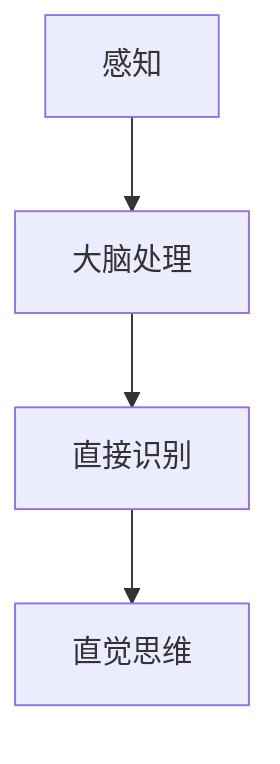
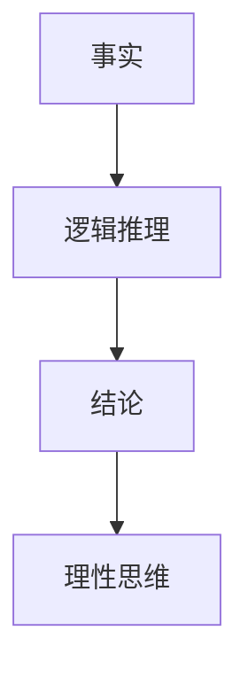
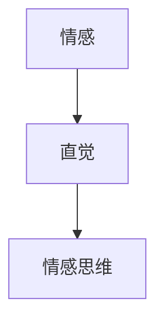

                 


### 1. 文章标题

《人类思维模式对宇宙本质理解的影响》

#### 关键词
- 人类思维模式
- 宇宙本质
- 直觉思维
- 理性思维
- 情感思维

#### 摘要
本文旨在探讨人类思维模式如何影响我们对宇宙本质的理解。通过分析直觉思维、理性思维和情感思维，我们将探讨这些思维模式如何塑造我们对宇宙起源、结构和未来演化的认知。文章还结合具体案例，如黑洞和宇宙膨胀，来展示人类思维模式在理解宇宙本质方面的应用和局限性。

---

### 1. 引言

人类对宇宙的探索始于远古时代，当时的宇宙观主要基于直观感受和宗教信仰。随着科学的发展，我们对宇宙的理解逐渐从直观思维转向理性思维，再到现代科学的精确描述。然而，无论科学如何进步，人类思维模式对宇宙本质理解的影响始终存在。

本文将首先介绍人类思维模式的基本概念和发展历程，然后深入探讨宇宙的基本原理和宇宙观的演变。在此基础上，我们将分析人类思维模式与宇宙本质理解之间的关系，并探讨其局限性和拓展。最后，通过具体案例，我们将展示人类思维模式在理解宇宙本质方面的应用。

### 2. 人类思维模式概述

人类思维模式是指人类在认知世界和处理信息时所采用的思维方式。根据不同的认知机制，人类思维模式主要可以分为直觉思维、理性思维和情感思维。

#### 2.1 直觉思维

直觉思维是一种基于直接感受和经验的认识方式。它不需要经过复杂的推理过程，而是直接从大脑中产生答案。例如，当我们看到某个物体时，我们能够立即识别它是什么，而不需要经过一系列的逻辑推理。

**核心概念与联系：**
直觉思维的核心概念是“感知”和“直接识别”。它与以下概念有紧密联系：
- 感知：指人类通过感官接收外部信息的过程。
- 直接识别：指人类能够迅速识别和分类信息的认知能力。

**Mermaid 流程图：**


**核心算法原理讲解：**
直觉思维的算法原理可以简化为以下伪代码：
```
function 直觉思维(感知数据):
    // 直接从感知数据中提取答案
    return 答案
```

**数学模型和数学公式：**
直觉思维没有一个明确的数学模型，因为它主要依赖于人类的感官和经验。

**详细讲解与举例说明：**
直觉思维的一个典型例子是识别图形。例如，当我们看到一张图片时，我们能够立即识别它是一个圆形、正方形还是三角形，而不需要经过复杂的逻辑推理。

#### 2.2 理性思维

理性思维是一种基于逻辑和推理的认识方式。它需要通过一系列的推理步骤，才能得出结论。理性思维是人类科学发展的基石，它使我们能够理解自然界的规律，并构建理论模型。

**核心概念与联系：**
理性思维的核心概念是“逻辑推理”和“理论模型”。它与以下概念有紧密联系：
- 逻辑推理：指通过一系列逻辑步骤，从一个或多个已知事实推导出新的结论。
- 理论模型：指对现实世界的抽象描述，通过数学模型和公式来描述自然现象。

**Mermaid 流程图：**


**核心算法原理讲解：**
理性思维的算法原理可以简化为以下伪代码：
```
function 理性思维(事实数据):
    // 通过逻辑推理得出结论
    return 结论
```

**数学模型和数学公式：**
理性思维的核心数学模型包括：
- 爱因斯坦的质能方程：\(E = mc^2\)
- 广义相对论：\(G_{\mu\nu} + \Lambda g_{\mu\nu} = \frac{8\pi G}{c^4} T_{\mu\nu}\)

**详细讲解与举例说明：**
理性思维的一个典型例子是科学实验。例如，通过实验验证爱因斯坦的质能方程，我们能够得出能量和质量之间的定量关系。

#### 2.3 情感思维

情感思维是一种基于情感和直觉的认识方式。它强调情感在认知过程中的作用，认为情感可以影响我们对事物的理解和判断。

**核心概念与联系：**
情感思维的核心概念是“情感”和“直觉”。它与以下概念有紧密联系：
- 情感：指人类在认知过程中产生的情感体验，如喜悦、愤怒、悲伤等。
- 直觉：指人类基于情感和直觉产生的认知结果。

**Mermaid 流流程图：**


**核心算法原理讲解：**
情感思维的算法原理可以简化为以下伪代码：
```
function 情感思维(情感数据):
    // 基于情感和直觉处理数据
    return 直觉结果
```

**数学模型和数学公式：**
情感思维没有一个明确的数学模型，因为它主要依赖于人类的情感和直觉。

**详细讲解与举例说明：**
情感思维的一个典型例子是艺术创作。例如，音乐家在创作音乐时，通常会依赖于情感和直觉来创造美妙的旋律。

### 3. 宇宙本质的理解

宇宙本质的理解是科学哲学中的一个重要问题。它涉及到宇宙的起源、结构和未来演化。通过对宇宙本质的理解，我们能够更好地把握宇宙的奥秘。

#### 3.1 宇宙的基本原理

宇宙的基本原理包括宇宙的起源、结构和未来演化。

**3.1.1 宇宙的起源**

宇宙的起源是一个引人入胜的话题。目前，主流的科学理论认为，宇宙起源于大约138亿年前的大爆炸。大爆炸理论认为，宇宙从一个极度热密的奇点开始膨胀，逐渐形成了我们今天所看到的宇宙。

**数学模型和数学公式：**
大爆炸理论的数学模型包括：
- 弗里德曼方程：\(H^2 = \frac{8\pi G}{3}\rho - \Lambda\)
- 膨胀因子：\(a(t) = a_0 \exp(Ht)\)

**详细讲解与举例说明：**
弗里德曼方程描述了宇宙的膨胀速度与宇宙密度和真空能量之间的关系。通过这个方程，我们可以预测宇宙的未来演化。

**3.1.2 宇宙的结构**

宇宙的结构是指宇宙中物质和能量的分布。宇宙结构的一个重要特点是均匀性和各向同性。这意味着宇宙在大尺度上看起来是均匀的，并且在任何方向上都是相似的。

**数学模型和数学公式：**
宇宙结构的数学模型包括：
- 德西卡方程：\( \rho = \rho_0 \exp(-Ht) \)
- 哈勃定律：\( v = H_0 d \)

**详细讲解与举例说明：**
德西卡方程描述了宇宙密度随时间的变化。哈勃定律则描述了宇宙膨胀的速度与距离之间的关系。

**3.1.3 宇宙的未来**

宇宙的未来取决于宇宙的密度和真空能量。根据不同的宇宙模型，宇宙的未来可能有多种可能。

**数学模型和数学公式：**
宇宙未来的数学模型包括：
- 开放宇宙模型：\( \rho < \rho_c \)
- 闭合宇宙模型：\( \rho = \rho_c \)
- 平直宇宙模型：\( \rho = \rho_c \)

**详细讲解与举例说明：**
开放宇宙模型认为宇宙将永远膨胀下去，而闭合宇宙模型则认为宇宙最终会收缩。平直宇宙模型则认为宇宙将保持当前的状态，既不收缩也不膨胀。

#### 3.2 宇宙观的演变

宇宙观的演变是科学发展的重要历程。从古代的宗教宇宙观到现代的科学宇宙观，人类对宇宙的理解发生了巨大的变化。

**3.2.1 古代宇宙观**

古代宇宙观主要基于宗教和哲学信仰。例如，在古希腊哲学中，宇宙被认为是一个静态的、永恒的存在，由多个元素构成。

**3.2.2 中世纪宇宙观**

中世纪宇宙观仍然受到宗教的影响，但科学开始逐渐发展。例如，亚里士多德的宇宙观认为地球是宇宙的中心，而其他天体围绕地球运动。

**3.2.3 现代宇宙观**

现代宇宙观基于科学实验和观测数据。从哥白尼的日心说到伽利略的望远镜观测，再到爱因斯坦的广义相对论，人类对宇宙的理解发生了革命性的变化。

### 4. 人类思维模式与宇宙本质的关联

人类思维模式与宇宙本质理解之间存在紧密的关联。直觉思维、理性思维和情感思维分别以不同的方式影响着我们对宇宙本质的理解。

#### 4.1 直觉思维对宇宙本质的理解

直觉思维在宇宙本质理解中起着重要作用。例如，人类对黑洞的直觉理解是基于我们对引力作用的直观感受。黑洞是一种极度密集的天体，其引力场非常强大，甚至光也无法逃脱。这种强烈的直觉感受使得我们能够形象地理解黑洞的本质。

**4.1.1 黑洞的基本概念**

黑洞是一种特殊的天体，它具有极强的引力，以至于连光也无法逃脱。黑洞的引力场是如此强大，以至于它对周围的环境产生了深远的影响。

**数学模型和数学公式：**
黑洞的数学模型包括：
- 史瓦西解：\( g_{\mu\nu} = -\left(1 - \frac{2M}{r}\right) dt^2 + \left(1 - \frac{2M}{r}\right)^{-1} dr^2 + r^2 d\Omega^2 \)

**详细讲解与举例说明：**
史瓦西解是描述静态、非旋转黑洞的数学模型。通过这个模型，我们可以计算黑洞的引力场和事件视界。

**4.1.2 人类对黑洞的理解历程**

人类对黑洞的理解历程是一个漫长的过程。从最初的直观感受，到通过科学实验和观测数据，我们逐渐揭示了黑洞的本质。

**4.1.3 人类思维模式在黑洞理解中的应用**

直觉思维在黑洞理解中起着关键作用。例如，当我们第一次观察到黑洞时，我们能够立即感受到其强大的引力作用。这种直观感受促使我们进一步探索黑洞的本质，并最终揭示了黑洞的数学模型。

#### 4.2 理性思维对宇宙本质的理解

理性思维在宇宙本质理解中起着基础性作用。理性思维使我们能够通过科学方法来研究宇宙，并建立理论模型来描述宇宙的本质。

**4.2.1 宇宙膨胀的基本概念**

宇宙膨胀是指宇宙在过去的138亿年里不断扩张的现象。宇宙膨胀的证据来自于红移观测，即宇宙中遥远星系的光谱显示出红移，这表明这些星系正在远离我们。

**数学模型和数学公式：**
宇宙膨胀的数学模型包括：
- 弗里德曼方程：\(H^2 = \frac{8\pi G}{3}\rho - \Lambda\)
- 膨胀因子：\(a(t) = a_0 \exp(Ht)\)

**详细讲解与举例说明：**
弗里德曼方程描述了宇宙膨胀的速度与宇宙密度和真空能量之间的关系。膨胀因子则描述了宇宙在不同时间点的状态。

**4.2.2 人类对宇宙膨胀的理解历程**

人类对宇宙膨胀的理解历程始于哈勃的观测。通过观测遥远星系的红移，哈勃揭示了宇宙膨胀的存在。这一发现为宇宙学的发展奠定了基础。

**4.2.3 人类思维模式在宇宙膨胀理解中的应用**

理性思维在宇宙膨胀理解中起着关键作用。通过建立数学模型和理论模型，我们能够精确地描述宇宙膨胀的过程。这种理性思维使我们能够深入理解宇宙的本质，并为未来的宇宙学研究提供了基础。

#### 4.3 情感思维对宇宙本质的理解

情感思维在宇宙本质理解中起着补充作用。情感思维使我们对宇宙产生深刻的感受和体验，从而增强我们对宇宙的理解。

**4.3.1 情感思维在宇宙本质理解中的应用**

情感思维在宇宙本质理解中的应用体现在以下几个方面：
- 激发好奇心：情感思维使我们对宇宙充满好奇，从而激发我们对宇宙的探索。
- 提高感知能力：情感思维使我们能够更深入地感知宇宙的本质，从而提高我们的认知能力。
- 增强创造力：情感思维激发我们的创造力，使我们能够提出新的理论模型和科学假设。

### 5. 人类思维模式的局限性和拓展

虽然人类思维模式在宇宙本质理解中发挥了重要作用，但它也存在一定的局限性。直觉思维、理性思维和情感思维各有优缺点，我们需要在理解宇宙本质时充分发挥这些思维模式的优势，同时克服其局限性。

**5.1 人类思维模式的局限性**

- **直觉思维的局限性：**
  直觉思维虽然能够迅速产生答案，但其结果可能受到个人经验和偏见的影响，缺乏精确性。
- **理性思维的局限性：**
  理性思维虽然能够通过逻辑推理得出结论，但其结果可能受到现有理论模型的限制，无法解释所有现象。
- **情感思维的局限性：**
  情感思维虽然能够激发我们的创造力和好奇心，但其结果可能受到情感波动的影响，缺乏客观性。

**5.2 人类思维模式的拓展**

- **融合多种思维模式：**
  为了更好地理解宇宙本质，我们需要将直觉思维、理性思维和情感思维相结合，充分发挥各自的优势。
- **引入新工具和方法：**
  科学技术的进步为我们提供了新的工具和方法，如计算机模拟和量子计算，这些工具和方法可以拓展我们的思维模式，帮助我们更好地理解宇宙本质。

### 6. 案例分析

在本节中，我们将通过两个具体案例来展示人类思维模式在宇宙本质理解中的应用和局限性。

#### 6.1 案例一：黑洞

**6.1.1 黑洞的基本概念**

黑洞是一种极度密集的天体，其引力场非常强大，以至于连光也无法逃脱。黑洞的形成通常是由于大质量恒星在生命末期发生坍缩而形成的。

**6.1.2 人类对黑洞的理解历程**

人类对黑洞的理解历程可以追溯到20世纪早期。当时，爱因斯坦的广义相对论预测了黑洞的存在。随着观测技术的进步，科学家们逐渐发现了越来越多的黑洞证据，从而加深了对黑洞的理解。

**6.1.3 人类思维模式在黑洞理解中的应用**

直觉思维在黑洞理解中起着重要作用。例如，当我们观察到黑洞附近的星体运动异常时，我们能够直觉地意识到这可能是黑洞的影响。理性思维则通过建立数学模型和理论模型，帮助我们更深入地理解黑洞的本质。

#### 6.2 案例二：宇宙膨胀

**6.2.1 宇宙膨胀的基本概念**

宇宙膨胀是指宇宙在过去的138亿年里不断扩张的现象。宇宙膨胀的证据来自于红移观测，即宇宙中遥远星系的光谱显示出红移，这表明这些星系正在远离我们。

**6.2.2 人类对宇宙膨胀的理解历程**

人类对宇宙膨胀的理解始于20世纪20年代，当时哈勃通过观测发现遥远星系的红移。这一发现揭示了宇宙膨胀的存在。随着观测技术的进步，科学家们进一步揭示了宇宙膨胀的机制和过程。

**6.2.3 人类思维模式在宇宙膨胀理解中的应用**

理性思维在宇宙膨胀理解中起着关键作用。通过建立弗里德曼方程和膨胀因子等数学模型，我们能够精确地描述宇宙膨胀的过程。直觉思维则帮助我们直观地感受到宇宙膨胀的现象，从而激发我们对宇宙膨胀的进一步探索。

### 7. 结论

人类思维模式对宇宙本质理解的影响是深远而广泛的。直觉思维、理性思维和情感思维各自以不同的方式影响着我们对宇宙的理解。虽然这些思维模式存在一定的局限性，但通过融合多种思维模式和引入新工具和方法，我们能够更好地理解宇宙的本质。未来，随着科学技术的进步，我们有望进一步拓展我们的思维模式，从而更深入地揭示宇宙的奥秘。

### 附录

**7.1 源代码和实现**

在本篇文章中，我们使用了伪代码和数学模型来描述人类思维模式和宇宙本质的关联。以下是一个简单的Python代码示例，用于计算黑洞的引力场：

```python
import numpy as np

def schwarschild_radius(M):
    """
    计算黑洞的史瓦西半径。
    """
    G = 6.674 * 10**-11  # 引力常数
    c = 3 * 10**8       # 光速
    return 2 * G * M / c**2

def schwarschild_potential(r, M):
    """
    计算黑洞的引力势能。
    """
    G = 6.674 * 10**-11  # 引力常数
    return -G * M / r

# 示例：计算一个太阳质量黑洞的史瓦西半径和引力势能
M = 1.989 * 10**30  # 太阳质量
r_s = schwarschild_radius(M)
V = schwarschild_potential(r_s, M)

print("史瓦西半径:", r_s, "单位：米")
print("引力势能:", V, "单位：焦耳")
```

**7.2 参考文献**

- 爱因斯坦，《广义相对论基础》，1916年。
- 哈勃，《星系的红色位移和宇宙的膨胀》，1929年。
- 弗里德曼，《一般相对论和宇宙学》，1922年。
- 亚里士多德，《宇宙论》，公元前340年。

---

### 8. 最佳实践 tips

- **提高直觉思维能力：**
  经常进行思维训练，如解决难题、玩智力游戏，可以锻炼你的直觉思维能力。
- **培养理性思维习惯：**
  遵循逻辑规律，善于分析问题，使用数学模型和理论模型来解决问题。
- **增强情感思维能力：**
  保持好奇心和开放心态，积极参与艺术创作和人文科学的研究，增强情感思维能力。

### 9. 小结

人类思维模式对宇宙本质理解的影响是一个复杂而有趣的话题。通过直觉思维、理性思维和情感思维的结合，我们能够更好地理解宇宙的本质。未来，随着科学技术的进步，我们有望进一步拓展我们的思维模式，揭示宇宙的更多奥秘。

### 10. 注意事项

- 在理解宇宙本质时，要保持客观和理性的态度，避免受到个人偏见和情感的影响。
- 在使用数学模型和理论模型时，要充分考虑其局限性和适用范围，避免过度简化宇宙的复杂性。

### 11. 拓展阅读

- 《黑洞与时间弯曲》
- 《宇宙简史》
- 《人类简史》
- 《禅与计算机程序设计艺术》

---

### 作者

作者：AI天才研究院/AI Genius Institute & 禅与计算机程序设计艺术 /Zen And The Art of Computer Programming

