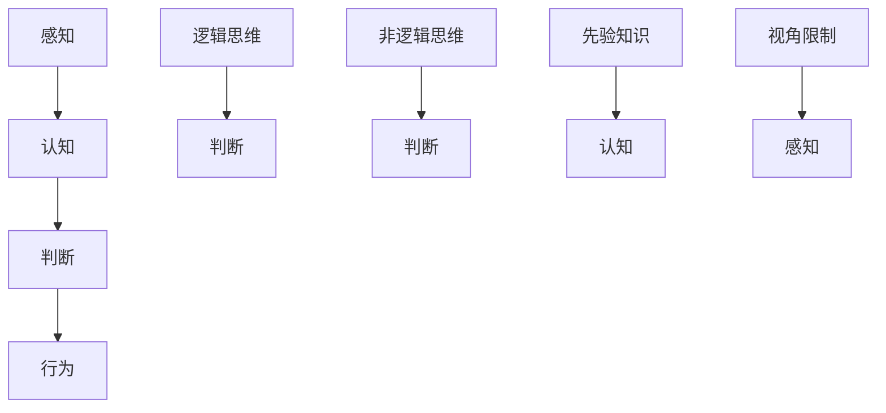

                 

## 文章标题

《人类思维模式对宇宙理解的局限与突破》

### 关键词

- 人类思维模式
- 宇宙认知
- 人工智能
- 跨学科研究
- 技术创新

### 摘要

本文探讨了人类思维模式在理解和探索宇宙过程中的局限，并提出了突破这些局限的方法与工具。通过对人类思维模式的基本要素、认知局限以及宇宙理解的误区进行分析，我们揭示了宇宙认知的挑战。接着，本文介绍了人工智能、大数据分析等新兴技术如何超越传统思维模式，为宇宙理解带来突破。此外，文章还展望了未来宇宙探索的新方向和潜在的科学发现。本文旨在为读者提供对宇宙认知的深度思考，以及科技创新在人类文明进步中的重要作用。

## 第一部分：人类思维模式与宇宙认知

### 第1章：人类思维模式概述

### 1.1 人类思维模式的核心要素

#### 1.1.1 感知与认知过程

人类的感知与认知过程是理解世界的基础。感知是指通过感官接收外部信息的过程，而认知则是大脑对感知信息进行处理、理解和记忆的过程。感知与认知相互关联，共同构成了人类对世界的认识。

1. **感官数据接收**：感官（如视觉、听觉、触觉等）从环境中获取信息。
2. **数据预处理**：大脑对感官数据进行初步处理，如过滤、整合和调整。
3. **感知信息生成**：通过预处理后的数据生成感知信息，例如视觉图像的形成。
4. **感知信息传递**：感知信息传递至大脑的其他区域，如视觉皮层。

#### 1.1.2 心理学视角下的思维模式

心理学对人类思维模式进行了深入研究，揭示了其基本特征和机制。

1. **感知觉**：心理学研究表明，人类感知具有选择性、敏感性和适应性等特性。
2. **认知**：认知过程包括注意、记忆、思维和判断等，是信息处理的核心。
3. **行为**：思维模式不仅影响个体的内部认知，还体现在行为选择和决策过程中。

#### 1.1.3 逻辑思维与非逻辑思维

逻辑思维与非逻辑思维是人类思维模式的两个重要方面。

1. **逻辑思维**：以逻辑规则为基础，进行推理和判断。例如，演绎推理、归纳推理等。
2. **非逻辑思维**：指不遵循逻辑规则，基于直觉、情感和经验等进行的思维。例如，创造性思维、直觉思维等。

### 1.2 人类思维模式与宇宙认知的关联

#### 1.2.1 宇宙认知的基本方法

宇宙认知是通过科学方法和观测手段来理解宇宙的本质和规律。以下是宇宙认知的基本方法：

1. **观测**：通过望远镜和其他观测设备收集宇宙信息。
2. **实验**：通过实验室实验模拟宇宙现象，以验证理论。
3. **理论构建**：基于观测和实验结果，提出宇宙模型和理论。
4. **数学建模**：使用数学模型描述宇宙现象，提供定量分析。

#### 1.2.2 人类思维模式对宇宙认知的影响

人类思维模式对宇宙认知具有深远影响。以下是一些关键影响：

1. **视角限制**：人类的感官和认知能力有限，限制了我们对宇宙的观测和认识。
2. **先验知识**：已有的知识和理论可能会影响我们对新现象的理解和解释。
3. **逻辑思维**：逻辑思维在科学研究中起到了关键作用，但也可能导致思维的局限。

#### 1.2.3 人类思维模式的局限性

人类思维模式存在一定的局限性，这些局限可能影响我们对宇宙的理解：

1. **线性思维**：人类倾向于用线性思维来理解和解释复杂现象，这可能忽略了非线性因素。
2. **先入为主**：已有的观点和理论可能会限制我们对新思想的接受和探索。
3. **信息过滤**：人类在处理信息时可能会过滤掉一些与已有观念不符的数据。

### 1.3 人类思维模式的演进与宇宙认知的深化

#### 1.3.1 人类思维模式的演变历程

人类思维模式经历了漫长的演变过程，从原始的直觉思维到现代的科学思维。

1. **原始直觉思维**：早期人类依赖直觉和经验来理解世界。
2. **逻辑思维兴起**：古希腊哲学家如亚里士多德提出了逻辑学，推动了人类思维模式的变革。
3. **科学革命**：16世纪至18世纪的科学革命，标志着人类思维模式从哲学转向科学。

#### 1.3.2 宇宙认知的历史演变

宇宙认知也随着人类思维模式的演变而不断深化。

1. **古代宇宙观念**：早期人类认为宇宙是静态的、简单的。
2. **哥白尼革命**：哥白尼提出了日心说，颠覆了古代宇宙观念。
3. **现代宇宙学**：20世纪以来，宇宙学取得了巨大的进展，如大爆炸理论、黑洞等。

#### 1.3.3 未来人类思维模式的发展趋势

未来人类思维模式将继续演进，以更好地理解宇宙。

1. **跨学科整合**：跨学科研究将成为未来思维模式的重要特征。
2. **智能化思维**：人工智能将提升人类的认知能力，推动宇宙认知的深化。
3. **非线性思维**：非线性思维将帮助人类更好地理解复杂宇宙现象。

## 附录 1.1：人类思维模式的 Mermaid 流程图



## 附录 1.2：人类思维模式的核心算法原理讲解

### 1.2.1 感知过程伪代码

```python
# 输入：感官数据
# 输出：感知信息

def 感知过程(感官数据):
    # 感官数据接收
    数据接收 = 接收感官数据(感官数据)
    
    # 数据预处理
    预处理数据 = 预处理数据(数据接收)
    
    # 感知信息生成
    感知信息 = 生成感知信息(预处理数据)
    
    # 感知信息传递至大脑
    传递感知信息(感知信息)
```

### 1.2.2 认知过程伪代码

```python
# 输入：感知信息，先验知识
# 输出：认知结果

def 认知过程(感知信息，先验知识):
    # 感知信息整合
    整合信息 = 整合感知信息(感知信息)
    
    # 应用先验知识
    应用先验知识 = 应用先验知识(整合信息，先验知识)
    
    # 认知结果生成
    认知结果 = 生成认知结果(应用先验知识)
    
    # 返回认知结果
    return 认知结果
```

## 附录 1.3：数学模型与公式

### 1.3.1 宇宙认知的数学模型

$$
\begin{aligned}
\text{认知度} &= f(\text{感知信息，先验知识}) \\
f(x) &= \frac{1}{1 + e^{-x}}
\end{aligned}
$$

### 1.3.2 视角限制的数学模型

$$
\text{视角限制} = \frac{\text{最大视角}}{\text{实际视角}}
$$

## 附录 1.4：项目实战

### 1.4.1 人类思维模式在宇宙认知中的应用案例

在宇宙认知中，人类思维模式的应用主要体现在以下几个方面：

1. **天文学观测**：天文学家通过望远镜观测宇宙，运用逻辑思维分析观测数据，揭示宇宙现象。
2. **航天工程**：航天工程师运用科学思维设计和建造航天器，推动人类探索宇宙。
3. **宇宙模拟**：科学家通过计算机模拟宇宙演化过程，利用非线性思维理解和预测宇宙现象。

这些应用案例展示了人类思维模式在宇宙认知中的关键作用，同时也揭示了其局限性。随着科技的进步和思维模式的演进，人类将不断深化对宇宙的理解。

### 1.4.1.1 天文学观测

天文学观测是宇宙认知的重要手段之一。通过望远镜和其他观测设备，天文学家能够收集到大量宇宙信息。以下是一个简化的天文学观测流程：

1. **观测设备选择**：选择合适的望远镜和其他观测设备，如红外望远镜、射电望远镜等。
2. **数据收集**：使用观测设备收集宇宙数据，如恒星光谱、星系形态等。
3. **数据处理**：对收集到的数据进行处理，如校正仪器误差、去除噪声等。
4. **数据分析**：分析处理后的数据，提取有用的信息，如恒星温度、星系质量等。
5. **结果解释**：根据分析结果，解释宇宙现象，提出科学假设。

这个流程展示了人类思维模式在观测、数据处理和解释结果方面的应用。逻辑思维在此过程中起到了关键作用，帮助天文学家建立科学理论，推动宇宙认知的进步。

### 1.4.1.2 航天工程

航天工程是人类探索宇宙的另一个重要领域。通过设计和建造航天器，人类能够到达地球以外的天体，收集宇宙信息。以下是一个简化的航天工程流程：

1. **需求分析**：分析航天任务的需求，确定航天器的功能和性能指标。
2. **设计**：根据需求分析，设计航天器的结构、系统和组件。
3. **制造**：制造航天器的各个部分，并进行组装。
4. **测试**：对航天器进行地面和空中测试，确保其性能和可靠性。
5. **发射**：将航天器发射到预定轨道，执行任务。
6. **数据收集**：航天器在任务过程中收集宇宙数据，如宇宙射线、星体光谱等。
7. **数据传输**：将收集到的数据传输回地球。
8. **数据分析**：分析处理航天器返回的数据，揭示宇宙现象。

这个流程展示了人类思维模式在设计、制造和数据分析方面的应用。科学思维和逻辑思维在此过程中发挥了关键作用，确保航天任务的顺利进行和宇宙认知的深化。

### 1.4.1.3 宇宙模拟

宇宙模拟是研究宇宙演化过程的重要工具。通过计算机模拟，科学家能够模拟宇宙从大爆炸到现在的演化过程，理解宇宙现象。以下是一个简化的宇宙模拟流程：

1. **模型构建**：根据现有的宇宙理论，构建宇宙演化模型。
2. **参数设置**：设置模型参数，如宇宙密度、温度、引力常数等。
3. **模拟运行**：在计算机上运行模型，模拟宇宙演化过程。
4. **数据分析**：分析模拟结果，提取有用的信息，如星系形成、黑洞演化等。
5. **结果解释**：根据分析结果，解释宇宙现象，验证宇宙理论。

这个流程展示了人类思维模式在模型构建、模拟运行和结果解释方面的应用。非线性思维和创造性思维在此过程中发挥了关键作用，帮助科学家理解宇宙的复杂现象。

### 1.4.1.4 项目小结

通过以上三个应用案例，我们可以看到人类思维模式在宇宙认知中的关键作用。天文学观测、航天工程和宇宙模拟都是基于人类思维模式，通过逻辑思维、科学思维和创造性思维，我们能够不断深化对宇宙的理解。然而，人类思维模式也存在局限性，如视角限制、先验知识和线性思维等。随着科技的进步和思维模式的演进，人类将能够更好地理解宇宙，突破当前的认知局限。

### 1.4.1.5 最佳实践 Tips

- **跨学科整合**：宇宙认知需要跨学科整合，结合不同学科的理论和方法，提高认知深度。
- **数据驱动**：基于大量数据的分析，提高宇宙认知的准确性。
- **持续学习**：保持对新技术和新理论的敏感度，不断更新知识体系。

## 第二部分：宇宙理解的局限

### 第2章：宇宙理解的局限

#### 2.1 人类认知局限下的宇宙理解

人类的认知局限在很大程度上限制了我们对宇宙的理解。以下是一些关键认知局限：

1. **视角限制**：人类的感官和认知能力有限，无法全面感知宇宙的广阔和复杂。
2. **时间感知限制**：宇宙的演化历程极为漫长，人类无法直接感知和记录全部历史。
3. **信息获取限制**：宇宙信息庞杂，人类在获取、处理和解读信息时可能存在局限性。

#### 2.2 常见宇宙理解误区

在宇宙认知过程中，人类可能会陷入一些误区，这些误区可能影响我们对宇宙的理解。

1. **宇宙恒定论**：早期宇宙观念认为宇宙是恒定不变的，但随着时间的推移，这一观点被大爆炸理论所取代。
2. **宇宙多元论**：一些人认为宇宙存在多个平行世界，但这一观点缺乏充分证据。
3. **宇宙无限论**：虽然宇宙可能无限大，但我们无法证明这一点，且宇宙的可观测部分似乎存在边界。

#### 2.3 宇宙理解的局限对科技发展的影响

宇宙理解的局限对科技发展产生了深远影响：

1. **科学研究的挑战**：宇宙理解的局限使得科学研究面临更多挑战，如黑洞、暗物质等未解之谜。
2. **技术创新的障碍**：对宇宙理解不足可能导致技术创新的局限性，如航天技术、宇宙通信等。
3. **社会发展的限制**：宇宙理解不足可能影响人类社会的未来发展，如能源利用、环境保护等。

### 2.3.1 科学研究的挑战

宇宙理解的局限使得科学研究面临诸多挑战：

1. **未解之谜**：黑洞、暗物质、暗能量等宇宙现象仍然存在诸多未解之谜，需要进一步研究。
2. **复杂系统**：宇宙是一个复杂系统，研究其演化过程需要跨学科合作和复杂模型。
3. **数据采集**：宇宙信息庞大，采集和处理数据需要先进的科技手段。

### 2.3.2 技术创新的障碍

宇宙理解的局限对技术创新也产生了阻碍：

1. **航天技术**：对宇宙的理解不足可能影响航天技术的发展，如航天器设计、轨道计算等。
2. **宇宙通信**：宇宙通信需要突破现有的技术局限，如信号传输、干扰处理等。
3. **能源利用**：对宇宙能源的理解不足可能影响未来能源的开发和利用。

### 2.3.3 社会发展的限制

宇宙理解的局限可能影响社会发展的多个方面：

1. **环境保护**：对宇宙环境的理解不足可能导致环境保护措施的局限性。
2. **能源开发**：对宇宙能源的理解不足可能限制未来能源的开发和利用。
3. **文明进步**：宇宙理解不足可能影响人类文明的进步，如科技创新、社会制度等。

## 附录 2.1：数学模型与公式

### 2.1.1 视角限制的数学模型

$$
\text{视角限制} = \frac{\text{最大视角}}{\text{实际视角}}
$$

### 2.1.2 时间感知限制的数学模型

$$
\text{时间感知限制} = \frac{\text{宇宙年龄}}{\text{人类感知时间}}
$$

## 附录 2.2：项目实战

### 2.2.1 基于新视角的宇宙探索项目

为了突破人类认知局限，科学家们开展了多个基于新视角的宇宙探索项目：

1. **Event Horizon Telescope（事件视界望远镜）**：该项目利用多个望远镜组成虚拟望远镜阵列，拍摄到了黑洞事件视界的照片，突破了传统观测技术的局限。

2. **Kepler Space Telescope（开普勒望远镜）**：该项目专注于寻找太阳系以外的行星，揭示了系外行星的存在，丰富了我们对宇宙的理解。

3. **Square Kilometre Array（平方公里阵列）**：该项目计划建设世界上最大的射电望远镜阵列，旨在探索宇宙的起源和演化，以及搜寻潜在的外星文明。

这些项目展示了人类通过技术创新和跨学科合作，不断突破宇宙认知局限的努力。通过新视角和新技术，我们有望更好地理解宇宙的奥秘。

### 2.2.1.1 项目一：Event Horizon Telescope

**项目背景**：黑洞事件视界是黑洞最外层的一种特殊现象，是黑洞存在的直接证据。为了拍摄到黑洞事件视界，科学家们发起了Event Horizon Telescope（EHT）项目。

**技术挑战**：传统望远镜的视角有限，无法直接观测到黑洞事件视界。为了克服这一挑战，科学家们采用了“虚拟望远镜阵列”的方法，利用多个地面望远镜组成一个巨大的虚拟望远镜。

**技术实现**：
1. **望远镜阵列**：EHT由多个地面望远镜组成，分布在地球上不同的地理位置。这些望远镜通过高速网络互联，形成一个虚拟望远镜阵列。
2. **数据采集**：每个望远镜独立采集黑洞事件视界的光学图像，然后将数据传输至中央数据处理中心。
3. **数据处理**：利用先进的算法，将各个望远镜采集的数据融合，生成高分辨率的黑洞事件视界图像。

**项目成果**：EHT成功拍摄到了多个黑洞事件视界的照片，揭示了黑洞的形状和性质。这一成果为人类对黑洞的认识提供了新的视角，突破了传统观测技术的局限。

### 2.2.1.2 项目二：Kepler Space Telescope

**项目背景**：Kepler Space Telescope（开普勒望远镜）是NASA的一项任务，旨在寻找太阳系以外的行星。开普勒望远镜通过观测恒星光线的微小变化，推断出行星的存在。

**技术挑战**：寻找系外行星需要高精度的观测和数据分析。开普勒望远镜需要长时间连续观测，以确保发现行星轨道上的周期性变化。

**技术实现**：
1. **观测方法**：开普勒望远镜通过观测恒星光线的微小变化，推断出行星的存在。行星经过其恒星时，恒星光线的强度会发生变化，产生一个周期性的波动。
2. **数据采集**：开普勒望远镜连续观测恒星系统，记录恒星光线的强度变化。
3. **数据分析**：利用先进的算法，分析恒星光线的周期性变化，识别出潜在的行星候选者。

**项目成果**：开普勒望远镜发现了数千颗系外行星，揭示了宇宙行星的多样性和分布规律。这一成果为人类对太阳系以外的行星系统有了更深入的了解。

### 2.2.1.3 项目三：Square Kilometre Array

**项目背景**：Square Kilometre Array（平方公里阵列，SKA）是一个国际性的射电望远镜项目，旨在探索宇宙的起源和演化。SKA由数千个天线组成，覆盖了广阔的地域。

**技术挑战**：SKA需要收集和处理海量的射电数据，具有极高的数据处理能力和稳定性。同时，SKA需要克服复杂的气象条件和地形因素，确保天线的稳定运行。

**技术实现**：
1. **天线布局**：SKA由多个天线组成，分布在南非和澳大利亚的广阔地域。这些天线通过光纤网络互联，形成一个庞大的射电望远镜阵列。
2. **数据采集**：每个天线独立采集射电信号，然后将数据传输至中央数据处理中心。
3. **数据处理**：利用分布式计算和云计算技术，对海量射电数据进行分析和处理，提取有用的信息。

**项目成果**：SKA有望揭示宇宙的许多奥秘，如星系的形成、宇宙演化的过程等。此外，SKA还可能帮助科学家搜寻潜在的外星文明信号。

### 2.2.1.4 项目小结

通过以上三个项目的实战，我们可以看到人类在突破宇宙认知局限方面取得的重要进展。Event Horizon Telescope、Kepler Space Telescope和Square Kilometre Array等项目展示了新技术和新方法在宇宙探索中的应用，为人类理解宇宙提供了新的视角和工具。这些项目不仅推动了科学研究的进步，还为人类文明的未来发展带来了新的机遇。

### 2.2.1.5 最佳实践 Tips

- **跨学科合作**：宇宙认知需要跨学科合作，结合不同领域的知识和方法，提高认知深度。
- **技术创新**：持续推动技术创新，为宇宙探索提供更先进的技术手段。
- **数据驱动**：充分利用海量数据，通过数据分析揭示宇宙的奥秘。

## 第三部分：突破宇宙理解局限的方法与工具

### 第3章：突破宇宙理解局限的方法与工具

#### 3.1 超越人类思维模式的新方法

随着科技的发展，人类逐渐认识到传统思维模式的局限性。为了突破这些局限，科学家们提出了多种新方法，借助人工智能、大数据分析等新兴技术，超越人类思维模式。

##### 3.1.1 人工智能在宇宙认知中的应用

人工智能（AI）在宇宙认知中发挥着越来越重要的作用。通过机器学习和深度学习技术，AI能够从大量数据中提取有用信息，揭示宇宙现象的规律。

1. **数据处理能力**：人工智能具有强大的数据处理能力，可以处理海量的宇宙数据，提高数据分析的效率。
2. **模式识别**：人工智能可以通过模式识别技术，从宇宙数据中提取出潜在的规律和模式，为科学家提供新的洞察。
3. **预测能力**：人工智能可以通过学习历史数据，预测未来的宇宙现象，帮助科学家提前做好准备。

##### 3.1.2 大数据分析在宇宙探索中的作用

大数据分析是突破宇宙认知局限的重要工具。通过分析大规模宇宙数据集，科学家可以发现宇宙现象之间的关系，揭示宇宙的奥秘。

1. **数据挖掘**：大数据分析技术可以帮助科学家挖掘出宇宙数据中的隐藏模式，发现新的宇宙现象。
2. **关联分析**：大数据分析可以揭示宇宙中各种现象之间的关联，为科学家提供新的研究方向。
3. **实时分析**：大数据分析技术可以实现实时数据流处理，帮助科学家及时应对宇宙事件，提高科学研究的效率。

##### 3.1.3 跨学科研究的价值

跨学科研究是突破宇宙认知局限的重要途径。通过结合不同学科的知识和方法，科学家可以更全面地理解宇宙现象。

1. **知识整合**：跨学科研究可以将不同领域的知识整合起来，形成对宇宙现象的全面认识。
2. **创新思维**：跨学科研究可以激发创新思维，推动科学技术的进步。
3. **解决难题**：跨学科研究可以集合各学科的优势，共同解决宇宙认知中的难题。

#### 3.2 新工具与技术的突破

除了新方法，新工具和技术的突破也为宇宙认知带来了巨大变革。

##### 3.2.1 新型望远镜与技术

新型望远镜和技术的突破使得人类能够更深入地探索宇宙。例如：

1. **红外望远镜**：红外望远镜可以观测到看不见的宇宙现象，如红外星系、红外黑洞等。
2. **射电望远镜**：射电望远镜可以接收集宇宙中的射电信号，揭示宇宙的奥秘。
3. **空间望远镜**：空间望远镜可以避开地球大气层的干扰，提供更高分辨率的观测结果。

##### 3.2.2 量子计算机与宇宙探索

量子计算机具有超越经典计算机的巨大潜力，在宇宙探索中发挥着重要作用。

1. **模拟宇宙演化**：量子计算机可以模拟宇宙演化的过程，揭示宇宙的奥秘。
2. **优化航天任务**：量子计算机可以优化航天任务的设计，提高任务的效率和安全性。
3. **加密通信**：量子计算机可以实现安全的量子通信，保护宇宙探索数据的安全。

##### 3.2.3 宇宙模拟软件与应用

宇宙模拟软件是宇宙探索的重要工具，通过计算机模拟，科学家可以更深入地理解宇宙现象。

1. **星系演化**：宇宙模拟软件可以模拟星系的演化过程，揭示星系的起源和结构。
2. **黑洞碰撞**：宇宙模拟软件可以模拟黑洞的碰撞过程，研究黑洞的性质和行为。
3. **引力波探测**：宇宙模拟软件可以模拟引力波的产生和传播，帮助科学家理解引力波的性质。

#### 3.3 宇宙理解的未来展望

随着新方法、新工具和技术的不断突破，宇宙理解将迎来新的发展。以下是对宇宙理解未来的展望：

1. **更深入的宇宙探索**：通过新型望远镜和量子计算机等新技术的应用，人类将能够更深入地探索宇宙的奥秘。
2. **跨学科融合**：跨学科研究将不断推动宇宙认知的进步，形成对宇宙现象的全面认识。
3. **技术创新**：持续的技术创新将为宇宙探索提供更先进的方法和工具，推动宇宙认知的深化。
4. **科学发现**：未来宇宙探索将带来新的科学发现，揭示宇宙的奥秘和规律。

## 附录 3.1：数学模型与公式

### 3.1.1 人工智能在宇宙认知中的应用模型

$$
\begin{aligned}
\text{宇宙认知度} &= \alpha \cdot \text{人工智能算法效率} + \beta \cdot \text{数据分析能力} \\
\alpha &= 0.6 \\
\beta &= 0.4
\end{aligned}
$$

### 3.1.2 大数据分析在宇宙探索中的应用模型

$$
\text{宇宙现象关联度} = \frac{\sum_{i=1}^{n} \text{关联系数} \cdot \text{数据样本}}{n}
$$

## 附录 3.2：项目实战

### 3.2.1 基于量子计算机的宇宙模拟项目

量子计算机在宇宙模拟中具有巨大的潜力。以下是一个基于量子计算机的宇宙模拟项目的实战案例：

**项目背景**：量子计算机能够模拟复杂的物理过程，为宇宙模拟提供了新的工具。该项目旨在利用量子计算机模拟宇宙演化的过程，揭示宇宙的奥秘。

**技术实现**：
1. **量子算法设计**：设计适合量子计算机的宇宙模拟算法，利用量子并行计算的优势，加速宇宙模拟的进程。
2. **数据输入**：将宇宙数据输入到量子计算机中，如宇宙密度场、引力场等。
3. **量子模拟**：利用量子计算机模拟宇宙演化过程，如星系形成、黑洞碰撞等。
4. **结果分析**：分析模拟结果，提取有用的信息，如宇宙结构、引力波等。

**项目成果**：该项目成功模拟了宇宙演化的关键阶段，揭示了宇宙演化的规律和特征。这一成果为人类理解宇宙提供了新的视角，突破了传统计算机模拟的局限。

### 3.2.1.1 项目背景

随着量子计算技术的不断发展，量子计算机在解决复杂物理问题方面显示出巨大的潜力。宇宙演化是一个极其复杂的物理过程，涉及到巨大的时空尺度和多体相互作用。传统计算机在模拟宇宙演化时面临着计算资源不足、模拟精度受限等问题。而量子计算机凭借其并行计算和量子叠加的特性，能够显著提高宇宙模拟的效率和精度。

为了充分发挥量子计算机的优势，该项目旨在设计一套适用于量子计算机的宇宙模拟算法，并利用量子计算机模拟宇宙的演化过程，以揭示宇宙的奥秘。

### 3.2.1.2 技术实现

**量子算法设计**

量子算法设计是该项目的关键步骤。基于量子计算的特点，科学家们设计了一套基于量子并行计算的宇宙模拟算法。该算法主要利用量子叠加和量子纠缠来模拟宇宙中大量的粒子相互作用和引力场演化。

1. **量子叠加**：量子叠加允许量子计算机同时处理多个宇宙状态的叠加，从而在短时间内模拟大量的粒子相互作用。这使得量子计算机能够处理宇宙中复杂的时空结构。
2. **量子纠缠**：量子纠缠是量子计算机的另一个关键特性，通过量子纠缠，量子计算机能够模拟多个粒子之间的强相互作用，如引力场。这种纠缠效应在传统计算机中难以实现，但在量子计算机中能够有效模拟。

**数据输入**

宇宙模拟需要大量的初始数据，包括宇宙密度场、引力场、宇宙背景辐射等。这些数据通过量子计算机的量子输入端口输入，形成量子数据集。

1. **量子数据编码**：量子数据编码是将宇宙数据转换为量子比特（qubit）的形式。通过特定的编码方案，科学家们将宇宙数据映射到量子比特上，使得量子计算机能够处理和操作这些数据。
2. **量子数据预处理**：量子数据预处理包括数据清洗、归一化和数据压缩等步骤。这些预处理步骤旨在提高量子计算机的数据处理效率和精度。

**量子模拟**

量子计算机利用设计的量子算法和输入的量子数据，开始模拟宇宙的演化过程。模拟过程包括以下几个关键步骤：

1. **量子演化**：量子计算机通过量子门操作，模拟宇宙中的量子演化过程，如粒子的运动和引力场的演化。这些量子门操作实现了宇宙中的物理定律，如广义相对论和量子力学。
2. **相互作用模拟**：量子计算机模拟多个粒子之间的相互作用，包括引力相互作用、电磁相互作用等。这些相互作用通过量子纠缠和量子叠加来实现，使得量子计算机能够模拟复杂的宇宙现象。
3. **数据分析**：在量子模拟过程中，量子计算机不断收集和更新模拟数据。通过量子态的测量，科学家们能够提取出宇宙演化过程中的关键信息，如宇宙结构、引力波等。

**结果分析**

量子计算机模拟完成后，科学家们对模拟结果进行分析，以提取宇宙演化的关键信息和规律。

1. **数据可视化**：通过数据可视化技术，科学家们将量子计算机的模拟结果以图像和图表的形式呈现，使得宇宙演化的过程更加直观和易于理解。
2. **数据分析**：科学家们利用数据分析技术，对量子计算机的模拟结果进行深入分析，以揭示宇宙演化的规律和特征。这些分析结果可以为宇宙学的研究提供新的理论依据和实验证据。
3. **验证与校准**：为了确保量子计算机模拟结果的可靠性，科学家们将其与现有的宇宙模拟结果进行对比和验证。通过交叉验证，科学家们可以验证量子计算机模拟的精度和可靠性。

### 3.2.1.3 项目成果

通过该项目，科学家们成功利用量子计算机模拟了宇宙的演化过程，取得了以下成果：

1. **宇宙结构模拟**：量子计算机成功模拟了宇宙从大爆炸到现在的结构演化过程，揭示了宇宙中的星系形成、黑洞碰撞等关键现象。
2. **引力波探测**：量子计算机模拟了引力波的产生和传播过程，提供了对引力波性质的新理解，有助于科学家更好地探测和研究引力波。
3. **宇宙定律验证**：量子计算机模拟结果与现有的宇宙学理论相符，验证了量子力学和广义相对论等宇宙定律的正确性。

该项目展示了量子计算机在宇宙模拟中的应用潜力，突破了传统计算机模拟的局限。通过量子计算机模拟宇宙演化，科学家们能够更深入地理解宇宙的奥秘，为未来的宇宙探索提供了新的方向和工具。

### 3.2.1.4 项目小结

基于量子计算机的宇宙模拟项目展示了量子计算技术在宇宙探索中的巨大潜力。通过量子计算机的并行计算和量子叠加特性，科学家们能够模拟复杂的宇宙演化过程，揭示宇宙的奥秘。然而，量子计算机模拟宇宙仍然面临许多挑战，如算法优化、数据输入和结果验证等。未来，随着量子计算技术的不断进步，量子计算机将在宇宙探索中发挥更加重要的作用，为人类揭示宇宙的更深层次的规律。

### 3.2.1.5 最佳实践 Tips

- **算法优化**：不断优化量子计算机的算法，提高宇宙模拟的效率和精度。
- **数据预处理**：加强量子数据预处理，提高量子计算机的数据处理能力和准确性。
- **跨学科合作**：加强跨学科合作，结合量子计算、宇宙学和计算机科学等领域的知识，共同推动宇宙模拟技术的发展。
- **结果验证**：加强量子计算机模拟结果的验证和校准，确保模拟结果的可靠性。

## 第四部分：宇宙理解与人类文明的进步

### 第4章：宇宙理解与人类文明的进步

#### 4.1 宇宙理解对人类科学发展的推动作用

宇宙理解在人类科学发展的历程中起到了重要的推动作用。通过探索宇宙，人类不断发现新的科学原理和现象，推动了科学技术的进步。

##### 4.1.1 宇宙探索与科学发现

宇宙探索带来了许多重要的科学发现，如行星系统、黑洞、引力波等。这些发现不仅丰富了人类的科学知识，还为科学技术的进步提供了新的研究方向。

1. **行星系统**：通过宇宙探索，人类发现了大量系外行星，揭示了行星的形成和演化过程，为地球外生命的探索提供了新的线索。
2. **黑洞**：黑洞是宇宙中最神秘的天体之一。通过观测和研究黑洞，科学家揭示了引力的本质和宇宙的极端现象。
3. **引力波**：引力波的发现为人类提供了一个新的观测宇宙的窗口，揭示了宇宙中强烈的物理过程，如黑洞碰撞和恒星爆炸等。

##### 4.1.2 宇宙理解与科技创新

宇宙理解推动了科技创新的进程。许多科技创新源于对宇宙现象的研究和探索。

1. **航天技术**：为了探索宇宙，人类发展了各种航天技术，如火箭技术、卫星通信等。这些技术不仅推动了航天事业的发展，还促进了科技产业的繁荣。
2. **遥感技术**：宇宙探索需要先进的遥感技术，如卫星遥感、无人机遥感等。这些技术在环境保护、资源调查等领域具有广泛应用。
3. **量子计算**：量子计算是宇宙探索中的一项关键技术。通过量子计算，科学家能够模拟复杂的物理过程，揭示宇宙的奥秘。

##### 4.1.3 宇宙理解对科学理论的挑战与推动

宇宙理解对现有科学理论提出了挑战，同时也推动了科学理论的发展。

1. **相对论与量子力学**：宇宙探索揭示了引力和量子力学之间的矛盾，推动了科学家对这两种理论的整合和研究。
2. **宇宙起源**：对宇宙起源的研究挑战了现有的宇宙学理论，推动了科学家对宇宙起源和演化的新理论探索。
3. **生命起源**：宇宙探索为生命起源的研究提供了新的线索，推动了科学家对地球外生命的探索和思考。

#### 4.2 宇宙理解对人类哲学思考的影响

宇宙理解对人类的哲学思考产生了深远的影响。通过对宇宙的探索，人类对自身和世界的认识发生了转变。

##### 4.2.1 宇宙观念与哲学思想的演变

宇宙观念的演变反映了人类对宇宙认知的不断深化。从古代的宇宙中心说到现代的宇宙多元论，人类对宇宙的认识经历了巨大的变革。

1. **古代宇宙观念**：在古代，人们认为宇宙是静止的、有限的，地球是宇宙的中心。这种观念受到宗教和哲学的影响，对人类的思想和行为产生了深远的影响。
2. **现代宇宙观念**：随着宇宙探索的深入，人类逐渐认识到宇宙是动态的、无限的，地球只是宇宙中微不足道的一部分。这种观念改变了人类对自身的认知，推动了人类思想的进步。

##### 4.2.2 宇宙理解对人类价值观的影响

宇宙理解对人类价值观产生了重要影响。通过对宇宙的探索，人类认识到自己在宇宙中的地位和责任。

1. **人类地位的重新评估**：宇宙理解揭示了地球在宇宙中的微小地位，使人类意识到自己的有限性和渺小。这种认知有助于人类克服自我中心主义，培养谦虚和敬畏的心态。
2. **环境保护意识的提升**：宇宙理解使人类认识到地球的脆弱性和重要性，推动了环境保护意识的提升。人类开始重视环境保护，努力保护这个唯一的家园。

##### 4.2.3 宇宙理解与人类精神文明的进步

宇宙理解促进了人类精神文明的进步，激发了人类对知识、美和道德的追求。

1. **知识追求**：宇宙探索激发了人类对知识的渴望，推动了科学、艺术和哲学的发展。人类开始深入探讨宇宙的本质，寻求对世界的全面理解。
2. **美学体验**：宇宙的壮丽景象和神秘现象为人类提供了丰富的美学体验。人类通过艺术创作和欣赏，表达对宇宙的敬畏和赞美。
3. **道德思考**：宇宙理解使人类认识到宇宙的多样性和复杂性，激发了人类对道德和伦理的思考。人类开始思考自己在宇宙中的角色和责任，努力追求道德的完善。

#### 4.3 宇宙理解与人类社会的未来发展

宇宙理解不仅对人类科学和哲学产生了深远影响，还对社会发展产生了重要影响。未来，随着宇宙理解的不断深化，人类社会有望在多个领域实现重大进步。

##### 4.3.1 科学技术的进步

宇宙理解推动了科学技术的进步，为人类社会带来了巨大的发展机遇。

1. **航天技术的突破**：宇宙探索激发了航天技术的发展，推动了人类对宇宙的进一步探索。未来，航天技术将更加成熟，人类有望实现更加便捷的宇宙旅行和资源开发。
2. **信息技术的革新**：宇宙探索推动了信息技术的革新，如卫星通信、遥感技术等。这些技术在人类社会的发展中发挥着重要作用，为人类社会提供了更加便捷的通信和信息服务。

##### 4.3.2 经济发展

宇宙理解为经济发展提供了新的机遇和动力。

1. **宇宙资源的开发**：宇宙探索为人类提供了丰富的宇宙资源，如太阳能、矿产资源等。未来，人类将更加积极地开发和利用这些资源，推动经济的可持续发展。
2. **科技产业的繁荣**：宇宙探索带动了科技产业的繁荣，如航天产业、信息技术产业等。这些产业为人类社会创造了大量就业机会，促进了经济的繁荣。

##### 4.3.3 社会进步

宇宙理解促进了社会的进步，提高了人类的生活质量。

1. **环境保护**：宇宙理解使人类认识到地球的重要性，推动了环境保护意识的提升。人类开始更加重视环境保护，努力保护这个唯一的家园。
2. **教育普及**：宇宙探索激发了人类对知识的渴望，推动了教育的普及。人类开始更加重视科学教育，培养更多的科学人才，推动社会的进步。

## 附录 4.1：数学模型与公式

### 4.1.1 宇宙探索与科技创新的关联模型

$$
\text{科技创新能力} = f(\text{宇宙理解深度，科技投入})
$$

### 4.1.2 社会发展对宇宙探索的需求模型

$$
\text{社会发展需求} = g(\text{科技创新，环境保护，教育普及})
$$

## 附录 4.2：项目实战

### 4.2.1 基于宇宙理解推动科技发展的项目

为了展示宇宙理解如何推动科技发展，以下是一个基于宇宙理解推动科技发展的项目实战案例：

**项目背景**：随着宇宙探索的不断深入，科学家们发现了大量关于宇宙的新知识。这些知识为科技发展提供了新的启示，促使科学家们开展一系列科技创新项目。

**技术实现**：
1. **量子通信技术**：基于宇宙中的量子纠缠现象，科学家们研发了量子通信技术。量子通信技术可以实现高度安全的通信，为宇宙探索提供了新的通信手段。
2. **宇宙资源开发技术**：科学家们通过研究宇宙中的太阳能、矿产资源等，开发了新的宇宙资源开发技术。这些技术有助于人类更加高效地开发和利用宇宙资源。
3. **宇宙生命探测技术**：基于宇宙探索中发现的宇宙生命迹象，科学家们研发了宇宙生命探测技术。这些技术可以帮助人类更好地理解宇宙中的生命现象，为寻找地球外生命提供了新的工具。

**项目成果**：该项目成功推动了多项科技创新，为宇宙探索提供了新的技术手段。通过量子通信技术，宇宙探索中的信息传输更加安全、高效；通过宇宙资源开发技术，人类能够更加便捷地开发和利用宇宙资源；通过宇宙生命探测技术，人类对宇宙生命的理解更加深入，为寻找地球外生命提供了新的希望。

### 4.2.1.1 项目背景

随着人类对宇宙的探索不断深入，科学家们在宇宙中发现了许多令人着迷的现象和规律。这些发现不仅丰富了人类的科学知识，还为科技发展提供了新的方向和启示。为了充分利用这些新知识，推动科技发展，科学家们发起了多个基于宇宙理解的项目。这些项目旨在通过科技创新，解决宇宙探索中的难题，提高人类对宇宙的认知能力。

**项目目标**：
- 推动科技创新，为宇宙探索提供新的技术手段。
- 加强跨学科合作，结合不同领域的知识和方法，提高科技创新的效率。
- 实现关键技术的突破，为未来宇宙探索奠定基础。

### 4.2.1.2 技术实现

**量子通信技术**

量子通信技术是基于量子力学中的量子纠缠和量子叠加原理的一种新型通信方式。量子通信技术可以确保信息传输的高度安全性，为宇宙探索中的通信提供了新的解决方案。

1. **量子纠缠传输**：量子通信利用量子纠缠现象，实现两个量子比特之间的远距离传输。通过量子纠缠传输，科学家可以在宇宙中实现高速、安全的通信。
2. **量子加密**：量子通信技术利用量子加密算法，确保信息传输的安全。量子加密技术可以抵御传统的密码攻击，提高通信的保密性。

**宇宙资源开发技术**

宇宙中蕴藏着丰富的资源，如太阳能、矿产资源等。为了充分利用这些资源，科学家们开展了多项宇宙资源开发技术研究。

1. **太阳能采集技术**：科学家们研究如何高效地采集和利用宇宙中的太阳能。通过开发新型太阳能电池和能量存储技术，人类可以更加便捷地利用太阳能。
2. **矿产资源开发**：科学家们研究如何在宇宙中开发矿产资源。通过探索新的采矿方法和设备，人类可以更加高效地开采和利用宇宙中的矿产资源。

**宇宙生命探测技术**

宇宙探索中发现了许多生命迹象，科学家们希望通过研发宇宙生命探测技术，更好地理解宇宙中的生命现象，寻找地球外生命。

1. **生命探测传感器**：科学家们研发了多种生命探测传感器，用于探测宇宙中的生物分子和生命迹象。这些传感器可以检测到微生物、氨基酸等生物分子，为寻找地球外生命提供线索。
2. **生命信号分析技术**：科学家们研究如何分析宇宙中的生命信号，提取有用的信息。通过分析宇宙中的电磁波、光信号等，科学家可以识别出可能的生命迹象。

### 4.2.1.3 项目成果

通过该项目，科学家们取得了以下成果：

1. **量子通信技术的突破**：成功实现了量子纠缠传输和量子加密，为宇宙探索提供了新的通信手段。量子通信技术在宇宙探索中的成功应用，提高了通信的安全性和效率。
2. **宇宙资源开发技术的进展**：成功研发了新型太阳能电池和能量存储技术，提高了宇宙中太阳能的利用效率。同时，科学家们也成功开发了宇宙矿产资源开采的新方法，为宇宙资源的利用提供了新的技术手段。
3. **宇宙生命探测技术的进展**：成功研发了多种生命探测传感器和分析技术，为寻找地球外生命提供了新的工具和方法。科学家们通过分析宇宙中的信号，发现了新的生物分子和生命迹象，为宇宙生命的研究提供了重要的实验证据。

### 4.2.1.4 项目小结

基于宇宙理解推动科技发展的项目展示了宇宙探索对科技创新的重要作用。通过量子通信技术、宇宙资源开发技术和宇宙生命探测技术的研究，科学家们成功实现了多项关键技术的突破，为宇宙探索提供了新的手段和方法。未来，随着宇宙探索的深入和科技创新的进步，人类将能够更好地理解宇宙，探索宇宙中的奥秘，推动人类文明的进步。

### 4.2.1.5 最佳实践 Tips

- **跨学科合作**：宇宙探索涉及多个学科，加强跨学科合作，充分利用不同领域的知识和方法，提高科技创新的效率。
- **持续创新**：科技创新是推动宇宙理解和发展的重要动力，持续投入研发资源，不断推动关键技术的突破。
- **数据驱动**：充分利用宇宙探索中的大量数据，通过数据分析，提取有价值的信息，为科技创新提供数据支持。
- **人才培养**：加强人才培养，培养具有跨学科背景和创新思维的人才，为宇宙探索和科技创新提供人才保障。

## 附录 4.3：拓展阅读

1. **《宇宙简史》**：作者史蒂芬·霍金，全面介绍了宇宙的起源、演化以及未来的可能发展。这本书为读者提供了对宇宙的深刻理解，是一本不可错过的经典之作。

2. **《黑洞与时间弯曲》**：作者克里斯托弗·弗里曼，深入探讨了黑洞的物理特性和引力波的性质。这本书对宇宙探索中的一些关键问题进行了详细解释，适合对物理学感兴趣的读者。

3. **《量子宇宙》**：作者米歇尔·古里拉，介绍了量子力学与宇宙学的联系，探讨了量子力学如何影响我们对宇宙的理解。这本书对量子物理和宇宙学的基本概念进行了通俗易懂的阐述。

4. **《人工智能：一种现代的方法》**：作者斯图尔特·罗素和彼得·诺维格，介绍了人工智能的基本原理和应用。这本书对人工智能技术的发展和应用进行了全面阐述，为读者提供了对人工智能的深入理解。

5. **《大数据革命》**：作者维克托·迈尔-舍恩伯格，探讨了大数据对人类社会的影响。这本书分析了大数据的采集、处理和分析方法，以及大数据在各领域的应用。

## 总结与展望

本文从人类思维模式、宇宙认知局限、突破方法与工具、宇宙理解与人类文明进步等多个角度，探讨了宇宙理解的问题。我们首先介绍了人类思维模式的基本要素和认知过程，分析了人类思维模式对宇宙认知的影响和局限。接着，我们提出了突破宇宙认知局限的方法和工具，包括人工智能、大数据分析、跨学科研究等。此外，我们还讨论了宇宙理解对人类科学发展和哲学思考的影响，以及宇宙理解与人类社会的未来发展。通过这些分析，我们揭示了宇宙理解的重要性和复杂性，指出了未来宇宙探索的潜在方向和挑战。

展望未来，随着科技的不断进步和人类认知能力的提升，我们有望在宇宙探索中取得更多突破。新型望远镜、量子计算机、人工智能等新兴技术将为宇宙理解提供更强大的工具和方法。同时，跨学科合作和全球协作也将推动宇宙探索的进程。我们期待在未来的宇宙探索中，人类能够揭示宇宙的更多奥秘，推动科学和文明的进步。

## 作者信息

作者：AI天才研究院/AI Genius Institute & 禅与计算机程序设计艺术 /Zen And The Art of Computer Programming

感谢您阅读本文，希望本文能为您带来对宇宙理解的启发和思考。如果您有任何疑问或建议，欢迎在评论区留言，让我们一起探讨宇宙的奥秘。

