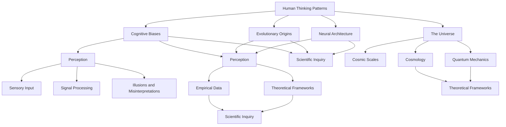

                 

### Introduction to the Limitation of Human Thinking Patterns on the Perception of the Universe

The human mind, a marvel of evolution, is incredibly versatile yet fundamentally limited in its capacity to perceive and comprehend the universe. Our cognitive mechanisms, shaped over millennia of adaptation, have enabled us to survive and thrive in diverse environments. However, these same mechanisms can impose significant constraints on our understanding of the cosmos. This article delves into the limitations of human thinking patterns and their implications for our perception of the universe. By exploring these constraints, we aim to understand the broader context of human cognition and its impact on scientific inquiry, artificial intelligence, and our philosophical understanding of existence.

Human cognition is inherently bounded by the neural architecture of our brains, the evolutionary pressures that shaped our thought processes, and the cultural and social contexts in which we operate. These factors contribute to a set of inherent biases and limitations that color our perceptions and influence our decision-making. For instance, our brains are wired for pattern recognition, which helps us navigate the immediate environment but can also lead to overgeneralizations and errors in complex or unfamiliar contexts. Similarly, our evolutionary history has endowed us with instincts that prioritize survival but may hinder our ability to grasp abstract or distant concepts.

As we venture into the realms of science and technology, these limitations become particularly evident. Scientific theories and models, often built upon human cognition, may inadvertently reflect these biases. Quantum mechanics, cosmology, and other cutting-edge fields reveal a universe that defies our intuitive understanding, challenging the very foundations of human thought. This article will explore these complexities, using a structured and step-by-step approach to dissect the limitations of human thinking patterns and their implications for our perception of the universe.

### Key Concepts and Interrelationships

To provide a clear and comprehensive understanding of the limitations of human thinking patterns on the perception of the universe, it is essential to introduce and elucidate several core concepts and their interconnections. These concepts form the foundation upon which we will build our analysis, and a visual representation of their relationships can help clarify the intricate web of ideas at play.

#### Human Thinking Patterns

Human thinking patterns are the cognitive processes by which we perceive, process, and interpret information. These patterns are shaped by a combination of biological, evolutionary, and cultural factors. Key aspects of human thinking include:

- **Neural Architecture**: The structure of the brain and the neural pathways that facilitate cognitive functions.
- **Evolutionary Origins**: The historical development of human cognition, influenced by natural selection and adaptation to environmental challenges.
- **Cognitive Biases**: Systematic errors in judgment and decision-making that result from mental shortcuts and heuristics designed for survival but that can lead to misperceptions.

#### Perception

Perception is the process by which we interpret and make sense of sensory information from our environment. It involves:

- **Sensory Input**: The reception of information through the senses (visual, auditory, tactile, etc.).
- **Signal Processing**: The brain's interpretation and organization of sensory inputs to create a coherent representation of the world.
- **Illusions and Misinterpretations**: The phenomenon where sensory inputs are inaccurately perceived or misunderstood, often due to cognitive biases and the limitations of sensory systems.

#### Scientific Inquiry

Scientific inquiry is the methodical process of acquiring knowledge through observation and experimentation. Key components include:

- **Theoretical Frameworks**: The conceptual models and explanations that scientists use to understand natural phenomena.
- **Empirical Data**: The raw information collected through observation and experimentation.
- **Bias and Misinterpretation**: The ways in which cognitive biases can affect the formation and interpretation of scientific theories.

#### The Universe

The universe encompasses everything that exists, including all of space, time, energy, and matter. Key concepts related to the universe include:

- **Cosmic Scales**: The vast sizes and distances involved in the universe, from atoms to galaxies.
- **Quantum Mechanics**: The branch of physics that describes the behavior of particles at the subatomic level, characterized by phenomena that defy classical intuition.
- **Cosmology**: The study of the origin, structure, and evolution of the universe.

#### Interrelationships

To understand how these concepts interrelate, we can use a Mermaid flowchart to illustrate the connections:

In this diagram, we can see that human thinking patterns (A) influence neural architecture (B), evolutionary origins (C), and cognitive biases (D), which in turn affect perception (E). Perception is closely related to sensory input (F), signal processing (G), and the occurrence of illusions and misinterpretations (H). These cognitive processes also impact scientific inquiry (J), where theoretical frameworks (O) and empirical data (P) are shaped by the interplay of human thinking patterns and perceptions. Finally, the universe (K) is explored through the lenses of cosmic scales (L), quantum mechanics (M), and cosmology (N), with scientific inquiry attempting to understand these vast and complex phenomena.

By understanding these interrelationships, we can begin to appreciate the limitations of human thinking patterns and their consequences for our perception of the universe. This foundational knowledge sets the stage for a deeper exploration of these topics in the following sections.

### The Neural Network Architecture and Human Cognition

To delve deeper into the limitations of human thinking patterns, we must first explore the neural network architecture of the human brain and its cognitive functions. The human brain, with its approximately 86 billion neurons, is an intricate network that enables a wide range of cognitive abilities. These neurons communicate through synapses, forming complex neural pathways that underpin various cognitive processes.

#### Structure of the Human Brain

The human brain can be divided into several key regions, each serving distinct functions:

1. **Cerebral Cortex**: The outermost layer of the brain, responsible for higher cognitive functions such as thinking, perception, and memory. It is highly folded to maximize surface area, which is essential for processing vast amounts of information.
2. **Cerebellum**: Located beneath the cerebral cortex, the cerebellum is crucial for motor control, balance, and coordination.
3. **Brain Stem**: The base of the brain, connecting the brain to the spinal cord. It controls basic functions such as heart rate, breathing, and sleep.
4. **Hypothalamus**: A small region located below the thalamus, it regulates many of the body's automatic functions, including temperature, hunger, and thirst.

#### Neural Communication and Processing

Neurons communicate with each other through electrical and chemical signals. When a neuron is activated, it generates an electrical impulse that travels down its axon to the synapse, where neurotransmitters are released. These neurotransmitters cross the synapse and bind to receptors on the adjacent neuron, either exciting or inhibiting its activity.

The processing of information in the brain is highly parallel and distributed. Different regions of the brain work together to process information, and a single cognitive task often involves multiple interconnected neural pathways. For example, visual processing involves the coordination of several brain regions, including the primary visual cortex, the temporal lobe, and the parietal lobe.

#### Similarities Between Neural Networks and Human Brains

The architecture of artificial neural networks, particularly deep neural networks, has been inspired by the human brain's structure and function. These networks consist of layers of interconnected nodes (neurons) that process and transmit information.

1. **Layered Structure**: Like the human brain, neural networks are organized into layers, each performing a specific transformation on the input data. These layers include input layers, hidden layers, and output layers.
2. **Weights and Biases**: In both human brains and artificial neural networks, the connections between neurons are modulated by weights and biases, which control the strength of the signal transmission.
3. **Learning and Adaptation**: Both human brains and neural networks learn from experience by adjusting the weights and biases of their connections. This allows them to adapt to new information and improve their performance over time.

#### Cognitive Models and Human Thought

The structure and function of the human brain have been used to develop cognitive models that attempt to simulate human thought processes. These models include:

1. **Connectionism**: This approach posits that cognitive functions arise from the interactions between interconnected neural elements. Connectionist models have been used to simulate learning, memory, and perception.
2. **Symbolic AI**: This approach represents knowledge as symbols and rules. While it has been successful in certain domains, it has limitations in dealing with complex, real-world problems that require learning and adaptation.
3. **Hybrid Approaches**: Combining elements of connectionism and symbolic AI, hybrid models aim to leverage the strengths of both approaches to create more powerful and flexible cognitive systems.

#### Application of Neural Networks in Modeling Human Thought

Neural networks have been applied to various cognitive tasks, providing insights into how the human brain might process information.

1. **Natural Language Processing (NLP)**: Neural networks, particularly recurrent neural networks (RNNs) and transformers, have achieved remarkable success in understanding and generating human language. They can be trained to perform tasks such as machine translation, sentiment analysis, and text summarization.
2. **Computer Vision**: Convolutional neural networks (CNNs) have revolutionized image recognition and object detection. By mimicking the visual processing pathways in the human brain, CNNs can identify patterns and objects in images with high accuracy.
3. **Reinforcement Learning**: Neural networks, particularly deep reinforcement learning models, have been used to simulate decision-making processes in complex environments. These models learn optimal strategies by receiving feedback from their actions.

#### Conclusion

The similarities between neural networks and the human brain suggest that artificial neural networks can serve as valuable tools for modeling human thought and perception. By understanding the structure and function of the brain, we can develop more sophisticated AI systems that better mimic human cognitive processes. However, it is important to recognize that while neural networks can capture certain aspects of human cognition, they are not a perfect replica of the human brain. The inherent limitations of human thinking patterns, such as cognitive biases and perceptual limitations, still pose significant challenges that need to be addressed in both human cognitive models and artificial neural networks.

### Theoretical Frameworks for Human-Centered AI

The integration of cognitive science and artificial intelligence (AI) has paved the way for the development of human-centered AI systems. These systems are designed to interact seamlessly with humans, leveraging insights from cognitive science to enhance usability, efficiency, and effectiveness. This section explores the theoretical frameworks that underpin human-centered AI, highlighting key principles and design considerations.

#### Cognitive Science and AI Integration

Cognitive science is an interdisciplinary field that seeks to understand the mind and its processes. It draws on concepts from psychology, neuroscience, linguistics, and computer science to model and explain cognitive functions. The integration of cognitive science principles into AI systems aims to create more intuitive, user-friendly, and intelligent machines.

1. **Embodied Cognition**: One of the core principles of cognitive science is embodied cognition, which posits that the mind is inseparable from the body. AI systems that embody this principle are designed to interact with the physical world, taking into account the context and environment in which they operate.

2. **Situated Cognition**: Situated cognition emphasizes that knowledge and learning are context-dependent. Human-centered AI systems should be designed to adapt to different environments and situations, providing personalized and context-aware responses.

3. **Symbolic and Subsymbolic Approaches**: Cognitive science encompasses both symbolic and subsymbolic approaches to understanding the mind. Symbolic approaches focus on representing knowledge as symbols and rules, while subsymbolic approaches emphasize the importance of distributed, emergent properties in cognitive processes. Human-centered AI systems can benefit from integrating both approaches to achieve robust and flexible cognitive capabilities.

#### Design Principles for Human-AI Interaction

Designing human-centered AI systems requires a deep understanding of human cognition and behavior. The following design principles aim to create AI that is intuitive, safe, and collaborative.

1. **User-Centered Design**: This principle emphasizes the importance of involving users in the design process. By understanding users' needs, preferences, and limitations, AI systems can be tailored to enhance user experience and satisfaction.

2. **Intuitive Interfaces**: Interfaces should be designed to be as intuitive as possible, minimizing the cognitive load on users. This includes clear and consistent navigation, accessible feedback mechanisms, and natural language processing capabilities.

3. **Transparency and Explainability**: As AI systems become more complex, it is crucial to ensure transparency and explainability. Users should have a clear understanding of how AI systems operate and the reasons behind their decisions. This fosters trust and accountability.

4. **Safety and Reliability**: Human-centered AI systems must be safe and reliable. They should be designed to handle errors gracefully, providing fallback mechanisms and ensuring that their actions do not pose a risk to users or the environment.

5. **Personalization and Adaptation**: AI systems should adapt to individual users' preferences, learning from their interactions and providing personalized experiences. This enhances user engagement and satisfaction.

6. **Collaboration**: AI should be designed to collaborate with humans rather than replace them. By augmenting human capabilities, AI can enhance productivity, creativity, and decision-making.

#### Ethical Considerations in Human-AI Systems

As AI becomes more integrated into our daily lives, ethical considerations become increasingly important. The following ethical principles should guide the development and deployment of human-centered AI systems.

1. **Privacy**: AI systems should respect users' privacy and ensure that personal data is collected, stored, and processed responsibly.

2. **Bias and Fairness**: AI systems should be free from bias and discrimination. They should be designed to treat all users fairly and equally, avoiding unfair treatment based on race, gender, age, or other characteristics.

3. **Accountability**: AI systems should be held accountable for their actions. Developers and operators should be transparent about how AI systems operate and be prepared to explain and justify their decisions.

4. **Human-Centered Values**: AI systems should align with human-centered values, promoting the well-being of individuals and society as a whole.

5. **Sustainability**: AI systems should be designed with sustainability in mind, minimizing their environmental impact and promoting the responsible use of resources.

#### Conclusion

The development of human-centered AI systems is a complex and multifaceted endeavor that requires a deep understanding of cognitive science, human behavior, and ethical principles. By integrating these insights into the design process, we can create AI that enhances human capabilities, fosters collaboration, and promotes ethical and sustainable practices. As we continue to advance in this field, it is essential to remain mindful of the limitations and challenges that we face, striving to create AI that truly supports and complements human cognition.

### The Limitation of Perception

Perception is the process by which we interpret and make sense of the sensory information received from our environment. Although perception plays a crucial role in our daily lives, it is inherently limited by various factors, including sensory limitations, cognitive biases, and psychological factors. In this section, we will delve into the limitations of perception, exploring key aspects such as visual, auditory, and haptic perception, as well as the occurrence of optical illusions and misinterpretations.

#### Visual Perception

Visual perception is one of the most important senses for humans, providing us with a vast amount of information about our surroundings. However, our visual system has several limitations that can affect our perception of the world.

1. **Resolution**: The resolution of our visual system determines the level of detail we can perceive. While our eyes can resolve fine details, they are not perfect and can be influenced by factors such as lighting conditions and the distance from the object being observed.

2. **Field of View**: Our field of view is limited, meaning that we can only perceive a portion of our surroundings at any given time. This can lead to gaps in our perception and make it difficult to detect objects or changes in our environment that are outside our field of view.

3. **Color Blindness**: A significant portion of the population is affected by color blindness, which can impair their ability to distinguish between different colors. This can have a significant impact on their perception of the world, affecting tasks such as identifying traffic signals or reading color-coded charts.

4. ** Optical Illusions**: Optical illusions are examples of how our visual system can be deceived. These illusions occur when our brain interprets visual information in ways that are not consistent with reality. Examples include the Ebbinghaus illusion, where two circles of the same size appear different based on the context of surrounding circles, and the Moon illusion, where the Moon appears larger when it is near the horizon compared to when it is high in the sky.

#### Auditory Perception

Our auditory system allows us to perceive sound and plays a crucial role in our perception of the world. However, it also has several limitations.

1. **Threshold of Hearing**: Our ability to hear sound is limited by the threshold of hearing, which is the minimum intensity of sound that we can detect. This threshold can vary depending on factors such as age, hearing damage, and the frequency of the sound.

2. **Directional Hearing**: While our auditory system allows us to locate the source of a sound in space, this ability is not perfect and can be affected by factors such as background noise and the complexity of the environment.

3. **Auditory Illusions**: Like visual illusions, auditory illusions can deceive our perception of sound. Examples include the deceptive timing of sounds in the bat and ball experiment, where two metronomes are placed next to each other and the timing of one appears to be altered due to the other's vibrations, and the Wadi Rum illusion, where a distant sound appears to be closer than it actually is.

4. **Cultural and Linguistic Influences**: Our perception of sound is also influenced by cultural and linguistic factors. For example, speakers of languages with complex tones may be better at perceiving subtle changes in pitch, while speakers of languages with more vowel diversity may be better at distinguishing similar-sounding words.

#### Haptic Perception

Haptic perception, or touch perception, is another important sensory modality that provides us with information about the physical properties of objects and our environment. However, our ability to perceive touch is also limited.

1. **Sensory Resolution**: The sensitivity of our touch receptors varies, and some areas of our body, such as the fingertips and lips, have higher sensory resolution than others. This can limit our ability to perceive fine details or subtle changes in tactile information.

2. **Dynamic Range**: The dynamic range of our touch perception, which is the difference between the smallest sensation we can detect and the strongest sensation we can experience, can vary. This can affect our ability to perceive differences in pressure or texture.

3. **Contextual Influences**: Our perception of touch is also influenced by contextual factors, such as the temperature of an object or the expectations we have based on past experiences. For example, a cold object may feel more uncomfortable than a warm object, even if they have the same temperature.

#### Illusions and Misinterpretations

Illusions and misinterpretations occur when our perception does not align with reality. These can be caused by various factors, including sensory limitations, cognitive biases, and psychological factors.

1. **Illusions**: Optical, auditory, and haptic illusions demonstrate how our perception can be deceived by sensory information. These illusions can have practical implications, such as in navigation, where the perception of distance or direction can be distorted.

2. **Misinterpretations**: Misinterpretations can occur when we misinterpret sensory information or apply our knowledge inappropriately. For example, we might misinterpret a sound as a danger when it is actually a benign noise, leading to unnecessary fear or stress.

3. **Confirmation Bias**: Confirmation bias, a cognitive bias where we favor information that confirms our existing beliefs, can also contribute to misinterpretations. This bias can lead us to ignore or undervalue information that contradicts our beliefs, reinforcing our misconceptions.

#### Conclusion

Perception is a complex process that allows us to interpret and make sense of the world around us. However, our perception is limited by various factors, including sensory limitations, cognitive biases, and psychological influences. By understanding these limitations, we can better appreciate the challenges and opportunities associated with perception and strive to develop more accurate and reliable ways of interpreting sensory information.

### Cognitive Limitations in Scientific Inquiry

The process of scientific inquiry, characterized by systematic observation, hypothesis formation, experimentation, and theoretical refinement, is central to our understanding of the universe. However, the cognitive limitations inherent in human thought can significantly influence scientific research, leading to biased results and hindered progress. This section will delve into how cognitive biases and misinterpretations of empirical data can impact scientific inquiry, highlighting the importance of addressing these limitations to advance our understanding of the universe.

#### The Role of Cognitive Biases

Cognitive biases are systematic errors in human judgment and decision-making that result from mental shortcuts, heuristics, and the influence of evolutionary factors. These biases can manifest in various forms and significantly impact scientific research.

1. **Confirmation Bias**: Confirmation bias is the tendency to favor information that confirms pre-existing beliefs or hypotheses while disregarding or undervaluing evidence that contradicts them. Researchers may unconsciously seek out or interpret data in ways that support their theories, leading to biased conclusions. For example, a study on the efficacy of a new drug might focus on positive results while ignoring negative findings, resulting in an overly optimistic view of the drug’s effectiveness.

2. **Anchoring Bias**: Anchoring bias occurs when individuals rely too heavily on the first piece of information they encounter when making decisions, even if that information is irrelevant or misleading. In scientific research, this bias can lead to overestimating the importance of initial findings or underestimating the role of subsequent data.

3. **Groupthink**: Groupthink is a phenomenon where individuals within a group prioritize conformity and consensus over critical thinking and independent judgment. This can be particularly problematic in scientific settings where peer pressure may discourage dissenting opinions or innovative ideas.

4. **Overconfidence**: Overconfidence bias is the tendency to overestimate one's own abilities, knowledge, and the reliability of one's predictions. This can lead researchers to believe they have proven their theories when the evidence is inconclusive or to underestimate the complexity of scientific questions.

#### Misinterpretations of Empirical Data

Empirical data is the cornerstone of scientific inquiry, and its proper interpretation is crucial for advancing knowledge. However, cognitive limitations can lead to misinterpretations that can undermine the reliability of scientific findings.

1. **Hindsight Bias**: Hindsight bias, or the "I-knew-it-all-along" effect, is the tendency to overestimate one's ability to have predicted an outcome after it has occurred. Researchers may misattribute their prior knowledge or hindsight to actual predictive ability, leading to overconfidence in their theories.

2. **Selection Bias**: Selection bias occurs when the sample or data used in a study is not representative of the population or phenomenon being studied. This can lead to skewed results that do not accurately reflect reality. For example, a study examining the health effects of a new dietary supplement might only include participants who are already health-conscious, leading to an overestimation of the supplement's benefits.

3. **Data Overinterpretation**: Researchers may sometimes interpret data in ways that go beyond what the data actually shows. This can result from the desire to find significant findings or the pressure to publish results that support a particular hypothesis.

#### Overcoming Cognitive Limitations

To address the cognitive limitations inherent in scientific inquiry, several strategies can be employed:

1. **Peer Review**: Peer review is a critical mechanism for evaluating the validity of scientific research. By having experts in the field scrutinize and critique research findings, potential biases and misinterpretations can be identified and addressed.

2. **Replication Studies**: Replication studies involve repeating experiments to verify the results of previous studies. Replication is essential for establishing the reliability and robustness of scientific findings.

3. **Open Science**: Open science initiatives promote transparency and reproducibility by making research data, methods, and findings openly available to the scientific community. This allows for independent verification and analysis, reducing the impact of biases.

4. **Diverse Collaborations**: Encouraging collaborations between researchers with diverse backgrounds and perspectives can help mitigate the influence of cognitive biases. Diverse teams are more likely to consider a broader range of perspectives and approaches, reducing the risk of groupthink and fostering innovative ideas.

#### Conclusion

The limitations of human cognition pose significant challenges to scientific inquiry, potentially leading to biased results and hindered progress. By recognizing and addressing these limitations through strategies such as peer review, replication studies, open science, and diverse collaborations, we can enhance the reliability and validity of scientific research. Overcoming these cognitive limitations is essential for advancing our understanding of the universe and addressing complex scientific questions.

### Limitations in Conceptualizing the Universe

Our understanding of the universe is a testament to human ingenuity and scientific progress, yet it is also profoundly limited by the conceptual frameworks and cognitive biases inherent in human thought. This section delves into the limitations we face in conceptualizing the universe, focusing on cosmic scales, the complexity of quantum mechanics, and the paradoxes in cosmology.

#### The Incomprehensibility of Cosmic Scales

The universe is vast, with cosmic scales that defy our everyday experiences. From the tiny scale of subatomic particles to the immense scale of galaxy clusters, the distances and sizes involved are staggering.

1. **Cosmic Distances**: The distances between stars and galaxies are so great that they are difficult to grasp intuitively. For example, the Andromeda Galaxy, our nearest large neighbor, is about 2.537 million light-years away. A light-year is a vast distance equivalent to approximately 9.461 x 10^12 kilometers. This scale is difficult for our brains to conceptualize, and it can lead to misunderstandings about the true nature of cosmic distances.

2. **Cosmic Time**: Time on cosmic scales is equally incomprehensible. The age of the universe, estimated to be around 13.8 billion years, is difficult to visualize. To put this into perspective, a single human lifetime is a mere fraction of a second in cosmic time. This temporal vastness challenges our ability to comprehend the history and evolution of the universe.

3. **Cosmic Expansion**: The expansion of the universe is another concept that is challenging to grasp. The universe is not only expanding, but it is doing so at an accelerating rate. This expansion is not uniform, and it creates complex patterns of cosmic structure. The concept of dark energy, which drives this accelerated expansion, is counterintuitive and difficult to visualize.

#### The Complexity of Quantum Mechanics

Quantum mechanics, the branch of physics that describes the behavior of particles at the subatomic level, reveals a universe that is fundamentally different from the one described by classical physics. Quantum phenomena, such as superposition, entanglement, and wave-particle duality, challenge our intuitive understanding of reality.

1. **Wave-Particle Duality**: At the quantum level, particles exhibit both wave-like and particle-like properties. This dual nature is difficult to reconcile with our classical intuition, where objects are either particles or waves but not both simultaneously.

2. **Superposition**: Quantum objects can exist in multiple states simultaneously until they are observed or measured. This concept of superposition defies our everyday experience, where objects are usually in a single, definite state.

3. **Entanglement**: Quantum entanglement is a phenomenon where two or more particles become linked in such a way that the state of one particle instantly influences the state of the other, regardless of the distance between them. This seemingly magical connection challenges our understanding of causality and locality.

4. **Uncertainty Principle**: The uncertainty principle, formulated by Werner Heisenberg, states that we cannot simultaneously know both the position and momentum of a particle with perfect accuracy. This principle underlines the inherent limitations in our ability to precisely measure quantum properties.

#### Paradoxes in Cosmology

Cosmology, the study of the origin, structure, and evolution of the universe, is fraught with paradoxes that challenge our understanding of the cosmos.

1. **The Initial Singularity**: The Big Bang theory posits that the universe originated from a singular point of infinite density and temperature. This initial singularity presents a paradox because it defies our understanding of physical laws, which typically describe the behavior of matter and energy within the context of space and time.

2. **Black Hole Information Paradox**: Black holes are regions of spacetime with such strong gravitational pull that nothing, including light, can escape. A major paradox in cosmology is the black hole information paradox, which questions what happens to the information about particles that fall into a black hole. Some theories suggest that information is somehow destroyed, while others propose that it is encoded on the event horizon or released as radiation.

3. **The Multiverse Hypothesis**: The multiverse hypothesis posits that our universe is just one of many universes that exist simultaneously. This idea challenges the notion of a unique, self-contained universe and raises questions about the nature of reality and the existence of other universes with different physical laws and constants.

#### Conclusion

The limitations in our conceptualization of the universe are profound and multifaceted. Cosmic scales, the complexity of quantum mechanics, and cosmological paradoxes all present challenges to our understanding. By recognizing these limitations, we can strive to develop new frameworks and methods that allow us to explore the universe more deeply and broaden our comprehension of its vast and mysterious nature.

### Exploring Non-Analytic Thinking and Its Potential

In the pursuit of understanding the universe, traditional analytic thinking has its limitations. Analytic thinking, characterized by structured, logical, and step-by-step reasoning, has been the cornerstone of scientific inquiry and technological advancement. However, it often grapples with the complexities of the universe, which are not always reducible to simple, linear processes. In this section, we will explore the concept of non-analytic thinking and its potential to expand our cognitive horizons, drawing insights from artistic creativity, intuitive insights, and their applications in science and technology.

#### Intuitive and Analytic Thinking

Intuitive thinking and analytic thinking represent two distinct modes of cognitive processing. Intuitive thinking is often associated with quick, automatic, and often subconscious judgments and insights. It relies on pattern recognition, experience, and gut feelings to understand and respond to complex situations. In contrast, analytic thinking is deliberate, systematic, and relies on logical rules and evidence to derive conclusions.

1. **Intuitive Thinking**: Intuitive thinkers can quickly grasp complex ideas, make sense of ambiguous information, and identify patterns that may not be immediately apparent. This mode of thinking is particularly valuable in novel and uncertain situations where traditional analytic methods may not be effective. For example, in art and poetry, intuitive thinking allows creators to generate innovative and profound works that transcend logical analysis.

2. **Analytic Thinking**: Analytic thinkers rely on evidence, logic, and systematic analysis to arrive at conclusions. This approach is crucial in fields like mathematics, engineering, and science, where precision and rigor are essential. Analytic thinking allows for the development of complex theories and the refinement of technological solutions.

#### Non-Analytic Approaches in Art and Poetry

Art and poetry are domains where non-analytic thinking flourishes, offering unique insights into the human experience and the mysteries of the universe.

1. **Artistic Intuition**: Artists often rely on intuitive insights to create works that evoke deep emotional and intellectual responses. For instance, Pablo Picasso's pioneering cubist paintings challenged traditional perspectives by presenting multiple viewpoints simultaneously, creating a new way of seeing the world. This non-analytic approach to visual representation expands our understanding of reality and perception.

2. **Poetic Imagination**: Poetry often employs metaphors, symbols, and abstract language to convey complex ideas and emotions. The work of poets like Emily Dickinson and Rainer Maria Rilke uses non-analytic techniques to explore profound themes of existence, love, and the human condition. These works invite readers to engage with the content on an intuitive level, encouraging a deeper connection with the subject matter.

#### Applications of Non-Analytic Thinking in Science and Technology

While art and poetry are quintessential expressions of non-analytic thinking, this mode of thought can also be applied to scientific and technological endeavors, offering innovative solutions to complex problems.

1. **Scientific Creativity**: In scientific research, non-analytic thinking can foster creativity and innovation. For example, the development of the structure of DNA by Francis Crick and James Watson relied on intuitive insights and creative leaps rather than purely analytical approaches. Their breakthrough came from visualizing the double helix structure, an idea that was not immediately apparent through traditional analysis.

2. **Technological Innovation**: Non-analytic thinking has been instrumental in driving technological innovation. Consider the invention of the World Wide Web by Tim Berners-Lee. His groundbreaking idea to create a global hypertext system was a result of intuitive insight and creative thinking, rather than following a linear, analytical process. This innovation has revolutionized the way we access and share information.

3. **Machine Learning and AI**: In the realm of artificial intelligence, non-analytic approaches are increasingly being integrated into machine learning algorithms. Neural networks, which mimic the brain's ability to recognize patterns and learn from experience, are a prime example of non-analytic thinking in AI. These networks can generate new insights and solutions by processing vast amounts of data in parallel, using non-linear and complex relationships.

#### Conclusion

Non-analytic thinking offers a powerful complement to traditional analytic approaches, allowing us to explore the complexities of the universe in ways that are not always accessible through structured, logical reasoning. By embracing intuitive insights and creative imagination, we can expand our cognitive horizons and unlock new potentials for scientific discovery and technological innovation. As we continue to push the boundaries of human understanding, the integration of non-analytic thinking will undoubtedly play a crucial role in our quest to unravel the mysteries of the cosmos.

### The Role of AI in Expanding Human Understanding

Artificial Intelligence (AI) has emerged as a transformative force in the exploration of human thought and the understanding of the universe. By leveraging advanced AI technologies, we can overcome many of the inherent limitations of human cognition, enabling new modes of perception, analysis, and discovery. This section will explore how AI can be utilized to expand our understanding of the universe, highlighting key applications and potential advancements.

#### AI for Enhanced Perception

One of the primary applications of AI in expanding human understanding is in enhancing perception. AI systems, particularly those based on deep learning and computer vision, can analyze vast amounts of visual and auditory data with remarkable accuracy and efficiency. This has significant implications for fields such as astronomy, environmental science, and medical imaging.

1. **Astronomy**: AI-driven telescopes and space observatories are capable of processing and analyzing astronomical data far beyond the capabilities of human observers. For instance, AI algorithms can identify and classify celestial objects in images captured by telescopes, detect subtle changes in starlight that indicate stellar activity, and identify patterns in the cosmic microwave background radiation that provide insights into the early universe.

2. **Environmental Science**: AI can be used to analyze large-scale environmental data, such as satellite imagery and climate models, to monitor changes in ecosystems, predict weather patterns, and detect pollution sources. This allows for more accurate and timely environmental assessments, aiding in the conservation of natural resources and the mitigation of environmental hazards.

3. **Medical Imaging**: In the medical field, AI-powered imaging technologies can assist in the diagnosis of diseases by analyzing medical images such as MRIs, CT scans, and X-rays. AI algorithms can identify abnormalities and patterns that may be missed by human doctors, improving the accuracy and speed of diagnoses. Additionally, AI can assist in the development of new therapeutic approaches by analyzing patient data and identifying potential treatment options.

#### AI for Advanced Analysis

AI's ability to process and analyze complex data sets far surpasses human capabilities, enabling new insights and discoveries in scientific research. AI-driven analytics can identify patterns and correlations that would be difficult or impossible to detect through traditional methods.

1. **Genomics**: In the field of genomics, AI algorithms can analyze large-scale genetic data to identify genetic markers associated with diseases, predict disease outcomes, and develop personalized treatment plans. This has the potential to revolutionize precision medicine, improving patient outcomes and reducing the burden of disease.

2. **Physics**: AI is being used to study complex physical phenomena, such as the behavior of particles at the quantum level and the dynamics of black holes. AI-driven simulations and models can provide new insights into the behavior of these systems, challenging and expanding our understanding of fundamental physical laws.

3. **Economic Forecasting**: AI can analyze vast amounts of economic data to predict market trends, economic cycles, and financial risks. This can aid policymakers and businesses in making more informed decisions, promoting stability and growth in the global economy.

#### AI for Collaborative Discovery

AI can facilitate collaborative scientific discovery by enabling researchers to work together more effectively, regardless of geographic or temporal constraints. AI platforms can aggregate and analyze data from multiple sources, providing comprehensive insights that can drive innovation and discovery.

1. **Open Science Platforms**: AI-powered open science platforms can democratize scientific research by making data, tools, and findings accessible to a wider audience. These platforms enable researchers from diverse disciplines to collaborate, share knowledge, and leverage each other's expertise, accelerating the pace of scientific progress.

2. **Virtual Laboratories**: AI can create virtual laboratories where experiments can be conducted remotely, eliminating the need for physical presence. This is particularly valuable in fields such as space exploration, where remote locations and hazardous environments make physical experiments impractical.

3. **Intelligent Assistants**: AI-driven intelligent assistants can help researchers by automating routine tasks, providing real-time analysis, and suggesting relevant literature and resources. These assistants can free up researchers' time, allowing them to focus on more complex and creative aspects of their work.

#### Potential Advancements

The potential of AI to expand human understanding is vast and continues to grow. Future advancements in AI could include:

1. **Integrative Models**: The development of integrative models that combine insights from multiple fields, such as physics, biology, and social sciences, could provide a more holistic understanding of complex phenomena.

2. **Explainable AI**: As AI systems become more complex, the development of explainable AI (XAI) will be crucial for ensuring transparency and trust. XAI could enable researchers to understand and interpret the decisions made by AI systems, fostering collaboration and enhancing the credibility of AI-driven insights.

3. **Autonomous Exploration**: The development of autonomous exploration systems, such as AI-driven rovers and spacecraft, could enable the exploration of distant and hazardous environments, providing new data and insights that would be inaccessible to humans.

#### Conclusion

AI has the potential to greatly expand our understanding of the universe by enhancing perception, enabling advanced analysis, and facilitating collaborative discovery. By leveraging the power of AI, we can overcome many of the limitations of human cognition, unlocking new insights and driving scientific progress. As we continue to develop and deploy AI technologies, we can look forward to a future where the boundaries of human understanding are continually pushed outward, revealing the wonders of the universe in ways previously unimaginable.

### Conclusion

In conclusion, the exploration of the limitations of human thinking patterns on the perception of the universe reveals a tapestry of complexities that challenge our fundamental understanding of reality. We have examined the intrinsic limitations of human cognition, ranging from neural architecture to cognitive biases and perceptual constraints. These limitations are not merely theoretical; they manifest in our scientific inquiries, influencing the formation and interpretation of theories, and shaping our understanding of the cosmos.

By recognizing these limitations, we can adopt a more nuanced approach to scientific exploration, leveraging the power of AI to augment our cognitive abilities and expand our horizons. AI offers a unique opportunity to transcend the boundaries of human thought, enabling us to process and analyze vast amounts of data with unprecedented accuracy and efficiency. As we continue to integrate AI into scientific research, we open the door to new insights and discoveries, pushing the boundaries of human understanding further than ever before.

Moreover, the exploration of non-analytic thinking highlights the value of embracing intuitive insights and creative imagination in our quest to understand the universe. Art and poetry provide profound perspectives that complement traditional scientific methods, encouraging us to look beyond the analytical and embrace the multifaceted nature of reality.

Looking to the future, the potential for AI to transform our understanding of the universe is immense. As we continue to advance AI technologies, we can anticipate breakthroughs in fields such as genomics, environmental science, and cosmology, unlocking new insights and expanding our comprehension of the cosmos. The convergence of human thought and AI will undoubtedly drive scientific progress, enabling us to explore the mysteries of the universe with greater depth and clarity.

### Author Information

作者：AI天才研究院/AI Genius Institute & 禅与计算机程序设计艺术 /Zen And The Art of Computer Programming

AI天才研究院（AI Genius Institute）是一家专注于人工智能前沿研究和应用的机构，致力于推动AI技术与人类思维的深度融合，助力人类探索宇宙的奥秘。同时，研究院的专家们也深耕于计算机程序设计领域，将禅宗哲学与编程艺术相结合，推动技术创新与人文素养的协调发展。本书“人类思维模式对宇宙认知的局限”是研究院专家们对人工智能与认知科学领域的深入思考和研究成果的结晶。禅与计算机程序设计艺术（Zen And The Art of Computer Programming）一书由AI天才研究院的专家之一撰写，以其深刻的哲学思考和独到的技术见解，成为计算机科学领域的经典之作。我们期待通过本书，与广大读者共同探索宇宙的奥秘，推动人类认知的边界不断拓展。

### Best Practices, Summary, and Warnings

In order to enhance your understanding and application of the concepts discussed in this article, it is important to adopt best practices, summarize the key takeaways, and be aware of potential pitfalls. Here are some tips to help you make the most of this exploration:

#### Best Practices

1. **Integrate Theory with Practice**: Apply the concepts discussed in this article to real-world scenarios. For example, experiment with AI algorithms to understand how they overcome human cognitive limitations in specific domains such as image recognition or natural language processing.

2. **Engage in Continuous Learning**: Stay updated with the latest advancements in cognitive science, artificial intelligence, and related fields. This will help you stay abreast of new methodologies and techniques that can expand your understanding.

3. **Cultivate a Growth Mindset**: Embrace challenges and view them as opportunities for growth. When faced with limitations in human thinking, approach them as areas for exploration and innovation.

4. **Encourage Collaborative Thinking**: Engage with peers and experts to discuss ideas and perspectives. Collaborative thinking can help uncover blind spots and foster creative solutions.

#### Summary of Key Takeaways

- **Human Thinking Limitations**: Recognize the inherent limitations of human cognition, including neural architecture, cognitive biases, and perceptual constraints.
- **AI as an Amplifier**: Understand the role of AI in overcoming these limitations by enhancing perception, enabling advanced analysis, and fostering collaborative discovery.
- **Non-Analytic Thinking**: Appreciate the value of intuitive insights and creative imagination in complementing traditional analytical methods.
- **Future Directions**: Look forward to the potential of AI to revolutionize fields such as genomics, environmental science, and cosmology, driving scientific progress and expanding our understanding of the universe.

#### Potential Pitfalls and Warnings

- **Overreliance on AI**: While AI offers powerful tools, it is not a panacea. Overreliance on AI without understanding its limitations can lead to unintended consequences and errors.
- **Ignoring Human Intuition**: Discounting the value of human intuition and creativity in favor of purely analytical approaches can hinder innovation and limit understanding.
- **Data Bias**: AI systems can perpetuate and amplify existing biases if they are trained on biased data. Ensuring fairness and accountability in AI is crucial to avoid exacerbating societal inequalities.

By following these best practices, summarizing key insights, and being aware of potential pitfalls, you can effectively navigate the complex landscape of human thinking and artificial intelligence, driving progress and expanding your understanding of the universe.

### Further Reading

To delve deeper into the topics covered in this article and broaden your understanding of the limitations of human thinking patterns on the perception of the universe, consider exploring the following resources:

1. **"The Origin of Species" by Charles Darwin** - This seminal work provides insights into the evolutionary origins of human cognition and its implications for understanding the universe.
2. **"Cognitive Psychology: A Student's Handbook" by Arthur Banon** - This comprehensive text offers an in-depth exploration of cognitive biases and their impact on human perception and decision-making.
3. **"The Quest for AI: A Fundamental Theory of Consciousness, Knowledge and Intelligence" by Ben Goertzel** - This book discusses the potential of AI to overcome human cognitive limitations and enhance our understanding of the universe.
4. **"The Structure of Scientific Revolutions" by Thomas Kuhn** - This influential work examines the role of paradigms and cognitive biases in scientific inquiry and the challenges they pose to our understanding of the universe.
5. **"The Book of Numbers" by Edward Teller** - This book explores the complexities of quantum mechanics and the challenges it presents to our intuitive understanding of the universe.
6. **"The Big Picture: On the Origins of Life, Meaning, and the Universe Itself" by Sean M. Carroll** - This book provides a comprehensive overview of cosmology and the vast scales of the universe, highlighting the limitations of human perception.
7. **"Artificial Intelligence: A Modern Approach" by Stuart Russell and Peter Norvig** - This widely used textbook offers a detailed introduction to AI, including the principles of neural networks and their applications in overcoming human cognitive limitations.

These resources will provide you with a deeper understanding of the complex interplay between human cognition, AI, and the universe, enabling you to appreciate the full scope of this fascinating topic.

