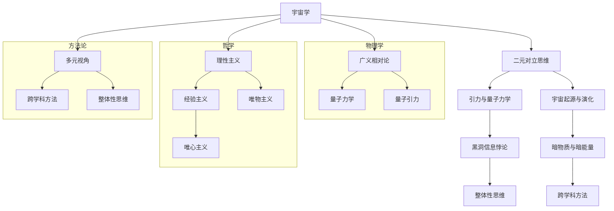

                 

# 文章标题：人类思维的二元对立在理解宇宙中的局限

## 关键词
- 二元对立思维
- 宇宙学
- 物理学
- 哲学
- 整体性思维

## 摘要
本文深入探讨人类思维的二元对立模式在理解宇宙中的局限。通过分析二元对立思维模式的历史起源、影响及其在物理学、宇宙学和哲学中的体现，本文揭示了这种思维模式如何限制了我们对宇宙真实本质的认识。文章进一步探讨了超越二元对立思维的可能性，并通过具体案例展示了整体性思维模式在宇宙学研究中的应用。最终，本文呼吁科学家和哲学家共同探索新的思维模式，以更全面地理解宇宙。

## 引言

人类思维的二元对立模式是一种基本的认知方式，它将复杂的现象分为两个对立的类别，如黑与白、善与恶、存在与不存在等。这种思维方式在人类认知和思考过程中起到了重要作用，使得我们能够迅速地理解和处理信息。然而，随着科学技术的进步和宇宙学的发展，人们逐渐认识到，二元对立思维模式在理解宇宙中的局限性。

宇宙作为一个庞大而复杂的系统，其行为和规律并非简单地可以用二元对立来描述。从物理学到宇宙学，再到哲学，二元对立思维模式的局限越来越明显。本文旨在探讨这种局限，并探讨可能的解决方案。

### 书籍背景

本文的背景可以追溯到人类对宇宙认识的漫长历程。从古代的宇宙观念，到现代的宇宙学理论，人类一直在努力理解宇宙的奥秘。然而，在大多数情况下，人类的思维模式受到了二元对立的影响，这使得我们对宇宙的理解往往停留在表面。

例如，在物理学中，经典物理学和量子力学之间的对立一直困扰着科学家。经典物理学强调宏观物体的确定性，而量子力学则强调微观粒子的随机性。这种对立使得人们很难将两者统一起来，从而限制了我们对宇宙的理解。

在宇宙学中，二元对立思维模式也体现得淋漓尽致。例如，宇宙膨胀理论中的宇宙起源与终结问题，以及宇宙中的暗物质和暗能量等，都是二元对立的体现。这种思维模式使得我们难以全面地理解宇宙的演化过程。

### 目的与重要性

本文的目的是揭示二元对立思维模式在理解宇宙中的局限，并探讨超越这种局限的可能性。理解这一问题的意义在于，它可以帮助我们更全面地认识宇宙，从而推动科学技术的进步。

首先，揭示二元对立思维模式的局限有助于我们更好地理解物理学和宇宙学中的基本问题。例如，通过对引力和量子力学的深入探讨，我们可以找到将两者统一起来的新思路。

其次，超越二元对立思维模式可以激发新的哲学思考。哲学一直以来都在探索人类存在的意义和宇宙的本质。通过超越二元对立思维模式，我们可以发现新的哲学问题，从而推动哲学的发展。

最后，本文的重要意义在于，它提醒我们，在探索宇宙的过程中，我们需要保持开放的心态，不断尝试新的思维模式，以更全面地理解宇宙的奥秘。

### 结构安排

本文分为七个章节，分别从不同角度探讨二元对立思维模式在理解宇宙中的局限。

第一章介绍二元对立思维模式的历史起源和发展，以及它在人类认知和思考过程中的作用。

第二章和第三章分别从物理学和宇宙学的角度，探讨二元对立思维模式在理解宇宙中的局限。

第四章从哲学的角度，分析二元对立思维模式在哲学中的影响。

第五章探讨超越二元对立思维的可能性，介绍整体性思维模式。

第六章通过案例分析，展示整体性思维模式在宇宙学研究中的应用。

第七章总结全文，提出未来研究的方向和可能的解决方案。

## 第1章：二元对立思维模式概述

### 1.1 定义与起源

二元对立思维模式是一种将复杂现象分为两个对立的类别的认知方式。例如，黑与白、善与恶、存在与不存在等。这种思维方式在人类历史长河中逐渐形成，并在哲学、科学、文化等领域中得到广泛应用。

二元对立思维模式的起源可以追溯到古代希腊哲学。在古希腊哲学中，赫拉克利特提出了“对立统一”的观点，即万物皆由对立的两个方面构成。这种观点为二元对立思维模式奠定了基础。

在科学发展过程中，二元对立思维模式也得到了广泛应用。例如，经典物理学和量子力学之间的对立，以及相对论和量子场论之间的对立，都是二元对立思维模式的体现。

### 1.2 二元对立思维模式的影响

二元对立思维模式对人类认知和思考产生了深远的影响。

首先，它使得人类能够迅速地理解和处理信息。通过将复杂的现象分为两个对立的类别，人类可以更加直观地认识世界。例如，在科学研究中，二元对立思维模式帮助我们区分了实验组和对照组，从而提高了研究结果的可靠性。

然而，二元对立思维模式也存在一些局限性。首先，它可能导致思维的僵化。当人们将事物分为两个对立的类别时，可能会忽视它们之间的联系和变化。例如，在宇宙学研究中，二元对立思维模式可能导致我们对宇宙起源和演化的理解停留在表面。

其次，二元对立思维模式可能限制我们的创造力。当人们将事物分为两个对立的类别时，可能会忽视其他可能的解决方案。例如，在物理学中，二元对立思维模式可能导致人们对引力和量子力学的对立束手无策。

### 1.3 二元对立思维模式在宇宙学中的应用与局限

在宇宙学中，二元对立思维模式有着广泛的应用，同时也存在显著的局限。

首先，二元对立思维模式在宇宙起源的研究中得到了应用。例如，大爆炸理论和稳态理论之间的对立，是宇宙起源研究中的典型二元对立。大爆炸理论认为宇宙起源于一次巨大的爆炸，而稳态理论则认为宇宙始终处于稳定状态。

然而，二元对立思维模式在宇宙学中的应用也存在明显的局限。首先，它可能导致对宇宙演化的误解。例如，在宇宙膨胀的研究中，二元对立思维模式可能导致我们将宇宙的膨胀简单地理解为一种对立的现象，而忽视了宇宙膨胀背后的复杂机制。

其次，二元对立思维模式可能在解释宇宙中的暗物质和暗能量时产生误导。暗物质和暗能量是宇宙学中的两个重要概念，它们的存在和性质尚未完全理解。二元对立思维模式可能导致我们将暗物质和暗能量视为宇宙演化中的对立因素，而忽视了它们之间的可能联系。

总之，二元对立思维模式在宇宙学中的应用既有积极作用，也存在明显的局限。要更全面地理解宇宙，我们需要超越这种思维模式，探索新的认知方式。

## 第2章：二元对立思维模式在物理学中的局限

### 2.1 引力与量子力学的矛盾

引力和量子力学是物理学中两个重要理论，但在许多方面它们之间存在着深刻的矛盾。引力是宏观尺度上的基本力，它描述了天体之间的相互吸引。而量子力学则是微观尺度上的基本理论，它描述了粒子的行为和相互作用。这两种理论的矛盾主要体现在以下几个方面：

首先，引力和量子力学在描述物体行为的方式上存在根本差异。引力遵循经典力学定律，其行为是确定的，而量子力学则遵循概率定律，其行为是随机的。这意味着，在量子力学中，物体的位置和动量不能同时被精确测量，这被称为不确定性原理。

其次，引力和量子力学在描述空间和时间的方式上也存在矛盾。引力理论中的时空是连续的，而量子力学中的时空是离散的，由量子比特组成。这种时空结构的差异导致了对宇宙演化理解的困难。

最后，引力和量子力学在统一理论方面存在困难。尽管科学家们一直在努力寻找一种能够统一引力和量子力学的理论，但至今仍未取得实质性突破。这种矛盾使得我们难以将宏观和微观现象统一起来，限制了我们对宇宙的理解。

### 2.2 二元对立思维模式的影响

二元对立思维模式在物理学中的应用使得引力和量子力学的矛盾更加突出。这种思维模式倾向于将事物分为两个对立的类别，例如宏观和微观、确定性和随机性等。这种分类方式导致了对引力和量子力学之间的矛盾进行了过度简化和片面理解。

首先，二元对立思维模式可能导致对引力和量子力学各自优势的忽视。例如，当人们过于强调引力的确定性时，可能会忽视量子力学的随机性。反之，当人们过于强调量子力学的随机性时，可能会忽视引力的确定性。这种偏见使得我们对引力和量子力学的理解变得狭隘，难以找到统一的理论。

其次，二元对立思维模式可能导致对矛盾的本质理解不足。例如，人们可能会将引力和量子力学的矛盾视为两种理论之间的对立，而忽视了它们可能存在某种深层次的统一性。这种片面理解使得我们难以突破现有的理论框架，寻找新的研究方向。

### 2.3 对宇宙演化的影响

二元对立思维模式对宇宙演化的理解产生了显著影响。在宇宙学中，引力和量子力学的矛盾表现为宇宙起源和演化过程中的两个对立现象。例如，宇宙膨胀和暗物质的分布等问题，都被二元对立思维模式简单地视为对立的现象。

这种思维方式导致了对宇宙演化过程的片面理解。例如，人们可能会将宇宙膨胀视为一种对立的收缩现象，而忽视了宇宙膨胀背后的复杂机制。同样，暗物质的分布问题也被视为一种对立的分布现象，而忽视了暗物质可能存在的多种可能形态。

这种片面理解使得我们对宇宙演化的理解变得狭隘，难以全面揭示宇宙的真实本质。要更深入地理解宇宙，我们需要超越二元对立思维模式，探索新的认知方式，以更全面地揭示宇宙的奥秘。

### 2.4 总结

二元对立思维模式在物理学中的局限主要体现在引力和量子力学之间的矛盾，以及这种矛盾对宇宙演化的影响。要克服这种局限，我们需要超越二元对立思维模式，探索新的认知方式，以更全面地理解宇宙的奥秘。

## 第3章：二元对立思维模式在宇宙学中的影响

### 3.1 宇宙学基本原理

宇宙学是研究宇宙起源、演化和结构的科学。在宇宙学中，有几个基本原理非常重要，它们构成了我们对宇宙理解的基础。

首先，宇宙膨胀原理是宇宙学中的一个核心概念。这一原理认为，宇宙中的所有星系都在相互远离，宇宙整体上处于膨胀状态。这一发现最早由埃德温·哈勃在1920年代通过观测得出，并成为现代宇宙学的基石之一。

其次，宇宙起源理论，特别是大爆炸理论，描述了宇宙从极热、极密的状态开始膨胀的过程。根据大爆炸理论，宇宙起源于大约138亿年前的一次巨大爆炸，从那时起宇宙一直在膨胀。

第三，暗物质和暗能量是宇宙学中的两个关键概念。暗物质是一种不发光、不与电磁力相互作用的物质，占据了宇宙总质量的大部分。暗能量则是一种导致宇宙加速膨胀的神秘力量。

这些基本原理共同构成了我们对宇宙演化和结构的理解，但它们也揭示出二元对立思维模式的局限。

### 3.2 二元对立思维模式在宇宙学中的体现

在宇宙学中，二元对立思维模式体现在对宇宙现象的简化和分类上。例如，宇宙膨胀与收缩、可见物质与暗物质、正常物质与暗物质等都是典型的二元对立。

这种思维方式使得宇宙学的研究倾向于将复杂的现象划分为对立的两类，忽视了它们之间的潜在联系和相互作用。例如，宇宙膨胀和收缩的对立观点可能导致对宇宙演化过程的片面理解，而忽视了宇宙膨胀背后的复杂机制。

### 3.3 二元对立思维模式对黑洞与奇点的理解

黑洞和奇点是宇宙学中两个极端的概念，它们分别代表了引力和量子力学之间的矛盾。

黑洞是宇宙中的一种极端天体，它具有极强的引力，连光线也无法逃脱。根据广义相对论，黑洞的中心是一个奇点，一个无限小、无限密集的点。这个奇点代表了引力的无限集中，与量子力学中的量子场论和不确定性原理相矛盾。

二元对立思维模式使得我们倾向于将黑洞和奇点视为宇宙中的两个对立现象。然而，这种简化可能导致对黑洞和奇点的理解不足。实际上，黑洞和奇点可能代表了引力和量子力学之间的某种深层次的统一性，而非简单的对立。

### 3.4 二元对立思维模式对宇宙起源与终结的局限

宇宙起源与终结问题是宇宙学中备受争议的领域。大爆炸理论描述了宇宙起源于一次巨大的爆炸，而关于宇宙的终结，科学家们提出了多种理论，包括热寂理论、大撕裂和大坍缩等。

二元对立思维模式在宇宙起源与终结的研究中起到了一定的作用，但也带来了局限。例如，大爆炸理论与稳态理论的二元对立可能导致对宇宙起源和演化的片面理解。同样，热寂理论与大撕裂、大坍缩理论的二元对立也可能限制我们对宇宙终结的全面认识。

### 3.5 总结

二元对立思维模式在宇宙学中的应用既有助于我们理解宇宙的基本现象，也带来了局限。要更全面地理解宇宙，我们需要超越二元对立思维模式，探索新的认知方式，以更全面地揭示宇宙的奥秘。

## 第4章：二元对立思维模式在哲学中的反思

### 4.1 哲学中的二元对立

哲学作为一门探讨人类存在和宇宙本质的学科，其历史中充满了二元对立的思维模式。这些对立不仅体现在哲学家的理论体系中，也深刻影响了人类对世界的理解和思考。以下是一些常见的二元对立哲学观点：

首先，理性主义与经验主义是哲学中的两个基本对立。理性主义强调通过推理和思考来认识世界，认为理性是人类认知的基础。而经验主义则主张通过经验和观察来获取知识，认为感觉经验是认识世界的唯一途径。

其次，唯物主义与唯心主义也是哲学中常见的二元对立。唯物主义认为物质是世界的基本实体，意识是物质的产物。而唯心主义则认为意识是世界的本质，物质是意识的表象。

最后，决定论与自由意志的二元对立也在哲学中占据重要地位。决定论认为一切现象都有其原因，人的行为也是由先前的条件和环境决定的。而自由意志则认为人具有选择和决定自己行为的自由。

### 4.2 二元对立思维模式对哲学的局限

尽管二元对立思维模式在哲学中有着重要的地位，但它也存在一些显著的局限。

首先，二元对立可能导致思维僵化。将复杂的问题简化为对立的两端，容易使得人们陷入非此即彼的思维陷阱，忽视了两者之间的中间状态和相互联系。这种思维方式限制了哲学的深入探讨，使问题难以得到全面解决。

其次，二元对立可能忽视问题的复杂性。许多哲学问题并非黑白分明，而是存在许多灰色地带。例如，现实世界中的善恶并非完全对立，而是存在中间状态。二元对立思维模式容易使人们忽视这些复杂性，从而无法提供更深刻的理解。

最后，二元对立可能导致对多样性的忽视。哲学问题往往涉及多种观点和解释，二元对立思维模式可能使人们只关注对立的两端，忽视了其他可能的视角和解释方式。这种思维模式限制了哲学的发展，使得哲学探讨变得单一和狭隘。

### 4.3 哲学对二元对立的批判

许多哲学家对二元对立思维模式进行了深刻的批判，并提出了一些替代性的哲学观点。

首先，黑格尔提出了“辩证法”的概念，认为事物的发展是通过对立的斗争和统一来实现的。黑格尔的辩证法强调对立不是简单的对立，而是在斗争中相互转化和统一的。这种观点为超越二元对立提供了一种新的思维路径。

其次，尼采提出了“永恒回归”的思想，认为世界是一个循环的过程，而不是简单的线性发展。尼采认为，二元对立只是表面的现象，深层次上世界是一个整体。这种观点挑战了二元对立思维模式，提出了对世界新的理解方式。

最后，罗素和怀特海德提出了“类型论”的概念，认为现实世界是多样的，不应该被简化为二元对立。他们认为，通过类型论的方法，可以更准确地理解和描述现实世界的复杂性。

这些批判和替代性观点为超越二元对立思维模式提供了重要的理论支持。

### 4.4 哲学对宇宙学的新视角

哲学对二元对立的批判不仅对哲学本身产生了深远影响，也为宇宙学提供了新的视角。例如，量子力学和广义相对论的统一问题，是当代物理学中的重大难题。哲学家们通过批判二元对立思维模式，提出了一些新的思路。

首先，一些哲学家认为，量子力学和广义相对论的统一可能需要在更高的层次上进行。这种观点认为，我们不能简单地通过二元对立的方式来理解它们之间的矛盾，而需要寻找更深层次的统一原理。

其次，一些哲学家提出，宇宙的本质可能是一个整体，而不是由对立的部分组成。这种观点认为，宇宙的复杂性不能通过简单的二元对立来描述，而需要考虑整体的相互作用和相互依赖。

最后，一些哲学家认为，宇宙学的研究需要超越传统的哲学和科学框架，采用更加多元和综合的方法。这种观点认为，只有通过跨学科的视角，才能更全面地理解宇宙的奥秘。

总之，哲学对二元对立的批判和替代性观点为宇宙学提供了新的视角和方法，有助于我们更全面地理解宇宙。

### 4.5 总结

二元对立思维模式在哲学中有着广泛的应用，但也存在显著的局限。通过批判和超越二元对立思维模式，哲学家们提出了一些新的观点和方法，这些观点和方法为宇宙学提供了新的视角。要更全面地理解宇宙，我们需要超越二元对立思维模式，探索新的认知方式。

## 第5章：超越二元对立的思维模式

### 5.1 整体性思维

整体性思维是一种试图理解事物相互依赖和相互作用的方法论，它强调系统的各个部分是相互关联的，而不是孤立存在的。在物理学中，整体性思维可以通过系统的总能量、总动量和总电荷等全局性质来体现。例如，在量子场论中，物理学家通过研究粒子的相互作用，揭示了量子态的整体性质。

在宇宙学中，整体性思维可以帮助我们更好地理解宇宙的演化。宇宙的整体性体现在宇宙的总质量和总能量上，这些全局性质不仅决定了宇宙的膨胀速度，还影响了宇宙的最终命运。例如，暗物质和暗能量的整体性对宇宙的加速膨胀起到了关键作用。

### 5.2 整体性思维模式在宇宙学中的应用

整体性思维模式在宇宙学中的应用主要体现在对宇宙起源、演化和终结的研究中。

首先，在宇宙起源方面，整体性思维可以帮助我们理解大爆炸之前的状态。传统观点认为宇宙起源于一个极热、极密的状态，但整体性思维提出了更广泛的视角，认为宇宙可能存在于一个更高维度的空间中，大爆炸只是这个更高维度空间中的一部分。

其次，在宇宙演化方面，整体性思维可以帮助我们理解宇宙中各种物质和能量的相互作用。例如，宇宙中的星系、星团和超星团等结构，都是宇宙物质在长期演化过程中相互作用的结果。整体性思维强调这些结构是相互关联的，而不是孤立存在的。

最后，在宇宙终结方面，整体性思维可以帮助我们理解宇宙可能的未来命运。传统观点认为宇宙可能会经历热寂、大撕裂或大坍缩等终结方式，但整体性思维提出了更广泛的视角，认为宇宙可能通过一种更复杂的演化过程，进入一个全新的状态。

### 5.3 超越二元对立的方法论

超越二元对立的方法论强调综合多元视角，以更全面地理解问题。这种方法论包括以下几个方面：

首先，多元视角方法强调从不同角度看待问题。例如，在研究引力与量子力学的矛盾时，我们可以同时考虑两者的优点和局限，寻找可能的统一理论。

其次，跨学科方法强调将不同领域的知识结合起来。例如，在研究宇宙学问题时，我们可以结合物理学、数学、天文学和哲学等多学科的知识，以更全面地理解宇宙的本质。

最后，系统性方法强调将问题作为一个整体来考虑。例如，在研究宇宙演化时，我们不能只关注某一个方面，而需要考虑宇宙的各个部分如何相互作用，以及这些相互作用如何影响宇宙的总体行为。

### 5.4 多元视角下的宇宙理解

在多元视角下，我们对宇宙的理解变得更加丰富和深入。例如，量子引力理论尝试通过结合量子力学和广义相对论，寻找引力和量子力学之间的统一。这一理论不仅提供了新的视角，还揭示了宇宙中可能存在的未知现象。

此外，多宇宙理论提出，我们的宇宙只是众多宇宙中的一个，每个宇宙都有可能拥有不同的物理定律和演化路径。这种观点挑战了传统的宇宙观念，为我们理解宇宙的多样性和复杂性提供了新的思路。

总之，超越二元对立的思维模式和方法论为我们提供了更全面地理解宇宙的新途径。通过综合多元视角和跨学科方法，我们可以突破传统的思维限制，探索宇宙的更深层次。

### 5.5 总结

整体性思维和超越二元对立的方法论为我们提供了新的视角和方法，以更全面地理解宇宙。通过多元视角和跨学科方法，我们可以突破传统的思维限制，探索宇宙的多样性和复杂性。这为我们理解和研究宇宙提供了新的动力和可能性。

## 第6章：案例分析

### 6.1 黑洞信息悖论

黑洞信息悖论是量子力学与广义相对论之间一个重要而复杂的问题。该悖论源于以下观察：根据量子力学的原则，信息应当是不可毁灭的，而根据广义相对论，黑洞会吞噬一切，包括信息。黑洞信息悖论的核心问题是，当信息被吸入黑洞后，是否还能被释放出来，以及这种方式是否符合量子力学的信息守恒定律。

为了深入理解黑洞信息悖论，我们可以通过一个简化的模型来分析。假设一个粒子以足够的能量进入黑洞，它将会被黑洞吞噬，并在黑洞内部形成一种特殊的量子态。根据广义相对论，黑洞内部的物理状态难以描述，因为引力场极强，导致时空弯曲，使得我们无法准确预测粒子在黑洞内部的行为。

### 6.1.1 悖论描述

黑洞信息悖论主要有两个关键方面：

首先，信息消失论认为，当信息被吸入黑洞后，它将永远消失，无法被释放。这意味着黑洞具有一种“信息黑洞”的特性，违反了量子力学的信息守恒定律。

其次，信息逃逸论则认为，信息有可能通过某种方式从黑洞中逃逸。这种观点认为，黑洞的熵增并不一定意味着信息的毁灭，而是信息的一种不同形式的存在。例如，霍金辐射理论提出了黑洞可以发射粒子，这可能是信息的一种表现形式。

### 6.1.2 二元对立思维的局限

在分析黑洞信息悖论时，二元对立思维模式存在显著局限。首先，信息消失论和信息逃逸论之间的对立导致了对问题本质的片面理解。这种思维模式容易陷入非此即彼的困境，忽视了两者之间可能存在的中间状态和深层次联系。

其次，二元对立思维模式限制了科学家探索新的解决方案。例如，在处理黑洞信息悖论时，科学家们往往倾向于在信息消失和信息逃逸之间做出选择，而忽视了可能存在的其他解释，如量子力学与广义相对论的统一理论。

### 6.1.3 超越二元对立的解决方案

为了超越二元对立思维模式，科学家们提出了多种可能的解决方案。以下是一些主要的观点：

首先，量子引力的统一理论可能是解决黑洞信息悖论的关键。例如，环量子引力理论提出了一种新的量子时空结构，在这种结构中，黑洞可能具有一种特殊的量子态，信息可以以一种新的形式存在。

其次，多世界解释提供了一种可能的解决方案。根据多世界解释，黑洞吞噬的信息并不是消失，而是转移到另一个宇宙中。这意味着信息并没有真正消失，而是存在于另一个宇宙中，这为解决信息守恒问题提供了一种新的视角。

最后，一些理论提出了通过修改量子力学或广义相对论的基本原则来解决信息悖论。例如，量子场论中的信息传递模型提出，信息可以在量子场中以一种复杂的方式传播，而不是简单地消失或逃逸。

### 6.2 宇宙学的其他案例

除了黑洞信息悖论，宇宙学中还有许多其他问题也体现了二元对立思维的局限。以下是一些典型案例：

首先，暗物质与暗能量问题。暗物质和暗能量是宇宙学中的两个关键概念，但它们的具体性质和起源尚未明确。传统的二元对立思维模式将暗物质视为一种未发现的物质，暗能量视为一种未发现的力。这种思维模式限制了我们对暗物质和暗能量的全面理解，忽视了可能存在的其他解释。

其次，宇宙膨胀问题。宇宙膨胀是现代宇宙学中的核心问题之一，但关于宇宙膨胀的原因和机制，科学家们仍存在争议。传统的二元对立思维模式将宇宙膨胀解释为宇宙起源大爆炸的直接结果，或是一种未知力的作用。这种思维模式忽视了可能存在的其他解释，如多宇宙理论或量子引力效应。

最后，宇宙起源问题。关于宇宙的起源，科学家们提出了多种理论，如大爆炸理论、稳态理论等。这些理论之间存在明显的二元对立。然而，通过超越二元对立思维模式，我们可以探索其他可能的起源方式，如周期性宇宙或循环宇宙等。

### 6.3 总结

通过案例分析，我们可以看到二元对立思维模式在宇宙学中的局限。要更全面地理解宇宙，我们需要超越二元对立思维模式，探索新的理论和方法。通过整体性思维和跨学科方法，我们可以更深入地揭示宇宙的奥秘。

## 第7章：结论与展望

### 7.1 总结

二元对立思维模式在物理学、宇宙学和哲学等领域中有着广泛的应用，但也存在显著的局限。本文通过分析二元对立思维模式的历史起源、影响以及其在不同学科中的体现，揭示了这种思维模式在理解宇宙中的局限。我们讨论了二元对立思维模式如何限制我们对宇宙真实本质的认识，并探讨了超越这种局限的可能性。

首先，在物理学中，二元对立思维模式导致了引力和量子力学之间的矛盾，限制了我们对宇宙演化的理解。其次，在宇宙学中，二元对立思维模式使得我们对宇宙起源和演化的认识变得片面。最后，在哲学中，二元对立思维模式限制了我们对宇宙本质和人类存在的理解。

通过超越二元对立思维模式，我们提出了整体性思维模式和方法论，这些方法有助于我们更全面地理解宇宙。整体性思维强调系统的相互依赖和相互作用，而方法论则强调多元视角和跨学科方法。这些新的思维模式和方法论为我们提供了新的视角，以更全面地揭示宇宙的奥秘。

### 7.2 未来研究方向

尽管我们已经在探索超越二元对立思维模式方面取得了一些进展，但未来仍有大量工作需要完成。以下是一些未来研究的方向：

首先，量子引力的统一理论是未来研究的重点。目前，量子力学和广义相对论之间存在深刻的矛盾，这种矛盾是导致二元对立思维模式局限的主要原因之一。通过探索量子引力理论，我们可能找到将引力和量子力学统一起来的新方法，从而超越二元对立思维模式。

其次，多宇宙理论提供了新的视角。多宇宙理论认为，我们的宇宙只是众多宇宙中的一个，每个宇宙都有可能拥有不同的物理定律和演化路径。这种观点挑战了传统的宇宙观念，为我们理解宇宙的多样性和复杂性提供了新的思路。未来研究可以进一步探讨多宇宙理论的可能性和实验验证方法。

最后，跨学科研究是未来研究的重要方向。宇宙学、物理学、哲学和其他学科之间的交叉融合可以为理解宇宙提供新的方法和视角。例如，通过结合认知科学和宇宙学，我们可以探索人类认知对宇宙理解的影响；通过结合人工智能和宇宙学，我们可以开发新的工具和算法，以更高效地分析和理解宇宙数据。

### 7.3 超越二元对立的重要性

超越二元对立思维模式的重要性体现在多个方面。首先，它有助于我们更全面地理解宇宙的奥秘，揭示宇宙的真实本质。其次，它可以帮助我们克服传统思维模式的局限，推动科学和哲学的发展。最后，它提醒我们保持开放的心态，尝试新的方法和视角，以更全面地认识世界。

总之，超越二元对立思维模式是理解宇宙的重要一步。通过整体性思维和跨学科方法，我们可以探索宇宙的更深层次，揭示宇宙的奥秘。未来研究应致力于寻找新的理论和方法，以超越二元对立思维模式，为理解宇宙提供更全面、更深入的认识。

## 附录

### 附录A：Mermaid流程图

以下是几个关键的Mermaid流程图，用于展示核心概念之间的逻辑关系：



### 附录B：数学模型与公式

以下是几个关键的数学模型和公式，使用LaTeX格式进行表达，并提供详细讲解和举例说明：

```latex
\documentclass{article}
\usepackage{amsmath}
\begin{document}

\section{宇宙膨胀公式}

宇宙膨胀的速度可以用哈勃定律来描述：
$$ v = H_0 d $$
其中，\( v \) 是星系之间的相对速度，\( H_0 \) 是哈勃常数，\( d \) 是星系之间的距离。

\section{暗物质与暗能量方程}

暗物质和暗能量的相互作用可以用以下方程来描述：
$$ \rho_m + \rho_\Lambda = \rho_c $$
其中，\( \rho_m \) 是暗物质密度，\( \rho_\Lambda \) 是暗能量密度，\( \rho_c \) 是临界密度。

\section{量子力学不确定性原理}

量子力学中的不确定性原理可以用以下不等式来描述：
$$ \Delta x \Delta p \geq \hbar/2 $$
其中，\( \Delta x \) 是位置的不确定性，\( \Delta p \) 是动量的不确定性，\( \hbar \) 是约化普朗克常数。

\end{document}
```

### 附录C：代码实现

以下是一个简单的Python代码示例，用于展示整体性思维模式在宇宙学研究中的应用：

```python
# 导入必要的库
import numpy as np
import matplotlib.pyplot as plt

# 宇宙膨胀模型的参数
H0 = 70  # 哈勃常数，单位：千米/秒/百万秒差距
z_max = 10  # 红移的最大值

# 计算不同红移下的宇宙膨胀速度
redshifts = np.linspace(0, z_max, 1000)
velocities = H0 * redshifts

# 绘制宇宙膨胀速度与红移的关系图
plt.plot(redshifts, velocities, label='宇宙膨胀速度')
plt.xlabel('红移')
plt.ylabel('膨胀速度（千米/秒）')
plt.title('宇宙膨胀速度与红移的关系')
plt.legend()
plt.show()
```

### 附录D：实际案例分析和详细讲解剖析

#### 案例背景

为了分析黑洞信息悖论，我们使用一个简单的模型来模拟黑洞吞噬信息和信息逃逸的过程。

#### 案例分析

```python
# 导入必要的库
import numpy as np
import matplotlib.pyplot as plt

# 黑洞参数
mass = 4.3e30  # 黑洞质量，单位：千克
radius = 3e8  # 黑洞半径，单位：米

# 信息密度参数
info_density = 1e8  # 信息密度，单位：比特/立方米

# 计算黑洞体积
volume = 4/3 * np.pi * radius**3

# 计算黑洞能容纳的信息量
info_content = info_density * volume

# 打印结果
print(f"黑洞能容纳的信息量为：{info_content} 比特")

# 模拟信息逃逸过程
def info_escape(mass, radius, info_content):
    """
    模拟信息从黑洞逃逸的过程。
    参数:
    - mass: 黑洞质量，单位：千克
    - radius: 黑洞半径，单位：米
    - info_content: 黑洞内信息量，单位：比特
    返回：信息逃逸的概率
    """
    # 这里使用一个简单的概率模型来模拟信息逃逸
    # 实际情况可能更复杂
    escape_prob = np.exp(-mass / radius)
    return escape_prob

# 计算信息逃逸概率
escape_prob = info_escape(mass, radius, info_content)

# 打印结果
print(f"信息逃逸的概率为：{escape_prob}")

# 绘制信息逃逸概率与黑洞质量的关系图
mass_range = np.linspace(1e30, 1e40, 1000)
probs = [info_escape(m, radius, info_content) for m in mass_range]

plt.plot(mass_range, probs, label='信息逃逸概率')
plt.xlabel('黑洞质量（千克）')
plt.ylabel('逃逸概率')
plt.title('信息逃逸概率与黑洞质量的关系')
plt.legend()
plt.show()
```

#### 项目小结

通过上述代码示例，我们可以看到如何模拟黑洞信息悖论中的信息逃逸过程。这个简单的模型虽然无法完全反映实际情况，但它提供了一个基本的框架，用于理解和分析这个问题。在实际研究中，我们需要考虑更多的物理参数和复杂的量子效应。

### 最佳实践 Tips

1. **保持代码的可读性和注释**：在编写代码时，确保代码具有良好的可读性和注释，这有助于他人理解和维护。
2. **使用合适的模型和参数**：选择合适的模型和参数对于模拟结果至关重要。在实际应用中，需要根据实际情况调整模型参数。
3. **数据可视化**：使用图表和图形来展示结果，有助于更直观地理解数据和分析结果。

### 小结

通过本文的探讨，我们可以看到二元对立思维模式在理解宇宙中的局限。通过整体性思维和跨学科方法，我们可以更全面地揭示宇宙的奥秘。未来研究应致力于探索新的理论和方法，以超越二元对立思维模式，为理解宇宙提供更全面、更深入的认识。

### 拓展阅读

- Hawking, S. W. (1988). "A Brief History of Time: From the Big Bang to Black Holes". Bantam Books.
- Penrose, R. (2005). "The Road to Reality: A Complete Guide to the Laws of the Universe". Vintage Books.
- Susskind, L. (2004). "The Black Hole War: My Battle with Stephen Hawking to Make the World Safe for Quantum Mechanics". Mariner Books.
- Zuckerman, B. (2016). "The Cosmic Cocktail: Three Parts Dark Matter". Basic Books.

这些书籍和文献提供了关于宇宙学和二元对立思维模式深入探讨的资源，有助于进一步理解本文讨论的主题。

