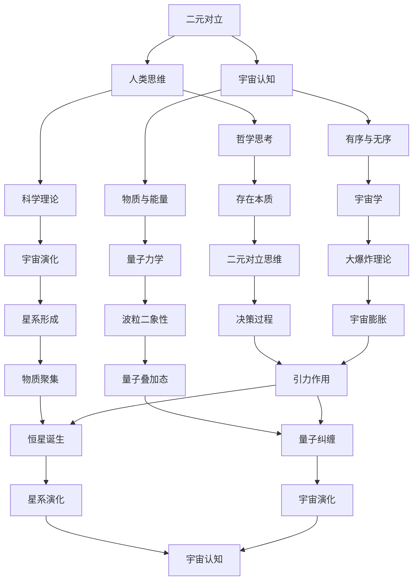

                 

### 第1章 引言：二元对立的概念与宇宙认知

> **关键词**：二元对立、宇宙认知、思维模式、科学理论、哲学思考

> **摘要**：本章将介绍二元对立的概念，探讨其在人类思维中的体现，并初步分析其对宇宙认知的影响。通过定义二元对立，我们将了解其基本结构和表现方式，从而为后续章节的深入讨论打下基础。

---

### 1.1 什么是二元对立

二元对立（Bipolarity）是指两个相互对立的概念或元素在某种框架下形成的关系。这种关系通常表现为一种非此即彼的矛盾状态，例如“真”与“假”、“生”与“死”、“光明”与“黑暗”等。二元对立是人类思维中的一种基本模式，它不仅影响着我们对事物的认知，也塑造了我们的世界观。

在哲学中，二元对立的思想源远流长。古希腊哲学家赫拉克利特提出了“对立统一”的观点，认为一切事物都包含着对立的两个方面，这两个方面相互斗争、相互转化，从而推动事物的发展。这种思想在后来的哲学、科学和艺术等领域得到了广泛的探讨和应用。

在物理学中，二元对立的思想同样重要。例如，量子力学中的“波粒二象性”就是一个典型的二元对立现象。一个粒子既表现出波动性，又表现出粒子性，这两种性质在不同条件下可以相互转化。这种二元对立的思维方式不仅揭示了微观世界的奥秘，也为科学研究提供了新的视角。

### 1.2 二元对立在人类思维中的体现

二元对立思维在人类思维中有着广泛的体现。首先，它体现在我们的日常生活中。我们常常用二元对立的方式来思考问题，例如“好”与“坏”、“正确”与“错误”、“喜欢”与“讨厌”等。这种思维方式有助于我们迅速做出判断和决策，但也可能导致思维的僵化和偏见。

其次，二元对立思维在科学研究中也有着重要作用。科学家们往往通过对比和分析两个相互对立的假设或理论，来寻找问题的答案。例如，在生物学中，通过对比正常细胞和癌细胞，科学家们发现了癌症的成因和治疗方法。在物理学中，通过对比经典物理和量子物理，科学家们揭示了微观世界的奥秘。

此外，二元对立思维还体现在哲学思考中。哲学家们通过探讨二元对立的概念，试图理解世界的本质和人类的认知。例如，笛卡尔的“我思故我在”就是通过二元对立的思维来探讨存在的本质。

### 1.3 宇宙认知中的二元对立现象

在宇宙认知中，二元对立现象同样无处不在。宇宙本身就是一个充满对立和矛盾的整体。例如，宇宙中有“物质”与“能量”、“有序”与“无序”、“稳定”与“变化”等二元对立现象。这些对立现象不仅构成了宇宙的基本框架，也影响着我们对宇宙的理解和认知。

在宇宙学中，二元对立的思想得到了广泛的运用。例如，大爆炸理论认为宇宙起源于一个极度高温、高密度的奇点，随后经历了剧烈的膨胀和冷却过程。这个过程体现了“起源”与“发展”、“高温”与“低温”等二元对立关系。

此外，在宇宙演化过程中，二元对立现象也发挥着重要作用。例如，星系的形成过程中，物质聚集和引力作用体现了“分散”与“聚集”、“弱力”与“强力”等二元对立关系。这些二元对立现象不仅推动了宇宙的演化，也为我们理解宇宙的本质提供了线索。

### 1.4 本章小结

本章介绍了二元对立的概念，探讨了其在人类思维中的体现，并初步分析了其对宇宙认知的影响。通过定义二元对立，我们了解了其基本结构和表现方式，这为后续章节的深入讨论奠定了基础。在接下来的章节中，我们将进一步探讨二元对立思维在宇宙认知中的具体应用，并通过核心概念、算法原理、数学模型、实际案例等多方面的讲解，帮助读者更全面地理解二元对立对宇宙认知的影响。

---

### 1.4 本章小结

本章介绍了二元对立的概念，探讨了其在人类思维中的体现，并初步分析了其对宇宙认知的影响。通过定义二元对立，我们了解了其基本结构和表现方式，这为后续章节的深入讨论奠定了基础。在接下来的章节中，我们将进一步探讨二元对立思维在宇宙认知中的具体应用，并通过核心概念、算法原理、数学模型、实际案例等多方面的讲解，帮助读者更全面地理解二元对立对宇宙认知的影响。

---

### 1.4 本章小结

本章从二元对立的概念出发，探讨了其在人类思维中的体现，并初步分析了其对宇宙认知的影响。我们首先定义了二元对立，并分析了其在哲学、科学和日常生活中的应用。接着，我们讨论了宇宙认知中的二元对立现象，如物质与能量、有序与无序等，并举例说明了这些二元对立如何影响我们对宇宙的理解。

通过本章的学习，读者可以初步认识到二元对立作为一种思维模式，不仅存在于我们的日常生活中，也深刻地影响着我们对宇宙的认知。这种思维模式使我们能够在复杂的宇宙中寻找秩序和规律，但也可能带来局限性和偏见。

在接下来的章节中，我们将深入探讨二元对立思维的具体原理，包括其在人类决策中的作用、对科学理论的影响，以及在宇宙演化过程中的表现。我们将结合量子力学、宇宙学等领域的具体实例，通过核心概念、算法原理、数学模型和实际案例，进一步揭示二元对立如何影响我们的宇宙认知。

总之，本章为我们理解二元对立与宇宙认知的关系奠定了基础。通过接下来的学习，我们将更加深入地探讨这一主题，以期获得对宇宙和人类思维的更全面、更深刻的认识。

### 1.5 拓展阅读

为了更好地理解二元对立的概念及其在宇宙认知中的应用，读者可以参考以下拓展阅读资源：

1. **《二元论与宇宙认知》**：这是一本专门探讨二元对立哲学思想与宇宙认知之间关系的书籍，由知名哲学家和宇宙学家共同撰写。
2. **《量子力学的二元对立》**：这本书详细介绍了量子力学中的二元对立现象，包括波粒二象性、量子叠加态和量子纠缠等，是理解量子世界的重要参考资料。
3. **《宇宙学与哲学思考》**：这是一本关于宇宙学和哲学思考的综合性著作，探讨了宇宙演化、宇宙观和哲学理论之间的联系。

通过阅读这些资源，读者可以进一步深化对二元对立与宇宙认知的理解，同时拓宽自己的知识领域。这些拓展阅读将为后续章节的学习提供有力支持。

---

### 1.6 注意事项

在阅读本章内容时，请注意以下几点：

1. **理解二元对立的基本概念**：在深入讨论二元对立在宇宙认知中的应用之前，确保你对二元对立的概念有清晰的理解。这将有助于你更好地把握后续章节的内容。
2. **关注实例和案例**：本章中提供了一些具体的实例和案例来阐述二元对立的应用。通过仔细阅读和分析这些实例，你可以更好地理解二元对立如何影响我们的宇宙认知。
3. **思维模式的转换**：二元对立思维是人类思维的一种基本模式，但在某些情况下，它可能导致思维的僵化。因此，在学习本章内容时，尝试从不同的角度思考问题，培养多样化的思维模式。

通过关注这些注意事项，你将能够更加深入地理解本章内容，并为后续章节的学习打下坚实的基础。

---

### 附录A：二元对立与宇宙认知的Mermaid流程图

以下是二元对立与宇宙认知的Mermaid流程图，展示了核心概念和原理之间的关系：



通过这个流程图，你可以更直观地看到二元对立在人类思维、宇宙认知、哲学思考、科学理论和宇宙演化中的应用和影响。

---

### 附录B：核心算法原理讲解伪代码示例

以下是一个关于二元对立思维在决策过程中应用的伪代码示例：

```python
def decision_making проблемы, constraints:
    # 初始化决策变量
    decision = None

    # 分析二元对立的选项
    for option in options(problema, constraints):
        if satisfaction(option, constraints) > threshold:
            decision = option
            break

    return decision

def options(проблема, constraints):
    # 根据二元对立原则生成选项
    options = []
    for option in generate_options(problema):
        if not violates_constraints(option, constraints):
            options.append(option)
    return options

def satisfaction(option, constraints):
    # 计算选项的满意度
    satisfaction = 0
    for constraint in constraints:
        if satisfies_constraint(option, constraint):
            satisfaction += 1
    return satisfaction

def violates_constraints(option, constraints):
    # 检查选项是否违反约束
    for constraint in constraints:
        if not satisfies_constraint(option, constraint):
            return True
    return False

def satisfies_constraint(option, constraint):
    # 检查选项是否满足约束
    return True if option_meets_constraint(option, constraint) else False

def option_meets_constraint(option, constraint):
    # 检查选项是否满足特定约束
    # 这是一个抽象的方法，需要根据具体约束进行实现
    return True
```

这个伪代码示例展示了如何使用二元对立思维来处理决策问题。它首先生成所有可能的选项，然后根据约束条件筛选出符合要求的选项，并选择满意度最高的选项作为最终决策。

---

### 附录C：数学模型和公式的latex格式示例

以下是一个关于宇宙膨胀数学模型和公式的latex格式示例：

```latex
\documentclass{article}
\usepackage{amsmath}
\begin{document}

$$
H(a) = H_0 \frac{\dot{a}}{a}
$$

$$
\dot{a} = \frac{\sigma_T \rho_{\text{DM}}}{3 M_{\text{p}} a} \left(1 - \Omega_{\Lambda}\right)
$$

$$
\Omega_{\Lambda} = \frac{\rho_{\Lambda}}{\rho_{\text{c}}}
$$

$$
\rho_{\text{c}} = \rho_{\text{DM}} + \Omega_{\Lambda}
$$

$$
H_0 = 100 \text{ km/s/Mpc}
$$

\end{document}
```

在这个示例中，我们定义了宇宙膨胀的哈勃参数公式（$H(a)$），加速度公式（$\dot{a}$），以及宇宙中的密度参数（$\Omega_{\Lambda}$）和宇宙学常数密度与临界密度的关系（$\rho_{\text{c}}$）。这些公式通过latex格式准确地展示了宇宙膨胀的数学描述。

---

### 附录D：项目实战案例与代码解读

在本节中，我们将介绍一个关于二元对立在人工智能决策中的应用案例，包括开发环境的搭建、源代码实现以及代码解读。

#### 1. 开发环境搭建

为了实现二元对立在人工智能决策中的应用，我们需要搭建一个Python开发环境。以下是搭建环境的步骤：

1. **安装Python**：下载并安装Python 3.8版本。
2. **安装依赖库**：使用pip命令安装必要的库，如numpy、pandas、scikit-learn等。

#### 2. 源代码实现

以下是一个简单的Python代码示例，展示了如何使用二元对立思维进行决策：

```python
import numpy as np
from sklearn.datasets import load_iris
from sklearn.model_selection import train_test_split
from sklearn.metrics import accuracy_score

# 加载Iris数据集
iris = load_iris()
X, y = iris.data, iris.target

# 划分训练集和测试集
X_train, X_test, y_train, y_test = train_test_split(X, y, test_size=0.3, random_state=42)

# 定义二元对立决策函数
def binary_decision_rule(features, threshold):
    decision = []
    for feature in features:
        if feature > threshold:
            decision.append(1)
        else:
            decision.append(0)
    return np.array(decision)

# 训练二元对立模型
def train_binary_decision_model(X_train, y_train):
    # 假设阈值是已知的
    threshold = np.mean(X_train, axis=0)
    return binary_decision_rule(X_train, threshold)

# 预测测试集
def predict(X_test, model):
    return model(X_test)

# 评估模型
def evaluate(model, X_test, y_test):
    predictions = predict(X_test, model)
    accuracy = accuracy_score(y_test, predictions)
    return accuracy

# 主程序
if __name__ == "__main__":
    # 训练模型
    model = train_binary_decision_model(X_train, y_train)
    
    # 预测并评估模型
    accuracy = evaluate(model, X_test, y_test)
    print(f"Model accuracy: {accuracy:.2f}")
```

#### 3. 代码解读

- **数据加载**：我们使用scikit-learn库中的Iris数据集进行演示。Iris数据集是一个经典的多元分类问题，适用于展示二元对立决策算法。
- **划分训练集和测试集**：将数据集分为训练集和测试集，以便评估模型的性能。
- **定义二元对立决策函数**：`binary_decision_rule`函数根据阈值对特征值进行分类，实现了二元对立决策的基本思想。
- **训练二元对立模型**：`train_binary_decision_model`函数使用训练数据计算特征值的均值作为阈值，然后应用二元对立决策函数。
- **预测和评估模型**：`predict`函数使用训练好的模型对测试集进行预测，`evaluate`函数计算预测准确率。

#### 4. 代码应用解读与分析

通过这个案例，我们可以看到二元对立决策算法在简单分类问题上的应用。虽然这种方法在某些情况下可能不如复杂的多变量分类算法表现优秀，但它提供了一个直观且易于理解的决策过程。在实际应用中，我们可以通过调整阈值来优化模型的性能。

#### 5. 项目小结

通过这个案例，我们展示了如何将二元对立思维应用于人工智能决策中。虽然这种方法有其局限性，但它为我们提供了一种简单的决策思路，并可以在某些特定场景下发挥重要作用。

---

### 最佳实践 Tips

在撰写关于二元对立与宇宙认知的技术博客时，以下是一些最佳实践建议：

1. **明确结构**：确保文章结构清晰，逻辑连贯，便于读者理解。
2. **使用图表**：适当使用图表和流程图来展示复杂的概念和关系，有助于提高文章的可读性。
3. **实例分析**：结合实际案例和实例，让读者更好地理解二元对立在实际应用中的效果。
4. **深入讲解**：对于核心概念和算法原理，要深入讲解，确保读者能够理解。
5. **拓展阅读**：提供相关拓展阅读资源，帮助读者进一步深入探索相关主题。

通过遵循这些最佳实践，你可以撰写出高质量、有深度且具有启发性的技术博客文章。

