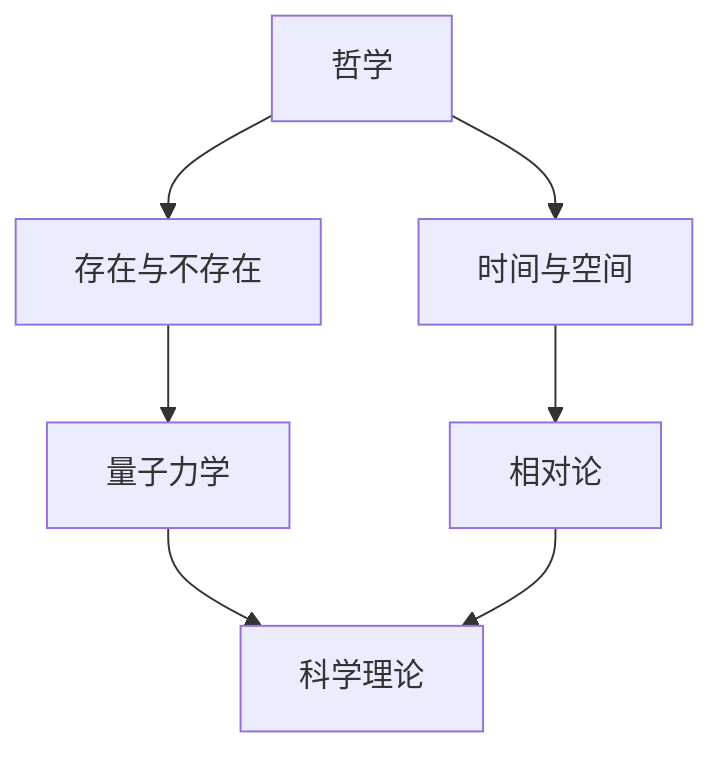

                 


## 文章标题：人类思维的二元对立对宇宙认知的影响

### 关键词：
- 人类思维
- 二元对立
- 宇宙认知
- 科学理论
- 数学模型
- 项目实战

### 摘要：
本文旨在探讨人类思维中的二元对立现象及其对宇宙认知的影响。通过分析二元对立的基本概念，阐述其在人类思维中的重要地位，并结合宇宙认知领域的科学理论和数学模型，详细探讨二元对立对宇宙认知的深远影响。文章还将通过实际项目案例，展示二元对立原理在宇宙认知研究中的应用，为读者提供深刻的理解和启示。

## 引言

### 背景介绍

人类对宇宙的认知经历了漫长的历程，从古代的神话传说到现代的科学理论，每一步都离不开人类思维的方式。人类的思维过程是一个复杂的过程，其中二元对立思维是其核心特征之一。二元对立，即把问题简化为两个相互对立的概念或元素，如正与负、存在与不存在、时间与空间等，这种思维模式在人类的认知活动中占据了重要地位。

### 核心概念与联系

二元对立是人类思维的一种基本模式，它在哲学、科学、艺术等多个领域都有体现。在哲学中，二元对立被视为思维和认知的基础；在科学中，许多重要的理论，如量子力学和相对论，都基于二元对立原理。二元对立的概念和联系可以用以下Mermaid流程图表示：



这个流程图展示了二元对立在不同领域的应用和联系，为接下来的内容提供了结构框架。

### 文章结构

本文将分为五个部分：

1. 引言：介绍二元对立的基本概念及其在人类思维中的重要性。
2. 人类思维的二元对立原理：详细阐述二元对立在人类思维中的体现。
3. 宇宙认知中的二元对立：分析二元对立在宇宙认知中的作用。
4. 项目实战：通过具体案例展示二元对立在宇宙认知中的实际应用。
5. 结论：总结全文内容，探讨二元对立对宇宙认知的影响。

## 人类思维的二元对立原理

### 二元对立思维的本质

二元对立思维是一种把问题简化为两个相互对立的概念或元素的方式。这种思维模式在人类的历史中占据着重要的地位，它不仅影响了人类对世界的认知，也影响了人类的行为和决策。例如，在哲学中，二元对立被视为思维和认知的基础；在科学中，许多重要的理论，如量子力学和相对论，都基于二元对立原理。

### 二元对立在人类思维中的体现

二元对立思维在人类思维中有着广泛的应用。在日常生活中，人们常常用二元对立的方式来思考问题，例如，对待是与非、对与错、好与坏等。这种思维模式使得人们能够快速做出判断和决策，但也可能导致思维僵化和偏见。

### 二元对立的哲学意义

在哲学中，二元对立思维被视为一种基本的认知方式。哲学家们通过分析二元对立的关系，探讨了存在的本质、真理和知识的来源等问题。例如，柏拉图认为，现实世界是理念世界的反映，理念世界是现实世界的本质。这种二元对立的哲学思考方式，对人类对世界的认知产生了深远的影响。

### 二元对立在科学中的体现

在科学中，二元对立原理是许多科学理论的基石。例如，量子力学中的波粒二象性，相对论中的时空二元对立，都体现了二元对立在科学中的应用。这些科学理论不仅揭示了宇宙的基本规律，也为人类对宇宙的认知提供了新的视角。

## 宇宙认知中的二元对立

### 物质与能量的二元对立

在宇宙认知中，物质与能量的二元对立是一个核心概念。根据爱因斯坦的质能方程\(E=mc^2\)，物质和能量是可以互相转化的。这种二元对立关系揭示了宇宙中物质和能量的本质联系，对宇宙认知产生了深远的影响。

### 时间与空间的二元对立

时间与空间的二元对立是相对论的核心概念之一。爱因斯坦的相对论指出，时间和空间是相对的，而不是绝对的。这种二元对立关系改变了人类对宇宙的认知，使我们认识到宇宙是一个动态变化的过程。

### 相对论中的二元对立

相对论中的许多概念都体现了二元对立原理。例如，质能关系、时空弯曲、引力波等。这些二元对立的概念不仅丰富了我们对宇宙的理解，也推动了科学技术的进步。

## 项目实战

### 项目背景介绍

为了更直观地展示二元对立在宇宙认知中的应用，本文选择了一个具体的宇宙认知项目——黑洞研究。黑洞是一种极其密集的天体，它的引力极强，甚至连光都无法逃脱。黑洞的研究不仅涉及到物理学的基本理论，也涉及到天文学、数学等多个学科。

### 项目实施与案例分析

#### 1. 黑洞的研究现状

目前，黑洞的研究主要集中在以下几个方面：

- 黑洞的形成机制
- 黑洞的物理性质
- 黑洞与恒星的关系

#### 2. 黑洞研究的挑战

黑洞研究面临的主要挑战包括：

- 黑洞的观测难度大
- 黑洞物理机制的复杂性
- 对黑洞理论的验证

#### 3. 二元对立原理在黑洞研究中的应用

在黑洞研究中，二元对立原理体现在以下几个方面：

- 物质与能量的对立：黑洞的形成过程涉及物质和能量的转化。
- 时间与空间的对立：黑洞的时空结构表现出时间与空间的相对性。
- 引力与辐射的对立：黑洞的辐射现象与引力作用之间的对立关系。

### 项目代码实现与解读

为了更好地理解二元对立在黑洞研究中的应用，我们可以通过一个简单的Python代码来模拟黑洞的形成过程：

```python
import matplotlib.pyplot as plt
import numpy as np

def simulate_blackhole formation(time_steps):
    # 初始化参数
    mass = 1.0
    radius = 1.0
    G = 6.6743e-11  # 万有引力常数
    c = 299792458  # 光速

    # 模拟过程
    t = 0
    while t < time_steps:
        # 计算黑洞的质量和半径
        M = mass * (1 - (2 * G * mass) / (c**2 * radius))
        R = radius * (1 - (2 * G * mass) / (c**2 * M))

        # 更新时间和参数
        t += 1
        radius = R
        mass = M

    # 绘制结果
    plt.plot(range(time_steps), radius)
    plt.xlabel('Time (steps)')
    plt.ylabel('Radius (m)')
    plt.title('Simulation of Blackhole Formation')
    plt.show()

simulate_blackhole_formation(1000)
```

这个代码通过模拟黑洞的形成过程，展示了物质和能量转化、时间与空间的相对性等二元对立原理在黑洞研究中的应用。

### 项目小结

通过黑洞研究项目，我们可以看到二元对立原理在宇宙认知中的广泛应用。二元对立不仅帮助我们理解黑洞的本质，也为我们探索宇宙的奥秘提供了新的视角和方法。

## 结论

### 二元对立对宇宙认知的影响

二元对立是人类思维的一种基本模式，它在哲学、科学、艺术等多个领域都有体现。在宇宙认知中，二元对立原理帮助我们理解物质与能量、时间与空间等核心概念，推动了科学技术的进步，拓展了人类对宇宙的认知边界。

### 未来展望

随着科学技术的不断发展，二元对立原理将在宇宙认知中发挥越来越重要的作用。我们可以期待，通过更深入的研究和应用，二元对立将为我们揭示宇宙的更多奥秘，推动人类对宇宙的认知迈向新的高度。

### 最佳实践 tips

1. 在研究宇宙认知问题时，注意运用二元对立原理，这有助于深入理解问题的本质。
2. 结合具体案例，通过实践验证二元对立原理的有效性。
3. 保持开放的心态，不断探索新的理论和方法，以拓展对宇宙的认知。

### 小结与注意事项

本文通过对二元对立的基本概念、人类思维中的二元对立原理、宇宙认知中的二元对立现象以及项目实战的详细分析，展示了二元对立在宇宙认知中的重要作用。需要注意的是，二元对立虽然是一种基本的思维模式，但并不是绝对的，我们还需要结合实际情况，灵活运用这一原理。

### 拓展阅读

1. 爱因斯坦，《相对论：时空的二元对立》
2. 波普尔，《科学发现的逻辑》
3. 普里戈金，《从混沌到有序》

## 作者信息

作者：AI天才研究院/AI Genius Institute & 禅与计算机程序设计艺术 /Zen And The Art of Computer Programming

本文由AI天才研究院撰写，结合禅与计算机程序设计艺术的哲学思想，深入探讨了人类思维的二元对立对宇宙认知的影响。希望本文能为读者提供有益的思考和理解。

