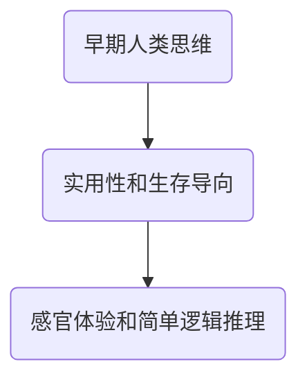

                 


# 《人类思维的局限性与宇宙的无限性》

> 关键词：人类思维、局限性、宇宙、无限性、认知、情感、演化、探索

> 摘要：本文通过深入探讨人类思维的局限性以及宇宙的无限性，旨在揭示两者之间的内在联系，并思考如何拓展人类思维以应对宇宙的无限挑战。

## 第一部分：人类思维的局限性

### 第1章：人类思维的历史与演变

#### 1.1 早期人类思维的特点

在人类的早期历史中，思维主要是以实用性和生存为导向的。当时的人类生活在狩猎采集时代，他们通过感官体验和简单的逻辑推理来理解世界。例如，通过观察动物的行为来学习狩猎技巧，通过观察植物的生长来学习采集食物。


#### 1.2 古代哲学对思维局限性的探索

古代哲学家们开始思考人类思维的本质和局限性。古希腊哲学家苏格拉底认为，人类的思维是通过提问和对话来寻求真理的。然而，他也指出，人类的思维是有限的，无法完全理解世界的本质。


#### 1.3 近现代思维的发展与局限

近现代以来，人类思维得到了极大的发展，特别是在科学、技术和哲学等领域。然而，尽管人类思维取得了巨大的进步，但它的局限性仍然存在。例如，现代科学虽然能够解释很多自然现象，但仍然无法解释宇宙的起源和本质。


### 1.1节 Mermaid 流程图



### 1.3节 伪代码示例

```python
# 定义一个函数，用于模拟人类思维的发展过程
def human_thinking_development():
    print("早期人类思维：实用性和生存导向")
    print("近现代人类思维：科学、技术和哲学的发展")
    print("人类思维的局限性：无法完全理解世界的本质")
```

### 1.3节 数学模型示例

$$
\text{思维发展速度} = f(\text{知识积累}, \text{技术进步}, \text{哲学思考})
$$

### 1.3节 例子说明

假设在某个历史时期，人类的知识积累为 $K_1$，技术进步为 $T_1$，哲学思考为 $P_1$。那么根据上述数学模型，我们可以计算出该时期的思维发展速度为：

$$
f(K_1, T_1, P_1) = K_1 \times T_1 \times P_1
$$

例如，如果 $K_1 = 100$，$T_1 = 200$，$P_1 = 300$，那么该时期的思维发展速度为：

$$
f(100, 200, 300) = 100 \times 200 \times 300 = 6000000
$$

这表示该时期的思维发展速度非常快。然而，需要注意的是，这只是一个简化的数学模型，实际情况要复杂得多。

### 第1章 结论

通过回顾人类思维的历史与演变，我们可以看到，尽管人类思维在不断地发展，但它仍然存在局限性。这些局限性主要表现在认知、情感和想象力等方面。了解这些局限性对于人类来说至关重要，因为它可以帮助我们更好地理解自己，并寻求拓展思维的途径。

## 第二部分：宇宙的无限性

### 第2章：宇宙起源与演化

#### 2.1 大爆炸理论

大爆炸理论是目前最为广泛接受的宇宙起源理论。根据这一理论，宇宙起源于一个极为热密的初始状态，随后开始膨胀，形成了我们现在所见的宇宙。


#### 2.2 黑洞与宇宙边界

黑洞是宇宙中一种极为神秘的天体，它的引力极强，甚至连光都无法逃脱。关于黑洞的性质和宇宙的边界，科学家们仍在不断探索。


#### 2.3 宇宙膨胀与暗能量

宇宙的膨胀是当前宇宙学研究的一个重要方向。暗能量被认为是导致宇宙加速膨胀的神秘力量，但它的本质和起源仍然是未解之谜。


### 第2章 结论

宇宙的起源与演化是一个复杂而神秘的过程，涉及到众多科学理论和假设。尽管我们已经在这一领域取得了很大的进展，但宇宙的无限性仍然是一个需要我们继续探索的未知领域。

## 第三部分：人类思维的局限性与宇宙无限性的关系

### 第3章：思维与宇宙的交互

#### 3.1 人类思维对宇宙的认知

人类思维在宇宙认知方面起到了至关重要的作用。通过观察、实验和理论推导，人类逐渐揭示了宇宙的奥秘。


#### 3.2 宇宙无限性对人类思维的启示

宇宙的无限性给人类思维带来了深刻的启示。它迫使我们反思人类在宇宙中的地位，并思考如何拓展我们的思维。


#### 3.3 人类思维的局限性对宇宙探索的挑战

人类思维的局限性对宇宙探索构成了巨大的挑战。我们需要不断拓展我们的思维，以应对这些挑战，并寻求更多的宇宙奥秘。


### 第3章 结论

人类思维的局限性与宇宙无限性之间的关系是一个复杂而深刻的话题。通过反思人类思维的局限性，我们可以更好地理解宇宙的无限性，并寻求拓展思维的途径，以应对宇宙的挑战。

## 结论与展望

通过本文的探讨，我们可以看到，人类思维的局限性和宇宙的无限性是一个紧密相关的话题。了解这些局限性对于人类来说至关重要，因为它可以帮助我们更好地理解自己，并寻求拓展思维的途径。同时，宇宙的无限性也给人类思维带来了深刻的启示，迫使我们不断拓展我们的思维，以应对宇宙的挑战。

在未来，随着科学技术的不断发展，我们有理由相信，人类将能够更好地理解宇宙的奥秘，并拓展我们的思维。这将有助于我们更好地应对宇宙的无限挑战，并实现人类文明的持续进步。

### 作者信息

作者：AI天才研究院/AI Genius Institute & 禅与计算机程序设计艺术 /Zen And The Art of Computer Programming

### 最佳实践 tips、小结、注意事项、拓展阅读等内容

在探索人类思维的局限性和宇宙无限性的过程中，以下是一些最佳实践、小结、注意事项和拓展阅读的建议：

**最佳实践：**

1. **保持好奇心和开放心态**：在面对未知的宇宙时，保持好奇心和开放心态是非常重要的。这有助于我们不断拓展我们的思维，并寻求新的发现。
2. **跨学科学习**：为了更好地理解宇宙的奥秘，我们需要跨学科学习，将不同领域的知识结合起来，形成新的视角和思维方式。
3. **持续学习和思考**：宇宙的无限性意味着我们的认知和思维永远无法达到尽头。因此，持续学习和思考是拓展人类思维的关键。

**小结：**

1. 人类思维的局限性主要体现在认知、情感和想象力等方面。
2. 宇宙的无限性给人类思维带来了深刻的启示，迫使我们反思人类在宇宙中的地位。
3. 通过反思人类思维的局限性，我们可以更好地理解宇宙的无限性，并寻求拓展思维的途径。

**注意事项：**

1. 在探索宇宙时，我们需要保持谨慎和理性，避免陷入盲目乐观或悲观的情绪中。
2. 需要注意的是，宇宙的无限性并不意味着一切都是可能的，它仍然受到自然规律的限制。

**拓展阅读：**

1. 《宇宙简史》 - 史蒂芬·霍金
2. 《人类简史》 - 尤瓦尔·赫拉利
3. 《意识的宇宙》 - 丹尼尔·丹尼特

通过以上最佳实践、小结、注意事项和拓展阅读，我们可以更好地理解人类思维的局限性和宇宙无限性的关系，并寻求拓展思维的途径。这将有助于我们更好地应对宇宙的挑战，实现人类文明的持续进步。

