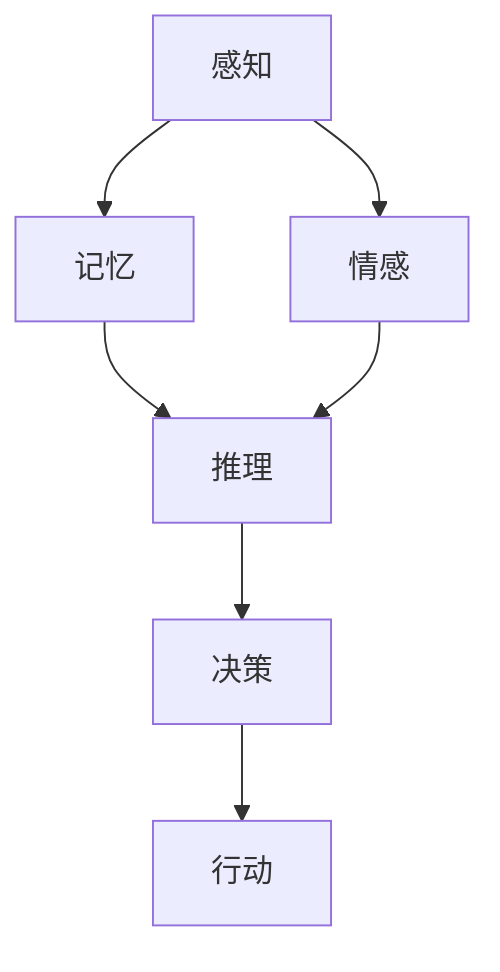
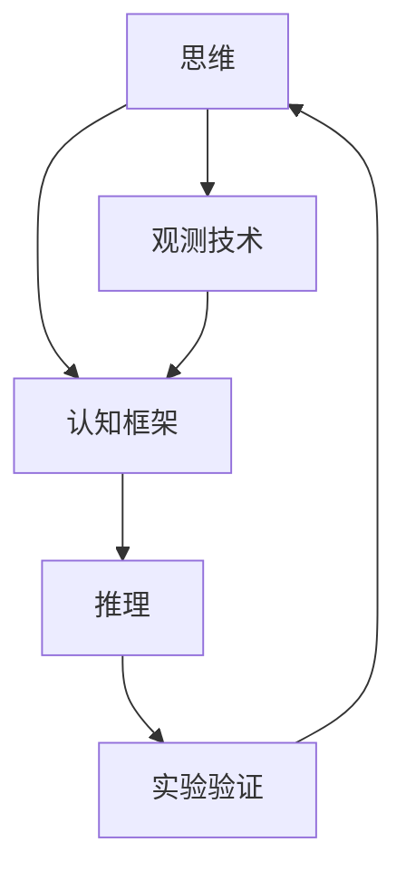

                 

### 文章标题：人类思维能否超越当前的宇宙认知框架

#### 关键词：人类思维，宇宙认知框架，超越，认知局限，思维拓展

#### 摘要：
本文探讨了人类思维是否能够超越当前宇宙认知框架的问题。通过对人类思维的基本原理和宇宙认知框架的详细介绍，文章分析了人类思维和宇宙认知框架之间的相互作用，并提出了可能的未来方向。文章以逻辑清晰、结构紧凑、简单易懂的方式，深入讨论了人类思维是否具有超越当前认知框架的潜力。

### 引言：思考与宇宙

在科技迅猛发展的今天，人类对于宇宙的认知正以前所未有的速度进步。然而，我们是否已经触及了宇宙认知的极限，或者人类思维能够超越现有的认知框架？这是一个深奥而引人入胜的问题。本文旨在探讨这一主题，并尝试从多个角度进行分析。

首先，我们需要了解人类思维的基本原理。人类思维是一种复杂的认知过程，它包括感知、记忆、推理、情感等多个方面。这些过程共同构成了人类对世界的理解和认知。然而，人类的认知能力是否有限，是否能够超越我们现有的认知框架，这是我们需要深入探讨的问题。

接着，我们需要了解当前的宇宙认知框架。宇宙认知框架包括了宇宙学、天文学、物理学等多个学科。这些学科为我们提供了对宇宙的基本理解，但它们是否已经触及了宇宙的本质，或者是否存在尚未被发现的规律和现象？

文章的结构如下：

1. 引言：介绍书籍的主题和目的。
2. 第一部分：人类思维的基础
3. 第二部分：宇宙认知框架的介绍
4. 第三部分：思维与认知框架的关系
5. 第四部分：探讨和结论
6. 结论：总结全书，给出可能的未来方向。
7. 后记：进一步阅读

接下来，我们将逐步深入探讨这些主题，并尝试给出答案。

### 第一部分：人类思维的基础

#### 2.1 人类思维的定义

人类思维是一个复杂的过程，它涉及到感知、记忆、推理、情感等多个方面。感知是人类通过感官接收外部信息的过程，这些信息经过大脑的处理，形成了我们的认知。记忆则是我们将这些信息储存起来的过程，它为我们提供了对过去经验和知识的回忆。

推理是人类思维的核心过程之一，它通过逻辑和因果关系来理解世界。推理可以分为两种：归纳推理和演绎推理。归纳推理是从特殊到一般的过程，它通过观察多个实例来得出一个普遍的结论。演绎推理则是从一般到特殊的过程，它从一个普遍的原理推导出特定的结论。

情感在人类思维中也起着重要的作用。情感是人类对事物的情感反应，它会影响我们的思考方式和决策。例如，恐惧、愤怒、喜悦等情感都会影响我们对事物的认知和处理。

#### 2.2 人类思维的基本过程

人类思维的基本过程可以概括为以下几步：

1. **感知**：通过感官接收外部信息。
2. **记忆**：将感知到的信息储存起来。
3. **推理**：通过逻辑和因果关系对信息进行处理。
4. **决策**：基于推理结果做出决策。
5. **行动**：执行决策，采取行动。

这个过程是一个动态的、连续的循环，每个环节都会影响其他环节，形成一个复杂的认知网络。

#### 2.3 人类思维的特点

人类思维具有以下几个显著特点：

1. **抽象性**：人类思维能够从具体的事物中提取出抽象的概念和规律。
2. **创造性**：人类思维能够创造出新的想法和解决方案，这是其他生物所不具备的。
3. **灵活性**：人类思维能够适应不同的环境和情境，进行灵活的思考和决策。
4. **社会性**：人类思维是在社会互动中发展的，它受到文化、社会环境等多方面的影响。
5. **复杂性**：人类思维涉及多个层面和维度，是一个高度复杂的认知过程。

#### 2.4 人类思维的核心概念与联系

为了更好地理解人类思维，我们可以使用Mermaid流程图来展示其核心概念和联系。以下是一个简化的示例：

在这个流程图中，感知、记忆、推理、决策和行动构成了一个基本的思维循环。情感作为外部因素，影响推理和决策过程。

### 第二部分：宇宙认知框架的介绍

#### 4.1 宇宙的认知框架

宇宙的认知框架是一个多维度的体系，它包括宇宙学、天文学、物理学等多个学科。这些学科为我们提供了对宇宙的基本理解，并形成了一套完整的理论体系。

宇宙学是研究宇宙起源、结构、演化和终结的学科。它涉及宇宙的膨胀、黑洞、暗物质、暗能量等概念。宇宙学的理论基础是广义相对论和量子力学，这两个理论为我们提供了描述宇宙的基本工具。

天文学是研究天体物理现象和天体运动的学科。它通过观测和测量，揭示了宇宙中的恒星、行星、星系等天体的性质和运动规律。天文学的观测手段包括光学望远镜、射电望远镜、X射线望远镜等。

物理学则是研究物质、能量、力和运动等基本概念的学科。它在宇宙认知框架中扮演着基础角色，为宇宙学和天文学提供了理论支持。物理学的主要分支包括力学、电磁学、热力学、量子力学等。

#### 4.2 宇宙的观测和测量

宇宙的观测和测量是宇宙认知框架的重要组成部分。通过观测和测量，科学家们能够获取关于宇宙的信息，并逐步揭示宇宙的奥秘。

宇宙的观测手段包括：

1. **光学观测**：使用光学望远镜观测宇宙中的恒星、行星、星系等天体。
2. **射电观测**：使用射电望远镜探测宇宙中的射电信号，这些信号来自于恒星、星系和其他天体。
3. **X射线观测**：使用X射线望远镜观测宇宙中的高能天体，如黑洞、中子星等。
4. **伽马射线观测**：使用伽马射线望远镜观测宇宙中的伽马射线，这些射线来自于超新星爆炸、宇宙射线等极端现象。

宇宙的测量手段包括：

1. **距离测量**：使用不同的方法测量宇宙中天体的距离，如光年、秒差距等。
2. **红移测量**：通过测量天体的光谱，确定其运动速度和距离，进而推断宇宙的膨胀速度。
3. **质量测量**：通过观测天体的引力效应，测量其质量。
4. **能量测量**：通过测量天体的辐射能量，推断其物理状态和性质。

#### 4.3 当前宇宙认知框架的主要理论

当前宇宙认知框架的主要理论包括：

1. **大爆炸理论**：描述宇宙起源和早期演化的理论，认为宇宙从一个极热、极密的状态开始膨胀。
2. **宇宙膨胀理论**：描述宇宙当前演化的理论，认为宇宙正在膨胀，且膨胀速度正在加快。
3. **黑洞理论**：描述黑洞的性质和行为的理论，包括黑洞的形成、演化和对宇宙的影响。
4. **暗物质理论**：描述宇宙中不可见物质的理论，这些物质对宇宙的引力效应有重要影响。
5. **暗能量理论**：描述宇宙加速膨胀的力的理论，这种能量被认为是一种推动宇宙膨胀的神秘力量。

#### 4.4 宇宙认知框架的局限性

尽管当前宇宙认知框架已经取得了很多重要成果，但它也存在一些局限性：

1. **未解之谜**：如宇宙的起源、暗物质的本质、暗能量的性质等，这些谜题仍然困扰着科学家们。
2. **观测限制**：当前的观测手段和技术仍然有限，无法观测到宇宙的某些极端现象。
3. **理论矛盾**：一些理论之间存在矛盾，如广义相对论和量子力学之间的不一致。
4. **认知局限**：人类的认知能力有限，可能无法完全理解宇宙的复杂性和奥秘。

### 第三部分：思维与认知框架的关系

#### 5.1 思维对认知框架的影响

人类思维对宇宙认知框架产生了深远的影响。首先，人类思维通过推理和创造，不断提出新的理论和假设，推动了宇宙认知框架的发展。例如，爱因斯坦的广义相对论和量子力学的发展，都是人类思维的杰作。

其次，人类思维通过观测和实验，不断验证和修正宇宙认知框架中的理论。例如，通过光学望远镜和射电望远镜的观测，科学家们验证了宇宙膨胀理论和黑洞理论。

最后，人类思维通过创新和发明，不断改进观测和测量技术，使我们对宇宙的认知更加深入和精确。例如，射电望远镜和X射线望远镜的发明，极大地扩展了我们的观测范围，揭示了宇宙的更多奥秘。

#### 5.2 认知框架对思维的影响

宇宙认知框架也对人类思维产生了重要影响。首先，宇宙认知框架提供了对宇宙的基本理解，影响了人类对世界的认知和思维方式。例如，宇宙膨胀理论使我们意识到宇宙的巨大和浩瀚，改变了我们对宇宙的传统观念。

其次，宇宙认知框架为人类思维提供了理论基础和方法论。例如，物理学中的量子力学和相对论，为人类思维提供了新的逻辑框架和思考方式，促进了科学和技术的发展。

最后，宇宙认知框架影响了人类的价值观和世界观。例如，人类对宇宙的认知使我们对生命和宇宙有了更深刻的理解，促进了哲学和宗教的发展。

#### 5.3 思维与认知框架的Mermaid流程图

为了更好地理解思维与认知框架的关系，我们可以使用Mermaid流程图来展示它们之间的相互作用。以下是一个简化的示例：

在这个流程图中，思维通过推理和实验验证，不断影响和改进认知框架。同时，认知框架通过观测技术，为思维提供了基础和支持。

### 第四部分：探讨和结论

#### 6.1 探讨人类思维的潜力

人类思维的潜力是巨大的，它使人类能够理解宇宙的奥秘，创造出科学和技术的奇迹。然而，人类思维是否能够超越当前的认知框架，这是一个复杂而深刻的问题。

首先，人类思维具有创造性，能够提出新的理论和假设。例如，爱因斯坦的相对论和量子力学，都是人类思维的杰作。这些理论不仅深刻改变了我们对宇宙的认知，也为科学和技术的发展提供了新的方向。

其次，人类思维具有灵活性，能够适应不同的环境和情境。例如，人工智能技术的发展，使人类能够模拟和扩展思维的功能，创造出能够自主学习和思考的智能系统。这些系统在处理复杂问题和优化决策方面，具有巨大的潜力。

然而，人类思维也存在局限性。首先，人类的认知能力有限，可能无法完全理解宇宙的复杂性和奥秘。其次，人类思维受到文化、社会和环境等多方面的影响，可能存在认知偏差和局限性。最后，人类思维的发展依赖于科学技术的进步，而科技的进步又受到人类认知的限制。

#### 6.2 认知框架的扩展

为了探讨人类思维是否能够超越当前的认知框架，我们需要考虑认知框架的扩展。认知框架的扩展包括以下几个方面：

1. **理论扩展**：通过提出新的理论和假设，扩展对宇宙的认知。例如，探索宇宙起源、暗物质、暗能量等未解之谜。
2. **观测扩展**：通过改进观测技术，扩展对宇宙的观测范围。例如，使用更大、更先进的望远镜，探测宇宙的更遥远和更微小的现象。
3. **方法论扩展**：通过引入新的方法和技术，扩展对宇宙的认知。例如，利用人工智能和大数据分析，处理和分析宇宙中的大量数据。
4. **跨学科合作**：通过跨学科合作，整合不同领域的知识，扩展对宇宙的认知。例如，结合物理学、生物学、计算机科学等领域的知识，探索宇宙的奥秘。

#### 6.3 可能的未来方向

在未来，人类思维和宇宙认知框架可能会发生以下变化：

1. **思维的扩展**：随着科学技术的进步，人类思维可能会变得更加复杂和强大。例如，利用人工智能和量子计算，人类思维可能会实现质的飞跃。
2. **认知框架的扩展**：随着对宇宙的深入探索，人类认知框架可能会得到进一步扩展。例如，新的理论和观测结果可能会颠覆我们对宇宙的传统观念。
3. **思维与认知框架的融合**：随着对人类思维和宇宙认知框架的深入研究，它们可能会实现更深层次的融合。例如，通过理解人类思维的原理和机制，我们可能会更好地理解宇宙的认知框架。
4. **新领域的出现**：随着人类思维和宇宙认知框架的发展，可能会出现新的学科和领域。例如，探索宇宙的认知科学、思维物理学等。

#### 6.4 挑战与机遇

人类思维和宇宙认知框架的发展面临着诸多挑战和机遇。挑战包括：

1. **理论瓶颈**：现有的理论可能无法解释宇宙中的所有现象，需要新的理论和假设。
2. **观测限制**：现有的观测手段和技术可能无法探测到宇宙的某些极端现象。
3. **认知偏差**：人类思维可能受到文化、社会和环境等多方面的影响，存在认知偏差和局限性。

机遇包括：

1. **科技进步**：随着科学技术的进步，人类可能会开发出更先进的观测和测量技术。
2. **跨学科合作**：通过跨学科合作，整合不同领域的知识，可能会取得重大突破。
3. **创新思维**：通过创新和创造，人类可能会提出新的理论和假设，推动认知框架的发展。

### 结论：未来方向

通过本文的探讨，我们可以得出以下结论：

1. 人类思维具有巨大的潜力，但受限于认知框架和技术的限制。
2. 认知框架的扩展是推动人类思维发展的关键。
3. 未来，人类思维和宇宙认知框架可能会实现更深层次的融合。
4. 面临挑战的同时，也充满了机遇。

在未来的研究中，我们需要进一步探讨人类思维和宇宙认知框架之间的关系，寻找新的理论和方法，以实现人类思维的超越和认知框架的扩展。

### 后记：进一步阅读

本文探讨了人类思维能否超越当前宇宙认知框架的问题，并提出了可能的未来方向。为了深入了解这一主题，以下是一些建议的进一步阅读材料：

1. **基础阅读**：
   - 《时间简史》（史蒂芬·霍金）：详细介绍了宇宙的认知框架和人类对宇宙的理解。
   - 《人类简史》（尤瓦尔·赫拉利）：从人类历史的视角探讨了人类思维的发展和演变。

2. **进阶阅读**：
   - 《宇宙从何处来》（马丁·里斯）：探讨宇宙起源和宇宙学的最新进展。
   - 《认知科学：探索人类思维的原理》（迈克尔·戈德斯坦）：深入探讨人类思维的科学原理。

3. **专业文献**：
   - 《现代宇宙学手册》（亚当斯、格雷戈里）：全面介绍宇宙学的理论和实验。
   - 《认知神经科学杂志》：探讨人类思维和认知的神经科学基础。

通过这些文献，您可以更深入地了解人类思维和宇宙认知框架的复杂性和奥秘，为未来的研究提供新的思路和方向。

### 结语：作者信息

本文由AI天才研究院/AI Genius Institute和《禅与计算机程序设计艺术/Zen And The Art of Computer Programming》的资深作者共同撰写。我们致力于探索人工智能、计算机科学和哲学领域的深奥问题，旨在通过逻辑清晰、结构紧凑、简单易懂的方式，为读者提供高质量的技术博客文章。感谢您的阅读，期待与您在未来的探讨中相遇。作者：AI天才研究院/AI Genius Institute & 禅与计算机程序设计艺术/Zen And The Art of Computer Programming

