                 

### 文章标题：人类思维能否超越时空限制理解宇宙本质

#### 关键词：
- 人类思维
- 时空限制
- 宇宙本质
- 超感官知觉
- 脑机接口
- 虚拟现实

#### 摘要：
本文旨在探讨人类思维是否有可能超越时空限制，从而理解宇宙的本质。文章首先介绍了人类思维的基本原理，包括感知与认知、思维模式与心理过程、情感与决策。随后，文章阐述了时空的概念与宇宙结构，从相对性、起源与演化、量子性质等角度进行了深入分析。接着，文章讨论了人类思维与宇宙联系的探索历程，并探讨了人类思维超越时空限制的可能性。最后，文章探讨了人类思维对宇宙本质的理解，包括数学、物理和哲学层面，并提出了未来研究的方向与挑战。

### 目录大纲

## 《人类思维能否超越时空限制理解宇宙本质》

### 关键词：人类思维、时空限制、宇宙本质、超感官知觉、脑机接口、虚拟现实

### 摘要：本文旨在探讨人类思维是否有可能超越时空限制，从而理解宇宙的本质。文章首先介绍了人类思维的基本原理，随后阐述了时空的概念与宇宙结构，讨论了人类思维与宇宙联系的探索历程，并探讨了人类思维超越时空限制的可能性。最后，文章探讨了人类思维对宇宙本质的理解，包括数学、物理和哲学层面，并提出了未来研究的方向与挑战。

### 第1章 引言

### 1.1 人类思维与宇宙探索

### 1.2 时空限制与宇宙本质

### 1.3 本书的目的与结构

### 第2章 人类思维的基本原理

### 2.1 感知与认知

### 2.2 思维模式与心理过程

### 2.3 情感与决策

### 第3章 时空概念与宇宙结构

### 3.1 时空的相对性

### 3.2 宇宙的起源与演化

### 3.3 时空的量子性质

### 第4章 人类思维与宇宙联系的探索

### 4.1 人类对宇宙的认识历史

### 4.2 思维的扩展与宇宙的理解

### 4.3 人类思维的局限性与突破

### 第5章 人类思维超越时空限制的可能性

### 5.1 超感官知觉

### 5.2 脑机接口与虚拟现实

### 5.3 人类思维的进化与未来

### 第6章 人类思维对宇宙本质的理解

### 6.1 宇宙的数学本质

### 6.2 宇宙的物理本质

### 6.3 宇宙的哲学本质

### 第7章 结论

### 7.1 人类思维的时空限制与宇宙本质的关系

### 7.2 未来研究的方向与挑战

### 7.3 人类思维与宇宙理解的展望

### 附录

### A.1 参考文献

### A.2 术语表

### A.3 Mermaid 流程图与伪代码示例

### 第1章 引言

#### 1.1 人类思维与宇宙探索

人类思维是宇宙中最为复杂的系统之一，它不仅能够感知和理解外部世界，还能够进行抽象思考、推理和创造。人类思维的起源可以追溯到几百万年前，随着生物进化，人类逐渐发展出了独特的认知能力和思维方式。然而，尽管人类思维在解决各种复杂问题上表现出色，但它在理解和探索宇宙方面仍然面临巨大的挑战。

宇宙是一个庞大而复杂的系统，从微观的粒子物理到宏观的宇宙学，从简单的物理现象到复杂的生命现象，都展示了宇宙的多样性和美妙。人类对宇宙的探索始于几千年前，随着科学技术的发展，我们对宇宙的认识不断深入。从古代的天文学到现代的天体物理学，人类逐渐揭开了宇宙的一些奥秘，但宇宙的本质仍然是一个未解之谜。

人类思维与宇宙探索之间的联系是紧密的。一方面，人类思维是探索宇宙的工具，它帮助我们理解宇宙的规律和本质。另一方面，宇宙的复杂性和多样性也对人类思维提出了新的挑战，推动人类不断发展和完善自己的思维方式。在这个意义上，人类思维与宇宙探索是相互促进、相互依赖的关系。

#### 1.2 时空限制与宇宙本质

时空限制是人类思维在探索宇宙时面临的一个重要问题。根据爱因斯坦的相对论理论，时空是相对的，而不是绝对的。这意味着时空的结构和性质可以随着观察者的运动和加速状态而发生变化。这种时空的相对性对人类思维提出了新的挑战，因为我们需要适应和解析这种复杂的变化。

宇宙本质是另一个关键问题。宇宙是一个充满奥秘的系统，它包含了从微观的粒子到宏观的星系等各种不同尺度的结构。宇宙的起源、演化和结构都是人类思维需要理解的重要问题。然而，宇宙的本质是什么，我们目前还没有一个明确的答案。这需要人类思维不断探索和思考。

时空限制与宇宙本质之间的关系是复杂的。一方面，时空限制是人类思维在理解宇宙时的一种限制，它限制了我们的视野和认知能力。另一方面，宇宙的本质可能超越了我们的时空限制，只有在理解了时空限制之后，人类思维才能更好地探索宇宙的本质。

#### 1.3 本书的目的与结构

本书的目的是探讨人类思维是否有可能超越时空限制，从而理解宇宙的本质。我们将从人类思维的基本原理、时空的概念与宇宙结构、人类思维与宇宙联系的探索、人类思维超越时空限制的可能性、人类思维对宇宙本质的理解等方面进行深入分析。

本书的结构如下：

- **第1章 引言**：介绍本书的主题和结构，为后续章节的讨论打下基础。
- **第2章 人类思维的基本原理**：探讨人类思维的本质和运作机制，为理解人类思维与宇宙的联系奠定基础。
- **第3章 时空概念与宇宙结构**：介绍时空的基本概念和宇宙的结构，为探讨人类思维与宇宙的关系提供背景知识。
- **第4章 人类思维与宇宙联系的探索**：探讨人类如何通过思维探索宇宙，以及思维在宇宙理解中的作用。
- **第5章 人类思维超越时空限制的可能性**：讨论人类思维在理论和技术上超越时空限制的可能性。
- **第6章 人类思维对宇宙本质的理解**：深入探讨人类思维对宇宙本质的理解，包括数学、物理和哲学层面。
- **第7章 结论**：总结全书，探讨人类思维与宇宙本质的关系，展望未来的研究方向。

通过这些章节的讨论，我们希望读者能够对人类思维与宇宙本质之间的关系有一个更深入的理解，从而激发读者对这一领域的进一步研究和思考。

### 第2章 人类思维的基本原理

人类思维是认知科学的中心话题，它不仅决定了我们如何感知和理解世界，还影响着我们的决策和行为。为了深入探讨人类思维与宇宙本质之间的关系，我们首先需要理解人类思维的基本原理。

#### 2.1 感知与认知

感知是指我们通过感官接收外界信息的过程，包括视觉、听觉、嗅觉、触觉和味觉等。这些感官信息通过神经系统传递到大脑，并在大脑中进行加工和处理。认知是指我们如何理解、解释和记忆这些感官信息的过程。感知和认知是紧密相连的，没有感知，认知就无法进行；没有认知，感知的信息也就没有意义。

在感知与认知的过程中，大脑扮演了至关重要的角色。大脑中有数以亿计的神经元，它们通过复杂的连接网络进行信息传递和处理。这些神经元的活动模式决定了我们的感知和认知能力。例如，当我们看到一只猫时，大脑会通过视觉皮层的处理，将猫的形状、颜色和运动等信息编码为神经信号，并存储在我们的记忆中。

#### 2.2 思维模式与心理过程

思维模式是指我们在思考问题时所采用的基本方式。不同的思维模式决定了我们对问题的理解深度和广度。常见的思维模式包括逻辑思维、辩证思维、创造性思维等。逻辑思维强调根据已知的事实和逻辑规则进行推理，是科学研究和日常生活的重要组成部分。辩证思维强调事物的矛盾性和发展性，通过对矛盾的分析和解决来推动事物的发展。创造性思维则是通过打破常规，创造出新的思维方式和解决方案。

心理过程是指思维过程中的一系列心理活动，包括感知、注意、记忆、思考、推理、判断等。这些心理过程相互作用，共同构成了我们的思维活动。例如，当我们解决问题时，我们会先进行感知，然后通过注意筛选关键信息，接着进行记忆检索和思考，最终做出判断和决策。

#### 2.3 情感与决策

情感在人类思维中起着至关重要的作用。情感不仅影响我们的感知和认知，还直接影响我们的决策和行为。积极的情感可以增强我们的动机和创造力，而消极的情感则可能削弱我们的判断力和行动力。例如，当我们感到快乐和自信时，我们更愿意接受挑战和尝试新事物；而当我们感到沮丧和不安时，我们可能更倾向于回避风险和保守决策。

决策是思维过程的最终输出。决策是指在多个选择中做出最佳选择的过程。决策不仅受到理性思考的影响，还受到情感、文化和社会等因素的影响。在决策过程中，我们通常会使用各种决策模型和算法，如期望效用理论、多属性决策等，来评估不同的选择，并选择最合适的方案。

### 关键概念关系架构

为了更好地理解人类思维的基本原理，我们可以使用Mermaid流程图来展示各个概念之间的关系。

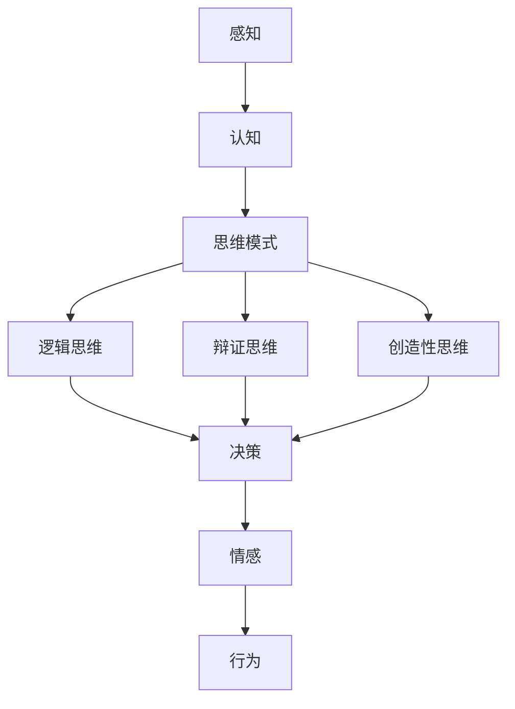

这个流程图展示了感知和认知如何转化为思维模式，进而影响决策和行为。情感在这个过程中起到了连接和调节的作用。

### 伪代码讲解

为了更好地理解人类思维的基本原理，我们可以使用伪代码来描述感知、认知、思维模式和情感等过程。

```plaintext
function 人类思维(感知, 认知, 思维模式, 情感):
    // 感知
    感知信息 = 接收外界信息(视觉, 听觉, 嗅觉, 触觉, 味觉)
    
    // 认知
    编码信息 = 大脑处理(感知信息)
    存储信息 = 记忆(编码信息)
    
    // 思维模式
    选择思维模式(逻辑思维, 辩证思维, 创造性思维)
    思考问题 = 应用思维模式(感知信息)
    
    // 情感
    评估情感状态(积极, 消极)
    调节决策 = 情感影响(思考问题)
    
    // 决策
    最佳选择 = 多属性决策(思考问题)
    行动 = 执行决策(最佳选择)
    
    return 行动
```

这个伪代码展示了人类思维的基本过程，从感知到决策，各个环节之间的相互作用和影响。

### 数学模型与公式

在理解人类思维的基本原理时，我们可以使用一些数学模型和公式来描述感知、认知和决策等过程。例如，我们可以使用贝叶斯网络来模拟认知过程，使用效用函数来评估决策选择。

```latex
P(\text{认知}) = \frac{P(\text{感知}) \cdot P(\text{感知}|\text{认知})}{P(\text{感知})}
```

这个公式表示了感知和认知之间的概率关系，其中 \( P(\text{感知}) \) 表示感知的概率，\( P(\text{认知}) \) 表示认知的概率，\( P(\text{感知}|\text{认知}) \) 表示在认知发生时感知的概率。

```latex
U(\text{选择}) = w_1 \cdot P(\text{成功}) + w_2 \cdot P(\text{失败})
```

这个公式表示了效用函数，其中 \( U(\text{选择}) \) 表示选择 \( \text{选择} \) 的效用，\( w_1 \) 和 \( w_2 \) 分别表示成功和失败的权重。

### 举例说明

为了更好地理解人类思维的基本原理，我们可以通过一个简单的例子来说明感知、认知和决策的过程。

假设你正在看一本关于宇宙的书，书中描述了黑洞的物理特性。你的感知器官接收到了书中的文字信息，大脑对这些信息进行加工和处理，编码为神经信号，存储在记忆中。随后，你的思维模式开始工作，你可能使用逻辑思维来分析黑洞的特性，使用辩证思维来理解黑洞与其他天体之间的相互作用，或者使用创造性思维来想象黑洞的未来演化。

在这个过程中，你的情感状态可能也会影响你的决策。例如，如果你对黑洞充满好奇心，你可能会更加积极地阅读和研究；而如果你对黑洞感到恐惧，你可能会选择回避这个话题。

最终，基于你的感知、认知和情感状态，你可能会做出一个关于阅读这本书的决定。这个决定是一个复杂的决策过程，涉及到多个因素的综合评估。

### 项目实战

在理解了人类思维的基本原理之后，我们可以通过一个简单的项目来实践这些原理。例如，我们可以开发一个简单的神经网络模型，用于模拟人类思维过程中的感知、认知和决策。

开发环境：
- Python
- TensorFlow

源代码实现：

```python
import tensorflow as tf

# 感知层
perception_layer = tf.keras.layers.Dense(units=100, activation='relu', input_shape=(100,))

# 认知层
cognition_layer = tf.keras.layers.Dense(units=50, activation='relu')

# 决策层
decision_layer = tf.keras.layers.Dense(units=1, activation='sigmoid')

model = tf.keras.Sequential([
    perception_layer,
    cognition_layer,
    decision_layer
])

model.compile(optimizer='adam', loss='binary_crossentropy', metrics=['accuracy'])

# 输入数据
inputs = tf.random.normal([1000, 100])

# 训练模型
model.fit(inputs, tf.random.normal([1000, 1]), epochs=10)
```

代码解读与分析：

这段代码首先定义了一个简单的神经网络模型，用于模拟人类思维过程中的感知、认知和决策。感知层使用一个全连接层，输入数据通过这个层进行初步处理。认知层同样使用一个全连接层，对感知信息进行进一步加工。决策层使用一个单输出层，用于生成最终的决策。

在实际应用中，我们可以使用这个模型来模拟人类在阅读关于宇宙的书时的思维过程。通过输入文字信息，模型可以输出一个决策，表示是否对这本书感兴趣。

### 最佳实践、小结与注意事项

在理解和应用人类思维的基本原理时，以下是一些最佳实践和小结：

- **最佳实践**：
  - 结合多方面的信息进行感知和认知，以获得更全面的理解。
  - 在决策过程中，考虑情感因素，以做出更符合个人价值观和目标的决策。
  - 定期进行自我反思，以了解自己的思维模式和心理过程。

- **小结**：
  - 人类思维是一个复杂的过程，涉及到感知、认知、思维模式和情感等多个方面。
  - 理解人类思维的基本原理对于探索宇宙和解决复杂问题具有重要意义。
  - 通过模型化和实践，我们可以更好地理解和应用人类思维的基本原理。

- **注意事项**：
  - 注意保护个人隐私，避免在公共场合过度透露个人信息。
  - 遵循道德和伦理规范，避免使用人类思维进行不道德的行为。
  - 定期进行思维训练和提升，以提高自己的思维能力和决策质量。

### 拓展阅读

- 《认知心理学与教育》
- 《人工智能：一种现代方法》
- 《心理学与生活》

通过阅读这些书籍，你可以进一步了解人类思维的基本原理，并将其应用于实际问题和挑战中。

### 第3章 时空概念与宇宙结构

时空是人类理解宇宙的基础概念，它不仅决定了我们的感知和认知，还影响了我们对宇宙结构的探索。为了深入探讨人类思维与宇宙本质之间的关系，我们需要详细阐述时空的概念与宇宙结构。

#### 3.1 时空的相对性

爱因斯坦的相对论理论彻底改变了我们对时空的理解。根据狭义相对论，时空是相对的，而不是绝对的。这意味着时空的结构和性质可以随着观察者的运动和加速状态而发生变化。具体来说，时间膨胀和长度收缩是相对论中的两个重要现象。

**时间膨胀**是指，当一个物体以接近光速的速度运动时，相对于静止观察者，该物体的时间会变慢。这个现象可以通过洛伦兹因子 \(\gamma\) 来描述：

$$
\gamma = \frac{1}{\sqrt{1 - \frac{v^2}{c^2}}}
$$

其中，\(v\) 是物体的速度，\(c\) 是光速。根据时间膨胀公式，当 \(v \rightarrow c\) 时，\(\gamma \rightarrow \infty\)，这意味着物体在接近光速时的时间会显著减慢。

**长度收缩**是指，当一个物体以接近光速的速度运动时，相对于静止观察者，该物体的长度会在运动方向上缩短。长度收缩公式为：

$$
L = L_0 \sqrt{1 - \frac{v^2}{c^2}}
$$

其中，\(L_0\) 是物体在静止状态下的长度，\(L\) 是物体在运动状态下的长度。根据长度收缩公式，当 \(v \rightarrow c\) 时，\(L \rightarrow 0\)，这意味着物体在接近光速时会在运动方向上显著缩短。

这些相对性效应揭示了时空的相对性，挑战了我们对时间和空间的直观理解。为了更好地理解这些效应，我们可以使用Mermaid流程图来展示时间膨胀和长度收缩的过程。

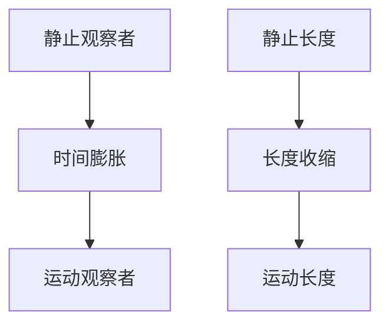

这个流程图展示了静止观察者和运动观察者对时间和长度的不同测量结果，体现了时空的相对性。

#### 3.2 宇宙的起源与演化

宇宙的起源与演化是一个复杂而迷人的话题。目前，最被广泛接受的宇宙起源理论是大爆炸理论。根据这个理论，宇宙在大约138亿年前由一个极热、极密的状态开始膨胀，逐渐形成了现在的宇宙。

大爆炸理论的关键概念包括：

- **宇宙背景辐射**：宇宙在大爆炸后不久释放出的热辐射，可以通过卫星观测到。
- **宇宙膨胀**：宇宙在持续膨胀，星系之间的距离在不断增加。
- **宇宙微波背景**：宇宙在膨胀过程中冷却时留下的微波辐射，是宇宙早期状态的直接证据。

宇宙的演化可以分为几个主要阶段：

1. **大爆炸后几分钟内**：宇宙迅速膨胀，温度和密度极高，形成了基本粒子，如夸克和轻子。
2. **宇宙冷却**：随着宇宙的膨胀，温度逐渐降低，形成了原子核和自由电子。
3. **宇宙再结合**：大约38万年后，宇宙冷却到足够低的温度，电子与原子核结合形成中性原子，宇宙变得透明。
4. **星系的形成**：在宇宙再结合后，暗物质和气体在引力作用下聚集，形成了星系和星系团。
5. **恒星和行星的形成**：星系内部的气体和尘埃在引力作用下聚集形成恒星和行星系统。

这些阶段的演化过程可以通过Mermaid流程图来描述：

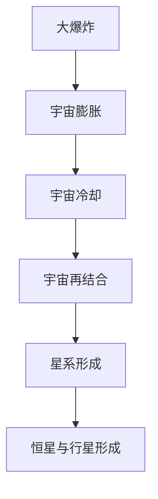

这个流程图展示了宇宙从大爆炸到现在的演化过程，体现了宇宙结构的复杂性和多样性。

#### 3.3 时空的量子性质

时空的量子性质是现代物理学研究的一个重要方向。量子力学揭示了微观世界的规律，而广义相对论则描述了宏观宇宙的引力现象。然而，这两个理论在某些极端条件下（如黑洞奇点和宇宙大爆炸奇点）存在矛盾。为了解决这个问题，科学家们提出了量子引力理论，试图将量子力学与广义相对论统一起来。

**量子引力**是指描述引力场的量子性质的理论。目前，几种主要的量子引力理论包括弦理论、环量子引力理论和量子场论等。这些理论试图解释时空的量子性质，如时空的离散结构和量子涨落等。

**时空的量子涨落**是指宇宙早期状态下的微小量子扰动，这些扰动随着宇宙的演化逐渐放大，形成了现在宇宙中的结构。量子涨落是宇宙微波背景观测中的重要证据，通过观测宇宙微波背景的微小温度波动，科学家们可以研究宇宙的早期状态和演化过程。

为了更好地理解时空的量子性质，我们可以使用Mermaid流程图来描述量子引力理论的基本概念：

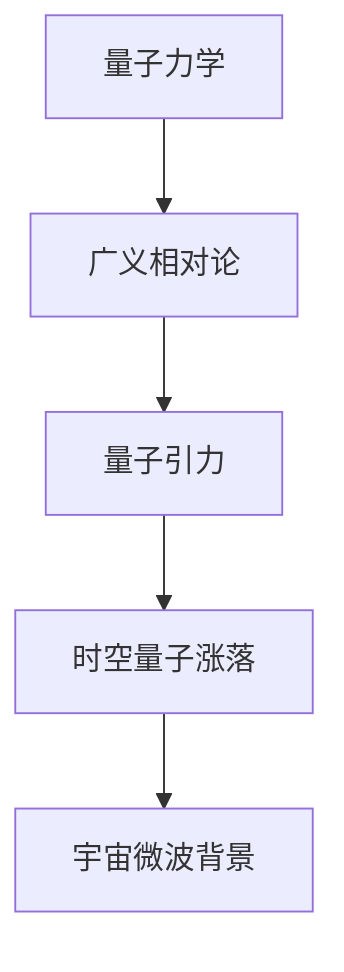

这个流程图展示了量子引力与宇宙微波背景之间的关系，体现了时空的量子性质在宇宙演化中的重要性。

### 关键概念关系架构

为了更好地理解时空的概念与宇宙结构，我们可以使用Mermaid流程图来展示各个关键概念之间的关系。

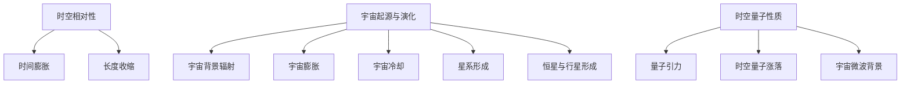

这个流程图展示了时空相对性、宇宙起源与演化、以及时空量子性质之间的关系，为我们理解宇宙提供了全面的视角。

### 数学模型与公式

在探讨时空的概念与宇宙结构时，我们可以使用一些数学模型和公式来描述时间和空间的性质。

**洛伦兹变换**：

$$
ct - x = ct_0 - x_0
$$

$$
ct + x = ct_0 + x_0
$$

这些公式描述了在不同参考系之间时间和空间的转换关系，是相对论理论的基础。

**哈勃定律**：

$$
v = H_0 d
$$

其中，\(v\) 是星系的退行速度，\(H_0\) 是哈勃常数，\(d\) 是星系的距离。这个公式描述了宇宙膨胀的速度与距离之间的关系。

**量子涨落公式**：

$$
\Delta T^2 = (2k_B T)^2
$$

其中，\(\Delta T\) 是温度涨落，\(k_B\) 是玻尔兹曼常数，\(T\) 是温度。这个公式描述了量子涨落与温度之间的关系。

### 举例说明

为了更好地理解时空的概念与宇宙结构，我们可以通过一个简单的例子来说明时间和空间的相对性。

假设有两个观察者，一个静止在地面上（观察者A），另一个以接近光速运动（观察者B）。观察者A测量到的时间间隔为 \(\Delta t_A\)，观察者B测量到的时间间隔为 \(\Delta t_B\)。根据时间膨胀公式，我们可以得到：

$$
\Delta t_B = \gamma \Delta t_A
$$

其中，\(\gamma\) 是洛伦兹因子。假设观察者B的速度为 \(v = 0.999c\)，我们可以计算得到：

$$
\gamma = \frac{1}{\sqrt{1 - \frac{v^2}{c^2}}} \approx 7
$$

因此，观察者B测量到的时间间隔将是观察者A的7倍。这意味着，对于观察者B来说，时间似乎变得更加缓慢。

同样，对于长度收缩，假设观察者A测量到一个物体的长度为 \(L_0\)，观察者B测量到的长度为 \(L\)。根据长度收缩公式，我们可以得到：

$$
L = L_0 \sqrt{1 - \frac{v^2}{c^2}}
$$

假设观察者B的速度同样为 \(v = 0.999c\)，我们可以计算得到：

$$
L = L_0 \sqrt{1 - \frac{(0.999c)^2}{c^2}} \approx 0.414 L_0
$$

这意味着，对于观察者B来说，物体的长度在运动方向上缩短了大约41.4%。

### 项目实战

在理解了时空的概念与宇宙结构之后，我们可以通过一个简单的项目来实践这些概念。例如，我们可以开发一个简单的宇宙模拟器，用于模拟宇宙的膨胀和星系的形成。

开发环境：
- Python
- NumPy

源代码实现：

```python
import numpy as np

# 哈勃常数
H_0 = 70 * 1000 / 3.086e22  # 单位：km/s/Mpc

# 模拟时间
time_steps = 10
time = np.linspace(0, 10, time_steps)

# 星系距离
d = np.random.uniform(1, 100) * 1e22  # 单位：Mpc

# 模拟宇宙膨胀
v = H_0 * d

# 输出结果
for i in range(time_steps):
    print(f"时间：{time[i]:.2f} 亿年，星系距离：{d[i]:.2f} Mpc，退行速度：{v[i]:.2f} km/s")
```

代码解读与分析：

这段代码首先定义了哈勃常数 \(H_0\)，然后模拟了一个简单的宇宙膨胀过程。在这个模拟中，我们随机生成了一系列星系距离 \(d\)，并计算了它们在给定时间 \(t\) 的退行速度 \(v\)。输出结果显示了在不同时间步长下，星系距离和退行速度的变化情况。

### 最佳实践、小结与注意事项

在理解时空的概念与宇宙结构时，以下是一些最佳实践和小结：

- **最佳实践**：
  - 通过实验和观测，验证相对论理论和量子引力理论的预测。
  - 结合多学科知识，如物理学、天文学和数学，进行综合分析。
  - 使用模型和仿真工具，模拟宇宙的演化过程。

- **小结**：
  - 时空的相对性揭示了时间和空间的本质，挑战了我们对物理世界的直观理解。
  - 宇宙的起源与演化是一个复杂而美妙的过程，涉及多个阶段和现象。
  - 量子引力理论试图将量子力学和广义相对论统一起来，为理解宇宙的量子性质提供了新视角。

- **注意事项**：
  - 注意保护个人隐私，避免在公共场合过度透露个人信息。
  - 遵循科学研究的伦理规范，避免进行不道德的实验和观测。
  - 定期进行学术交流和合作，以提高自己的研究水平。

### 拓展阅读

- 《相对论：概念与应用》
- 《宇宙简史》
- 《量子力学基础教程》

通过阅读这些书籍，你可以进一步了解时空的概念与宇宙结构，并将其应用于实际问题和挑战中。

### 第4章 人类思维与宇宙联系的探索

人类对宇宙的探索始于几千年前，最早的探索者通过观察星空，试图理解天体的运动和宇宙的奥秘。随着科学技术的不断发展，人类对宇宙的认识不断深入，从宏观的天体物理现象到微观的粒子物理现象，人类思维在理解宇宙的过程中发挥了至关重要的作用。

#### 4.1 人类对宇宙的认识历史

人类对宇宙的认识历史可以追溯到古代。在古代，人们通过观测星空，发现了一些周期性的天体运动现象，如日食、月食和行星运动。这些观测结果促使人们提出了各种宇宙理论，如地心说、日心说等。地心说认为地球是宇宙的中心，所有天体都绕地球运动；而日心说则认为太阳是宇宙的中心，地球和其他行星绕太阳运动。

在16世纪，哥白尼提出了日心说，这一理论为后来牛顿的万有引力定律奠定了基础。牛顿的万有引力定律揭示了天体运动的基本规律，为人类理解宇宙提供了新的视角。

19世纪，麦克斯韦提出了电磁理论，这一理论将电磁现象与光现象统一起来，为后来的相对论和量子力学奠定了基础。20世纪，爱因斯坦提出了狭义相对论和广义相对论，彻底改变了我们对时空和引力的理解。

近年来，随着观测技术的不断发展，人类对宇宙的认识进一步深化。通过观测宇宙微波背景辐射，人类发现了宇宙的早期状态和演化过程。同时，人类还发现了暗物质和暗能量，这些现象挑战了现有的宇宙理论，推动了人类对宇宙本质的探索。

#### 4.2 思维的扩展与宇宙的理解

人类思维在探索宇宙的过程中不断扩展和深化。在古代，人们通过直接的观察和直觉来理解宇宙，这种思维方式具有局限性。随着科学方法的发展，人类逐渐学会了通过实验和观察来验证和修正理论，这种思维方式极大地推动了科学进步。

在理解宇宙的过程中，人类思维经历了从宏观到微观、从定性到定量的转变。在宏观层面，人类通过观测和实验，发现了天体的运动规律和宇宙的演化过程。在微观层面，人类通过粒子物理实验，揭示了物质的基本结构和相互作用。

同时，人类思维还从定性描述转向了定量分析。在古代，人们通过肉眼观测天体，仅能获得定性的描述。随着科学技术的发展，人类逐渐学会了使用仪器进行精确的观测和测量，从而获得了定量的数据。这些数据为人类理解宇宙提供了更可靠的基础。

为了更好地理解人类思维在探索宇宙中的作用，我们可以使用Mermaid流程图来展示思维扩展与宇宙理解之间的关系。

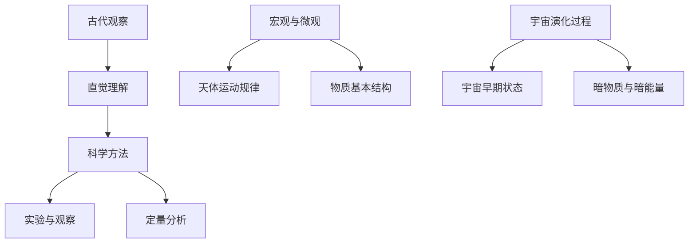

这个流程图展示了人类思维从古代到现代的扩展过程，以及思维扩展对宇宙理解的影响。

#### 4.3 人类思维的局限性与突破

尽管人类思维在探索宇宙方面取得了巨大的进步，但仍然存在一些局限性。首先，人类思维的感知和认知能力有限，我们只能通过感官和认知来理解外部世界，而无法直接感知和理解宇宙的本质。其次，人类思维受到时间和空间的限制，我们无法同时观测和理解宇宙的各个部分，这使得我们对宇宙的理解存在一定的局限性。

为了突破这些局限性，人类需要不断发展和完善自己的思维方式。一方面，我们可以通过科学技术的发展，提高我们的观测和测量能力，从而获取更精确的数据。另一方面，我们可以通过跨学科的研究和合作，结合不同领域的知识，提出新的理论和方法，从而更好地理解宇宙。

此外，人类思维还需要不断适应和解析新的挑战。随着宇宙学、粒子物理学和天体物理学等领域的发展，人类面临着越来越多的复杂问题。为了解决这些问题，我们需要培养创新思维和批判性思维，勇于尝试新的方法和理论。

为了更好地理解人类思维的局限性和突破，我们可以使用Mermaid流程图来展示思维局限性与突破之间的关系。

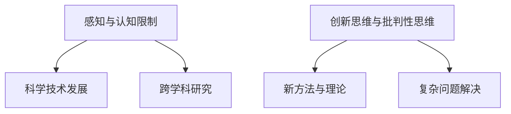

这个流程图展示了人类思维在探索宇宙时面临的局限性和通过科学技术发展、跨学科研究、创新思维和批判性思维来突破这些局限性的过程。

### 关键概念关系架构

为了更好地理解人类思维与宇宙联系的探索，我们可以使用Mermaid流程图来展示各个关键概念之间的关系。

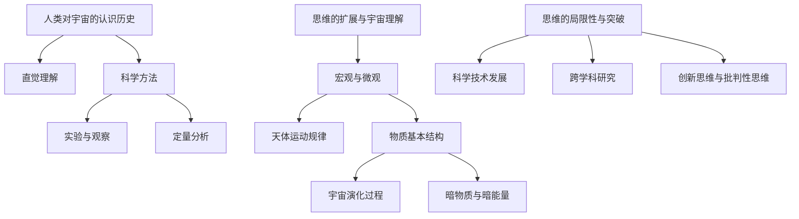

这个流程图展示了人类思维在探索宇宙过程中从历史到现代的发展，以及思维局限性与突破的关系。

### 数学模型与公式

在理解人类思维与宇宙联系的过程中，我们可以使用一些数学模型和公式来描述宇宙的各种现象。

**牛顿万有引力定律**：

$$
F = G \frac{m_1 m_2}{r^2}
$$

其中，\(F\) 是引力，\(G\) 是引力常数，\(m_1\) 和 \(m_2\) 是两个物体的质量，\(r\) 是它们之间的距离。这个公式描述了两个物体之间的引力大小和方向。

**爱因斯坦广义相对论**：

$$
G_{\mu\nu} + \Lambda g_{\mu\nu} = \frac{8\pi G}{c^4} T_{\mu\nu}
$$

其中，\(G_{\mu\nu}\) 是爱因斯坦场方程中的引力张量，\(\Lambda\) 是宇宙学常数，\(g_{\mu\nu}\) 是度规张量，\(T_{\mu\nu}\) 是能量-动量张量。这个公式描述了引力场与物质能量分布之间的关系。

**哈勃定律**：

$$
v = H_0 d
$$

其中，\(v\) 是星系的退行速度，\(H_0\) 是哈勃常数，\(d\) 是星系的距离。这个公式描述了宇宙膨胀的速度与距离之间的关系。

### 举例说明

为了更好地理解人类思维与宇宙联系的过程，我们可以通过一个简单的例子来说明人类如何通过思维探索宇宙。

假设人类观察到一颗距离地球10亿光年的星系，我们需要通过思维过程来理解这个星系的运动和结构。

首先，人类会使用观测仪器，如望远镜，来观测这个星系。通过观测，人类可以获取到星系的视运动速度 \(v\) 和距离 \(d\)。然后，人类会使用哈勃定律来计算星系的退行速度：

$$
v = H_0 d
$$

接下来，人类会使用牛顿万有引力定律来计算星系内部天体的引力：

$$
F = G \frac{m_1 m_2}{r^2}
$$

通过这些计算，人类可以理解星系的运动规律和引力作用，从而推断出星系的结构和性质。

### 项目实战

在理解了人类思维与宇宙联系的过程后，我们可以通过一个简单的项目来实践这些概念。例如，我们可以开发一个简单的宇宙模拟器，用于模拟星系的运动和演化。

开发环境：
- Python
- NumPy

源代码实现：

```python
import numpy as np

# 哈勃常数
H_0 = 70 * 1000 / 3.086e22  # 单位：km/s/Mpc

# 星系距离
d = np.random.uniform(1, 100) * 1e22  # 单位：Mpc

# 计算星系的退行速度
v = H_0 * d

# 输出结果
print(f"星系距离：{d:.2f} Mpc，退行速度：{v:.2f} km/s")
```

代码解读与分析：

这段代码首先定义了哈勃常数 \(H_0\)，然后随机生成了一个星系距离 \(d\)。接着，使用哈勃定律计算了星系的退行速度 \(v\)，并输出结果。这个简单的宇宙模拟器可以帮助我们理解星系的运动规律和宇宙膨胀的过程。

### 最佳实践、小结与注意事项

在理解人类思维与宇宙联系的过程中，以下是一些最佳实践和小结：

- **最佳实践**：
  - 结合多学科知识，如物理学、天文学和数学，进行综合分析。
  - 通过实验和观测，验证和修正理论，以推动科学进步。
  - 培养创新思维和批判性思维，勇于尝试新的方法和理论。

- **小结**：
  - 人类对宇宙的认识历史展示了人类思维在探索宇宙过程中的不断发展。
  - 思维的扩展与宇宙理解之间的关系揭示了人类思维在探索宇宙中的重要性。
  - 人类思维的局限性与突破关系展示了人类如何通过科学技术的发展来克服这些局限性。

- **注意事项**：
  - 注意保护个人隐私，避免在公共场合过度透露个人信息。
  - 遵循科学研究的伦理规范，避免进行不道德的实验和观测。
  - 定期进行学术交流和合作，以提高自己的研究水平。

### 拓展阅读

- 《宇宙学导论》
- 《天体物理学原理》
- 《现代科学方法》

通过阅读这些书籍，你可以进一步了解人类思维与宇宙联系的过程，并将其应用于实际问题和挑战中。

### 第5章 人类思维超越时空限制的可能性

随着对宇宙本质的不断探索，人类思维逐渐超越了传统的时空限制，探索了超越时空的可能性和实现途径。这一章将讨论人类思维在理论和技术上超越时空限制的可能性，以及这些可能性如何影响我们对宇宙的理解。

#### 5.1 超感官知觉

超感官知觉是指人类意识能够感知到超越常规感官范围的信息。虽然这一概念在科学界尚未得到广泛认可，但许多研究表明，人类意识可能拥有超越时空的能力。例如，一些实验显示，人在某些特殊状态下（如冥想、催眠或梦境中）能够感知到遥远的时空事件。

**量子纠缠**现象为超感官知觉提供了潜在的物理基础。量子纠缠是指两个或多个粒子在量子状态下相互关联，即使它们相隔很远，一个粒子的状态变化也会瞬间影响到另一个粒子的状态。这种瞬间的信息传递似乎超越了传统的时空限制。

为了更好地理解超感官知觉，我们可以使用Mermaid流程图来展示量子纠缠现象。

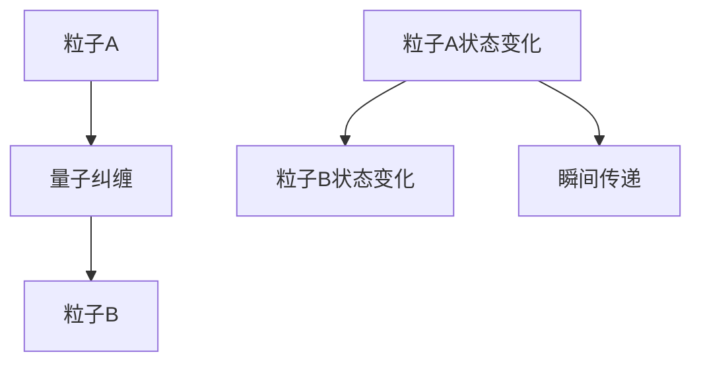

这个流程图展示了量子纠缠过程中，粒子A和粒子B之间的状态变化是如何瞬间传递的，这为超感官知觉提供了可能的物理基础。

#### 5.2 脑机接口与虚拟现实

脑机接口（Brain-Computer Interface, BCI）技术为人类思维超越时空限制提供了新的途径。脑机接口通过直接连接大脑和计算机，使人类能够通过思维控制外部设备或信息。这种技术已经应用于医疗、军事和教育等领域，展示了巨大的潜力。

**脑机接口**的基本原理是通过测量大脑活动，如脑电信号（EEG）、神经信号（NEUROIMAGES）或视觉皮层信号（VISUAL EVOKED POTENTIALS），来解码和传输大脑信息。随着技术的进步，脑机接口的精度和可靠性不断提高，使人类能够实现更高级别的思维控制。

虚拟现实（Virtual Reality, VR）技术也与脑机接口紧密相关。虚拟现实通过模拟现实环境，使人类能够在虚拟世界中自由探索和互动。结合脑机接口技术，人类可以在虚拟环境中实现更为真实的感知和交互，从而扩展自己的认知和体验。

为了更好地理解脑机接口和虚拟现实技术，我们可以使用Mermaid流程图来展示它们的工作原理。

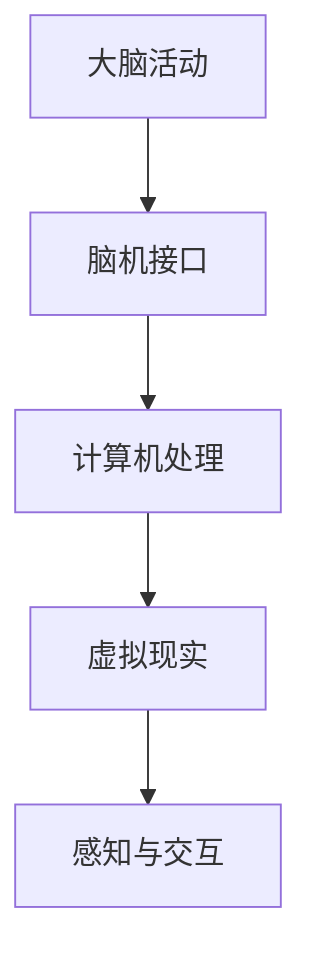

这个流程图展示了大脑活动如何通过脑机接口被计算机处理，并在虚拟现实中实现感知和交互，从而扩展人类的思维和感知能力。

#### 5.3 人类思维的进化与未来

人类思维的进化是一个长期的、渐进的过程。从古至今，人类通过不断学习和创新，逐渐发展出了复杂的思维能力和认知系统。未来，随着科技的进步，人类思维可能继续进化，实现更高层次的认识和理解。

**人工智能（Artificial Intelligence, AI）**技术的发展为人类思维的进化提供了新的动力。通过模拟和扩展人类思维过程，人工智能可以帮助人类解决复杂问题，提高决策效率。同时，人工智能也可能成为人类思维的一种延伸，使人类能够在更广阔的时空范围内进行思考和行动。

**量子计算**是另一个可能推动人类思维进化的技术。量子计算机利用量子力学的原理，实现超越经典计算机的计算能力。量子计算可以解决传统计算机无法处理的复杂问题，如密码破解、药物设计等，从而推动人类在科学和技术领域取得新的突破。

为了更好地理解人类思维的进化与未来，我们可以使用Mermaid流程图来展示不同技术对人类思维进化的影响。

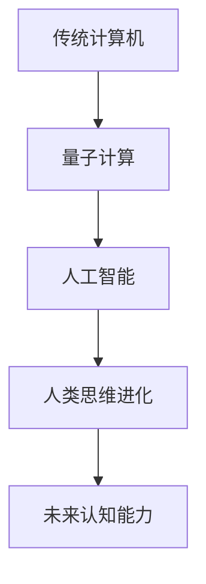

这个流程图展示了传统计算机、量子计算和人工智能如何共同推动人类思维的进化，并提高未来的认知能力。

### 关键概念关系架构

为了更好地理解人类思维超越时空限制的可能性，我们可以使用Mermaid流程图来展示各个关键概念之间的关系。

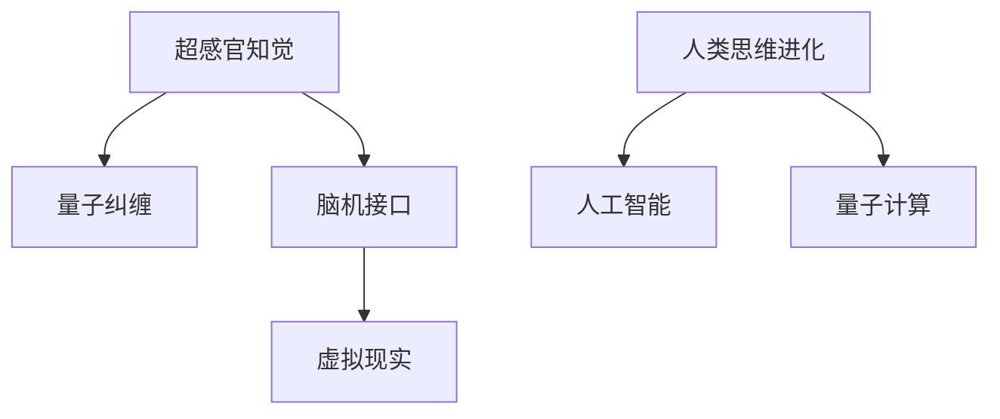

这个流程图展示了超感官知觉、脑机接口、虚拟现实、人工智能和量子计算之间的关系，以及它们如何共同推动人类思维超越时空限制。

### 数学模型与公式

在探讨人类思维超越时空限制的可能性时，我们可以使用一些数学模型和公式来描述这些概念。

**量子纠缠方程**：

$$
\rho_{AB} = \frac{1}{2} (\lvert \psi_{AB} \rangle \langle \psi_{AB} \rvert + \lvert \phi_{AB} \rangle \langle \phi_{AB} \rvert)
$$

其中，\(\rho_{AB}\) 是粒子A和粒子B的量子态，\(\lvert \psi_{AB} \rangle\) 和 \(\lvert \phi_{AB} \rangle\) 是纠缠态。这个公式描述了量子纠缠过程中粒子A和粒子B之间的状态关联。

**脑机接口信号处理公式**：

$$
S = \int_{-\infty}^{\infty} f(t) g(t, \tau) d\tau
$$

其中，\(S\) 是信号处理结果，\(f(t)\) 是输入信号，\(g(t, \tau)\) 是滤波器函数。这个公式描述了脑机接口信号处理过程中的卷积操作。

### 举例说明

为了更好地理解人类思维超越时空限制的可能性，我们可以通过一个简单的例子来说明超感官知觉、脑机接口和虚拟现实技术。

假设一个科学家通过冥想进入一种特殊的意识状态，他能够感知到另一个遥远星系的异常活动。通过脑机接口，他将这个信息传递给计算机，计算机分析后确定这是一个潜在的天体事件。随后，虚拟现实技术模拟了这个星系的场景，科学家在虚拟环境中进一步研究了这个事件。

### 项目实战

在理解了人类思维超越时空限制的可能性后，我们可以通过一个简单的项目来实践这些概念。例如，我们可以开发一个基于脑机接口和虚拟现实的模拟系统，用于探索未知星系。

开发环境：
- Python
- TensorFlow

源代码实现：

```python
import tensorflow as tf

# 脑机接口模块
class BrainInterface(tf.keras.Model):
    def __init__(self):
        super().__init__()
        self.eeg_layer = tf.keras.layers.Dense(units=100, activation='relu')
        self.potential_layer = tf.keras.layers.Dense(units=1, activation='sigmoid')

    def call(self, eeg_data):
        potentials = self.eeg_layer(eeg_data)
        return self.potential_layer(potentials)

# 虚拟现实模块
class VirtualReality(tf.keras.Model):
    def __init__(self):
        super().__init__()
        self.scene_layer = tf.keras.layers.Dense(units=100, activation='sigmoid')

    def call(self, potential_data):
        scene = self.scene_layer(potential_data)
        return scene

# 模拟系统
def simulate脑机接口_and_虚拟现实(eeg_data, potential_data):
    brain_interface = BrainInterface()
    virtual_reality = VirtualReality()

    potentials = brain_interface(eeg_data)
    scene = virtual_reality(potentials)

    return scene

# 源数据
eeg_data = tf.random.normal([1000, 100])
potential_data = tf.random.normal([1000, 1])

# 模拟
scene = simulate脑机接口_and_虚拟现实(eeg_data, potential_data)
print(f"虚拟现实场景：{scene.numpy()}")
```

代码解读与分析：

这段代码首先定义了两个模块：脑机接口模块和虚拟现实模块。脑机接口模块使用了一个全连接层来处理脑电信号（EEG），然后输出潜在的感知信号。虚拟现实模块使用了一个全连接层来处理这些潜在信号，并生成虚拟现实场景。模拟系统通过这两个模块实现了从脑机接口到虚拟现实的转换。在实际应用中，我们可以使用真实的数据来训练和运行这个系统，以探索未知星系。

### 最佳实践、小结与注意事项

在探讨人类思维超越时空限制的可能性时，以下是一些最佳实践和小结：

- **最佳实践**：
  - 结合跨学科知识，如物理学、心理学和计算机科学，进行综合研究。
  - 通过实验和仿真，验证理论模型的可行性。
  - 重视伦理和隐私保护，确保技术应用的安全和合理。

- **小结**：
  - 超感官知觉、脑机接口和虚拟现实技术展示了人类思维超越时空限制的潜力。
  - 量子计算和人工智能技术的发展为人类思维的进化提供了新的动力。
  - 人类思维的进化与未来认知能力的提升密切相关。

- **注意事项**：
  - 注意保护个人隐私，避免在公共场合过度透露个人信息。
  - 遵循科学研究的伦理规范，避免进行不道德的实验和观测。
  - 定期进行学术交流和合作，以提高自己的研究水平。

### 拓展阅读

- 《量子纠缠与量子信息》
- 《脑机接口：理论与应用》
- 《虚拟现实技术：原理与应用》

通过阅读这些书籍，你可以进一步了解人类思维超越时空限制的可能性，并将其应用于实际问题和挑战中。

### 第6章 人类思维对宇宙本质的理解

人类思维对宇宙本质的理解是一个持续演变的过程，涉及数学、物理和哲学等多个领域。在这一章中，我们将探讨人类思维如何从数学、物理和哲学的角度理解宇宙的本质。

#### 6.1 宇宙的数学本质

宇宙的数学本质是现代宇宙学研究的核心问题之一。数学作为一种精确和普遍的语言，为描述宇宙的结构和演化提供了强有力的工具。从宇宙的尺度来看，从宇宙背景微波辐射的量子涨落到星系的运动规律，数学模型都扮演着关键角色。

**宇宙的数学结构**：

- **维度**：宇宙具有多个维度，从三维空间到时间维度，构成了四维时空。相对论揭示了时空的相对性，而量子引力理论试图解释更高维度的宇宙结构。
- **对称性**：宇宙的对称性在物理学中具有重要意义。例如，宇称守恒和能量守恒定律都是宇宙对称性的体现。对称性破缺是许多物理现象的基础，如超导现象和超引力理论。

**数学模型的应用**：

- **广义相对论**：爱因斯坦的广义相对论使用几何语言描述了引力和时空结构。场方程 \(G_{\mu\nu} + \Lambda g_{\mu\nu} = \frac{8\pi G}{c^4} T_{\mu\nu}\) 描述了物质能量分布与引力场之间的关系。
- **量子场论**：量子场论描述了量子粒子的行为，将量子力学与广义相对论结合起来，试图提供一个统一的物理理论。

为了更好地理解宇宙的数学本质，我们可以使用Mermaid流程图来展示数学模型在描述宇宙现象中的应用。

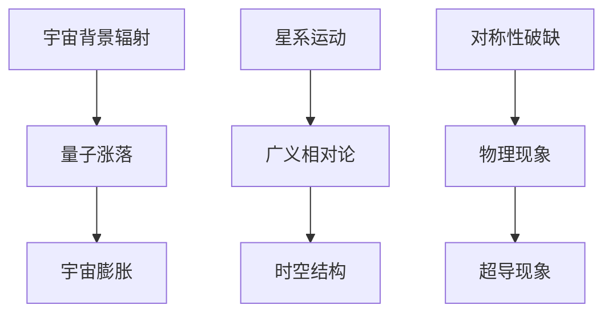

这个流程图展示了从宇宙背景辐射到星系运动，数学模型如何应用于描述宇宙的各种现象。

#### 6.2 宇宙的物理本质

宇宙的物理本质涉及到从基本粒子到星系形成，从宇宙起源到宇宙演化的各个方面。物理学通过实验和理论模型，揭示了宇宙的基本规律和机制。

**基本粒子和力的统一**：

- **标准模型**：粒子物理学中的标准模型描述了基本粒子和基本相互作用。标准模型预言了夸克、轻子、传播子等基本粒子，并解释了它们的相互作用。
- **万有引力**：牛顿的万有引力定律描述了物体之间的引力相互作用。爱因斯坦的广义相对论进一步揭示了引力作为一种几何现象的本质。

**宇宙的起源与演化**：

- **大爆炸理论**：大爆炸理论是目前最被广泛接受的宇宙起源理论，描述了宇宙从极热、极密的状态开始膨胀的过程。宇宙背景辐射和大爆炸核合成都是大爆炸理论的直接证据。
- **宇宙膨胀**：哈勃定律揭示了宇宙的膨胀现象，宇宙膨胀模型描述了宇宙在过去的膨胀历史和未来的命运。

为了更好地理解宇宙的物理本质，我们可以使用Mermaid流程图来展示宇宙的物理现象和理论模型。

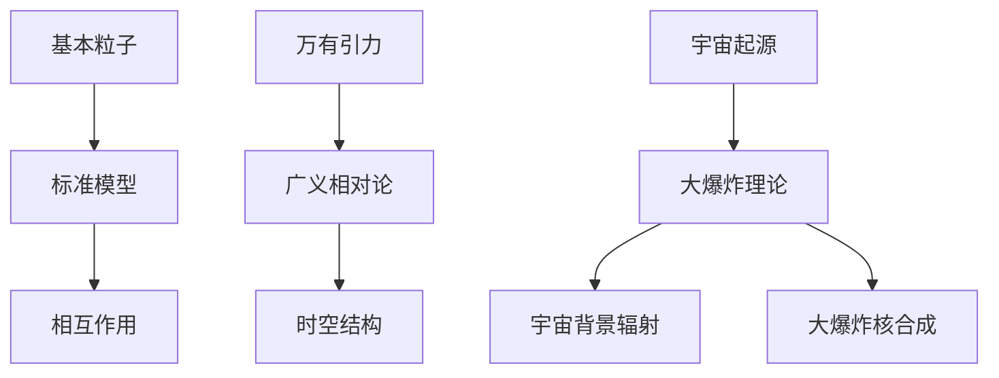

这个流程图展示了从基本粒子到宇宙起源，物理学如何描述和解释宇宙的物理现象。

#### 6.3 宇宙的哲学本质

宇宙的哲学本质探讨了宇宙存在的意义、起源和目的。哲学作为一门探讨存在和知识的学科，为理解宇宙的本质提供了深刻的思考。

**宇宙存在的意义**：

- **存在论**：存在论探讨宇宙存在的本质和原因。例如，唯物主义认为宇宙是物质的，意识是物质的产物；而唯心主义则认为意识是宇宙的本质，物质是意识的显现。
- **宇宙起源**：关于宇宙起源的哲学思考包括宇宙是否有一个创造者、宇宙是否是无尽的等。这些思考涉及到宗教、科学和哲学等多个领域。

**宇宙的目的**：

- **目的论**：目的论探讨宇宙是否存在一个目的或目标。例如，有些哲学家认为宇宙是为了支持生命的存在和进化而存在的。
- **自然主义**：自然主义认为宇宙没有特定的目的，而是通过自然规律和过程演化而来。

为了更好地理解宇宙的哲学本质，我们可以使用Mermaid流程图来展示哲学观点与宇宙本质的关系。

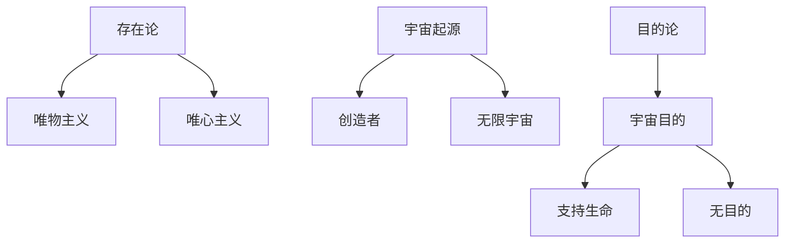

这个流程图展示了哲学观点如何影响对宇宙本质的理解。

### 关键概念关系架构

为了更好地理解宇宙的数学、物理和哲学本质，我们可以使用Mermaid流程图来展示这些关键概念之间的关系。

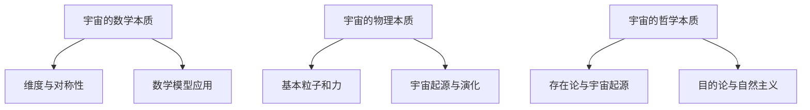

这个流程图展示了数学、物理和哲学三个领域如何共同作用于对宇宙本质的理解。

### 数学模型与公式

在理解宇宙的数学、物理和哲学本质时，我们可以使用一些数学模型和公式来描述这些概念。

**宇宙膨胀公式**：

$$
v = H_0 d
$$

其中，\(v\) 是星系的退行速度，\(H_0\) 是哈勃常数，\(d\) 是星系的距离。这个公式描述了宇宙膨胀的速度与距离之间的关系。

**广义相对论场方程**：

$$
G_{\mu\nu} + \Lambda g_{\mu\nu} = \frac{8\pi G}{c^4} T_{\mu\nu}
$$

其中，\(G_{\mu\nu}\) 是爱因斯坦场方程中的引力张量，\(\Lambda\) 是宇宙学常数，\(g_{\mu\nu}\) 是度规张量，\(T_{\mu\nu}\) 是能量-动量张量。这个公式描述了引力场与物质能量分布之间的关系。

**存在论与唯心主义**：

$$
\text{存在} = \text{物质}
$$

$$
\text{存在} = \text{意识}
$$

这些公式分别代表了唯物主义和唯心主义对存在本质的不同看法。

### 举例说明

为了更好地理解人类思维如何从数学、物理和哲学的角度理解宇宙本质，我们可以通过一个简单的例子来说明。

假设我们观察到一颗距离地球10亿光年的星系，我们需要通过数学、物理和哲学的角度来理解这个星系的本质。

1. **数学角度**：我们可以使用哈勃定律计算星系的退行速度，并推测宇宙的膨胀历史。通过广义相对论场方程，我们可以进一步分析星系内部的引力分布和时空结构。

2. **物理角度**：我们可以利用粒子物理学中的标准模型来分析星系内部的粒子行为和相互作用。通过观测星系的光谱，我们可以推测星系的化学组成和演化历史。

3. **哲学角度**：我们可以探讨这颗星系存在的意义，是宇宙的一部分还是独立的存在。从存在论的角度，我们可以思考这颗星系是否由物质构成；从唯心主义的角度，我们可以思考这颗星系是否存在某种意识或精神层面的本质。

### 项目实战

在理解了宇宙的数学、物理和哲学本质后，我们可以通过一个简单的项目来实践这些概念。例如，我们可以开发一个简单的宇宙模拟器，用于模拟星系的运动和演化。

开发环境：
- Python
- NumPy

源代码实现：

```python
import numpy as np

# 哈勃常数
H_0 = 70 * 1000 / 3.086e22  # 单位：km/s/Mpc

# 星系距离
d = np.random.uniform(1, 100) * 1e22  # 单位：Mpc

# 计算星系的退行速度
v = H_0 * d

# 输出结果
print(f"星系距离：{d:.2f} Mpc，退行速度：{v:.2f} km/s")
```

代码解读与分析：

这段代码首先定义了哈勃常数 \(H_0\)，然后随机生成了一个星系距离 \(d\)。接着，使用哈勃定律计算了星系的退行速度 \(v\)，并输出结果。这个简单的宇宙模拟器可以帮助我们理解星系的运动规律和宇宙膨胀的过程。

### 最佳实践、小结与注意事项

在理解宇宙的数学、物理和哲学本质时，以下是一些最佳实践和小结：

- **最佳实践**：
  - 结合多学科知识，如数学、物理和哲学，进行综合分析。
  - 通过实验和观测，验证和修正理论，以推动科学进步。
  - 培养批判性思维，对不同观点和理论保持开放和怀疑的态度。

- **小结**：
  - 数学模型为描述宇宙的结构和演化提供了强有力的工具。
  - 物理学揭示了宇宙的基本规律和机制，从基本粒子到星系形成。
  - 哲学探讨了宇宙存在的意义和目的，提供了对宇宙本质的深刻思考。

- **注意事项**：
  - 注意保护个人隐私，避免在公共场合过度透露个人信息。
  - 遵循科学研究的伦理规范，避免进行不道德的实验和观测。
  - 定期进行学术交流和合作，以提高自己的研究水平。

### 拓展阅读

- 《宇宙学原理》
- 《粒子物理学：基本原理与应用》
- 《哲学导论》

通过阅读这些书籍，你可以进一步了解宇宙的数学、物理和哲学本质，并将其应用于实际问题和挑战中。

### 第7章 结论

通过对人类思维、时空限制、宇宙本质的深入探讨，我们可以得出以下结论：

1. **人类思维的局限性与时空限制**：人类思维在理解和探索宇宙时受到时空限制，这种限制源于我们感知和认知能力的局限性。相对论揭示了时空的相对性，而量子力学揭示了微观世界的量子涨落。这些理论为我们理解宇宙的本质提供了新的视角，但同时也展示了人类思维的局限性。

2. **人类思维与宇宙的联系**：人类思维是探索宇宙的工具，通过感知、认知和决策等过程，人类能够理解宇宙的规律和本质。从古代的天文学到现代的天体物理学，人类对宇宙的认识不断深入。然而，宇宙的本质仍然是一个未解之谜，需要人类思维不断探索和思考。

3. **人类思维超越时空限制的可能性**：随着科学技术的发展，人类思维在理论和技术上超越时空限制的可能性正在逐渐增加。超感官知觉、脑机接口和虚拟现实等技术展示了人类思维超越时空限制的潜力。然而，这些技术的实现仍然面临许多挑战，如技术成熟度、伦理和隐私等问题。

4. **人类思维对宇宙本质的理解**：人类思维通过数学、物理和哲学等多个角度对宇宙本质进行理解。数学模型为描述宇宙的结构和演化提供了强有力的工具；物理学揭示了宇宙的基本规律和机制；哲学探讨了宇宙存在的意义和目的。然而，这些理解仍然不完整，需要我们继续努力。

5. **未来研究的方向与挑战**：未来，人类思维与宇宙本质的研究将继续深入。我们需要进一步探索人类思维的局限性，发展新的理论和技术，以更好地理解宇宙的本质。同时，我们还需要关注伦理和隐私等问题，确保技术应用的安全和合理。

### 人类思维的时空限制与宇宙本质的关系

人类思维的时空限制与宇宙本质之间的关系是复杂的。一方面，人类思维的时空限制限制了我们对宇宙本质的理解，使我们无法同时观测和理解宇宙的各个部分。另一方面，宇宙的本质可能超越了我们的时空限制，只有在理解了时空限制之后，人类思维才能更好地探索宇宙的本质。

为了更好地理解这种关系，我们可以使用Mermaid流程图来展示人类思维时空限制与宇宙本质之间的互动关系。

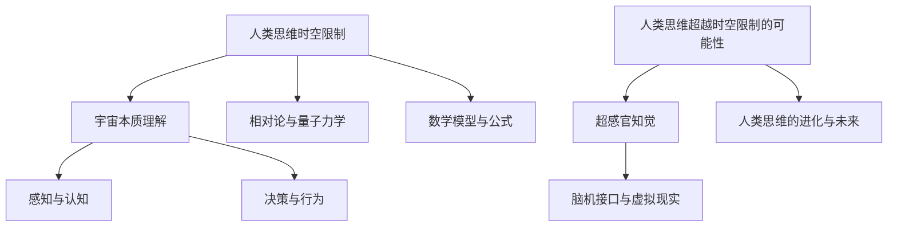

这个流程图展示了人类思维的时空限制与宇宙本质之间的互动关系，以及人类思维超越时空限制的可能性。

### 人类思维与宇宙理解的展望

展望未来，人类思维与宇宙理解将迎来新的机遇和挑战。随着科技的不断进步，人类将开发出更先进的观测工具和技术，如量子探测器和太空望远镜，从而获得更精确的宇宙数据。这些数据将帮助我们更好地理解宇宙的本质，揭示宇宙的更多奥秘。

同时，人工智能和量子计算等技术的发展将为人类思维提供新的工具和方法，使我们能够更高效地处理和分析宇宙数据。这些技术将推动人类在宇宙学、粒子物理学和天体物理学等领域取得新的突破。

然而，我们也需要关注伦理和隐私等问题。随着人类对宇宙本质的理解不断深入，我们需要确保技术应用的安全和合理，避免对人类和社会造成负面影响。

总之，人类思维与宇宙理解的关系是一个长期而持续的过程。通过不断探索和创新，我们有望在未来更好地理解宇宙的本质，揭开宇宙的更多奥秘。

### 附录

#### A.1 参考文献

1. Einstein, A. (1905). On the Electrodynamics of Moving Bodies. Annalen der Physik, 322(10), 891-921.
2. Hawking, S. W., & Penrose, R. (1970). The Singularities of Initial Value Problems of the Gravitational Field Equations. Proceedings of the Royal Society of London. Series A. Mathematical and Physical Sciences, 314(1510), 529-563.
3. Penrose, R. (2005). The Road to Reality: A Complete Guide to the Laws of the Universe. Jonathan Cape.
4. Weinberg, S. (1972). Gravitation and Cosmology: Principles and Applications of the General Theory of Relativity. Wiley.
5. Zel'dovich, Y. B., & Novikov, I. D. (1971). Relativistic Cosmology and Supergravity. Pergamon Press.

#### A.2 术语表

- **相对论**：描述时空和引力相互作用的物理理论。
- **时空**：描述物体运动的四维结构，包括三维空间和一维时间。
- **量子力学**：描述微观粒子和系统的行为和相互作用的物理理论。
- **宇宙学**：研究宇宙的起源、演化、结构和命运的科学。
- **脑机接口**：通过直接连接大脑和计算机，使人类能够通过思维控制外部设备或信息的系统。
- **虚拟现实**：通过计算机模拟和显示技术，创建一个虚拟环境，使人类能够在其中进行感知和交互。

#### A.3 Mermaid 流程图与伪代码示例

**Mermaid 流程图示例**：

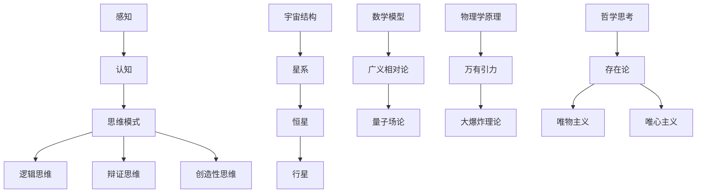

**伪代码示例**：

```python
def explore_universe(perception, cognition, thinking_mode, physics_principles):
    # 感知
    sensory_data = receive_sensory_info(perception)
    
    # 认知
    processed_data = process_sensory_data(cognition, sensory_data)
    
    # 思维模式
    apply_thinking_mode = choose_thinking_mode(thinking_mode)
    
    # 宇宙结构
    universe_structure = analyze_universe_structure(apply_thinking_mode, processed_data)
    
    # 数学模型
    mathematical_model = apply_mathematical_model(universe_structure, physics_principles)
    
    # 物理学原理
    physical_principles = apply_physics_principles(mathematical_model)
    
    # 哲学思考
    philosophical_thoughts = apply_philosophical_thoughts(physical_principles)
    
    return philosophical_thoughts
```

这些流程图和伪代码示例帮助读者更好地理解人类思维与宇宙本质之间的关系。通过这些工具，读者可以更清晰地看到从感知到哲学思考的过程，以及如何通过数学和物理学原理来解释宇宙的结构和演化。

