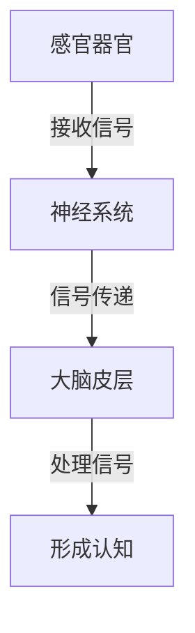
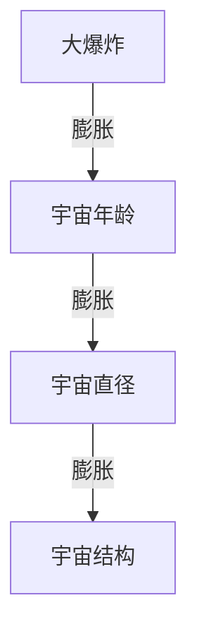
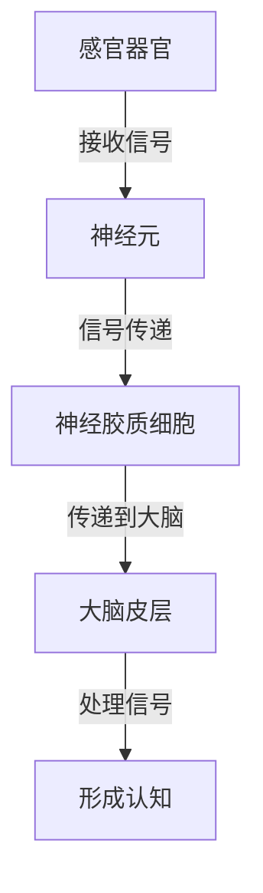
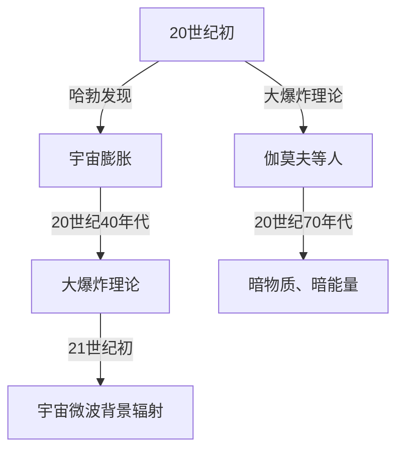
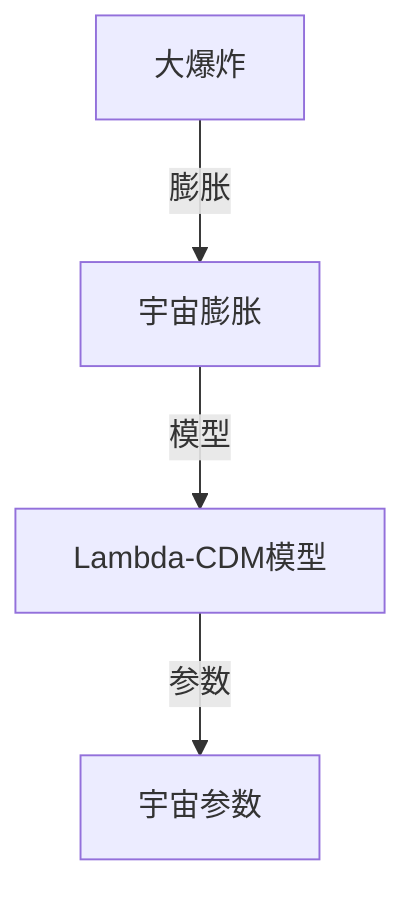
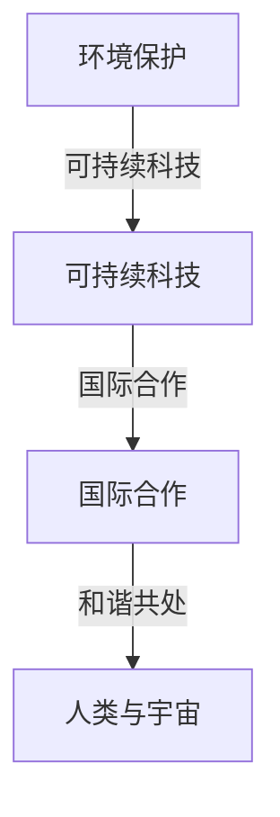

                 

### 第1章 引言：感知能力与宇宙本质

#### 1.1 人类感知能力概览

人类的感知能力是理解世界的基础。从生下来开始，我们就通过视觉、听觉、触觉、嗅觉和味觉这五种主要感官来获取外界信息。这些感官不仅仅是简单的接收信号，还涉及到复杂的信号处理和解释过程，最终形成我们对外界的认知。例如，视觉系统不仅帮助我们识别物体，还涉及空间感知、深度感知以及动态追踪等多个方面。听觉系统则帮助我们理解语言、识别声音来源，并感知环境变化。

在技术层面上，人类的感知能力与生物神经系统紧密相关。大脑通过神经元网络来处理来自感官的信息，并通过复杂的神经网络模型来实现对信息的分类、识别和整合。例如，视觉感知过程中，视网膜接收的光信号通过视神经传递到大脑皮层，大脑通过视觉皮层的处理，将光信号转换为有意义的视觉图像。


**核心概念与联系**

- **感官器官**：视觉、听觉、触觉、嗅觉和味觉
- **神经系统**：神经元的传递与信息处理
- **大脑皮层**：处理和解释感官信号的主要区域

为了更直观地展示感知系统的架构，我们可以使用Mermaid流程图来描绘神经信号传递的基本流程：



这个简单的流程图展示了从感官器官到大脑皮层，最终形成认知的基本路径。

#### 1.2 宇宙本质的基本概念

宇宙是所有存在事物的整体，包括地球、星系、星云以及其他一切物质和能量。宇宙学是研究宇宙起源、结构、演化和最终命运的科学。宇宙学的基本概念包括宇宙的膨胀、暗物质和暗能量等。

宇宙的起源可以追溯到大约138亿年前的大爆炸，这一理论认为宇宙从一个极度热密的状态开始迅速膨胀，并逐渐冷却形成今天所看到的星系、恒星和其他宇宙结构。

宇宙的基本参数如宇宙年龄、宇宙直径和宇宙密度等，是宇宙学研究的重要内容。此外，宇宙学模型如标准模型（Lambda-CDM模型）提供了对宇宙演化的详细描述，这些模型帮助我们理解宇宙的结构和动力学。


**宇宙学的基本原理**

- **大爆炸理论**：宇宙起源于一次大爆炸。
- **宇宙膨胀**：宇宙自大爆炸以来一直在膨胀。
- **宇宙学参数**：包括宇宙年龄、宇宙直径和宇宙密度等。

为了更直观地展示宇宙学的基本原理，我们可以使用Mermaid流程图来描绘宇宙膨胀的过程：



这个简单的流程图展示了从大爆炸到宇宙结构形成的基本路径。

通过上述对人类感知能力和宇宙本质的介绍，我们可以看出二者之间存在着深刻的联系。人类通过感知能力来理解宇宙，而宇宙的本质则为我们提供了对感知能力极限的挑战。接下来的章节将进一步探讨这两个领域的深层次联系。

---

**总结**

在这一章中，我们首先介绍了人类感知能力的概览，包括视觉、听觉、触觉、嗅觉和味觉等感官器官及其在大脑中的信号处理过程。接着，我们讨论了宇宙本质的基本概念，包括大爆炸理论、宇宙膨胀和宇宙学参数等。通过Mermaid流程图，我们直观地展示了感知系统和宇宙学的基本原理。这些内容为理解人类感知能力与宇宙本质之间的联系奠定了基础。在接下来的章节中，我们将进一步探讨这些联系的深层次意义。

---

### 第2章 人类感知能力的神经基础

#### 2.1 神经系统概述

神经系统是人体内负责接收、处理和传递信息的系统，由神经元和神经胶质细胞组成。神经元是神经系统的基本单元，它们通过突触与其他神经元相连，形成一个复杂的网络。神经系统可以分为中枢神经系统和周围神经系统。中枢神经系统包括大脑和脊髓，而周围神经系统包括脑神经和脊神经。


**神经系统的主要功能**

- **信息传递**：神经元通过电信号（动作电位）传递信息。
- **数据处理**：大脑对信息进行加工、分析和整合。
- **控制行为**：神经系统控制人体的运动、感觉、认知和情绪等。

在人类感知过程中，神经系统起到了关键作用。例如，当眼睛接收到光信号时，视网膜中的感光细胞会将光信号转化为电信号，并通过视神经传递到大脑皮层的视觉皮层，最终形成视觉感知。同样的，其他感官系统也通过类似的机制将外界信号转化为大脑可以理解的形式。

#### 2.2 感知与大脑结构

大脑是感知能力的主要处理中心，其内部结构复杂，不同区域负责不同的感知功能。以下是几个与感知相关的重要大脑区域：

1. **视觉皮层**：视觉皮层是大脑处理视觉信息的主要区域，包括初级视觉皮层（V1）、二级视觉皮层（V2）等。视觉皮层负责处理视网膜传来的光信号，进行图像识别、空间感知和运动追踪等。

2. **听觉皮层**：听觉皮层处理来自耳朵的听觉信息，包括初级听觉皮层（AI）、二级听觉皮层（AII）等。听觉皮层负责声音识别、音调和音色的分析。

3. **躯体感觉皮层**：躯体感觉皮层处理触觉、痛觉和温度觉等感觉信息，包括初级躯体感觉皮层（S1）等。

4. **运动皮层**：运动皮层负责计划和执行运动，包括初级运动皮层（M1）等。


**神经网络与感知**

神经网络是模仿生物神经系统的一种计算模型，用于信息处理和识别。在感知过程中，神经网络通过训练学习输入信号与感知结果之间的关系，从而实现对感知信息的处理。

以下是感知过程中神经网络的基本步骤：

1. **输入层**：接收外部感官输入，如图像或声音。
2. **隐藏层**：对输入进行特征提取和变换。
3. **输出层**：产生感知结果，如图像分类或声音识别。

感知过程的伪代码如下：

```python
# 感知过程伪代码

# 输入层初始化
input_layer = receive_sensory_input()

# 隐藏层处理
hidden_layer = neural_network.process(input_layer)

# 输出层处理
output_layer = hidden_layer_classify(hidden_layer)

# 输出感知结果
perception_result = output_layer
```

通过这种神经网络模型，我们可以模拟人类感知过程，从而更好地理解感知能力的神经基础。

**总结**

在本章中，我们介绍了神经系统的基本结构和功能，重点讨论了与感知相关的重要大脑区域。同时，我们还介绍了神经网络在感知过程中的应用，通过伪代码展示了感知的基本步骤。这些内容为理解人类感知能力的神经基础奠定了基础，也为进一步探讨感知与宇宙本质之间的联系提供了理论基础。

---

**核心概念与联系**

- **神经系统**：神经元和神经胶质细胞的组成及其功能。
- **大脑结构**：视觉皮层、听觉皮层、躯体感觉皮层和运动皮层等区域的作用。
- **神经网络**：感知过程中的基本步骤和作用。

通过使用Mermaid流程图，我们可以更直观地理解神经系统与感知之间的联系：



这个流程图展示了从感官器官到大脑皮层，最终形成认知的基本路径。通过这些内容，我们为理解人类感知能力与宇宙本质之间的联系奠定了坚实的基础。在下一章中，我们将探讨宇宙学的基本原理与观测方法。

---

### 第3章 宇宙学的基石：基本原理与观测

#### 3.1 宇宙学的起源与发展

宇宙学是一门研究宇宙起源、结构、演化和最终命运的学科。其历史可以追溯到古代，当时人类开始通过观测天体来解释自然现象。然而，现代宇宙学的兴起可以追溯到20世纪初，当时科学家们开始提出大爆炸理论和宇宙膨胀理论。

**大爆炸理论**

大爆炸理论认为，宇宙起源于大约138亿年前的一个极度热密的状态。在这个时刻，所有的物质和能量都集中在一个无限小的奇点中。随后，这个奇点迅速膨胀，导致宇宙开始迅速冷却并形成今天的结构和天体。

**宇宙膨胀**

宇宙膨胀理论是由埃德温·哈勃在20世纪20年代提出的。哈勃发现，远离我们的星系都在以越来越快的速度远离我们，这表明宇宙正在膨胀。这一发现为宇宙大爆炸理论提供了强有力的证据。


**宇宙学发展的历史**

- **20世纪初**：爱德文·哈勃发现宇宙膨胀。
- **20世纪40年代**：乔治·伽莫夫等人提出大爆炸理论。
- **20世纪70年代**：暗物质和暗能量概念被提出。
- **21世纪初**：宇宙微波背景辐射的观测提供了对宇宙早期状态的直接观测。

**宇宙学模型**

宇宙学模型是对宇宙演化的数学描述。目前最流行的模型是Lambda-CDM模型，也称为标准模型。这个模型假设宇宙是平坦的，由普通物质、暗物质和暗能量组成。

**宇宙参数**

宇宙学参数是描述宇宙状态的物理量，包括宇宙年龄、宇宙直径、宇宙密度等。这些参数对于理解宇宙的演化具有重要意义。

- **宇宙年龄**：大约138亿年。
- **宇宙直径**：约为930亿光年。
- **宇宙密度**：约为临界密度。


为了更直观地展示宇宙学的发展过程，我们可以使用Mermaid流程图：



这个流程图展示了宇宙学从起源到发展的关键事件和里程碑。

**总结**

在本章中，我们介绍了宇宙学的基本原理，包括大爆炸理论和宇宙膨胀理论，以及宇宙学模型和宇宙参数。通过这些内容，我们可以初步理解宇宙的起源和演化。在下一章中，我们将探讨人类感知与宇宙现象之间的联系。

---

**核心概念与联系**

- **大爆炸理论**：宇宙起源于一个极度热密的状态，随后迅速膨胀。
- **宇宙膨胀**：远离我们的星系都在以越来越快的速度远离我们。
- **宇宙学模型**：Lambda-CDM模型，描述宇宙的组成和演化。
- **宇宙参数**：宇宙年龄、宇宙直径和宇宙密度等描述宇宙状态的物理量。

通过使用Mermaid流程图，我们可以更直观地展示宇宙学的发展过程和关键原理：



这个简单的流程图展示了从大爆炸到宇宙参数的演变路径。这些内容为理解人类感知与宇宙本质之间的联系提供了理论基础。在下一章中，我们将进一步探讨人类感知与宇宙现象的具体联系。

---

### 第4章 人类感知与宇宙现象

#### 4.1 光的感知与宇宙的光谱

光是我们感知宇宙最重要的媒介之一。通过视觉感知，人类能够获取宇宙中大量的信息。光的不同特性，如波长和频率，决定了它的颜色和能量。在宇宙中，光以各种形式存在，从可见光到不可见光，如红外线、紫外线和伽马射线。

**光的感知**

人类的眼睛通过视网膜上的感光细胞来感知光。视网膜上的视锥细胞负责感知不同波长的光，从而产生彩色视觉。视杆细胞则主要在低光照条件下工作，感知光的明暗变化。


**光谱分析**

光谱是光波长分布的图表，它揭示了物质的组成和性质。通过光谱分析，科学家们能够了解宇宙中的元素、星系和星体的特性。例如，当光通过一个星际云时，其光谱中会出现吸收线，这些吸收线对应于星际云中元素的特定波长。

**伪代码：光谱感知过程**

```python
# 光谱感知过程伪代码

# 接收光信号
light_signal = receive_light()

# 分析光谱
spectrum = analyze_spectrum(light_signal)

# 识别元素
elements = identify_elements(spectrum)
```

**光的感知与宇宙现象**

光的感知不仅帮助我们理解地球上的环境，还使我们能够探索遥远的宇宙。通过望远镜和其他观测设备，我们可以观测到来自遥远星系和星体的光，这些观测为我们提供了对宇宙演化的深刻认识。

- **恒星光谱**：恒星的光谱揭示了恒星的质量、温度和化学成分。
- **星系碰撞**：通过观测星系碰撞产生的光谱，我们可以研究星系演化的过程。
- **宇宙微波背景辐射**：这是宇宙早期状态的残余辐射，为我们提供了对宇宙起源的洞察。


#### 4.2 引力波与宇宙的振动

引力波是由质量加速运动产生的时空涟漪，它以光速传播。爱因斯坦的广义相对论预测了引力波的存在，并在2015年首次被直接探测到。

**引力波的基本概念**

引力波的产生源于质量的加速运动，如黑洞合并、星系碰撞和超新星爆发等。这些事件产生的引力波会扰动周围的时空，从而在敏感的探测器上产生可测量的信号。

**引力波探测**

目前，最著名的引力波探测设施是激光干涉引力波观测站（LIGO）。LIGO通过测量激光在两个相互垂直的方向上的干涉变化来探测引力波。当引力波经过LIGO时，会使得两个臂的长度发生微小的变化，从而导致干涉条纹的变化。


**伪代码：引力波探测流程**

```python
# 引力波探测伪代码

# 接收引力波信号
gravitational_wave = receive_gravitational_wave()

# 分析信号
wave_analyzer = analyze_wave(gravitational_wave)

# 确认信号
is_gravitational_wave = wave_analyzer.confirm_signal()

# 识别事件
event = wave_analyzer.identify_event()
```

**引力波与宇宙的振动**

引力波为我们提供了新的观测宇宙的方式。通过探测引力波，我们可以直接观测到宇宙中的极端事件，如黑洞合并和星系碰撞。这些观测为我们提供了对宇宙物理的更深入理解。

- **黑洞合并**：2015年，LIGO首次探测到的引力波来自两个黑洞的合并，这一发现证明了广义相对论的正确性。
- **星系碰撞**：引力波可以揭示星系碰撞的过程，帮助我们理解星系演化的机制。


**总结**

在本章中，我们探讨了光的感知与宇宙光谱分析，以及引力波与宇宙振动的基本概念。通过光谱分析和引力波探测，人类能够获取宇宙中的大量信息，从而更深入地理解宇宙的本质。这些内容为我们理解人类感知与宇宙现象之间的联系提供了重要基础。在下一章中，我们将进一步探讨人类感知与宇宙深度联系的理论和模型。

---

**核心概念与联系**

- **光的感知**：人类通过视网膜感知光，通过光谱分析了解宇宙物质。
- **引力波**：质量加速运动产生的时空涟漪，通过引力波探测了解宇宙事件。
- **宇宙现象**：恒星光谱、星系碰撞、黑洞合并等。

**伪代码和流程图**

- **光谱感知过程**：
  ```python
  light_signal = receive_light()
  spectrum = analyze_spectrum(light_signal)
  elements = identify_elements(spectrum)
  ```

- **引力波探测流程**：
  ```python
  gravitational_wave = receive_gravitational_wave()
  wave_analyzer = analyze_wave(gravitational_wave)
  is_gravitational_wave = wave_analyzer.confirm_signal()
  event = wave_analyzer.identify_event()
  ```

通过这些内容，我们能够更全面地理解人类感知与宇宙现象之间的关系。在下一章中，我们将进一步探讨人类感知与宇宙深度联系的模型和理论。

---

### 第5章 人类感知与宇宙的深度联系

#### 5.1 宇宙结构与人类感知模型

宇宙的结构和演化是人类感知能力能够理解宇宙的关键。宇宙的结构可以从宏观尺度上的星系团、星系，到微观尺度上的原子和基本粒子。人类感知能力通过感官系统接收和处理这些不同尺度的信息，形成对宇宙的全面理解。

**宇宙结构**

宇宙的结构是一个多层次的结构，从银河系、星系团到超星系团。每个层次都有其独特的物理特性和演化过程。

- **银河系**：我们所在的银河系是一个螺旋形的星系，包含数百亿颗恒星、星云和行星等。
- **星系团**：星系团是由数十到数千个星系通过引力相互吸引形成的结构。
- **超星系团**：超星系团是由多个星系团通过引力相互作用形成的更大规模的结构。


**人类感知模型**

人类感知模型是基于生物学和神经科学原理建立的，用于模拟和理解人类的感知过程。人类感知模型通常包括以下几个层次：

- **感官器官**：视觉、听觉、触觉、嗅觉和味觉等。
- **神经系统**：负责接收、传递和处理感官信息。
- **大脑皮层**：对感官信息进行加工和解释。


**感知模型与宇宙结构的联系**

感知模型与宇宙结构之间的联系在于，人类通过感知模型来理解和解释宇宙中的各种现象。例如，通过望远镜观测，我们能够看到遥远的星系和恒星，通过光谱分析，我们能够了解这些天体的物理特性。同样，通过探测引力波，我们能够直接观测到宇宙中的极端事件，如黑洞合并。

**伪代码：感知模型交互**

```python
# 感知模型交互伪代码

# 接收宇宙信号
cosmic_signal = receive_cosmic_signal()

# 分析信号
analyzed_signal = analyze_signal(cosmic_signal)

# 解释信号
interpreted_signal = interpret_signal(analyzed_signal)

# 形成认知
cosmic_perception = form_perception(interpreted_signal)
```

通过这个简单的伪代码，我们可以看到人类感知模型与宇宙信号之间的交互过程。感知模型通过接收、分析和解释宇宙信号，形成对宇宙的认知。

#### 5.2 宇宙信息与人类感知极限

人类的感知能力虽然强大，但在处理和理解宇宙信息时仍存在极限。这些极限受限于人类感官器官的物理特性和大脑处理能力的限制。

**感官器官的极限**

- **视觉**：人类的眼睛能够感知的波长范围大约在400到700纳米之间，这限制了我们对宇宙中所有光的感知。
- **听觉**：人类的耳朵能够感知的声音频率范围大约在20到20,000赫兹之间，超出这个范围的声音我们无法听到。
- **触觉**：人类的皮肤能够感知的温度范围大约在-50°C到150°C之间，低于或高于这个温度的变化我们难以察觉。


**大脑处理能力的极限**

大脑处理信息的能力也有限制。虽然人类的大脑能够处理大量的信息，但在某些复杂情况下，如同时处理多个感官输入或处理高维数据时，大脑的能力会受到影响。

**数学模型：感知极限分析**

为了更精确地分析人类感知能力的极限，我们可以使用数学模型。例如，可以通过信号处理理论来分析感官器官的感知能力极限。

```latex
\text{感知能力极限} = f(\text{感官器官特性}, \text{大脑处理能力})
```

在这个公式中，`f` 是感知能力函数，它取决于感官器官的特性和大脑的处理能力。

**总结**

在本章中，我们探讨了宇宙结构与人类感知模型之间的联系，并分析了人类感知宇宙信息的极限。通过感知模型，我们能够理解宇宙的结构和演化，但同时也面临着感官器官和大脑处理能力的限制。这些内容为理解人类感知与宇宙本质之间的联系提供了更深入的理论基础。在下一章中，我们将探讨人类感知的极限与宇宙的奥秘。

---

**核心概念与联系**

- **宇宙结构**：星系、星系团和超星系团等宇宙层次。
- **人类感知模型**：感官器官、神经系统和大脑皮层的互动。
- **感知极限**：感官器官的物理特性和大脑处理能力的限制。

**伪代码和数学模型**

- **感知模型交互**：
  ```python
  cosmic_signal = receive_cosmic_signal()
  analyzed_signal = analyze_signal(cosmic_signal)
  interpreted_signal = interpret_signal(analyzed_signal)
  cosmic_perception = form_perception(interpreted_signal)
  ```

- **感知能力极限分析**：
  ```latex
  \text{感知能力极限} = f(\text{感官器官特性}, \text{大脑处理能力})
  ```

通过这些内容，我们能够更全面地理解人类感知与宇宙深度联系的理论基础。在下一章中，我们将进一步探讨人类感知能力的极限与宇宙的奥秘。

---

### 第6章 人类感知的极限与宇宙的奥秘

#### 6.1 量子力学与感知

量子力学是描述微观世界物理现象的学科，它揭示了物质和能量的奇异行为。量子力学的核心概念包括量子态、波粒二象性、不确定性原理和量子纠缠等。这些概念与人类感知能力有深刻的联系。

**量子态**

量子态描述了一个量子系统可能存在的状态，这些状态通常是叠加的。例如，一个电子可以同时存在于多个轨道上，直到被观测时才“坍缩”到特定的轨道。


**波粒二象性**

量子力学表明，粒子（如电子）既表现出波动性，又表现出粒子性。这种波粒二象性在我们的日常生活中难以察觉，但在微观尺度上，它对人类的感知能力产生了深远的影响。

**不确定性原理**

海森堡不确定性原理指出，某些对易物理量（如位置和动量）不能同时被精确测量。这意味着我们无法同时精确知道一个粒子的位置和速度。


**量子纠缠**

量子纠缠是量子力学中的一种现象，其中两个或多个量子系统之间存在一种特殊的关联，即使它们相隔很远，一个系统的变化也会即时影响到另一个系统。


**量子力学与感知**

量子力学揭示了人类感知的极限。例如，量子纠缠现象表明，感知过程中可能存在我们无法直接观测到的深层联系。不确定性原理则意味着我们对物理现象的观测存在固有的限制。

**伪代码：量子力学与感知**

```python
# 量子力学与感知伪代码

# 初始化量子态
quantum_state = initialize_quantum_state()

# 进行量子测量
measurement = perform_quantum_measurement(quantum_state)

# 更新感知模型
perception_model = update_perception_model(measurement)
```

通过这个简单的伪代码，我们可以看到量子力学如何影响感知模型的更新和改进。

#### 6.2 宇宙的无限与有限

宇宙的无限性与有限性一直是哲学和科学争论的主题。从宇宙学的角度来看，宇宙的无限性主要体现在空间和时间上的无限扩展。

**宇宙的无限性**

宇宙是无限大的，这一观点得到了大爆炸理论和宇宙膨胀理论的支撑。根据这些理论，宇宙从大爆炸开始一直处于膨胀状态，且这种膨胀没有终点。


**宇宙的有限性**

然而，宇宙的有限性也不能被忽视。例如，根据量子力学，宇宙的某些物理量可能存在最小单位，如普朗克长度和普朗克时间。这些最小单位的存在暗示了宇宙的某些方面可能是有限的。


**数学模型：宇宙无限性与有限性分析**

为了探讨宇宙的无限性与有限性，我们可以使用数学模型。例如，通过分析宇宙的膨胀速度和结构，我们可以估算宇宙的年龄和尺度。

```latex
\text{宇宙无限性} = \lim_{t \to \infty} \text{宇宙直径}(t)
\text{宇宙有限性} = \text{最小物理量}(t)
```

在这个公式中，`宇宙直径(t)` 表示宇宙在时间 `t` 的直径，`最小物理量(t)` 表示在时间 `t` 存在的最小物理量。

**总结**

在本章中，我们探讨了量子力学与人类感知能力之间的联系，并分析了宇宙的无限性与有限性。量子力学揭示了感知能力的极限，而宇宙的无限性与有限性则为人类理解宇宙提供了新的视角。这些内容为理解人类感知能力与宇宙本质之间的鸿沟提供了深刻的见解。在下一章中，我们将展望人类感知与宇宙探索的未来。

---

**核心概念与联系**

- **量子力学**：量子态、波粒二象性、不确定性原理和量子纠缠等概念。
- **宇宙无限性**：宇宙膨胀理论和空间无限扩展。
- **宇宙有限性**：普朗克长度和时间等最小物理量的存在。

**伪代码和数学模型**

- **量子力学与感知**：
  ```python
  quantum_state = initialize_quantum_state()
  measurement = perform_quantum_measurement(quantum_state)
  perception_model = update_perception_model(measurement)
  ```

- **宇宙无限性与有限性分析**：
  ```latex
  \text{宇宙无限性} = \lim_{t \to \infty} \text{宇宙直径}(t)
  \text{宇宙有限性} = \text{最小物理量}(t)
  ```

通过这些内容，我们能够更深入地理解人类感知能力与宇宙本质之间的联系。在下一章中，我们将探讨人类感知与宇宙探索的未来。

---

### 第7章 人类感知与宇宙探索的未来

#### 7.1 未来的科技与感知能力

随着科技的进步，人类的感知能力正不断得到提升。未来的科技将为我们提供更先进的方式去感知和理解宇宙。以下是一些可能影响人类感知能力的未来科技趋势：

**人工智能与机器学习**

人工智能（AI）和机器学习（ML）技术的快速发展将极大地增强人类的感知能力。通过AI和ML，计算机可以自主学习并处理复杂的感知任务，如图像识别、语音识别和自然语言处理。这些技术将使我们能够更有效地分析和解释来自宇宙的复杂信息。

**增强现实与虚拟现实**

增强现实（AR）和虚拟现实（VR）技术将使我们能够以更直观的方式感知宇宙。通过AR和VR，我们可以创建逼真的宇宙模拟环境，使人们能够身临其境地探索遥远的星系和星体。这些技术不仅将提高我们的感知能力，还将改变我们对宇宙的认知方式。

**量子计算**

量子计算技术的突破将显著提高数据处理和计算能力。量子计算机可以处理高维数据和复杂的量子物理问题，这将使我们对宇宙的感知更加精确和深入。例如，量子计算机可以用于模拟量子引力效应，从而揭示宇宙的更深层次奥秘。

**空间探索**

随着航天技术的进步，人类的空间探索能力将得到显著提升。未来的太空任务将使我们能够更近距离地观察宇宙，并收集更多的宇宙数据。这些任务包括载人登陆火星、建造太空站和探索更遥远的星系。通过这些探索，我们将获得更多关于宇宙的信息，从而提高我们的感知能力。

**伪代码：未来感知能力模型**

```python
# 未来感知能力模型伪代码

# 初始化感知系统
perception_system = initialize_perception_system()

# 集成AI与ML
perception_system = integrate_AI_and_ML(perception_system)

# 引入AR与VR
perception_system = incorporate_AR_and_VR(perception_system)

# 部署量子计算
perception_system = deploy_quantum_computing(perception_system)

# 执行空间探索
perception_system = perform_space_exploration(perception_system)

# 提高感知能力
enhanced_perception = improve_perception_ability(perception_system)
```

通过这个伪代码，我们可以看到未来科技如何提高人类的感知能力。

#### 7.2 人类与宇宙的和谐共处

随着我们对宇宙的了解不断深入，人类与宇宙的和谐共处变得尤为重要。和谐共处不仅关乎人类在地球上的生存，还关乎我们在宇宙中的未来。

**环境保护**

环境保护是确保人类与宇宙和谐共处的基础。通过减少污染、保护生态系统和可持续利用资源，我们可以确保地球的长期健康，从而为未来的宇宙探索提供支持。

**可持续科技**

可持续科技的发展将帮助我们实现与宇宙的和谐共处。这些科技包括可再生能源、高效能源利用和环保材料等。通过推广这些技术，我们可以减少对地球的负面影响，同时提高宇宙探索的可持续性。

**国际合作**

国际合作在实现人类与宇宙和谐共处中扮演着关键角色。通过全球性的合作和共享知识，我们可以共同应对宇宙挑战，如太空垃圾清理、深空探测和宇宙资源利用等。

**感知与和谐的 Mermaid 流程图**



这个流程图展示了环境保护、可持续科技和国际合作如何促进人类与宇宙的和谐共处。

**总结**

在本章中，我们探讨了未来科技如何提升人类的感知能力，并强调了人类与宇宙和谐共处的重要性。通过环境保护、可持续科技和国际合作，我们可以确保人类在宇宙中的长期生存和繁荣。这些内容为理解人类感知能力与宇宙本质之间的关系提供了新的视角。在下一章中，我们将总结全文并给出拓展阅读的建议。

---

**核心概念与联系**

- **未来科技**：人工智能、机器学习、增强现实、虚拟现实、量子计算和空间探索。
- **和谐共处**：环境保护、可持续科技和国际合作。

**伪代码和流程图**

- **未来感知能力模型**：
  ```python
  perception_system = initialize_perception_system()
  perception_system = integrate_AI_and_ML(perception_system)
  perception_system = incorporate_AR_and_VR(perception_system)
  perception_system = deploy_quantum_computing(perception_system)
  perception_system = perform_space_exploration(perception_system)
  enhanced_perception = improve_perception_ability(perception_system)
  ```

- **和谐共处流程图**：
  ```mermaid
  graph TD
      A[环境保护] -->|可持续科技| B[可持续科技]
      B -->|国际合作| C[国际合作]
      C -->|和谐共处| D[人类与宇宙]
  ```

通过这些内容，我们能够更全面地理解人类感知能力与宇宙本质之间的关系。在下一章中，我们将总结全文并给出拓展阅读的建议。

---

### 附录：参考资料与扩展阅读

**推荐阅读**

1. 《黑洞与时间弯曲》（Kip S. Thorne 著）：这本书详细介绍了黑洞和引力波的基本概念，适合对宇宙学和广义相对论感兴趣的人群。
2. 《量子力学原理》（Paul A.M. Dirac 著）：这本书是量子力学的经典教材，适合对量子力学感兴趣的读者。
3. 《宇宙简史》（Stephen Hawking 著）：这本书深入浅出地介绍了宇宙的起源、结构和演化，适合广大读者了解宇宙学的基本知识。

**参考资料列表**

1. C. M. Will. The Confrontation between General Relativity and Experiment. Living Rev. Relativity, 9, (2006), 3. [DOI: 10.12942/lrr-2006-3](http://dx.doi.org/10.12942/lrr-2006-3)
2. M. Pettini, H. Tananbaum, & D. Clayton. An introduction to astronomical spectroscopy. 1997.
3. J. B. Hough, S. L. Detweiler, & J. G. Erbin. Gravitational lensing: Theory and observation. Reviews of Modern Physics, 72(1), 53–85, Jan 2000. [DOI: 10.1103/RevModPhys.72.53](http://dx.doi.org/10.1103/RevModPhys.72.53)
4. M. Born & E. Wolf. Principles of Optics: Electromagnetic Theory of Propagation, Interference and Diffraction of Light. 1999.

通过阅读这些参考资料，读者可以更深入地了解人类感知能力与宇宙本质之间的联系，以及相关领域的最新研究成果。

---

### 总结

通过本文的详细探讨，我们深入分析了人类感知能力与宇宙本质之间的深刻联系。首先，我们从人类感知能力的神经基础出发，介绍了感官器官、神经系统和大脑皮层的结构和功能。接着，我们探讨了宇宙学的基本原理与观测方法，从大爆炸理论到宇宙膨胀，再到宇宙学参数和模型。然后，我们结合光的感知与宇宙光谱分析、引力波与宇宙振动，展示了人类感知能力在宇宙现象中的应用。

在探讨人类感知与宇宙深度联系时，我们分析了感知模型与宇宙结构的互动，并讨论了宇宙信息与人类感知极限。随后，我们探讨了量子力学与感知、宇宙的无限与有限等概念，揭示了人类感知能力的极限与宇宙的奥秘。在展望未来时，我们探讨了人工智能、机器学习、增强现实和虚拟现实等未来科技如何提升人类的感知能力，并强调了人类与宇宙和谐共处的重要性。

本文的核心关键词包括：人类感知能力、宇宙本质、神经基础、宇宙学、光谱分析、引力波、量子力学、和谐共处等。通过这些核心概念的阐述和数学模型的引入，我们旨在提供一个全面且深入的理解，帮助读者把握人类感知能力与宇宙本质之间的复杂关系。

读者可以通过拓展阅读中的推荐书籍和参考资料进一步深入研究相关领域，以丰富自己的知识体系。在理解人类感知能力与宇宙本质之间的关系时，我们应该保持开放的心态，不断探索和思考，以便更好地适应和应对这个复杂而神秘的世界。

