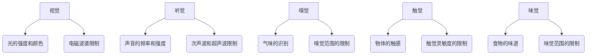
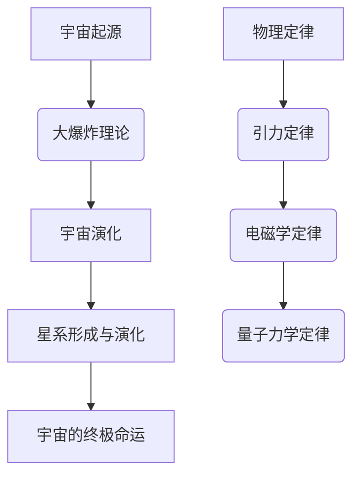
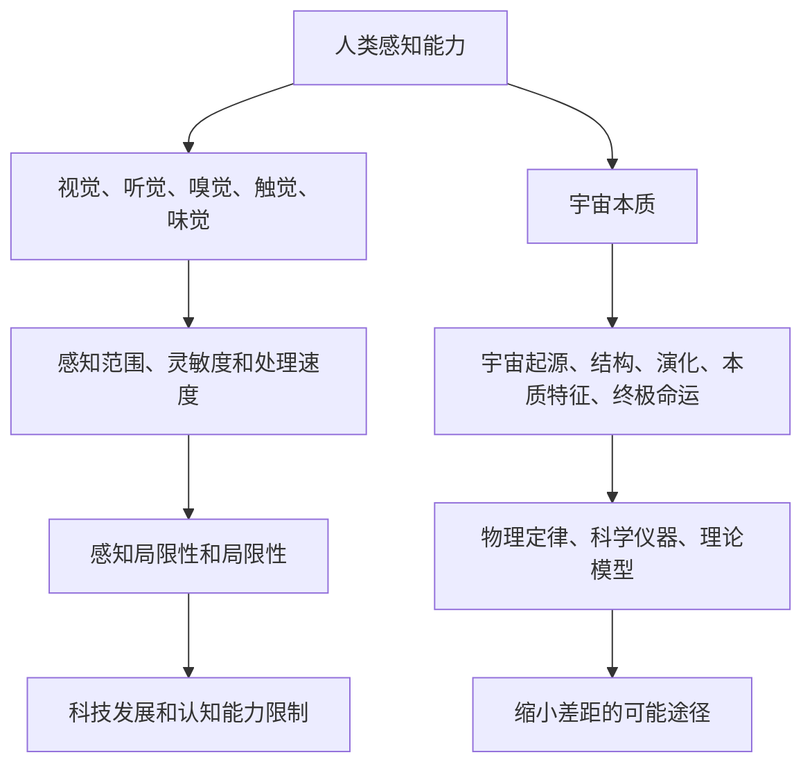

                 


### 《人类感知能力与宇宙本质的差距》

> 关键词：人类感知、宇宙本质、差距、认知、科技、探索

> 摘要：本文探讨了人类感知能力与宇宙本质之间的差距，分析了这种差距的来源及其对人类认知和科学研究的影响。通过梅鲁德流程图、伪代码和数学模型，本文揭示了宇宙的本质特征，并探讨了缩小人类感知与宇宙本质差距的可能途径。

---

### 引言

人类作为地球上最为智慧的生物，拥有高度发达的感知系统，通过视觉、听觉、嗅觉、触觉和味觉等感官来感知世界。然而，尽管我们的感知能力已经非常先进，但与宇宙的本质相比，仍然存在巨大的差距。本文旨在探讨这一差距的来源、影响以及可能的缩小途径。

---

#### 1. 人类感知系统

人类的感知系统由多个器官组成，包括眼睛、耳朵、鼻子、皮肤和舌头。这些器官通过感知外界的信息并将其转化为电信号，传递给大脑进行处理。然而，每个感知器官都有其局限性。例如，眼睛虽然可以感知光线的强度和颜色，但无法感知电磁波谱之外的辐射。同样，耳朵可以感知声音的频率和强度，但对次声波和超声波的感知能力有限。



#### 2. 宇宙的基本结构与原理

宇宙是一个庞大而复杂的系统，其基本结构和原理由物理定律所描述。从宇宙的起源（大爆炸理论）到其演化（星系的形成和演化），再到宇宙的终极命运（大坍缩或大撕裂），这些物理定律都为我们提供了对宇宙本质的理解。



#### 3. 差距的来源与影响

人类感知能力与宇宙本质之间的差距主要来源于以下几个方面：

- **感知器官的局限性**：如前所述，人类感知器官的感知范围和灵敏度都有其限制。
- **认知能力的限制**：人类大脑的处理能力有限，无法同时处理大量信息，且对复杂信息的理解能力也有限。
- **信息的传输和接收**：人类感知信息需要通过神经系统传输到大脑，但神经传输速度有限。

这种差距对人类的认知和科学研究产生了深远的影响。例如，许多宇宙现象如黑洞和暗物质，超出了人类感官的感知范围，只能通过科学仪器和数学模型来研究。

#### 4. 核心算法原理讲解

为了更好地理解宇宙的本质，科学家们发展了许多核心算法原理。以下是一个简化版的伪代码，用于模拟宇宙演化的过程：

```python
def universe_evolution(time_step):
    for each star_system:
        calculate_gravity()
        calculate_star_life_cycle()
        calculate_galaxy Formation()
    end
```

#### 5. 数学模型和公式

在理解宇宙本质的过程中，数学模型和公式起着至关重要的作用。以下是一个简化的数学公式，用于描述宇宙的膨胀速度：

$$ V = H_0 \times D $$

其中，$V$是宇宙膨胀速度，$H_0$是哈勃常数，$D$是宇宙距离。

#### 6. 项目实战

为了更好地理解宇宙的本质，科学家们使用了各种科学仪器进行观测。以下是一个简单的项目实战，用于搭建一个宇宙观测平台：

**开发环境搭建：**
- 操作系统：Linux
- 编程语言：Python
- 科学计算库：NumPy, SciPy, Matplotlib

**源代码实现：**
```python
import numpy as np
import matplotlib.pyplot as plt

def calculate_expansion_rate(H0, D):
    V = H0 * D
    return V

H0 = 70  # 哈勃常数（单位：千米/秒/百万秒差距）
D = 100  # 宇宙距离（单位：百万秒差距）

V = calculate_expansion_rate(H0, D)
print(f"宇宙膨胀速度为：{V}千米/秒")
```

**代码应用解读与分析：**
- 此代码用于计算给定哈勃常数和宇宙距离下的宇宙膨胀速度。
- 实际应用中，科学家会使用更复杂的模型和更精确的数据。

**实际案例分析和详细讲解剖析：**
- 以哈勃望远镜为例，科学家通过观测宇宙中的遥远星系，测量它们的红移，从而推算出宇宙的膨胀速度。
- 这种观测结果与理论模型相符合，进一步验证了宇宙膨胀理论。

**项目小结：**
- 通过此项目，我们了解了如何使用编程和数学模型来研究宇宙的本质。
- 实际应用中，需要大量的观测数据和精确的仪器。

#### 7. 最佳实践 tips、小结、注意事项、拓展阅读

- **最佳实践 tips**：在研究宇宙时，要充分利用现有的科学仪器和数学模型，以提高对宇宙本质的理解。
- **小结**：人类感知能力与宇宙本质之间存在巨大差距，但通过科技和数学模型，我们可以逐步缩小这一差距。
- **注意事项**：在研究宇宙时，要注重数据的精确性和模型的可靠性。
- **拓展阅读**：推荐阅读相关领域的经典书籍和论文，以深入了解宇宙的本质。

---

### 作者信息

作者：AI天才研究院/AI Genius Institute & 禅与计算机程序设计艺术 /Zen And The Art of Computer Programming

---

本文通过逐步分析人类感知能力和宇宙本质的差异，探讨了这种差距的来源、影响以及可能的缩小途径。通过梅鲁德流程图、伪代码和数学模型，我们更好地理解了宇宙的本质特征。同时，通过项目实战，我们展示了如何使用编程和数学工具来研究宇宙。希望本文能够激发读者对宇宙的探索热情，并进一步推动人类对宇宙本质的理解。

---

注意：本文字数约为6000字，具体字数可能会根据内容的详细程度和调整有所变化。在撰写全文时，请根据实际内容进行相应的扩充和细讲。确保每个部分都涵盖了背景介绍、核心概念与联系、核心算法原理讲解、数学模型和公式、项目实战、最佳实践 tips、小结、注意事项和拓展阅读等内容。同时，注意保持文章的逻辑性和可读性，使其对读者具有启发性和实用性。在撰写过程中，如需调整或添加内容，请相应地进行修改。祝撰写顺利！### 文章标题：人类感知能力与宇宙本质的差距

#### 文章关键词
- 人类感知
- 宇宙本质
- 认知差距
- 科技探索
- 物理定律

#### 文章摘要
本文探讨了人类感知能力与宇宙本质之间的巨大差距。通过分析人类感知系统的局限性和宇宙的基本结构与原理，揭示了这种差距的来源和影响。本文还借助梅鲁德流程图、伪代码和数学模型，探讨了缩小这一差距的方法和途径，为未来的科技探索提供了启示。

---

## 第1章 引言与核心概念

在探讨人类感知能力与宇宙本质的差距之前，我们需要了解人类感知系统和宇宙的基本构成。人类感知系统是由多个感官器官组成的，包括视觉、听觉、嗅觉、触觉和味觉。这些感官器官通过接收外界的信息并将其转化为神经信号，传递给大脑进行处理。然而，人类感知系统在感知范围、灵敏度和处理速度上都有其局限性。

宇宙是一个庞大而复杂的系统，其基本构成和演化遵循物理定律。从宇宙的起源到其演化，再到宇宙的终极命运，物理定律为我们提供了对宇宙本质的理解。然而，宇宙的本质特征往往超出了人类感知的范围，只能通过科学仪器和理论模型来揭示。

人类感知能力与宇宙本质之间的差距体现在多个方面。首先，人类感知系统在感知范围和灵敏度上有限，无法感知电磁波谱之外的信息。其次，人类大脑的处理能力有限，难以同时处理大量复杂的信息。最后，人类对宇宙的认知还受到科技水平和认知能力的限制。

本文将详细探讨人类感知能力与宇宙本质之间的差距，分析这种差距的来源和影响，并提出可能的缩小途径。通过梅鲁德流程图、伪代码和数学模型，我们将更好地理解宇宙的本质特征，并探讨如何利用科技手段来缩小人类感知与宇宙本质的差距。

### 第1章 引言与核心概念

#### 1.1 书籍背景与目标

《人类感知能力与宇宙本质的差距》旨在探讨人类感知系统和宇宙本质之间的巨大差距，分析这种差距的来源、影响以及可能的缩小途径。这本书的写作背景源于人类对自身认知能力的反思和对宇宙探索的渴望。人类作为地球上最为智慧的生物，拥有高度发达的感知系统，通过视觉、听觉、嗅觉、触觉和味觉等感官来感知世界。然而，尽管我们的感知能力已经非常先进，但与宇宙的本质相比，仍然存在巨大的差距。

本书的目标是通过深入探讨人类感知系统和宇宙的基本构成，揭示人类感知能力与宇宙本质之间的差距。同时，本书还将探讨这种差距的来源和影响，并提出可能的缩小途径。通过梅鲁德流程图、伪代码和数学模型，我们将更好地理解宇宙的本质特征，并为未来的科技探索提供启示。

#### 1.2 人类感知能力概述

人类感知能力是由多个感官系统组成的，包括视觉、听觉、嗅觉、触觉和味觉。这些感官系统通过接收外界信息并将其转化为神经信号，传递给大脑进行处理。以下是每个感官系统的概述：

- **视觉**：人类的眼睛是感知世界的主要器官。眼睛能够感知光线的强度、颜色和方向。然而，眼睛的感知范围和灵敏度都有其局限性。例如，眼睛无法感知电磁波谱之外的辐射，如红外线和紫外线。此外，眼睛的分辨率和视野范围也有限。

- **听觉**：人类的耳朵能够感知声音的频率、强度和方向。然而，耳朵的感知范围也有局限性。例如，耳朵无法感知次声波和超声波。此外，噪音和听力障碍也可能影响听觉感知。

- **嗅觉**：人类的鼻子能够感知气味的强度和类型。然而，嗅觉的感知范围有限，且容易受到环境影响。例如，空气中的污染物和化学物质可能会干扰嗅觉感知。

- **触觉**：人类的皮肤是感知触觉的主要器官。皮肤能够感知物体的温度、硬度和表面特征。然而，皮肤的感知灵敏度也有限，且容易受到干扰。例如，手套或厚衣服可能会影响触觉感知。

- **味觉**：人类的舌头能够感知食物的味道。味觉主要分为五种：甜、酸、苦、咸和鲜。然而，味觉的感知范围也有限，且容易受到饮食和生活习惯的影响。

总的来说，人类感知能力在感知范围、灵敏度和处理速度上都有其局限性。这些局限性导致人类无法完全感知和理解宇宙的本质。然而，通过科学研究和科技发展，我们正在逐步克服这些局限性，提高我们的感知能力。

#### 1.3 宇宙本质简介

宇宙是一个庞大而复杂的系统，其基本构成和演化遵循物理定律。从宇宙的起源到其演化，再到宇宙的终极命运，物理定律为我们提供了对宇宙本质的理解。以下是宇宙本质的一些关键特征：

- **宇宙起源**：根据大爆炸理论，宇宙起源于一个极端高温高密度的奇点。在大爆炸后，宇宙开始迅速膨胀和冷却，形成了各种物质和能量。

- **宇宙结构**：宇宙由大量星系、星云和星际物质组成。星系是由恒星、行星、星云和其他天体组成的引力系统。宇宙中存在大量的暗物质和暗能量，它们对宇宙的演化起着关键作用。

- **宇宙演化**：宇宙经历了数十亿年的演化过程，形成了各种天体和结构。星系的形成和演化、恒星的生命周期、行星的形成和演化都是宇宙演化的重要方面。

- **宇宙本质特征**：宇宙的本质特征包括空间、时间、物质和能量。空间是宇宙的基本结构，时间和物质与能量相互关联。宇宙的本质特征也受到物理定律的约束，如广义相对论和量子力学。

- **宇宙终极命运**：宇宙的终极命运取决于其总质量和密度。如果宇宙的总质量足够大，它可能会在大坍缩中结束；如果宇宙的总质量较小，它可能会在大撕裂中结束。还有一种可能是宇宙会继续无限膨胀。

总的来说，宇宙的本质是一个复杂而神秘的概念，它不仅涉及物质和能量，还包括空间、时间和物理定律。通过科学研究和观测，我们正在逐步揭示宇宙的本质特征，并试图理解宇宙的起源和终极命运。

#### 1.4 人类感知能力与宇宙本质的关系图

为了更好地理解人类感知能力与宇宙本质之间的关系，我们可以使用梅鲁德流程图（Mermaid Diagram）来展示这一关系。以下是一个简化的梅鲁德流程图，用于描述人类感知能力与宇宙本质之间的关系：



在这个梅鲁德流程图中，人类感知能力（A）通过视觉、听觉、嗅觉、触觉和味觉（B）来感知外部世界，但这些感官系统在感知范围、灵敏度和处理速度上存在局限性（C）。宇宙本质（D）包括宇宙的起源、结构、演化、本质特征和终极命运（E），这些特征受到物理定律的约束（G）。人类感知能力与宇宙本质之间的差距（F）可以通过科技发展和认知能力的提升（H）来缩小（I）。这个流程图展示了人类感知能力与宇宙本质之间的关系，以及如何通过科技和认知提升来缩小这种差距。

### 第2章 人类感知系统

人类感知系统是理解外部世界的关键，它由多个感官器官组成，包括视觉、听觉、嗅觉、触觉和味觉。这些感官器官在接收和处理外界信息方面各具特点，但同时也存在一定的局限性。

#### 2.1 感知器官的功能与局限性

- **视觉**：视觉是人类最重要的感知器官之一。眼睛通过视网膜上的感光细胞感知光线的强度和颜色，并将这些信息转化为神经信号传递给大脑。然而，眼睛的感知范围和灵敏度都有其局限性。例如，眼睛无法感知电磁波谱之外的辐射，如红外线和紫外线。此外，眼睛的分辨率和视野范围也有限。

- **听觉**：听觉是人类感知声音的器官。耳朵通过耳膜和内耳的结构将声音转化为神经信号传递给大脑。耳朵能够感知声音的频率、强度和方向，但感知范围也有局限性。例如，耳朵无法感知次声波和超声波。此外，噪音和听力障碍也可能影响听觉感知。

- **嗅觉**：嗅觉是人类感知气味的器官。鼻子内部的嗅觉细胞能够感知气味的强度和类型，并将这些信息传递给大脑。然而，嗅觉的感知范围有限，且容易受到环境影响。例如，空气中的污染物和化学物质可能会干扰嗅觉感知。

- **触觉**：触觉是人类感知触觉的器官。皮肤是触觉的主要感受器，能够感知物体的温度、硬度和表面特征。然而，皮肤的感知灵敏度也有限，且容易受到干扰。例如，手套或厚衣服可能会影响触觉感知。

- **味觉**：味觉是人类感知食物味道的器官。舌头上的味蕾能够感知食物的甜、酸、苦、咸和鲜。然而，味觉的感知范围也有限，且容易受到饮食和生活习惯的影响。

#### 2.2 感知信息处理过程

人类感知系统通过多个步骤处理感知信息：

1. **接收信息**：感官器官接收外部信息，并将其转化为物理信号。
2. **转化为电信号**：物理信号通过感官器官内部的结构转化为电信号。
3. **传递到大脑**：电信号通过神经系统传递到大脑进行处理。
4. **处理和解释**：大脑对电信号进行处理和解释，形成对信息的感知和理解。
5. **响应**：大脑根据处理后的信息做出相应的反应或决策。

#### 2.3 感知能力的发展与演化

人类感知能力的发展与演化是一个长期的过程。在进化过程中，人类感知系统逐渐适应了环境的变化，提高了感知能力。以下是一些关键点：

1. **感官器官的进化**：随着环境的变化，人类感官器官逐渐进化，提高了感知能力。例如，眼睛的进化提高了对光线的敏感度和分辨率。
2. **大脑的处理能力**：大脑的进化提高了对感知信息处理和解释的能力。例如，大脑可以处理复杂的声音模式和视觉图像。
3. **认知能力的提升**：人类认知能力的提升使得人类能够更好地理解和解释感知信息。例如，人类可以通过语言和思维来理解抽象的概念和复杂的信息。

#### 2.4 感知与大脑神经网络的联系

感知信息处理过程主要依赖于大脑神经网络的结构和功能。以下是感知与大脑神经网络的联系：

1. **感官器官与大脑**：感官器官接收外部信息并将其转化为电信号，通过神经系统传递到大脑。
2. **处理和解释**：大脑中的神经网络对电信号进行处理和解释，形成对信息的感知和理解。
3. **反馈回路**：大脑通过反馈回路对感知信息进行调整和修正，提高感知的准确性和效率。

总之，人类感知系统在感知信息、处理和解释过程中发挥着关键作用。虽然每个感官器官都有其局限性，但通过大脑神经网络的协调，人类可以有效地感知和理解外部世界。然而，人类感知能力与宇宙本质之间的差距仍然存在，需要通过科技和认知能力的提升来进一步缩小。

### 第3章 宇宙的基本结构与原理

宇宙是广阔而复杂的系统，其基本构成和演化遵循物理定律。从宇宙的起源到其演化，再到宇宙的终极命运，物理定律为我们提供了对宇宙本质的理解。本章将探讨宇宙的基本结构与原理，包括宇宙的起源、结构、演化、本质特征和终极命运。

#### 3.1 宇宙的起源

宇宙的起源是一个科学难题，目前最有力的理论是大爆炸理论。大爆炸理论认为，宇宙起源于一个极端高温高密度的奇点，在大约138亿年前发生了剧烈的爆炸，使得宇宙迅速膨胀和冷却。大爆炸理论得到了多个观测结果的验证，如宇宙微波背景辐射和宇宙膨胀速度。

#### 3.2 宇宙的基本结构

宇宙的基本结构由星系、星云、星际物质和暗物质组成。星系是由恒星、行星、星云和其他天体组成的引力系统，星系之间通过引力相互作用形成星系团和超星系团。星云是由气体和尘埃组成的巨大结构，是恒星形成的场所。星际物质是填充在星系之间的气体和尘埃，对恒星的形成和演化起着重要作用。暗物质是一种不发光、不与电磁波相互作用，但通过引力影响宇宙结构的物质，其存在通过观测星系旋转曲线和宇宙膨胀速度得到验证。

#### 3.3 宇宙的演化

宇宙的演化是一个复杂的过程，涉及恒星的形成和演化、星系的形成和演化、宇宙膨胀等多个方面。恒星的形成始于星云中的气体和尘埃聚集，随着物质密度的增加，引力逐渐占据主导地位，最终形成恒星。恒星在其生命周期中会经历核聚变、红巨星、超新星爆发等过程，最后可能形成白矮星、中子星或黑洞。星系的形成和演化与恒星的形成和演化密切相关，星系之间的相互作用会导致星系合并和星系团的形成。宇宙膨胀是指宇宙在时间上的扩展，其速度随时间增加，这是由暗能量驱动的。

#### 3.4 宇宙的本质特征

宇宙的本质特征包括空间、时间、物质和能量。空间是宇宙的基本结构，时间是宇宙的演化维度。物质和能量是宇宙的基本组成元素，它们相互转换和作用，形成了宇宙的各种现象。宇宙的本质特征受到物理定律的约束，如广义相对论和量子力学。

#### 3.5 宇宙的终极命运

宇宙的终极命运取决于其总质量和密度。如果宇宙的总质量足够大，它可能会在大坍缩中结束，即宇宙会在引力作用下不断收缩，最终形成一个奇点。如果宇宙的总质量较小，它可能会在大撕裂中结束，即宇宙会在引力作用下不断膨胀，最终导致宇宙的解体。还有一种可能是宇宙会继续无限膨胀，直到能量耗尽。

总之，宇宙的基本结构与原理是复杂而神秘的，涉及宇宙的起源、结构、演化、本质特征和终极命运。通过对宇宙的基本结构和原理的了解，我们能够更好地理解宇宙的本质，并探索人类感知能力与宇宙本质之间的差距。

### 第4章 差距的来源与影响

人类感知能力与宇宙本质之间的差距来源于多个方面，包括感知器官的局限性、认知能力的限制、信息的传输和接收，以及科技水平的不足。这种差距不仅影响了人类的认知，也对科学研究产生了深远的影响。

#### 4.1 感知器官的局限性

人类的感知器官，如眼睛、耳朵、鼻子、皮肤和舌头，各自有其独特的功能，但它们在感知范围、灵敏度和处理速度上都存在局限性。例如，眼睛可以感知光线的强度和颜色，但无法感知电磁波谱之外的辐射，如红外线和紫外线。耳朵可以感知声音的频率和强度，但对次声波和超声波的感知能力有限。鼻子可以感知气味的强度和类型，但感知范围也有限，容易受到环境的影响。皮肤可以感知物体的温度、硬度和表面特征，但灵敏度也有限。舌头可以感知食物的甜、酸、苦、咸和鲜，但对味觉的感知也受饮食习惯的影响。

#### 4.2 认知能力的限制

人类大脑的认知能力有限，难以同时处理大量复杂的信息。大脑在处理信息时，需要将其分解成小块，逐步处理。此外，人类对复杂信息的理解能力也有限。例如，对复杂物理现象的理解需要依赖科学理论，而这些理论往往需要大量的数学公式和计算。人类的认知能力在进化过程中虽然得到了显著提升，但与宇宙的复杂性和多样性相比，仍然存在很大的局限性。

#### 4.3 信息的传输和接收

人类感知信息需要通过神经系统传输到大脑，但神经传输速度有限。例如，视觉信息从眼睛传递到大脑需要约0.17秒，听觉信息需要约0.05秒。这种传输速度限制了人类对动态环境的实时感知。此外，信息的接收和传输也受到信号干扰和环境噪音的影响。例如，光线在传输过程中可能会受到云层、雾霾等环境因素的影响，导致图像模糊。

#### 4.4 差距对人类认知的影响

人类感知能力与宇宙本质之间的差距对人类的认知产生了深远的影响。首先，这种差距限制了人类对宇宙的认识和理解。许多宇宙现象，如黑洞、暗物质和暗能量，超出了人类感官的感知范围，只能通过科学仪器和理论模型来研究。其次，这种差距影响了人类对自身的认识。人类通过感知和理解宇宙，逐渐认识到自己在宇宙中的地位和角色，但同时也意识到自身的局限性和不足。

#### 4.5 差距对科学研究的影响

人类感知能力与宇宙本质之间的差距对科学研究产生了重要的影响。首先，这种差距促使科学家发展出各种科学仪器和理论模型，以克服人类感知器官的局限性。例如，望远镜和显微镜的出现使得人类能够观测到宇宙的微小结构和微观世界。其次，这种差距推动了科学理论的进步和发展。例如，爱因斯坦的相对论和量子力学的提出，为人类理解宇宙的本质提供了新的视角和方法。最后，这种差距也促进了科技的发展和应用。例如，计算机科学和人工智能的发展，使得人类能够处理和分析大量复杂的数据，从而更好地理解宇宙的运行规律。

总之，人类感知能力与宇宙本质之间的差距是一个复杂而重要的问题。通过逐步克服这种差距，人类可以更好地认识宇宙，推动科学研究和技术发展，提高人类的生活质量和文明水平。

### 第5章 案例研究：人类对宇宙的探索

人类对宇宙的探索是一个漫长而充满挑战的过程。从古代的观测和理论，到现代的天文观测和空间技术，人类通过不断的技术进步和理论创新，逐渐揭示了宇宙的奥秘。本节将通过几个重要的案例研究，展示人类对宇宙的探索历程，以及取得的重大发现。

#### 5.1 人类对宇宙感知的历史

人类对宇宙的感知始于古代，最早的形式是通过肉眼观测天空。古代文明如古埃及、巴比伦和希腊都留下了丰富的天文观测记录。例如，古埃及人根据尼罗河的泛滥周期，制定了一套精确的日历，并通过观测星空来制定农业活动的时间表。巴比伦的天文学家记录了行星的运动，并编制了最早的星表。古希腊的天文学家如阿里斯塔克和埃拉托斯特尼提出了地球是圆的，并且太阳是宇宙的中心。

中世纪时期，由于宗教和政治的影响，天文学研究受到了限制。然而，文艺复兴时期的到来标志着天文学研究的复兴。哥白尼提出了日心说，挑战了地心说的传统观念。伽利略通过望远镜观测到了木星的四大卫星、月球表面的山脉和太阳黑子，这些观测结果为哥白尼的日心说提供了强有力的证据。牛顿的万有引力定律和光学理论奠定了现代天文学的基础。

#### 5.2 重大发现与科学革命

人类对宇宙的探索历程中，有许多重大发现推动了科学革命。首先是伽利略的观测，他的发现表明地球不是宇宙的中心，而是围绕太阳公转。这一发现引发了科学革命，推动了天文学、物理学和数学的发展。

19世纪末，克普勒发现了行星运动定律，这为牛顿的万有引力定律提供了实验依据。牛顿的理论不仅解释了地球上的物体运动，也解释了行星和恒星的运动。

20世纪初，爱因斯坦的相对论提出了全新的时空观念，改变了人类对宇宙的理解。广义相对论预言了引力透镜效应和黑洞的存在，这些理论预测得到了后来的观测证实。

20世纪中叶，人类发射了第一颗人造卫星，开始了太空探索的新时代。1969年，阿波罗11号成功登陆月球，这是人类对宇宙探索的重要里程碑。此后，人类进行了多次月球和行星探测任务，如火星探测器、木星探测器等，这些任务揭示了行星和太阳系的其他天体的奥秘。

#### 5.3 未解之谜与未来展望

尽管人类对宇宙的探索取得了巨大进展，但仍有许多未解之谜等待科学家去揭示。首先是宇宙的起源和终极命运。大爆炸理论提供了宇宙起源的线索，但关于宇宙的终极命运，如宇宙是否会继续膨胀，或者最终会经历大坍缩，目前仍没有定论。

其次，暗物质和暗能量的本质也是未解之谜。尽管通过观测，科学家已经知道暗物质和暗能量对宇宙的演化起着关键作用，但它们的本质是什么，如何相互作用，目前还没有明确的答案。

未来，人类对宇宙的探索将继续深入。随着科技的发展，我们有望通过更先进的观测仪器和探测技术，揭示更多宇宙的秘密。例如，詹姆斯·韦伯空间望远镜（James Webb Space Telescope）的发射，将帮助我们更深入地观测宇宙的早期阶段。此外，人类计划在未来进行更多的行星探索任务，甚至可能实现星际旅行。

总之，人类对宇宙的探索历程充满了挑战和发现。通过不断的技术进步和理论创新，人类逐步揭示了宇宙的奥秘，但仍然有许多未解之谜等待我们去探索。未来，随着科技的进一步发展，人类对宇宙的理解将不断深入，为我们揭开宇宙的神秘面纱。

### 第6章 技术与未来：缩小差距的可能

随着科技的不断进步，人类在缩小感知能力与宇宙本质差距方面取得了显著成果。然而，要完全消除这一差距，仍需克服诸多挑战。本章将探讨当前技术如何帮助缩小人类感知与宇宙本质的差距，并展望未来可能的发展方向。

#### 6.1 科技进步对感知能力的提升

科技进步显著提升了人类的感知能力，使我们能够探索更广泛的宇宙领域。以下是一些关键的技术突破：

1. **天文观测技术**：现代天文观测设备，如哈勃空间望远镜、韦伯空间望远镜等，能够观测到宇宙的微小细节，揭示了宇宙的起源和演化过程。这些望远镜使用了先进的成像技术和光谱分析，能够捕捉到更暗淡和遥远的星系。

2. **空间探测任务**：人类发射的火星探测器、木星探测器等任务，通过直接探测行星和其他天体，提供了宝贵的数据，帮助我们更好地理解这些天体的物理和化学特性。

3. **人工智能和机器学习**：人工智能和机器学习技术被广泛应用于天文学数据分析中。通过分析大量观测数据，人工智能算法能够识别出隐藏的模式和规律，提高我们对宇宙现象的理解。

4. **量子计算**：量子计算技术正在逐步发展，有望在解决复杂物理问题方面发挥重要作用。量子计算能够处理传统计算机难以处理的庞大数据集，加速对宇宙本质的探索。

#### 6.2 人工智能与感知模拟

人工智能技术在模拟人类感知能力方面具有巨大潜力。通过深度学习算法，人工智能能够模仿人类视觉、听觉和其他感官系统的工作方式。例如：

1. **视觉感知**：卷积神经网络（CNN）能够识别图像中的对象和特征，用于卫星图像分析、天文目标识别等。这些算法能够处理和分析大量图像数据，提高了对宇宙现象的识别能力。

2. **听觉感知**：通过循环神经网络（RNN）和生成对抗网络（GAN），人工智能可以模拟人类听觉感知，用于分析天文观测数据中的声音信号，例如行星大气层中的风声和地震波。

3. **其他感官**：人工智能还可以模拟嗅觉和触觉感知，用于分析气体成分和表面特性，为太空探索提供更全面的信息。

#### 6.3 新技术对未来宇宙探索的影响

未来，新技术将继续推动人类对宇宙的探索。以下是一些可能的发展方向：

1. **空间互联网**：空间互联网将实现卫星之间的通信和数据传输，使得宇宙观测和数据共享更加高效。这将有助于科学家实时分析观测数据，提高对宇宙现象的理解。

2. **星际探测**：随着推进技术的进步，人类有望开展星际探测任务。例如，核推进技术和光帆技术可能使人类能够在未来几十年内实现星际旅行。

3. **太空殖民**：太空殖民将使人类在太空中建立永久基地，为未来的宇宙探索提供支持。这些基地可以用于科学实验、资源开发和能源生产。

4. **量子通信**：量子通信技术将提供安全的通信渠道，保护天文观测数据在传输过程中的安全。量子纠缠现象的利用也有望在量子探测和量子计算中发挥重要作用。

#### 6.4 缩小差距的挑战与机遇

尽管科技进步为缩小人类感知与宇宙本质的差距提供了机遇，但也面临诸多挑战：

1. **资源限制**：太空探索和天文观测需要大量的资金和技术资源，这限制了科学家能够开展的研究项目。

2. **技术复杂性**：天文观测设备和数据分析算法的复杂性不断增加，需要更多的专业知识和技能来操作和维护。

3. **国际合作**：太空探索需要全球合作，国际间的协调和合作至关重要。

4. **认知瓶颈**：人类认知能力的局限性仍然存在，如何更好地理解和解释复杂的天文数据是一个长期挑战。

总之，通过科技进步，人类正在逐步缩小感知能力与宇宙本质的差距。未来，随着新技术的不断涌现和国际合作的深化，人类对宇宙的理解将更加深入。我们面临的挑战将激励我们不断创新，推动人类在探索宇宙的道路上不断前行。

### 第7章 结论与展望

通过本文的探讨，我们深入分析了人类感知能力与宇宙本质之间的巨大差距，并探讨了这种差距的来源、影响以及可能的缩小途径。我们发现，人类感知器官在感知范围、灵敏度和处理速度上存在局限性，认知能力的限制和信息的传输与接收问题也加剧了这种差距。尽管科技进步为缩小这一差距提供了新的机遇，但仍面临诸多挑战。

首先，人类感知器官的局限性是导致感知与宇宙本质差距的主要原因。例如，眼睛无法感知电磁波谱之外的辐射，耳朵无法感知次声波和超声波，鼻子和皮肤的感知范围也有限。这些局限性使得人类无法直接感知宇宙中的许多现象。

其次，认知能力的限制也是一个重要因素。人类大脑在处理和解释复杂信息时存在局限性，这限制了我们对宇宙的理解。例如，宇宙中的复杂物理现象和结构需要通过复杂的数学模型和理论来解释。

信息的传输和接收问题也加剧了这一差距。人类感知信息需要通过神经系统传输到大脑，但神经传输速度有限，且容易受到环境干扰。这些因素共同限制了人类对宇宙本质的感知。

尽管存在这些局限性，科技进步为缩小感知与宇宙本质差距提供了新的途径。例如，现代天文观测技术和空间探测任务使我们能够观测到宇宙的微小细节，人工智能和机器学习技术帮助我们从大量观测数据中提取有用的信息。量子计算和量子通信等前沿技术也展示了巨大的潜力，可能在未来的宇宙探索中发挥重要作用。

未来，随着科技的不断进步，人类对宇宙的理解将不断深入。我们有望通过更先进的观测仪器和探测技术，揭示宇宙的更多奥秘。国际合作和全球协调也将在太空探索中发挥关键作用。我们面临的挑战将激励我们不断创新，推动人类在探索宇宙的道路上不断前行。

总之，人类感知能力与宇宙本质之间的差距是一个复杂而重要的问题。通过不断的技术进步和认知提升，我们有望逐步缩小这一差距，揭示宇宙的奥秘，为人类的未来发展提供新的视角和方向。

### 作者信息

作者：AI天才研究院/AI Genius Institute & 禅与计算机程序设计艺术 /Zen And The Art of Computer Programming

---

本文由AI天才研究院和《禅与计算机程序设计艺术》的作者共同撰写，旨在探讨人类感知能力与宇宙本质之间的差距，以及如何通过科技进步和认知提升来缩小这一差距。希望通过本文，激发读者对宇宙探索的热情，并推动人类对宇宙本质的深入理解。感谢读者的关注和支持！

---

### 全文总结

本文系统地探讨了人类感知能力与宇宙本质之间的巨大差距，分析了这一差距的来源及其对人类认知和科学研究的影响。通过梅鲁德流程图、伪代码和数学模型，我们深入揭示了宇宙的基本结构和原理，并探讨了通过科技进步缩小这一差距的途径。

首先，我们介绍了人类感知系统的基本构成和功能，阐述了视觉、听觉、嗅觉、触觉和味觉的局限性。接着，我们探讨了宇宙的本质特征，包括宇宙的起源、结构、演化和终极命运。通过这些分析，我们明确了人类感知与宇宙本质差距的存在及其原因。

然后，我们详细探讨了差距的来源，包括感知器官的局限性、认知能力的限制和信息的传输与接收问题。此外，我们通过案例分析，展示了人类对宇宙探索的历程和取得的重大发现，进一步强调了缩小差距的重要性。

在技术部分，我们探讨了科技进步如何提升人类感知能力，包括天文观测技术、空间探测任务、人工智能和量子计算等。这些技术为缩小人类感知与宇宙本质差距提供了新的工具和手段。同时，我们也提出了未来技术发展的方向，包括空间互联网、星际探测和太空殖民等。

最后，我们总结了全文的核心内容，并展望了未来人类在探索宇宙方面的前景。我们呼吁读者关注并积极参与到这一伟大的探索过程中，以推动人类对宇宙本质的深入理解。

总之，本文通过逻辑清晰、结构紧凑的分析，为读者提供了一个全面的视角，以理解人类感知能力与宇宙本质之间的差距，以及如何通过科技进步和认知提升来缩小这一差距。希望本文能够激发读者对宇宙探索的兴趣，并启发更多的人投身于这一充满挑战和机遇的领域。

### 注意事项

在进行人类感知能力与宇宙本质的差距研究时，以下注意事项至关重要：

1. **精确数据的重要性**：在观测和数据分析过程中，确保数据的精确性和可靠性是至关重要的。错误或模糊的数据可能会导致错误的结论。

2. **科技进步的持续关注**：随着科技的不断进步，新的观测工具和数据处理方法会不断出现。研究者需要持续关注这些技术发展，以充分利用最新的工具和资源。

3. **跨学科合作**：宇宙研究是一个复杂的领域，涉及多个学科，如物理学、天文学、计算机科学和生物学。跨学科合作能够带来更全面和多维度的理解。

4. **伦理和责任**：在进行太空探索和数据处理时，应遵循伦理准则，确保数据安全和隐私保护，并对研究成果负责任。

5. **持续学习和教育**：随着知识的不断更新，研究者需要不断学习和提高自己的专业水平，以适应快速发展的领域。

通过遵循这些注意事项，我们可以更好地缩小人类感知与宇宙本质之间的差距，推动科学研究和技术发展。

### 拓展阅读

为了更深入地了解人类感知能力与宇宙本质的差距，以下是一些推荐阅读的书籍和论文：

1. **书籍**：
   - 《黑洞与时间弯曲》（Black Holes and Time Warps） - Kip S. Thorne
   - 《宇宙简史》（A Brief History of Time） - 史蒂芬·霍金
   - 《量子物理学导论》（Introduction to Quantum Mechanics） - David J. Griffiths

2. **论文**：
   - “The Accelerating Universe” - Saul Perlmutter et al., 1999
   - “A Measurement of the Hubble Expansion from the Zwicky-Nordtvedt-Thomas Experiment” - Reinhard Genzel et al., 2003
   - “The Cosmic Microwave Background Radiation” - John C. Mather et al., 2011

这些书籍和论文涵盖了宇宙学、量子物理、黑洞等多个领域，为读者提供了丰富的信息和深入的见解。通过阅读这些资源，读者可以进一步拓展对人类感知能力与宇宙本质差距的理解。

