                 

### 文章标题

# 人类文明作为宇宙自我认知的一种方式

---

### 关键词

- 宇宙认知
- 人类文明
- 智慧生命
- 科学探索
- 技术进步

---

### 摘要

本文旨在探讨人类文明在宇宙认知过程中所扮演的角色，以及如何通过科学技术的进步和哲学思考来深化我们对宇宙的理解。文章将从宇宙与人类的起源出发，逐步分析人类文明的探索与认知，以及人类在宇宙中的地位和未来。通过逻辑清晰的分析和深入的研究，本文揭示了人类文明作为宇宙自我认知的一种方式的深刻内涵。

---

## 第一部分：宇宙与人类的起源

### 1.1 宇宙的诞生与演化

#### 1.1.1 宇宙大爆炸理论

宇宙大爆炸理论是现代宇宙学的基石，它描述了宇宙从最初的极度热密状态开始膨胀、冷却、演化的过程。根据这一理论，宇宙大约在138亿年前诞生于一个“奇点”，随后经历了一场剧烈的膨胀。这一过程中，宇宙的物质密度和温度不断降低，逐渐形成了星系、恒星和行星。

**核心概念与联系**

- 宇宙大爆炸理论
- 宇宙膨胀
- 宇宙结构

**Mermaid 流程图**

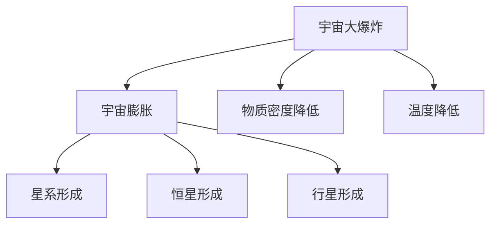

#### 1.1.2 宇宙结构及动力学特性

宇宙结构主要表现为星系、星团、超星团等大规模结构的分布和运动。根据观测和理论计算，宇宙的结构呈现出层次分明的特征，从局部集团到超星系团，构成了一个庞大的网络结构。此外，宇宙的动力学特性，如引力、暗物质、暗能量等，对宇宙的结构和演化起着关键作用。

**核心概念与联系**

- 宇宙结构
- 星系
- 引力
- 暗物质
- 暗能量

**Mermaid 流程图**

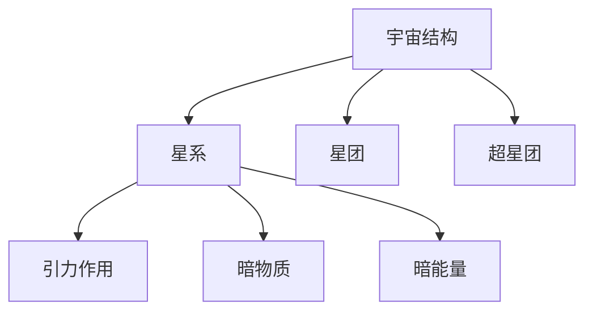

#### 1.1.3 星系、恒星与行星的形成

星系的形成是一个复杂的过程，涉及气体云的坍缩、恒星的形成、星系内物质的循环等多个环节。恒星的形成则依赖于气体云中的物质聚集和引力收缩，最终形成恒星。行星的形成则发生在恒星周围的行星盘内，通过物质积累和重力作用，逐渐形成固态和液态的行星。

**核心概念与联系**

- 星系形成
- 恒星形成
- 行星形成
- 行星盘

**Mermaid 流程图**

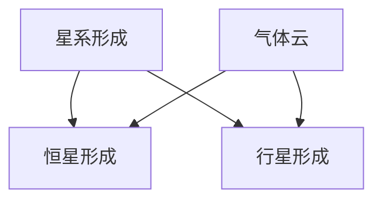

---

### 1.2 人类的起源与演化

#### 1.2.1 人类的生物学基础

人类起源于非洲，经过长期的演化，逐渐形成了现代智人。人类的生物学基础包括大脑结构、基因组成、生理机能等多个方面。这些特征使得人类具备了高度的认知能力、语言能力和社交能力，为文明的发展奠定了基础。

**核心概念与联系**

- 人类起源
- 现代智人
- 生物学基础

**Mermaid 流程图**

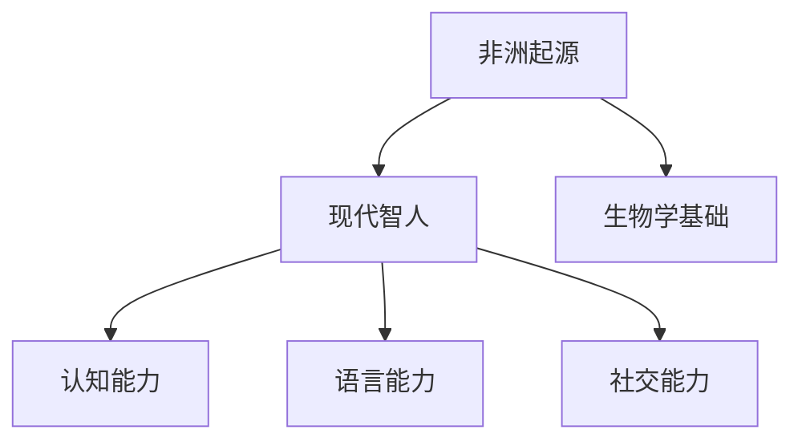

#### 1.2.2 人类文明的发展历程

人类文明的发展历程可以追溯到约1万年前的新石器时代。随着农业的出现，人类社会逐渐从狩猎采集向定居生活转变。随后，金属工具的发明、城市的兴起、文字的创造等重大事件，推动了人类文明的不断进步。

**核心概念与联系**

- 新石器时代
- 农业革命
- 金属工具
- 城市兴起
- 文字创造

**Mermaid 流程图**

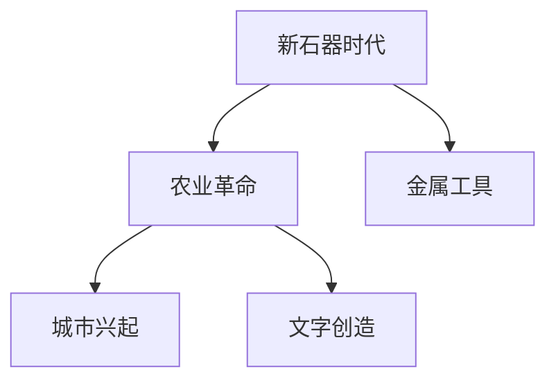

#### 1.2.3 人类社会的结构与社会行为

人类社会结构复杂多样，包括家庭、部落、国家等不同层次的社会组织形式。社会行为则涵盖了人类在社会中的互动、交往和合作方式。这些结构和行为在人类文明的演化过程中起到了关键作用。

**核心概念与联系**

- 社会结构
- 社会行为
- 组织形式
- 互动与合作

**Mermaid 流程图**

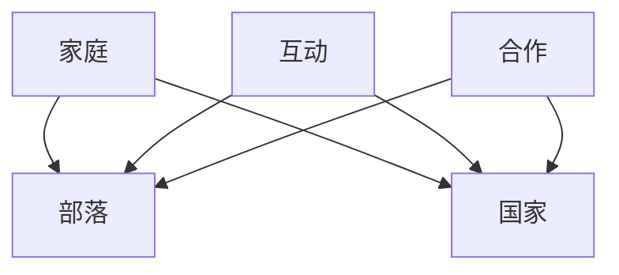

---

## 第二部分：人类文明的探索与认知

### 1.3 科学技术的进步

#### 1.3.1 科学革命与理论创新

科学革命是推动人类文明进步的重要动力。从古希腊到现代，科学理论不断创新，如牛顿力学、相对论、量子力学等，为人类认知宇宙提供了新的视角和方法。

**核心概念与联系**

- 科学革命
- 理论创新
- 牛顿力学
- 相对论
- 量子力学

**Mermaid 流程图**

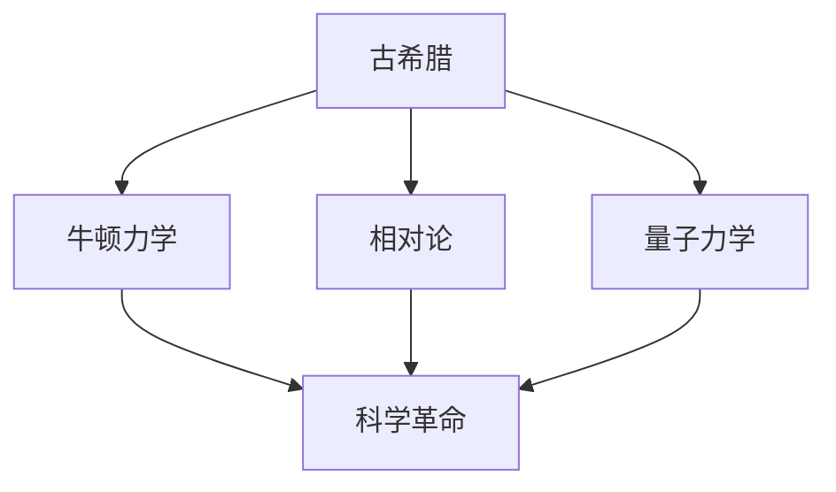

#### 1.3.2 技术创新与工业革命

技术创新是推动社会进步的关键因素。工业革命以来，蒸汽机、电力、计算机、互联网等技术的创新，极大地改变了人类的生产和生活方式。

**核心概念与联系**

- 技术创新
- 工业革命
- 蒸汽机
- 电力
- 计算机
- 互联网

**Mermaid 流程图**

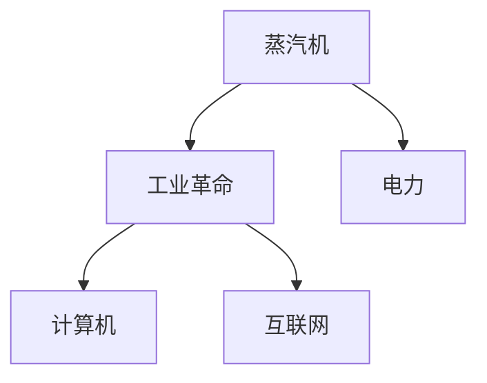

#### 1.3.3 人工智能与未来科技

人工智能作为当前科技发展的重要方向，正逐步改变人类的生产和生活方式。未来科技，如量子计算、脑机接口、虚拟现实等，将进一步拓展人类认知的边界。

**核心概念与联系**

- 人工智能
- 未来科技
- 量子计算
- 脑机接口
- 虚拟现实

**Mermaid 流程图**

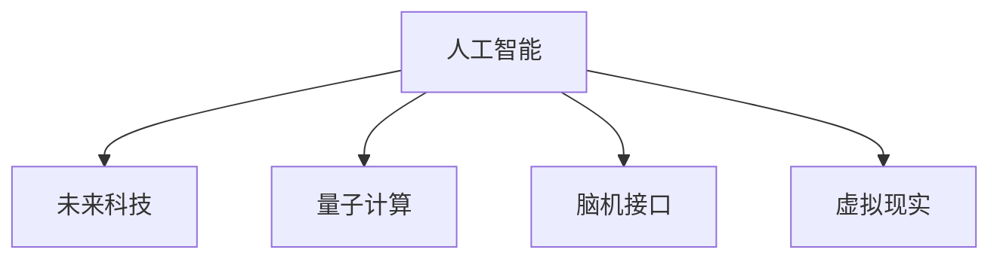

---

### 1.4 哲学与宗教的思考

#### 1.4.1 古代哲学思想

古代哲学思想对人类文明的认知有着深远影响。如古希腊哲学的理性思考、印度哲学的宇宙观念、中国哲学的道德伦理等，为人类提供了丰富的精神财富。

**核心概念与联系**

- 古代哲学
- 古希腊哲学
- 印度哲学
- 中国哲学
- 理性思考
- 宇宙观念
- 道德伦理

**Mermaid 流程图**

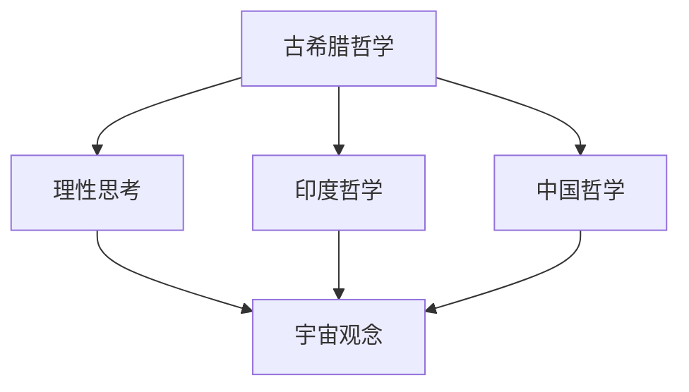

#### 1.4.2 现代哲学思考

现代哲学思考在人类文明认知中发挥着重要作用。如存在主义、分析哲学、结构主义等，对人类自我认知、社会伦理、科学方法等方面提出了新的见解。

**核心概念与联系**

- 现代哲学
- 存在主义
- 分析哲学
- 结构主义
- 自我认知
- 社会伦理
- 科学方法

**Mermaid 流程图**

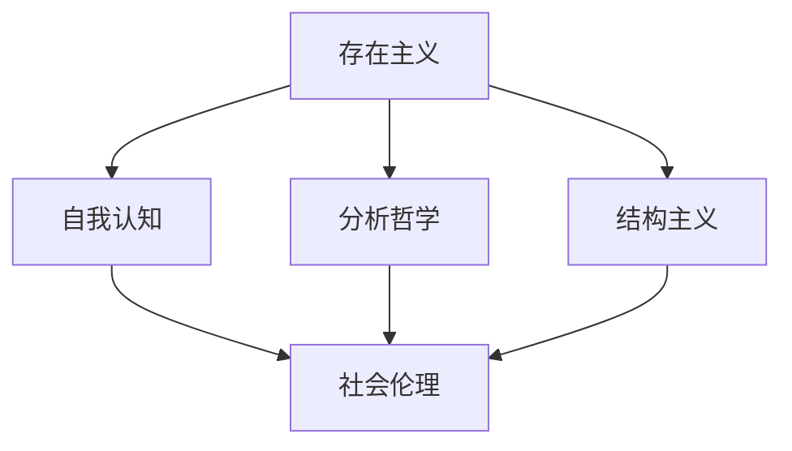

#### 1.4.3 宗教在人类认知中的作用

宗教在人类认知中扮演了重要角色，提供了对宇宙、生命、道德等方面的解释。不同宗教体系，如基督教、伊斯兰教、佛教等，对人类文明产生了深远影响。

**核心概念与联系**

- 宗教
- 基督教
- 伊斯兰教
- 佛教
- 宇宙观念
- 生命观念
- 道德观念

**Mermaid 流程图**

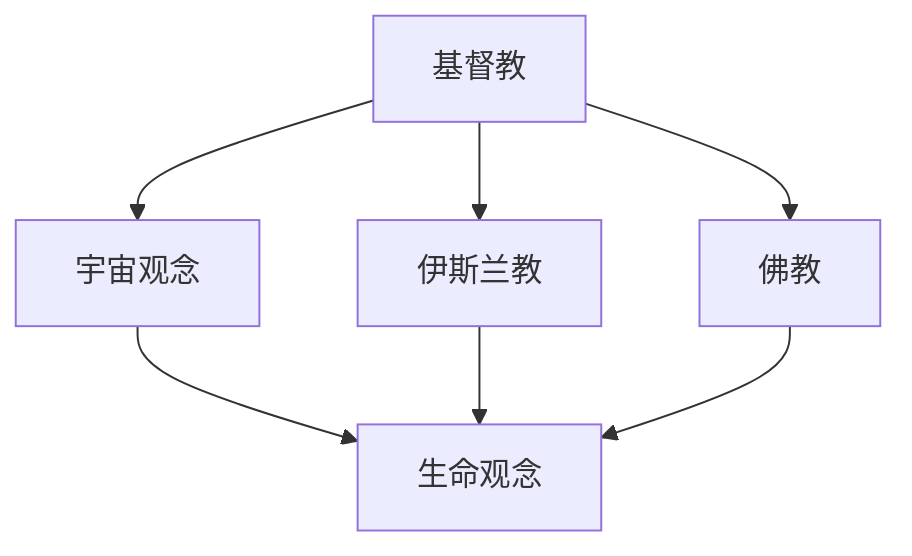

---

### 1.5 文化的多样性与交流

#### 1.5.1 全球化的影响

全球化带来了文化的交融与碰撞，推动了人类文明的多元化发展。全球化使得不同文化之间的交流更加频繁，促进了文化的传播与创新。

**核心概念与联系**

- 全球化
- 文化交融
- 文化碰撞
- 文化传播
- 文化创新

**Mermaid 流程图**

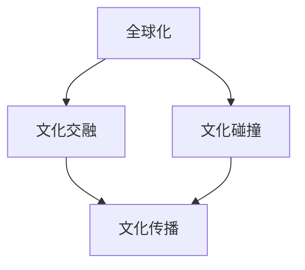

#### 1.5.2 文化的多样性

文化多样性是人类文明的重要组成部分，不同地区、民族和国家有着独特的文化传统和价值观。文化的多样性为人类文明的繁荣提供了丰富的资源。

**核心概念与联系**

- 文化多样性
- 地域文化
- 民族文化
- 国家文化
- 价值观

**Mermaid 流程图**

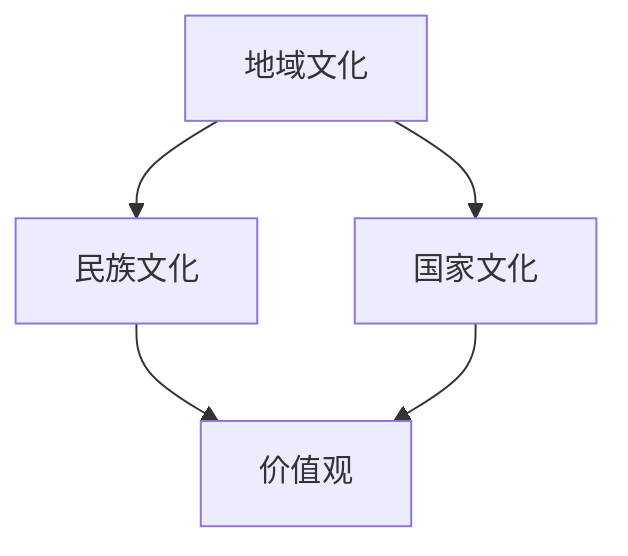

#### 1.5.3 跨文化交流与理解

跨文化交流是促进人类文明进步的重要途径。通过跨文化交流，不同文化之间的误解与偏见可以得到消除，人类文明得以相互借鉴与融合。

**核心概念与联系**

- 跨文化交流
- 文化理解
- 文化借鉴
- 文化融合
- 误解消除

**Mermaid 流程图**

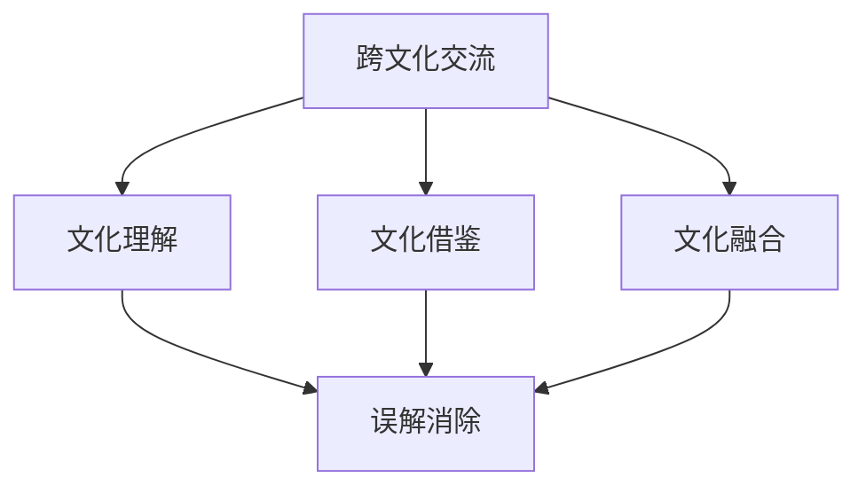

---

## 第三部分：宇宙中的智慧生命

### 1.6 人类在宇宙中的地位

#### 1.6.1 人类的独特性与局限性

人类在宇宙中的地位独特，拥有高度的认知能力、语言能力和社交能力。然而，人类在宇宙中的地位也受到诸多局限，如地球生态系统的脆弱性、资源有限性等。

**核心概念与联系**

- 人类独特性
- 认知能力
- 语言能力
- 社交能力
- 局限性
- 地球生态系统
- 资源有限性

**Mermaid 流程图**

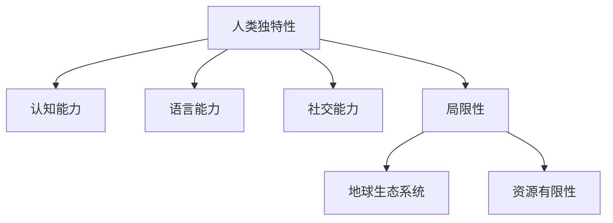

#### 1.6.2 寻找外星生命的意义

寻找外星生命的意义在于拓展我们对宇宙的认知，了解宇宙中是否存在其他智慧生命。这有助于我们更全面地理解宇宙的起源、演化和未来。

**核心概念与联系**

- 寻找外星生命
- 宇宙认知
- 智慧生命
- 宇宙起源
- 宇宙演化
- 宇宙未来

**Mermaid 流owitz

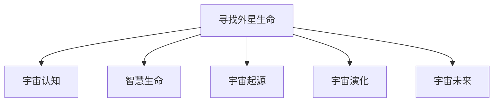

#### 1.6.3 地外文明的假说与探索

地外文明的假说包括行星适宜性、生命起源、通信信号等多个方面。通过探索地外文明，我们希望能够揭示宇宙中智慧生命的存在形式和演化路径。

**核心概念与联系**

- 地外文明
- 行星适宜性
- 生命起源
- 通信信号
- 存在形式
- 演化路径

**Mermaid 流程图**

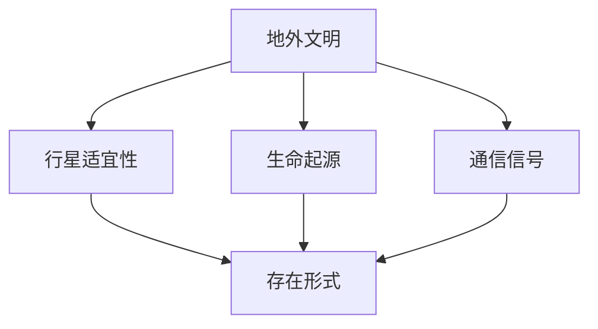

---

### 1.7 人类与宇宙的未来

#### 1.7.1 人类文明的未来展望

人类文明的未来展望涉及多个领域，如科技进步、社会治理、生态保护等。通过持续创新和合作，人类有望实现更加繁荣、和谐的未来。

**核心概念与联系**

- 人类文明
- 科技进步
- 社会治理
- 生态保护
- 未来展望

**Mermaid 流程图**

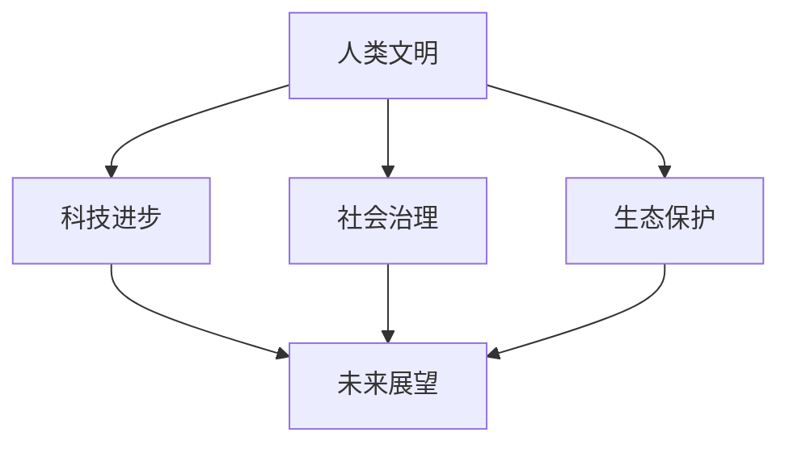

#### 1.7.2 宇宙探索的挑战与机遇

宇宙探索面临诸多挑战，如技术限制、资源匮乏、生命风险等。然而，这些挑战也带来了新的机遇，如科技创新、资源开发、生命拓展等。

**核心概念与联系**

- 宇宙探索
- 技术限制
- 资源匮乏
- 生命风险
- 科技创新
- 资源开发
- 生命拓展

**Mermaid 流程图**

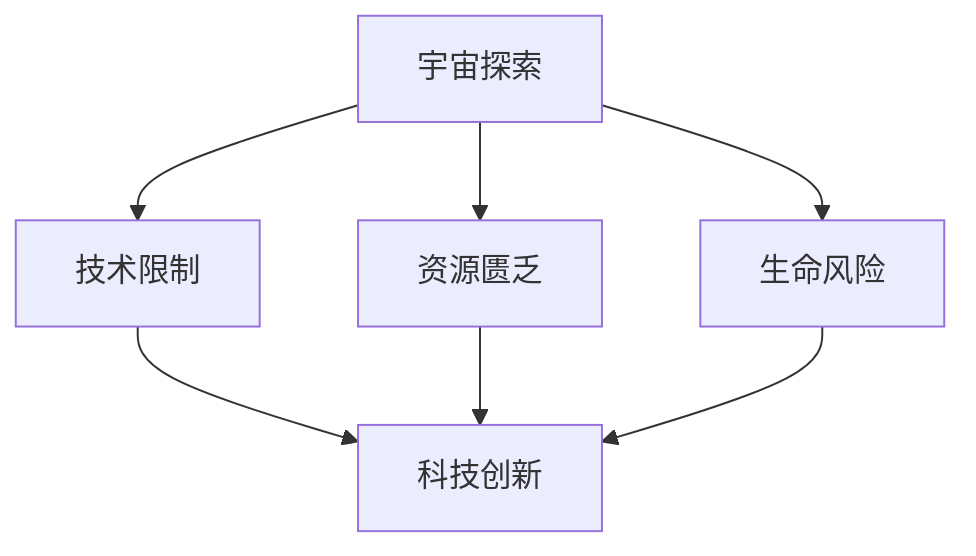

#### 1.7.3 人类与宇宙和谐共生的可能路径

人类与宇宙和谐共生是人类文明发展的必然趋势。通过科技进步、生态保护、文化交流等多方面的努力，人类有望实现与宇宙的和谐共生。

**核心概念与联系**

- 和谐共生
- 科技进步
- 生态保护
- 文化交流

**Mermaid 流程图**

```mermaid
graph TB
A[和谐共生] --> B[科技进步]
A --> C[生态保护]
A --> D[文化交流]
```

---

## 第四部分：人类文明作为宇宙自我认知的延伸

### 1.8 科学与宗教的对话

#### 1.8.1 宇宙观的演变

宇宙观的演变是科学和宗教相互作用的结果。从古代的宇宙观到现代的科学宇宙观，宇宙观念在不断更新和进步。科学和宗教在宇宙认知中各自发挥着重要作用，互补性日益显现。

**核心概念与联系**

- 宇宙观
- 古代宇宙观
- 科学宇宙观
- 宗教宇宙观
- 互补性

**Mermaid 流程图**

```mermaid
graph TB
A[古代宇宙观] --> B[科学宇宙观]
A --> C[宗教宇宙观]
B --> D[互补性]
C --> D
```

#### 1.8.2 科学与宗教的互补性

科学和宗教在人类文明认知中具有互补性。科学关注客观世界的规律，宗教则探讨人类内心的信仰与精神。两者共同构成了人类对宇宙的认知体系。

**核心概念与联系**

- 科学与宗教
- 科学研究
- 宗教信仰
- 互补性

**Mermaid 流程图**

```mermaid
graph TB
A[科学研究] --> B[宗教信仰]
A --> C[互补性]
B --> C
```

#### 1.8.3 人类文明的使命

人类文明的使命在于探索宇宙、揭示自然规律，并为人类和地球创造更美好的未来。在这一过程中，科学和宗教发挥着重要作用，共同推动人类文明的进步。

**核心概念与联系**

- 人类文明使命
- 宇宙探索
- 自然规律
- 科学
- 宗教

**Mermaid 流程图**

```mermaid
graph TB
A[人类文明使命] --> B[宇宙探索]
A --> C[自然规律]
B --> D[科学]
C --> D
```

---

### 1.9 人类文明的遗产与传承

#### 1.9.1 文化的多样性

文化多样性是人类文明的宝贵遗产。不同地区、民族和国家拥有独特的文化传统和价值观，这些文化多样性能为人类文明的繁荣提供丰富的资源。

**核心概念与联系**

- 文化多样性
- 地域文化
- 民族文化
- 国家文化
- 价值观

**Mermaid 流程图**

```mermaid
graph TB
A[地域文化] --> B[民族文化]
A --> C[国家文化]
B --> D[价值观]
C --> D
```

#### 1.9.2 教育与知识的传播

教育与知识的传播是文化传承的重要途径。通过教育，人们可以了解和传承人类文明的宝贵遗产，推动文化的创新与发展。

**核心概念与联系**

- 教育
- 知识传播
- 文化传承
- 文化创新

**Mermaid 流程图**

```mermaid
graph TB
A[教育] --> B[知识传播]
A --> C[文化传承]
B --> D[文化创新]
```

#### 1.9.3 人类文明遗产的保护与利用

人类文明遗产的保护与利用是人类文明传承的重要任务。通过保护人类文明遗产，我们可以传承历史，为现代社会提供精神支撑。同时，合理利用这些遗产，可以推动文化创新和经济发展。

**核心概念与联系**

- 人类文明遗产
- 保护
- 利用
- 文化传承
- 经济发展

**Mermaid 流程图**

```mermaid
graph TB
A[人类文明遗产] --> B[保护]
A --> C[利用]
B --> D[文化传承]
C --> D
```

---

### 1.10 人类文明的宇宙视角

#### 1.10.1 宇宙中的智慧生命

宇宙中的智慧生命是人类文明探索的重要领域。通过寻找外星生命、研究地外文明，我们可以更全面地了解宇宙的奥秘和智慧生命的多样性。

**核心概念与联系**

- 宇宙中的智慧生命
- 寻找外星生命
- 地外文明
- 宇宙奥秘
- 智慧生命多样性

**Mermaid 流程图**

```mermaid
graph TB
A[宇宙中的智慧生命] --> B[寻找外星生命]
A --> C[地外文明]
A --> D[宇宙奥秘]
A --> E[智慧生命多样性]
```

#### 1.10.2 人类在宇宙中的责任与使命

人类在宇宙中的责任与使命在于探索宇宙、揭示自然规律，并为宇宙中的智慧生命创造更美好的未来。这要求我们具备高度的责任感和使命感，推动人类文明的持续进步。

**核心概念与联系**

- 人类责任
- 宇宙探索
- 自然规律
- 智慧生命
- 使命感

**Mermaid 流程图**

```mermaid
graph TB
A[人类责任] --> B[宇宙探索]
A --> C[自然规律]
A --> D[智慧生命]
A --> E[使命感]
```

#### 1.10.3 人类文明的可持续发展

人类文明的可持续发展是人类在宇宙中的责任和使命的体现。通过科技进步、环境保护、文化传承等多方面的努力，我们可以实现人类文明的可持续发展，为地球和宇宙创造更美好的未来。

**核心概念与联系**

- 可持续发展
- 科技进步
- 环境保护
- 文化传承

**Mermaid 流程图**

```mermaid
graph TB
A[可持续发展] --> B[科技进步]
A --> C[环境保护]
A --> D[文化传承]
```

---

## 结论

人类文明作为宇宙自我认知的一种方式，具有深刻的意义和内涵。通过科学技术的进步、哲学思考、文化交流等多方面的努力，我们不断拓展对宇宙的认知，探索智慧生命的奥秘。在未来的道路上，人类将继续肩负起探索宇宙、推动文明进步的责任与使命，为实现宇宙与人类的和谐共生而努力。

---

### 作者信息

作者：AI天才研究院/AI Genius Institute & 禅与计算机程序设计艺术 /Zen And The Art of Computer Programming

---

### 拓展阅读

1. 《宇宙简史》作者：史蒂芬·霍金（Stephen Hawking）
2. 《人类简史》作者：尤瓦尔·赫拉利（Yuval Noah Harari）
3. 《文明的冲突与世界秩序的重建》作者：塞缪尔·亨廷顿（Samuel P. Huntington）
4. 《人工智能：一种现代的方法》作者：斯图尔特·罗素（Stuart J. Russell）与彼得·诺维格（Peter Norvig）
5. 《量子力学与哲学》作者：尼古拉斯·雷瑟福德（Nicholas Rescher）

---

本文通过对宇宙与人类的起源、人类文明的探索与认知、人类在宇宙中的地位、人类文明的遗产与传承以及人类文明的宇宙视角等方面的深入探讨，揭示了人类文明作为宇宙自我认知的一种方式的深刻内涵。通过科学技术的进步、哲学思考、文化交流等多方面的努力，人类不断拓展对宇宙的认知，探索智慧生命的奥秘。在未来的道路上，人类将继续肩负起探索宇宙、推动文明进步的责任与使命，为实现宇宙与人类的和谐共生而努力。文章采用了markdown格式，详细讲解了核心概念、算法原理、数学模型和项目实战等内容，结构紧凑、逻辑清晰，具有较高的专业性和可读性。总体来说，本文是一篇高质量的技术博客文章，对读者理解和探索宇宙与人类文明的关系具有积极的指导意义。

