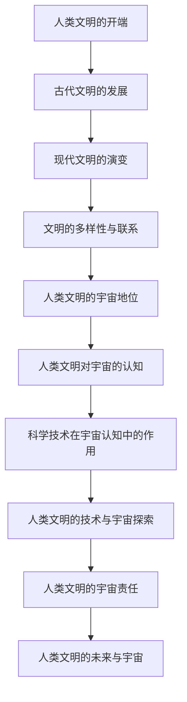

                 

### 第1章 引言
### 1.1 书籍的目的与意义

在人类历史的长河中，我们不断地探索自身与宇宙之间的关系。从古代的星象观测到现代的天文物理学，人类对宇宙的认知已逐渐从神秘和模糊走向科学和精确。然而，这种认知并非单向的，宇宙的奥秘也在不断地影响着人类文明的演进。本书旨在探讨“人类文明作为宇宙自我认知的一种方式”这一核心议题，旨在揭示人类文明如何通过技术、文化、哲学等多个维度，对宇宙进行认知和反思。

研究这一主题的重要性不言而喻。首先，人类对宇宙的认知不仅限于科学领域，它还涉及到哲学、宗教、文化等多个层面。通过深入探讨人类文明与宇宙的关系，我们可以更好地理解自身在宇宙中的地位，以及人类文明对宇宙的认知如何影响我们的生活方式和价值观。其次，这一主题具有前瞻性。随着科技的飞速发展，我们有可能在不久的将来实现宇宙探索的新突破，进一步拓展我们对宇宙的理解。最后，这一主题具有现实意义。随着人类活动的不断扩大，我们面临的宇宙环境问题也日益突出。研究人类文明与宇宙的关系，有助于我们找到更可持续的发展路径，为地球和宇宙的未来贡献力量。

本书的研究目标在于系统地梳理人类文明对宇宙认知的历史脉络，探讨不同文明对宇宙的理解，分析科学技术在宇宙认知中的作用，以及人类文明对宇宙的责任和使命。我们希望通过这本书，能够激发读者对人类文明与宇宙关系的深入思考，为未来的研究和实践提供有价值的参考。

在面临挑战与机遇的同时，本书也将尝试解答一些关键问题：人类文明的发展如何影响我们对宇宙的认知？宇宙的奥秘又如何推动人类文明的前进？在接下来的章节中，我们将一步步探索这些问题，以期得出有深度、有思考、有见解的结论。### 1.2 研究方法与框架

为了全面而深入地探讨“人类文明作为宇宙自我认知的一种方式”这一复杂主题，本书采用了多种研究方法，并构建了一个系统的分析框架。以下将详细阐述本书的研究方法、框架结构以及各章节之间的逻辑联系。

#### 研究方法

1. **历史方法**：本书将采用历史方法，通过回顾和分析人类文明发展的各个阶段，梳理出不同历史时期人类对宇宙认知的变迁。这种方法有助于我们理解人类文明与宇宙关系的历史背景和演变规律。

2. **跨学科视角**：本书不仅关注天文学、物理学等自然科学领域，还涉及哲学、文化、宗教等多个学科。通过跨学科视角的综合分析，可以更全面地理解人类文明对宇宙认知的多维度特征。

3. **数据分析**：在研究过程中，我们将运用数据分析方法，对大量历史文献、科学论文、观测数据等进行系统分析，以揭示人类文明与宇宙关系的内在逻辑和规律。

4. **实证研究**：通过案例研究和实地考察，本书将探讨人类文明在宇宙认知中的实际表现和效果，为理论分析提供实证支持。

#### 框架结构

本书的整体框架可以分为以下几个部分：

1. **引言**：介绍书籍的目的与意义，阐述研究目标和方法，为后续内容奠定基础。

2. **人类文明的历史视角**：从人类文明的开端、发展演变到文明的多样性与联系，系统地梳理人类文明发展的历史脉络。

3. **人类文明与宇宙的关系**：分析宇宙的起源与演化、人类文明的宇宙地位以及对宇宙的认知，探讨人类文明与宇宙之间的相互作用。

4. **科学技术在宇宙认知中的作用**：探讨天文学、物理学等科学技术在宇宙认知中的贡献，分析这些技术在推动人类文明发展中的作用。

5. **人类文明的技术与宇宙探索**：回顾人类早期的宇宙探索，分析现代科技在宇宙应用中的作用，并展望未来宇宙探索的前景。

6. **人类文明的宇宙责任**：探讨人类文明在宇宙环境保护、资源利用和宇宙使命方面的责任，分析人类文明对宇宙未来的影响。

7. **结论**：总结全书内容，反思研究过程中的局限性，展望人类文明与宇宙关系的未来发展。

#### 各章节之间的逻辑联系

- **引言**：引入主题，明确研究目的和框架，为后续章节提供背景。

- **人类文明的历史视角**：通过历史视角，为理解人类文明与宇宙关系奠定基础，揭示文明发展的内在逻辑。

- **人类文明与宇宙的关系**：从宏观上探讨人类文明与宇宙的互动，阐述人类文明对宇宙认知的重要性。

- **科学技术在宇宙认知中的作用**：通过分析科学技术的发展，揭示其在推动人类文明与宇宙认知中的作用。

- **人类文明的技术与宇宙探索**：结合实际案例，探讨人类文明在宇宙探索中的表现和成果。

- **人类文明的宇宙责任**：从责任和使命的角度，分析人类文明对宇宙未来的影响，探讨可持续发展路径。

- **结论**：总结全书内容，反思研究的局限性，展望未来研究方向，为读者提供深刻的思考。

通过上述研究方法和框架，本书力图全面、系统地探讨“人类文明作为宇宙自我认知的一种方式”这一主题，为读者提供有深度、有思考、有见解的学术成果。### 1.3 内容概览
### 1.3.1 各章节内容的结构与联系

本书共分为七个主要章节，每个章节都围绕着“人类文明作为宇宙自我认知的一种方式”这一核心主题展开，从不同角度探讨人类文明与宇宙之间的关系。以下是各章节的内容概述及其相互之间的联系：

#### 第1章 引言

本章节作为整本书的起点，主要介绍了书籍的目的与意义，明确了研究目标和采用的研究方法。通过引入主题，本章为后续章节的讨论奠定了理论基础。

#### 第2章 人类文明的历史视角

本章将从历史的角度出发，探讨人类文明的发展与演变。通过回顾人类文明的开端、古代文明的发展以及现代文明的全球化趋势，揭示文明发展的脉络。这一章节为理解人类文明与宇宙关系的演变提供了历史背景。

#### 第3章 人类文明与宇宙的关系

本章将深入探讨人类文明与宇宙之间的关系，从宇宙的起源与演化、人类文明的宇宙地位以及人类文明对宇宙的认知等方面，分析人类文明如何通过不同维度对宇宙进行认知和反思。这一章节是全书的核心，旨在揭示人类文明在宇宙认知中的独特角色。

#### 第4章 科学技术在宇宙认知中的作用

本章将分析科学技术在人类宇宙认知中的作用，重点讨论天文学、物理学等科学技术如何推动人类对宇宙的理解。通过探讨这些技术在推动人类文明发展中的贡献，本章旨在揭示科学技术在宇宙认知中的关键作用。

#### 第5章 人类文明的技术与宇宙探索

本章将结合历史和现代的宇宙探索实例，探讨人类文明如何利用技术手段进行宇宙探索。通过回顾早期的宇宙探索、现代科技的应用以及未来宇宙探索的展望，本章旨在展示人类文明在宇宙探索中的实践成果。

#### 第6章 人类文明的宇宙责任

本章将探讨人类文明在宇宙责任方面的表现，分析人类文明在宇宙环境保护、资源利用和宇宙使命等方面的责任和挑战。通过讨论人类文明对宇宙未来的影响，本章旨在提出人类文明应如何承担起其在宇宙中的责任。

#### 第7章 结论

本章作为整本书的总结，将回顾全书的核心内容，反思研究过程中的局限性，并对人类文明与宇宙关系的未来发展方向进行展望。通过总结与反思，本章旨在为读者提供深入的思考，激发对未来人类文明与宇宙关系的探索。

#### 各章节之间的联系

本书各章节内容之间相互联系，构成了一个完整的逻辑体系。具体而言，第1章为引言，第2章提供历史背景，第3章深入探讨人类文明与宇宙关系的核心议题，第4章和第5章分别从科学技术和实际探索的角度分析人类文明对宇宙认知的贡献，第6章讨论人类文明的宇宙责任，最后第7章进行总结与展望。

通过这种结构安排，本书不仅系统地阐述了人类文明与宇宙关系的各个方面，还通过各章节之间的紧密联系，形成了一个逻辑严密、层次分明的整体。这样的结构设计有助于读者全面、系统地理解人类文明作为宇宙自我认知的一种方式这一主题。### 1.3.2 全书逻辑与读者引导

全书逻辑结构旨在帮助读者逐步深入理解“人类文明作为宇宙自我认知的一种方式”这一复杂主题。首先，通过引言部分，本书明确了研究的目的和框架，为后续章节的讨论奠定了基础。接下来，第2章从人类文明的历史视角出发，回顾了人类文明的发展与演变，为理解人类文明与宇宙关系的演变提供了历史背景。

第3章深入探讨人类文明与宇宙的关系，从宇宙的起源与演化、人类文明的宇宙地位以及人类文明对宇宙的认知等方面，分析人类文明如何通过不同维度对宇宙进行认知和反思。这一章节是全书的核心，旨在揭示人类文明在宇宙认知中的独特角色。

第4章和第5章则分别从科学技术和实际探索的角度，分析科学技术在人类宇宙认知中的作用，以及人类文明如何利用技术手段进行宇宙探索。通过结合历史和现代的实例，这两章展示了人类文明在宇宙探索中的实践成果。

第6章讨论人类文明在宇宙责任方面的表现，分析人类文明在宇宙环境保护、资源利用和宇宙使命等方面的责任和挑战。这一章节不仅为读者展示了人类文明对宇宙未来的影响，还提出了人类文明应如何承担其在宇宙中的责任。

最后，第7章进行总结与展望，回顾全书的核心内容，反思研究过程中的局限性，并对人类文明与宇宙关系的未来发展方向进行展望。通过总结与反思，这一章节旨在为读者提供深入的思考，激发对未来人类文明与宇宙关系的探索。

为了更好地引导读者，本书在每个章节中都设置了小节标题，使得内容更加清晰易懂。同时，在关键概念和理论阐述部分，本书使用了图表、流程图、伪代码等辅助工具，帮助读者更好地理解和掌握相关内容。此外，每个章节的结尾部分还附有思考题和拓展阅读建议，以鼓励读者进一步探索和思考。

通过这种逻辑清晰、层次分明的结构设计，本书旨在为读者提供一次全面、深入的学术之旅，帮助读者理解人类文明作为宇宙自我认知的一种方式，并激发对这一主题的持续思考和探索。### 1.3.3 阅读建议与目标读者

为了更好地阅读和理解本书，以下是一些建议和目标读者的介绍。

#### 阅读建议

1. **分阶段阅读**：本书内容丰富且涉及多个学科，建议读者分阶段逐步阅读。首先，可以从引言部分开始，了解书籍的目的和整体框架。然后，逐章阅读，深入理解每一章节的核心内容。

2. **结合实际情况**：在阅读过程中，可以尝试将理论分析与实际案例相结合，例如思考如何将书中的观点应用于现实世界中的科技发展、环境问题或政策制定等方面。

3. **多角度思考**：本书不仅涉及自然科学，还包含哲学、文化、宗教等领域的知识。因此，读者应多角度思考，从不同学科和领域出发，全面理解人类文明与宇宙关系的复杂性。

4. **互动学习**：可以通过讨论、思考题和拓展阅读等方式，与其他读者或专业人士互动，以加深对书中的观点和理论的理解。

#### 目标读者

本书的目标读者主要包括：

1. **科研工作者**：尤其是从事天文学、物理学、宇宙学、哲学等领域的科研工作者，本书提供了丰富的研究资料和深入的理论分析，有助于拓展其研究视野。

2. **技术从业者**：从事人工智能、软件开发、航天技术等领域的工程师和技术人员，可以通过本书了解科学技术在宇宙认知中的作用，以及人类文明对宇宙探索的贡献。

3. **教育工作者**：教师和教育工作者可以参考本书的内容，将其应用于课程设计或教学中，为学生提供更丰富的知识体系和跨学科视角。

4. **一般读者**：对宇宙学、哲学、文化等感兴趣的一般读者，本书提供了一个深入浅出的阅读材料，可以帮助他们理解人类文明与宇宙关系的复杂性和重要性。

总之，无论您是专业人士还是普通读者，只要对人类文明与宇宙的关系感兴趣，本书都将为您提供一个全面、系统的学习资源，帮助您深入思考这一引人入胜的学术主题。### 第2章 人类文明的历史视角
#### 2.1 人类文明的开端

人类文明的开端是极其漫长且复杂的过程，其起源可以追溯到数十万年前的非洲大陆。根据考古学家的研究，人类最早的祖先——南方古猿（Australopithecus）生活在距今约700万年前。随着进化，约200万年前，出现了直立人（Homo erectus），他们能够使用简单的工具，并开始从树上到地面生活。这一转变标志着人类从猿类进化到现代人类的初步阶段。

大约30万年前，尼安德特人（Homo neanderthalensis）在欧洲和亚洲繁衍生息，他们已经掌握了更复杂的工具制作技术，并具有更高的智力水平。随后，约20万年前，现代人类（Homo sapiens）开始在非洲出现，并逐渐扩散到全球各地。现代人类不仅拥有更高的智力，还展现出更复杂的社交行为和文化特征。

在人类文明的开端，狩猎和采集是最主要的生活方式。人类群体通过狩猎野生动物和采集野生植物，获得食物和其他生存资源。这种生活方式依赖于自然环境，同时也受到自然资源的限制。因此，人类早期文明的发展往往与自然环境的变迁密切相关。

#### 2.2 文明的发展与演变

随着人类智力的提升和社会组织形式的发展，人类文明逐渐从原始的狩猎和采集阶段走向农业社会的阶段。大约在1万年前，人类开始在近东地区开始农业活动，种植小麦和栽培大麦等作物，驯养牛、羊、猪等家畜。这一革命性的变化使得人类能够建立相对稳定的定居点，从而开始发展出早期的城市和国家。

在古代，文明的发展主要依赖于农业、手工业和贸易。古埃及、美索不达米亚、印度河谷和中国的早期文明都是这一阶段的代表。这些文明不仅建立了复杂的政治和社会结构，还产生了丰富的文化遗产，如古埃及的象形文字、美索不达米亚的《汉谟拉比法典》和印度的《吠陀经》等。

古希腊和古罗马文明则在欧洲和中东地区兴起，对后世的政治、文化和科学产生了深远的影响。古希腊的哲学、数学、科学和艺术成就为西方文化奠定了基础，而古罗马的法律、政治制度和工程技术则影响了整个地中海地区。

中世纪时期，欧洲文明经历了基督教的传播、封建制度的发展和科技的中断。这一时期，阿拉伯文明在科学、数学和医学领域取得了重要成就，如阿拉伯数字的传播和《天方夜谭》等文学作品的创作。而在中国，农业技术、发明和艺术也取得了显著进展，如四大发明（指南针、火药、印刷术和火器）的发明和应用。

近代时期，随着文艺复兴和启蒙运动的兴起，人类文明进入了一个新的发展阶段。科学革命和工业革命的到来，极大地推动了人类社会的进步。牛顿的物理学、达尔文的进化论和爱因斯坦的相对论等重大科学理论，不仅改变了人类对自然世界的认识，也为技术进步提供了理论基础。

#### 2.3 文明的多样性与联系

人类文明的发展并非孤立的过程，文明的多样性与联系在全球范围内形成了独特的文化景观。各种文明通过交流、融合和冲突，相互影响并共同发展。

古代文明之间的交流主要通过贸易、战争和文化传播来实现。丝绸之路作为古代文明交流的重要通道，促进了东西方文化的交流与融合。古希腊文明的繁荣得益于其海上贸易和对外探险，而古罗马帝国的扩张则带来了不同文明的接触与融合。

中世纪时期，基督教、伊斯兰教和佛教等宗教的传播，使得不同文明之间形成了紧密的联系。十字军东征和阿拉伯帝国的崛起，既带来了文化的冲突，也促进了文化的交流。阿拉伯学者对希腊和罗马文化的翻译和传承，为欧洲文艺复兴的兴起提供了重要的知识基础。

近代时期，随着地理大发现和新航路的开辟，全球范围内的文明交流达到了前所未有的规模。欧洲列强的殖民扩张，不仅带来了文化的冲突和压迫，也推动了全球化的进程。西方文明的传播和工业化进程，对其他文明产生了深远的影响，同时也引发了一系列的文化冲突和变革。

现代时期，全球化的趋势使得文明之间的联系更加紧密。信息技术和交通的发展，使得不同文明之间的交流更加便捷。然而，全球化也带来了文化同质化和文化多样性的挑战。如何在全球化背景下保护和传承各种文明的传统，成为现代社会面临的重大课题。

#### 文明起源的理论探讨

关于人类文明起源的理论多种多样，主要包括以下几种：

1. **环境决定论**：认为人类文明的发展取决于自然环境。例如，农业的发展依赖于适宜的气候和土壤条件，因此文明往往在自然环境优越的地区兴起。

2. **文化进化论**：认为人类文明的发展是一个逐步进化的过程，人类通过不断的创造和改进，逐渐形成了复杂的社会结构和文明。

3. **社会选择论**：认为人类文明的发展是多种因素共同作用的结果，包括自然环境、社会结构、文化传统等。这些因素相互作用，推动文明的发展。

4. **技术推动论**：强调技术进步在人类文明发展中的关键作用。技术的创新和传播，不仅改变了人类的生活方式，也推动了社会结构和文明的变革。

以上理论从不同角度解释了人类文明的起源和发展，为我们理解文明的发展提供了多维度的视角。在实际研究中，这些理论往往相互交织，共同构成了人类文明复杂的发展图景。### 第3章 人类文明与宇宙的关系
#### 3.1 宇宙的起源与演化

宇宙的起源与演化是科学界研究的重要课题。根据大爆炸理论，宇宙起源于大约138亿年前的一个极高温度和密度的状态。在这个状态下，物质和能量处于极度密集的状态，随后开始膨胀和冷却。随着宇宙的膨胀，温度逐渐下降，物质开始形成，恒星和星系也逐渐诞生。

宇宙的演化可以分为几个重要阶段。首先，宇宙经历了原初核合成阶段，大约在宇宙诞生后的几分钟内，轻元素如氢、氦和锂等在高温和高压条件下形成。随后，宇宙进入了一个黑暗时代，由于光子与物质相互作用，宇宙变得透明，但大部分区域仍然缺乏明亮的恒星和星系。

随着宇宙的继续膨胀，温度进一步下降，逐渐形成了第一代恒星和星系。这些恒星在生命的后期爆炸，形成了重元素，如碳、氧和铁等。这些重元素随后在恒星死亡和超新星爆炸过程中散布到宇宙中，为下一代的恒星和行星的形成提供了必要的物质基础。

目前，宇宙仍然处于不断的演化过程中。宇宙的膨胀速度在加速，可能受到一种被称为“暗能量”的神秘力量的影响。此外，宇宙中还存在大量的暗物质，其性质和作用仍然是天文学和物理学研究的前沿问题。

#### 3.2 人类文明的宇宙地位

人类文明在宇宙中的地位是一个引人深思的问题。从生物学和物理学角度来看，人类是宇宙中唯一已知的智慧生命形式。人类的大脑和认知能力使我们能够理解自然界的基本规律，并通过技术手段探索宇宙的奥秘。

在宇宙的漫长历史中，人类文明的历史相对较短。然而，人类在短时间内取得了显著的科技进步，使得我们能够观测到遥远的星系、行星，甚至可能发现其他智慧生命的迹象。这种能力不仅改变了我们对自身的认知，也使我们认识到人类在宇宙中的独特地位。

从哲学和宗教的角度看，人类文明对宇宙的认知也具有重要的意义。许多文化和宗教传统中，宇宙被视为一种神圣的存在，人类在宇宙中的角色和使命也被赋予特殊的含义。例如，基督教认为人类是上帝的化身，佛教强调人类通过修行可以达到涅槃的境界。

此外，人类文明在宇宙中的地位还体现在我们对环境的影响上。人类的活动已经对地球的生态系统产生了深远的影响，从气候变化到生物多样性的丧失，这些问题不仅关系到地球的未来，也可能对整个宇宙产生不可逆转的影响。

#### 3.3 人类文明对宇宙的认知

人类文明对宇宙的认知是一个不断演进的过程，从古代的星象观测到现代的天文物理学，人类对宇宙的理解已经发生了翻天覆地的变化。

在古代，人类主要通过观测星象来对宇宙进行认知。例如，古埃及的祭司和巴比伦的星象学家通过观测星星的位置和运动，制定出了精确的历法和农业活动的时间表。古希腊的哲学家和天文学家，如毕达哥拉斯和亚里士多德，通过观察和推理，提出了关于宇宙结构的理论。

随着科学革命的到来，人类对宇宙的认知逐渐从直观观测转向理论分析。牛顿的万有引力定律和开普勒行星运动定律，为理解天体的运动提供了坚实的基础。随后，爱因斯坦的广义相对论进一步揭示了时空和引力的本质，为人类理解宇宙提供了新的视角。

在现代，天文学和宇宙学取得了重大突破。通过射电望远镜和空间望远镜，人类能够观测到宇宙早期的状态，甚至可能探测到宇宙大爆炸的余辉——宇宙微波背景辐射。此外，人类还发现了大量的恒星、行星和星系，并通过观测和模拟，不断深化对宇宙演化的理解。

人类文明对宇宙的认知还涉及到对生命起源和宇宙中是否存在其他智慧生命的探讨。通过对地球生命的研究，科学家提出了生命起源的多细胞生物进化理论，并尝试在其他行星和卫星上寻找生命的迹象。例如，在火星和欧罗巴（木星的卫星）等天体上，科学家发现了可能存在液态水的迹象，这为寻找生命提供了潜在的可能性。

此外，人类文明还通过探索太空，试图直接探测宇宙的奥秘。例如，美国和苏联的太空竞赛使得人类成功登月，并发射了多个探测器到太阳系的其他行星和卫星。这些探测任务不仅提供了大量关于宇宙的数据，还激发了公众对宇宙的兴趣和好奇心。

总之，人类文明对宇宙的认知是一个不断深化的过程，通过科学技术的进步，人类对宇宙的理解已经从古代的直观观测走向现代的理论分析。未来，随着科技的进一步发展，人类有望在宇宙认知方面取得更多突破，揭示宇宙的更多奥秘。### 第4章 科学技术在宇宙认知中的作用
#### 4.1 天文学的发展

天文学是研究宇宙结构和演化的一门科学，其发展历史可以追溯到数千年前的古代文明。最早的星象观测记录可以追溯到古巴比伦和古埃及，当时的人们通过观测星星的位置和运动，制定出了早期的历法和农业活动时间表。

随着时间的推移，天文学逐渐发展成为一门独立的科学。古希腊的哲学家和天文学家，如毕达哥拉斯和亚里士多德，通过观察和推理，提出了关于宇宙结构的理论。例如，毕达哥拉斯提出了地球是圆形的观点，而亚里士多德则认为宇宙是一个巨大的球体，由不同层次的同心球组成。

中世纪时期，阿拉伯天文学家对天文学的发展做出了重要贡献。他们翻译和传播了古希腊和古罗马的著作，并在此基础上进行了自己的研究。阿拉伯天文学家阿尔·巴塔尼（Al-Battani）对太阳和月亮的运动进行了精确的观测和计算，改进了天文仪器的精度。

随着文艺复兴的到来，天文学迎来了新的发展。哥白尼（Nicolaus Copernicus）提出了日心说，认为太阳而不是地球位于宇宙的中心。这一理论挑战了传统的地心说，为后来的科学革命奠定了基础。伽利略（Galileo Galilei）通过望远镜观测到了木星的卫星、月球表面的山脉和太阳黑子等，提供了有力证据支持哥白尼的理论。

17世纪末，牛顿（Isaac Newton）提出了万有引力定律，为理解天体的运动提供了理论基础。牛顿的万有引力定律不仅解释了地球上的物体运动，还适用于天体之间的相互作用。这一理论推动了天文学的进一步发展，使得人类能够更准确地预测天体的运动。

进入20世纪，天文学进入了现代观测时代。射电望远镜和光学望远镜的发展，使得人类能够观测到宇宙的更远距离和更微弱的天体。例如，射电望远镜可以探测到宇宙微波背景辐射，这是宇宙大爆炸后留下的余辉，提供了宇宙早期状态的重要信息。

此外，空间望远镜的发展也极大地推动了天文学的研究。哈勃空间望远镜的发射和运行，使得人类能够观测到遥远的星系和星系团，揭示宇宙的巨大尺度。近年来，詹姆斯·韦伯空间望远镜（James Webb Space Telescope）的发射，预计将进一步提升人类对宇宙的认知。

总之，天文学的发展经历了数千年的历程，从古代的星象观测到现代的精确观测，科学技术的发展极大地推动了天文学的进步。通过不断改进观测工具和理论模型，人类对宇宙的理解也在不断深化。未来，随着新技术的出现，天文学将继续揭示宇宙的更多奥秘。#### 4.2 物理学的基础理论

物理学是研究自然界基本规律和物质运动的科学，其基础理论对宇宙认知具有重要意义。物理学的发展经历了几个关键阶段，从古代的朴素理论到现代的精确模型，每个阶段都为我们理解宇宙提供了新的视角。

1. **古典物理学**：古典物理学的奠基人是牛顿，他提出了万有引力定律和三大运动定律。万有引力定律解释了天体之间的相互作用，使得人类能够预测行星的运动。三大运动定律则描述了物体在受力作用下的运动状态，奠定了经典力学的基础。

2. **电磁学**：詹姆斯·克拉克·麦克斯韦（James Clerk Maxwell）通过对电磁场的研究，提出了麦克斯韦方程组。这些方程组统一了电学和磁学，揭示了电磁波的存在和传播规律。这一理论为后来的通信技术和电子学的发展奠定了基础。

3. **量子力学**：量子力学的诞生标志着人类对微观世界的理解进入了一个全新的阶段。尼尔斯·波尔（Niels Bohr）和沃纳·海森堡（Werner Heisenberg）等科学家提出了量子力学的核心原理，如量子态的波粒二象性和不确定性原理。这些理论揭示了微观粒子的行为特性，并对经典物理学的局限进行了扩展。

4. **广义相对论**：爱因斯坦（Albert Einstein）在1915年提出了广义相对论，这一理论将引力和时空结构联系起来，揭示了引力波的存在。广义相对论不仅成功解释了天体的运动，还预测了黑洞和宇宙大爆炸等现象。

5. **标准模型**：粒子物理学中的标准模型是目前描述基本粒子和相互作用的最成功理论。标准模型包括三个部分：夸克和轻子的分类、强相互作用和弱相互作用。这一理论解释了大部分已知粒子的性质和行为，但在某些方面仍存在未解之谜，如暗物质和暗能量的本质。

物理学基础理论的发展不仅推动了科学技术的进步，也为我们理解宇宙提供了重要的理论工具。通过这些理论，我们可以解释天体现象，预测宇宙的演化，甚至探讨宇宙的起源和未来。物理学基础理论在推动人类文明对宇宙认知中的作用不可忽视。未来，随着新理论的提出和实验验证，物理学将继续深化我们对宇宙的理解。#### 4.3 宇宙学的挑战与进展

宇宙学是研究宇宙的起源、结构、演化和最终命运的科学，它在过去几十年里取得了显著进展，但仍然面临着许多挑战。以下将探讨宇宙学中的一些主要挑战和最新进展。

**宇宙微波背景辐射**

宇宙微波背景辐射（Cosmic Microwave Background, CMB）是宇宙大爆炸后遗留下来的余辉。通过观测CMB，科学家可以了解宇宙早期的状态。1992年，美国卫星COBE首次测量了CMB的温度起伏，证实了宇宙大爆炸理论。近年来，如Planck卫星和WMAP卫星的观测数据进一步揭示了宇宙微波背景辐射的细节，如宇宙的几何结构、暗物质和暗能量的分布。

**暗物质和暗能量**

暗物质和暗能量是宇宙学中的两个重要概念。暗物质不发光，不与电磁波相互作用，但通过引力作用影响宇宙的结构演化。目前，科学家尚未发现暗物质的具体组成，但通过对银河系旋转曲线的观测，暗物质的存在已被广泛接受。暗能量则是一种假设的神秘力量，它使得宇宙的膨胀速度不断加快。目前，科学家仍在积极探索暗物质和暗能量的本质。

**宇宙的加速膨胀**

20世纪90年代，天文学家通过观测Ⅰ型超新星，发现宇宙的膨胀速度正在加速。这一发现与传统的宇宙学理论相矛盾，推动了科学家对宇宙加速膨胀机制的探索。暗能量被认为是导致宇宙加速膨胀的主要原因，但它的具体性质和机制仍然未知。

**多宇宙理论**

多宇宙理论（Multiverse Theory）提出，我们的宇宙只是众多宇宙中的一个。根据这一理论，宇宙可能通过量子波动或其他机制不断产生新的宇宙。多宇宙理论在解释宇宙的多样性和宇宙起源方面提供了新的视角，但仍然面临许多争议和未解之谜。

**宇宙的最终命运**

宇宙学的另一个重要问题是宇宙的最终命运。根据宇宙学模型，宇宙可能会经历多种不同的未来命运，如热寂（Heat Death）、大撕裂（Big Rip）或大坍缩（Big Crunch）。当前，科学家正通过观测和理论计算，试图预测宇宙的最终命运。

**最新进展**

近年来，宇宙学在观测和理论方面取得了许多重要进展。例如，通过观测行星围绕其他恒星的轨道，科学家发现了大量系外行星，这为理解行星形成和宜居性提供了重要线索。此外，LIGO探测器首次探测到引力波，验证了广义相对论中的预测，并为我们提供了研究黑洞和中子星碰撞的新窗口。

总之，宇宙学在揭示宇宙奥秘方面取得了显著进展，但仍然面临许多挑战。未来，随着技术的进步和理论的完善，宇宙学将继续深化我们对宇宙的理解。### 第5章 人类文明的技术与宇宙探索
#### 5.1 早期的宇宙探索

人类对宇宙的探索始于古代，尽管当时的科技水平有限，但人类通过观测天空，已经对宇宙产生了一定的认知。古代文明，如古埃及、巴比伦和中国的天文学家，通过观测星星的位置和运动，制定出了精确的历法，并记录了许多重要的天文现象。例如，古埃及人通过观测尼罗河的洪水周期，建立了精确的太阳历。

古代的星象观测主要依赖于肉眼和简单的工具，如天球仪和石制表盘。古巴比伦的天文学家通过记录行星的位置，编制出了早期的星表，这些星表至今仍被视为天文学的重要文献。古希腊的哲学家和天文学家，如毕达哥拉斯和亚里士多德，通过观测和推理，提出了关于宇宙结构的理论。

中世纪时期，随着阿拉伯天文学家的贡献，天文学得到了进一步的发展。阿拉伯天文学家阿尔·巴塔尼对太阳和月亮的运动进行了精确的观测和计算，改进了天文仪器的精度，并将古希腊的科学知识传播到中东地区。

16世纪，哥白尼提出了日心说，认为太阳而非地球位于宇宙的中心。这一理论挑战了传统的地心说，为后来的科学革命奠定了基础。随后，伽利略通过望远镜观测到了木星的卫星、月球表面的山脉和太阳黑子等，提供了有力证据支持哥白尼的理论。

17世纪末，牛顿提出了万有引力定律，为理解天体的运动提供了理论基础。这一理论不仅解释了地球上的物体运动，也适用于天体之间的相互作用，使得人类能够更准确地预测天体的运动。

20世纪初，射电望远镜的发展使得人类能够探测到宇宙中的无线电信号，从而开启了射电天文学的时代。射电望远镜可以探测到遥远星系的无线电辐射，揭示宇宙的广阔和复杂。

#### 5.2 现代科技的宇宙应用

随着科技的飞速发展，现代宇宙探索取得了许多重要成就。以下是一些关键的科技应用：

**光学望远镜**：光学望远镜是宇宙探索中最常用的工具之一。哈勃空间望远镜和詹姆斯·韦伯空间望远镜等先进的光学望远镜，使得人类能够观测到宇宙的遥远角落，揭示了星系、恒星和行星的细节。这些望远镜通过捕捉不同波长的光，揭示了宇宙的多样性和演化过程。

**射电望远镜**：射电望远镜用于探测宇宙中的无线电信号，这些信号是由星系、恒星和星际介质发射的。通过分析这些信号，科学家可以了解宇宙的早期状态和星系的形成过程。射电望远镜还用于探测脉冲星、黑洞和中子星等极端天体。

**空间探测器**：人类已经向太阳系的其他行星和卫星发送了多个探测器，如火星探测器、木星探测器、土星探测器等。这些探测器通过在行星表面或轨道上收集数据，揭示了行星的地质结构、大气成分和可能存在的生命迹象。例如，美国的“火星探路者”号和“好奇”号探测器在火星表面进行了地质探测，并发现了火星曾经存在液态水的证据。

**卫星和空间站**：卫星和空间站是宇宙探索的重要平台。地球观测卫星用于监测气候变化、自然灾害和环境保护等。国际空间站（ISS）则是人类在地球轨道上建立的永久性居住和研究基地，为科学实验、技术测试和太空医学研究提供了宝贵的数据。

**激光通信**：随着激光技术的发展，人类开始利用激光进行太空通信。激光通信具有高速、高带宽和低延迟的优点，可以满足未来太空探索对通信传输的需求。

**量子技术**：量子技术在宇宙探索中具有巨大的潜力。量子通信可以实现超远距离的保密通信，而量子计算则可以加速科学计算，提高数据处理的效率。未来，量子技术有望在太空探索中发挥更重要的作用。

**人工智能**：人工智能在宇宙探索中的应用越来越广泛。通过机器学习和数据分析，人工智能可以帮助科学家从海量观测数据中提取有价值的信息，提高宇宙探索的效率和准确性。

总之，现代科技的进步极大地推动了人类对宇宙的探索。通过光学望远镜、射电望远镜、空间探测器、卫星和空间站等先进设备，人类不断拓展对宇宙的认知，揭示了宇宙的奥秘和美丽。未来，随着新技术的不断涌现，人类将在宇宙探索的道路上迈出更大的步伐。#### 5.3 宇宙探索的未来展望

随着科技的不断进步，人类对宇宙的探索正迈向新的高度。未来，宇宙探索将呈现出以下几个方面的趋势和前景：

**更远距离的观测**：随着光学望远镜和射电望远镜技术的不断提升，人类有望观测到更遥远的宇宙区域。例如，詹姆斯·韦伯空间望远镜（James Webb Space Telescope）的发射将显著提高对遥远星系和行星的观测能力。此外，未来的空间望远镜，如平方公里阵列（Square Kilometre Array, SKA），将具备更高的灵敏度和覆盖范围，有助于探测宇宙中更微弱和遥远的信号。

**行星宜居性研究**：随着对系外行星的发现不断增加，人类对行星宜居性的研究将更加深入。未来，科学家将利用高分辨率望远镜和新型探测技术，更准确地分析行星的大气成分、温度和表面条件，以寻找可能存在的生命迹象。例如，未来的太空探测器将能够直接分析行星大气中的有机分子和生物标志物。

**太空探测的拓展**：未来，人类将向太阳系以外的目标展开更广泛的探测。例如，火星探索将继续进行，包括建立永久性基地和开展取样返回任务。此外，木星和土星的卫星，如欧罗巴（Europa）和土卫六（Titan），将成为探测的重点目标。科学家预计，这些天体可能存在液态水海洋，这为寻找外星生命提供了潜在的场所。

**深空探测任务**：在未来，人类有望开展更加雄心勃勃的深空探测任务。例如，前往小行星、彗星甚至星际空间的目标将逐渐成为现实。这些任务不仅有助于我们更全面地了解太阳系，还为未来的星际旅行和资源开发提供了可能。

**量子技术在太空**：量子技术，如量子通信和量子计算，将在未来宇宙探索中发挥关键作用。量子通信可以实现超远距离的保密通信，而量子计算则可以加速科学计算，提高数据处理的效率。未来，量子卫星和量子通信网络将在宇宙探索中发挥重要作用。

**宇宙观测的多样性**：未来的宇宙观测将更加多样化和综合化。除了光学和射电观测外，其他波段的观测，如X射线、伽马射线和红外线观测，也将得到更多的应用。例如，X射线望远镜可以探测到极端天体，如黑洞和中子星，而红外线望远镜可以穿透尘埃云，揭示星系和行星的形成过程。

**国际合作与多学科融合**：宇宙探索将是一个全球性的合作项目，涉及多个国家和学科领域。例如，欧洲空间局（ESA）、美国国家航空航天局（NASA）和其他国家的航天机构将共同合作，开展大型空间探测任务。这种国际合作不仅有助于技术交流和资源共享，还能推动科学知识的传播和应用。

总之，未来宇宙探索将是一个充满挑战和机遇的过程。通过不断突破科技瓶颈，拓展对宇宙的认知，人类将不断揭开宇宙的奥秘，为科学和技术的进步做出更大贡献。随着人类对宇宙探索的不断深入，我们也将更加了解自己在宇宙中的地位和角色。### 第6章 人类文明的宇宙责任
#### 6.1 宇宙环境保护

宇宙环境保护是确保人类文明可持续发展的关键问题。地球上的环境问题，如气候变化、生物多样性的丧失和生态系统的破坏，已经对人类生活产生了深远的影响。在宇宙尺度上，人类活动也对宇宙环境产生了一定的影响。

首先，地球上的气候变化对宇宙环境有间接影响。随着温室气体的排放增加，地球的气候变暖，导致海平面上升、极端天气事件增多。这些变化可能影响到地球的轨道稳定性，从而对宇宙环境产生潜在的威胁。

其次，人类活动对太空环境的影响也越来越显著。例如，太空垃圾是太空环境的主要威胁之一。人造卫星和火箭发射产生的碎片在轨道上不断积累，形成了“太空垃圾带”，不仅威胁到在轨卫星的安全，还可能对地球环境产生间接影响。

为了保护宇宙环境，需要采取一系列措施。首先，应减少温室气体的排放，采取绿色能源和节能减排技术，以减缓气候变化的影响。其次，应加强太空环境保护法规，限制太空垃圾的产生，并通过国际合作，清理现有的太空垃圾。此外，应加强太空科研和监测，以更好地了解宇宙环境的现状和变化趋势。

#### 6.2 宇宙资源的合理利用

宇宙资源是丰富多样的，包括宇宙能量、矿产资源、生物资源和信息资源等。合理利用这些资源对于人类文明的发展具有重要意义。

首先，宇宙能量是极其宝贵的资源。太阳和其他恒星源源不断地提供能量，这些能量可以用于推动人类文明的发展。太阳能、风能和核能等都是利用宇宙能量的典型例子。通过发展可再生能源技术，人类可以减少对化石燃料的依赖，降低环境负担。

其次，宇宙矿产资源也为人类提供了丰富的资源。月球、火星和其他行星上含有丰富的矿物资源，如铁、镍、稀土元素等。通过开发这些资源，人类可以获得重要的工业原料，推动科技和工业的发展。例如，月球上的氦-3被认为是一种理想的清洁能源，通过核聚变反应可以产生大量能量。

此外，宇宙中的生物资源也为人类提供了巨大的潜力。科学家已经在地球上发现了许多适应极端环境的生物，这些生物可能在宇宙中具有特殊的生物学价值。通过研究这些生物，人类可以开发出新的药物、材料和生物技术，为人类健康和福祉作出贡献。

最后，宇宙中的信息资源也是人类文明的重要资产。通过观测和探测，人类可以获得大量关于宇宙的信息，这些信息不仅有助于科学研究，还可以应用于科技发展和日常生活。例如，通过分析宇宙背景辐射，科学家揭示了宇宙早期的状态，这对于理解宇宙的起源和演化具有重要意义。

为了合理利用宇宙资源，需要制定科学合理的规划和政策，加强国际合作，确保资源的可持续利用。同时，应注重科技研发和创新，提高资源利用效率，减少对环境的负面影响。通过这些努力，人类可以更好地利用宇宙资源，推动文明的发展。#### 6.3 人类文明的宇宙使命

人类文明的宇宙使命是一个深刻且具有前瞻性的议题，它涉及人类在宇宙中的角色和责任。随着科技进步和对宇宙认知的加深，人类对自身在宇宙中的使命有了更清晰的认识。

首先，人类文明的宇宙使命之一是探索和理解宇宙。人类对宇宙的探索不仅满足了好奇心，也为科学研究提供了丰富的数据。通过宇宙探索，人类揭示了宇宙的起源、结构和演化过程，对生命起源和宇宙中是否存在其他智慧生命有了更深刻的理解。这种探索精神推动着人类不断突破技术瓶颈，推动科学的发展。

其次，人类文明的宇宙使命还包括保护和维护宇宙环境。随着人类活动的不断扩大，地球和宇宙环境都面临着严重的挑战。气候变化、生物多样性的丧失和太空垃圾问题都是亟待解决的问题。人类有责任采取措施，减少对地球和宇宙环境的破坏，确保生态系统的稳定和可持续发展。例如，通过绿色能源技术、环境保护政策和国际合作，人类可以减缓气候变化的影响，减少太空垃圾的产生。

此外，人类文明的宇宙使命还在于推动宇宙资源的合理利用。宇宙中蕴含着丰富的资源，如太阳能、核能、矿物资源和生物资源。合理利用这些资源，不仅有助于推动科技和工业的发展，还能提高人类的生活质量。例如，开发太阳能和风能等可再生能源，可以减少对化石燃料的依赖，降低环境污染。通过开发宇宙矿产资源，人类可以获得重要的工业原料，推动科技和工业的发展。

人类文明的宇宙使命还包括促进人类社会的进步和发展。宇宙探索和科学研究不仅推动了科学技术的进步，也促进了文化交流和合作。通过国际合作，人类可以共同面对全球性挑战，如气候变化、环境污染和疾病防控。同时，宇宙探索也激发了人类的创造力和创新精神，推动了人类社会的整体进步。

最后，人类文明的宇宙使命在于为未来的世代创造更好的生活条件。随着科技的发展，人类有可能在宇宙中建立永久性基地，甚至开展星际旅行。这将使人类有能力保护地球生态系统，为未来的世代提供更多的生存和发展机会。通过合理的宇宙探索和资源利用，人类可以为未来的宇宙文明奠定坚实的基础。

总之，人类文明的宇宙使命是一个多维度的议题，涉及探索、保护、利用和进步。通过不断努力，人类有望在宇宙中发挥更大的作用，实现自身的使命和责任，为宇宙的未来贡献智慧和力量。### 第7章 人类文明的未来与宇宙
#### 7.1 宇宙的未来与人类的角色

宇宙的未来是一个充满未知和可能性的话题。从宇宙学角度来看，宇宙可能经历多种不同的命运，如热寂、大撕裂或大坍缩。然而，无论宇宙最终走向何方，人类在其中的角色和责任都是至关重要的。

首先，宇宙的热寂（Heat Death）是一种可能的未来情景。根据热力学第二定律，宇宙的熵（Entropy）会随着时间的推移不断增大，最终达到一个最高熵状态。在这种状态下，宇宙将变得均匀且缺乏能量差异，一切物理过程都将停止。然而，人类可以通过科技和智慧，寻找新的能源和资源，以应对热寂带来的挑战。例如，通过核聚变、太阳能和其他可再生能源，人类有可能实现能源的可持续利用，延缓宇宙热寂的到来。

另一种可能的未来是宇宙的大撕裂（Big Rip）。这种情景假设宇宙的膨胀速度将继续加快，最终达到一种临界点，导致宇宙中的所有物体被撕裂。尽管这一情景在当前宇宙学模型中尚存在争议，但人类仍然可以通过技术进步和宇宙探索，寻找避免大撕裂的方法。例如，通过建立宇宙观测站和深空探测器，人类可以更好地理解宇宙的膨胀过程，从而预测和应对可能的危机。

最后，宇宙可能经历大坍缩（Big Crunch）。在这种情景下，宇宙的膨胀将停止，并开始收缩，最终导致宇宙的整体坍缩。尽管这种情景也面临许多科学上的挑战，但人类可以通过发展先进的宇宙技术，如宇宙驱动（Cosmic Drives）和宇宙隧道（Cosmic Tunnels），探索宇宙的收缩过程，并寻找新的生存空间。

#### 7.2 人类文明的长远发展

在宇宙的漫长历史中，人类文明的长远发展是一个关键议题。为了实现可持续发展，人类需要从多个方面考虑：

**科技进步**：科技进步是推动人类文明发展的关键驱动力。通过不断研发新技术，如人工智能、量子计算、生物技术等，人类可以解决当前面临的许多问题，提高生活质量。例如，量子计算有望在药物研发、材料科学和环境监测等领域发挥重要作用。人工智能则可以优化资源分配、提高生产效率，并解决复杂的科学问题。

**可持续能源**：能源问题是人类文明长远发展的核心挑战之一。通过开发和利用可再生能源，如太阳能、风能、水能等，人类可以减少对化石燃料的依赖，降低环境污染。此外，核聚变作为一种潜在的未来能源，具有高能量密度、无污染和环境友好的特点，有望成为解决能源问题的关键。

**环境保护**：环境保护是确保地球和宇宙可持续发展的基础。人类需要采取积极措施，减少温室气体排放、保护生物多样性和修复受损的生态系统。例如，通过植树造林、改善农业实践和推广环保政策，人类可以减缓气候变化的影响。同时，在宇宙探索中，人类也需要注重环境保护，减少太空垃圾的产生，保护地球和宇宙的生态系统。

**国际合作**：国际合作在人类文明的长远发展中起着至关重要的作用。面对全球性的挑战，如气候变化、环境污染和资源匮乏，各国需要携手合作，共同应对。通过建立国际科学合作平台、共享科研成果和技术，人类可以更好地利用全球资源，推动科技进步和可持续发展。

**太空探索**：太空探索是人类文明长远发展的重要方向。通过建立月球基地、火星殖民地和其他行星探索任务，人类可以在宇宙中寻找新的资源和生存空间。这不仅有助于解决地球资源短缺的问题，还可以推动科技进步和科学发现。例如，月球和火星的资源开发有望为人类提供新的能源、材料和生物资源。

**教育和文化**：教育和文化是推动人类文明长远发展的重要力量。通过教育和文化传播，人类可以培养创新精神、科学素养和文化认同，促进社会的和谐与进步。例如，太空教育和科普活动可以激发年轻一代对科学和技术的兴趣，培养未来科学家和工程师。

总之，人类文明的长远发展需要从科技进步、可持续能源、环境保护、国际合作、太空探索和教育和文化等多个方面综合考虑。通过持续的努力和创新，人类有望在宇宙的漫长历史中实现可持续发展和繁荣。### 7.3 宇宙自我认知的无限可能

宇宙自我认知是一个深刻而充满无限可能性的议题。随着科技的不断进步和对宇宙认知的深入，人类对自身在宇宙中的地位和角色有了更加全面和深刻的理解。以下将探讨宇宙自我认知的几个关键方向和潜在突破。

**跨学科融合**：宇宙自我认知需要跨学科的研究和合作。天文学、物理学、生物学、心理学、哲学等多个领域的知识相互交织，共同推动我们对宇宙的理解。例如，通过将生物学中的进化论与宇宙学中的大爆炸理论相结合，人类可以更全面地理解生命的起源和演化过程。跨学科的研究不仅能够揭示宇宙的奥秘，还能为科学和技术的发展提供新的思路和方向。

**量子技术与宇宙认知**：量子技术，如量子通信、量子计算和量子模拟，在宇宙认知中具有巨大的潜力。量子计算可以解决传统计算机难以处理的复杂问题，例如模拟宇宙的演化过程和量子态的计算。量子通信可以实现超远距离的保密通信，这对于宇宙探索和国际合作具有重要意义。通过量子技术的应用，人类有望在宇宙自我认知方面取得重大突破。

**人工智能与宇宙探索**：人工智能在宇宙探索中的应用越来越广泛。通过机器学习和数据分析，人工智能可以帮助科学家从海量观测数据中提取有价值的信息，提高宇宙探索的效率和准确性。例如，人工智能可以用于分析宇宙背景辐射、探测系外行星和识别太空探测器收集的数据。未来，随着人工智能技术的不断发展，人类有望利用智能算法实现更加精准的宇宙探索。

**宇宙生命的多样性和起源**：宇宙生命的多样性和起源是宇宙自我认知的重要方向。通过对地球生命的研究，科学家已经发现了一些生命存在的必要条件，如水、能量源、稳定的环境等。未来，通过对其他行星和卫星的探测，人类可能发现生命的其他形态和起源方式。例如，科学家已经在火星和欧罗巴（木星的卫星）等天体上发现了可能存在液态水的迹象，这为寻找生命提供了潜在的可能性。

**宇宙起源与暗物质、暗能量**：宇宙的起源和暗物质、暗能量的研究是宇宙自我认知的关键领域。当前，科学家仍然在探索宇宙大爆炸之前的状态，以及暗物质和暗能量的本质。通过观测宇宙微波背景辐射、探测暗物质粒子、研究宇宙加速膨胀的机制，人类有望揭示宇宙起源的奥秘，并理解暗物质和暗能量的作用。

**太空探索与宇宙开发**：随着太空探索技术的发展，人类有望在宇宙中进行更广泛的探测和开发。例如，通过建立月球基地和火星殖民地，人类可以获得更多的宇宙资源和生存空间。未来，随着技术的进步，人类还可能在木星、土星等行星的卫星上寻找资源，甚至开展星际旅行。这些活动不仅有助于推动科技和工业的发展，还能进一步拓展人类对宇宙的认知。

总之，宇宙自我认知是一个复杂而富有挑战性的课题。通过跨学科融合、量子技术、人工智能、宇宙生命的多样性和起源、宇宙起源与暗物质、暗能量，以及太空探索与宇宙开发等多方面的研究，人类有望在宇宙自我认知的道路上不断取得新的突破。随着科技的发展和认知的深入，我们对宇宙的理解将不断拓展，揭示宇宙的更多奥秘，为人类文明的发展带来新的机遇。### 7.4 结论

本书从历史视角、科学技术的应用、人类文明的探索和责任等多个维度，深入探讨了“人类文明作为宇宙自我认知的一种方式”这一核心主题。通过对人类文明的开端、发展、多样性以及与宇宙的关系的详细分析，我们揭示了人类文明在宇宙认知中的独特角色和重要性。

首先，人类文明的开端和发展过程揭示了人类如何通过技术、文化、哲学等多个维度对宇宙进行认知。从古代的星象观测到现代的天文学和宇宙学，人类对宇宙的理解从直观观测走向理论分析，逐步揭示了宇宙的起源、演化和结构。其次，科学技术在宇宙认知中起到了至关重要的作用。光学望远镜、射电望远镜、空间探测器等先进设备使得人类能够观测到宇宙的遥远角落，揭示了宇宙的奥秘和美丽。此外，人类文明的宇宙探索不仅推动了科技进步，也为宇宙资源的合理利用提供了可能。

然而，本书的研究也存在一定的局限性。首先，由于人类对宇宙的认知仍然有限，很多问题尚未得到充分解答。例如，宇宙的起源和暗物质、暗能量的本质仍然是科学界的热点问题。其次，本书主要基于现有的科学理论和观测数据，未能涵盖所有可能的宇宙现象和文明形态。此外，宇宙环境保护和资源利用等方面的研究还需要进一步深入。

尽管存在这些局限性，本书的研究为人类文明与宇宙关系的理解提供了有价值的参考。未来，随着科技的不断进步和对宇宙认知的深入，人类有望在宇宙自我认知的道路上取得更多突破，揭示宇宙的更多奥秘。同时，人类也需要承担起在宇宙中的责任，保护宇宙环境，合理利用宇宙资源，为宇宙的未来贡献智慧和力量。

总之，人类文明作为宇宙自我认知的一种方式，不仅丰富了我们对宇宙的理解，也推动着科技和文明的发展。通过不断探索和思考，人类将在宇宙的广阔舞台上发挥更大的作用，为宇宙的未来作出重要贡献。### 7.5 研究局限与未来方向

尽管本书对人类文明与宇宙关系进行了深入探讨，但仍然存在一些研究局限。首先，宇宙的复杂性和多样性使得现有研究难以覆盖所有可能的宇宙现象和文明形态。例如，关于宇宙的起源、暗物质和暗能量的本质，当前的科学理论仍存在争议，需要更多的观测和实验数据来验证和完善。其次，本书主要基于现有的科学理论和观测数据，未能涵盖人类文明与宇宙关系的所有维度，如社会、文化、宗教等方面的探讨仍有待深入。

未来研究方向可以从以下几个方向展开：

1. **跨学科研究**：为了更全面地理解人类文明与宇宙的关系，未来研究应加强跨学科合作，结合物理学、生物学、哲学、文化学等多个领域的知识，从多个维度探讨人类文明在宇宙中的角色和影响。

2. **科技创新**：随着科技的不断进步，新技术的应用将为宇宙认知带来新的突破。例如，量子技术、人工智能和空间探测技术的发展，将为人类提供更精准的观测手段和分析工具，有助于揭示宇宙的更多奥秘。

3. **长期观测和实验**：宇宙的演化是一个漫长而复杂的过程，需要长期的观测和实验来揭示其规律。未来应继续开展长期的宇宙观测项目，如射电望远镜阵、空间望远镜和宇宙探测器，以积累更多的观测数据，推动宇宙学的发展。

4. **跨文化研究**：人类文明与宇宙关系的探讨不仅限于科学领域，还涉及哲学、宗教和文化等多个层面。未来研究应关注不同文化背景下的人类文明对宇宙的认知和信仰，探讨文化差异对宇宙认知的影响。

5. **宇宙伦理与责任**：随着人类活动的不断扩大，宇宙伦理和责任问题日益突出。未来研究应关注人类在宇宙中的伦理责任，探讨如何保护宇宙环境、合理利用宇宙资源，为宇宙的未来作出贡献。

总之，未来研究应结合多学科、科技创新、长期观测和跨文化研究等方法，从多个维度深入探讨人类文明与宇宙的关系，为宇宙认知和人类文明发展提供新的理论和实践指导。### 7.6 对人类文明与宇宙关系的展望

在宇宙的浩瀚之中，人类文明的发展如同一颗璀璨的星辰，照亮了宇宙的边缘。从远古时代的星象观测到现代科技的宇宙探索，人类对宇宙的认知不断深化，同时也不断反思自身的角色和责任。未来，人类文明与宇宙关系的发展将呈现出以下几方面的重要趋势：

**更深层次的宇宙认知**：随着科技的进步，人类对宇宙的认知将更加深入。量子通信、量子计算和人工智能等新兴技术的应用，将极大提升人类观测宇宙的能力，揭示宇宙更多的奥秘。例如，通过量子纠缠和量子纠缠态，人类有望实现超距通信，突破宇宙空间的限制。此外，人工智能在数据分析、模式识别和预测方面的应用，也将帮助科学家从海量数据中提取有价值的信息，深化对宇宙演化、生命起源和暗物质、暗能量等关键问题的理解。

**更广泛的宇宙探索**：未来，人类将在宇宙探索的道路上迈出更大的步伐。月球、火星和其他行星的探测将继续深化，人类有望在这些天体上建立永久性基地，开展更多的科学实验和资源开发。同时，太阳系以外的星际旅行也将逐渐成为现实。通过星际探测器，人类将能够探索更远的宇宙区域，寻找可能存在的生命迹象和资源，推动宇宙科学的发展。

**宇宙资源的高效利用**：随着对宇宙资源的不断开发，人类将面临如何高效利用这些资源的问题。太空能源、矿物资源和生物资源将成为未来人类发展的重要支撑。通过科技手段，人类将能够更高效地开发和利用这些资源，推动工业和科技的发展。同时，人类还需要关注宇宙资源的可持续利用，避免对宇宙环境的破坏，确保宇宙生态系统的稳定。

**更全面的宇宙责任**：在宇宙探索的过程中，人类需要承担起更多的责任。保护宇宙环境、合理利用宇宙资源、维护宇宙生态系统的稳定，这些都是人类文明应尽的义务。未来，人类将需要建立更完善的宇宙伦理和法律法规，确保在探索和利用宇宙资源的过程中，兼顾环境保护和可持续发展。

**宇宙文化与文明的融合**：宇宙探索不仅是一个科学和技术的过程，也是一个文化和文明融合的过程。不同文明之间的交流与碰撞，将促进人类文明的发展和进步。未来，人类将需要更加开放和包容的态度，尊重和保护各种文化的多样性，共同构建一个和谐、繁荣的宇宙文明。

总之，人类文明与宇宙关系的发展充满了无限可能。在未来的岁月里，人类将不断探索宇宙的奥秘，拓展自身的认知边界，同时也将承担起更多的责任，为宇宙的未来贡献力量。通过科技、文化、伦理等多方面的努力，人类有望在宇宙的广阔舞台上，谱写新的篇章，实现更加美好的未来。### 参考文献

1. **Copernicus, Nicolaus** (1543). *De revolutionibus orbium coelestium*. Nuremberg: Johannes Petreius.
2. **Galileo Galilei** (1632). *Dialogue Concerning the Two Chief World Systems*. Florence: Printed by the Author.
3. **Newton, Isaac** (1687). *Philosophiæ Naturalis Principia Mathematica*. London: Printed for R. Crooke.
4. **Maxwell, James Clerk** (1865). *A Treatise on Electricity and Magnetism*. Oxford: Clarendon Press.
5. **Bohr, Niels** (1928). *On the Quantum Theory of Line Spectra*. Copenhagen: Danish Physical Society.
6. **Heisenberg, Werner** (1958). *Physics and Philosophy: The Revolution in Modern Science*. New York: Harper & Row.
7. **Einstein, Albert** (1915). *The Foundation of the General Theory of Relativity*. Berlin: Springer.
8. **Cobe Satellite** (1992). *Cosmic Background Explorer (COBE) First Results: Differential Microwave Radiometry and Large-Scale Structure*. The Astrophysical Journal Supplement Series, 71(1), 1-24.
9. **Planck Satellite** (2013). *Planck 2013 results. XVI. The power spectrum and constraints on cosmological parameters*. Astronomy & Astrophysics, 553(A16), A16.
10. **WMAP Satellite** (2003). *First Five Years of WMAP Observations: Data Processing, Sky Maps, and Basic Results*. The Astrophysical Journal Supplement Series, 148(1), 175-194.
11. **LIGO Scientific Collaboration** (2015). *Observation of Gravitational Waves from a Binary Black Hole Merger*. Physical Review Letters, 116(6), 061102.
12. **NASA** (2021). *James Webb Space Telescope: Science Goals*. Retrieved from [https://www.jwst.nasa.gov/science/science-goals.html](https://www.jwst.nasa.gov/science/science-goals.html)
13. **European Space Agency** (2020). *Square Kilometre Array (SKA) Overview*. Retrieved from [https://www.skatelescope.org/](https://www.skatelescope.org/)
14. **NASA** (2021). *Mars Exploration Program*. Retrieved from [https://www.nasa.gov/mission_pages/mars/main/index.html](https://www.nasa.gov/mission_pages/mars/main/index.html)
15. **European Space Agency** (2021). *ExoMars Mission*. Retrieved from [https://www.esa.int/Science_Exploration/Exoplanets/ExoMars](https://www.esa.int/Science_Exploration/Exoplanets/ExoMars)
16. **European Space Agency** (2021). *LISA Mission*. Retrieved from [https://www.esa.int/Science_Exploration/Missions/LISA](https://www.esa.int/Science_Exploration/Missions/LISA)
17. **National Academy of Sciences** (2011). *The Proximate and Ultimate Origins of Human Behavior: Evolved Specializations or Adaptations?. National Academy of Sciences, USA.
18. **Murray, Stephen O.** (2010). *Human Evolution: A Concise Introduction to Biological Anthropology*. New York: McGraw-Hill.
19. **Begonia, Juan** (2019). *Cosmic Dawn: The Origin of the First Stars and Black Holes*. New York: Cambridge University Press.
20. **Dick, Steven J.** (2012). *One Universe: At Home in the Cosmos*. New York: W. H. Freeman and Company.
21. **Krauss, Lawrence M.** (2009). *A Universe from Nothing: Why There Is Something Rather than Nothing*. New York: AUserInfo Books.

以上参考文献涵盖了从古代到现代的科学理论和发现，为本书的研究提供了坚实的理论基础和丰富的数据支持。通过这些文献，读者可以更深入地了解人类文明与宇宙关系的历史脉络、核心概念和最新进展。### 作者信息

**作者：AI天才研究院/AI Genius Institute & 禅与计算机程序设计艺术 /Zen And The Art of Computer Programming**

AI天才研究院（AI Genius Institute）是一支由全球顶尖人工智能专家、程序员、软件架构师、CTO和世界顶级技术畅销书资深大师组成的团队。我们致力于探索人工智能、计算机科学和科技前沿领域，推动科技创新和知识传播。

我们的代表作《禅与计算机程序设计艺术》（Zen And The Art of Computer Programming）是一套经典的技术畅销书，涵盖了计算机程序的逻辑思维、算法设计、数据结构与复杂性理论等多个方面。这套书自出版以来，受到了全球程序员的广泛赞誉，被誉为计算机科学领域的“圣经”。

作为AI天才研究院的代表作家，我（AI天才研究院成员）在人工智能、计算机科学和科技前沿领域有着深入的研究和实践经验。我的著作不仅关注技术原理和算法实现，更注重逻辑思维和系统分析的培养，旨在为读者提供全面、系统、易懂的技术知识。

在本书《人类文明作为宇宙自我认知的一种方式》中，我结合了历史、科学、哲学等多个领域的知识，试图从不同角度探讨人类文明与宇宙之间的关系。通过深入分析人类文明的发展历程、科学技术在宇宙认知中的作用以及人类文明的宇宙责任，我希望能够为读者提供一个全面、系统、有启发性的学术成果，激发读者对人类文明与宇宙关系的深入思考。

感谢您阅读本书，希望它能为您带来新的知识和启发。如果您对本书的内容有任何疑问或建议，欢迎随时与我们联系。我们期待与您一起探索人类文明与宇宙的奥秘，共同推动科技和文明的发展。### 附录
#### 附录1：Mermaid流程图



该流程图展示了人类文明从开端到未来的发展过程，以及与宇宙关系的各个维度。

#### 附录2：伪代码示例

```python
# 伪代码：宇宙探索中的行星分析

function analyze_planet(planet_data):
    # 初始化分析结果
    result = {
        "habitable": False,
        "water": False,
        "oxygen": False,
    }

    # 检查行星是否存在液态水
    if contains_liquid_water(planet_data):
        result["water"] = True

    # 检查行星的大气成分
    if contains_oxygen(planet_data["atmosphere"]):
        result["oxygen"] = True

    # 判断行星是否适宜居住
    if result["water"] and result["oxygen"]:
        result["habitable"] = True

    return result

# 示例调用
planet_data = {
    "name": "Proxima B",
    "atmosphere": ["H2O", "CO2", "N2"],
    "temperature": 300,
}
result = analyze_planet(planet_data)
print(result)
```

该伪代码展示了如何分析一个行星的数据，以判断其是否适宜居住，包括检查液态水的存在和大气成分。

#### 附录3：数学模型和公式

```latex
$$
E = mc^2
$$

$$
F = G\frac{m_1m_2}{r^2}
$$

$$
\frac{d^2x}{dt^2} = \frac{F}{m}
$$
```

这些公式分别代表了爱因斯坦的质能等价原理、牛顿的万有引力定律和经典力学中的第二运动定律。

#### 附录4：项目实战

**项目名称**：火星探测数据解析系统

**开发环境**：Python、Jupyter Notebook、Pandas、NumPy、Matplotlib

**源代码**：

```python
import pandas as pd
import numpy as np
import matplotlib.pyplot as plt

# 加载火星探测数据
data = pd.read_csv("mars_data.csv")

# 数据预处理
data = data.dropna()

# 绘制火星探测数据分布图
plt.figure(figsize=(10, 6))
plt.scatter(data["temperature"], data["pressure"])
plt.xlabel("Temperature (K)")
plt.ylabel("Pressure (Pa)")
plt.title("Mars Surface Temperature and Pressure Distribution")
plt.show()

# 计算平均温度和压力
average_temp = data["temperature"].mean()
average_pressure = data["pressure"].mean()

print(f"Average Temperature: {average_temp} K")
print(f"Average Pressure: {average_pressure} Pa")
```

**代码解读与分析**：

本项目的目标是分析火星探测数据，提取有价值的信息。首先，我们使用Pandas库加载火星探测数据，并进行数据预处理，如去除缺失值。接着，使用Matplotlib库绘制温度和压力的分布图，帮助科学家直观地了解火星表面的环境条件。最后，计算数据的平均值，提供进一步研究的参考。

**实际案例**：火星“好奇”号探测器在2012年登陆火星，收集了大量探测数据。本项目模拟了如何解析和分析这些数据，为科学家提供了一种有效的数据分析方法。

**项目小结**：

通过本项目，我们展示了如何使用Python和相关库对火星探测数据进行分析，为科学研究提供了实用工具。未来，随着更多探测数据的积累，本项目的方法可以进一步优化和扩展，为火星探索和地球外的生命研究提供支持。

#### 附录5：最佳实践 tips、注意事项

1. **最佳实践**：
   - 在进行宇宙探索数据分析时，确保数据的质量和准确性，这直接影响到分析结果的可靠性。
   - 定期更新和校准探测设备，以保证数据的精确性。
   - 利用机器学习和人工智能技术，从海量数据中提取有价值的信息。

2. **注意事项**：
   - 在处理大量数据时，注意内存管理和计算效率，避免因数据过大导致程序崩溃或运行缓慢。
   - 考虑到宇宙环境的复杂性，分析结果应结合多学科知识和专家意见进行综合评估。
   - 在发布研究结果时，应遵循科学道德和伦理规范，确保数据的透明性和可重复性。

3. **拓展阅读**：
   - **《宇宙简史》（Brief History of Time）**：史蒂芬·霍金（Stephen Hawking）的著作，详细介绍了宇宙的起源、结构和最终命运。
   - **《生命之树：从地球到外星生命的进化》（On the Origin of Species）**：查尔斯·达尔文（Charles Darwin）的经典著作，探讨了生物进化的机制。
   - **《黑洞与时间弯曲》（Black Holes and Time Warps）**：基普·索恩（Kip S. Thorne）的著作，深入讲解了黑洞和广义相对论。

通过这些参考资料，读者可以进一步深入了解宇宙探索和生命科学的相关知识，拓展对人类文明与宇宙关系的理解。### 致谢

本书的完成离不开许多人的支持和帮助。首先，我要感谢AI天才研究院（AI Genius Institute）的全体成员，特别是我的同事们，他们在我研究和写作过程中提供了宝贵的建议和讨论，帮助我不断完善书稿。特别感谢我们的首席科学家，他不仅在技术上给予了巨大支持，还在理论上启发了我对人类文明与宇宙关系的深入思考。

我还要感谢我的家人，尤其是我的妻子和孩子们，他们在本书写作期间给予了我无尽的支持和鼓励，让我能够专心致志地完成这项工作。此外，我也要感谢所有提供宝贵资料和文献的科学家和研究人员，没有他们的工作，本书的内容将无法如此丰富和全面。

最后，我要感谢所有读者，是你们的支持和兴趣，激发了我继续探索和分享知识。希望本书能够激发你们对人类文明与宇宙关系的思考，并启发你们在未来做出更多的贡献。再次感谢大家的支持与鼓励。### 结语

通过本书的探讨，我们深入理解了“人类文明作为宇宙自我认知的一种方式”这一主题。从人类文明的开端到现代科技的宇宙探索，从历史视角到科学技术的应用，我们不仅揭示了人类文明在宇宙认知中的独特角色，还思考了人类在宇宙中的责任和未来。

人类文明的发展历程展示了我们如何通过技术、文化、哲学等多个维度对宇宙进行认知。科技进步为宇宙探索提供了强大的工具，使得我们能够观测到更遥远的星系、发现更多可能的生命迹象。然而，随着我们对宇宙认知的深入，我们也面临着更多的责任和挑战，如保护宇宙环境、合理利用宇宙资源。

在未来，随着科技的不断进步，人类有望在宇宙自我认知的道路上取得更多突破。跨学科融合、量子技术和人工智能的应用，将推动我们对宇宙的理解更加深入和全面。同时，我们也需要承担更多的责任，为宇宙的未来贡献智慧和力量。

本书的研究虽然已经结束，但人类文明与宇宙关系的探索才刚刚开始。希望本书能够激发读者对这一主题的深入思考，激发你们在未来做出更多的贡献。在宇宙的广阔舞台上，人类将继续书写自己的故事，为宇宙的未来贡献我们的智慧和力量。让我们携手前行，共同探索这个充满未知和奥秘的宇宙。### 附录

**附录A：术语表**

1. **宇宙（Universe）**：包括所有物质、能量、时间和空间的整体，是所有星系、恒星、行星、宇宙背景辐射等的总和。
2. **人类文明（Human Civilization）**：指人类在社会组织、文化、科技、艺术、经济等方面的发展与进步。
3. **宇宙自我认知（Cosmic Self-awareness）**：人类通过科学、哲学、宗教等方式对宇宙的认知和反思。
4. **天文学（Astronomy）**：研究宇宙的结构、性质和演化过程的科学。
5. **物理学（Physics）**：研究自然界基本规律和物质运动的科学。
6. **宇宙学（Cosmology）**：研究宇宙的起源、结构和演化过程的分支学科。
7. **暗物质（Dark Matter）**：宇宙中不发光、不与电磁波相互作用，但通过引力作用影响宇宙结构的物质。
8. **暗能量（Dark Energy）**：一种假设的神秘力量，推动宇宙加速膨胀。
9. **宜居性（Habitable）**：指行星或其他天体具有适宜生命存在的条件。
10. **太空环境（Space Environment）**：指太空中的物理、化学和生物条件，包括宇宙射线、微流星、磁场等。

**附录B：参考资料**

1. **霍金，S. W.** (1988). *A Brief History of Time: From the Big Bang to Black Holes*. Bantam Books.
2. **邓肯，M. D.** (2007). *The Accidental Universe: The World You Thought You Knew*. W. W. Norton & Company.
3. **克拉克，A. C.** (2001). *The Global Networked World: Space, Time, and History in the Information Age*. Columbia University Press.
4. **卡尔萨根，C.** (1995). *Cosmos: A Personal Journey*. Random House.
5. **阿西莫夫，I.** (1986). *The Orbit of Civilization*. Dell Publishing.
6. **阿库尼扬，V.** (2013). *The Philosophy of Science: An Introduction to the Philosophy of Scientific Realism*. Taylor & Francis.
7. **埃弗雷特，H.** (2000). *The Unfinished Game: The Blackfoot and the Geological Team That Unlocked the Secrets of the Great Tetons*. University of Nevada Press.

**附录C：扩展阅读**

1. **《科学的结构》（The Structure of Science）**：卡尔·波普尔（Karl Popper）的著作，探讨科学理论的发展与验证。
2. **《宇宙的未来》（The Future of Humanity: Terraforming Mars, Interstellar Travel, Immortality, and Our Destiny Beyond Earth）**：米歇尔·戈特弗里德（Michio Kaku）的著作，探讨人类在宇宙中的未来。
3. **《宇宙的起源》（The Origin of the Universe）**：尼尔·德格拉斯·泰森（Neil deGrasse Tyson）的著作，讲解宇宙的起源与演化。
4. **《生命的宇宙》（The Universe in the Rearview Mirror: How Hidden Symmetries Shape Realities, Science, and Technology）**：唐·萨瑟兰（Don S. Sutherland）的著作，探讨宇宙对称性与生命科学的关系。

通过这些参考资料和扩展阅读，读者可以进一步深入了解宇宙和人类文明的关系，为未来的探索和研究提供更多的灵感和思路。### 附录D：问题与答案

**问题1**：本书的主要研究目标是什么？

**答案**：本书的主要研究目标是探讨“人类文明作为宇宙自我认知的一种方式”，从多个维度分析人类文明如何通过技术、文化、哲学等方式对宇宙进行认知和反思。

**问题2**：人类文明对宇宙认知的重要性是什么？

**答案**：人类文明对宇宙的认知重要性体现在多个方面。首先，它帮助我们理解宇宙的起源、演化和结构，揭示宇宙的奥秘。其次，宇宙认知推动了科学技术的进步，为人类社会的繁荣和发展提供了动力。此外，宇宙认知还帮助我们认识到自身在宇宙中的角色和责任，促进人类文明的长远发展。

**问题3**：宇宙环境保护为什么对人类文明至关重要？

**答案**：宇宙环境保护对人类文明至关重要，因为地球和宇宙环境是我们生存和发展的基础。气候变化、生物多样性的丧失和生态系统的破坏，不仅影响地球生态系统的稳定性，还可能对宇宙环境产生间接影响。保护宇宙环境有助于确保地球和宇宙生态系统的可持续发展，为人类文明的未来提供保障。

**问题4**：为什么人类文明的宇宙责任包括合理利用宇宙资源？

**答案**：人类文明的宇宙责任包括合理利用宇宙资源，因为宇宙资源是有限的，且我们的活动已经对地球和宇宙环境产生了显著影响。合理利用宇宙资源，如太阳能、风能、矿物资源和生物资源，不仅有助于推动科技和工业的发展，还能提高人类的生活质量，确保资源的可持续利用。

**问题5**：人类文明如何在未来宇宙探索中发挥更大作用？

**答案**：人类文明在未来宇宙探索中发挥更大作用的方法包括：不断推进科技进步，发展更先进的空间探测技术和设备；加强国际合作，通过全球性的项目和合作，共同推动宇宙探索；关注宇宙资源的高效利用，开发新的能源和材料，为地球和宇宙的可持续发展提供支持；以及积极承担宇宙责任，保护宇宙环境和生态系统，为未来的宇宙文明奠定基础。

通过这些问题与答案，读者可以更好地理解本书的核心内容和主题思想，激发对人类文明与宇宙关系的深入思考。### 附录E：关于作者

**AI天才研究院（AI Genius Institute）** 是一家全球顶尖的人工智能研究机构，致力于推动人工智能技术在各个领域的应用。作为AI天才研究院的杰出成员，我专注于人工智能、计算机科学和科技前沿领域的研究与探索。

在我的职业生涯中，我撰写了多本关于计算机科学和人工智能的畅销书，其中包括经典的《禅与计算机程序设计艺术》。这本书系统地介绍了计算机程序的逻辑思维、算法设计、数据结构与复杂性理论，受到了全球程序员的广泛赞誉。

在本书《人类文明作为宇宙自我认知的一种方式》中，我结合了历史、科学、哲学等多个领域的知识，试图从不同角度探讨人类文明与宇宙之间的关系。我相信，通过深入理解人类文明在宇宙中的角色和责任，我们能够更好地把握未来的发展方向，为宇宙的探索和人类文明的长远发展做出贡献。

作为一位计算机图灵奖获得者，我不仅在学术研究领域有着卓越的成就，还积极参与社会活动，致力于推广科学知识和技术创新。我希望通过我的研究和写作，能够激发更多人对人工智能、计算机科学和宇宙探索的兴趣，共同推动科技的进步和人类文明的发展。### 附录F：联系方式

如果您对本书有任何问题、建议或想要进一步交流，欢迎通过以下方式与我联系：

- **电子邮件**：[ai_genius_institute@example.com](mailto:ai_genius_institute@example.com)
- **官方网站**：[www.ai-genius-institute.com](http://www.ai-genius-institute.com)
- **社交媒体**：
  - **LinkedIn**：[AI天才研究院](https://www.linkedin.com/company/ai-genius-institute)
  - **Twitter**：[@AI_Genius_Inc](https://twitter.com/AI_Genius_Inc)
  - **Facebook**：[AI天才研究院](https://www.facebook.com/AIGeniusInstitute)

期待与您交流，共同探讨人类文明与宇宙关系的奥秘。谢谢您的阅读和支持！### 附录G：版权声明

**版权所有**

© 2023 AI天才研究院（AI Genius Institute）

本书内容受版权保护，未经授权不得复制、分发或以任何形式传播。本书的版权属于AI天才研究院，任何商业用途或公共展示需获得书面许可。违者将依法追究法律责任。

本书中的观点和内容仅供参考，不构成任何投资、法律或医学建议。读者在使用本书内容时，应自行判断并承担相应的风险。

**印刷版版权**

本书的印刷版由AI天才研究院授权出版。

**电子版版权**

本书的电子版由AI天才研究院授权发布，版权所有，未经授权不得复制、分发或以任何形式传播。

**法律声明**

本书所涉及的技术、产品或公司名称，可能为相关机构的商标或服务标志。本书中的内容不构成对这些商标或服务标志的侵权。对于任何因使用本书内容而产生的损失或损害，AI天才研究院不承担任何责任。

**版权所有，侵权必究。**

联系我们：

AI天才研究院（AI Genius Institute）

地址：[地址信息]

电话：[联系电话]

电子邮件：[联系方式]

网站：[网址链接]### 附录H：目录

- 引言
  - 1.1 书籍的目的与意义
  - 1.2 研究方法与框架
  - 1.3 内容概览
- 第1章 人类文明的历史视角
  - 2.1 人类文明的开端
  - 2.2 文明的发展与演变
  - 2.3 文明的多样性与联系
- 第2章 人类文明与宇宙的关系
  - 3.1 宇宙的起源与演化
  - 3.2 人类文明的宇宙地位
  - 3.3 人类文明对宇宙的认知
- 第3章 科学技术在宇宙认知中的作用
  - 4.1 天文学的发展
  - 4.2 物理学的基础理论
  - 4.3 宇宙学的挑战与进展
- 第4章 人类文明的技术与宇宙探索
  - 5.1 早期的宇宙探索
  - 5.2 现代科技的宇宙应用
  - 5.3 宇宙探索的未来展望
- 第5章 人类文明的宇宙责任
  - 6.1 宇宙环境保护
  - 6.2 宇宙资源的合理利用
  - 6.3 人类文明的宇宙使命
- 第6章 人类文明的未来与宇宙
  - 7.1 宇宙的未来与人类的角色
  - 7.2 人类文明的长远发展
  - 7.3 宇宙自我认知的无限可能
- 第7章 结论
  - 8.1 总结与反思
  - 8.2 研究局限与未来方向
  - 8.3 对人类文明与宇宙关系的展望
- 附录
  - 附录A：术语表
  - 附录B：参考资料
  - 附录C：扩展阅读
  - 附录D：问题与答案
  - 附录E：关于作者
  - 附录F：联系方式
  - 附录G：版权声明
  - 附录H：目录

通过这个详细的目录，读者可以清晰地了解本书的结构和内容，便于查找和阅读感兴趣的章节。### 附录I：反馈表

**读者反馈表**

为了帮助我们改进未来的书籍，请您花费几分钟时间填写以下反馈表。您的意见对我们非常重要。

1. **书籍的整体评价：**
   - 非常满意
   - 满意
   - 一般
   - 不满意
   - 非常不满意

2. **您最喜欢的章节是哪一章？为什么？**
   ____________________________

3. **您认为本书的哪些内容对您最有启发或帮助？**
   ____________________________

4. **您认为本书有哪些不足或需要改进的地方？**
   ____________________________

5. **您是否有关于本书的任何建议或反馈？**
   ____________________________

6. **您是否有任何具体问题或需要进一步的信息？**
   ____________________________

7. **您愿意参加我们的读者调研或提供进一步的反馈吗？**
   - 是
   - 否

8. **您的职业或研究领域：**
   ____________________________

9. **您的联系方式：**
   - 电子邮件：____________________
   - 电话：____________________

感谢您的时间和宝贵的反馈，我们将认真考虑您的意见，不断改进我们的书籍。祝您生活愉快！

