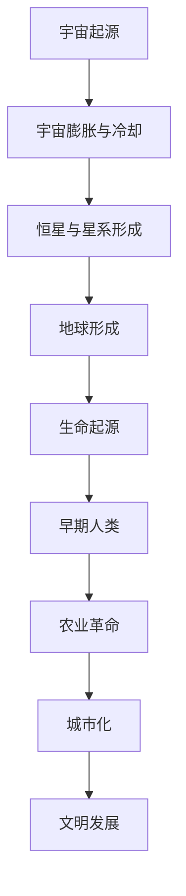
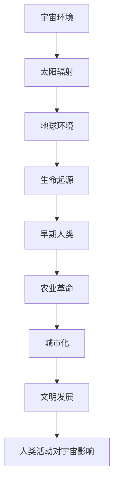
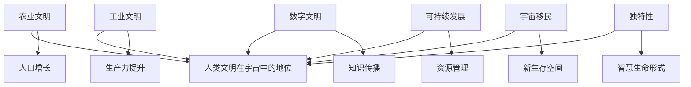

                 

### 文章标题：人类文明在宇宙演化中的意义和地位

在浩瀚的宇宙中，人类文明如同一粒微尘，它的存在与演化无疑对宇宙本身有着深远的影响。本文旨在探讨人类文明在宇宙演化中的意义和地位，从宇宙的起源、人类文明的发展到宇宙与文明的相互作用，逐步分析推理，以期揭示人类文明在宇宙演化中的独特角色。

> **关键词：** 宇宙演化、人类文明、相互作用、意义与地位、可持续发展、宇宙移民

> **摘要：** 本文首先介绍了宇宙的起源和人类文明的发展历程，接着讨论了宇宙环境对文明的影响以及文明对宇宙的反馈。通过分析人类文明在宇宙中的地位，本文探讨了人类文明可持续发展的路径，并展望了宇宙探索和文明未来的可能性。

### 目录

1. **宇宙的起源与人类文明的兴起**
    - 1.1 宇宙的起源
    - 1.2 人类文明的起源

2. **宇宙环境与人类文明**
    - 2.1 宇宙环境对文明的影响
    - 2.2 文明对宇宙的影响

3. **人类文明在宇宙中的地位**
    - 3.1 文明的发展阶段
    - 3.2 文明的可持续发展
    - 3.3 文明的未来展望

4. **结论**

5. **拓展阅读**

---

### 宇宙的起源与人类文明的兴起

宇宙的起源是一个极为复杂的过程，目前科学界普遍接受的理论是大爆炸理论。根据这一理论，宇宙起源于大约138亿年前的一个“奇点”，随后经历迅速的膨胀和冷却，逐渐形成了星系、恒星和行星。

#### 1.1 宇宙的起源

**大爆炸理论：** 大爆炸理论认为，宇宙从一个极热、极密的状态开始膨胀，温度和密度随着时间逐渐降低。这一过程中，宇宙背景辐射（Cosmic Microwave Background Radiation）是支持大爆炸理论的强有力证据。

**宇宙背景辐射：** 宇宙背景辐射是宇宙早期遗留下来的热辐射，其温度约为2.7开尔文，遍布整个宇宙空间。它是宇宙大爆炸理论的直接证据之一。

#### 1.2 人类文明的起源

与宇宙的宏大演化相比，人类文明的起源显得相对简单。大约在300万年前，人类祖先开始出现在地球上。经过长时间的进化，人类逐渐发展出智慧，并开始制造工具、建立社会组织。

**早期人类：** 早期人类（Homo habilis、Homo erectus等）开始使用简单的工具，并逐渐学会了使用火。

**农业革命与城市化：** 农业革命（约1万年前）是人类文明发展的重要转折点，它使得人类能够定居并建立复杂的农业社会。城市化进程随之开始，人类社会逐渐从以狩猎采集为主转变为以农业为主。

### 核心概念与联系

为了更好地理解宇宙演化与人类文明的关系，我们可以用Mermaid流程图来展示这些核心概念之间的联系：

### 宇宙环境与人类文明

宇宙环境对人类文明的发展有着重要影响。同时，人类文明的活动也在不断改变宇宙的环境。

#### 2.1 宇宙环境对文明的影响

**太阳对地球的影响：** 太阳是地球生命存在的基础，它提供了光和热。太阳的辐射强度和周期性变化对地球气候和环境有着深远的影响。

**地球环境对文明的影响：** 地球的环境条件，如大气成分、水的存在和温度适宜性，直接影响了生命的演化和文明的发展。

#### 2.2 文明对宇宙的影响

**人类活动对地球环境的影响：** 人类活动导致了大气污染、土地破坏和气候变化等问题，这些变化对地球生态系统和人类文明产生了重大影响。

**人类向宇宙的探索：** 人类通过航天技术探索宇宙，如发射卫星、探测器和星际探测器，这些活动不仅扩展了人类对宇宙的认识，也可能对宇宙环境产生影响。

### 核心概念与联系

为了展示宇宙环境与人类文明之间的核心概念和联系，我们可以使用以下Mermaid流程图：

### 人类文明在宇宙中的地位

人类文明在宇宙中的地位独特而重要。它不仅代表了地球上生命的巅峰，也可能在未来的宇宙探索中发挥关键作用。

#### 3.1 文明的发展阶段

**农业文明：** 农业革命是人类文明发展的重要里程碑，它使得人类能够大规模生产粮食，支持人口增长和城市化的进程。

**工业文明：** 工业革命带来了技术飞速发展，人类开始大规模利用自然资源，推动了社会生产力的提升。

**数字文明：** 信息技术的兴起将人类文明推向新的高度，数字化和网络化使得知识传播和交流更加便捷，推动了社会各领域的变革。

#### 3.2 文明的可持续发展

**可持续发展的定义：** 可持续发展是指在满足当前需求的同时，不损害后代满足自身需求的能力。它涵盖了经济、社会和环境三个维度。

**文明的可持续性挑战：** 面临着资源短缺、环境污染、气候变化等严峻挑战，人类需要采取有效措施实现可持续发展。

#### 3.3 文明的未来展望

**宇宙移民的可能性：** 随着科技的进步，人类有潜力实现宇宙移民，开拓新的生存空间。

**人类文明的发展趋势：** 数字化、智能化和全球化将继续推动人类文明的发展，同时，我们需要更加关注可持续性和环境保护。

**人类文明在宇宙中的独特性：** 人类文明是宇宙中已知唯一的智慧生命形式，其独特性和发展潜力使其在宇宙中具有不可替代的地位。

### 核心概念与联系

为了展示人类文明在宇宙中的地位及其发展阶段，我们可以使用以下Mermaid流程图：

### 结论

人类文明在宇宙演化中具有独特的地位。从宇宙的起源到人类文明的兴起，再到宇宙环境与文明的相互作用，我们逐步揭示了人类文明在宇宙中的意义和地位。人类文明不仅是地球上生命的巅峰，也可能在未来的宇宙探索中扮演关键角色。为了实现可持续发展和未来的宇宙移民，我们需要不断探索和创新，同时关注环境保护和资源管理。

### 拓展阅读

1. 普林斯顿大学宇宙学中心（Princeton Center for Theoretical Science）：《宇宙演化简史》（A Brief History of Time），作者：史蒂芬·霍金（Stephen Hawking）。
2. 美国国家航空航天局（NASA）：《宇宙探索》（NASA's Universe），提供了丰富的宇宙科普资源。
3. 联合国可持续发展解决方案网络（UN Sustainable Development Solutions Network）：《可持续发展报告》（SDG Report），涵盖了全球可持续发展的重要议题。

---

作者：AI天才研究院/AI Genius Institute & 禅与计算机程序设计艺术 /Zen And The Art of Computer Programming

本文基于已有的知识和数据，旨在提供一个宏观的视角来探讨人类文明在宇宙演化中的意义和地位。文章中的内容仅供参考，不构成具体的专业指导。在实际研究和应用中，请以权威科学文献和数据进行验证。文章中的数据和观点可能会随着科学研究的进展而更新和修正。读者在使用本文内容时，请确保遵守相关法律法规和学术规范。

