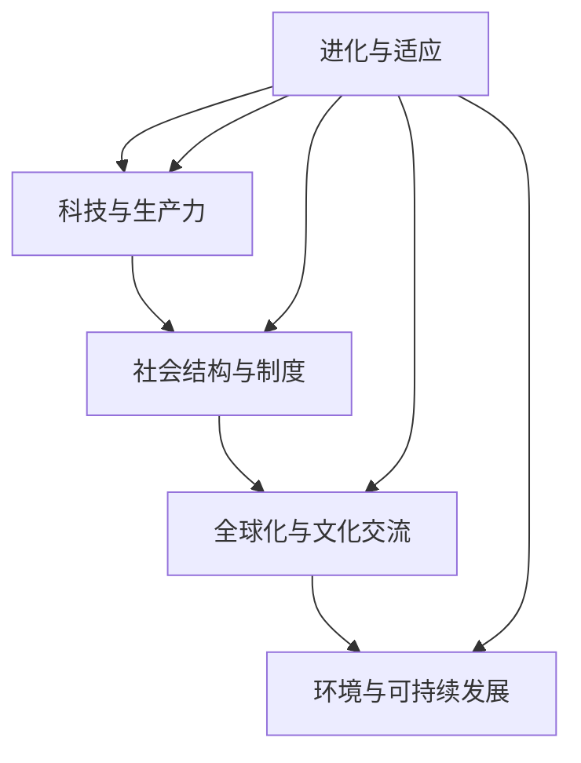
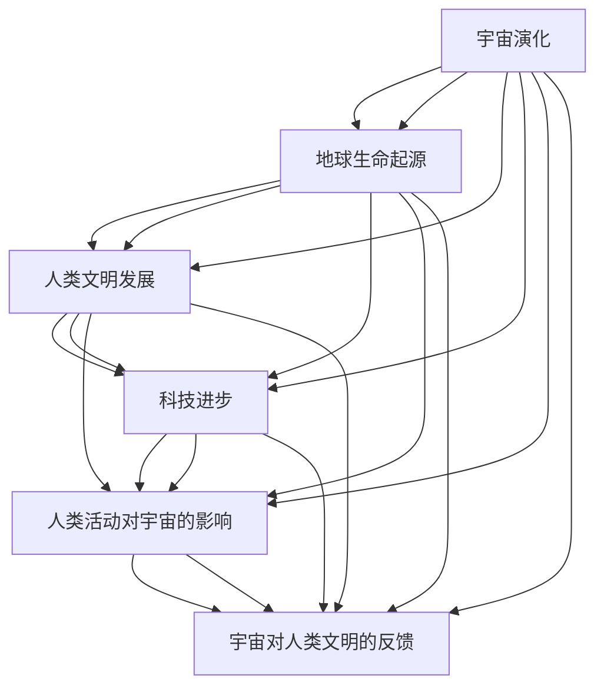

                 

### 导言

#### 书籍背景与目的

《人类文明在宇宙演化中的角色定位》这本书旨在探讨人类文明在宇宙中的地位与作用。随着人类对宇宙的认识不断深入，我们逐渐意识到，我们的存在不仅局限于地球，而是与整个宇宙的演化紧密相连。这本书的目的在于通过科学和技术的视角，分析人类文明在宇宙演化过程中的角色定位，帮助读者理解人类在宇宙中的独特地位。

宇宙的演化始于大爆炸，从那时起，宇宙经历了无数的变迁。在这个过程中，地球诞生，生命起源，人类文明逐渐发展。从早期的原始社会到现代科技时代，人类不断探索未知，推动科技的发展。这本书将带我们回顾这一过程，并思考人类文明对宇宙的影响以及宇宙对我们的反馈。

通过本书，读者将了解到：

1. 宇宙的起源与演化过程。
2. 人类文明的历史与科技进步。
3. 人类文明对地球和其他星系的影响。
4. 宇宙现象对人类文明的反馈。
5. 人类文明在宇宙中的未来展望。

#### 宇宙演化基础知识

宇宙的演化始于大约138亿年前的大爆炸。大爆炸理论认为，宇宙最初处于极度热密的状态，然后迅速膨胀，形成了我们今天所看到的宇宙。这一过程中，宇宙的温度和密度逐渐降低，形成了各种基本粒子，最终形成了恒星、星系和其他天体。

宇宙的演化可以分为以下几个主要阶段：

1. **大爆炸**：宇宙从一个极度热密的状态迅速膨胀，温度和密度逐渐降低。
2. **宇宙背景辐射**：随着宇宙的膨胀，温度下降到约3000K，形成了宇宙背景辐射。
3. **原子形成**：宇宙继续膨胀，温度降低到约3000K以下，原子开始形成。
4. **恒星与星系的形成**：宇宙中的气体和尘埃聚集形成恒星和星系。
5. **星际物质的演化**：恒星的生命周期和死亡过程对星际物质产生影响。
6. **宇宙的大尺度结构**：星系通过引力相互作用，形成了宇宙的大尺度结构。

人类文明在宇宙演化中的定位

人类文明是宇宙演化过程中的一部分，我们的起源、发展以及未来都与宇宙的演化息息相关。从地球生命的起源到现代科技的崛起，人类文明的发展历程不仅反映了我们自身的成长，也反映了宇宙的演化。人类文明的定位可以从以下几个方面进行探讨：

1. **地球生命的独特性**：地球是宇宙中唯一已知存在生命的行星，这种独特性使人类文明在宇宙中具有特殊地位。
2. **科技进步与宇宙探索**：人类通过科技的发展，不断拓展我们对宇宙的认识，推动了宇宙探索的进程。
3. **人类文明对宇宙的影响**：人类的活动对地球环境产生了深远影响，同时也在探索其他星系的潜在可能性。
4. **宇宙对人类文明的反馈**：宇宙中的各种现象对人类文明产生了重要影响，从气候变化到科技发展的推动，都是宇宙对人类文明的反馈。

通过以上分析，我们可以看出，人类文明在宇宙演化中具有独特的地位。我们的起源、发展以及未来都与宇宙的演化紧密相连。在接下来的章节中，我们将深入探讨宇宙演化的详细过程、人类文明的历史与科技进步、人类文明对宇宙的影响以及宇宙对人类文明的反馈，以更全面地理解人类文明在宇宙演化中的角色定位。

#### 人类文明在宇宙中的定位

人类文明作为宇宙演化过程中的一个重要环节，其独特性体现在多个方面。首先，从生物学的角度来看，地球是宇宙中已知唯一存在生命的行星，这意味着地球上的生命形式具有独特的适应性和演化路径。人类作为地球生命的最高形式，不仅在形态、行为和认知能力上与其他物种有显著差异，而且在文明和技术的发展上也达到了前所未有的高度。

人类文明的独特性不仅体现在生物学领域，更体现在其对宇宙的探索和认识。人类通过科学和技术的进步，逐渐揭开了宇宙的奥秘。从早期的天文学观测到现代的太空探索，人类对宇宙的认识不断深入。例如，通过发射卫星和探测器，人类已经在月球和火星上留下了足迹，探索了太阳系中的其他天体。这些探索不仅推动了科学技术的进步，也拓展了我们对宇宙的认识。

此外，人类文明在宇宙中的定位还体现在其对宇宙的影响上。人类的活动对地球环境产生了深远影响，从气候变化到生物多样性的减少，这些变化不仅影响到了地球上的生命，也对宇宙的演化产生了潜在的影响。例如，人类活动产生的温室气体导致全球气候变暖，这可能会改变地球的生态系统，进而影响宇宙中其他星系的稳定性。

同时，人类对宇宙的影响也体现在我们对外星生命的探索上。尽管目前还没有确凿的证据表明外星生命的存在，但人类已经开始探索其他星系的潜在可能性。例如，通过射电望远镜和光学望远镜的观测，科学家们试图寻找外星文明发出的信号。这些探索不仅有助于我们理解宇宙的多样性，也可能揭示宇宙中生命的普遍性。

从哲学的角度来看，人类文明在宇宙中的定位还涉及到我们对自身存在的意义和目的的思考。人类通过科学、艺术和哲学等多种途径，试图回答关于宇宙和生命的终极问题。这些探索不仅反映了人类对宇宙的敬畏和好奇，也揭示了人类文明在宇宙中的独特地位。

综上所述，人类文明在宇宙演化中的角色定位是一个多维度的复杂问题。从生物学、科学、技术、环境、哲学等多个角度，我们可以看到人类文明在宇宙中的独特地位和重要作用。人类不仅是我们所在星球上的生命，也是探索和认识宇宙的重要力量。在接下来的章节中，我们将进一步探讨人类文明在宇宙演化中的具体作用和影响，以更全面地理解这一主题。

#### 人类文明的历史

人类文明的历史可以追溯到数百万年前，当时我们的祖先在地球上出现。从最初的猿人到现代人类，我们的进化历程充满了挑战与机遇。在这一过程中，人类逐渐形成了社会组织，发展了语言和工具，推动了文明的诞生。

1. **早期人类**：最早的原始人类出现在约300万年前，他们开始使用简单的工具，如石斧和石锤。随着时间的推移，早期人类逐渐学会了使用火，这为他们的生存提供了重要的帮助。

2. **农业革命**：约1万年前，人类开始从狩猎采集转向农业。这一转变极大地提高了人类的食物生产效率，促使人口增长和社会结构变得更加复杂。人类开始建立永久性的居住地，形成了早期的城市。

3. **科技革命**：从18世纪末到19世纪初，第一次工业革命带来了工业化和机械化生产，彻底改变了人类的生活方式。蒸汽机、纺织机和铁路等技术的发明和普及，推动了社会和经济的快速发展。

4. **信息时代**：20世纪中叶，第二次工业革命和计算机技术的崛起，标志着人类进入了信息时代。互联网、移动通信和大数据等技术的发展，进一步加速了信息的传递和交流，使得人类文明达到了前所未有的高度。

5. **现代科技**：21世纪，随着生物技术和人工智能的快速发展，人类在医疗、能源、交通等领域取得了重大突破。这些技术的进步不仅改善了人类的生活质量，也拓展了我们对宇宙的认识。

6. **全球化**：现代人类社会的另一个显著特点是全球化。随着交通和通信技术的进步，各国之间的联系日益紧密，形成了全球化的经济和文化交流。全球化带来了机遇，也带来了挑战，如环境问题、资源分配不均等。

7. **未来展望**：随着科技的发展，人类文明正朝着更加智能和可持续的方向发展。人工智能、量子计算和太空探索等前沿技术，有望推动人类文明迈向新的阶段。同时，我们也需要面对诸如气候变化、资源枯竭等全球性挑战，以确保人类文明的可持续发展。

### 核心概念与联系

人类文明的历史发展过程是一个复杂而多元的体系，其核心概念和联系可以概括为以下几个方面：

1. **进化与适应**：人类从猿人进化到现代人类，这一过程中最重要的核心概念是进化论。达尔文的进化论解释了生物物种通过自然选择和适应环境而不断进化的过程。这一理论不仅适用于地球上的生物，也为我们理解人类文明的发展提供了基础。

2. **科技与生产力**：科技的发展是推动人类文明进步的关键因素。从农业革命到工业革命，再到信息时代，每一次科技革命都极大地提升了人类的生产力和生活质量。科技与生产力的联系，构成了人类文明发展的主要驱动力。

3. **社会结构与制度**：随着人类文明的进步，社会结构和制度也在不断演变。从原始社会的部落制度到现代国家的法律体系，社会结构和制度的变化不仅影响了人类的社会组织形式，也影响了文明的进程。

4. **全球化与文化交流**：全球化使得各国之间的联系日益紧密，文化交流成为推动人类文明发展的重要动力。全球化带来了机遇，也带来了挑战，如文化冲突、经济不平衡等。如何处理好全球化背景下的文化交流，是当前人类文明发展的重要课题。

5. **环境与可持续发展**：人类文明的发展对环境产生了深远影响，同时也面临着环境问题。可持续发展成为人类文明发展的核心概念，如何在发展经济的同时保护环境，是当前人类面临的重大挑战。

为了更直观地展示这些核心概念之间的联系，我们可以使用Mermaid流程图来表示：

通过这一流程图，我们可以清晰地看到人类文明发展过程中各个核心概念之间的相互关系。进化和适应是人类文明发展的基础，科技与生产力推动了文明的进步，社会结构与制度的变化影响了文明的发展方向，全球化与文化交流带来了新的机遇和挑战，而环境与可持续发展则关系到人类文明的未来。

### 核心概念与联系

为了更好地理解人类文明在宇宙演化中的角色定位，我们可以通过一个Mermaid流程图来展示核心概念之间的关系架构。以下是流程图的示例：

这个流程图展示了以下几个核心概念之间的关系：

1. **宇宙演化**：从大爆炸到现在的宇宙演化过程，是所有生命和文明的基础。
2. **地球生命起源**：宇宙演化导致地球生命的诞生，这是人类文明起源的前提。
3. **人类文明发展**：人类文明从早期的原始社会发展到现代科技时代，这一过程中不断推动科技进步。
4. **科技进步**：科技的进步极大地提升了人类社会的生产力和生活质量，改变了我们对宇宙的认识。
5. **人类活动对宇宙的影响**：人类活动不仅改变了地球环境，也对宇宙其他部分产生了潜在影响。
6. **宇宙对人类文明的反馈**：宇宙中的各种现象对人类文明产生了积极或消极的反馈，影响人类的发展方向。

通过这个流程图，我们可以清晰地看到人类文明在宇宙演化中的角色定位，以及各个核心概念之间的相互关系。人类文明既是宇宙演化的一部分，也通过自身的活动对宇宙产生影响，同时宇宙的各种现象又反过来影响人类文明的发展。

### 人类文明对宇宙的影响

人类文明对宇宙的影响是多方面的，其中最为显著的是对地球环境的影响。随着工业化和城市化的发展，人类活动对地球生态系统造成了深远的影响，从而间接影响了整个宇宙的演化。

首先，人类活动对地球环境的主要影响包括气候变化、生物多样性的减少和环境污染。温室气体的排放导致全球气候变暖，这不仅改变了地球的生态系统，还可能影响到其他行星的环境。此外，人类对森林、湿地等生态系统的破坏导致了生物多样性的减少，这种生态破坏不仅影响了地球上的生命，也可能对宇宙中的生态系统产生连锁反应。

其次，人类的活动还可能导致地球上的极端天气事件增加，如干旱、洪水和台风等。这些极端天气事件不仅威胁到人类的生存，也可能对地球上的生物多样性和生态系统造成破坏。由于地球与其他行星之间存在一定的相互作用，这种生态破坏可能会对整个太阳系甚至更广阔的宇宙环境产生影响。

此外，人类在宇宙探索方面的活动也对宇宙产生了潜在影响。例如，人类发射的人造卫星和探测器进入太空，可能会对其他行星或小行星的轨道产生影响。尽管这种影响在短期内可能并不显著，但从长远来看，人类的活动可能会对宇宙的稳定性产生一定影响。

人类文明对宇宙的潜在影响还包括对其他星系的探索。随着技术的发展，人类已经开始尝试寻找外星生命和资源。例如，通过射电望远镜和光学望远镜的观测，科学家们试图寻找外星文明发出的信号。虽然目前还没有确凿的证据表明外星生命的存在，但这种探索活动表明人类对宇宙的兴趣和影响正在扩展。

在探索其他星系的过程中，人类可能会发现新的资源和技术，这些发现不仅有助于人类文明的发展，也可能对整个宇宙的演化产生重要影响。例如，如果人类在未来能够开发出星际旅行技术，那么人类的活动可能会更加深入地影响到其他星系的环境和生态系统。

总之，人类文明对宇宙的影响是多方面的，从地球环境的变化到宇宙探索的活动，都表明人类在宇宙演化中扮演着重要角色。人类的活动不仅改变了地球，也可能对其他行星和星系产生深远影响。在未来的宇宙探索中，我们需要更加关注人类活动对宇宙的影响，以确保我们的行动不会对宇宙的稳定性造成不可逆转的破坏。

### 宇宙对人类文明的反馈

宇宙中的各种现象对人类文明产生了深远的影响，这些影响既有积极的，也有消极的。首先，从积极的方面来看，宇宙中的天文学现象为我们提供了丰富的科学知识，推动了人类科技的进步。

**1. 天文学现象的科学研究**：

天文学的研究使我们能够深入了解宇宙的起源、结构和演化。例如，通过观测宇宙背景辐射，科学家们证实了宇宙大爆炸理论，这为理解宇宙的早期历史提供了关键证据。此外，对恒星、星系和星云的研究，使我们能够了解恒星的生命周期和宇宙的化学元素分布。

**2. 科学技术的推动**：

天文学研究推动了相关科学技术的进步。例如，射电望远镜和光学望远镜的发明和改进，不仅帮助我们观测到更远、更精细的宇宙现象，也促进了光学工程、电子工程等领域的发展。此外，卫星技术和通信技术的进步，也得益于天文学研究的推动。

**3. 探索和发现的激励**：

宇宙中的各种天文学现象激发了人类对未知的探索欲望。例如，人类对月球的探索不仅推动了航天技术的发展，也促进了国际合作。通过太空探索，我们不仅拓展了对宇宙的认识，也发现了新的科学问题和挑战。

然而，宇宙对人类文明的反馈也有消极的一面。例如，宇宙中的高能粒子、宇宙射线和太阳风等自然现象，对地球上的生物和科技设备都可能产生不利影响。

**1. 对地球生物的影响**：

宇宙中的高能粒子和宇宙射线可能会对地球生物的DNA造成损伤，增加遗传变异的风险。尽管地球的大气层和磁场在很大程度上保护了生物免受这些辐射的侵害，但在极端情况下，如高能粒子流或太阳风暴增强时，这些辐射仍可能对生物产生负面影响。

**2. 对科技设备的影响**：

宇宙中的自然现象也对地球上的科技设备产生了影响。例如，太阳风暴可能会干扰通信卫星和电网系统，导致通信中断和电力故障。此外，宇宙中的高能粒子也可能对地面上的电子设备造成损坏。

**3. 对人类健康的潜在威胁**：

长期暴露在高能粒子和宇宙射线下，可能会对人类的健康产生不利影响。例如，宇宙射线暴露是宇航员面临的一个主要健康风险，可能会导致辐射病、癌症等疾病。

总之，宇宙中的各种现象对人类文明产生了复杂的影响。在享受宇宙带来的科学知识和技术进步的同时，我们也需要警惕宇宙可能带来的消极影响，并采取措施保护我们的生物和科技设备。通过深入理解宇宙现象和反馈机制，我们可以更好地应对未来可能出现的挑战，确保人类文明在宇宙中的可持续发展。

### 人类文明在宇宙中的未来

随着科技的不断进步，人类文明在宇宙中的未来发展充满了无限可能。然而，这一未来也伴随着诸多挑战和不确定性。本文将从以下几个方面探讨人类文明在宇宙中的未来前景。

**1. 宇宙探索的进一步深化**

在未来几十年内，人类有望实现更加深入的宇宙探索。例如，火星和木星的探测任务可能会进一步展开，甚至可能启动前往更遥远的星系的任务。随着航天技术的不断进步，星际旅行可能会成为现实，人类可能会在太阳系外的行星上建立基地，开启新的文明篇章。

**2. 外星生命的发现**

随着对宇宙的探索不断深入，人类可能会发现外星生命的存在。这一发现将极大地改变我们对宇宙和生命起源的理解。虽然目前尚未有确凿的证据表明外星生命的存在，但通过射电望远镜和太空探测器的观测，科学家们已经在寻找可能存在生命迹象的天体。

**3. 新技术和科学突破**

在未来，人工智能、量子计算和纳米技术等前沿科技的发展，可能会带来新的科学突破。这些技术不仅能够推动人类文明在宇宙中的进步，还可能帮助我们解决地球上的许多问题。例如，量子计算可能使复杂问题得到更高效的解决，而纳米技术则可能带来全新的材料和医疗技术。

**4. 面临的挑战**

尽管未来充满机遇，但人类文明在宇宙中也将面临诸多挑战。首先是资源稀缺和环境问题。随着人类活动范围的扩大，地球的资源消耗速度也在加快，这可能会对宇宙中的其他星系产生影响。其次是技术风险。新的科技发展可能会带来前所未有的风险，如人工智能失控、量子计算带来的安全威胁等。此外，外星文明的未知风险也是一个重要挑战。如果人类在宇宙中遇到外星文明，这可能会带来不可预测的后果。

**5. 人类文明的长期生存**

为了确保人类文明的长期生存，我们需要采取一系列措施。首先，人类需要加强国际合作，共同应对全球性挑战。其次，我们需要发展可持续的能源和技术，以减少对地球和其他星系的负面影响。此外，我们还需要培养未来的宇航员和科学家，以应对未来可能出现的各种挑战。最后，我们需要保持对宇宙的敬畏和谨慎，确保我们的行动不会对宇宙的稳定性造成不可逆转的破坏。

总之，人类文明在宇宙中的未来充满希望，但同时也面临诸多挑战。通过科技的发展、国际合作和长远的规划，我们可以确保人类文明在宇宙中的可持续发展，开创一个更加美好的未来。

### 宇宙未来的预测

宇宙的未来是一个复杂而引人入胜的话题。从目前的研究和理论来看，宇宙未来的预测可以分为几个不同的情景，每个情景都可能导致人类文明面临不同的命运。

**1. 大撕裂（Big Rip）**

根据一些理论，宇宙可能会经历一种称为“大撕裂”的过程。在这个情景中，宇宙的膨胀速度会不断加快，最终导致宇宙中的所有物质，包括星系、恒星、行星和人类文明，都被撕裂成基本粒子。这个过程可能发生在宇宙的遥远未来，大约在10的60次方年后。这种情景对人类文明的长期生存构成了巨大威胁，因为它意味着宇宙将变得不适合生命存在。

**2. 大坍缩（Big Crunch）**

与“大撕裂”相反，另一种可能的宇宙未来是“大坍缩”。在这个情景中，宇宙的膨胀最终会停止，并开始收缩，直到所有物质都回到一个极度热密的点，类似于大爆炸之前的状态。这个过程可能会导致宇宙温度和密度急剧增加，最终形成一个新的宇宙。然而，这种情景也面临着一些理论上的挑战，例如宇宙膨胀的观测数据与理论预测之间的不一致。

**3. 大冻结（Big Freeze）**

“大冻结”是另一个可能的宇宙未来。在这个情景中，宇宙将继续膨胀，但速度会逐渐减慢，直到整个宇宙达到一个热力学平衡状态，即所有能量都耗尽，不再有热运动。在这种情况下，宇宙中的所有生命形式都将逐渐消亡，因为它们无法维持生命所需的能量。虽然这个过程可能需要数十亿年甚至更长时间，但对于人类文明来说，这仍然是一个可怕的预言。

**4. 多宇宙（Multiverse）**

除了上述几种情景，还有一些理论提出了多宇宙的概念。这些理论认为，我们的宇宙只是众多宇宙中的一个，每个宇宙都有自己的物理定律和演化过程。这种情景意味着，即使在我们宇宙中发生大撕裂或其他灾难，可能还有其他宇宙中的生命形式可以继续存在。这种观点为人类文明的未来提供了一定的希望，但也带来了新的哲学和科学问题。

**人类文明在宇宙中的应对策略**

面对宇宙未来的不同情景，人类文明需要制定相应的应对策略。以下是一些可能的策略：

**1. 科技发展**

为了应对宇宙未来的挑战，人类需要不断推动科技发展，特别是探索更高效的能源利用、空间技术和宇宙探索技术。例如，开发可持续的核能、太阳能和量子能源，以及建造更加坚固和灵活的太空飞船和基地，都是未来科技发展的重点。

**2. 国际合作**

宇宙的未来不仅仅取决于单个国家或文明，而是需要全球范围内的合作和协调。通过建立国际联盟和合作机制，人类可以共同应对宇宙中的各种挑战，包括资源争夺、环境保护和技术共享。

**3. 生命扩展**

为了确保人类文明的长期生存，人类需要考虑在宇宙中扩展生命形式。这包括探索和利用其他星球和星系，建立独立的生命支持系统，以及开发能够在极端环境中生存的微生物和植物。

**4. 哲学和宗教**

面对宇宙的未知和不确定性，哲学和宗教可以提供精神支持和指导。通过探索人类存在的意义和宇宙的本质，哲学和宗教可以帮助人类更好地理解自己在宇宙中的位置，并为未来的挑战提供道德和伦理指导。

总之，宇宙的未来是一个复杂而多样的话题，人类文明需要做好充分的准备，以应对各种可能的情景。通过科技发展、国际合作、生命扩展和哲学思考，我们可以为人类文明在宇宙中的长期生存和繁荣创造更加美好的未来。

### 总结

本文通过系统的分析和讨论，揭示了人类文明在宇宙演化中的角色定位。我们从宇宙的起源与演化、人类文明的历史、人类活动对宇宙的影响以及宇宙对人类文明的反馈等多个角度，探讨了人类文明在宇宙中的独特地位和重要作用。以下是全文的核心观点的总结：

1. **宇宙演化与生命起源**：宇宙的演化始于大爆炸，生命在地球上逐渐起源，人类作为地球上最高级的智慧生命，见证了文明的崛起和科技进步。

2. **科技进步与文明发展**：科技的不断进步推动了人类文明的发展，从农业革命到工业革命，再到信息时代，人类文明经历了多次重大的科技革命，极大地改变了我们的生活方式和文明进程。

3. **人类活动对宇宙的影响**：人类活动对地球环境产生了深远影响，同时也可能对其他星系产生潜在影响。我们的活动不仅改变了地球，还可能对宇宙的稳定性产生一定影响。

4. **宇宙对人类文明的反馈**：宇宙中的各种自然现象对人类文明产生了重要影响，从气候变化到科技进步，宇宙的各种现象都在不断塑造着我们的文明。

5. **未来展望与挑战**：面对宇宙未来的不确定性，人类需要通过科技发展、国际合作和哲学思考，为文明在宇宙中的长期生存和繁荣创造更好的未来。

通过本文的探讨，我们不仅加深了对人类文明在宇宙中角色定位的理解，也为未来的人类文明在宇宙中的发展提供了有益的启示。

### 对人类文明的启示

通过对人类文明在宇宙演化中的角色定位的探讨，我们可以获得一些重要的启示，这些启示不仅关乎我们的当前生活，也对未来的人类文明具有深远影响。

**1. 人类在宇宙中的责任**：人类作为宇宙的一部分，我们的行为不仅影响着地球环境，也可能对其他星系产生深远影响。因此，我们需要意识到自己在宇宙中的责任，采取负责任的态度，保护地球生态系统，减少对环境的破坏。

**2. 科技发展的可持续性**：科技的进步是推动人类文明发展的重要动力，但我们也需要关注科技发展的可持续性。我们需要在发展新技术的同时，确保这些技术不会对环境造成长期的负面影响。例如，发展清洁能源技术，以减少温室气体排放。

**3. 国际合作的重要性**：面对全球性的挑战，如气候变化、资源枯竭和环境污染，国际合作变得尤为重要。通过国际合作，我们可以共同应对这些挑战，分享科技成果，确保人类文明的可持续发展。

**4. 对未知的好奇与探索**：宇宙中的未知领域充满了无限可能，对未知的好奇和探索精神是人类文明不断进步的重要动力。我们需要保持对未知领域的探索热情，通过科学研究和国际合作，不断拓展我们对宇宙的认识。

**5. 人类文明的哲学思考**：在面对宇宙的宏大和复杂性时，哲学思考帮助我们理解人类存在的意义和目的。通过哲学思考，我们可以更好地认识自己在宇宙中的位置，为人类文明的未来发展提供道德和伦理指导。

**6. 长期生存的规划**：为了确保人类文明的长期生存，我们需要进行长期的规划和准备。这包括开发可持续的能源和资源利用技术，探索宇宙中的其他宜居星球，以及建立能够在极端环境中生存的生命支持系统。

总之，通过对人类文明在宇宙演化中的角色定位的思考，我们可以获得许多有价值的启示，这些启示不仅有助于我们更好地理解自己在宇宙中的地位，也为未来的人类文明提供了宝贵的指导和方向。通过负责任的行为、可持续的科技发展、国际合作、探索精神、哲学思考和长期规划，我们可以为人类文明在宇宙中的可持续发展创造更加美好的未来。

