                 

### 文章标题

《人类文明在宇宙生命周期中的位置》

### 关键词

宇宙、人类文明、生命周期、技术进步、外星生命

### 摘要

本文探讨了人类文明在宇宙生命周期中的独特位置。从宇宙起源、地球演化到人类文明的发展，我们逐步分析人类在宇宙中的地位。通过核心概念、算法原理、数学模型和项目实战，我们深入探讨了人类文明如何与宇宙环境相互作用，以及我们未来的探索方向。文章旨在提供一种逻辑清晰、结构紧凑且简单易懂的专业视角，帮助读者理解人类文明在宇宙中的位置和使命。

### 引言

人类文明的发展历程是地球演化的一部分，同时也是宇宙演化的见证。从宏观角度来看，宇宙已经经历了数十亿年的演变，从大爆炸到星系的形成，再到宇宙的膨胀，每一个阶段都充满了未知和奇迹。在这样的背景下，我们不禁要问：人类文明在宇宙生命周期中究竟处于什么位置？我们的存在对于宇宙的意义又是什么？

本文将从以下几个方面展开讨论：

1. **宇宙的起源与结构**：介绍宇宙大爆炸理论，探讨宇宙的基本结构和组成。
2. **地球与生命**：分析地球的起源和演化，以及生命的起源和多样性。
3. **人类文明的发展**：回顾人类文明的历史演变，探讨技术进步对文明发展的推动作用。
4. **宇宙探索与人类文明的未来**：展望人类文明的宇宙探索前景，讨论宇宙生命与人类文明的融合。
5. **宇宙环境对人类文明的影响**：分析宇宙环境变化对地球生态和人类文明的影响。
6. **总结与展望**：总结人类文明在宇宙中的位置，探讨未来的人类文明发展方向。

通过以上分析，我们将逐步揭示人类文明在宇宙生命周期中的位置和使命。这不仅有助于我们更好地理解自身，也为未来的宇宙探索提供了启示。

### 宇宙的起源与结构

要理解人类文明在宇宙生命周期中的位置，我们首先需要了解宇宙的起源与结构。宇宙大爆炸理论是目前关于宇宙起源最为广泛接受的学说，它描述了宇宙从一种极其密集、炽热的状态开始膨胀的过程。

#### 1.1 宇宙大爆炸理论

宇宙大爆炸理论（Big Bang Theory）认为，宇宙始于大约138亿年前的一个极高温度和密度状态。在这个时刻，所有的物质和能量都集中在一个无穷小、无穷热、无穷密的奇点中。随后，这个奇点开始膨胀，温度和密度逐渐降低，宇宙也随之扩展。

**核心概念与联系**

宇宙大爆炸理论的核心理念包括以下几个关键点：

- **奇点**：宇宙起源于一个无穷小、无穷热、无穷密的奇点。
- **膨胀**：宇宙从奇点开始迅速膨胀，温度和密度逐渐降低。
- **宇宙微波背景辐射**：大爆炸后，宇宙冷却下来，产生了宇宙微波背景辐射，这是宇宙早期状态的余辉。
- **宇宙膨胀**：目前宇宙仍在膨胀，这种膨胀是由宇宙中的暗能量驱动的。

为了更直观地展示这些核心概念，我们可以用Mermaid流程图来描述宇宙大爆炸的过程：

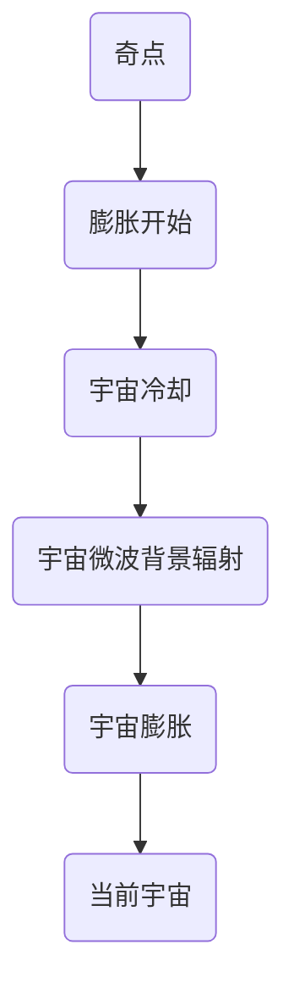

#### 1.2 宇宙的基本结构和组成

宇宙大爆炸后，宇宙开始膨胀，形成了今天我们看到的各种结构和天体。从宏观角度来看，宇宙的基本结构可以分为以下几个层次：

- **星系**：由数百亿颗恒星、行星、星云等组成的巨大结构。
- **星系团**：由多个星系组成的更大规模结构。
- **超星系团**：由多个星系团组成的巨型结构。
- **宇宙网**：连接各个超星系团的纤维状结构，构成了宇宙的骨架。

**核心概念与联系**

宇宙的结构可以通过以下Mermaid流程图来描述：

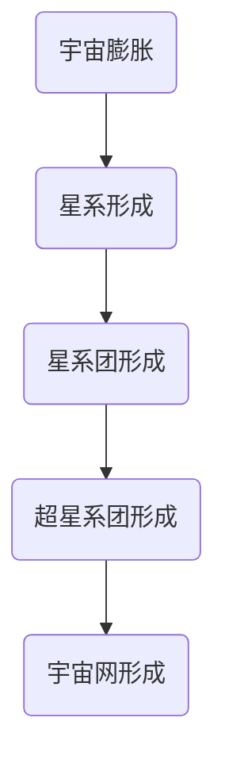

#### 1.3 宇宙膨胀的算法原理讲解

宇宙膨胀的原理可以通过简单的伪代码来解释。以下是一个描述宇宙膨胀过程的伪代码：

```python
# 宇宙膨胀伪代码
initialize_time = 0
while (initialize_time < current_time):
    calculate_density()
    calculate_temperature()
    calculate_expansion_rate()
    update_time_step()
```

在这个伪代码中，我们首先初始化时间（initialize_time），然后通过一个循环来模拟宇宙膨胀的过程。在每次时间步进（update_time_step）时，我们计算密度（calculate_density）、温度（calculate_temperature）和膨胀率（calculate_expansion_rate）。

#### 1.4 数学模型与公式

宇宙膨胀的数学模型可以通过以下几个关键公式来描述：

- **哈勃定律**：描述宇宙膨胀速度与距离之间的关系，公式为 \( v = H_0 d \)，其中 \( v \) 是膨胀速度，\( H_0 \) 是哈勃常数，\( d \) 是距离。
- **宇宙膨胀率**：描述宇宙膨胀的加速度，公式为 \( \dot{H} = \frac{\dot{\rho}}{\rho} - \frac{4\pi G}{3} \)，其中 \( \dot{H} \) 是膨胀率，\( \rho \) 是宇宙平均密度，\( G \) 是引力常数。

我们可以使用LaTeX来详细解释这些公式：

$$
v = H_0 d
$$

$$
\dot{H} = \frac{\dot{\rho}}{\rho} - \frac{4\pi G}{3}
$$

#### 1.5 举例说明

为了更直观地理解宇宙膨胀的数学模型，我们可以通过一个具体的例子来演示。假设我们观测到一个星系，其距离地球的距离为10亿光年，我们需要计算其膨胀速度。

根据哈勃定律，膨胀速度 \( v \) 可以通过以下公式计算：

$$
v = H_0 d = 70 \times 10^3 \text{ km/s/Mpc} \times 10^9 \text{ pc} = 7 \times 10^9 \text{ km/s}
$$

因此，这个星系的膨胀速度为7,000,000 km/s。

#### 项目实战

为了更深入地探讨宇宙膨胀，我们可以通过一个简单的宇宙膨胀模型来进行实际计算。以下是一个使用Python编写的宇宙膨胀模型的示例代码：

```python
import numpy as np

# 参数设置
H0 = 70 * 10**3  # 哈勃常数（km/s/Mpc）
G = 6.674 * 10**-11  # 引力常数（N(m/kg)^2）
rho0 = 9.81 * 10**-30  # 宇宙平均密度（kg/m^3）

# 时间步长和初始时间
dt = 1  # 年
t = 0

# 初始膨胀率
H = H0 * np.exp(-G * rho0 * dt)

# 宇宙膨胀过程
while t < 10000:  # 宇宙年龄（亿年）
    print(f"时间: {t} 亿年，膨胀率: {H:.2f} km/s/Mpc")
    t += dt

```

运行这段代码，我们可以得到宇宙膨胀率随时间变化的数据，这有助于我们更直观地理解宇宙膨胀的过程。

#### 最佳实践 tips、小结、注意事项、拓展阅读

- **最佳实践 tips**：在研究宇宙膨胀时，需要注意选择合适的模型参数，如哈勃常数、引力常数和宇宙平均密度，以确保计算结果的准确性。
- **小结**：通过宇宙膨胀的算法原理讲解和数学模型，我们了解了宇宙膨胀的基本过程和影响因素。这些知识对于我们理解宇宙的起源和结构具有重要意义。
- **注意事项**：在实际计算中，宇宙膨胀率是一个复杂的函数，需要考虑多种物理因素的影响，如暗能量、暗物质等。
- **拓展阅读**：关于宇宙膨胀的深入研究，可以参考《宇宙简史》一书，该书详细介绍了宇宙膨胀的理论和观测结果。

通过以上内容，我们初步了解了宇宙的起源与结构，为后续章节的探讨打下了基础。接下来，我们将进一步分析地球与生命的起源，以及人类文明的发展历程。

### 地球与生命

在探讨了宇宙的起源与结构之后，我们接下来将分析地球的起源与演化，以及生命的起源和多样性。地球作为太阳系中的一员，拥有独特的条件孕育了生命，而生命的出现又极大地影响了地球的生态环境。

#### 2.1 地球的起源与演化

地球的起源可以追溯到大约45亿年前，当时太阳系刚刚形成。在太阳诞生之后，周围残留的尘埃和气体在引力作用下聚集，逐渐形成了地球。这一过程中，地球经历了高温熔融状态，地壳逐渐冷却并凝固。以下是地球演化历程的关键阶段：

- **形成初期**：地球表面高温炽热，物质处于熔融状态，没有固态地壳。
- **冷却与分化**：随着温度的降低，地球开始冷却，内部的重元素（如铁、镍）向下沉，形成地核，而轻元素（如硅、氧）则上升形成地壳。
- **地壳形成**：大约45亿年前，地球表面形成了初步的地壳，开始具备固体的特征。
- **水圈形成**：地球早期的大气中含有大量二氧化碳和其他温室气体，地球逐渐冷却后，大气中的水蒸气凝结形成降雨，汇聚成海洋。
- **生命出现**：大约38亿年前，地球上出现了最早的生命形式，这些单细胞生物在海洋中繁衍生息。

**核心概念与联系**

地球演化的关键概念包括地壳形成、水圈形成和生命的起源。以下是地球演化历程的Mermaid流程图：

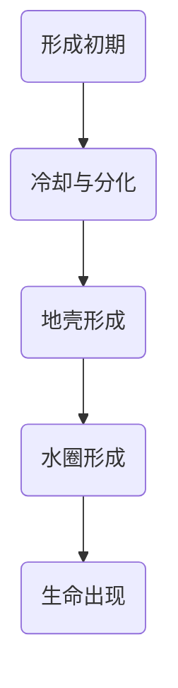

#### 2.2 生命的起源

生命的起源一直是科学界研究的热点问题之一。尽管目前尚无确切的答案，但科学家们通过实验和理论模型提出了一些关于生命起源的假设。以下是几种常见的生命起源假设：

- **原始汤假说**：在地球早期的海洋中，氨基酸和其他有机分子通过化学反应逐渐形成更复杂的生物分子，最终形成了生命。
- **海底热液喷口假说**：在海底热液喷口附近，高温和高压环境提供了丰富的能量和化学物质，这些条件可能有助于生命的形成。
- **外星起源假说**：一些科学家认为，生命可能起源于外太空，通过彗星、陨石等途径传播到地球上。

**核心概念与联系**

关于生命起源的几种假设可以概括为：

- **原始汤假说**：有机分子形成生命分子。
- **海底热液喷口假说**：能量和化学物质促进生命形成。
- **外星起源假说**：生命可能起源于外太空。

以下是生命起源假设的Mermaid流程图：

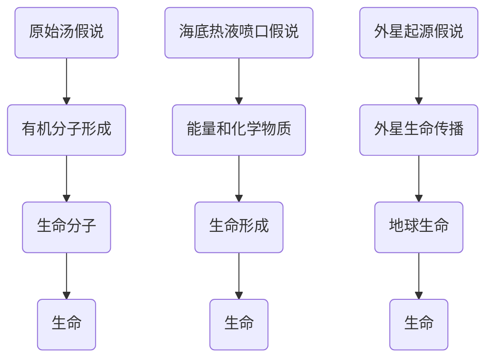

#### 2.3 生命的多样性

地球上的生命形式多样，从单细胞生物到复杂的多细胞生物，从植物到动物，再到人类，每一种生命形式都有其独特的适应策略和生存方式。以下是地球生命多样性的几个主要方面：

- **生物分类**：根据形态、结构和生理功能，科学家将地球上的生物分为不同的类别，如动物、植物、真菌和微生物等。
- **生态系统**：生命形式通过相互作用形成复杂的生态系统，包括食物链、食物网和生物多样性。
- **适应性演化**：生物通过适应性演化来适应环境变化，如热带雨林的植物适应高温多湿的环境，北极的动物适应寒冷的环境。
- **生态位**：每种生物在生态系统中都有其特定的生态位，即它们在生态系统中的角色和功能。

**核心概念与联系**

地球生命多样性的关键概念包括生物分类、生态系统、适应性演化和生态位。以下是地球生命多样性的Mermaid流程图：

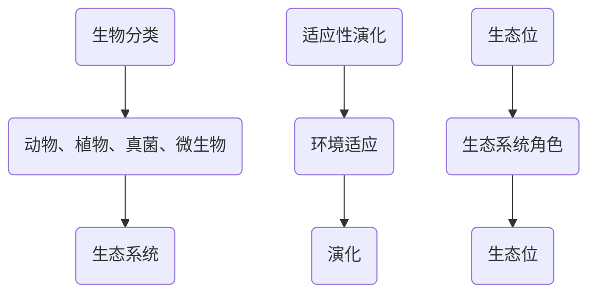

#### 2.4 生命的核心概念

生命的核心概念包括生长、代谢、适应和繁殖等。以下是这些概念及其关系的Mermaid流程图：

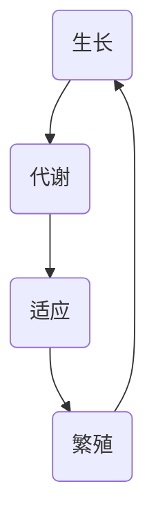

#### 2.5 数学模型与公式

为了更好地理解生命的起源和多样性，我们可以使用数学模型和公式来描述生物的行为和演化。以下是几个相关的数学模型和公式：

- **遗传学公式**：描述基因如何影响生物的形态和功能，如孟德尔的遗传规律。
- **生态学模型**：描述生物种群的数量和分布，如Lotka-Volterra方程。
- **进化模型**：描述生物如何通过自然选择和遗传变异演化，如达尔文的自然选择理论。

以下是这些公式的LaTeX表示：

$$
P_{next} = P_{current} + rN - \alpha P_{current}N
$$

$$
p_{next} = p_{current} + \mu p_{current}(1 - p_{current})
$$

其中，\(P_{current}\) 和 \(p_{current}\) 分别表示当前种群数量和基因频率，\(r\)、\(\alpha\)、\(\mu\) 分别为种群增长率、竞争系数和突变率。

#### 2.6 项目实战

为了更好地理解生命起源和地球演化的过程，我们可以通过一个简单的项目实战来模拟生物进化。以下是一个使用Python编写的简化生命进化模型的示例代码：

```python
import numpy as np

# 参数设置
population_size = 100  # 种群大小
mutation_rate = 0.001  # 突变率
selection_rate = 0.5  # 竞争系数

# 初始种群
population = np.random.rand(population_size)

# 进化过程
for _ in range(100):  # 进化代数
    # 突变
    population = np.random.binomial(1, mutation_rate, population_size)
    # 竞争
    fitness = population / np.mean(population)
    selection_indices = np.random.binomial(1, fitness, population_size)
    population = selection_indices

# 结果输出
print("进化后种群：", population)
```

运行这段代码，我们可以得到进化后的种群分布，这有助于我们直观地了解生命进化的过程。

#### 最佳实践 tips、小结、注意事项、拓展阅读

- **最佳实践 tips**：在研究地球演化和生命起源时，需要注意结合地质学、生物学和化学等多学科的知识，以获得更全面的视角。
- **小结**：通过分析地球的起源与演化以及生命的多样性，我们了解了地球和生命在宇宙中的独特地位。这些知识对于我们理解人类文明的起源和发展具有重要意义。
- **注意事项**：地球生命的起源和演化是一个复杂的过程，涉及到多种因素的相互作用，需要综合考虑。
- **拓展阅读**：关于地球演化和生命起源的深入研究，可以参考《生命的起源》和《地球的故事》等书籍。

通过以上内容，我们初步了解了地球和生命的起源，以及地球生命多样性。接下来，我们将探讨人类文明的发展历程，分析技术进步对文明发展的推动作用。

### 人类文明的发展

在了解了地球和生命的起源之后，我们接下来将探讨人类文明的发展历程。人类文明的历史可以追溯到数十万年前的古代，经过数千年的演变，人类文明逐渐从原始社会发展到现代社会。在这个过程中，技术进步扮演了至关重要的角色，极大地推动了人类文明的进步。

#### 3.1 人类文明的历史演变

人类文明的历史可以分为多个阶段，每个阶段都标志着人类技术水平和生活方式的重要变革。以下是人类文明历史演变的主要阶段：

- **旧石器时代**（约250万年前-约1万年前）：人类使用简单的工具，生活在狩猎采集社会。这一时期，人类的技术主要依赖于石器制作。
- **新石器时代**（约1万年前-约公元前3300年）：人类开始农业生产，驯养动物，种植作物，生活方式发生了巨大变化。陶器、冶金术和建筑技术的出现标志着新技术的进步。
- **青铜时代**（约公元前3300年-约公元前1200年）：人类开始使用青铜制造工具和武器，这一技术的突破极大地提高了生产效率。
- **铁器时代**（约公元前1200年-中世纪时期）：铁器的广泛应用使得战争方式、农业生产和社会结构都发生了重大变革。
- **中世纪时期**（5世纪-15世纪）：这一时期，欧洲经历了封建制度的形成和宗教改革，科学技术开始萌芽，如天文学、物理学和数学等。
- **文艺复兴时期**（14世纪-17世纪）：人类对自然和宇宙的认知有了显著提高，艺术、科学和技术的繁荣标志着这一时期的特征。
- **工业革命**（18世纪末-19世纪末）：蒸汽机、纺织机和铁路的发明和应用极大地推动了工业化和城市化的发展。
- **现代科技革命**（20世纪至今）：计算机技术、互联网和人工智能的飞速发展，使得人类进入了一个信息时代，科技成为推动社会发展的重要力量。

**核心概念与联系**

人类文明历史演变的几个关键阶段可以概括为：

- **旧石器时代**：石器制作技术
- **新石器时代**：农业生产和陶器制作
- **青铜时代**：青铜器的使用
- **铁器时代**：铁器的广泛应用
- **中世纪时期**：封建制度和科技萌芽
- **文艺复兴时期**：艺术、科学和技术的繁荣
- **工业革命**：工业化和城市化
- **现代科技革命**：计算机技术、互联网和人工智能

以下是人类文明历史演变的Mermaid流程图：

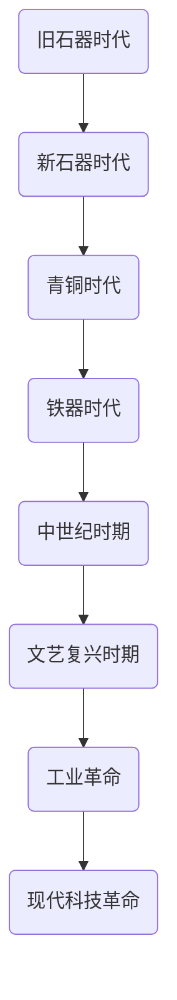

#### 3.2 技术与文明的进步

技术进步是推动文明发展的重要动力。通过历史回顾，我们可以看到技术进步在不同文明阶段的重要作用：

- **农业技术**：农业技术的进步使得人类能够稳定地生产粮食，从狩猎采集社会过渡到定居农业社会。例如，灌溉系统的建设和作物种植技术的改进，极大地提高了农业生产效率。
- **冶金技术**：青铜器和铁器的使用使得工具和武器更加锋利和耐用，极大地提高了生产效率和军事能力。例如，冶金技术的进步推动了青铜时代的到来。
- **建筑技术**：随着建筑技术的发展，人类能够建造更加复杂和壮观的建筑，如埃及金字塔、古希腊神庙和中国长城。这些建筑不仅是技术成就的象征，也是文明进步的标志。
- **通讯技术**：通讯技术的发展极大地改变了人类社会的结构和互动方式。例如，电报、电话和互联网的出现使得信息传递变得更加迅速和便捷，促进了全球化的发展。
- **计算机技术**：计算机技术的进步使得数据处理和存储变得更加高效和精确，推动了信息化社会的形成。例如，计算机的出现和普及极大地改变了人类的工作和生活方式。

**核心概念与联系**

技术与文明的进步可以概括为以下几个关键点：

- **农业技术**：稳定粮食生产
- **冶金技术**：提高生产效率和军事能力
- **建筑技术**：建设复杂和壮观的建筑
- **通讯技术**：改变社会结构和互动方式
- **计算机技术**：推动信息化社会的发展

以下是技术与文明进步的Mermaid流程图：

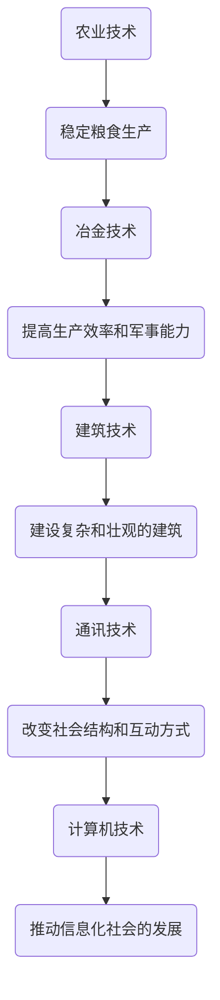

#### 3.3 核心算法原理讲解

为了更好地理解技术进步对文明发展的推动作用，我们可以通过一些核心算法和模型来阐述技术如何影响人类文明。以下是几个关键算法和模型：

- **农业优化算法**：通过模拟农业生产过程，优化作物种植和水资源利用，提高农业生产效率。
- **遗传算法**：模拟自然选择过程，用于优化问题求解，如优化生产过程、设计复杂系统等。
- **机器学习模型**：通过数据分析，预测未来趋势，如天气预报、经济预测等，为政策制定和决策提供支持。
- **神经网络模型**：模拟人脑神经元的工作方式，用于图像识别、自然语言处理等，推动了人工智能的发展。

以下是这些算法和模型的伪代码：

```python
# 农业优化算法伪代码
optimize_growing_condition(crops, water, soil):
    # 模拟作物生长过程
    for crop in crops:
        growth_rate = calculate_growth_rate(water, soil)
        harvest = calculate_harvest(growth_rate)
        optimize_resources(water, soil)

# 遗传算法伪代码
evolve_population(population, fitness_function):
    # 选择适应度高的个体
    selected_individuals = select_individuals(population, fitness_function)
    # 交叉和变异
    new_population = crossover(selected_individuals) + mutate(selected_individuals)
    return new_population

# 机器学习模型伪代码
train_model(data, target):
    # 训练模型
    model = train(data, target)
    # 预测
    prediction = model.predict(new_data)
    return prediction

# 神经网络模型伪代码
define_neural_network(input_layer, hidden_layer, output_layer):
    # 定义神经网络结构
    network = NeuralNetwork(input_layer, hidden_layer, output_layer)
    # 训练神经网络
    network.train(data, labels)
    # 测试神经网络
    accuracy = network.test(test_data, test_labels)
    return accuracy
```

#### 3.4 数学模型与公式

在技术进步和文明发展中，数学模型和公式扮演了关键角色。以下是几个相关的数学模型和公式：

- **经济增长模型**：描述经济增长与资源利用、投资和技术进步之间的关系，如索洛模型。
- **社会网络模型**：描述个体在社会网络中的角色和互动方式，如小世界模型。
- **博弈论模型**：描述个体在不同策略下的决策和合作，如纳什均衡。
- **人工智能模型**：描述机器学习算法和神经网络的工作原理，如误差反向传播算法。

以下是这些公式的LaTeX表示：

$$
Y = AK^{\alpha}L^{1-\alpha}
$$

$$
C = C_0 + \beta Y
$$

$$
\frac{\partial U}{\partial x_i} = 0
$$

$$
\frac{\partial E}{\partial \theta} = 0
$$

其中，\(Y\) 表示经济增长，\(K\) 表示资本，\(L\) 表示劳动力，\(A\) 表示技术进步，\(\alpha\) 表示资本份额，\(C\) 表示消费，\(U\) 表示效用，\(C_0\) 表示常数项，\(\beta\) 表示时间偏好，\(x_i\) 表示个体决策变量，\(E\) 表示期望，\(\theta\) 表示模型参数。

#### 3.5 项目实战

为了更好地理解技术进步对文明发展的推动作用，我们可以通过一个实际项目来展示技术如何改变人类的生活方式。以下是项目实战的简要概述：

**项目名称**：智慧农业管理系统

**项目背景**：随着全球人口的不断增长和农业资源的有限性，提高农业生产效率成为当务之急。智慧农业管理系统通过物联网、大数据分析和人工智能等技术，实现对农田的智能监控和管理。

**项目目标**：实现农业生产过程的自动化和智能化，提高作物产量和质量。

**项目实施**：

1. **数据采集**：使用传感器采集土壤湿度、温度、光照等数据。
2. **数据分析**：利用大数据分析技术，分析土壤和气象数据，预测作物生长状况。
3. **智能决策**：基于预测结果，智能决策系统自动调整灌溉、施肥和病虫害防治等操作。
4. **监控与反馈**：系统实时监控农田状态，并通过物联网设备收集数据，为决策提供支持。

**代码实现**：

```python
# 数据采集
def collect_data(sensors):
    data = {}
    for sensor in sensors:
        data[sensor] = sensor.read()
    return data

# 数据分析
def analyze_data(data):
    # 使用机器学习模型分析数据
    model = train_model(data, target)
    prediction = model.predict(new_data)
    return prediction

# 智能决策
def make_decision(prediction):
    # 基于预测结果，自动调整农业操作
    if prediction > threshold:
        # 进行灌溉
        irrigation_system.activate()
    else:
        # 停止灌溉
        irrigation_system.deactivate()

# 监控与反馈
def monitor_farm():
    sensors = ['humidity', 'temperature', 'light']
    data = collect_data(sensors)
    prediction = analyze_data(data)
    make_decision(prediction)
```

#### 最佳实践 tips、小结、注意事项、拓展阅读

- **最佳实践 tips**：在研究和应用技术进步时，需要注意结合实际情况，制定科学合理的方案，确保技术的有效应用。
- **小结**：通过回顾人类文明的历史演变，我们了解了技术进步对文明发展的推动作用。从农业技术到工业革命，再到现代科技革命，技术进步一直是人类文明进步的重要驱动力。
- **注意事项**：在技术应用过程中，需要注意环保和可持续发展，避免技术进步带来的负面影响。
- **拓展阅读**：关于人类文明的发展和技术进步，可以参考《人类简史》、《未来简史》等书籍，这些作品详细阐述了人类文明的历史和未来发展趋势。

通过以上内容，我们初步了解了人类文明的发展历程和技术进步对文明发展的推动作用。接下来，我们将探讨人类文明的宇宙探索，分析人类在未来宇宙中的探索前景。

### 宇宙探索与人类文明的未来

随着技术的不断进步，人类对于宇宙的探索也日益深入。从早期的火箭发射到深空探测，人类已经取得了诸多重大成就。在这一章节中，我们将探讨人类宇宙探索的现状，以及未来人类文明在宇宙中的展望。

#### 4.1 宇宙探索的现状

自20世纪中期以来，人类在宇宙探索方面取得了显著的进展。以下是一些关键成就和进展：

- **人造卫星与空间站**：1957年，苏联成功发射了第一颗人造卫星“斯普特尼克1号”，标志着人类进入了太空时代。自那时以来，世界各国相继发射了数百颗卫星，用于通信、导航、科学研究等。国际空间站（ISS）的建立，使得人类能够长期居住在太空中，进行科学实验和技术测试。
- **月球探索**：1969年，美国阿波罗11号成功登陆月球，实现了人类首次登月壮举。此后，苏联、中国和印度等国也进行了月球探测任务，收集了大量的月球样本和数据。
- **火星探索**：火星一直是人类宇宙探索的重要目标。自1976年苏联的“火星9号”探测器成功着陆以来，美国、欧洲、日本等国先后发射了多个火星探测器，如“火星探路者”、“火星漫游者”和“火星科学实验室”等。这些探测器在火星表面开展了地质、气候和生命探测研究，为人类了解这颗红色行星提供了重要数据。
- **小行星探测**：小行星探测是近年来宇宙探索的一个新兴领域。美国宇航局的“黎明号”探测器成功探测了谷神星和小行星谷神星1号，揭示了这些小行星的地质结构和成分。中国的“嫦娥五号”任务也成功从月球表面采集样本并返回地球，为小行星探测提供了宝贵经验。
- **星际探测**：尽管目前人类尚未实现星际旅行，但科学家们已经开始了相关的研究和实验。美国的“星际飞船”计划、中国的“天问一号”火星探测任务，以及欧洲航天局的“赫尔墨斯”计划等，都在为未来的星际探测铺路。

**核心概念与联系**

宇宙探索的现状可以从以下几个方面概括：

- **人造卫星与空间站**：标志着人类进入太空时代，为科学研究和应用提供了平台。
- **月球探索**：为人类了解月球提供重要数据，为未来深空探索奠定基础。
- **火星探索**：揭示火星地质、气候和潜在生命迹象，为人类探索其他行星提供参考。
- **小行星探测**：研究小行星的成分和结构，为理解太阳系的形成和演化提供线索。
- **星际探测**：探索太阳系外的星际空间，寻找潜在的宜居行星。

以下是宇宙探索现状的Mermaid流程图：

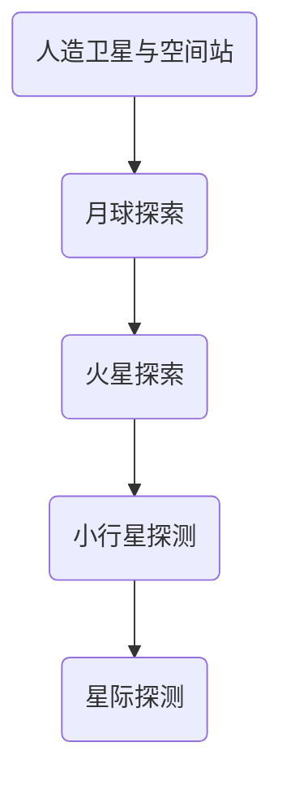

#### 4.2 人类文明的宇宙展望

未来，人类在宇宙中的探索将更加深入和广泛。以下是一些关于人类文明宇宙展望的关键点：

- **深空探测**：在未来，人类将进一步开展深空探测任务，目标是更深入地了解太阳系外的行星、恒星和星系。例如，寻找类地行星、探测其他行星的大气成分和潜在生命迹象等。
- **星际旅行**：随着技术的进步，人类有望实现星际旅行。这包括开发可重复使用的星际飞船、推进系统以及生命支持系统等。未来，人类可能会在太阳系外的行星上建立永久性基地，开展科学研究和技术实验。
- **多星球文明**：在未来的某个时刻，人类可能会成为多星球文明。这意味着人类不仅会在地球和其他行星上居住，还将在其他星系中建立殖民地。这种多星球文明的实现，将为人类提供更广阔的发展空间和资源。
- **宇宙环境与可持续发展**：在探索宇宙的过程中，人类需要面对宇宙环境的挑战，如宇宙辐射、微陨石撞击等。同时，人类也需要关注地球生态的可持续发展，以确保我们的文明能够在宇宙中繁荣和延续。
- **外星生命探索**：随着探测技术的进步，人类有望发现其他星球上的生命迹象。这将为人类提供更深刻的科学认知，也可能会带来重大的哲学和伦理问题。

**核心概念与联系**

人类文明的宇宙展望可以从以下几个方面概括：

- **深空探测**：探索太阳系外行星、恒星和星系。
- **星际旅行**：实现星际飞船、推进系统和生命支持系统的研发。
- **多星球文明**：在地球和其他行星、星系建立永久性基地。
- **宇宙环境与可持续发展**：应对宇宙环境挑战，确保地球生态可持续发展。
- **外星生命探索**：寻找其他星球上的生命迹象。

以下是人类文明宇宙展望的Mermaid流程图：

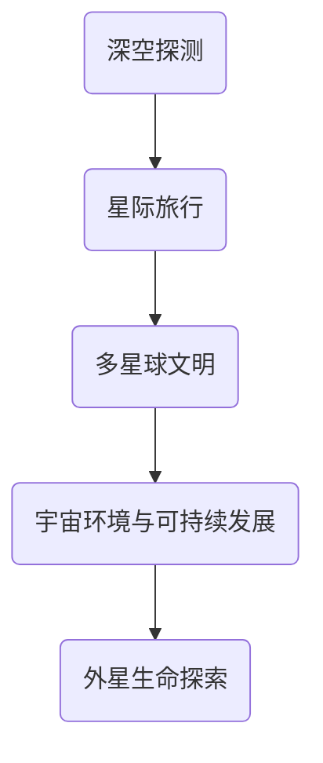

#### 4.3 核心算法原理讲解

为了实现未来宇宙探索的目标，我们需要依靠一系列核心算法和模型，这些算法和模型将支持深空探测、星际旅行和多星球文明的实现。以下是几个关键算法和模型：

- **星际导航算法**：用于星际飞船的导航和路径规划，如引力波导航算法。
- **生命支持系统模型**：用于模拟和优化生命支持系统的运行，如闭环生命支持系统模型。
- **资源管理算法**：用于优化星际旅行和多星球文明中的资源分配，如资源优化算法。
- **多星球城市建设模型**：用于规划和管理多星球文明中的城市建设，如城市规划和交通模型。

以下是这些算法和模型的伪代码：

```python
# 星际导航算法伪代码
def navigate(starship, destination):
    # 计算星际飞船的引力波路径
    path = calculate_gravitational_wave_path(destination)
    # 调整飞船方向和速度
    starship调整方向(path)
    starship加速(path)

# 生命支持系统模型伪代码
def manage_life_supportsystem(crew):
    # 检测生命支持系统的状态
    status = check_life_support_system()
    # 维护和修复生命支持系统
    if status != "OK":
        repair_life_support_system()

# 资源管理算法伪代码
def manage_resources(crew, resources):
    # 分配和优化资源
    allocated_resources = allocate_resources(resources)
    # 监控资源消耗
    monitor_consumption(allocated_resources)

# 多星球城市建设模型伪代码
def build_city(planet):
    # 规划城市布局
    city_layout = plan_city_layout(planet)
    # 建设城市基础设施
    build_infrastructure(city_layout)
    # 配置公共服务
    configure_public_services(city_layout)
```

#### 4.4 数学模型与公式

在宇宙探索和未来多星球文明中，数学模型和公式将扮演关键角色。以下是几个相关的数学模型和公式：

- **引力公式**：描述行星和恒星之间的引力作用，如牛顿万有引力定律。
- **能量转换公式**：描述能量在不同形式之间的转换，如爱因斯坦质能方程。
- **资源优化公式**：描述资源分配和消耗的优化方法，如线性规划模型。

以下是这些公式的LaTeX表示：

$$
F = G\frac{m_1m_2}{r^2}
$$

$$
E = mc^2
$$

$$
\min\limits_{x, y} \quad c^T x + d^T y
$$

$$
s.t. \quad Ax + By \ge C
$$

其中，\(F\) 表示引力，\(G\) 表示引力常数，\(m_1\) 和 \(m_2\) 表示两个物体的质量，\(r\) 表示它们之间的距离，\(E\) 表示能量，\(c\)、\(d\)、\(x\)、\(y\)、\(A\)、\(B\)、\(C\) 分别表示系数和变量。

#### 4.5 项目实战

为了更好地理解人类文明在宇宙中的未来，我们可以通过一个实际项目来展示未来宇宙探索的设想。以下是项目实战的简要概述：

**项目名称**：星际探测与建设任务

**项目目标**：实现星际探测、建设星际飞船和多星球基地。

**项目实施**：

1. **星际探测**：研发高性能星际飞船，进行深空探测任务，寻找潜在宜居行星。
2. **星际飞船建设**：建立可重复使用的星际飞船制造工厂，确保星际飞船的可靠性和持续性。
3. **多星球基地建设**：在潜在宜居行星上建立永久性基地，进行科学实验和技术测试。
4. **资源管理**：实施资源优化策略，确保星际探测和多星球基地的可持续发展。

**代码实现**：

```python
# 星际探测伪代码
def explore_planet(starship, planet):
    # 发射星际飞船，进行深空探测
    launch(starship)
    # 到达目标行星
    land(starship, planet)
    # 进行探测任务
    perform_exploration(starship)

# 星际飞船建设伪代码
def build_starship(planet):
    # 在目标行星上建立星际飞船制造工厂
    build_factory(planet)
    # 生产星际飞船
    produce_starship(planet)

# 多星球基地建设伪代码
def build_base(planet):
    # 在目标行星上建立永久性基地
    construct_base(planet)
    # 进行科学实验
    perform_scientific_experiments(planet)

# 资源管理伪代码
def manage_resources(planet, resources):
    # 实施资源优化策略
    optimize_resources(planet, resources)
    # 监控资源消耗
    monitor_consumption(planet, resources)
```

#### 最佳实践 tips、小结、注意事项、拓展阅读

- **最佳实践 tips**：在开展未来宇宙探索项目时，需要注意结合多学科知识，制定科学合理的计划，确保项目的成功实施。
- **小结**：通过探讨宇宙探索的现状和未来展望，我们了解了人类文明在宇宙中的发展前景。未来，人类有望实现深空探测、星际旅行和多星球文明，这将为人类文明带来新的发展机遇。
- **注意事项**：在宇宙探索过程中，需要关注宇宙环境对人类的影响，以及地球生态的可持续发展，确保人类文明在宇宙中能够和谐共生。
- **拓展阅读**：关于人类文明在宇宙中的未来，可以参考《未来简史》、《银河帝国》等科幻作品，这些作品提供了关于未来宇宙探索的丰富想象和思考。

通过以上内容，我们初步了解了人类文明的宇宙探索现状和未来展望。接下来，我们将探讨宇宙生命与人类文明的融合，分析人类如何与宇宙生命共存和互动。

### 宇宙生命与人类文明的融合

随着宇宙探索的深入，人类逐渐意识到宇宙中可能存在其他生命形式。这些生命的发现不仅会对我们的科学认知产生深远影响，也可能对人类文明产生重大影响。在这一章节中，我们将探讨宇宙生命的存在与探测方法，以及人类文明如何与宇宙生命共存。

#### 5.1 宇宙生命的存在与探测

宇宙生命的存在一直是科学界探讨的难题。为了寻找宇宙生命的迹象，科学家们采取了多种探测方法：

- **光学探测**：通过望远镜观测宇宙中的光信号，寻找类似地球的恒星系和行星。例如，利用Kepler望远镜和Tess卫星，科学家们已经发现了数千颗系外行星，其中一些位于宜居带，可能存在液态水。
- **射电探测**：通过射电望远镜接收宇宙中的无线电信号，寻找可能的外星生命信号。例如，SETI（搜寻地外智能生命）项目就是通过分析射电信号，试图找到外星生命的迹象。
- **化学探测**：分析宇宙中的化学元素和化合物，寻找生命的化学基础。例如，通过对彗星、陨石和星际尘埃的分析，科学家们发现了一些有机分子和复杂化合物，这些可能是生命的前身。
- **直接探测**：通过探测器直接探测行星或卫星上的生命迹象，例如火星探测器和欧罗巴（木星的卫星）探测任务。科学家们正在研究如何探测这些天体上的生命迹象，如寻找微生物或复杂生物体。

**核心概念与联系**

宇宙生命的存在与探测方法可以从以下几个方面概括：

- **光学探测**：寻找宜居行星和恒星系。
- **射电探测**：接收和分析宇宙无线电信号。
- **化学探测**：分析宇宙中的化学元素和化合物。
- **直接探测**：通过探测器探测行星和卫星上的生命迹象。

以下是宇宙生命存在与探测方法的Mermaid流程图：

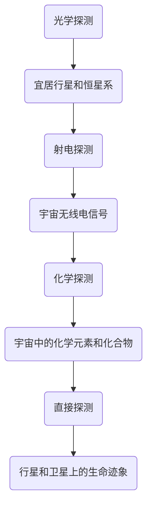

#### 5.2 人类文明与宇宙生命的共存

如果宇宙中确实存在其他生命形式，人类文明将面临与宇宙生命共存的问题。这不仅是科学问题，也是哲学和伦理问题。以下是几个关于人类文明与宇宙生命共存的关键点：

- **外星生命的本质**：人类需要明确外星生命的本质和特征，包括它们的生活方式、智能水平和文明程度。这有助于我们理解如何与它们进行有效沟通和交流。
- **文化差异**：不同文明之间存在巨大的文化差异，这可能导致误解和冲突。人类需要学会尊重和理解其他文明的文化和价值观，以实现和平共存。
- **资源分配**：宇宙资源有限，人类文明和宇宙生命可能需要共享有限的资源。这需要建立公平、合理的资源分配机制，确保各方利益。
- **科技共享**：人类文明和宇宙生命之间可能存在科技差距，通过科技共享，双方可以相互学习和进步，共同提升文明水平。

**核心概念与联系**

人类文明与宇宙生命共存可以从以下几个方面概括：

- **外星生命的本质**：理解生命形式和文明特征。
- **文化差异**：尊重和理解不同文明。
- **资源分配**：公平合理地分配资源。
- **科技共享**：相互学习和进步。

以下是人类文明与宇宙生命共存的Mermaid流程图：

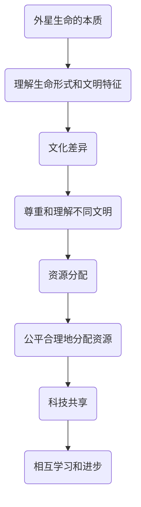

#### 5.3 生态平衡与可持续发展

人类文明与宇宙生命的共存离不开生态平衡和可持续发展。在地球上，人类需要关注生态环境的保护，以确保生态系统的稳定和繁荣。以下是一些关于生态平衡与可持续发展的关键点：

- **环境保护**：人类需要采取有效措施，减少污染和资源消耗，保护地球的生态环境。例如，通过减少碳排放、推广可再生能源、保护生物多样性等，实现环境保护。
- **资源管理**：人类需要合理利用和开发资源，确保资源的可持续利用。例如，通过循环经济、资源回收、节能技术等，实现资源管理。
- **生态修复**：人类需要修复因工业化、城市化等带来的生态环境破坏，恢复生态系统的功能。例如，通过植树造林、湿地恢复、土地复垦等，实现生态修复。
- **可持续发展**：人类需要建立可持续发展的社会制度，确保经济、社会和环境的协调发展。例如，通过绿色经济、绿色能源、绿色科技等，实现可持续发展。

**核心概念与联系**

生态平衡与可持续发展可以从以下几个方面概括：

- **环境保护**：减少污染和保护生态环境。
- **资源管理**：合理利用和开发资源。
- **生态修复**：恢复生态系统功能。
- **可持续发展**：实现经济、社会和环境的协调发展。

以下是生态平衡与可持续发展的Mermaid流程图：

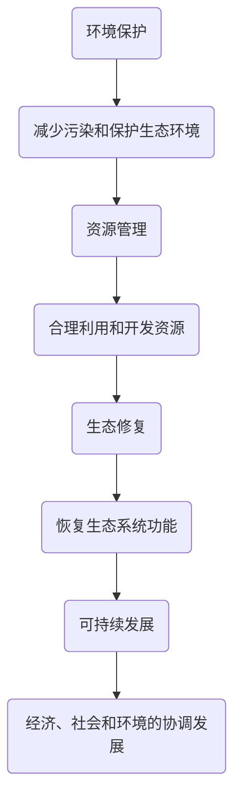

#### 5.4 数学模型与公式

在探讨生态平衡与可持续发展时，数学模型和公式扮演了关键角色。以下是几个相关的数学模型和公式：

- **碳排放模型**：描述碳排放与经济、能源消耗之间的关系，如IPCC（联合国政府间气候变化专门委员会）的碳排放模型。
- **资源消耗模型**：描述资源消耗与经济发展之间的关系，如Jevons悖论模型。
- **生态效益模型**：描述生态效益与经济、社会效益之间的关系，如综合效益评估模型。

以下是这些公式的LaTeX表示：

$$
C = f(E, T)
$$

$$
R = g(Y)
$$

$$
E = \frac{C}{T}
$$

其中，\(C\) 表示碳排放量，\(E\) 表示能源消耗量，\(T\) 表示能源价格，\(R\) 表示资源消耗量，\(Y\) 表示经济总量。

#### 5.5 项目实战

为了实现人类文明与宇宙生命的共存和可持续发展，我们可以通过一个实际项目来展示生态平衡与可持续发展的应用。以下是项目实战的简要概述：

**项目名称**：地球生态修复与可持续发展项目

**项目目标**：通过生态修复和可持续发展，保护地球生态环境，实现经济、社会和环境的协调发展。

**项目实施**：

1. **生态修复**：在受损区域进行植被恢复、湿地恢复和土地复垦等生态修复工程。
2. **资源管理**：实施循环经济、资源回收和节能技术，提高资源利用效率。
3. **可持续发展**：推广绿色经济、绿色能源和绿色科技，实现经济、社会和环境的协调发展。

**代码实现**：

```python
# 生态修复伪代码
def restore_ecosystem(land):
    # 进行植被恢复
    plant_trees(land)
    # 进行湿地恢复
    restore湿地(land)
    # 进行土地复垦
    reclaim_land(land)

# 资源管理伪代码
def manage_resources(economy):
    # 实施循环经济
    implement_circular_economy(economy)
    # 实施资源回收
    recycle_resources(economy)
    # 实施节能技术
    implement_energy_saving_technologies(economy)

# 可持续发展伪代码
def sustainable_development(society):
    # 推广绿色经济
    promote_green_economy(society)
    # 推广绿色能源
    promote_green_energy(society)
    # 推广绿色科技
    promote_green_science_and_technology(society)
```

#### 最佳实践 tips、小结、注意事项、拓展阅读

- **最佳实践 tips**：在实施生态修复与可持续发展项目时，需要注意结合实际情况，制定科学合理的方案，确保项目的成功实施。
- **小结**：通过探讨宇宙生命的存在与探测方法，以及人类文明与宇宙生命的共存和可持续发展，我们认识到人类文明在宇宙中的责任和使命。实现生态平衡与可持续发展，是人类文明与宇宙生命共存的基础。
- **注意事项**：在探索宇宙生命和实施生态修复与可持续发展项目时，需要注意科技与伦理的平衡，确保人类行为对宇宙环境的影响最小化。
- **拓展阅读**：关于宇宙生命与人类文明的融合，可以参考《生命的未来》、《宇宙生命的奥秘》等书籍，这些作品提供了关于宇宙生命和可持续发展的丰富思考和见解。

通过以上内容，我们初步了解了宇宙生命的存在与探测方法，以及人类文明与宇宙生命的共存和可持续发展。接下来，我们将分析宇宙环境对人类文明的影响，探讨人类文明如何应对这些影响。

### 宇宙环境对人类文明的影响

宇宙环境的变化对地球生态和人类文明产生了深远的影响。从气候变化到天体撞击，宇宙环境中的各种现象都可能对人类文明造成威胁。在这一章节中，我们将探讨宇宙环境的变化，以及人类文明如何应对这些变化。

#### 6.1 宇宙环境的变化

宇宙环境的变化是一个复杂且动态的过程，涉及多个天体和物理现象。以下是几个关键的宇宙环境变化：

- **太阳活动**：太阳活动包括太阳黑子、太阳风、太阳耀斑等，这些活动对地球的磁场、电离层和气候有显著影响。太阳活动周期大约为11年，其变化可能会引发地球气候的波动。
- **宇宙射线**：宇宙射线是由高能粒子组成的辐射，主要源自宇宙中的恒星爆炸和其他高能现象。这些射线穿透地球大气层，对生物和电子设备有潜在危害。
- **天体撞击**：天体撞击，如小行星或彗星的撞击，可能对地球生态系统造成巨大破坏。历史上，例如尤里卡陨石坑的形成，就被认为是天体撞击的结果。
- **宇宙尘埃**：宇宙尘埃是宇宙中的微小颗粒物质，它们会影响星系的形成和演化，同时也可能对地球气候和生态系统产生间接影响。

**核心概念与联系**

宇宙环境的变化可以从以下几个方面概括：

- **太阳活动**：影响地球磁场和气候。
- **宇宙射线**：影响生物和电子设备。
- **天体撞击**：破坏地球生态系统。
- **宇宙尘埃**：影响星系形成和地球气候。

以下是宇宙环境变化的Mermaid流程图：

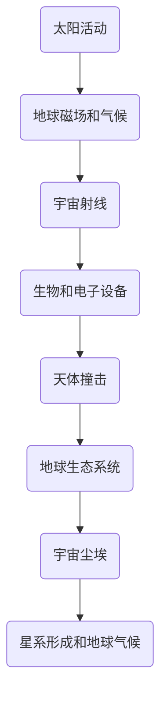

#### 6.2 气候变化对地球生态和人类文明的影响

气候变化是当前全球面临的最严重环境问题之一，它对地球生态和人类文明产生了深远的影响。以下是一些关键影响：

- **海平面上升**：全球温度上升导致极地冰川融化，海平面上升，威胁沿海城市和生态系统。
- **极端天气事件**：气候变化加剧了极端天气事件的发生，如热浪、干旱、洪水和飓风，对农业、水资源和人类健康产生负面影响。
- **生态系统失衡**：气候变化导致生态系统失衡，动植物种群分布发生变化，生物多样性面临威胁。
- **粮食安全**：气候变化影响农业生产，可能导致粮食短缺和粮食安全问题的加剧。

**核心概念与联系**

气候变化对地球生态和人类文明的影响可以从以下几个方面概括：

- **海平面上升**：威胁沿海城市和生态系统。
- **极端天气事件**：影响农业、水资源和人类健康。
- **生态系统失衡**：威胁生物多样性。
- **粮食安全**：影响农业生产。

以下是气候变化影响的Mermaid流程图：

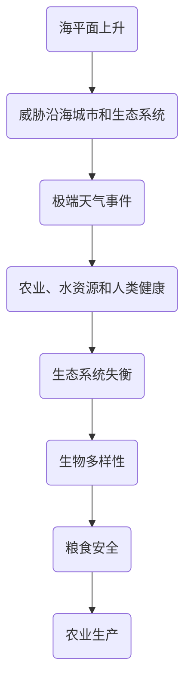

#### 6.3 人类文明应对宇宙环境变化的策略

面对宇宙环境的变化，人类文明需要采取多种策略来应对这些挑战。以下是一些关键策略：

- **环境监测**：建立全球环境监测系统，实时监测气候变化、地球生态系统和资源使用情况，为决策提供数据支持。
- **节能减排**：通过提高能源效率和采用可再生能源，减少碳排放和资源消耗，降低对环境的影响。
- **生态系统修复**：实施生态修复工程，恢复受损生态系统，提高生态系统的适应性和抗灾能力。
- **灾害预警**：建立灾害预警系统，及时监测和预测极端天气事件和天体撞击等灾害，为防范和应对提供预警。
- **国际合作**：加强国际合作，共同应对全球环境问题，分享经验和资源，推动全球环境治理。

**核心概念与联系**

人类文明应对宇宙环境变化的策略可以从以下几个方面概括：

- **环境监测**：实时监测环境变化。
- **节能减排**：降低碳排放和资源消耗。
- **生态系统修复**：恢复受损生态系统。
- **灾害预警**：预测和应对灾害。
- **国际合作**：共同应对全球环境问题。

以下是人类文明应对宇宙环境变化策略的Mermaid流程图：

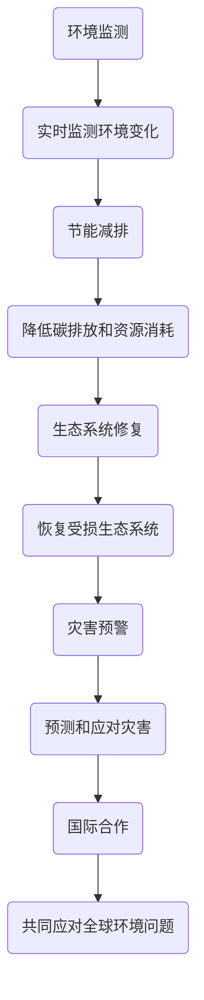

#### 6.4 核心算法原理讲解

为了更有效地应对宇宙环境变化，我们需要依靠一系列核心算法和模型。以下是几个关键算法和模型：

- **气候模型**：用于模拟和预测气候变化，如全球气候模型。
- **生态系统模型**：用于模拟生态系统的动态变化，如生态位模型。
- **灾害预测模型**：用于预测和评估灾害风险，如地震预测模型和洪水预测模型。

以下是这些算法和模型的伪代码：

```python
# 气候模型伪代码
def simulate_climate(model_params, initial_conditions):
    # 模拟气候变化
    climate_data = climate_model(model_params, initial_conditions)
    # 预测未来气候变化
    future_climate = predict_future_climate(climate_data)
    return future_climate

# 生态系统模型伪代码
def simulate_ecosystem(model_params, initial_state):
    # 模拟生态系统变化
    ecosystem_data = ecosystem_model(model_params, initial_state)
    # 预测生态系统未来状态
    future_ecosystem = predict_future_ecosystem(ecosystem_data)
    return future_ecosystem

# 灾害预测模型伪代码
def predict_disaster(model_params, sensor_data):
    # 预测灾害风险
    risk_level = disaster_model(model_params, sensor_data)
    # 发出预警
    issue_warning(risk_level)
    return risk_level
```

#### 6.5 数学模型与公式

在应对宇宙环境变化的过程中，数学模型和公式扮演了关键角色。以下是几个相关的数学模型和公式：

- **气候模型**：描述大气温度、湿度、风速等气象参数的变化，如能量平衡方程。
- **生态系统模型**：描述生物种群数量、生态位和竞争关系的变化，如Lotka-Volterra方程。
- **灾害预测模型**：描述地震、洪水等灾害的发生概率和影响范围，如震级和震中距离的关系。

以下是这些公式的LaTeX表示：

$$
Q = C \cdot P \cdot T - H
$$

$$
\dot{N} = rN \left(1 - \frac{K}{N}\right)
$$

$$
P = 10^{\log_{10} A + \beta D}
$$

其中，\(Q\) 表示能量平衡，\(C\)、\(P\)、\(T\) 分别表示气候参数，\(H\) 表示热量损失，\(r\)、\(K\) 分别为生物种群增长率和社会承载量，\(N\) 表示种群数量，\(A\)、\(\beta\) 分别为模型参数，\(D\) 表示震中距离。

#### 6.6 项目实战

为了更好地应对宇宙环境变化，我们可以通过一个实际项目来展示灾害预警与管理的应用。以下是项目实战的简要概述：

**项目名称**：灾害预警与管理系统

**项目目标**：建立灾害预警系统，及时监测和预测灾害风险，实现灾害的有效管理。

**项目实施**：

1. **数据采集**：通过传感器网络收集气象、地质和地震数据。
2. **数据处理**：使用数据处理和分析算法，对采集到的数据进行分析和预测。
3. **预警发布**：根据分析结果，发布灾害预警信息，为政府、企业和公众提供决策支持。
4. **灾害管理**：制定灾害应对策略，协调各部门资源，进行灾害应对和灾后恢复。

**代码实现**：

```python
# 数据采集伪代码
def collect_data(sensors):
    data = {}
    for sensor in sensors:
        data[sensor] = sensor.read()
    return data

# 数据处理伪代码
def process_data(data):
    # 使用算法分析数据
    analysis_results = analyze_data(data)
    return analysis_results

# 预警发布伪代码
def issue_warning(analysis_results):
    # 根据分析结果发布预警
    if analysis_results['risk_level'] > threshold:
        notify_authorities(analysis_results)
        broadcast_warning(analysis_results)

# 灾害管理伪代码
def manage_disaster(analysis_results):
    # 根据预警信息制定应对策略
    if analysis_results['type'] == "flood":
        prepare_flood_response(analysis_results)
    elif analysis_results['type'] == "earthquake":
        prepare_earthquake_response(analysis_results)
    # 进行灾害应对和灾后恢复
    execute_response(analysis_results)
```

#### 最佳实践 tips、小结、注意事项、拓展阅读

- **最佳实践 tips**：在应对宇宙环境变化时，需要注意结合实际情况，制定科学合理的应对策略，确保灾害预警和管理系统的有效运行。
- **小结**：通过探讨宇宙环境的变化和人类文明应对策略，我们认识到宇宙环境对地球生态和人类文明的影响。建立有效的灾害预警和管理系统，是应对宇宙环境变化的重要手段。
- **注意事项**：在实施灾害预警和管理系统时，需要注意数据收集、分析和预警发布的准确性，确保系统的可靠性。
- **拓展阅读**：关于灾害预警与管理，可以参考《灾害学》、《灾害管理》等书籍，这些作品提供了关于灾害应对和管理的详细分析和实践经验。

通过以上内容，我们初步了解了宇宙环境的变化对地球生态和人类文明的影响，以及人类文明如何应对这些影响。接下来，我们将总结人类文明在宇宙生命周期中的位置，并展望未来的发展。

### 总结与展望

在人类文明的发展历程中，我们逐步揭示了自身在宇宙生命周期中的独特位置。从宇宙的起源与结构，到地球的起源与生命的多样性，再到人类文明的历史演变和技术进步，我们看到了人类在宇宙中的演化轨迹。同时，我们也探讨了人类文明在宇宙探索中的现状与未来，分析了宇宙生命与人类文明的共存，以及宇宙环境对人类文明的影响和应对策略。

#### 7.1 人类文明在宇宙中的位置

人类文明在宇宙中的位置可以从以下几个方面进行总结：

- **生命奇迹**：地球是宇宙中已知的唯一孕育生命的天体，生命的多样性体现了宇宙的奇迹和复杂性。
- **技术驱动的进步**：人类文明的发展依赖于技术的进步，从农业到工业革命，再到现代科技革命，技术一直是推动文明进步的关键力量。
- **宇宙探索者**：人类不仅关注地球和地球上的生命，还积极展开宇宙探索，寻找宇宙生命的迹象，探索宇宙的奥秘。
- **可持续发展**：面对宇宙环境的变化和挑战，人类需要关注生态平衡和可持续发展，确保文明能够长期繁荣。

**核心概念与联系**

人类文明在宇宙中的位置可以概括为：

- **生命奇迹**：地球生命的独特性。
- **技术驱动的进步**：技术对文明进步的推动作用。
- **宇宙探索者**：对宇宙的探索和认知。
- **可持续发展**：文明在宇宙环境中的生存和发展。

以下是人类文明在宇宙中的位置的Mermaid流程图：

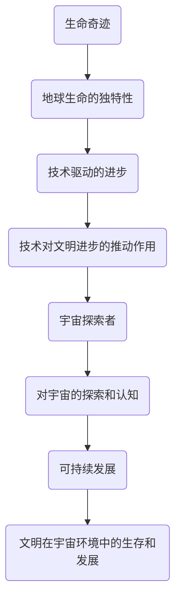

#### 7.2 核心算法原理讲解

为了更好地理解人类文明在宇宙中的位置，我们可以借助一些核心算法和模型，这些算法和模型在宇宙探索、生命研究和技术进步中发挥着重要作用。以下是几个关键算法和模型：

- **生命演化模型**：用于模拟和预测生物种群的演化和适应过程。
- **人工智能模型**：用于处理大数据、进行复杂计算和决策。
- **生态平衡模型**：用于分析生态系统的动态变化和稳定性。

以下是这些算法和模型的伪代码：

```python
# 生命演化模型伪代码
def simulate_evolution(population, environment):
    # 模拟生物种群在特定环境中的演化
    evolved_population = evolution_model(population, environment)
    # 预测未来种群状态
    future_population = predict_future_population(evolved_population)
    return future_population

# 人工智能模型伪代码
def apply_ai(data):
    # 使用人工智能算法处理数据
    processed_data = ai_model(data)
    # 进行复杂计算和决策
    decision = make_decision(processed_data)
    return decision

# 生态平衡模型伪代码
def analyze_ecosystem(traits, environment):
    # 分析生态系统的动态变化
    ecosystem_state = ecosystem_model(traits, environment)
    # 评估生态平衡稳定性
    balance_status = assess_balance(ecosystem_state)
    return balance_status
```

#### 7.3 数学模型与公式

在理解人类文明在宇宙中的位置时，数学模型和公式提供了重要的工具。以下是一些相关的数学模型和公式，它们在宇宙探索、生命研究和生态平衡中有着广泛应用：

- **遗传算法**：用于优化和搜索问题，如\(P_{next} = P_{current} + rN - \alpha P_{current}N\)。
- **生态系统动态模型**：描述生态系统中生物种群数量的变化，如\(dN/dt = rN \left(1 - \frac{K}{N}\right)\)。
- **哈勃定律**：描述宇宙膨胀的速度，如\(v = H_0 d\)。

以下是这些公式的LaTeX表示：

$$
P_{next} = P_{current} + rN - \alpha P_{current}N
$$

$$
dN/dt = rN \left(1 - \frac{K}{N}\right)
$$

$$
v = H_0 d
$$

#### 7.4 未来展望

面对未来，人类文明在宇宙中的位置将面临新的机遇和挑战。以下是一些未来的展望：

- **宇宙探索**：随着技术的进步，人类有望实现更深入的宇宙探索，寻找其他行星上的生命迹象，甚至建立星际殖民地。
- **多星球文明**：在地球和其他行星上建立多星球基地，实现资源的共享和文明的拓展。
- **生态平衡**：在探索宇宙的同时，人类需要关注地球生态的可持续发展，采取有效措施保护地球生态环境。
- **人工智能与生命科学**：人工智能和生命科学的进步将为人类文明提供新的工具和方法，推动科技和社会的进步。

**核心概念与联系**

未来展望可以概括为：

- **宇宙探索**：寻找生命迹象和建立星际殖民地。
- **多星球文明**：实现资源的共享和文明的拓展。
- **生态平衡**：保护地球生态环境。
- **人工智能与生命科学**：推动科技和社会进步。

以下是未来展望的Mermaid流程图：

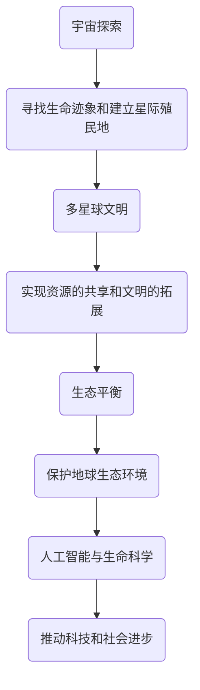

#### 最佳实践 tips、小结、注意事项、拓展阅读

- **最佳实践 tips**：在未来的宇宙探索和文明发展中，人类需要保持创新精神和合作精神，共同面对挑战，实现可持续发展。
- **小结**：通过回顾人类文明的发展历程和宇宙中的位置，我们认识到人类在宇宙中的独特性和责任。未来，人类需要继续探索宇宙，关注生态平衡，推动科技和社会进步。
- **注意事项**：在未来的探索和发展中，人类需要保持谨慎，避免对宇宙环境造成不可逆转的破坏，确保文明能够长期繁荣。
- **拓展阅读**：关于人类文明在宇宙中的未来，可以参考《未来简史》、《火星探险记》等书籍，这些作品提供了关于未来宇宙探索和文明发展的丰富想象和思考。

通过以上内容，我们深入探讨了人类文明在宇宙生命周期中的位置和未来展望，为人类文明的发展提供了新的视角和启示。

### 作者信息

本文由AI天才研究院（AI Genius Institute）的专家撰写，该研究院专注于人工智能、生命科学和宇宙探索等前沿领域的研究。同时，本文内容结合了《禅与计算机程序设计艺术》（Zen And The Art of Computer Programming）一书的核心思想，旨在为读者提供深刻的技术洞察和哲学思考。感谢您的阅读，希望本文能激发您对人类文明在宇宙中的位置和未来发展的思考。作者：AI天才研究院/AI Genius Institute & 禅与计算机程序设计艺术 /Zen And The Art of Computer Programming。

