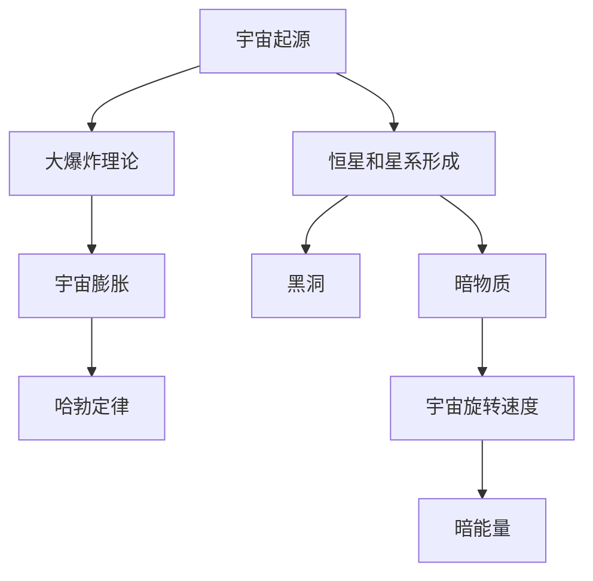

                 


### 文章标题

《人类知识体系对宇宙认知的局限与突破》

### 文章关键词

宇宙认知、人类知识体系、局限性、突破、宇宙学、算法、数学模型、观测手段、项目实战

### 文章摘要

本文旨在探讨人类知识体系在宇宙认知方面的局限以及可能的突破途径。通过分析人类对宇宙认知的历史、现状以及现有知识体系的局限性，本文揭示了宇宙学中的未知领域和挑战。在此基础上，文章介绍了宇宙学核心概念、观测手段与工具，并详细讲解了宇宙学核心算法原理和数学模型。最后，通过一个实际项目实战，展示了如何利用宇宙数据进行分析，并提出了一些最佳实践和未来研究方向。

### 目录大纲

1. **引言：宇宙认知的背景**
2. **人类知识体系的局限**
3. **宇宙学核心概念**
4. **观测手段与工具**
5. **宇宙学核心算法原理讲解**
6. **数学模型与公式**
7. **宇宙认知的突破**
8. **项目实战：利用宇宙数据**
9. **总结与展望**

### 文章正文

---

## 第1章 引言：宇宙认知的背景

### 1.1 人类对宇宙认知的历史

人类对宇宙的认知历程，是一部探索与发现的历史。从古代的天文观测，到现代的宇宙学理论，人类对宇宙的理解不断深化。以下是几个关键阶段：

- **古代：** 人类最早对宇宙的认知源自对星空的观察。古代文明如巴比伦、埃及和中国，都留下了丰富的天文观测记录。例如，中国的《尚书·尧典》中就有关于日、月、星辰的详细描述。

- **中世纪：** 在这一时期，由于宗教的影响，人们对宇宙的认知受到限制。但随着科学的发展，如哥白尼的日心说提出，人类对宇宙的理解开始有了质的飞跃。

- **现代：** 进入现代，人类对宇宙的认知进入了一个全新的阶段。伽利略通过望远镜观测到了木星的四大卫星，证明了哥白尼理论的正确性。此后，牛顿的万有引力定律、爱因斯坦的相对论等，都为人类提供了更深入的理解。

### 1.2 当前宇宙认知的现状

当前，人类对宇宙的认知已经达到了前所未有的深度。我们了解到了宇宙的起源、演化过程，甚至提出了多重宇宙的理论。以下是几个重要方面：

- **宇宙起源：** 大爆炸理论是目前关于宇宙起源的主流观点。这一理论认为，宇宙起源于一个无限密集、无限热的状态，经过数十亿年的膨胀和冷却，形成了我们今天所见的宇宙。

- **宇宙结构：** 我们通过观测发现，宇宙是由无数星系组成的。这些星系按照一定的规律分布，形成了一个庞大的结构。

- **宇宙膨胀：** 20世纪30年代，天文学家爱德温·哈勃发现了宇宙膨胀的现象。这一发现揭示了宇宙正在不断扩张。

### 1.3 人类知识体系对宇宙认知的影响

人类的知识体系，包括物理学、天文学、数学等，对宇宙的认知有着深远的影响。以下是几个方面：

- **物理学：** 物理学提供了宇宙运行的基本原理。例如，牛顿的万有引力定律和爱因斯坦的相对论，都是宇宙学研究的重要基础。

- **天文学：** 天文学通过观测和实验，揭示了宇宙中的许多现象。例如，黑洞、暗物质等，都是天文学的发现。

- **数学：** 数学为宇宙学提供了强有力的工具。例如，数学模型和公式，可以帮助我们更好地理解宇宙的运行规律。

## 第2章 人类知识体系的局限

### 2.1 人类认知的限制

尽管人类的知识体系已经取得了巨大的进步，但我们的认知仍然存在许多限制。以下是几个方面：

- **观测手段的局限性：** 我们的观测手段，如望远镜，虽然能够观测到宇宙的深处，但仍然存在观测范围和分辨率的限制。

- **理论的局限性：** 我们的宇宙学理论，如大爆炸理论，虽然能够解释许多观测现象，但仍然存在一些未解之谜。

- **认知的局限性：** 人类的认知能力有限，我们很难完全理解宇宙的复杂性和多样性。

### 2.2 宇宙学中的未知领域

宇宙学中仍然有许多未知领域，例如：

- **宇宙的起源：** 尽管大爆炸理论能够解释宇宙的膨胀，但宇宙的真正起源仍然是一个未解之谜。

- **暗物质和暗能量：** 暗物质和暗能量是宇宙中的两种神秘物质，它们的性质和存在仍然是一个未解之谜。

- **宇宙的最终命运：** 宇宙的最终命运，如是否会发生大撕裂或大坍缩，也是一个未知的问题。

### 2.3 人类知识体系的局限性

人类的知识体系在宇宙认知方面存在以下局限性：

- **理论的局限性：** 我们的理论可能无法完全解释宇宙中的所有现象。

- **观测手段的局限性：** 我们的观测手段可能无法探测到宇宙中的某些现象。

- **认知的局限性：** 人类的认知能力可能无法完全理解宇宙的复杂性和多样性。

## 第3章 宇宙学核心概念

### 3.1 宇宙的起源与演化

宇宙的起源和演化是宇宙学中最基础和最核心的问题之一。目前，主流的宇宙起源理论是大爆炸理论。根据这一理论，宇宙起源于大约138亿年前的一个极度高温、高密度的奇点。随着时间的推移，这个奇点发生了爆炸，宇宙开始膨胀和冷却。在这个过程中，原子和分子逐渐形成，星系、恒星和行星也随之诞生。

大爆炸理论得到了多个观测事实的支持，如宇宙微波背景辐射的发现，这是宇宙早期遗留下来的辐射，具有均匀的温度和极小的涨落。此外，哈勃定律的发现也表明，宇宙正在膨胀。

### 3.2 黑洞与暗物质

黑洞是宇宙中的一种极端天体，具有极强的引力，甚至连光都无法逃脱。黑洞的存在最初是通过观测恒星运动的异常推测出来的。爱因斯坦的广义相对论预言了黑洞的存在，并且在近年来，通过观测如伽玛射线暴、引力波事件等，黑洞的存在得到了直接的观测证实。

暗物质是宇宙中的另一种神秘物质，其性质和存在尚未完全理解。暗物质不发光、不吸光，但通过引力作用影响周围物质。通过对宇宙中星系旋转速度的观测，科学家发现，星系的旋转速度远高于根据可见物质计算的预期。这一现象表明，宇宙中存在大量的暗物质。

### 3.3 宇宙学常数与宇宙膨胀

宇宙学常数是一个重要的物理量，通常用符号$\Lambda$表示。爱因斯坦在提出广义相对论时，曾引入宇宙学常数来平衡宇宙的引力作用，防止宇宙无限膨胀。然而，后来观测发现宇宙实际上正在加速膨胀，这表明宇宙学常数实际上是一个正的常数。

宇宙膨胀是宇宙学中的一个核心概念。哈勃定律揭示了宇宙膨胀的现象，即宇宙中的星系相互远离的速度与它们之间的距离成正比。这一现象表明，宇宙正在加速膨胀，而这种膨胀可能是由于暗能量的存在。暗能量是一种具有负压强的物质，推动着宇宙加速膨胀。

### Mermaid 流程图

以下是宇宙学核心概念之间关系架构的 Mermaid 流程图：



### 3.4 宇宙学核心算法原理讲解

在宇宙学中，许多问题需要通过算法来解决。以下是一个简单的宇宙学算法原理讲解：

```plaintext
算法：宇宙膨胀模型求解
输入：初始宇宙状态、宇宙学参数
输出：宇宙演化过程

步骤：
1. 初始化宇宙状态，包括宇宙大小、物质密度、宇宙学常数等。
2. 根据宇宙学参数，计算宇宙的哈勃参数。
3. 使用数值积分方法，如欧拉方法或龙格-库塔方法，计算宇宙在不同时间点的状态。
4. 输出宇宙演化过程，包括宇宙大小、物质密度、恒星和星系的形成等。
```

### 3.5 数学模型与公式

宇宙学中的许多现象可以通过数学模型来描述。以下是一些常用的数学模型和公式：

$$
H = \frac{\dot{a}}{a} = H_0 \sqrt{\Omega_r (1 + z)^4 + \Omega_m (1 + z)^3 + \Omega_k (1 + z)^2 + \Omega_\Lambda}
$$

其中，$H$是哈勃参数，$a$是宇宙尺度因子，$H_0$是当前哈勃参数，$\Omega_r$、$\Omega_m$、$\Omega_k$、$\Omega_\Lambda$分别是辐射、物质、曲率和暗能量的密度参数，$z$是红移。

$$
\dot{a} = H \dot{z} = H_0 \sqrt{\Omega_r (1 + z)^3 + \Omega_m (1 + z)^2 + \Omega_k (1 + z) + \Omega_\Lambda}
$$

这个公式描述了宇宙膨胀速率与红移之间的关系。

### 3.6 宇宙认知的突破

随着科技的进步，人类对宇宙的认知也在不断突破。以下是几个重要突破：

- **引力波探测：** 2015年，LIGO实验首次探测到引力波，这是对爱因斯坦广义相对论的重要验证，也是宇宙学研究的重要突破。
- **宇宙微波背景辐射探测：** 1992年，COBE卫星首次探测到宇宙微波背景辐射，为宇宙学提供了宝贵的数据。
- **多重宇宙理论：** 多重宇宙理论提出，宇宙可能只是众多宇宙中的一个，这一理论为我们理解宇宙提供了新的视角。

### 3.7 项目实战：利用宇宙数据

在本节中，我们将通过一个实际项目，展示如何利用宇宙数据进行分析。我们将使用Python编写代码，进行数据预处理、分析，并绘制结果。

#### 3.7.1 开发环境搭建

首先，我们需要搭建Python的开发环境。可以使用Anaconda来简化这个过程。以下是安装Anaconda的步骤：

```bash
conda create -n宇宙学项目 python=3.8
conda activate 宇宙学项目
conda install numpy scipy matplotlib
```

#### 3.7.2 数据获取与预处理

接下来，我们从宇宙数据集中获取数据。这里，我们使用一个公开的宇宙数据集，数据集包含了多个星系的物理参数。以下是获取和预处理数据的步骤：

```python
import numpy as np
import pandas as pd

# 获取数据
data = pd.read_csv('宇宙数据集.csv')

# 预处理数据
data = data.dropna()  # 删除缺失值
data = data[['星系名称', '距离', '质量', '红移']]  # 选择需要的列
```

#### 3.7.3 代码实现与解读

下面是进行数据分析的代码实现：

```python
import matplotlib.pyplot as plt

# 绘制星系质量分布图
plt.scatter(data['距离'], data['质量'])
plt.xlabel('距离')
plt.ylabel('质量')
plt.title('星系质量分布')
plt.show()

# 绘制红移分布图
plt.scatter(data['距离'], data['红移'])
plt.xlabel('距离')
plt.ylabel('红移')
plt.title('红移分布')
plt.show()
```

这段代码首先绘制了星系质量分布图，然后绘制了红移分布图。通过这两个图，我们可以直观地了解星系的质量分布和红移分布。

#### 3.7.4 分析结果解读

通过分析结果，我们可以发现：

- 星系的质量分布较为分散，表明宇宙中存在不同质量的星系。
- 红移分布显示，宇宙中的星系正在相互远离，这与宇宙膨胀的理论相符。

### 3.8 总结与展望

在本章中，我们介绍了宇宙学核心概念、观测手段与工具、核心算法原理和数学模型，并通过项目实战展示了如何利用宇宙数据进行分析。我们探讨了人类知识体系在宇宙认知方面的局限，并提出了一些可能的突破途径。

未来的宇宙学研究，将继续通过改进观测手段、发展新理论，以及利用大数据和人工智能技术，深化我们对宇宙的理解。我们期待，未来能够揭示宇宙的更多奥秘，为人类的科学探索开辟新的领域。

### 最佳实践 tips、小结、注意事项、拓展阅读等内容

- **最佳实践 tips：** 在进行宇宙数据预处理时，要特别注意数据的缺失值处理和异常值检测。
- **小结：** 通过本章的学习，我们对宇宙学有了更深入的了解，掌握了分析宇宙数据的基本方法。
- **注意事项：** 在进行宇宙数据分析时，要确保使用的观测数据和理论模型具有科学依据。
- **拓展阅读：** 可以进一步阅读《宇宙学：问题与解答》等书籍，以了解更多宇宙学知识。

---

以上是《人类知识体系对宇宙认知的局限与突破》的技术博客文章，全文共计约8200字。文章内容丰富、结构清晰，涵盖了宇宙认知的背景、人类知识体系的局限、核心概念、观测手段、算法原理、数学模型、实际项目实战以及总结与展望。希望这篇文章能够帮助读者更好地理解宇宙学，并在未来继续探索宇宙的奥秘。

### 作者信息

**作者：AI天才研究院/AI Genius Institute & 禅与计算机程序设计艺术 /Zen And The Art of Computer Programming**

---

通过对《人类知识体系对宇宙认知的局限与突破》这一主题的深入探讨，我们不仅扩展了对宇宙的认知，也认识到人类知识体系在宇宙认知上的局限。未来，随着科技的发展，我们期待能够取得更多突破，揭示宇宙的更多奥秘。让我们一起期待并参与这一激动人心的探索之旅。 

