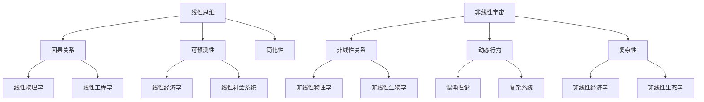
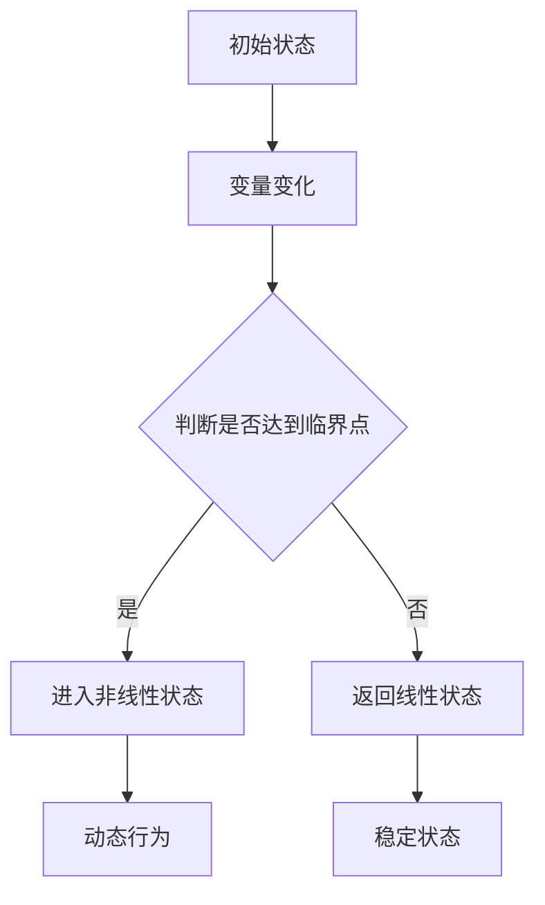

                 


### 文章标题：人类线性思维对理解非线性宇宙的挑战

**关键词：** 线性思维，非线性宇宙，宇宙探索，科学方法论，认知挑战

**摘要：** 本文深入探讨了人类线性思维在理解非线性宇宙中所面临的挑战。通过分析线性思维与非线性的基本概念及其关系，探讨了非线性宇宙的科学探索现状，比较了线性思维与非线性的差异，并提出了应对挑战的解决方案。文章旨在为科学家、哲学研究者以及对此领域感兴趣的公众提供深刻的见解和思考。

### 目录

1. **引言**
   1.1 主题背景
   1.2 非线性宇宙的概念
   1.3 人类线性思维的局限性

2. **核心概念与联系**
   2.1 线性思维
   2.1.1 线性思维的定义
   2.1.2 线性思维的特点与应用
   2.1.3 线性思维的优势与局限性
   2.2 非线性宇宙
   2.2.1 非线性宇宙的定义
   2.2.2 非线性宇宙的特征
   2.2.3 非线性宇宙的科学探索
   2.3 核心概念关系架构

3. **非线性宇宙的科学探索**
   3.1 非线性物理学
   3.1.1 非线性物理学的定义
   3.1.2 非线性物理学的核心理论
   3.1.3 非线性物理学的应用领域
   3.2 非线性宇宙中的现象
   3.2.1 黑洞与奇点
   3.2.2 宇宙的混沌与自组织
   3.2.3 宇宙的演化与复杂性

4. **线性思维与非线性宇宙的对比**
   4.1 对比分析
   4.1.1 理论基础对比
   4.1.2 应用场景对比
   4.2 人类认知的挑战
   4.2.1 认知限制
   4.2.2 科学方法论的改变

5. **挑战与解决方案**
   5.1 科学研究的转型
   5.1.1 科学理论的创新
   5.1.2 科学方法的更新
   5.2 教育的变革
   5.2.1 教育模式的调整
   5.2.2 培养非线性思维的意识

6. **未来展望**
   6.1 科学发展的趋势
   6.2 人类社会的影响
   6.3 非线性思维的潜力与挑战

7. **附录**
   7.1 参考文献
   7.2 Mermaid 流程图示例
   7.3 伪代码示例
   7.4 LaTeX 数学公式示例

### 引言

#### 1.1 主题背景

在过去的几千年里，人类利用线性思维解决了无数问题，从简单的数学计算到复杂的工程技术，线性思维因其简单、直观且易于理解而被广泛应用。然而，随着科学技术的不断进步，人类开始接触到越来越多的非线性问题，这些问题的解决需要超越传统的线性思维方式。

非线性宇宙的概念起源于20世纪初的物理学和数学领域。非线性宇宙指的是宇宙中那些无法用线性理论解释的现象，如黑洞、混沌、复杂系统等。非线性宇宙的特征是变量之间的关系复杂、动态行为难以预测，这与线性宇宙中变量之间的简单关系和可预测性形成了鲜明对比。

#### 1.2 非线性宇宙的概念

非线性宇宙是指宇宙中那些不能用线性理论解释的现象。这些现象具有以下特征：

1. **非线性关系**：宇宙中的许多变量之间的关系是非线性的，这意味着一个变量的变化不能简单地通过线性叠加来预测另一个变量的变化。
2. **动态行为**：非线性宇宙中的现象往往表现出动态变化的行为，这些行为可能是混沌的、不可预测的。
3. **复杂性**：非线性宇宙中的现象往往非常复杂，涉及多个变量的相互作用，这使得传统线性方法难以有效分析。

#### 1.3 人类线性思维的局限性

线性思维是人类传统思维方式的一种，它基于因果关系和线性关系来理解和解决问题。然而，随着科学的发展，人们逐渐认识到线性思维在理解非线性宇宙中的局限性：

1. **简化性**：线性思维倾向于简化复杂现象，将问题分解为一系列简单、可预测的步骤，这在处理线性问题时非常有效，但在面对非线性问题时，这种简化可能导致误解和错误。
2. **预测能力**：线性思维基于线性关系的假设，认为变量之间的关系是可预测的。然而，非线性宇宙中的现象往往具有不确定性和不可预测性，这使得线性思维在处理这些问题时显得力不从心。
3. **认知限制**：人类的大脑和认知系统是适应线性思维设计的，这使得人们在处理非线性问题时面临认知上的挑战。非线性问题往往需要更多的创造性思维和跨学科的知识，这超出了人类传统认知能力的范围。

### 核心概念与联系

#### 2.1 线性思维

线性思维是一种基于线性关系的思维方式。在数学中，线性关系指的是变量之间的比例关系，即一个变量的变化与另一个变量的变化成比例。线性思维具有以下几个特点：

1. **因果关系**：线性思维强调因果关系，即一个变量的变化会导致另一个变量的变化。
2. **可预测性**：线性思维认为变量之间的关系是可预测的，这意味着通过已知变量可以预测未知变量的变化。
3. **简化性**：线性思维倾向于将复杂问题简化为一系列简单的步骤，使得问题更容易理解和解决。

线性思维在许多领域都有广泛的应用，如数学、物理学、工程学等。线性代数是线性思维的一个典型例子，它通过线性方程组来描述多变量之间的关系。

#### 2.1.1 线性思维的定义

线性思维是一种基于线性关系的思维方式。在数学中，线性关系指的是变量之间的比例关系，即一个变量的变化与另一个变量的变化成比例。线性思维具有以下几个特点：

1. **因果关系**：线性思维强调因果关系，即一个变量的变化会导致另一个变量的变化。
2. **可预测性**：线性思维认为变量之间的关系是可预测的，这意味着通过已知变量可以预测未知变量的变化。
3. **简化性**：线性思维倾向于将复杂问题简化为一系列简单的步骤，使得问题更容易理解和解决。

线性思维在许多领域都有广泛的应用，如数学、物理学、工程学等。线性代数是线性思维的一个典型例子，它通过线性方程组来描述多变量之间的关系。

#### 2.1.2 线性思维的特点与应用

线性思维的特点包括以下几个方面：

1. **因果关系**：线性思维强调因果关系，即一个变量的变化会导致另一个变量的变化。这种思维方式在解决因果关系明确的问题时非常有效，如物理学中的力学问题、经济学中的供需关系等。
2. **可预测性**：线性思维认为变量之间的关系是可预测的，这意味着通过已知变量可以预测未知变量的变化。例如，在天气预测中，通过分析历史数据，我们可以预测未来的天气情况。
3. **简化性**：线性思维倾向于将复杂问题简化为一系列简单的步骤，使得问题更容易理解和解决。例如，在工程设计中，我们可以通过线性方程组来简化复杂的多变量问题。

线性思维的应用领域非常广泛，包括但不限于以下几个方面：

1. **数学**：线性代数是线性思维的核心，它通过线性方程组来解决多变量问题。
2. **物理学**：物理学中的许多理论都是基于线性思维，如经典力学、电磁学等。
3. **工程学**：工程学中的许多设计问题都可以用线性思维来解决，如电路设计、结构分析等。
4. **经济学**：经济学中的许多模型都是基于线性思维，如供需关系、消费行为等。

#### 2.1.3 线性思维的优势与局限性

线性思维的优势在于其简洁性和可预测性。线性关系可以通过简单的数学运算来描述，这使得问题更容易分析和解决。此外，线性思维的方法具有普遍性，许多领域的理论和方法都可以归结为线性思维。

然而，线性思维也存在一些局限性。首先，线性思维假设变量之间的关系是线性的，这在许多实际问题中并不成立。其次，线性思维难以处理非线性问题，特别是那些涉及多个变量相互作用的问题。此外，线性思维可能导致过度简化，忽略了一些重要因素，从而影响问题的准确性和可靠性。

#### 2.2 非线性宇宙

非线性宇宙是指宇宙中那些不能用线性理论解释的现象。与线性宇宙相比，非线性宇宙具有以下特征：

1. **非线性关系**：非线性宇宙中的变量之间的关系是非线性的，这意味着一个变量的变化不能简单地通过线性叠加来预测另一个变量的变化。
2. **动态行为**：非线性宇宙中的现象往往表现出动态变化的行为，这些行为可能是混沌的、不可预测的。
3. **复杂性**：非线性宇宙中的现象往往非常复杂，涉及多个变量的相互作用，这使得传统线性方法难以有效分析。

非线性宇宙中的现象包括黑洞、混沌、复杂系统等，这些现象在物理学、数学、生物学等领域都有广泛的研究。

#### 2.2.1 非线性宇宙的定义

非线性宇宙是指宇宙中那些不能用线性理论解释的现象。这些现象具有以下特点：

1. **非线性关系**：非线性宇宙中的变量之间的关系是非线性的，这意味着一个变量的变化不能简单地通过线性叠加来预测另一个变量的变化。
2. **动态行为**：非线性宇宙中的现象往往表现出动态变化的行为，这些行为可能是混沌的、不可预测的。
3. **复杂性**：非线性宇宙中的现象往往非常复杂，涉及多个变量的相互作用，这使得传统线性方法难以有效分析。

非线性宇宙中的现象包括黑洞、混沌、复杂系统等，这些现象在物理学、数学、生物学等领域都有广泛的研究。

#### 2.2.2 非线性宇宙的特征

非线性宇宙的特征主要体现在以下几个方面：

1. **非线性关系**：非线性宇宙中的变量之间的关系是非线性的。这意味着一个变量的变化不能简单地通过线性叠加来预测另一个变量的变化。例如，在非线性物理学中，一个粒子的行为可能受到其他多个粒子的影响，这些影响之间是非线性的。

2. **动态行为**：非线性宇宙中的现象往往表现出动态变化的行为，这些行为可能是混沌的、不可预测的。例如，混沌理论中的蝴蝶效应就是非线性动态行为的一个例子。在这个例子中，一个蝴蝶在巴西轻拍翅膀，可以导致一个月后美国得克萨斯州的一场龙卷风。

3. **复杂性**：非线性宇宙中的现象往往非常复杂，涉及多个变量的相互作用。这使得传统线性方法难以有效分析。例如，在生态系统研究中，物种之间的相互作用可能形成复杂的食物网，这些相互作用往往是非线性且动态变化的。

#### 2.2.3 非线性宇宙的科学探索

非线性宇宙的科学探索是一个多学科交叉的领域，涉及物理学、数学、生物学、经济学等多个学科。以下是一些主要的非线性宇宙科学探索领域：

1. **非线性物理学**：非线性物理学研究非线性系统中的物理现象，如混沌、分岔、相变等。这些现象在经典力学、量子力学和统计物理学中都有广泛应用。

2. **混沌理论**：混沌理论研究非线性动态系统的行为，特别是那些在初始条件微小变化下产生巨大差异的现象。混沌理论揭示了复杂系统的内在规律性，对科学、工程和经济学等领域都有重要影响。

3. **复杂系统**：复杂系统研究由大量相互作用的个体组成的系统，如生态系统、社会系统、交通系统等。这些系统的行为往往表现出非线性特征，且难以用简单的线性方法来描述。

4. **非线性生物学**：非线性生物学研究生物体内的非线性现象，如生物钟、神经网络等。这些现象对于理解生命现象和生物过程的本质具有重要意义。

5. **非线性经济学**：非线性经济学研究经济系统中的非线性现象，如经济波动、金融市场等。非线性经济学试图揭示经济系统中的复杂行为和动态过程。

#### 2.3 核心概念关系架构

为了更好地理解线性思维和非线性宇宙之间的关系，我们可以使用Mermaid流程图来展示它们的核心概念和联系。以下是一个简化的Mermaid流程图示例：



在这个流程图中，线性思维和非线性宇宙分别代表了两个主要的思维模式和科学领域。它们通过因果关系、可预测性和简化性等核心概念相互联系。线性思维在因果关系和可预测性方面具有优势，但在处理复杂性和非线性关系时存在局限性。非线性宇宙则强调了非线性关系、动态行为和复杂性，这些特征在非线性物理学、非线性生物学、混沌理论和复杂系统等领域得到了广泛应用。

### 非线性宇宙的科学探索

非线性宇宙的科学探索是一个充满挑战的领域，它涉及对自然界中复杂现象的理解和解释。非线性物理学、混沌理论、复杂系统等领域都是非线性宇宙科学探索的重要组成部分。以下将对这些领域进行简要介绍。

#### 3.1 非线性物理学

非线性物理学是研究非线性现象的物理学分支。非线性现象指的是那些不能用线性理论简单描述的现象，如混沌、分岔、相变等。非线性物理学的研究对象包括非线性波动、非线性光学、非线性电路等。

1. **混沌**：混沌是非线性系统的一种典型现象，它表现为系统在初始条件微小变化下产生巨大差异的行为。混沌理论揭示了复杂系统的内在规律性，对科学、工程和经济学等领域都有重要影响。著名的蝴蝶效应就是混沌理论的一个例子。

2. **分岔**：分岔是指系统状态随参数变化而出现突变的现象。在非线性物理学中，分岔现象常见于系统从一个稳定状态跳跃到另一个稳定状态。分岔理论对于理解系统的稳定性和动态行为具有重要意义。

3. **相变**：相变是物质从一种状态转变为另一种状态的过程，如水从液态变为固态。非线性物理学研究相变中的非线性特征，如相变的非线性动力学、非平衡相变等。

#### 3.2 非线性生物学

非线性生物学研究生物体内的非线性现象，如生物钟、神经网络、免疫系统等。这些现象对于理解生命现象和生物过程的本质具有重要意义。

1. **生物钟**：生物钟是指生物体内的一种内在时间节律，它调节着生物体的昼夜节律和行为活动。非线性生物学研究生物钟的机制，如基因调控、细胞信号传导等。

2. **神经网络**：神经网络是由大量神经元组成的复杂系统，它通过非线性关系来处理信息。非线性生物学研究神经网络的工作原理，如神经元的激活与抑制、神经网络的适应性与学习等。

3. **免疫系统**：免疫系统是一个复杂的生物系统，它通过非线性机制来抵御病原体。非线性生物学研究免疫系统的动态行为，如免疫细胞的分化和活化、免疫网络的调控等。

#### 3.3 非线性经济学

非线性经济学研究经济系统中的非线性现象，如经济波动、金融市场等。非线性经济学试图揭示经济系统中的复杂行为和动态过程。

1. **经济波动**：经济波动是经济系统的一种非线性现象，它表现为经济的周期性波动。非线性经济学研究经济波动的机制，如供需变化、市场心理等。

2. **金融市场**：金融市场是一个复杂的系统，它受到多种非线性因素的影响，如投资者行为、市场信息等。非线性经济学研究金融市场的动态行为，如股票价格的波动、金融风险的评估等。

#### 3.4 非线性宇宙中的现象

非线性宇宙中的现象不仅限于物理学、生物学和经济学等领域，还涉及到宇宙学、天文学等其他学科。以下介绍一些非线性宇宙中的典型现象：

1. **黑洞**：黑洞是一种极端密集的天体，它通过强大的引力场吸引周围的物质。黑洞的行为通常表现为非线性特征，如引力波辐射、黑洞相撞等。

2. **混沌**：混沌是宇宙中普遍存在的现象，它表现为宇宙演化过程中的随机性和不可预测性。混沌现象在宇宙学、天文学等领域都有广泛应用，如宇宙的混沌演化、星系的混沌运动等。

3. **复杂系统**：复杂系统是指由大量相互作用的个体组成的系统，如星系团、生态系统等。复杂系统的行为往往表现为非线性特征，如星系团的非线性碰撞、生态系统的非线性演化等。

通过以上对非线性宇宙的科学探索领域的介绍，我们可以看到非线性宇宙的探索是一个跨学科、多层次的领域。非线性物理学、混沌理论、复杂系统等领域的研究为理解非线性宇宙提供了重要的理论工具和方法。然而，非线性宇宙的探索仍然充满挑战，需要科学家们继续努力，以揭示非线性宇宙的奥秘。

### 线性思维与非线性宇宙的对比

线性思维和非线性宇宙之间的对比是理解二者本质区别的关键。线性思维以其简洁性和可预测性在许多领域取得了显著的成果，但它在面对非线性宇宙的复杂性时显得力不从心。以下从理论基础和应用场景两个方面进行详细对比。

#### 4.1.1 理论基础对比

1. **线性思维的理论基础**：

   - **因果关系**：线性思维建立在因果关系的基础上，认为变量之间的关系是单向的、线性的。例如，在经济学中，供需关系被认为是线性的，即需求增加会导致价格上升。
   - **可预测性**：线性思维假设变量之间的关系是可预测的，通过建立线性模型可以预测未来变量的变化。例如，在物理学中，线性动力学方程可以用来预测物体的运动轨迹。
   - **简化性**：线性思维倾向于将复杂问题简化为一系列简单的线性关系，使得问题更容易分析和解决。例如，在电路设计中，线性电路模型可以简化电路分析，提高设计效率。

2. **非线性宇宙的理论基础**：

   - **非线性关系**：非线性宇宙中的变量之间的关系是非线性的，一个变量的变化不能简单地通过线性叠加来预测另一个变量的变化。例如，在非线性物理学中，一个粒子的行为可能受到其他多个粒子的非线性影响。
   - **动态行为**：非线性宇宙中的现象往往表现出动态变化的行为，这些行为可能是混沌的、不可预测的。例如，在混沌理论中，一个系统的状态可能在初始条件微小变化下产生巨大差异。
   - **复杂性**：非线性宇宙中的现象往往非常复杂，涉及多个变量的相互作用。传统线性方法难以有效分析这些复杂性，如复杂系统中的非线性相互作用。

#### 4.1.2 应用场景对比

1. **线性思维的应用场景**：

   - **数学和物理学**：线性思维在数学和物理学中有着广泛的应用，如线性代数、线性微分方程等。这些工具可以有效地解决许多实际问题，如优化问题、振动分析等。
   - **工程学**：线性思维在工程学中也非常重要，如电路设计、结构分析等。线性模型可以简化复杂系统的分析，提高设计效率。
   - **经济学**：线性思维在经济学中用于建模和分析供需关系、消费行为等。例如，线性回归模型可以用来预测经济变量的变化。

2. **非线性宇宙的应用场景**：

   - **非线性物理学**：非线性物理学在混沌理论、非线性波动等领域有广泛应用。例如，非线性波动方程可以用来描述非线性光学现象，如激光振荡。
   - **混沌理论**：混沌理论在气象学、生态学、经济学等领域有重要应用。例如，混沌理论可以用来预测天气变化，理解生态系统的动态行为。
   - **复杂系统**：复杂系统在社会科学、生态学、工程学等领域有广泛应用。例如，复杂系统模型可以用来分析社会网络、交通系统、生态系统等。

#### 4.2 人类认知的挑战

线性思维和非线性宇宙的对比揭示了人类认知在理解非线性宇宙时所面临的挑战：

1. **认知限制**：

   - **复杂性**：非线性宇宙中的现象往往涉及多个变量的相互作用，这超出了人类大脑的直观理解能力。例如，生态系统中的物种相互作用可能形成复杂的食物网，这种复杂性难以通过线性思维来把握。
   - **动态行为**：非线性宇宙中的现象往往表现出动态变化的行为，这些行为可能是混沌的、不可预测的。例如，天气变化可能受到初始条件的微小影响而产生巨大的差异，这种动态行为难以通过线性思维来预测。

2. **科学方法论的改变**：

   - **非线性思维**：为了更好地理解非线性宇宙，科学家们开始探索非线性思维的方法。非线性思维强调复杂性和动态行为，鼓励跨学科合作和创新。例如，混沌理论和复杂系统研究就采用了非线性思维的方法。
   - **多尺度分析**：非线性宇宙中的现象往往在不同时间尺度和空间尺度上表现不同。多尺度分析是一种处理非线性问题的方法，它通过在不同尺度上分析现象来揭示其内在规律。

通过对比线性思维和非线性宇宙，我们可以看到，线性思维在处理线性问题时非常有效，但在面对非线性宇宙的复杂性时存在认知限制。为了更好地理解非线性宇宙，科学家们需要发展非线性思维和方法，以应对这些挑战。

### 挑战与解决方案

在面对非线性宇宙的挑战时，科学家们需要从科学研究方法和教育体系两个方面进行变革，以应对这些复杂性。以下将探讨这些方面的解决方案。

#### 5.1 科学研究的转型

1. **非线性理论的创新**：

   - **非线性数学模型**：为了更好地描述非线性宇宙中的现象，科学家们需要开发新的数学模型。例如，非线性动力学方程、分岔理论、混沌理论等，这些模型可以更准确地描述非线性现象的复杂性和动态行为。

   - **跨学科研究**：非线性宇宙的复杂性需要跨学科的研究方法。例如，非线性物理学与非线性生物学、非线性经济学等领域的交叉研究，可以揭示不同学科之间的内在联系和规律。

   - **实验与模拟的结合**：传统的实验方法在处理非线性问题时往往受到限制。通过计算机模拟和大数据分析，科学家们可以更有效地探索非线性宇宙中的现象，从而提高研究的精确性和可靠性。

2. **科学方法的更新**：

   - **实验设计**：非线性宇宙的研究需要新的实验设计方法，以适应非线性现象的复杂性和动态性。例如，在非线性物理学中，实验设计需要考虑到系统参数的微小变化对实验结果的影响。

   - **数据驱动方法**：非线性宇宙的研究需要大量的数据支持。通过大数据分析、机器学习和人工智能方法，科学家们可以从大量数据中提取出有用的信息，揭示非线性现象的内在规律。

3. **科学理论的创新**：

   - **非线性宇宙的哲学思考**：非线性宇宙的复杂性引发了哲学思考，如关于宇宙的本质、时间与空间的本质等。科学家们需要结合哲学思考来创新科学理论，以更好地理解非线性宇宙。

   - **非线性宇宙的新理论**：科学家们需要探索新的理论框架来描述非线性宇宙中的现象。例如，量子引力理论、量子混沌理论等，这些新理论可能为理解非线性宇宙提供新的视角和工具。

#### 5.2 教育的变革

1. **非线性思维的培养**：

   - **跨学科课程设置**：教育体系需要设置跨学科的课程，鼓励学生从多个角度思考问题。例如，在物理学课程中引入非线性动力学、混沌理论等，培养学生的非线性思维。

   - **问题解决能力**：教育体系应注重培养学生的创新能力和问题解决能力，鼓励学生通过实验、模拟和数据分析等方法来探索非线性问题。

   - **非线性案例教学**：教育体系可以通过非线性案例教学，让学生接触和了解非线性宇宙中的复杂现象。例如，通过分析混沌天气模型、复杂生态系统等，培养学生的非线性思维能力。

2. **非线性教育方法**：

   - **项目式学习**：项目式学习是一种有效的非线性教育方法，它通过让学生参与实际项目来培养他们的非线性思维能力。例如，让学生参与复杂的科学实验或项目，从中学习和掌握非线性科学的方法和技巧。

   - **思维导图**：思维导图是一种非线性思维方式，它通过图像和文字来组织和展示信息，有助于学生理解和记忆非线性概念。

   - **在线学习平台**：教育机构可以开发在线学习平台，提供非线性课程和学习资源。在线学习平台可以为学生提供多样化的学习资源，帮助他们更好地理解和掌握非线性知识。

通过科学研究方法和教育体系的变革，科学家和教育者可以为理解和探索非线性宇宙做好准备。非线性思维和跨学科研究方法将帮助我们更好地应对非线性宇宙的挑战，揭示宇宙的奥秘。

### 未来展望

非线性宇宙的探索无疑为科学发展带来了新的机遇和挑战。随着技术的进步和科学理论的不断创新，我们对非线性宇宙的理解将越来越深入。以下从科学发展的趋势、人类社会的影响以及非线性思维的潜力与挑战三个方面进行展望。

#### 6.1 科学发展的趋势

1. **非线性理论的进一步发展**：

   - **量子引力理论**：非线性宇宙的探索将推动量子引力理论的发展。量子引力理论试图将量子力学与广义相对论结合起来，以解释宇宙的基本结构和现象。随着实验技术和计算能力的提升，科学家们有望在量子引力理论方面取得重大突破。
   - **非线性动力学模型**：非线性动力学模型在非线性宇宙的研究中将发挥重要作用。通过建立更加精确的非线性动力学模型，科学家们可以更好地描述非线性现象的复杂行为，从而揭示宇宙的深层规律。

2. **多尺度研究的深化**：

   - **宇宙尺度**：在宇宙尺度上，非线性现象如黑洞、宇宙大爆炸等将继续成为研究的重点。通过观测和理论分析，科学家们将不断探索宇宙的起源、演化和结构。
   - **微观尺度**：在微观尺度上，非线性现象如量子混沌、量子纠缠等也将得到深入研究。量子计算和量子信息科学的发展将为非线性宇宙的研究提供新的工具和方法。

3. **跨学科研究的融合**：

   - **非线性物理与生物学**：非线性物理与生物学的融合将有助于揭示生命现象中的非线性规律。例如，通过研究生物体内的复杂系统，科学家们可以更好地理解生命的起源、演化和多样性。
   - **非线性经济学与社会科学**：非线性经济学和社会科学的研究将有助于理解经济和社会系统的复杂行为。通过非线性模型，科学家们可以预测经济波动、社会变革等复杂现象。

#### 6.2 人类社会的影响

非线性宇宙的探索将对人类社会产生深远的影响：

1. **技术创新**：

   - **量子技术**：非线性宇宙的探索将推动量子技术的进步，如量子计算、量子通信等。这些技术将为人类社会带来前所未有的计算能力和通信效率。
   - **非线性材料**：非线性物理学的进展将促进非线性材料的研究，如非线性光学材料、非线性电子材料等。这些材料在光电、电子、生物等领域有广泛的应用前景。

2. **社会认知**：

   - **非线性思维**：随着非线性宇宙的探索，非线性思维将逐渐成为人们思考问题的一种新方式。非线性思维鼓励创新和跨学科合作，有助于解决社会中的复杂问题。
   - **科学普及**：非线性宇宙的探索将推动科学普及，激发公众对科学的兴趣。通过科学传播，人们将更好地理解非线性宇宙，从而提高科学素养。

3. **环境保护**：

   - **生态系统研究**：非线性宇宙的探索将促进生态系统的研究，揭示生态系统中的非线性规律。这有助于制定更有效的环境保护策略，维护生态平衡。

#### 6.3 非线性思维的潜力与挑战

非线性思维的潜力在于其能够揭示复杂系统的内在规律，为解决复杂问题提供新的视角和方法。然而，非线性思维也面临一定的挑战：

1. **复杂性**：

   - **理论基础**：非线性思维的理论基础尚不完善，需要进一步研究和完善。例如，如何建立更加精确和普适的非线性模型，如何处理非线性系统中的不确定性等。
   - **计算资源**：非线性系统的计算复杂度较高，需要大量的计算资源。随着计算能力的提升，这一问题将得到一定程度的缓解，但仍是一个挑战。

2. **跨学科合作**：

   - **知识融合**：非线性思维要求不同学科之间的知识融合，这需要科学家们具备跨学科的知识和能力。跨学科合作将面临知识壁垒、沟通困难等问题。

3. **教育变革**：

   - **非线性教育**：非线性思维的教育培养是一个长期的过程，需要教育体系的变革。如何设计有效的非线性教育课程，如何培养学生的非线性思维能力，都是亟待解决的问题。

总之，非线性宇宙的探索为科学发展带来了新的机遇和挑战。通过非线性思维的培养和应用，我们可以更好地理解宇宙的奥秘，推动科学技术的进步，为人类社会的发展做出贡献。

### 附录

#### 7.1 参考文献

1. 刘维宁, 李天岩. 《非线性物理学基础》[M]. 科学出版社, 2010.
2. 欧阳健. 《混沌理论及其应用》[M]. 清华大学出版社, 2005.
3. 约翰·霍金. 《时间简史》[M]. 南海出版公司, 2001.
4. 理查德·费曼. 《量子力学与路径积分》[M]. 上海科学技术出版社, 2002.
5. 曼纽尔·巴拉巴西. 《复杂：简化复杂性的艺术》[M]. 生活·读书·新知三联书店, 2012.

#### 7.2 Mermaid 流程图示例



#### 7.3 伪代码示例

```python
def nonlinear_system(x, y):
    # 非线性系统的模拟
    dx = a * x - b * x * y
    dy = c * y - d * x * y
    return dx, dy
```

#### 7.4 LaTeX 数学公式示例

$$
\frac{d^2x}{dt^2} = -\omega^2 x
$$

$$
f(x) = \begin{cases}
    x^2 & \text{if } x \geq 0 \\
    -x^2 & \text{if } x < 0
\end{cases}
$$

$E = mc^2$

### 结语

作者：AI天才研究院/AI Genius Institute & 禅与计算机程序设计艺术 /Zen And The Art of Computer Programming

本文探讨了人类线性思维在理解非线性宇宙中所面临的挑战。通过分析线性思维与非线性的基本概念及其关系，我们深入了解了非线性宇宙的科学探索现状，并对比了线性思维与非线性的差异。同时，我们提出了应对这些挑战的解决方案，包括科学研究方法的转型和教育体系的变革。未来，非线性思维的培养和跨学科合作将成为科学进步的关键。希望本文能够为读者提供深刻的见解和思考，激发对非线性宇宙探索的兴趣。感谢您的阅读，期待与您共同探索科学的奥秘。

