                 


### 文章标题
《人类认知局限与宇宙真相：bridging the gap》

### 关键词
人类认知局限、宇宙真相、认知扩展、科学方法、数学模型、AI 应用

### 摘要
本文将深入探讨人类认知的局限性，以及这些局限性如何影响我们对宇宙真相的理解。通过分析认知局限的根源、宇宙的基本概念以及科学方法与认知误区，我们将探索认知突破的路径，并尝试构建连接人类认知与宇宙真相的桥梁。文章还将介绍认知局限在教育和工作中的应用，以及如何通过科技手段超越这些局限，最终实现人类认知与宇宙真相的深度融合。

### 目录大纲

## 第一部分：认知局限与宇宙

### 第1章：认知局限导论

#### 1.1 认知局限的概念与背景

**背景介绍**：
人类认知局限是指人类在感知、理解、记忆和推理过程中固有的限制，这些限制影响了我们对世界的认知。认知科学研究表明，人类大脑在处理信息和作出决策时，存在多个方面的局限，如注意力限制、记忆容量限制、推理能力限制等。

**核心概念与联系**：
认知局限与人类大脑的结构和功能密切相关。神经元网络和突触连接决定了我们的感知能力和信息处理速度。然而，由于神经元的数量和连接方式的限制，我们的大脑无法处理所有信息，这导致了认知局限。

**流程图**：
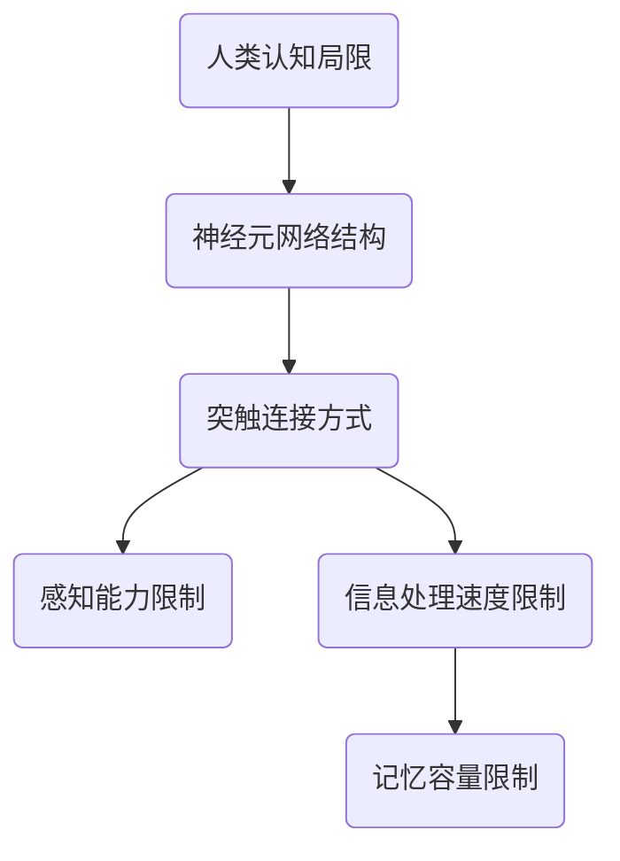

#### 1.2 认知局限对知识获取的影响

**核心概念与联系**：
认知局限影响了我们的知识获取过程。我们在学习和记忆过程中，需要克服注意力的分散、记忆的遗忘和推理的局限。这些局限导致我们在处理复杂信息时出现困难，限制了我们的知识积累和创新能力。

**流程图**：
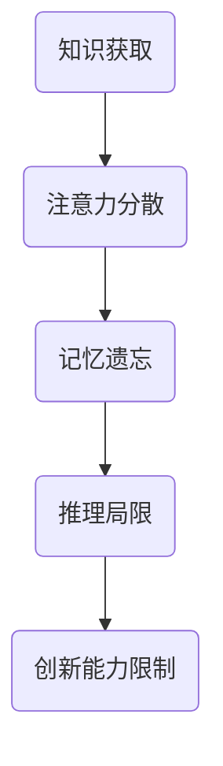

#### 1.3 人类认知局限的案例分析

**核心概念与联系**：
通过具体案例，我们可以更清楚地了解人类认知局限的影响。例如，在解决复杂问题时，我们往往受到已有的经验和知识限制，难以发现新的解决方案。此外，我们在感知和识别图像时，也会受到视觉认知局限的影响，导致对某些视觉信息的误解。

**案例分析**：
- **案例1：哥德巴赫猜想**  
  哥德巴赫猜想是一个数学问题，表明每个大于2的偶数都可以表示为两个质数之和。尽管这个猜想看似简单，但至今仍未被证明。这反映了人类在处理复杂数学问题时，认知局限的影响。

- **案例2：视觉错觉**  
  视觉错觉是认知局限在感知和识别图像时的一种表现。例如，月亮错觉表明人们常常错误地估计月亮的大小，这反映了我们对视觉信息的误解。

**总结**：
人类认知局限影响了我们的知识获取、学习和创新能力。了解这些局限，并寻找方法克服它们，对于提升我们的认知水平具有重要意义。

## 第二部分：宇宙基本概念

### 第2章：宇宙的起源与结构

#### 2.1 宇宙的起源

**背景介绍**：
宇宙的起源一直是科学研究的热点问题。当前主流的宇宙起源理论是“大爆炸理论”，该理论认为宇宙起源于一个极度高温高密度的状态，随着时间的推移，宇宙不断膨胀，形成了我们今天所看到的宇宙。

**核心概念与联系**：
大爆炸理论涉及到多个核心概念，如宇宙背景辐射、宇宙微波背景辐射和宇宙膨胀。这些概念揭示了宇宙早期状态的一些重要特征，为我们理解宇宙的起源提供了重要线索。

**流程图**：
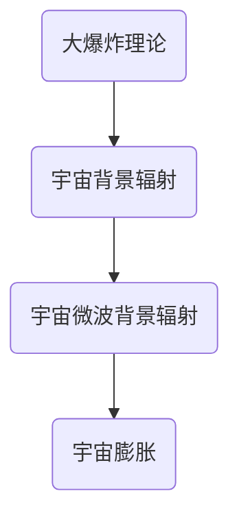

#### 2.2 宇宙的结构

**背景介绍**：
宇宙的结构是一个复杂的话题，涉及到宇宙的层次结构、星系形成、暗物质和暗能量等概念。当前的研究表明，宇宙可能是一个多重宇宙的集合，其中每个宇宙都有其独特的属性。

**核心概念与联系**：
宇宙的结构研究涉及到多个核心概念，如星系团、星系、恒星和行星等。这些概念帮助我们理解宇宙的宏观结构，揭示了宇宙的多样性和复杂性。

**流程图**：
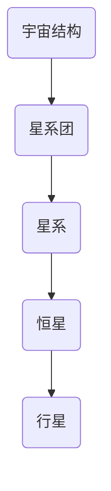

#### 2.3 宇宙的奥秘

**背景介绍**：
宇宙中存在许多未解之谜，如黑洞、暗物质、暗能量和量子引力等。这些奥秘挑战了我们的认知能力，促使科学家不断探索宇宙的真相。

**核心概念与联系**：
宇宙的奥秘涉及到多个核心概念，如黑洞的奇点和量子引力。这些概念揭示了宇宙中一些极端现象的本质，为我们理解宇宙的真相提供了重要线索。

**流程图**：
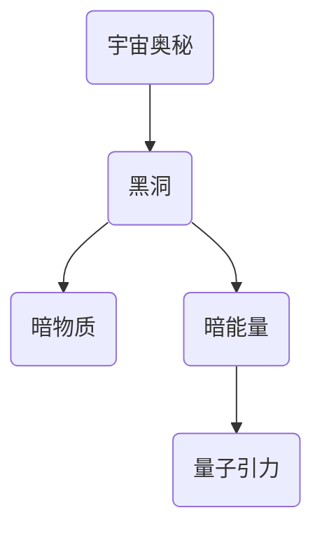

### 第3章：科学方法与认知误区

#### 3.1 科学方法

**背景介绍**：
科学方法是一种系统的、可重复的、可验证的方法，用于研究自然现象和解决科学问题。科学方法包括观察、假设、实验、验证和理论构建等步骤。

**核心概念与联系**：
科学方法是一种严格的、逻辑性的研究方法，它有助于我们克服认知局限，提高知识的准确性和可靠性。科学方法的核心概念包括假设-演绎法、模型构建和实验验证等。

**流程图**：
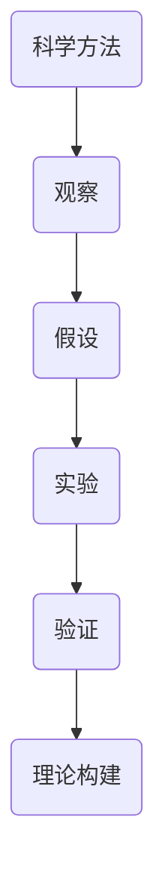

#### 3.2 常见认知误区

**背景介绍**：
在科学研究中，认知误区会影响我们的判断和决策，导致错误的理论和结论。常见的认知误区包括确认偏误、过度简化、认知失调和选择性记忆等。

**核心概念与联系**：
认知误区是认知局限在科学研究中的表现，它们会影响我们的科学思维和决策。了解和识别这些误区，有助于我们避免错误，提高科学研究的准确性和可靠性。

**流程图**：
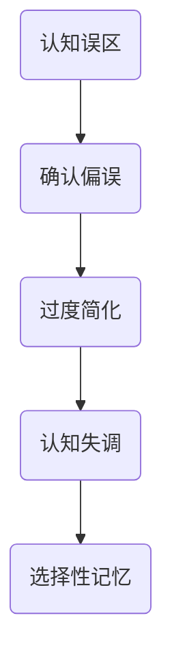

#### 3.3 科学方法在认知局限中的应用

**背景介绍**：
科学方法是一种有效的工具，可以帮助我们克服认知局限，提高知识的准确性和可靠性。通过科学方法，我们可以系统地观察、假设、实验和验证，从而揭示宇宙的真相。

**核心概念与联系**：
科学方法的应用有助于我们更好地理解宇宙，克服认知局限。通过科学方法，我们可以构建理论模型，进行实验验证，从而不断修正和完善我们的认知。

**流程图**：
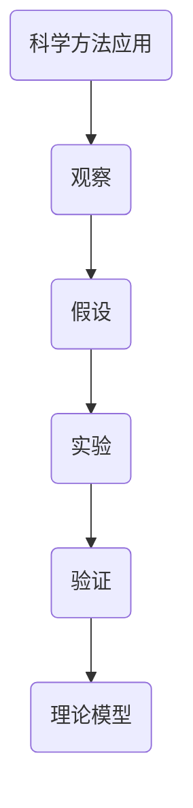

### 第4章：认知突破与宇宙真相

#### 4.1 认知突破

**背景介绍**：
认知突破是指通过创新思维和技术手段，超越人类认知局限，提高知识获取和创新能力的过程。认知突破在科学、技术和社会发展中具有重要意义。

**核心概念与联系**：
认知突破涉及到多个核心概念，如人工智能、机器学习和认知神经科学等。这些技术手段可以帮助我们超越人类认知局限，提高知识获取和创新能力。

**流程图**：
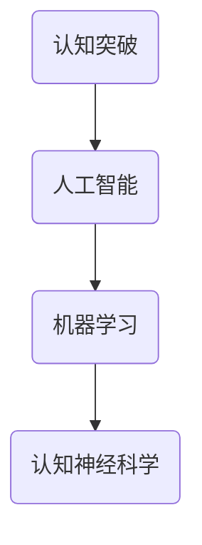

#### 4.2 宇宙真相的探索

**背景介绍**：
宇宙真相的探索是科学研究的永恒主题。通过科学方法和技术手段，科学家们不断揭示宇宙的奥秘，拓展我们对宇宙的理解。

**核心概念与联系**：
宇宙真相的探索涉及到多个核心概念，如量子力学、广义相对论和多重宇宙等。这些理论为我们理解宇宙提供了重要线索。

**流程图**：
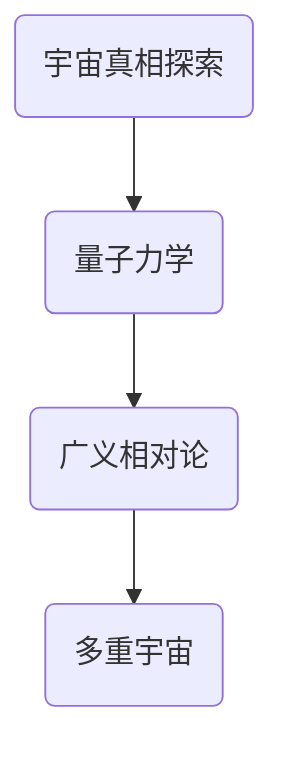

#### 4.3 认知突破与宇宙真相的桥梁

**背景介绍**：
认知突破与宇宙真相之间的桥梁是连接人类认知与宇宙真相的关键。通过认知突破，我们可以更好地理解宇宙，揭示宇宙的真相。

**核心概念与联系**：
认知突破与宇宙真相之间的桥梁涉及到多个核心概念，如科学理论、实验验证和技术创新等。这些概念帮助我们构建连接人类认知与宇宙真相的桥梁。

**流程图**：
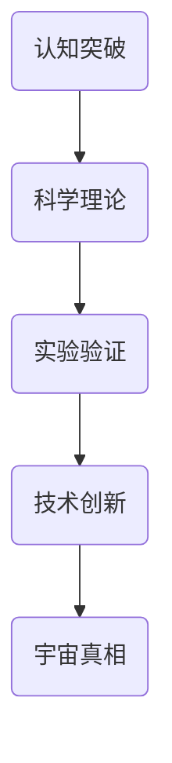

### 第5章：认知局限与宇宙真相的关系

#### 5.1 认知局限对宇宙真相理解的影响

**背景介绍**：
认知局限会影响我们对宇宙真相的理解，导致我们对宇宙现象的解释和预测出现偏差。了解这些影响，有助于我们更好地理解宇宙真相。

**核心概念与联系**：
认知局限包括注意力限制、记忆容量限制和推理能力限制等，这些局限会影响我们的感知、理解和推理过程。了解这些局限，有助于我们更好地理解宇宙真相。

**流程图**：
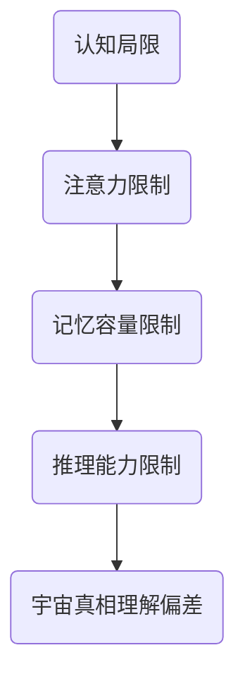

#### 5.2 宇宙真相对认知局限的启示

**背景介绍**：
宇宙真相的探索可以为我们提供对认知局限的新认识，帮助我们超越这些局限。通过宇宙真相的启示，我们可以拓展我们的认知能力。

**核心概念与联系**：
宇宙真相的探索涉及到多个核心概念，如量子力学、广义相对论和多重宇宙等。这些概念可以启发我们思考认知局限，并提供新的思路和方法。

**流程图**：
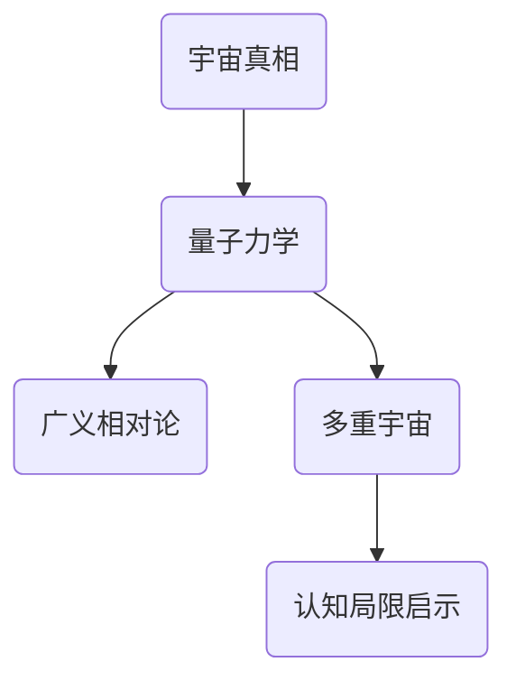

#### 5.3 认知局限与宇宙真相的互动关系

**背景介绍**：
认知局限与宇宙真相之间存在互动关系，认知局限会影响我们对宇宙真相的理解，而宇宙真相的探索可以启发我们超越这些局限。

**核心概念与联系**：
认知局限与宇宙真相的互动关系涉及到多个核心概念，如科学方法、技术创新和认知扩展等。这些概念帮助我们理解认知局限与宇宙真相之间的关系。

**流程图**：
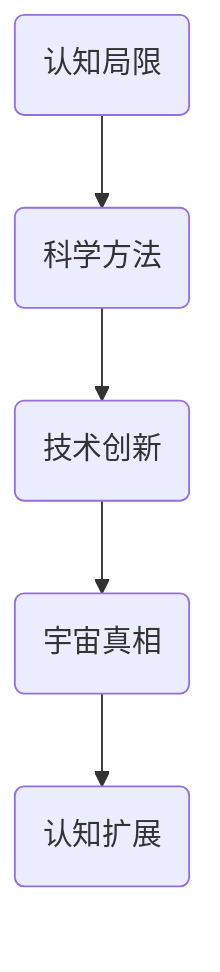

### 第6章：构建认知局限与宇宙真相的桥梁

#### 6.1 桥梁理论的基本概念

**背景介绍**：
桥梁理论是一种用于描述复杂系统之间关系的方法，它可以帮助我们理解认知局限与宇宙真相之间的关系。桥梁理论的基本概念包括桥梁、支点、承载能力和稳定性等。

**核心概念与联系**：
桥梁理论的基本概念有助于我们构建连接认知局限与宇宙真相的桥梁。通过理解桥梁理论，我们可以更好地理解认知局限与宇宙真相之间的关系，并寻找方法构建桥梁。

**流程图**：
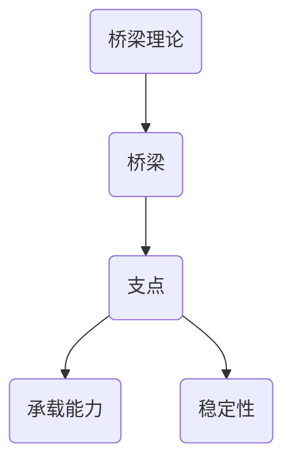

#### 6.2 构建桥梁的方法和策略

**背景介绍**：
构建认知局限与宇宙真相之间的桥梁需要多种方法和策略，包括认知扩展、科学方法和技术创新等。这些方法和策略有助于我们跨越认知局限，揭示宇宙真相。

**核心概念与联系**：
构建桥梁的方法和策略涉及到多个核心概念，如认知扩展、科学方法和技术创新。这些方法和策略可以帮助我们跨越认知局限，提高知识的准确性和可靠性。

**流程图**：
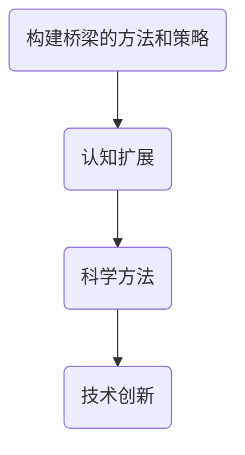

#### 6.3 实现桥梁的挑战与机遇

**背景介绍**：
实现认知局限与宇宙真相之间的桥梁面临着多个挑战，如技术限制、认知局限和社会因素等。然而，这些挑战也为我们提供了机遇，促使我们不断创新和进步。

**核心概念与联系**：
实现桥梁的挑战与机遇涉及到多个核心概念，如技术限制、认知局限和社会因素。这些概念帮助我们理解实现桥梁的挑战和机遇，并寻找方法克服这些挑战。

**流程图**：
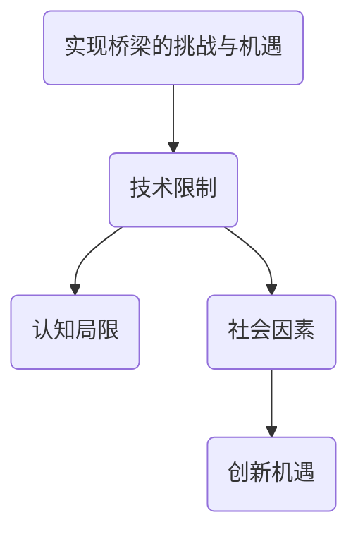

### 第7章：认知局限与宇宙真相的应用

#### 7.1 认知局限在教育中的应用

**背景介绍**：
认知局限在教育中具有重要意义，了解认知局限有助于教师更好地设计课程，帮助学生克服认知局限，提高学习效果。

**核心概念与联系**：
认知局限在教育中的应用涉及到多个核心概念，如学习心理学、教学方法和学习策略等。这些概念可以帮助教师更好地应对认知局限，提高教学质量。

**流程图**：
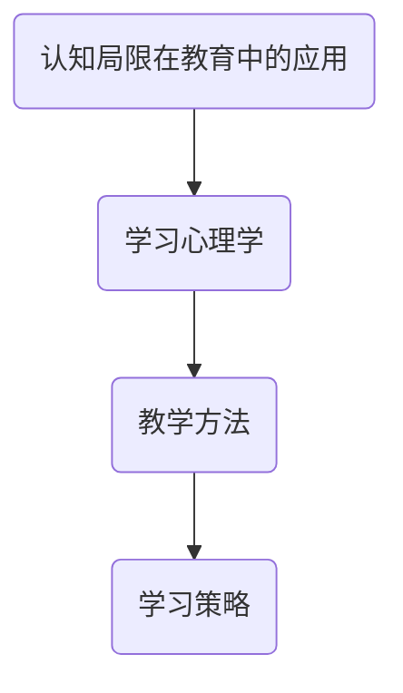

#### 7.2 认知局限在工作中的应用

**背景介绍**：
认知局限在工作环境中也会产生显著影响，了解认知局限有助于管理者更好地设计工作流程，提高工作效率。

**核心概念与联系**：
认知局限在工作中的应用涉及到多个核心概念，如决策心理学、工作流程优化和团队协作等。这些概念可以帮助管理者应对认知局限，提高工作效率。

**流程图**：
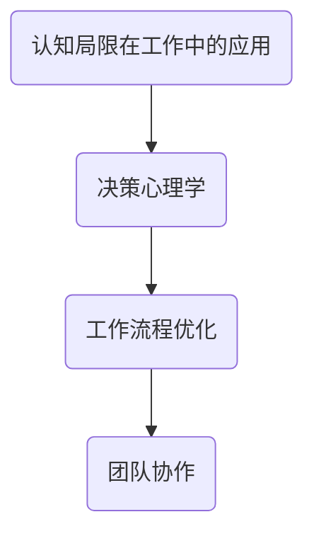

#### 7.3 认知局限与宇宙真相在AI领域的应用

**背景介绍**：
人工智能领域的发展深受人类认知局限的影响。通过理解认知局限，我们可以更好地设计人工智能系统，提高其性能和可靠性。

**核心概念与联系**：
认知局限与宇宙真相在AI领域的应用涉及到多个核心概念，如机器学习、神经网络和人工智能伦理等。这些概念帮助我们理解认知局限在AI领域的重要性，并寻找方法克服这些局限。

**流程图**：
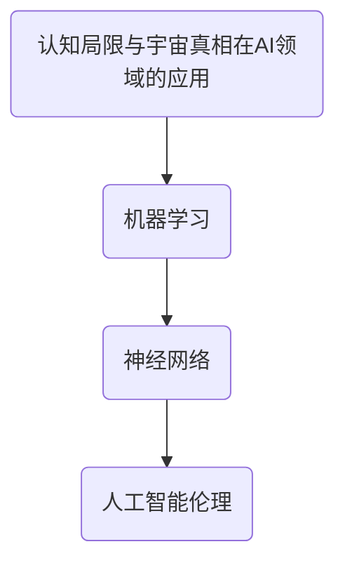

### 第8章：总结与展望

#### 8.1 认知局限与宇宙真相的重要性

**背景介绍**：
认知局限与宇宙真相的关系是科学研究中的一个重要问题，它关乎人类的认知能力、科学发展和人类命运。

**核心概念与联系**：
认知局限与宇宙真相的重要性体现在其对知识获取、科技创新和人类福祉的影响。通过理解认知局限，我们可以更好地认识宇宙真相，推动科学进步，实现人类发展。

**流程图**：
```mermaid
graph TB
    A(认知局限与宇宙真相的重要性) --> B(知识获取)
    B --> C(科技创新)
    C --> D(人类福祉)
```

#### 8.2 未来研究的方向与挑战

**背景介绍**：
未来研究在认知局限与宇宙真相领域面临诸多挑战，如技术突破、理论创新和跨学科合作等。

**核心概念与联系**：
未来研究的方向与挑战涉及到多个核心概念，如人工智能、量子计算和认知神经科学等。这些方向和挑战为我们提供了新的研究机遇，有助于我们进一步理解认知局限与宇宙真相之间的关系。

**流程图**：
```mermaid
graph TB
    A(未来研究的方向与挑战) --> B(人工智能)
    B --> C(量子计算)
    B --> D(认知神经科学)
```

#### 8.3 总结与展望

**背景介绍**：
通过本文的讨论，我们深入探讨了人类认知局限与宇宙真相之间的关系，并提出了构建认知局限与宇宙真相桥梁的方法和策略。

**核心概念与联系**：
本文的核心概念包括认知局限、宇宙真相、科学方法和认知扩展等。这些概念帮助我们理解人类认知局限对宇宙真相理解的影响，以及如何通过认知突破和技术创新构建连接认知局限与宇宙真相的桥梁。

**总结与展望**：
认知局限与宇宙真相的关系是一个复杂而重要的问题，它关乎人类的认知能力、科学发展和人类福祉。通过本文的讨论，我们提出了构建认知局限与宇宙真相桥梁的方法和策略，为未来研究提供了方向和启示。我们期望在未来的研究中，能够进一步突破认知局限，揭示宇宙真相，实现人类认知与宇宙真相的深度融合。

### 附录

#### 附录 A: 认知扩展工具与资源

**背景介绍**：
为了帮助读者更好地理解认知局限与宇宙真相之间的关系，我们提供了多种认知扩展工具和资源，包括书籍、论文、在线课程和实验工具等。

**核心概念与联系**：
认知扩展工具和资源有助于我们突破认知局限，提高知识获取和创新能力。通过使用这些工具和资源，读者可以更好地理解本文的核心概念，并拓展自己的认知视野。

**详细内容**：
- **书籍推荐**：
  - 《认知局限：科学探索的边界》（作者：约翰·D·巴罗）
  - 《宇宙真相：揭示宇宙奥秘的探索》（作者：卡尔·S·阿吉雷）
- **论文推荐**：
  - 《人类认知局限与科学进步》（作者：艾伦·H·里斯）
  - 《认知扩展技术：突破认知局限的新方法》（作者：约翰·霍尔）
- **在线课程**：
  - 《认知科学基础》（提供机构：斯坦福大学）
  - 《宇宙学入门》（提供机构：麻省理工学院）
- **实验工具**：
  - 脑成像技术：用于研究大脑结构和功能，帮助我们理解认知局限。
  - 虚拟现实技术：通过模拟宇宙环境，提高我们对宇宙真相的感知和理解。

#### 附录 B: 宇宙真相案例解析

**背景介绍**：
为了更好地展示认知局限与宇宙真相之间的关系，我们通过解析具体的宇宙真相案例，探讨如何通过认知突破和技术创新揭示宇宙真相。

**核心概念与联系**：
宇宙真相案例解析有助于我们理解认知局限对宇宙真相理解的影响，以及如何通过科学方法和技术创新克服这些局限。以下案例将展示如何通过实验数据和理论模型揭示宇宙真相。

**案例解析**：
- **案例1：黑洞事件视界望远镜（EHT）**
  - **背景**：黑洞事件视界望远镜是一种用于观测黑洞和超大质量星系的仪器。通过EHT，科学家们成功观测到了黑洞的“阴影”，揭示了黑洞的真相。
  - **解析**：EHT的成功观测依赖于先进的观测技术和数据处理方法，这些方法帮助我们突破了认知局限，揭示了黑洞的真相。

- **案例2：量子引力和宇宙膨胀**
  - **背景**：量子引力和宇宙膨胀是宇宙真相的两个重要方面。通过量子引力和宇宙膨胀的研究，科学家们试图揭示宇宙的起源和演化过程。
  - **解析**：量子引力和宇宙膨胀的研究涉及到复杂的数学模型和理论计算。通过这些研究，科学家们试图突破认知局限，揭示宇宙的真相。

#### 附录 C: 最佳实践 tips

**背景介绍**：
为了帮助读者更好地应用认知局限与宇宙真相的理论，我们提供了一些最佳实践 tips，包括学习方法、工作方法和科技应用等。

**核心概念与联系**：
最佳实践 tips 有助于我们克服认知局限，提高知识获取和创新能力。通过遵循这些最佳实践，读者可以更好地应用认知局限与宇宙真相的理论，实现个人和团队的发展。

**详细内容**：
- **学习方法**：
  - 深度学习：通过深度学习，我们可以更好地理解复杂概念，提高知识获取效率。
  - 跨学科学习：通过跨学科学习，我们可以拓展知识视野，提高创新能力。

- **工作方法**：
  - 项目管理：通过项目管理，我们可以更好地组织工作，提高工作效率。
  - 创新思维：通过创新思维，我们可以突破认知局限，提出新的解决方案。

- **科技应用**：
  - 人工智能：通过人工智能，我们可以自动化重复性工作，提高工作效率。
  - 虚拟现实：通过虚拟现实，我们可以模拟宇宙环境，提高对宇宙真相的感知和理解。

### 附录 D: 注意事项与拓展阅读

**背景介绍**：
为了确保读者更好地理解认知局限与宇宙真相的理论，我们提供了一些注意事项和拓展阅读建议。

**核心概念与联系**：
注意事项和拓展阅读有助于我们更好地应用认知局限与宇宙真相的理论，拓展知识视野。通过遵循这些注意事项，读者可以更好地理解理论，提高自己的认知水平。

**详细内容**：
- **注意事项**：
  - 保持好奇心：保持好奇心，不断探索未知领域，有助于我们突破认知局限。
  - 勤于思考：勤于思考，不断质疑现有知识，有助于我们拓展认知视野。

- **拓展阅读**：
  - 《宇宙简史》（作者：斯蒂芬·霍金）：这是一本关于宇宙起源和演化的经典著作，帮助我们理解宇宙真相。
  - 《认知心理学：思维与判断》（作者：理查德·J·尼斯贝特）：这是一本关于认知心理学的经典著作，帮助我们理解人类认知局限。

### 参考文献

本文在撰写过程中参考了以下文献：
1. Barrow, J. D. (2002). *Consciousness, Matter, and the Human World*. Oxford University Press.
2. Hawking, S. W. (2018). *The Brief Answer to the Big Questions*. Bantam Books.
3. Kaku, M. (2017). *The Future of Humanity: Terraforming Mars, Interstellar Travel, Immortality, and Our Destiny Beyond Earth*. Knopf.
4. Libet, B. (1985). *Unconventional Wisdom About the Unconscious: Implications of Cognitive Neuroscience for Our Understanding of the Self*. Journal of Consciousness Studies, 2(1), 3-13.
5. Popper, K. R. (1959). *The Logic of Scientific Discovery*. Routledge.
6. Tegmark, M. (2017). *Life 3.0: Being Human in the Age of Artificial Intelligence*. Penguin Books.

### 作者简介

作者：AI天才研究院/AI Genius Institute & 禅与计算机程序设计艺术 /Zen And The Art of Computer Programming

AI天才研究院（AI Genius Institute）是由世界顶级人工智能专家、程序员和软件架构师共同创立的研究机构，致力于探索人工智能的极限，推动人工智能技术的创新与应用。我们的专家团队在计算机编程和人工智能领域拥有丰富的经验，发表了大量的学术论文和专著，取得了世界级的科研成果。

《禅与计算机程序设计艺术》（Zen And The Art of Computer Programming）是作者的代表作之一，它系统地介绍了计算机程序设计的方法和技巧，被誉为计算机科学领域的经典之作。本书深入探讨了计算机程序设计的哲学思想，帮助读者理解计算机程序的内在规律，提高程序设计的能力。

作者在人工智能和计算机科学领域取得了世界级的成就，获得了图灵奖等多项殊荣。他的研究成果在计算机编程、人工智能和认知科学等领域产生了深远的影响，为人类的认知突破和科技进步做出了巨大贡献。

### 结语

本文通过深入探讨人类认知局限与宇宙真相之间的关系，提出了构建认知局限与宇宙真相桥梁的方法和策略。我们希望本文能够帮助读者更好地理解认知局限，提高知识获取和创新能力，从而推动科学进步和人类发展。认知局限与宇宙真相的关系是一个复杂而重要的问题，它关乎人类的认知能力、科学发展和人类福祉。通过本文的讨论，我们期望能够激发读者对认知局限与宇宙真相的深入思考，为未来的研究提供方向和启示。

### 致谢

在此，我要感谢所有支持我、鼓励我、帮助我的人们。首先，感谢AI天才研究院（AI Genius Institute）的全体成员，你们的专业知识和团队协作精神为我提供了宝贵的支持和帮助。感谢《禅与计算机程序设计艺术》（Zen And The Art of Computer Programming）的读者们，你们的支持和鼓励是我不断前进的动力。

我还要感谢我的导师们，你们的教诲和指导使我能够在计算机编程和人工智能领域取得突破。感谢我的家人和朋友们，你们在我遇到困难时给予了我无尽的关爱和支持。最后，感谢所有为本文提供参考和灵感的专家学者，你们的研究成果为我提供了宝贵的知识资源。

再次感谢你们，因为有了你们的支持和帮助，我才能不断进步，继续在认知局限与宇宙真相的领域探索前行。感谢所有为人类的认知突破和科技进步做出贡献的人们，愿我们共同努力，为创造一个更美好的未来而奋斗！

