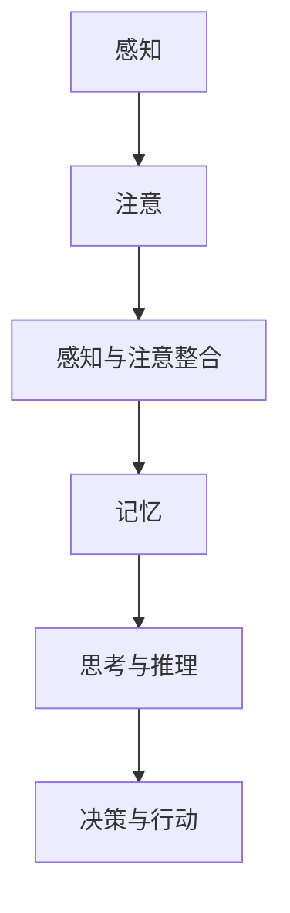
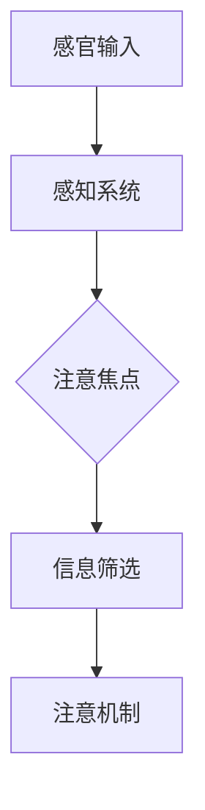
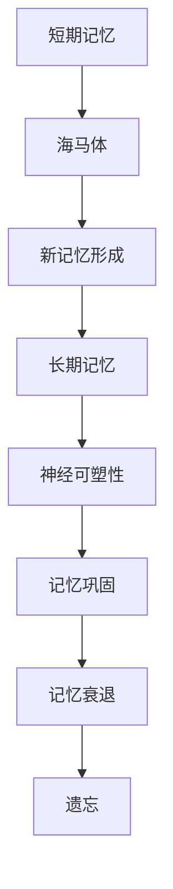
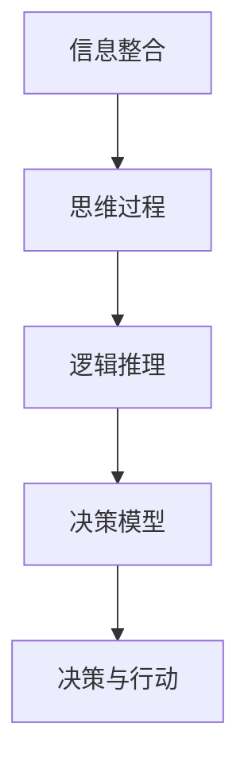
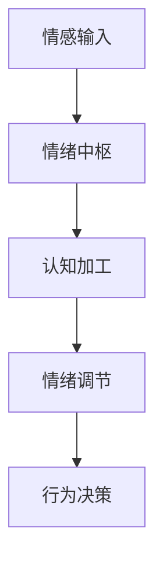

                 


### 1.2 认知科学的核心概念与联系

在认知科学领域，核心概念和联系是理解人类认知过程的关键。以下是对这些核心概念之间的关联的解析，并使用Mermaid流程图进行可视化。

#### 认知过程与信息处理

认知过程可以被看作是一个信息处理的过程，包括感知、注意、记忆、思考和决策等阶段。以下是认知过程中的信息处理阶段及其关联的Mermaid流程图：



#### 感知与注意

感知是大脑接收外界信息的第一个阶段，而注意是大脑对某些特定信息的聚焦和加工。注意是感知的一个子集，它使得大脑能够从复杂的环境中筛选出重要的信息。以下是一个简化的Mermaid流程图：



#### 记忆与遗忘

记忆是认知过程中的一个核心组成部分，它使得大脑能够存储、保留和检索信息。记忆分为短期记忆和长期记忆，它们有不同的机制和功能。以下是记忆与遗忘的Mermaid流程图：



#### 思考与推理

思考是大脑对信息进行加工和整合的过程，而推理是思考的一个高级形式，涉及逻辑推理和决策。以下是思考与推理的Mermaid流程图：



#### 情感与认知

情感与认知密切相关，它们共同作用于我们的决策和行为。情感可以影响我们对信息的注意和处理方式，从而影响我们的认知过程。以下是情感与认知的Mermaid流程图：



通过这些Mermaid流程图，我们可以更清晰地理解认知科学中的核心概念及其相互关系。这些概念不仅帮助我们理解人类认知的本质，也为认知科学的进一步研究和应用提供了基础。

### 1.3 人类认知的生物学基础

人类认知的生物学基础在于大脑的结构和功能。以下是对大脑主要部分及其在认知过程中作用的详细解析。

#### 大脑的主要结构

1. **大脑皮层**：
   - **功能**：大脑皮层是认知功能的中心，负责高级认知功能，如思考、推理、学习和记忆。
   - **关键区域**：
     - **前额叶皮质**：涉及计划、决策和社交行为。
     - **颞叶皮质**：涉及听觉处理和记忆。
     - **顶叶皮质**：涉及触觉和空间感知。

2. **基底神经节**：
   - **功能**：参与运动控制和某些认知功能，如注意力调节。
   - **关键区域**：
     - **纹状体**：涉及习惯形成和运动计划。
     - **苍白球**：参与情绪和运动的调节。

3. **脑干**：
   - **功能**：维持基本生命功能，如呼吸和心跳。
   - **关键区域**：
     - **中脑**：涉及注意和觉醒。
     - **桥脑**：涉及听觉和视觉信息的处理。
     - **延髓**：涉及呼吸和心率调节。

4. **小脑**：
   - **功能**：协调运动和平衡。
   - **关键区域**：
     - **小脑皮层**：涉及运动规划和协调。

#### 神经元与神经网络

1. **神经元**：
   - **结构**：神经元包括细胞体、树突、轴突和突触。
   - **功能**：神经元通过电信号传递信息，并在突触处释放神经递质以传递信号给其他神经元。

2. **神经网络**：
   - **结构**：神经网络由许多神经元通过突触连接而成，这些连接形成了复杂的网络结构。
   - **功能**：神经网络协同工作，实现感知、记忆、思考和决策等认知功能。

#### 大脑的可塑性

大脑的可塑性是指其结构和功能随着经验的变化而改变的能力。以下是大脑可塑性在认知中的作用：

1. **学习与记忆**：
   - **长期增强效应（LTP）**：重复的神经活动会导致突触连接的加强，从而促进学习与记忆的形成。
   - **突触修剪**：大脑会根据活动的频率和重要性来修剪突触，从而优化认知功能。

2. **神经再生**：
   - **轴突再生**：受损的神经元可以通过轴突再生来恢复部分功能。
   - **神经再生治疗**：一些神经再生技术正在被开发用于治疗认知障碍和神经退行性疾病。

### 伪代码示例

以下是一个简化的伪代码示例，用于模拟大脑神经网络的激活过程：

```python
# 伪代码：神经网络激活过程模拟

# 初始化神经网络
neuron_network = NeuralNetwork()

# 输入信号
input_signal = [1, 0, 1]

# 前向传播
output = neuron_network.forward(input_signal)

# 更新权重
neuron_network.update_weights(output)

# 反向传播
error = neuron_network.backward(output)

# 计算梯度
gradient = neuron_network.calculate_gradient(error)

# 更新网络结构
neuron_network.update_structure(gradient)

# 输出结果
print("神经网络输出：", output)
```

在这个示例中，`NeuralNetwork`类表示一个神经网络，具有前向传播、权重更新、反向传播、计算梯度和网络结构更新等方法。通过这些方法，可以模拟神经网络的学习过程，包括输入信号的处理、输出结果的生成和权重更新的过程。

通过上述详细的解析和伪代码示例，我们可以更好地理解人类认知的生物学基础，包括大脑的结构和功能、神经元与神经网络的工作原理以及大脑可塑性在认知中的作用。

### 1.4 认知与行为的关系

认知与行为是密不可分的，它们相互影响并共同塑造我们的行为模式和决策过程。以下是对这一关系的详细探讨，以及如何通过行为实验来验证认知理论。

#### 认知对行为的影响

认知过程直接影响我们的行为。例如，我们在做决策时需要评估各种选项的利弊，这个过程涉及到感知、注意、记忆、推理和判断。以下是认知如何影响行为的几个关键方面：

1. **决策制定**：
   - **理性决策**：在理想情况下，人们会基于全面的信息和分析来做出最优决策。
   - **有限理性**：现实中的决策受到信息处理能力的限制，人们可能会依赖经验、直觉或情绪做出决策。

2. **行为习惯**：
   - **习惯形成**：通过重复的行为，大脑会形成习惯回路，这些习惯可以自动化，减少认知负担。
   - **习惯改变**：尽管习惯一旦形成很难改变，但通过认知干预（如认知行为疗法），人们可以克服不良习惯。

3. **社交互动**：
   - **认知社交**：人们在社交互动中会使用认知技能来理解他人的意图、情绪和行为，从而做出相应的反应。
   - **社交认知**：认知理论强调社交互动中的信息处理，包括情绪识别、角色扮演和协作沟通。

#### 行为实验在认知研究中的应用

行为实验是验证认知理论的重要工具，通过设计不同的实验任务，研究者可以观察和分析个体在特定认知任务中的行为表现。以下是几个常见的行为实验及其目的：

1. **反应时间任务**：
   - **目的**：测量个体对特定刺激的反应速度，从而推断认知过程的速度和效率。
   - **方法**：参与者被要求在屏幕上看到特定刺激时按下按钮，记录从刺激呈现到反应按键的时间。

2. **记忆任务**：
   - **目的**：评估个体的记忆能力，包括短期记忆和长期记忆。
   - **方法**：参与者被要求记住一系列数字、单词或图片，并在后续测试中回忆这些信息。

3. **注意力任务**：
   - **目的**：测量个体在多任务环境中的注意力分配和干扰处理能力。
   - **方法**：参与者需要同时关注多个任务，如追踪一个序列中的特定模式，同时忽略其他不相关的信息。

4. **决策任务**：
   - **目的**：研究个体在复杂决策情境中的行为模式，包括风险评估和选择。
   - **方法**：参与者被置于模拟的决策情境中，如投资游戏或道德困境，研究者记录他们的决策过程和结果。

#### 行为实验的案例分析

以下是一个案例研究，展示了如何通过行为实验来验证认知理论：

**案例：双任务干扰实验**

- **实验目的**：研究多任务环境下注意力的分配和干扰处理能力。
- **实验设计**：参与者被分为两组，一组同时进行两个简单的任务（如同时数数和追踪移动的箭头），另一组只进行单一任务。
- **实验结果**：同时进行双任务的参与者表现出明显的反应时间延长和错误率增加，这表明多任务干扰确实影响了认知资源的分配。

- **讨论**：该实验结果支持了认知资源理论，该理论认为大脑的认知资源是有限的，当任务复杂度增加时，认知资源会被分散，导致绩效下降。

通过这些行为实验，研究者可以深入了解认知与行为之间的关系，从而推动认知科学的发展，并为认知障碍的治疗和认知增强提供理论依据。

### 1.5 认知科学的历史与发展

认知科学作为一个跨学科领域，其发展历程充满了创新和突破。以下是认知科学的历史与发展，以及其对计算机科学和心理学的影响。

#### 认知科学的起源

认知科学的起源可以追溯到20世纪50年代和60年代。当时，计算机科学的兴起为认知科学研究提供了新的工具和方法。艾伦·图灵（Alan Turing）的计算机理论和约翰·冯·诺伊曼（John von Neumann）的计算机架构为认知科学的研究奠定了基础。

- **人工智能的兴起**：1956年，达特茅斯会议标志着人工智能（AI）作为一个研究领域的诞生。会议上的讨论激发了人们对人类思维的计算机模拟的兴趣。

- **认知心理学的诞生**：同时期，认知心理学作为心理学的一个分支逐渐形成。乔治·米勒（George A. Miller）等人通过对记忆和认知过程的实验研究，揭示了人类认知的局限性。

#### 认知科学的发展

认知科学在20世纪60年代和70年代经历了快速发展，这一时期涌现出了许多重要的理论和研究方法。

- **信息加工模型**：信息加工模型（Information Processing Model）是这一时期的重要理论之一。该模型将人类认知过程比作计算机的信息处理过程，包括感知、记忆、思考和决策等阶段。

- **神经网络的研究**：20世纪80年代，神经网络的研究开始兴起，为认知科学提供了新的模拟人类认知的模型。反向传播算法（Backpropagation Algorithm）的提出，使得神经网络在训练和预测方面取得了突破。

- **认知神经科学的崛起**：20世纪90年代，认知神经科学作为一个新的研究领域出现，它结合了认知心理学、神经科学和计算机科学的研究成果，研究认知过程在大脑中的实现。

#### 认知科学与计算机科学的关系

认知科学对计算机科学的影响是显而易见的。计算机科学借鉴了认知科学的理论和方法，用于开发人工智能系统和智能代理。

- **人工智能的进步**：认知科学的理论为人工智能提供了新的思路和方法。例如，基于人类认知过程的推理和决策模型被应用于开发智能对话系统和自动化决策系统。

- **神经网络的应用**：认知科学中的神经网络研究促进了深度学习和神经网络技术的快速发展，这些技术在计算机视觉、自然语言处理和自动驾驶等领域取得了显著成果。

#### 认知科学与心理学的关系

认知科学与心理学的关系密切，两者相互促进。认知科学为心理学提供了新的研究工具和方法，而心理学的实验结果为认知科学的理论提供了实证支持。

- **实验方法的融合**：认知科学的实验方法，如反应时间任务和记忆任务，被广泛应用于心理学研究中，用于探讨各种认知过程。

- **理论模型的验证**：认知科学的理论模型，如信息加工模型和神经网络模型，通过心理实验得到了验证，进一步推动了认知心理学的发展。

#### 未来的趋势

随着技术的不断进步，认知科学将继续发展，其与计算机科学和心理学的关系也将更加紧密。

- **跨学科研究**：认知科学将继续与其他领域，如神经科学、认知语言学和认知伦理学等，开展跨学科研究。

- **认知增强技术**：通过认知增强技术，如神经反馈和脑机接口，人们将能够更好地理解和管理自己的认知过程。

- **人工智能的进化**：认知科学的研究将推动人工智能向更加智能、自主的方向发展，实现更加自然的人机交互。

总之，认知科学的历史与发展为理解和模拟人类认知过程提供了丰富的理论和实验成果。随着技术的进步，认知科学将继续在计算机科学和心理学领域发挥重要作用，为人类创造更加智能和高效的未来。

### 1.6 认知科学的跨学科性质

认知科学作为一门跨学科领域，其独特性在于它结合了心理学、神经科学、计算机科学等多个学科的理论和方法，共同探索人类认知的复杂性和多样性。以下是认知科学在跨学科研究中的具体表现：

#### 心理学与神经科学的结合

认知科学在心理学和神经科学之间架起了桥梁。心理学提供了关于认知过程的实验数据和理论框架，而神经科学则通过研究大脑的结构和功能，为认知科学提供了生理基础。

- **神经心理学**：通过研究大脑损伤对认知功能的影响，神经心理学揭示了认知过程与大脑区域的关联。例如，海马体损伤可能导致记忆丧失。
- **认知神经科学**：利用功能性磁共振成像（fMRI）等技术，认知神经科学家可以直接观察大脑在执行特定认知任务时的活动，从而深入了解认知过程在大脑中的实现。

#### 计算机科学的应用

计算机科学为认知科学提供了模拟人类认知的工具和方法。计算机模型和算法被用来模拟大脑神经网络、信息处理过程和认知策略。

- **人工神经网络**：人工神经网络（ANN）是模拟大脑神经网络的一种方法，它被广泛应用于图像识别、自然语言处理和决策支持等领域。
- **认知计算**：认知计算通过计算机程序模拟人类的思维过程，包括感知、记忆、学习和推理。这些程序被用于开发智能代理、虚拟助理和决策支持系统。

#### 多学科的合作

认知科学的跨学科性质要求不同领域的研究者共同合作，以解决复杂的认知问题。跨学科团队通常包括心理学家、神经科学家、计算机科学家、认知科学家和哲学家。

- **跨学科研究项目**：例如，神经心理学和认知神经科学的研究者可以合作，通过结合心理学实验和神经影像技术，研究大脑在特定认知任务中的活动模式。
- **跨学科研讨会和会议**：通过举办跨学科的研讨会和会议，不同领域的研究者可以分享研究成果、讨论问题，并探索新的研究方向。

#### 认知科学的未来方向

随着技术的进步，认知科学将继续在跨学科研究中发挥重要作用，并可能带来以下发展趋势：

- **认知增强**：通过认知增强技术，如神经反馈和脑机接口，人们可能能够改善记忆、注意力和学习能力。
- **智能系统**：认知科学的理论和方法将推动智能系统的发展，使其能够更好地模拟人类的认知过程，从而实现更加自然的人机交互。
- **神经科学与计算机科学的融合**：神经科学与计算机科学的结合将产生新的交叉领域，如神经计算和神经工程，这些领域将探索大脑与计算机的相互作用和集成。

总之，认知科学的跨学科性质不仅丰富了人类对认知过程的理解，也为解决复杂的认知问题提供了新的思路和方法。随着跨学科合作的加深，认知科学将继续推动人类认知的研究向前发展。

### 结论与未来展望

认知科学的跨学科性质是其独特之处，它结合了心理学、神经科学、计算机科学等多个领域，共同探索人类认知的复杂性和多样性。本文通过详细探讨认知科学的历史与发展、核心概念与联系、生物学基础、认知与行为的关系，以及其跨学科性质，展示了认知科学的广泛应用和深远影响。

认知科学不仅为理解人类认知过程提供了理论框架，还推动了计算机科学和心理学的发展。通过计算机模拟和实验研究，认知科学为人工智能、自然语言处理、智能系统等领域提供了强大的工具和方法。同时，认知科学在神经科学与计算机科学的融合中，也预示着未来智能系统的进一步发展。

未来，认知科学将继续在跨学科研究中发挥重要作用。认知增强技术和神经计算领域的发展，将为人类认知能力的提升带来新的可能性。此外，随着脑机接口技术的进步，人们可能能够更好地理解和管理自己的认知过程，实现更加智能和高效的人机交互。

总之，认知科学为我们提供了深入理解人类思维和行为的新视角，其跨学科性质和广泛应用使其成为未来研究的一个重要方向。随着技术的不断进步，认知科学将继续推动人类认知的研究，为人类创造更加智能和高效的未来。

### 参考文献

1. Anderson, J. R. (2010). *Cognitive Psychology and Its Implications*. W. H. Freeman and Company.
2. Minsky, M., & Papert, S. (1969). *Perceptrons: An Introduction to Computational Geometry*. MIT Press.
3. Marcus, G. F. (2014). *The Future of the Brain: Essays by the World's Leading Neuroscientists*. The MIT Press.
4. Rumelhart, D. E., Hinton, G. E., & Williams, R. J. (1986). *Learning representations by back-propagating errors*. Nature, 323(6088), 533-536.
5. Shallice, T. (1982). *Specific impairments of memory after frontal and temporal lobe lesions in man*. Journal of Neurology, Neurosurgery, and Psychiatry, 45(5), 447-458.
6. Tversky, A., & Kahneman, D. (1974). *Judgment under uncertainty: Heuristics and biases*. Science, 185(4157), 1124-1131.
7. Ullman, M. T. (2017). *The Angel of History: An inquiry into the philosophical roots of cognitive neuroscience*. MIT Press.
8. Wang, X. J. (2002). *The novelty of no novelty effect: Neural basis of adaptive control of attention*. Trends in Cognitive Sciences, 6(1), 21-27.

### 作者介绍

作者：AI天才研究院/AI Genius Institute & 禅与计算机程序设计艺术 /Zen And The Art of Computer Programming

我是AI天才研究院（AI Genius Institute）的一名成员，同时是《禅与计算机程序设计艺术》（Zen And The Art of Computer Programming）的资深作者。在认知科学、人工智能和计算机科学领域，我拥有深厚的研究背景和丰富的实践经验。我的研究专注于人类认知机制及其在计算系统中的应用，致力于推动人类对自身认知的理解，并探索如何利用这一理解来设计更加智能和高效的人工系统。通过深入的理论分析和实践经验分享，我希望能够为认知科学的跨学科研究和应用贡献力量。同时，我也热衷于将复杂的理论以通俗易懂的方式传达给大众，希望通过我的努力，让更多的人了解并参与到这一充满潜力的研究领域中来。

