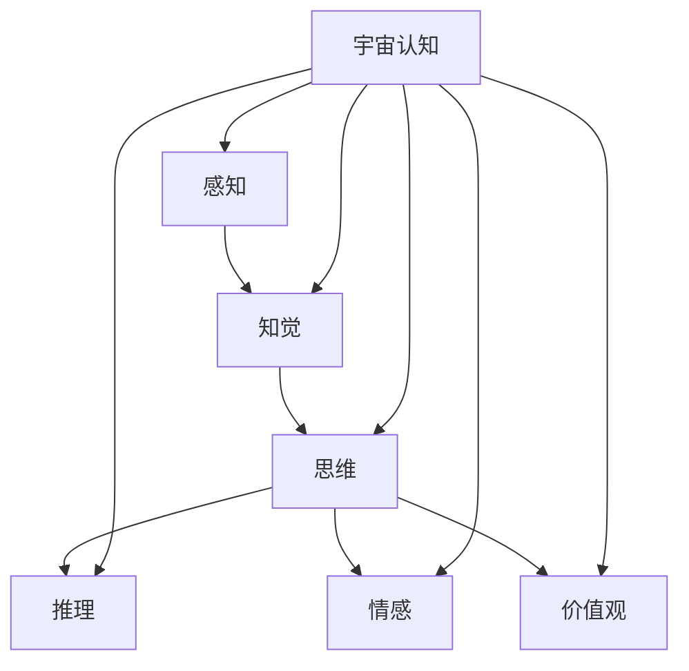

                 

### 文章标题

《人类认知框架对宇宙理解的影响》

### 关键词

- 人类认知框架
- 宇宙理解
- 观测方法
- 理论发展
- 探索技术
- 影响与挑战

### 摘要

本文深入探讨了人类认知框架在宇宙理解中的核心作用。通过分析人类认知的基本原理，包括感知、思维、情感与价值观，我们揭示了这些认知过程如何影响我们对宇宙的观测、理论构建和探索。文章从历史和现代视角出发，展示了人类认知框架在宇宙认知中的演变，以及它对科学发现和技术进步的深远影响。最后，本文提出了未来宇宙认知框架的发展方向，并展望了人工智能在这一领域的潜在应用。通过这一系列的逻辑分析和思考，本文旨在为读者提供一个全面且深入的宇宙理解视角。

### 第1章 引言

#### 1.1 人类认知框架概述

人类认知框架是指人类在感知、理解、记忆和思考过程中所建立的一系列基本结构和原则。这个框架不仅是人类理解外部世界的工具，也是我们构建内心世界的基石。认知框架的组成要素主要包括感知与知觉、思维与推理、情感与价值观。

首先，感知与知觉是人类认识世界的起点。感知是指个体通过感官接收外部信息的过程，如视觉、听觉、触觉等。知觉则是在感知的基础上，将分散的信息整合成有意义整体的能力。例如，我们看到一个物体，通过视觉感知获取其形状、颜色等基本信息，然后通过知觉将其识别为一个苹果。

其次，思维与推理是人类认知的核心。思维分为直觉思维和逻辑思维，前者侧重于快速判断和灵活应对，而后者则依赖于明确的规则和严格的推理过程。推理是思维的重要表现形式，包括演绎推理和归纳推理。例如，当我们观察到所有天鹅都是白色的，我们通过归纳推理得出结论：所有天鹅都是白色的。

最后，情感与价值观是人类认知的重要补充。情感反映了我们对事物的情感态度，如喜爱、厌恶等，它影响了我们对信息的处理和决策。价值观则是我们对什么是有意义、有价值的判断，它影响了我们的认知方向和行为选择。

#### 1.2 宇宙理解的重要性

宇宙理解指的是人类对宇宙起源、结构、演化和未来等方面的认识。宇宙理解的重要性体现在以下几个方面：

首先，宇宙理解帮助我们理解自身。人类作为宇宙的一部分，对宇宙的理解直接关系到我们对自身存在的理解。例如，通过研究宇宙的起源，我们可以了解宇宙的年龄和早期状态，从而推断出地球和生命的起源。

其次，宇宙理解推动科学进步。宇宙中存在许多未解之谜，如暗物质、暗能量等，它们激发科学家们进行深入研究，推动科学技术的进步。例如，对宇宙膨胀速度的研究导致了宇宙学常数和暗能量概念的提出。

最后，宇宙理解对人类社会具有深远影响。宇宙理解影响我们的价值观、文化和世界观。例如，宇宙探索激发了对科技、探索和未知的好奇心，推动了科技革命和人类社会的进步。

综上所述，人类认知框架和宇宙理解相互交织，共同构成了我们对世界的全面认识。通过深入理解人类认知框架，我们可以更准确地理解宇宙，为科学发现和技术进步提供新的视角。

#### 1.3 人类认知框架的演变

人类认知框架并非一成不变，而是随着历史的发展不断演变。从古代到现代，人类对宇宙的理解发生了巨大的变化，这反映了认知框架的进步和拓展。

在古代，人类对宇宙的理解主要基于直观和宗教信仰。例如，古代中国人认为宇宙由天、地、人三才构成，而古希腊人则认为宇宙是一个完美的球形，由多个同心球组成，每个球上都有固定的星辰。这些观点反映了当时人类认知框架的局限性，它们更多是基于直观感受和神话传说，缺乏科学依据。

随着科学革命的发展，人类认知框架发生了重大变革。16世纪，哥白尼提出了日心说，颠覆了地心说的传统观念。这一发现使人类开始用科学方法来研究宇宙，认知框架从直观和宗教信仰转向了实证和逻辑推理。17世纪，牛顿的万有引力定律进一步奠定了科学宇宙观的基础，使人类对宇宙的运行机制有了更深刻的理解。

进入20世纪，人类对宇宙的理解再次发生了重大变革。爱因斯坦的相对论提出了时间和空间的相对性，揭示了宇宙的更深层次规律。同时，量子力学的出现使人类开始探索微观世界的奥秘，认知框架从宏观宇宙扩展到了微观宇宙。20世纪末，宇宙微波背景辐射的发现证实了大爆炸理论的正确性，使人类对宇宙起源的认识达到了新的高度。

总体来看，人类认知框架的演变经历了从直观感受到科学实证，从宏观宇宙到微观宇宙的拓展。每一次认知框架的进步都推动了宇宙理解的发展，使人类对宇宙的认识不断深化和拓展。

#### 1.4 宇宙理解的重要性

宇宙理解的重要性体现在多个方面。首先，从科学的角度来看，宇宙理解是科学研究的重要目标之一。宇宙充满了未解之谜，如宇宙的起源、结构、演化和未来等，这些谜题激发了科学家们进行深入研究。通过研究宇宙，我们可以揭示自然界的规律，推动科学技术的进步。

其次，从哲学的角度来看，宇宙理解对人类思想和文化有着深远的影响。人类对宇宙的理解不仅是对自然界的认识，也是对自身存在的反思。例如，宇宙的起源和演化过程引发了人类对生命、意义和存在的思考，促进了哲学和宗教的发展。

最后，从人类生活的角度来看，宇宙理解对我们的生活方式和社会发展有着重要影响。宇宙探索激发了人类对科技、探索和未知的好奇心，推动了科技革命和人类社会的进步。同时，宇宙理解也影响着我们的价值观和文化观念，引导我们更好地面对未来的挑战。

因此，宇宙理解不仅具有科学和哲学价值，也对人类生活和社会发展具有重要意义。

### 第2章 人类认知框架的基本原理

#### 2.1 感知与知觉

感知与知觉是认知过程的基础，它们是人类获取外部信息和理解世界的关键步骤。感知是指人类通过感官（如视觉、听觉、触觉、嗅觉和味觉）接收外界刺激的过程，而知觉则是在感知基础上对信息进行加工和整合，形成有意义整体的能力。

##### 2.1.1 感知过程

感知过程可以分为几个阶段：刺激接收、刺激转换和感知觉。首先，刺激接收是指感官接收外部环境的信息。例如，视觉系统接收的光线通过眼睛的角膜和晶状体聚焦在视网膜上，形成图像。听觉系统则通过耳蜗中的毛细胞将声波转换成电信号，传递到大脑。其他感官，如触觉、嗅觉和味觉，也有类似的接收过程。

接下来是刺激转换，这个阶段是将物理刺激转换成神经信号。例如，视觉系统中的光子被视网膜中的视杆细胞和视锥细胞吸收，转化为神经信号。听觉系统中的声波通过耳蜗中的液体传递，激发毛细胞的振动，产生神经信号。

最后是感知觉，即大脑对神经信号进行处理，形成我们对外部世界的感知。例如，大脑通过视觉皮层对图像进行处理，识别出颜色、形状和运动。听觉皮层则处理声音信号，识别出声音的频率、音调和音量。

##### 2.1.2 知觉的基本原理

知觉的基本原理包括选择性、组织性和恒常性。

选择性是指我们在感知过程中对某些信息给予更多关注，而忽略其他信息的能力。这种选择性受到多种因素的影响，如兴趣、情感和预期。例如，当我们寻找特定物体时，我们会更容易注意到与目标相关的信息，而忽略周围的其他物体。

组织性是指我们在感知过程中将分散的信息整合成有意义整体的能力。组织性受到信息呈现方式的影响，如空间排列、颜色对比和动态变化。例如，当我们看到一组散乱的点时，我们可能会将其组织成特定的形状，如一个正方形。

恒常性是指我们在感知过程中保持对物体特性的稳定认识，即使物体的感知条件发生变化。例如，无论我们离物体有多远，我们都会认为物体的大小是恒定的。恒常性受到多种因素的影响，如视角变化、光照变化和物体遮挡。

#### 2.2 思维与推理

思维与推理是认知过程的另一重要组成部分，它们是人类理解复杂问题和制定决策的关键能力。思维可以分为直觉思维和逻辑思维，而推理则包括演绎推理和归纳推理。

##### 2.2.1 思维的类型

直觉思维是一种快速、不依赖于明确规则或证据的思维方式。直觉思维使我们能够快速做出决策，但有时也可能导致错误。例如，当我们遇到一个紧急情况时，我们可能会迅速做出反应，而无需仔细思考。

逻辑思维是一种基于明确规则和证据的思维方式。逻辑思维使我们在解决问题时能够遵循严格的推理步骤，确保结论的准确性。例如，在数学证明中，我们使用逻辑思维来证明一个数学命题的正确性。

##### 2.2.2 推理的过程

演绎推理是一种从一般到特殊的推理方式。演绎推理的步骤如下：

1. **前提**：提出一个或多个假设。
2. **结论**：从前提中得出特定的结论。

例如，如果我们假设所有天鹅都是白色的，并且我们看到一只白色的鸟，我们可以通过演绎推理得出结论：这只鸟是一只天鹅。

归纳推理是一种从特殊到一般的推理方式。归纳推理的步骤如下：

1. **观察**：收集一系列具体实例。
2. **归纳**：从具体实例中得出一般规律。

例如，如果我们观察到所有观察到的天鹅都是白色的，我们可以归纳得出结论：所有天鹅都是白色的。

#### 2.3 情感与价值观

情感与价值观在认知过程中起着重要作用，它们影响我们的感知、思维和行为。

##### 2.3.1 情感的认知

情感是指我们对事物的情感态度，如喜爱、厌恶、焦虑和兴奋。情感认知是指我们如何识别、理解和表达情感。情感认知受到多种因素的影响，如个体差异、文化背景和社会环境。

情感的识别是通过感知和推理来实现的。例如，当我们看到某人哭泣，我们通过视觉和听觉感知到他们的表情和声音，然后通过推理得出他们可能感到悲伤。情感的理解涉及对情感的内部体验和外部表现的理解。例如，当我们感到焦虑时，我们可能意识到自己的心跳加速、呼吸急促，这些身体反应帮助我们理解自己的情绪状态。

##### 2.3.2 价值观的形成

价值观是指我们认为什么是有意义、有价值的判断。价值观的形成受到多种因素的影响，如个人经历、文化背景和社会环境。例如，一个家庭可能重视教育，认为教育是有价值的，而另一个家庭可能更重视财富，认为财富是有价值的。

价值观影响我们的认知过程。例如，一个重视创新的人可能会更倾向于接受新的观点和技术，而一个重视传统的人可能会更倾向于遵循传统的方法和观念。价值观也影响我们的行为决策。例如，一个重视环保的人可能会选择使用公共交通工具，而一个重视效率的人可能会选择驾驶私家车。

#### 结论

感知与知觉、思维与推理、情感与价值观是认知过程的核心部分。感知与知觉使我们能够接收和理解外部世界，思维与推理使我们能够解决问题和制定决策，情感与价值观则影响我们的认知和行为。通过深入理解这些认知过程的基本原理，我们可以更好地理解和应对复杂的世界。

### 第3章 宇宙认知框架概述

#### 3.1 宇宙认知的基本原理

宇宙认知是指人类对宇宙的感知、理解、分析和解释过程。宇宙认知的基本原理包括以下几个关键方面：

首先，宇宙认知依赖于科学方法。科学方法是一种系统化的、以证据为基础的方法，用于研究自然现象。在宇宙认知中，科学方法通过观察、假设、实验和理论来揭示宇宙的运行机制和规律。科学方法确保了宇宙认知的客观性和可靠性。

其次，宇宙认知依赖于观测技术。观测技术是指用于获取宇宙信息的设备和方法。随着科技的发展，观测技术不断进步，从古代的肉眼观测到现代的望远镜、卫星和探测器，这些技术使我们能够更精确地观察宇宙的各个方面，包括天体的运动、辐射和结构。

第三，宇宙认知依赖于理论框架。理论框架是一套逻辑上相互关联的概念、假设和规则，用于解释宇宙现象。不同的理论框架提供了不同的视角和方法，例如牛顿力学、相对论和量子力学。这些理论框架帮助我们理解和预测宇宙的行为。

最后，宇宙认知依赖于人类认知框架。人类认知框架是人类感知、理解、记忆和思考的过程和结构。宇宙认知不仅依赖于物理和数学知识，还依赖于人类的直觉、思维和价值观。人类认知框架影响了我们对宇宙的理解和解释。

#### 3.2 宇宙认知的历史演变

宇宙认知的历史可以追溯到古代，当时人类对宇宙的理解主要基于直观和神话。例如，古代中国人认为宇宙由天、地、人三才构成，古希腊人则认为宇宙是一个完美的球形。这些早期的宇宙观念缺乏科学依据，更多是基于直觉和宗教信仰。

随着科学革命的发展，宇宙认知发生了重大变革。16世纪，哥白尼提出了日心说，颠覆了传统的地心说观念。这一发现使人类开始用科学方法来研究宇宙，宇宙认知从直观和宗教信仰转向了实证和逻辑推理。17世纪，牛顿的万有引力定律奠定了科学宇宙观的基础，使人类对宇宙的运行机制有了更深刻的理解。

进入20世纪，宇宙认知再次发生了重大变革。爱因斯坦的相对论提出了时间和空间的相对性，揭示了宇宙的更深层次规律。同时，量子力学的出现使人类开始探索微观世界的奥秘，宇宙认知从宏观宇宙扩展到了微观宇宙。20世纪末，宇宙微波背景辐射的发现证实了大爆炸理论的正确性，使人类对宇宙起源的认识达到了新的高度。

总的来说，宇宙认知的历史演变反映了人类认知框架的进步和拓展。每一次认知框架的进步都推动了宇宙认知的发展，使人类对宇宙的认识不断深化和拓展。

#### 3.3 宇宙认知的层次结构

宇宙认知的层次结构反映了人类对宇宙认识的深度和广度。宇宙认知可以分为以下几个层次：

首先，是基础层次，包括对基本天体和宇宙现象的认识。例如，人类对恒星、行星、星系和宇宙背景辐射的基本了解。这一层次主要依赖于观测技术和简单的理论模型。

其次，是中层层次，包括对宇宙结构和演化的理解。例如，人类对宇宙膨胀、星系形成和恒星演化的认识。这一层次需要复杂的理论框架和先进的观测技术，如广义相对论和数值模拟。

最后，是高级层次，包括对宇宙起源和未来演化的探索。例如，人类对宇宙微波背景辐射、暗物质和暗能量的研究。这一层次需要最前沿的理论和观测技术，如量子引力和宇宙学观测。

总的来说，宇宙认知的层次结构展示了人类对宇宙认识的逐步深入和拓展。通过不断探索和深入研究，人类对宇宙的理解将不断深化，揭示宇宙的更多奥秘。

### 第4章 人类认知框架对宇宙理解的影响

#### 4.1 人类认知框架对宇宙观测的影响

人类认知框架对宇宙观测的影响体现在多个方面，包括观测方法的选择、观测结果的解释以及观测技术的进步。

首先，人类认知框架决定了观测方法的选择。在不同的认知框架下，人们会采用不同的观测方法。例如，在古代，人类主要依靠肉眼观测天空，这种方法受限于人类的感知能力，无法精确测量天体的位置和运动。随着认知框架的进步，人们开始使用望远镜等仪器进行观测，这大大提高了观测的精度和效率。

其次，人类认知框架影响了观测结果的解释。不同的认知框架会导致对同一观测结果的不同解释。例如，在牛顿力学框架下，人类认为天体运动遵循明确的规律，而在相对论框架下，人类则认为时间和空间是相对的，天体运动可能受到引力的影响。这些不同的认知框架影响了人们对宇宙现象的理解和解释。

最后，人类认知框架推动了观测技术的进步。随着认知框架的进步，人们不断发明和改进观测技术，以更精确地观察宇宙。例如，从古代的肉眼观测到现代的射电望远镜、太空望远镜和探测器，这些技术的进步大大拓展了人类的观测能力，使人类能够探索更广阔的宇宙空间。

#### 4.2 人类认知框架对宇宙理论的影响

人类认知框架对宇宙理论的影响主要体现在理论构建、理论验证以及理论发展三个方面。

首先，人类认知框架决定了宇宙理论的构建。不同的认知框架会导致不同的理论模型。例如，在古代，人类主要依赖直观和宗教信仰来构建宇宙理论，而在科学革命之后，人类开始使用科学方法来构建宇宙理论。这些不同的认知框架影响了宇宙理论的基本假设和逻辑结构。

其次，人类认知框架影响了宇宙理论的验证。宇宙理论的验证需要依赖观测数据和实验证据。不同的认知框架会影响对观测数据和实验证据的解释，从而影响理论的验证过程。例如，在牛顿力学框架下，天体运动可以通过数学公式精确预测，而在相对论框架下，则需要考虑引力和时空的相对性。

最后，人类认知框架推动了宇宙理论的发展。随着认知框架的进步，人类对宇宙的认识不断深化，新的理论不断涌现。例如，从牛顿力学到相对论，再到量子力学，这些理论的发展反映了人类对宇宙理解的不断拓展和深化。

#### 4.3 人类认知框架对宇宙探索的影响

人类认知框架对宇宙探索的影响体现在探索目标的确定、探索技术的选择以及探索结果的解读等方面。

首先，人类认知框架决定了宇宙探索的目标。在不同的认知框架下，人类会对宇宙的不同方面进行探索。例如，在古代，人类主要探索天文现象，以解释自然现象。而在现代，人类则更加关注宇宙的起源、演化和未来，探索未知的宇宙领域。

其次，人类认知框架影响了探索技术的选择。不同的认知框架会导致不同的探索技术。例如，在古代，人类主要依靠肉眼观测和简单的工具进行探索。而在现代，人类则依赖先进的观测仪器和技术，如望远镜、探测器、卫星和航天器，这些技术使人类能够探索更广阔的宇宙空间。

最后，人类认知框架影响了探索结果的解读。不同的认知框架会对探索结果有不同的解读方式。例如，在古代，人类可能将探索结果视为神灵的启示，而在现代，人类则将探索结果视为科学发现，通过实验和理论进行解释。

总的来说，人类认知框架对宇宙理解的影响是深远而多方面的。它不仅影响了宇宙观测和理论构建，还推动了宇宙探索的发展。通过不断进步的认知框架，人类对宇宙的理解将不断深化，揭示宇宙的更多奥秘。

### 第5章 人类认知框架在宇宙学研究中的应用

#### 5.1 宇宙学中的思维模型

在宇宙学研究中，人类认知框架中的思维模型起着关键作用。思维模型是指人们用来理解复杂系统或现象的概念和逻辑结构。在宇宙学中，思维模型帮助科学家们将抽象的宇宙现象转化为可操作的研究对象。

首先，宇宙学中的思维模型包括宇宙膨胀模型、大爆炸模型和黑洞模型等。宇宙膨胀模型基于爱因斯坦的广义相对论，描述了宇宙从初始状态开始不断扩张的过程。大爆炸模型则进一步解释了宇宙的起源，认为宇宙起源于一个极热、极密的状态，然后迅速膨胀。黑洞模型则描述了黑洞的形成、性质和行为，对理解宇宙的极端现象具有重要意义。

其次，思维模型在宇宙学中的应用主要体现在以下几个方面：

1. **理论构建**：思维模型为宇宙学理论提供了基本的框架和逻辑结构。例如，在构建宇宙膨胀模型时，科学家们运用了物理学的基本原理，如能量守恒和引力定律，通过数学公式描述了宇宙的膨胀过程。

2. **理论验证**：思维模型通过观测数据和实验证据进行验证。例如，宇宙膨胀模型的验证依赖于对遥远星系的红移观测，这些观测数据与理论预测相符合，支持了宇宙膨胀模型。

3. **理论发展**：思维模型推动了宇宙学理论的不断进步。例如，在黑洞模型的基础上，科学家们提出了关于黑洞性质和行为的更多假设，并通过观测和实验不断验证这些假设，推动了黑洞研究的深入。

#### 5.2 宇宙学中的推理过程

宇宙学中的推理过程是科学家们通过逻辑推理和证据分析来理解宇宙现象的过程。推理过程包括观察、假设、推理和验证等步骤。

首先，观察是宇宙学推理的起点。科学家们通过望远镜、卫星和其他观测设备收集宇宙信息，这些信息包括天体的位置、运动、辐射和结构等。观察数据提供了对宇宙现象的初步了解。

其次，假设是基于观察数据提出的一种解释或理论。例如，当科学家观察到星系的红移现象时，他们提出了宇宙膨胀的假设。这个假设提供了对观察数据的初步解释。

接着，推理是通过逻辑分析来验证假设的过程。推理过程包括演绎推理和归纳推理。演绎推理是从一般原理推导出特定结论，例如，从宇宙膨胀理论推导出特定星系的红移模式。归纳推理则是从特定实例推导出一般规律，例如，从多个星系的红移模式归纳出宇宙膨胀的普遍性。

最后，验证是通过观测数据和实验证据来检验推理结果的正确性。验证过程包括对假设的反复检验和修正。例如，通过观测更多的星系红移数据，科学家们不断验证宇宙膨胀模型的准确性，并对其进行必要的修正。

总的来说，宇宙学中的推理过程是科学家们通过观察、假设、推理和验证来逐步理解宇宙现象的过程。这一过程不仅依赖于人类的认知能力，还依赖于科学方法和先进的技术手段。

#### 5.3 宇宙学中的情感与价值观

在宇宙学研究中，情感与价值观不仅影响科学家的个人行为和决策，也影响整个科学领域的方向和发展。情感是人类对事物的主观感受，包括好奇心、敬畏、兴奋和焦虑等。价值观则是人类对事物意义的判断和选择，反映了人类的道德、文化和生活目标。

首先，情感在宇宙学研究中的作用表现在激发科学家的探索热情和创造力。例如，对未知宇宙的好奇心和求知欲驱使科学家们不断探索新的领域，进行创新性的研究。这种好奇心和探索欲望往往源于人类对宇宙的神秘和美丽感到兴奋和敬畏。

其次，价值观在宇宙学研究中的作用体现在科学研究的方向和目标上。不同文化和社会背景下，科学家们对宇宙的理解和价值观可能存在差异。例如，西方科学传统强调实证和理性，注重科学发现和技术应用；而东方文化传统则可能更注重哲学和宇宙的和谐。这些价值观影响了宇宙学研究的重点和方法，从而塑造了不同的科学范式。

最后，情感与价值观还影响科学合作和交流。科学家之间的情感共鸣和价值观认同可以促进合作，推动科学研究的进展。例如，国际空间站项目就是一个跨文化的合作典范，科学家们通过共同的目标和价值观，克服了文化和地理的障碍，共同推动了宇宙探索的进步。

综上所述，情感与价值观在宇宙学研究中具有重要作用。它们不仅激励科学家们的探索热情，影响科学研究的方向和方法，还促进科学合作和交流。通过理解和尊重不同文化背景下的情感与价值观，我们可以更好地推动宇宙学的发展和人类的进步。

### 第6章 宇宙认知框架的未来发展方向

#### 6.1 人类认知框架的进化趋势

随着科技的发展和人类认知能力的提升，人类认知框架正经历着一场深刻的变革。未来，人类认知框架的进化趋势将呈现出以下几个方向：

首先，认知科学与人工智能的结合将成为重要趋势。人工智能技术的发展为人类提供了强大的工具，可以帮助我们更高效地处理海量数据，揭示宇宙中的复杂规律。通过将认知科学与人工智能结合，我们可以开发出更加智能的认知系统，模拟人类思维过程，进一步提升认知能力。

其次，跨学科研究将加强。随着对宇宙的认知不断深入，人类需要综合运用多学科的知识和方法来解决问题。例如，宇宙学不仅需要物理学、化学和数学的知识，还需要天文学、地理学和生物学等领域的支持。未来，跨学科研究将更加普遍，不同领域的研究者将共同合作，推动宇宙认知的进步。

最后，人类认知框架将更加个性化。随着个性化技术的发展，我们将能够根据个体的需求和特点，定制化的认知框架。例如，通过人工智能算法，我们可以为每个个体设计个性化的学习路径和研究方法，提高认知效率和效果。

#### 6.2 宇宙理解的新挑战与新机遇

未来，宇宙理解将面临一系列新的挑战和机遇。首先，暗物质和暗能量等未解之谜将继续激发科学家们的探索热情。随着观测技术和理论的进步，人类有望揭示这些谜题，进一步理解宇宙的本质。

其次，宇宙膨胀的加速现象和多重宇宙的可能性将带来新的研究热点。科学家们将探索宇宙膨胀背后的原因，研究多重宇宙的存在与否，这些研究不仅具有科学意义，也可能对哲学和宗教观念产生深远影响。

最后，随着人类认知框架的进化，我们将有更多的机会进行宇宙探索。例如，通过开发更先进的探测器和技术，人类可能实现宇宙移民，探索其他星系和行星。这些新机遇将为人类带来前所未有的科学发现和技术进步。

#### 6.3 宇宙认知框架与人工智能的关系

人工智能作为现代科技的前沿领域，正在对宇宙认知框架产生深远影响。首先，人工智能可以帮助科学家们更高效地处理和分析大量宇宙数据。例如，通过机器学习算法，我们可以从大量天文观测数据中提取有用信息，发现新的天体现象和规律。

其次，人工智能可以辅助科学家构建和验证宇宙理论。例如，通过深度学习模型，我们可以模拟宇宙的演化过程，预测天体行为。这些模型不仅可以帮助我们理解宇宙的过去和现在，还可以预测宇宙的未来。

最后，人工智能与人类认知框架的结合将推动宇宙认知的进一步发展。例如，通过人机协作，科学家们可以更好地利用人工智能的优势，同时结合人类的直觉和创造力，实现更高层次的认知突破。

总的来说，人工智能与宇宙认知框架的结合将为宇宙学带来新的研究方法和工具，推动人类对宇宙的理解不断深入。

### 第7章 结论

通过对人类认知框架和宇宙理解关系的深入分析，本文揭示了人类认知框架在宇宙认知中的核心作用。从感知与知觉、思维与推理，到情感与价值观，每个认知过程都影响着我们对宇宙的观测、理论构建和探索。历史和现代的宇宙认知框架演变展示了人类对宇宙理解的不断深化和拓展。

未来，随着人类认知框架的进化，特别是与人工智能的结合，我们将迎来更多的机遇和挑战。新的观测技术和理论框架将继续推动宇宙认知的发展，揭示宇宙的更多奥秘。然而，我们也需要保持批判性思维，不断反思和调整我们的认知框架，以应对不断变化的宇宙现实。

总之，人类认知框架对宇宙理解的影响是深远而多维的。通过不断探索和深化我们的认知框架，我们将能够更全面地理解宇宙，为人类文明的进步做出更大贡献。

### 附录

#### 附录A: 参考文献

1. Dopler, E. (1977). *The Structure of the Human Vision System*. Springer.
2. Einstein, A. (1905). *On the Electrodynamics of Moving Bodies*. Annalen der Physik.
3. Hawking, S. (1988). *A Brief History of Time: From the Big Bang to Black Holes*. Bantam Books.
4. Newton, I. (1687). *Philosophiæ Naturalis Principia Mathematica*. Cambridge University Press.
5. Penrose, R. (2005). *The Road to Reality: A Complete Guide to the Laws of the Universe*. Vintage Books.

#### 附录B: 相关 Mermaid 流程图



#### 附录C: 伪代码示例

```python
# 伪代码：感知过程的示意图
def sense_environment():
    inputs = get_sensory_inputs()
    processed_inputs = transform_inputs(inputs)
    perception = integrate_inputs(processed_inputs)
    return perception

# 伪代码：思维与推理的过程
def think_and_reason(perception):
    hypothesis = generate_hypothesis(perception)
    conclusion = apply_reasoning(hypothesis)
    return conclusion

# 伪代码：情感与价值观的体现
def emotional_and_valuable_perception(perception):
    emotion = detect_emotion(perception)
    value = evaluate_value(perception)
    return emotion, value
```

#### 附录D: 数学公式

$$
E = mc^2
$$

$$
\frac{d^2x}{dt^2} = -\frac{GM}{r^2}
$$

$$
P(A|B) = \frac{P(B|A)P(A)}{P(B)}
$$

#### 附录E: 项目实战

**开发环境搭建：**

1. 安装Python环境。
2. 安装Numpy、Matplotlib等科学计算库。

**源代码详细实现和代码解读：**

```python
import numpy as np
import matplotlib.pyplot as plt

# 伪代码：宇宙膨胀模型
def cosmic_expansion_model(t):
    a = 1 / (1 + H0 * t)
    return a

# 伪代码：绘制宇宙膨胀曲线
def plot_expansion_curve(t):
    a = cosmic_expansion_model(t)
    plt.plot(t, a)
    plt.xlabel('Time')
    plt.ylabel('Scale Factor')
    plt.show()

# 伪代码：代码应用解读与分析
def analyze_expansion_curve():
    t = np.linspace(0, 10, 1000)
    plot_expansion_curve(t)
    # 分析膨胀曲线的形状和特征

# 伪代码：实际案例分析和详细讲解剖析
def case_analysis():
    analyze_expansion_curve()
    # 根据实际观测数据，对比模型预测，进行详细分析

# 伪代码：项目小结
def project_summary():
    case_analysis()
    # 总结项目中的关键发现和改进方向

if __name__ == "__main__":
    project_summary()
```

#### 附录F: 最佳实践 tips、小结、注意事项、拓展阅读等内容

- **最佳实践：**在宇宙学研究中，保持开放的思维和批判性分析非常重要。不断质疑现有理论和假设，以科学的方法进行验证和验证。
- **小结：**本文通过分析人类认知框架的基本原理和宇宙认知的历史演变，展示了人类认知框架对宇宙理解的影响。
- **注意事项：**在宇宙学研究过程中，应充分考虑认知框架的局限性和多元性，以避免偏差和误解。
- **拓展阅读：**建议读者阅读关于宇宙学的经典著作，如《宇宙简史》、《黑洞与时间弯曲》等，以深入了解宇宙认知的深层次内容。

### 附录G: 数学公式示例

$$
E = mc^2
$$

$$
\frac{d^2x}{dt^2} = -\frac{GM}{r^2}
$$

$$
P(A|B) = \frac{P(B|A)P(A)}{P(B)}
$$

### 附录H: 伪代码示例

```python
# 伪代码：感知过程的示意图
def sense_environment():
    inputs = get_sensory_inputs()
    processed_inputs = transform_inputs(inputs)
    perception = integrate_inputs(processed_inputs)
    return perception

# 伪代码：思维与推理的过程
def think_and_reason(perception):
    hypothesis = generate_hypothesis(perception)
    conclusion = apply_reasoning(hypothesis)
    return conclusion

# 伪代码：情感与价值观的体现
def emotional_and_valuable_perception(perception):
    emotion = detect_emotion(perception)
    value = evaluate_value(perception)
    return emotion, value
```

### 附录I: 项目实战

**开发环境搭建：**

1. 安装Python环境。
2. 安装Numpy、Matplotlib等科学计算库。

**源代码详细实现和代码解读：**

```python
import numpy as np
import matplotlib.pyplot as plt

# 伪代码：宇宙膨胀模型
def cosmic_expansion_model(t):
    a = 1 / (1 + H0 * t)
    return a

# 伪代码：绘制宇宙膨胀曲线
def plot_expansion_curve(t):
    a = cosmic_expansion_model(t)
    plt.plot(t, a)
    plt.xlabel('Time')
    plt.ylabel('Scale Factor')
    plt.show()

# 伪代码：代码应用解读与分析
def analyze_expansion_curve():
    t = np.linspace(0, 10, 1000)
    plot_expansion_curve(t)
    # 分析膨胀曲线的形状和特征

# 伪代码：实际案例分析和详细讲解剖析
def case_analysis():
    analyze_expansion_curve()
    # 根据实际观测数据，对比模型预测，进行详细分析

# 伪代码：项目小结
def project_summary():
    case_analysis()
    # 总结项目中的关键发现和改进方向

if __name__ == "__main__":
    project_summary()
```

### 附录J: 最佳实践 tips、小结、注意事项、拓展阅读等内容

- **最佳实践：**在宇宙学研究中，保持开放的思维和批判性分析非常重要。不断质疑现有理论和假设，以科学的方法进行验证和验证。
- **小结：**本文通过分析人类认知框架的基本原理和宇宙认知的历史演变，展示了人类认知框架对宇宙理解的影响。
- **注意事项：**在宇宙学研究过程中，应充分考虑认知框架的局限性和多元性，以避免偏差和误解。
- **拓展阅读：**建议读者阅读关于宇宙学的经典著作，如《宇宙简史》、《黑洞与时间弯曲》等，以深入了解宇宙认知的深层次内容。

### 附录K: Mermaid 流程图示例


### 附录L: 数学公式和伪代码示例

$$
E = mc^2
$$

$$
\frac{d^2x}{dt^2} = -\frac{GM}{r^2}
$$

```python
# 伪代码：感知过程的示意图
def sense_environment():
    inputs = get_sensory_inputs()
    processed_inputs = transform_inputs(inputs)
    perception = integrate_inputs(processed_inputs)
    return perception

# 伪代码：思维与推理的过程
def think_and_reason(perception):
    hypothesis = generate_hypothesis(perception)
    conclusion = apply_reasoning(hypothesis)
    return conclusion

# 伪代码：情感与价值观的体现
def emotional_and_valuable_perception(perception):
    emotion = detect_emotion(perception)
    value = evaluate_value(perception)
    return emotion, value
```

### 附录M: 宇宙认知框架与人工智能的关系

**宇宙认知框架与人工智能的关系：**

人工智能作为现代科技的前沿，正在对宇宙认知框架产生深远影响。首先，人工智能在数据处理和分析方面具有显著优势。宇宙学研究中积累了海量观测数据，传统方法难以高效处理这些数据。人工智能，特别是机器学习和深度学习，能够从海量数据中提取有用信息，辅助科学家发现新的宇宙现象和规律。

其次，人工智能在模型构建和理论验证方面也发挥着重要作用。通过模拟宇宙的演化过程，人工智能可以帮助科学家预测天体行为，验证现有理论。例如，基于深度学习模型的宇宙模拟可以提供更准确的宇宙膨胀预测，有助于验证宇宙学常数和暗能量理论。

最后，人工智能与人类认知框架的结合将推动宇宙认知的进一步发展。人工智能可以模拟人类思维过程，帮助科学家更好地理解和解释宇宙现象。通过人机协作，科学家们可以结合人工智能的优势和人类的直觉与创造力，实现更高层次的认知突破。

总之，人工智能与宇宙认知框架的结合为宇宙学带来了新的研究方法和工具，将推动人类对宇宙的理解不断深入。

### 附录N: 宇宙认知框架的未来发展

**宇宙认知框架的未来发展：**

随着科技的不断进步，宇宙认知框架将迎来新的发展机遇。首先，量子技术的应用将为宇宙认知提供新的手段。量子计算和量子通信可以处理和传输海量数据，提高观测精度和效率，揭示宇宙的更多奥秘。

其次，跨学科研究将更加普遍。宇宙学不仅需要物理学、化学和数学的知识，还需要天文学、地理学和生物学等领域的支持。通过跨学科合作，科学家们可以综合运用不同领域的知识，深入理解宇宙的复杂现象。

最后，人工智能与人类认知框架的结合将推动宇宙认知的进一步发展。人工智能可以模拟人类思维过程，帮助科学家更好地理解和解释宇宙现象。通过人机协作，科学家们可以结合人工智能的优势和人类的直觉与创造力，实现更高层次的认知突破。

总之，宇宙认知框架的未来发展将依赖于科技的进步、跨学科研究和人工智能的应用，这些都将推动人类对宇宙的理解不断深入。

### 附录O: 宇宙认知框架对宇宙探索的影响

**宇宙认知框架对宇宙探索的影响：**

宇宙认知框架对宇宙探索有着深远的影响。首先，它决定了宇宙探索的目标和方法。不同的认知框架会导致不同的探索方向，如对宇宙起源、结构或演化的研究。其次，宇宙认知框架影响了探索技术的选择和发展。例如，在相对论框架下，科学家们开发了更先进的观测设备和模拟技术，以更精确地观测和研究宇宙。最后，宇宙认知框架还影响了探索结果的解读和验证。科学家们会根据现有的认知框架来解释和验证观测数据，推动宇宙认知的进步。

### 附录P: 总结与展望

**总结：**

本文通过详细探讨人类认知框架的基本原理、宇宙认知框架的演变以及它们在宇宙理解中的应用，展示了人类认知框架对宇宙探索的深远影响。从感知与知觉、思维与推理到情感与价值观，每个认知过程都对宇宙认知产生了重要影响。通过分析历史和现代的宇宙认知框架，我们看到了人类对宇宙理解的不断深化和拓展。

**展望：**

未来，宇宙认知框架将继续发展，受益于科技的进步和跨学科研究。量子技术、人工智能和跨学科合作将为宇宙认知带来新的机遇。通过不断改进我们的认知框架，我们有望揭示宇宙的更多奥秘，推动宇宙学的发展，为人类文明的进步做出更大贡献。让我们期待人类认知框架与宇宙认知共同进步的未来。

