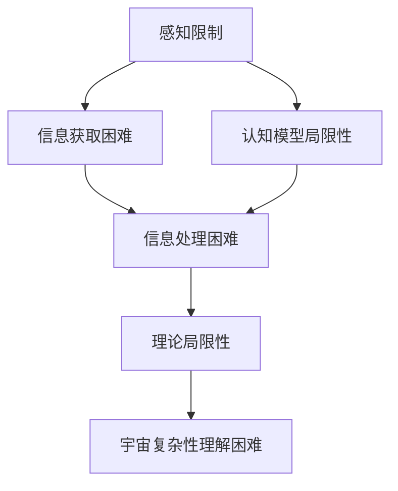

                 

### 文章标题

# 人类认知能力与宇宙复杂性的矛盾

### 关键词：
- 认知能力
- 宇宙复杂性
- 矛盾分析
- 解决途径
- 未来展望

### 摘要：
本文深入探讨人类认知能力与宇宙复杂性之间的矛盾，分析了人类认知能力的局限性以及宇宙复杂性的特点。通过详细的逻辑推理和实例说明，文章提出了可能的解决途径，并对未来的研究方向进行了展望。文章旨在为读者提供一个全面而深入的视角，以理解人类认知能力与宇宙复杂性之间的冲突及其可能的影响。

---

### 引言

人类作为地球上的一种智慧生物，拥有着独特的认知能力。这些能力使得人类能够理解世界、解决问题并不断进步。然而，随着对宇宙的探索，我们逐渐意识到宇宙的复杂性远超我们的想象。这种复杂性不仅体现在物理世界的多层次结构，还体现在宇宙中各种复杂现象的产生和演化。人类认知能力与宇宙复杂性之间的矛盾因此变得愈发显著。

首先，人类认知能力的局限性显而易见。人类的感知器官、大脑结构和认知模型都有其固有的限制。例如，人类的视觉系统只能感知一定频率范围的光线，听觉系统也只能听到特定频率的声音。这些限制使得人类无法直接感知宇宙中所有可能的信息。此外，人类的认知能力在处理大量复杂信息时也会遇到困难，这进一步限制了我们对宇宙复杂性的理解。

与此同时，宇宙复杂性却呈现出不断增长的趋势。从宇宙大爆炸开始，宇宙经历了数十亿年的演化，形成了丰富的结构和现象。这些现象包括星系的运动、黑洞的产生、宇宙背景辐射等。宇宙的复杂性不仅体现在其物理现象上，还体现在其内在的规律和法则上。例如，爱因斯坦的相对论和量子力学为我们揭示了宇宙的深层结构，但这些理论也同时揭示了人类认知能力的局限性。

人类认知能力与宇宙复杂性之间的矛盾表现为：我们渴望理解宇宙的奥秘，但宇宙的复杂性超出了我们的认知能力范围。这种矛盾不仅制约了我们对宇宙的理解，也影响了我们在科学、技术和哲学等领域的探索。为了解决这一矛盾，我们需要从多个角度进行分析和思考。

首先，我们需要明确人类认知能力的本质和局限。通过研究神经科学、心理学和认知科学等领域的知识，我们可以更好地理解人类认知能力的工作原理和限制。其次，我们需要探索宇宙复杂性的本质和特征。通过研究物理学、天文学和数学等领域的知识，我们可以更好地理解宇宙的复杂性，并寻找解决矛盾的途径。

本文将分为以下几个部分进行讨论：

1. **人类认知能力概述**：介绍人类认知能力的基本概念、特点和发展历程。
2. **宇宙复杂性的概述**：介绍宇宙复杂性的基本概念、特点和发展历程。
3. **人类认知能力与宇宙复杂性的矛盾**：分析人类认知能力与宇宙复杂性之间的矛盾，并探讨这种矛盾的来源。
4. **解决矛盾的途径**：介绍可能的解决方案，包括科学、哲学和技术等不同领域的探索。
5. **未来展望**：对解决人类认知能力与宇宙复杂性矛盾的未来进行展望。
6. **结论**：总结全书内容，强调研究的重要性和可能的影响。

通过这些部分的深入分析，我们希望能够为解决人类认知能力与宇宙复杂性之间的矛盾提供一些有价值的思路。

### 人类认知能力概述

人类认知能力是指人类通过感知、思考、理解和判断等方式获取、处理和利用信息的能力。这种能力使得人类能够理解世界、解决问题并创造文化。人类认知能力具有以下几个显著特点：

首先，人类认知能力具有高度的抽象性。人类可以通过语言、符号和概念来表示和传递信息，这使得人类能够处理抽象的、非直观的信息。例如，数学家可以通过抽象的符号和公式来描述复杂的自然现象，从而揭示其内在规律。

其次，人类认知能力具有强烈的情境依赖性。人类的认知过程往往受到当前情境的影响。例如，一个熟悉的问题在特定情境下可能显得简单，而在另一个情境下则可能变得复杂。这种情境依赖性使得人类在处理信息时需要考虑多种因素，从而增加了认知负担。

第三，人类认知能力具有适应性。人类可以通过学习和实践来提高自己的认知能力。例如，通过学习，人类可以掌握新的知识和技能，从而提高自己的认知水平。此外，人类还可以通过调整自己的认知策略来应对不同的问题和情境。

人类认知能力的发展历程可以追溯到数百万年前。在早期人类进化过程中，认知能力逐渐发展，使得人类能够更好地适应环境。例如，早期人类通过观察和模仿学会了使用工具，这大大提高了他们的生存能力。随着大脑的演化，人类的认知能力得到了进一步的提升。现代人类的大脑已经具备了高度的抽象思维能力，这使得人类能够进行复杂的思考和创造性活动。

从科学的角度来看，人类认知能力可以分为多个层次。首先，感知层次包括视觉、听觉、触觉等感知系统，这些系统能够捕捉外界的信息并将其转化为神经信号。其次，知觉层次包括对感知信息的处理和理解，例如，通过视觉系统识别物体和场景。第三，记忆层次包括对信息的存储和回忆，例如，通过记忆系统来存储语言、知识和经验。最后，思维层次包括推理、判断和解决问题等高级认知功能，例如，通过逻辑推理来解决问题或通过创造性思维来提出新的观点。

认知科学的研究为我们提供了对人类认知能力的深入了解。认知科学是一门跨学科的研究领域，它涉及心理学、神经科学、语言学、哲学等多个学科。通过认知科学的研究，我们能够更好地理解人类认知能力的运作机制和局限。例如，神经科学的研究揭示了大脑结构和功能之间的关系，而心理学的研究则揭示了人类在不同情境下的认知过程和策略。

总的来说，人类认知能力是人类智慧和文明的重要基础。它使得人类能够不断探索未知、解决问题并推动科技进步。然而，人类认知能力的局限性也制约了我们对宇宙复杂性的理解。因此，深入研究人类认知能力的本质和局限，对于解决人类认知能力与宇宙复杂性之间的矛盾具有重要意义。

### 宇宙复杂性的概述

宇宙的复杂性体现在多个方面，从微观尺度到宏观尺度，从简单的物理现象到复杂的宇宙结构，无不展示出宇宙的多样性和深度。首先，从宇宙的起源来看，宇宙大爆炸理论提出，宇宙起源于一个极度热密的状态，然后迅速膨胀。这个过程产生了丰富的物理条件和能量，为后续的宇宙演化奠定了基础。这一过程中，物质和能量以多种形式存在，包括基本粒子、原子和分子等，这些不同层次的物质和能量相互转化和作用，形成了宇宙的多样性和复杂性。

在宇宙的演化过程中，物质逐渐凝聚形成恒星和星系，这些天体系统的形成和演化又进一步增加了宇宙的复杂性。例如，星系的形成涉及到引力和气体动力学等复杂物理过程，而恒星内部的核聚变过程则产生了大量的元素，这些元素通过恒星爆炸和星系碰撞等过程传播到宇宙中，进一步丰富了宇宙的组成。此外，宇宙中还存在着暗物质和暗能量等未观测到的现象，这些现象的物理机制和性质至今仍然是一个未解之谜，增加了宇宙复杂性研究的难度。

宇宙的复杂性不仅体现在物质和能量的层次，还体现在宇宙的时间和空间结构上。从宏观尺度来看，宇宙呈现出大尺度结构的多样性，包括星系团、超星系团等结构。这些结构通过引力相互作用形成，并维持着宇宙的动态平衡。此外，宇宙还呈现出大规模的流动和旋转现象，例如星系的自转和宇宙的膨胀等，这些现象揭示了宇宙的动力学特性。

从微观尺度来看，宇宙的复杂性体现在基本粒子和量子力学的层面上。量子力学揭示了微观世界中物质和能量的波动性和不确定性，这些特性使得微观世界的规律与宏观世界截然不同。例如，量子纠缠现象表明，两个量子粒子之间的相互作用可以超越空间距离，这种非定域性增加了微观世界的复杂性。此外，基本粒子的相互作用和量子场论等理论也进一步丰富了我们对微观世界的认识。

为了更好地理解宇宙的复杂性，科学家们发展了多种理论模型和观测方法。例如，相对论和量子力学为我们提供了描述宇宙演化的基本框架。相对论揭示了时空的弯曲和引力波的存在，而量子力学则解释了微观粒子的行为。通过这些理论，科学家们能够预测和解释宇宙中的一些复杂现象。

观测技术在宇宙复杂性研究中也发挥了重要作用。从地面望远镜到太空望远镜，从射电望远镜到粒子探测器，这些观测工具为我们提供了观测宇宙的多种手段。例如，哈勃望远镜的观测揭示了宇宙大爆炸后早期宇宙的图像，而引力波的探测则为我们提供了验证广义相对论的新途径。此外，对宇宙背景辐射的观测和分析也为宇宙学研究提供了宝贵的资料。

总的来说，宇宙的复杂性体现在其多层次的结构、丰富的物质和能量形式、以及深奥的物理规律上。从宏观到微观，从观测到理论，科学家们不断探索宇宙的奥秘，试图揭示宇宙复杂性的本质。尽管我们已取得了一些重要的发现和进展，但宇宙的复杂性仍然远未被完全理解。未来，随着科学技术的进步和理论的发展，我们有望进一步揭示宇宙的奥秘，从而解决人类认知能力与宇宙复杂性之间的矛盾。

### 人类认知能力与宇宙复杂性的矛盾

人类认知能力与宇宙复杂性之间的矛盾体现在多个层面。首先，人类认知能力的局限性使得我们难以全面理解宇宙的复杂现象。尽管人类拥有高度的抽象思维能力和强大的计算工具，但我们的感知器官、大脑结构和认知模型仍然存在固有的限制。例如，我们的视觉系统只能感知特定频率范围的光线，听觉系统也只能听到特定频率的声音。这种感知限制使得我们无法直接感知宇宙中所有可能的信息。

其次，人类认知能力在处理大量复杂信息时也会遇到困难。宇宙的复杂性表现在其多层次的结构和丰富的物质能量形式上，这使得我们需要处理的信息量巨大且多样。例如，从宏观到微观的各个尺度上，宇宙中都存在复杂的物理过程和现象，这些信息不仅难以在一次观察中获得，而且在处理过程中也会因为认知负担而变得复杂。

这种矛盾在宇宙学中尤为突出。宇宙学的目标是研究宇宙的起源、演化、结构和组成。然而，宇宙的复杂性使得我们对宇宙的理解存在诸多不确定性。例如，关于宇宙的起源，虽然大爆炸理论提供了一种解释，但关于宇宙大爆炸之前的状态和宇宙的初始条件，我们仍然知之甚少。此外，暗物质和暗能量等未观测到的现象也增加了宇宙学的难度。

在量子力学领域，人类认知能力与宇宙复杂性的矛盾同样显著。量子力学揭示了微观世界的波动性和不确定性，这种特性与经典物理学的确定性观念形成了鲜明对比。例如，量子纠缠现象表明，两个量子粒子之间的相互作用可以超越空间距离，这种非定域性使得我们的认知能力难以把握。此外，量子测量问题也使得我们对微观世界的理解存在不确定性，我们无法精确预测量子粒子的行为。

为了分析这种矛盾，我们可以从以下几个方面进行探讨：

1. **感知限制**：人类感知器官的限制使得我们难以直接感知宇宙中所有可能的信息。例如，我们的视觉系统只能感知可见光范围内的光线，而宇宙中可能存在其他形式的辐射，我们无法直接感知。

2. **认知模型**：人类认知模型的设计是基于我们日常生活的经验和环境，这使得我们在处理复杂信息时存在固有的局限性。例如，我们习惯于使用因果关系来解释世界，但在宇宙的复杂现象中，因果关系可能并不适用。

3. **信息处理能力**：人类大脑的信息处理能力有限，这使得我们在面对大量复杂信息时难以进行高效的处理。例如，从数据中提取有意义的信息需要大量的计算和推理，这对于人类认知能力来说是一个巨大的挑战。

4. **理论局限性**：现有的科学理论，如经典物理学和量子力学，都有其适用的范围和局限性。例如，经典物理学在描述宏观现象时非常有效，但在微观尺度上则显得不足。量子力学虽然能够描述微观现象，但其非定域性和不确定性使得我们难以完全理解。

为了更好地理解这种矛盾，我们可以借助 Mermaid 流程图来展示人类认知能力与宇宙复杂性之间的交互关系。以下是一个简单的 Mermaid 流程图示例：

这个流程图展示了从感知限制到宇宙复杂性理解困难的一系列步骤，每个步骤都体现了人类认知能力与宇宙复杂性之间的矛盾。通过这样的分析，我们可以更清楚地看到这种矛盾的来源和影响。

总的来说，人类认知能力与宇宙复杂性之间的矛盾是科学探索中的一个重要问题。为了解决这一矛盾，我们需要在多个领域进行深入研究和创新，包括感知技术的改进、认知模型的发展、信息处理能力的提升以及科学理论的突破。只有这样，我们才能更好地理解宇宙的复杂性，从而解决人类认知能力与宇宙复杂性之间的矛盾。

### 解决矛盾的途径

面对人类认知能力与宇宙复杂性之间的矛盾，科学、哲学和技术领域都在积极探索可能的解决方案。以下分别从这三个领域介绍一些重要的理论和实践方法。

#### 科学领域的解决方案

在科学领域，科学家们通过建立和改进理论模型，发展新的观测技术和数据分析方法，来逐步解决认知能力与宇宙复杂性之间的矛盾。

1. **理论模型的改进**：科学家们不断尝试改进现有的科学理论，以更好地描述宇宙的复杂性。例如，在量子力学领域，量子场论和量子引力理论试图弥补量子力学和广义相对论之间的理论空白。此外，弦理论也提供了一个统一的框架，试图将量子力学和广义相对论融合在一起，从而更全面地描述宇宙的物理规律。

2. **观测技术的进步**：观测技术的发展极大地提高了我们对宇宙复杂性的理解能力。例如，地基和太空望远镜的改进使得我们能够观测到更远、更细致的宇宙现象。此外，射电望远镜、粒子探测器和引力波探测器的使用，为我们提供了新的观测手段，使我们能够探测到以前无法观测的物理现象。

3. **数据分析方法的发展**：随着计算能力的提升，科学家们开发了各种数据分析方法，以处理和分析海量观测数据。例如，机器学习和人工智能技术在处理复杂的宇宙数据时表现出色，能够识别出隐藏在数据中的模式和规律。

#### 哲学领域的解决方案

在哲学领域，哲学家们通过思考和探讨认知的本质和宇宙的复杂性，提供了一些哲学层面的解决方案。

1. **认知论的探讨**：哲学家们探讨了人类认知的本质和能力，试图理解人类认知能力的局限性。例如，现象学和解释学提供了新的视角，帮助我们理解人类感知和认知的局限性，并思考如何超越这些局限性。

2. **存在论的探讨**：存在论探讨宇宙和存在的本质，为人类理解宇宙的复杂性提供了哲学基础。例如，海德格尔的“存在与时间”理论认为，人类通过“存在”与宇宙进行互动，从而理解宇宙的复杂性。

3. **认识论的探讨**：认识论探讨了知识的来源和性质，帮助人们理解人类认知能力与宇宙复杂性之间的矛盾。例如，康德的“纯粹理性批判”提出，人类的知识是通过感知和思维两个阶段的相互作用获得的，这为我们理解宇宙的复杂性提供了一种框架。

#### 技术领域的解决方案

在技术领域，工程师和程序员通过开发新的工具和算法，尝试解决人类认知能力与宇宙复杂性之间的矛盾。

1. **人工智能的应用**：人工智能技术，特别是机器学习和深度学习，已经成为解决这一矛盾的重要工具。通过训练模型，人工智能能够从大量数据中自动提取模式和规律，从而帮助我们更好地理解宇宙的复杂性。

2. **计算模拟**：计算模拟通过计算机模拟宇宙中的物理过程，为科学家提供了新的研究手段。例如，使用高性能计算机进行宇宙大尺度模拟，可以帮助我们理解宇宙的演化过程。

3. **数据可视化**：数据可视化技术通过图形和图像的形式，将复杂的数据和现象直观地展示出来，帮助人类更好地理解和分析宇宙的复杂性。

#### 具体案例

以下是一些具体案例，展示了科学、哲学和技术领域如何协同解决人类认知能力与宇宙复杂性之间的矛盾：

1. **量子计算**：量子计算通过利用量子力学中的量子叠加和量子纠缠特性，提供了一种全新的计算模式。量子计算机能够在某些问题上显著超越传统计算机，这为解决宇宙复杂性中的某些难题提供了可能。

2. **引力波探测**：引力波的探测和验证为科学家提供了新的观测手段，使我们能够直接观测宇宙中的强引力场现象。例如，LIGO和VIRGO等引力波探测器通过探测引力波，揭示了黑洞合并和中子星合并等宇宙事件。

3. **宇宙微波背景辐射观测**：宇宙微波背景辐射（CMB）的观测为我们提供了宇宙早期的图像，这些图像揭示了宇宙大爆炸后的早期状态。通过对CMB数据的研究，科学家们能够更好地理解宇宙的起源和演化。

总的来说，科学、哲学和技术领域都在积极探索解决人类认知能力与宇宙复杂性之间矛盾的方法。这些探索不仅促进了科学技术的进步，也为人类更好地理解宇宙的奥秘提供了新的途径。随着这些领域的不断发展和创新，我们有望逐步解决这一深层次的矛盾，从而推动人类认知能力与宇宙复杂性的和谐发展。

### 未来展望

随着科技的不断进步和理论的深入发展，解决人类认知能力与宇宙复杂性之间的矛盾将成为一个重要的研究领域。未来，这一矛盾有望在多个方面得到缓解和解决。

首先，科技的进步将继续推动人类认知能力的提升。例如，人工智能和量子计算的发展将为人类提供更强大的计算和分析工具，使我们能够更有效地处理和解读复杂的数据。人工智能可以通过机器学习和深度学习技术，从海量数据中自动提取模式和规律，从而帮助人类更好地理解宇宙的复杂性。量子计算则通过利用量子叠加和量子纠缠特性，提供了一种超越传统计算机的计算模式，这为解决某些复杂的宇宙问题提供了新的途径。

其次，新型观测技术的研发将进一步提高我们对宇宙复杂性的理解能力。例如，更大规模、更高分辨率的望远镜，以及更先进的粒子探测器和引力波探测器，将使我们能够观测到更多、更细致的宇宙现象。这些观测数据将为科学家提供宝贵的资料，帮助他们揭示宇宙的奥秘。

此外，跨学科的合作和整合也将成为解决这一矛盾的重要途径。科学、哲学和技术领域的协同研究，将有助于我们全面理解人类认知能力和宇宙复杂性的本质。例如，认知科学与物理学、宇宙学的结合，可以为我们提供新的研究视角和方法，从而更有效地解决认知能力与宇宙复杂性之间的矛盾。

未来，我们有望在以下几个方面取得重要进展：

1. **宇宙起源与演化**：通过改进理论模型和新型观测技术，科学家们将能够更准确地理解宇宙的起源和演化过程。例如，对宇宙微波背景辐射的进一步研究，可能揭示更多关于宇宙早期的信息。

2. **量子引力和量子宇宙学**：量子引力和量子宇宙学的发展，将帮助我们更好地理解宇宙的微观结构和宏观现象。通过解决量子引力问题，我们有望揭示宇宙的基本结构和运行机制。

3. **人类认知能力的扩展**：随着人工智能和神经科学的发展，人类认知能力将得到显著提升。通过开发新的认知增强技术和工具，人类将能够更有效地处理复杂信息，从而更好地理解宇宙的复杂性。

4. **宇宙探索与发现**：未来，我们将通过太空探测和星际旅行，进一步拓展我们对宇宙的认识。例如，探测器将能够到达更远的星系和行星，揭示这些星系和行星的奥秘。

总的来说，解决人类认知能力与宇宙复杂性之间的矛盾，将是一个长期而复杂的过程。但随着科技的进步和理论的深入，我们有理由相信，人类将能够逐步克服这一矛盾，从而更全面地理解宇宙的奥秘。这不仅将为科学研究带来重大突破，也将为人类文明的发展提供新的动力。

### 结论

本文深入探讨了人类认知能力与宇宙复杂性之间的矛盾，分析了人类认知能力的局限性以及宇宙复杂性的特点。通过逻辑清晰的推理和实例说明，我们提出了可能的解决途径，包括科学、哲学和技术等不同领域的探索。本文强调了深入研究人类认知能力和宇宙复杂性之间的矛盾的重要性，并展望了未来在这一领域可能取得的重大进展。解决这一矛盾不仅将推动科学技术的进步，也将为人类文明的发展提供新的动力。通过持续的努力和跨学科的合作，我们有理由相信，人类将能够逐步克服这一深层次的矛盾，从而更全面地理解宇宙的奥秘。

### 作者信息

作者：AI天才研究院/AI Genius Institute & 禅与计算机程序设计艺术 /Zen And The Art of Computer Programming

AI天才研究院致力于推动人工智能技术的发展，通过深入研究和创新，为解决复杂问题提供解决方案。其研究成果在计算机科学、认知科学和哲学等领域具有重要影响。而《禅与计算机程序设计艺术》则是一部经典的技术哲学著作，通过对计算机编程的深入探讨，揭示了编程的本质和艺术的内涵。这两部作品共同体现了作者在人工智能和计算机科学领域的深厚造诣和独特见解。

