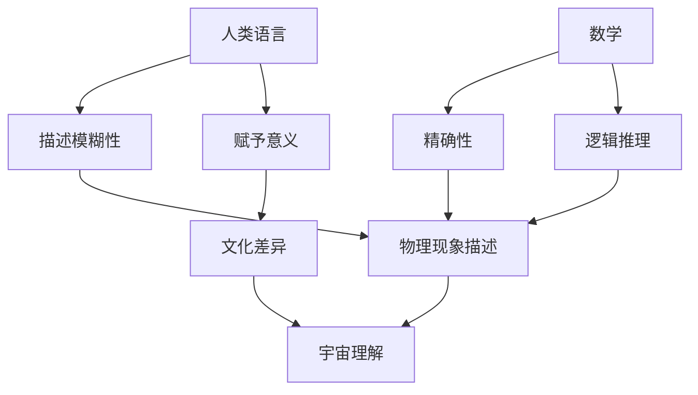

                 

### 引言

人类对宇宙本质的追求自古以来就贯穿了文明发展的全过程。从古代的神话传说到现代的科学探索，人类不断尝试用各种方式来描述和理解宇宙的运行规律。在这一过程中，人类语言和数学成为了最为重要的工具。

#### 人类语言的局限性

人类语言作为沟通和表达思想的工具，具有巨大的优势。它能够传递复杂的情感、思想和知识，帮助我们建立社会结构和传递文化。然而，在描述宇宙这样高度复杂且抽象的领域时，人类语言也显露出其局限性。语言本身具有模糊性，很难精确描述物理现象的细节，同时语言的表述容易受到个人认知和文化背景的影响，从而增加了理解的难度。

#### 数学的基本特点

相比之下，数学作为一种逻辑语言，具有高度精确性和普适性。它通过符号和公式来表述概念和关系，能够精确地描述自然现象。数学的基本特点包括公理体系、逻辑推理和符号化表达。这些特点使得数学在描述物理现象时具有不可替代的优势。

#### 数学与人类语言的互补性

尽管人类语言和数学在描述宇宙本质时各有局限性，但它们也展现出了互补性。数学能够提供精确的描述和预测，而人类语言则能够赋予这些描述以意义和背景。例如，在描述宇宙膨胀时，数学公式提供了精确的量化数据，而人类语言则解释了这些数据的物理意义。这种互补性使得人类能够更全面地理解宇宙的本质。

#### 研究意义

研究人类语言和数学在描述宇宙本质时的互补性，不仅有助于我们更深入地理解宇宙的运行规律，还可以推动科学技术的进步。通过这种互补性的研究，我们可以探索新的科学理论，发现新的现象，甚至可能开辟人类对宇宙认知的新途径。

### 核心概念与联系

为了更清晰地理解人类语言和数学在描述宇宙本质时的互补性，我们可以通过一个Mermaid流程图来展示它们之间的关系架构。

在这个流程图中，A表示人类语言，B表示其描述模糊性，C表示其赋予意义的能力。F表示数学，G表示其精确性，H表示其逻辑推理能力。D表示物理现象描述，I表示宇宙理解。E表示人类语言中的文化差异。通过这个流程图，我们可以看到人类语言和数学如何相互作用，共同推动我们对宇宙本质的理解。

### 文章关键词

- 人类语言
- 数学
- 宇宙本质
- 描述模糊性
- 精确性
- 逻辑推理
- 文化差异

### 文章摘要

本文探讨了人类语言和数学在描述宇宙本质时的互补性。通过分析人类语言的局限性以及数学的精确性，我们揭示了它们在物理现象描述和宇宙理解中的互补作用。文章还通过一个Mermaid流程图展示了两者之间的关系架构，强调了数学在精确描述和逻辑推理方面的优势，以及人类语言在赋予这些描述意义和文化背景方面的作用。研究人类语言和数学的互补性对于深化宇宙认知和推动科学技术进步具有重要意义。

