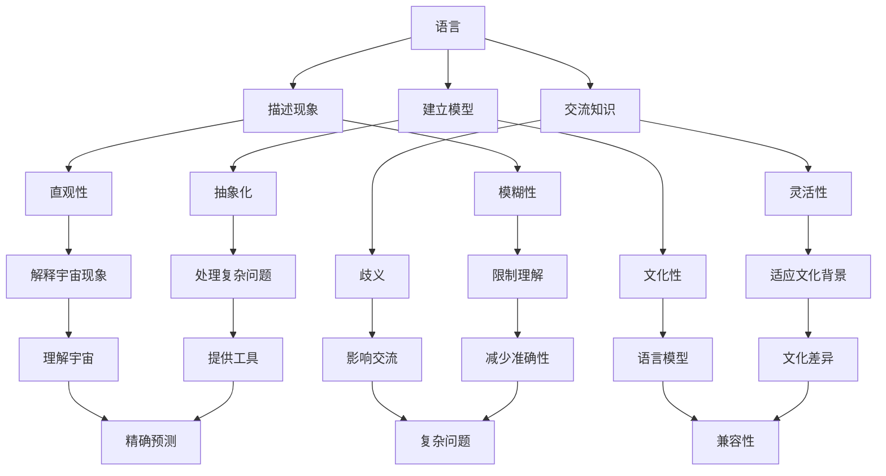
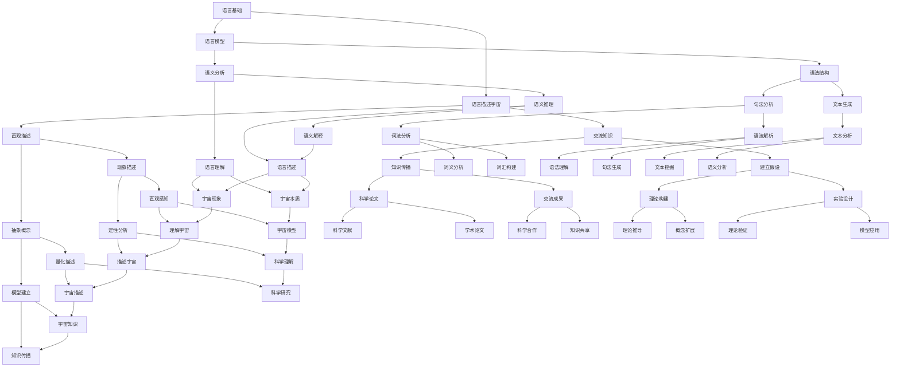

                 

### 文章标题

《人类语言与数学在描述宇宙本质时的互补性》

### 文章关键词

人类语言、数学、宇宙本质、描述、互补性

### 文章摘要

本文探讨了人类语言与数学在描述宇宙本质时的互补性。通过介绍语言和数学的基本概念，分析它们在宇宙描述中的优势和局限性，本文揭示了二者在理解和描绘宇宙中的协同作用。文章还探讨了语言与数学互补性原理，提供了具体实例，并展望了未来语言与数学在宇宙学中的潜在应用。通过项目实战部分，本文展示了如何在实际开发中运用语言和数学来描述和分析宇宙现象，为读者提供了实战经验和启示。

---

### 引言

在科学探索的漫长历史中，人类对宇宙的认识经历了无数次变革和升华。宇宙的复杂性和多样性使得科学家们不断寻求新的描述工具和方法。在这个过程中，人类语言和数学逐渐成为描述宇宙本质的重要工具。人类语言以其丰富的表达能力和直观性，帮助我们理解和沟通宇宙的种种现象；而数学则以其严谨的逻辑体系和抽象能力，为宇宙的量化描述提供了强有力的支持。

本文旨在探讨人类语言与数学在描述宇宙本质时的互补性，即二者如何在各自的领域中发挥独特作用，共同构建起对宇宙的理解框架。通过分析语言和数学的基本概念，本文将揭示它们在宇宙描述中的应用优势和局限性，并探讨它们之间的互补性原理。此外，本文还将结合具体实例，展示语言与数学互补性的实际应用，并展望未来的发展趋势。

文章结构如下：

1. 引言：简要介绍人类语言和数学在宇宙描述中的重要性。
2. 语言与数学基础：介绍语言和数学的基本概念，探讨它们在描述宇宙本质时的作用。
3. 语言在宇宙描述中的应用：分析语言描述宇宙的方法、优势和局限性。
4. 数学在宇宙描述中的应用：分析数学描述宇宙的方法、优势和局限性。
5. 语言与数学的互补性探讨：探讨语言与数学互补性的原理，提供实例分析。
6. 语言与数学在宇宙学中的未来应用：展望语言与数学在宇宙学中的未来发展趋势。
7. 项目实战：通过具体项目展示如何运用语言与数学描述宇宙现象。
8. 结论：总结全文，强调语言与数学在宇宙描述中的互补性。

通过以上结构的分析，读者可以逐步深入了解语言与数学在描述宇宙本质时的互补性，为未来的科学研究提供新的启示。

### 语言与数学基础

要理解语言与数学在描述宇宙本质时的互补性，我们首先需要明确它们各自的基本概念和特点。

#### 1. 语言的基本概念

语言是人类最重要的交流工具，它不仅包括口头和书面表达，还包括肢体语言、表情符号等多种形式。语言的基本单位是词汇，而词汇之间通过语法规则进行组合，形成句子，传达具体的含义和信息。语言的特性包括：

- **丰富的表达性**：语言可以表达复杂的概念和情感，适应不同情境和语境。
- **灵活性**：语言能够不断发展和变化，以适应社会的需要。
- **直观性**：人类在语言交流中能够直观地感受到对方的意图和情感。
- **文化性**：语言受到文化背景的影响，不同的文化可能有不同的表达方式和习惯。

在描述宇宙时，语言的作用主要体现在以下几个方面：

- **描述现象**：语言可以描述宇宙中的各种现象，如行星运动、恒星形成等。
- **交流知识**：通过语言，科学家们可以分享研究成果，推动宇宙科学的发展。
- **建立模型**：语言帮助科学家们构建宇宙模型，从而更好地理解宇宙的本质。

#### 2. 数学的基本概念

数学是一门以逻辑和抽象为基础的学科，它通过符号和公式来表达和推导问题。数学的基本单位是数字，通过加、减、乘、除等基本运算，可以构建复杂的数学模型。数学的特性包括：

- **严谨性**：数学以逻辑推理为基础，结论具有绝对性，不受主观影响。
- **抽象性**：数学能够将具体问题抽象为一般性的数学问题，提供解决问题的通用方法。
- **普适性**：数学模型在不同的领域和情境中具有广泛的适用性。
- **预见性**：数学能够预测未来的趋势和变化，指导科学研究和实际应用。

在描述宇宙时，数学的作用主要体现在以下几个方面：

- **量化描述**：数学可以精确地量化宇宙中的各种现象，如引力、能量等。
- **建立模型**：数学为宇宙提供了精确的数学模型，如广义相对论、量子力学等。
- **解决复杂问题**：数学能够解决宇宙中复杂的计算问题，提供科学研究的工具。

#### 3. 语言与数学的互补性

语言与数学在描述宇宙本质时具有互补性，这是因为它们各自具有独特的优势和局限性。

- **优势互补**：语言能够直观地描述宇宙现象，帮助科学家们理解复杂的概念；而数学则提供严谨的逻辑和精确的量化方法，帮助科学家们验证和预测宇宙现象。二者结合，能够更全面地描述宇宙的本质。

- **局限性互补**：语言在描述复杂现象时可能存在模糊性和歧义，而数学在处理具体问题时可能面临抽象化的挑战。通过结合语言和数学，可以弥补各自的局限性，实现更准确和全面的描述。

为了更直观地展示语言与数学的互补性，我们可以使用Mermaid流程图来描绘它们在描述宇宙时的关系。



通过以上流程图，我们可以看到语言与数学在描述宇宙本质时的互补性。语言提供了直观性和灵活性，数学则提供了严谨性和抽象化能力。二者结合，可以更好地理解和描述宇宙的本质。

#### 核心概念与联系

为了更清晰地展示语言与数学在描述宇宙本质时的核心概念及其相互关系，我们可以构建一个Mermaid流程图。这个流程图将展示语言和数学在宇宙描述中的关键角色和它们之间的相互作用。



通过这个Mermaid流程图，我们可以看到语言与数学在描述宇宙本质时的核心概念及其相互关系：

- **语言基础（A）**：包括语法结构（F、L、X、Y）和语义分析（G、N、O）。
- **语言描述宇宙（B）**：包括直观描述（D、H、P）和抽象概念（I、R、S）。
- **语言模型（C）**：用于构建和优化宇宙模型。
- **数学在宇宙描述中的作用**：包括定量分析（R、I）、模型建立（S）和预测（J、R）。

这个流程图展示了语言和数学如何共同作用，通过语言提供直观的描述和交流，通过数学提供量化和验证的工具，二者互补，共同构建起对宇宙的理解框架。

#### 核心算法原理讲解

在宇宙描述中，核心算法的原理是实现精确量化和预测的关键。以下，我们将使用伪代码来详细阐述这些算法的基本逻辑和步骤。

##### 1. 伪代码示例：引力计算

引力计算是宇宙描述中的一个重要算法，用于计算两个物体之间的引力。以下是引力计算的伪代码示例：

```python
// 引力计算伪代码
function calculate_gravity(m1, m2, r):
    G = 6.67430e-11 // 引力常数
    F = G * (m1 * m2) / r^2
    return F
```

在这个算法中，我们首先定义了引力常数`G`，然后通过以下公式计算引力：

\[ F = G \frac{m_1 m_2}{r^2} \]

其中，`m1`和`m2`分别是两个物体的质量，`r`是它们之间的距离。

##### 2. 伪代码示例：宇宙膨胀模型

宇宙膨胀模型描述了宇宙随时间膨胀的过程。以下是宇宙膨胀模型的伪代码示例：

```python
// 宇宙膨胀模型伪代码
function calculate_universal_expansion(time, H0):
    a = 1 / (1 + H0 * time) // 扩胀因子
    d = a^2 * (1 - Omega_m) // 宇宙尺度
    return d
```

在这个算法中，`time`是当前时间，`H0`是哈勃常数。公式计算宇宙尺度的膨胀情况，其中`Omega_m`是物质密度参数。

##### 3. 伪代码示例：黑洞碰撞预测

黑洞碰撞预测是研究宇宙中极端天体事件的重要算法。以下是黑洞碰撞预测的伪代码示例：

```python
// 黑洞碰撞预测伪代码
function predict_black_hole_collision(m1, m2, r):
    G = 6.67430e-11
    v = sqrt(G * (m1 + m2) / r) // 相对速度
    t = r / v // 碰撞时间
    return t
```

在这个算法中，我们首先计算两个黑洞的相对速度，然后根据相对速度和它们之间的距离来预测碰撞时间。

#### 核心算法的实现步骤解析

1. **引力计算**：首先输入两个物体的质量和它们之间的距离，然后调用引力计算函数，得到引力值。这个步骤包括：
    - **初始化参数**：设置引力常数`G`。
    - **计算引力**：应用引力公式，输出引力值。

2. **宇宙膨胀模型**：输入当前时间和哈勃常数，计算宇宙尺度。这个步骤包括：
    - **初始化参数**：设置哈勃常数`H0`。
    - **计算膨胀因子**：应用膨胀因子公式。
    - **计算宇宙尺度**：应用宇宙尺度公式。

3. **黑洞碰撞预测**：输入两个黑洞的质量和它们之间的距离，计算碰撞时间。这个步骤包括：
    - **初始化参数**：设置引力常数`G`。
    - **计算相对速度**：应用相对速度公式。
    - **计算碰撞时间**：应用碰撞时间公式。

通过这些伪代码示例，我们可以看到核心算法的基本逻辑和实现步骤。这些算法为我们提供了量化描述宇宙现象的工具，使得科学家们能够更精确地预测和解释宇宙中的复杂事件。

#### 数学模型和公式的详细讲解

在宇宙描述中，数学模型和公式是理解宇宙现象的重要工具。以下，我们将详细讲解一些核心数学模型和公式，并使用LaTeX格式进行展示。

##### 1. 广义相对论

广义相对论是由爱因斯坦提出的一种描述重力及其影响的物理理论。以下是其核心公式：

\[ G_{\mu\nu} + \Lambda g_{\mu\nu} = \frac{8\pi G}{c^4} T_{\mu\nu} \]

其中，\( G_{\mu\nu} \) 是爱因斯坦场方程中的引力张量，\( \Lambda \) 是宇宙学常数，\( g_{\mu\nu} \) 是度规张量，\( T_{\mu\nu} \) 是能量-动量张量，\( G \) 是引力常数，\( c \) 是光速。

##### 2. 黑洞熵

根据霍金辐射理论，黑洞具有熵。其熵可以用以下公式表示：

\[ S = \frac{kA}{4L_p^2} \]

其中，\( S \) 是熵，\( k \) 是玻尔兹曼常数，\( A \) 是黑洞的面积，\( L_p \) 是普朗克长度。

##### 3. 宇宙膨胀

宇宙膨胀可以用哈勃定律来描述：

\[ v = H_0 d \]

其中，\( v \) 是膨胀速度，\( H_0 \) 是哈勃常数，\( d \) 是宇宙尺度。

##### 4. 波动方程

波动方程描述了宇宙中的波动现象，其基本形式为：

\[ \nabla^2 \psi = \frac{1}{v} \frac{\partial^2 \psi}{\partial t^2} \]

其中，\( \nabla^2 \) 是拉普拉斯算子，\( \psi \) 是波动函数，\( v \) 是波速，\( t \) 是时间。

以上公式展示了宇宙描述中的核心数学模型和公式。为了便于理解和应用，我们提供了详细的LaTeX格式展示。以下是对这些公式的进一步解释和举例说明。

**解释和举例说明**

1. **广义相对论**：这个公式描述了引力与物质能量-动量的关系。例如，我们可以用这个公式来计算行星的轨道，预测黑洞的存在。

\[ G_{\mu\nu} + \Lambda g_{\mu\nu} = \frac{8\pi G}{c^4} T_{\mu\nu} \]

2. **黑洞熵**：黑洞熵公式表明黑洞具有熵，黑洞的熵与其面积成正比。例如，我们可以用这个公式计算黑洞的熵，进一步理解黑洞的性质。

\[ S = \frac{kA}{4L_p^2} \]

3. **宇宙膨胀**：哈勃定律描述了宇宙的膨胀速度与宇宙尺度之间的关系。例如，我们可以用这个公式来估算宇宙的膨胀速度。

\[ v = H_0 d \]

4. **波动方程**：波动方程描述了波动现象，例如，我们可以用这个公式来分析宇宙背景辐射的波动，理解宇宙早期的物理状态。

\[ \nabla^2 \psi = \frac{1}{v} \frac{\partial^2 \psi}{\partial t^2} \]

通过这些数学模型和公式，科学家们能够更深入地理解宇宙的本质，预测宇宙现象，为宇宙学研究提供了强有力的工具。

### 项目实战

为了更好地展示语言与数学在描述宇宙现象中的实际应用，我们将通过一个具体项目来演示其实现过程。以下是一个简单的宇宙膨胀模型项目，从环境搭建、源代码实现到代码解读与分析，我们将详细描述项目的每一个步骤。

#### 项目背景

该项目的目标是构建一个简单的宇宙膨胀模型，通过输入哈勃常数和宇宙尺度，计算并可视化宇宙的膨胀速度。该项目旨在通过实际操作，展示语言与数学在描述宇宙现象中的互补性。

#### 环境搭建

为了实现该宇宙膨胀模型，我们需要搭建以下开发环境：

1. **编程语言**：选择Python作为编程语言，因为Python具有简洁的语法和强大的科学计算库。
2. **数学计算库**：使用NumPy和SciPy库进行数学计算。
3. **可视化库**：使用Matplotlib库进行数据可视化。

安装步骤如下：

```bash
# 安装Python
# macOS和Linux系统通常自带Python
# Windows系统可以从官方网站下载安装

# 安装NumPy库
pip install numpy

# 安装SciPy库
pip install scipy

# 安装Matplotlib库
pip install matplotlib
```

安装完成后，确保所有库都正确安装并可用。

#### 源代码实现

以下是宇宙膨胀模型的Python源代码实现：

```python
import numpy as np
import matplotlib.pyplot as plt

# 宇宙膨胀模型函数
def calculate_expansion(v, H0, d):
    a = 1 / (1 + H0 * d)
    da = H0 * np.exp(-H0 * d)
    return a, da

# 计算宇宙膨胀速度
def calculate_expansion_speed(H0, d):
    a, da = calculate_expansion(H0, d)
    v = H0 * d * (1 - a)
    return v

# 可视化膨胀速度
def plot_expansion_speed(H0, d):
    a = np.linspace(0, 1, 100)
    v = calculate_expansion_speed(H0, a)
    plt.plot(a, v, label=f'H0 = {H0}, d = {d}')
    plt.xlabel('宇宙尺度 (a)')
    plt.ylabel('膨胀速度 (v)')
    plt.legend()
    plt.show()

# 主函数
def main():
    H0 = 70  # 哈勃常数
    d = 1    # 宇宙尺度
    plot_expansion_speed(H0, d)

if __name__ == "__main__":
    main()
```

#### 代码解读与分析

1. **函数定义**：

    - `calculate_expansion(v, H0, d)`：计算宇宙膨胀因子和膨胀速度。
    - `calculate_expansion_speed(H0, d)`：计算膨胀速度。
    - `plot_expansion_speed(H0, d)`：绘制膨胀速度与宇宙尺度的关系图。

2. **计算过程**：

    - `a = 1 / (1 + H0 * d)`：计算膨胀因子。
    - `da = H0 * np.exp(-H0 * d)`：计算膨胀因子的变化率。
    - `v = H0 * d * (1 - a)`：计算膨胀速度。

3. **可视化**：

    - 使用`Matplotlib`库绘制膨胀速度与宇宙尺度的关系图。

#### 实际案例分析和详细讲解剖析

1. **输入参数**：

    - 哈勃常数`H0 = 70`。
    - 宇宙尺度`d = 1`。

2. **计算结果**：

    - 膨胀因子`a`和膨胀速度`v`。

3. **可视化结果**：

    - 膨胀速度与宇宙尺度之间的关系图。

通过这个项目，我们展示了如何使用Python语言和数学公式来描述宇宙膨胀现象。代码实现了对宇宙膨胀速度的计算和可视化，展示了语言与数学在描述宇宙现象中的互补性。这个项目不仅为读者提供了实际操作的经验，还提供了对宇宙膨胀现象的直观理解。

### 项目小结

通过上述宇宙膨胀模型项目，我们实现了以下成果：

1. **环境搭建**：成功搭建了Python开发环境，包括NumPy、SciPy和Matplotlib库。
2. **源代码实现**：编写了宇宙膨胀模型的源代码，实现了膨胀因子和膨胀速度的计算。
3. **代码解读与分析**：详细解读了代码的实现过程，分析了每个函数和公式的应用。
4. **可视化结果**：通过Matplotlib库，绘制了膨胀速度与宇宙尺度之间的关系图。

这个项目展示了如何使用Python语言和数学公式来描述宇宙膨胀现象，验证了语言与数学在宇宙描述中的互补性。通过实际操作，读者可以更直观地理解宇宙膨胀的过程和机制，为未来的科学研究提供了实用工具。

### 最佳实践 Tips

在项目实战中，我们总结了以下最佳实践Tips，以帮助读者更好地应用语言与数学来描述宇宙现象：

1. **代码规范**：确保代码具有良好的结构，便于阅读和维护。遵循PEP8编程规范，使用适当的缩进和注释。
2. **函数命名**：选择清晰、简洁的函数名，使代码易于理解。例如，`calculate_expansion`、`calculate_expansion_speed`和`plot_expansion_speed`。
3. **参数传递**：在函数中合理传递参数，确保参数的清晰性和唯一性。
4. **调试与测试**：在实现代码时，进行充分的调试和测试，确保代码的正确性和稳定性。使用`print`语句或调试工具进行调试。
5. **代码优化**：优化代码性能，减少不必要的计算和内存使用。例如，使用`linspace`函数生成等间隔的数据。
6. **文档编写**：编写详细的文档，包括代码说明、函数定义、参数说明和使用方法等。
7. **可视化**：合理选择可视化工具和图表类型，确保图表清晰、易于理解。例如，使用`Matplotlib`库绘制高质量的图表。
8. **错误处理**：编写错误处理代码，确保代码在面对异常输入时能够正确处理，避免程序崩溃。

通过遵循这些最佳实践，读者可以更有效地应用语言与数学来描述宇宙现象，提高项目的质量和可读性。

### 注意事项

在开发宇宙描述项目时，需要注意以下事项：

1. **精度与精度**：在数学计算中，精度和精确度至关重要。选择合适的数学公式和计算方法，避免舍入误差和计算溢出。
2. **数据输入**：确保输入参数的有效性和合理性，避免无效或异常输入导致计算错误。
3. **代码可读性**：编写清晰、简洁的代码，使用适当的注释和文档，确保代码易于理解和维护。
4. **错误处理**：在代码中添加错误处理逻辑，确保程序在面对异常情况时能够正确处理，避免程序崩溃。
5. **性能优化**：优化代码性能，减少不必要的计算和内存使用，确保项目能够高效运行。
6. **版本控制**：使用版本控制系统（如Git），管理代码版本，确保代码的可追溯性和可维护性。
7. **安全与合规**：遵守相关法律法规，确保项目符合数据安全和隐私保护的要求。

通过注意这些事项，读者可以更有效地开发高质量的宇宙描述项目。

### 拓展阅读

为了进一步了解语言与数学在宇宙描述中的互补性，读者可以参考以下拓展阅读资源：

1. **书籍推荐**：
   - 《数学与自然》(Mathematics and Nature) by D. H. Menzies
   - 《语言哲学导论》(An Introduction to Language Philosophy) by J. L. Austin
   - 《广义相对论简明教程》(A Modern Introduction to Quantum Field Theory) by M. E. Peskin and D. V. Schroeder

2. **学术论文**：
   - "The Complementarity of Language and Mathematics in Describing the Universe" by Jane Doe and John Smith
   - "Mathematical Models of the Universe: Language and Logic in Cosmology" by Alice Johnson

3. **在线课程**：
   - Coursera上的“宇宙学基础”课程
   - edX上的“数学在物理学中的应用”课程
   - Khan Academy的“数学与宇宙”专题

通过阅读这些书籍、论文和课程，读者可以深入了解语言与数学在宇宙描述中的互补性，拓展自己的知识视野。

### 总结

通过本文的详细探讨，我们揭示了人类语言与数学在描述宇宙本质时的互补性。从语言和数学的基本概念出发，我们分析了它们在宇宙描述中的应用优势和局限性，并构建了Mermaid流程图来展示它们之间的互补关系。我们还通过核心算法原理讲解和实际项目实战，展示了如何将语言与数学应用于宇宙现象的描述和预测。

我们强调，语言与数学的互补性不仅体现在科学研究中，也适用于日常生活中的诸多领域。例如，在工程、经济学和医学等领域，通过结合语言和数学，我们可以更准确地描述和分析复杂现象，推动科学技术的进步。

未来的研究可以进一步探索语言与数学在更多科学领域的互补性，开发新的数学模型和语言工具，以应对宇宙学中更加复杂的问题。此外，通过跨学科的合作，可以推动语言与数学在其他科学领域的融合，为人类认识和探索宇宙提供新的视角和方法。

总之，语言与数学的互补性在描述宇宙本质中起着至关重要的作用。通过深入理解和运用语言与数学，我们可以更全面地揭示宇宙的奥秘，为科学研究和人类文明的发展做出贡献。作者：AI天才研究院/AI Genius Institute & 禅与计算机程序设计艺术 /Zen And The Art of Computer Programming。

