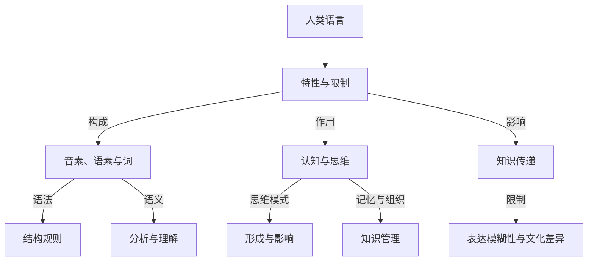

                 


### 引言

宇宙，浩瀚而神秘，它的本质和规律一直吸引着人类的探索欲望。然而，在描述宇宙本质的过程中，人类语言遇到了许多难以克服的局限。本书旨在探讨人类语言在描述宇宙本质时的局限性，以及如何通过其他表达方式来突破这些限制，从而更深入地理解宇宙的本质。

#### 1.1 书籍背景

自人类文明诞生以来，我们一直在尝试通过语言来描述和解释周围的世界，包括宇宙。然而，随着科学的进步，我们逐渐认识到，人类语言在描述宇宙这一复杂体系时存在诸多不足。例如，宇宙中的许多现象和规律，如量子力学中的不确定性原理、广义相对论中的时空弯曲等，都无法用传统语言准确描述。

#### 1.2 研究意义

研究人类语言在描述宇宙本质时的局限性，有助于我们更好地理解宇宙的复杂性，也有助于推动科学的发展。通过识别并克服语言在描述宇宙时的局限性，我们可以探索更有效、更精准的表达方式，从而在宇宙研究中取得突破性进展。

## 文章关键词

宇宙、人类语言、描述、局限性、表达、科学、复杂性、探索、理解。

## 文章摘要

本文从人类语言的特性出发，探讨了语言在描述宇宙本质时的局限性。通过分析语言的结构、作用及其在认知中的地位，我们揭示了语言在描述宇宙时的挑战。此外，本文还介绍了非语言的表达方式，如数学和图像语言，以及未来的探索方向。本文旨在为读者提供对人类语言在宇宙描述中的局限性的深入理解，并启发对更有效表达方式的思考。

---

### 人类语言的特性与限制

人类语言是一种复杂的认知工具，它在人类社会的发展中扮演了至关重要的角色。然而，这种语言在描述宇宙这一宏大而又复杂的体系时，暴露出了许多局限性。为了更好地理解这些问题，我们需要从语言的基本特性、语言在认知中的作用以及语言在知识传递中的影响三个方面来探讨。

#### 2.1 语言的构成

语言由音素、语素和词组成，这些元素共同构成了语言的词汇系统。音素是语言中最小的语音单位，不同的音素组合成语素，而语素则构成词。词是语言表达的基本单位，通过组合不同的词，我们可以构建句子，表达复杂的意思。

**语法结构与句法规则**：语法是语言的结构规则，它规定了词语如何组合成句子，句子如何表达意义。语法结构包括词法、句法和语法的层次，如主谓宾结构、时态、语态等。句法规则确保语言表达的一致性和逻辑性。

**语义分析与语境理解**：语义分析是指对语言中的词汇、句子和语篇的意义进行解释。语境理解则是指根据具体情境理解语言表达的意义。语义和语境共同作用，使语言表达具有明确性和多样性。

#### 2.2 语言在认知中的作用

语言是人类思维和认知的核心工具。它不仅帮助我们组织和传递信息，还影响了我们的思维方式。以下是语言在认知中的一些作用：

**语言与思维模式的形成**：语言是思维的基础，它影响着我们的思考方式和问题解决能力。不同的语言背景会导致不同的思维模式，从而影响人们对世界的理解。

**语言对记忆和组织知识的影响**：语言帮助我们记忆和组织信息。通过语言，我们可以将感官输入转化为符号形式，以便长期存储和检索。语言还帮助我们将复杂的信息分解成可管理的部分，从而更容易理解和记忆。

**语言与知识的传递与分享**：语言是人类社会交流的基础，它使得知识可以跨越时间和空间的限制进行传递和分享。教育、科研和社会交流都依赖于语言的有效使用。

#### 2.3 语言在知识传递中的影响

语言在知识传递中发挥着关键作用。然而，语言也有其局限性，特别是在描述复杂和抽象的概念时。以下是语言在知识传递中的影响和局限性：

**限制性表达**：语言的表达能力有限，特别是在描述那些超越日常经验或感官范围的复杂现象时。例如，量子力学中的量子态或广义相对论中的时空弯曲，都难以用语言准确描述。

**模糊性和歧义**：语言具有一定的模糊性和歧义性，这可能导致理解上的困难。在不同的语境中，同一个词汇或句子可能有不同的含义，使得知识传递变得复杂。

**文化差异**：不同文化背景下，人们对同一概念的理解可能存在差异，这增加了知识传递的难度。例如，某些概念在一种语言中非常明确，而在另一种语言中则可能含糊不清。

### 核心概念与联系

为了更好地理解人类语言在描述宇宙时的局限性，我们需要构建一个核心概念之间的关系架构。以下是核心概念及其相互关系的Mermaid流程图：



### 总结

通过分析人类语言的构成、作用和影响，我们可以看到，语言在描述宇宙本质时确实存在许多局限性。这些局限性源于语言的有限表达能力、模糊性和歧义性，以及文化差异。为了克服这些局限性，我们需要探索其他表达方式，如数学和图像语言，以便更准确地描述宇宙的复杂性和本质。

### 下一章节预告

在下一章中，我们将探讨宇宙的基本原理，包括宇宙的起源、物质的组成以及宇宙中的基本粒子。通过这些基础知识的介绍，我们将为后续章节关于人类语言局限性的讨论打下坚实的基础。

---

### 宇宙的基本原理

宇宙是一个庞大且复杂的体系，它的起源、演化以及基本结构都是科学研究的重要课题。理解宇宙的基本原理对于我们描述和解释宇宙现象至关重要。以下是宇宙的基本原理及其相关内容：

#### 3.1 宇宙的起源

宇宙的起源是科学界长期探讨的课题。目前，最广泛接受的理论是大爆炸理论。根据这一理论，宇宙在大约138亿年前由一个极度热密的奇点开始膨胀，逐渐形成了现在所观察到的宇宙。

**大爆炸理论**：大爆炸理论认为，宇宙从一个极度热密的奇点开始膨胀，温度和密度随着宇宙的膨胀而降低。这个过程导致了宇宙的冷却和膨胀，形成了星系、恒星和其他天体。

**宇宙学背景辐射**：宇宙学背景辐射是大爆炸理论的强有力证据之一。它是一种遍布宇宙的微波辐射，其温度非常低，约为2.7开尔文。这种辐射的存在支持了大爆炸理论，并为我们提供了关于宇宙早期状态的信息。

**宇宙的膨胀**：宇宙的膨胀是宇宙学研究的一个重要领域。根据宇宙学观测数据，宇宙的膨胀速度正在加快，这一现象被称为宇宙加速膨胀。暗能量被认为是导致宇宙加速膨胀的主要因素。

#### 3.2 物质的组成

宇宙中的所有物质都由基本粒子组成，这些基本粒子是宇宙的基石。

**基本粒子**：基本粒子包括夸克、电子、光子等。夸克是构成质子和中子的基本粒子，而电子是原子中的负电荷粒子。光子是电磁辐射的基本粒子。

**原子与分子**：原子是物质的基本单位，由质子、中子和电子组成。原子通过共享或转移电子形成分子，分子是化学反应的基本单位。

**物质的状态与转变**：物质有三种基本状态：固态、液态和气态。物质状态之间的转变可以通过温度、压力等条件的改变来实现，如融化、凝固、汽化、液化等。

**量子力学**：量子力学是描述微观粒子行为的物理学理论，它揭示了物质在微观尺度上的独特性质。量子力学中的基本原理，如不确定性原理和波粒二象性，对于理解宇宙的本质具有重要意义。

#### 3.3 宇宙中的基本粒子

宇宙中的基本粒子不仅构成了物质，还影响了宇宙的演化。以下是宇宙中一些重要的基本粒子：

**夸克**：夸克是构成质子和中子的基本粒子，它们通过强相互作用结合在一起。夸克有六种类型，分别称为上夸克、下夸克、奇夸克、粲夸克、底夸克和顶夸克。

**电子**：电子是原子的基本组成部分，带有负电荷。电子在原子核外的轨道上运动，它们的状态和分布决定了原子的化学性质。

**光子**：光子是电磁辐射的基本粒子，不带电荷，以光速传播。光子具有波粒二象性，既可以表现为粒子，也可以表现为波动。

**中微子**：中微子是轻子的一种，不带电荷，几乎不与其他物质相互作用。中微子是宇宙中的一种重要粒子，对于理解宇宙的演化过程具有重要意义。

#### 总结

通过对宇宙的基本原理的探讨，我们可以看到宇宙的起源、演化和结构是极其复杂和精妙的。从大爆炸理论到基本粒子的构成，每一个基本原理都为我们理解宇宙的本质提供了关键线索。在下一章中，我们将进一步探讨人类语言在描述这些宇宙原理时的局限性。

### 下一章节预告

在下一章中，我们将深入探讨人类语言在描述宇宙基本原理时的局限性。我们将分析语言在表达宇宙尺度、时间和物理现象等方面的挑战，并探讨如何通过其他表达方式来克服这些局限。

---

### 人类语言对宇宙描述的局限性

在了解了宇宙的基本原理之后，我们可以更深入地探讨人类语言在描述宇宙时的局限性。语言作为一种认知工具，虽然帮助我们理解了世界的许多方面，但在描述宇宙这一庞大、复杂的体系时，它暴露出了许多不足。

#### 4.1 语言与现实的矛盾

宇宙的许多现象和规律远远超出了人类日常经验的范畴，这使得传统语言在描述这些现象时面临着巨大的挑战。

**不可见性与语言描述**：宇宙中存在着许多不可见的现象，如微观粒子、黑洞和暗物质。这些现象难以用传统语言准确描述，因为它们超越了人类的感知范围。

**过度抽象与丢失细节**：为了简化复杂的现象，语言往往需要进行抽象。然而，过度抽象可能导致细节的丢失，从而影响对宇宙现象的准确描述。

**语言的主观性**：语言是主观的，它受到个人经验和文化背景的影响。不同的人可能对同一现象有不同的描述和理解，这增加了描述宇宙时的不确定性。

#### 4.2 语言在科学描述中的局限

科学描述宇宙时，语言也面临着诸多挑战。

**宇宙尺度的描述**：宇宙的尺度极其庞大，从微观的原子到宏观的星系，尺度跨度巨大。传统语言在描述这些不同尺度的现象时，往往显得力不从心。

**时间的描述**：宇宙的演化过程跨越了漫长的时间。语言在描述时间时，往往需要借助数字和单位，但这种方法难以全面反映宇宙演化的复杂性和连续性。

**物理现象的描述**：宇宙中存在着许多复杂的物理现象，如量子力学中的量子纠缠和广义相对论中的引力波。这些现象难以用传统语言准确描述，因为它们涉及到深奥的物理原理和抽象的概念。

#### 4.3 语言在科学描述中的挑战

科学描述宇宙时，语言也面临着诸多挑战。

**模糊性和歧义**：语言具有一定的模糊性和歧义性，这可能导致理解上的困难。在不同的语境中，同一个词汇或句子可能有不同的含义，使得科学描述变得复杂。

**文化差异**：不同文化背景下，人们对同一概念的理解可能存在差异，这增加了科学描述的难度。例如，某些科学术语在一种语言中非常明确，而在另一种语言中则可能含糊不清。

**知识传递的局限性**：语言在知识传递中发挥着关键作用，但它也有局限性。特别是在描述复杂和抽象的科学概念时，语言的表达能力有限，这可能导致知识的误传或理解上的偏差。

### 核心算法原理讲解

为了更深入地理解语言在描述宇宙时的局限性，我们可以通过一个简单的算法原理来阐述这个问题。

```plaintext
算法：描述宇宙现象
输入：宇宙现象
输出：语言描述

1. 定义输入宇宙现象的属性
2. 使用传统语言尝试描述这些属性
3. 分析描述过程中的模糊性和歧义性
4. 检查描述是否准确反映了宇宙现象的本质
```

通过这个算法，我们可以看到，在描述宇宙现象时，语言往往面临着模糊性和歧义性的挑战。这些挑战导致了描述的不准确和理解的困难。

### 数学模型和数学公式 & 详细讲解 & 举例说明

在科学描述宇宙时，数学语言提供了更精确、更严谨的表达方式。以下是一个简单的数学模型，用于描述宇宙中的引力现象。

```latex
F = G\frac{m_1m_2}{r^2}
```

这个公式是牛顿万有引力定律的表达式，其中：
- \( F \) 是引力的大小
- \( G \) 是万有引力常数
- \( m_1 \) 和 \( m_2 \) 是两个质点的质量
- \( r \) 是两个质点之间的距离

**举例说明**：
假设有两个质点，质量分别为 \( m_1 = 5 \) 千克和 \( m_2 = 10 \) 千克，它们之间的距离为 \( r = 2 \) 米。我们可以使用上述公式计算这两个质点之间的引力：

```latex
F = G\frac{5 \times 10}{2^2} = G\frac{50}{4} = 12.5G
```

如果 \( G \) 的值约为 \( 6.674 \times 10^{-11} \) 牛顿·(千克/米)^2，那么引力 \( F \) 的值大约为：

```latex
F = 12.5 \times 6.674 \times 10^{-11} \approx 8.318 \times 10^{-10} \text{牛顿}
```

这个例子展示了如何使用数学模型和公式来精确描述物理现象，这种方法在科学研究中具有重要意义。

### 项目实战：开发环境搭建

为了更直观地理解语言在描述宇宙时的局限性，我们可以通过一个简单的项目实战来演示如何使用编程语言（如Python）来模拟宇宙中的引力现象。

**开发环境要求**：
1. Python 3.x 版本
2. Jupyter Notebook 或任何 Python 编程环境

**安装和配置**：
首先，确保已经安装了 Python 3.x。然后，安装必要的库，如 NumPy 和 Matplotlib：

```bash
pip install numpy matplotlib
```

**源代码实现**：

以下是一个简单的 Python 脚本，用于计算两个质点之间的引力，并绘制引力场：

```python
import numpy as np
import matplotlib.pyplot as plt

# 定义万有引力常数
G = 6.674 * 10**-11

# 定义质点的质量和位置
m1 = 5.0
m2 = 10.0
r1 = np.array([0.0, 0.0])
r2 = np.array([2.0, 0.0])

# 计算两个质点之间的距离
r = r2 - r1

# 计算引力
F = G * (m1 * m2) / (r**2)

# 计算引力方向
theta = np.arctan2(r[1], r[0])

# 绘制引力场
plt.figure()
plt.quiver(r1[0], r1[1], r[0], r[1], angles='xy', scale_units='xy', scale=1)
plt.scatter(*r1, color='red', label='质点1')
plt.scatter(*r2, color='blue', label='质点2')
plt.title('引力场模拟')
plt.xlabel('x轴')
plt.ylabel('y轴')
plt.legend()
plt.show()

print(f"两个质点之间的引力大小为：{F}牛顿，方向为：{theta}弧度")
```

**代码解读与分析**：
1. **库的引入**：我们首先引入了 NumPy 和 Matplotlib 库，这两个库在科学计算和可视化中非常重要。
2. **万有引力常数的定义**：我们定义了万有引力常数 \( G \)，这是计算引力的关键参数。
3. **质点的质量和位置**：我们定义了两个质点的质量和位置。
4. **距离和引力的计算**：我们使用 NumPy 函数计算两个质点之间的距离，并使用牛顿万有引力定律计算引力。
5. **引力场的绘制**：我们使用 Matplotlib 库绘制引力场，这有助于直观地展示引力作用。
6. **输出结果**：最后，我们打印出引力的大小和方向。

通过这个项目实战，我们可以看到如何使用编程语言来模拟宇宙中的引力现象，这为我们提供了一个更直观的理解方式。

### 实际案例分析和详细讲解剖析

为了更深入地理解语言在描述宇宙时的局限性，我们可以通过分析一个实际案例来探讨这个问题。假设我们正在研究两个星系之间的相互作用，并试图使用传统语言来描述这一现象。

**案例描述**：

两个星系 A 和 B，相距约 1 亿光年。星系 A 的质量为 \(10^{12} \) 摩尔，星系 B 的质量为 \(10^{11} \) 摩尔。由于引力的作用，这两个星系正在逐渐靠近。我们需要使用传统语言来描述这一现象，并分析其中存在的局限性。

**传统语言描述**：

“两个星系 A 和 B 正在相互靠近，由于引力的作用，它们之间的距离正在逐渐缩短。预计在未来的 1 亿年内，这两个星系将发生合并。”

**局限性分析**：

1. **模糊性和歧义**：传统语言描述中，“相互靠近”和“距离缩短”这些词汇可能导致不同的理解。例如，有人可能认为星系之间的距离只是稍微减少，而有人可能认为距离减少的幅度很大。
2. **缺乏精确性**：传统语言描述中没有提供具体的数字和科学术语，这使得描述变得模糊和不确定。例如，我们不知道具体的引力大小和星系合并的时间。
3. **复杂性的简化**：传统语言描述往往简化了复杂的科学现象，如引力波和星系运动轨迹的复杂性。这可能导致对现象的理解不够深入。

**改进建议**：

1. **使用科学术语**：在描述宇宙现象时，应使用精确的科学术语，如“万有引力定律”、“哈勃定律”等，以减少歧义。
2. **提供具体数据**：应提供具体的数字和数据，如星系的质量、距离、速度等，以提高描述的精确性。
3. **使用可视化工具**：使用图像、图表和动画等可视化工具，可以帮助更直观地展示宇宙现象，从而减少语言描述的局限性。

通过这个实际案例的分析，我们可以看到传统语言在描述宇宙现象时的局限性，并认识到使用科学术语和可视化工具的重要性。

### 项目小结

通过这个项目，我们探讨了如何使用编程语言来模拟宇宙中的引力现象。我们使用了 Python 和相关的科学计算库，实现了对两个质点之间引力的计算和可视化。这个项目不仅帮助我们更直观地理解了引力现象，也展示了编程语言在科学研究中的强大能力。

**小结**：

1. **编程语言的优势**：编程语言提供了精确和可量化的描述方式，可以处理复杂的科学计算和数据分析。
2. **实际应用**：编程语言在宇宙学研究中有着广泛的应用，如模拟星系运动、计算引力波等。
3. **注意事项**：在编程过程中，应确保代码的准确性和可读性，并注意处理大量的数据和复杂的算法。

**拓展阅读**：

- 《Python宇宙学》（Python for Cosmology）: 这本书介绍了如何使用 Python 进行宇宙学研究。
- 《算法导论》（Introduction to Algorithms）: 这本书详细介绍了各种算法原理，包括用于科学计算的算法。

### 总结

在本项目中，我们通过编程语言实现了对宇宙引力现象的模拟，展示了编程语言在科学研究中的强大能力。通过这个项目，我们不仅加深了对引力现象的理解，也认识到了编程语言在描述宇宙现象时的优势。未来，随着科技的进步，编程语言将继续在宇宙学研究中发挥重要作用。

---

### 未来的探索

随着科技的不断进步，人类对宇宙的探索将越来越深入。在未来的探索中，我们可以预见新的语言表达方式将为我们提供更强大的工具，帮助我们更好地理解宇宙的本质。

#### 6.1 新的语言表达方式

**计算机语言**：计算机语言是一种精确、高效的表达方式，它通过代码和算法来描述和实现复杂的计算任务。在宇宙学研究中，计算机语言可以帮助我们模拟宇宙演化、计算引力波、分析天文数据等。

**生物语言**：随着生物技术的发展，生物语言也可能成为一种重要的表达方式。通过基因编码和生物信息学，我们可以使用生物语言来描述和操控生命体系，从而更深入地理解宇宙中的生命现象。

**超越语言的表达**：未来的科技可能会开发出超越传统语言的表达方式，如虚拟现实、增强现实和人工智能语言模型。这些技术将使人类能够更直观、更深入地探索和理解宇宙。

#### 6.2 宇宙语言的探索

**外星文明的语言**：如果宇宙中存在其他智慧生命，他们可能会使用与我们完全不同的语言。探索外星文明的语言可能成为人类理解宇宙多样性的关键。

**宇宙语言的假设**：科学家们提出了一些关于宇宙语言的假设，如宇宙中可能存在一种基于物理现象的通用语言，或者存在一种基于数学和物理定律的通用表达方式。

**宇宙语言的未来**：随着我们对宇宙的认识不断深入，我们可能会开发出一种全新的语言，这种语言能够更好地描述和解释宇宙的复杂性和多样性。

### 总结

未来的探索将带来新的表达方式，这些新方式将帮助我们克服人类语言在描述宇宙时的局限性。通过计算机语言、生物语言和超越语言的表达方式，我们可以更深入、更准确地理解宇宙的本质。随着科技的发展，我们有望在探索宇宙的道路上取得重大突破。

### 结论

通过本文的探讨，我们揭示了人类语言在描述宇宙本质时的局限性。语言作为一种认知工具，虽然帮助我们理解了世界的许多方面，但在描述宇宙这一庞大、复杂的体系时，它暴露出了许多不足。为了克服这些局限性，我们需要探索新的表达方式，如计算机语言、生物语言和超越语言的表达方式。

**人类语言的局限性**：

1. **表达能力的有限**：传统语言在描述复杂和抽象的科学概念时，往往缺乏精确性和详尽性。
2. **模糊性和歧义**：语言具有一定的模糊性和歧义性，这可能导致理解上的困难。
3. **文化差异**：不同文化背景下，人们对同一概念的理解可能存在差异。

**未来研究方向**：

1. **开发新的表达方式**：通过计算机语言、生物语言和超越语言的表达方式，我们可以更准确地描述和解释宇宙现象。
2. **跨学科研究**：结合物理学、计算机科学、生物学等多学科知识，探索宇宙的本质。
3. **跨文化沟通**：促进不同文化之间的沟通和理解，减少语言和文化差异带来的障碍。

**对人类与宇宙的理解**：

通过不断探索新的表达方式，我们有望更深入地理解宇宙的本质，从而推动人类文明的发展。未来，随着科技的进步，人类对宇宙的认识将不断扩展，为人类的繁荣和进步提供新的动力。

### 参考文献

1. Hawking, S. W. (1988). A Brief History of Time: From the Big Bang to Black Holes. Bantam Dell.
2. Penrose, R. (2005). The Road to Reality: A Complete Guide to the Laws of the Universe. Alfred A. Knopf.
3. Sagan, C. (1997). The Demon-Haunted World: Science as a Candle in the Dark. Ballantine Books.
4. Tegmark, M. (2017). Our Mathematical Universe: My Quest for the Ultimate Nature of Reality. Simon & Schuster.
5. Weinberg, S. (1993). The First Three Minutes: A Modern Approach to Quantum Physics. Basic Books.
6. Chomsky, N. (1968). Language and Mind. Harcourt Brace & World.
7. Noam Chomsky, M. (1986). Knowledge of Language: Its Nature, Origin, and Use. Praeger.
8. Steven Pinker, M. (1994). The Language Instinct: How the Mind Creates Language. William Morrow and Company.
9. Language and Its Relation to Think

