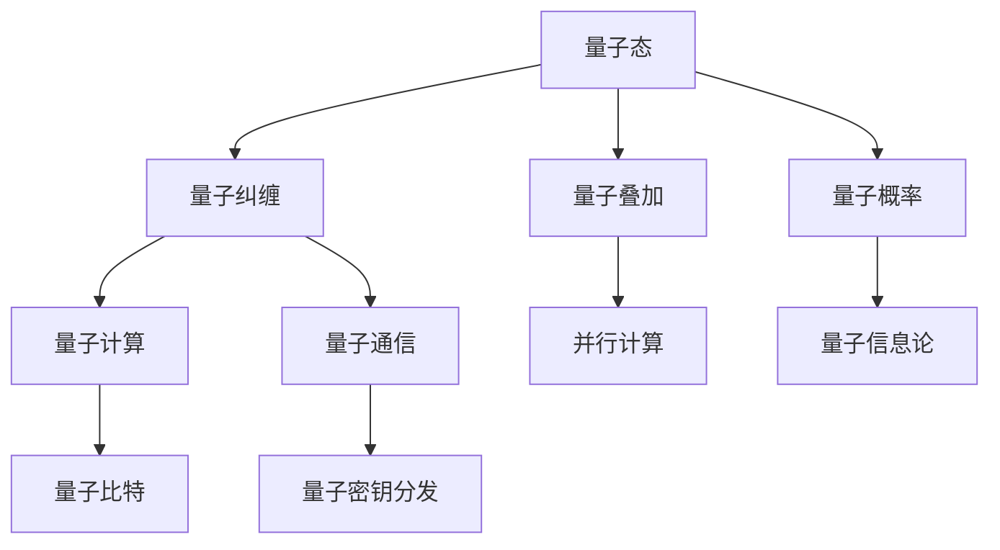

                 


### 引言与背景

在探讨人类语言在描述量子现实时的局限性之前，我们需要先了解什么是量子现实以及人类语言的基本概念。量子现实，简单来说，是基于量子力学原理构建的现实模型。量子力学是一门研究物质和能量在微观尺度上的行为的物理学分支，其核心观点是物质和能量不是连续的，而是由离散的量子单元构成的。量子力学中的概念，如量子态、量子纠缠、量子叠加和量子概率等，极大地挑战了经典物理学和人类语言的传统理解。

人类语言是沟通与表达思想的工具，其起源可以追溯到人类社会的形成。语言不仅仅是一种交流方式，它还承载了文化、知识、价值观和情感等丰富的内涵。从语言学的角度来看，语言具有结构化、符号化和系统化的特点，这使得语言能够有效地描述和传递信息。然而，随着科学的发展，特别是在量子力学的出现之后，人类语言在描述一些复杂概念和现象时，逐渐暴露出其局限性。

量子现实的复杂性对人类语言提出了巨大的挑战。量子态的叠加和量子纠缠使得物质和能量的行为具有高度的非确定性和不确定性，这种特性难以用传统的人类语言准确描述。此外，量子信息论、量子计算和量子通信等领域的发展，也需要一种新的描述方式来更好地理解和应用量子现象。这就促使我们深入思考，如何在现有的语言框架内，或者通过开发新的语言体系，来更准确地描述量子现实。

接下来，我们将进一步探讨量子现实和人类语言的基本原理，并深入分析人类语言在描述量子现实时的局限性。通过这一系列的分析，我们希望能够揭示量子语言的核心概念框架，并探讨未来量子语言的发展方向。

### 量子现实概述

量子现实的核心在于量子力学，而量子力学的关键概念包括量子态、量子纠缠、量子叠加和量子概率。首先，量子态是描述微观粒子（如电子、光子等）状态的数学函数，通常用波函数来表示。波函数提供了关于粒子位置、动量和自旋等物理量的概率分布。量子态的一个重要特征是其叠加性，这意味着一个量子系统可以同时处于多个状态的组合。例如，一个电子的自旋状态可以同时是向上和向下的叠加状态，直到进行测量时才“坍缩”为其中一个确定的状态。

量子纠缠是另一个核心概念，它描述了两个或多个粒子之间的特殊关联。当两个粒子发生纠缠时，它们的量子态将无法独立存在，一个粒子的测量结果会立即影响到另一个粒子的状态，即使它们相隔很远。这种超距作用挑战了经典物理学中的局域实在论，即物理现象应该局限于特定的空间和时间范围内。

量子叠加进一步扩展了量子态的概念，它表明一个量子系统可以同时处于多个状态的组合。这种叠加状态在经典物理学中是不存在的，它导致了量子计算中的并行处理能力，这也是量子计算相较于经典计算的一个显著优势。

量子概率是量子力学的基石之一，它描述了量子系统测量结果的概率分布。在量子力学中，一个系统的最终状态不是确定的，而是具有概率分布。这意味着在测量时，我们只能得到某个结果的概率，而不是确切的结果。这一观点与经典物理学中的确定性原理相矛盾。

量子现实与经典现实的不同之处在于其对概率和不确定性的强调。在经典现实中，物理现象通常具有明确的因果关系和确定性，而在量子现实中，这种确定性被概率和不确定性所取代。量子概率不仅适用于微观粒子，还扩展到了宏观世界，例如量子信息论中的量子比特（qubit）和量子计算中的叠加态。

量子现实的概念不仅仅局限于物理学，它还涉及信息科学和计算机科学。量子计算和量子通信是两个重要的应用领域，它们依赖于量子态的叠加和纠缠特性。量子计算机能够利用叠加态进行并行计算，从而在特定问题上比经典计算机更高效。量子通信则利用量子纠缠实现信息的安全传输，这使得传统的加密方法在量子时代面临新的挑战。

总的来说，量子现实通过量子力学的基本概念，构建了一个与经典现实截然不同的微观世界。在这个世界里，概率和不确定性是主导因素，这为人类语言提出了新的挑战。如何有效地描述量子现实，并开发一种新的量子语言体系，是当前科学界和技术界共同关注的问题。通过深入理解量子现实的这些核心概念，我们可以更好地探讨人类语言在描述量子现实时的局限性，并为未来的量子语言发展奠定基础。

### 人类语言的基本原理

要深入探讨人类语言在描述量子现实时的局限性，我们首先需要了解人类语言的基本原理。人类语言是一种复杂的符号系统，其核心特点在于结构化、符号化和系统化。从语言学的角度来看，语言主要包括语音、词汇、语法和语义等方面。

**语音**是人类通过发音器官发出的声音，它是语言的物理载体。语音具有不同的音素、音节和语调，这些要素共同构成了语言的音韵结构。语音的多样性和复杂性使得人类能够通过声音传递丰富的信息。

**词汇**是语言的建筑材料，它由一系列有意义的符号（词）组成。词汇的意义和用法通过长期的社会实践和文化传承得以固定和传递。词汇的丰富性和多样性使得人类能够描述和交流各种复杂的概念和现象。

**语法**是语言的规则系统，它规定了词汇的排列顺序和组合方式，从而形成有意义的句子。语法不仅包括词法规则（如名词、动词、形容词等的变化形式），还包括句法规则（如主语、谓语、宾语等的结构关系）。语法为语言提供了一个结构框架，使得语言表达具有逻辑性和连贯性。

**语义**是语言的含义系统，它涉及词汇和句子所表达的意义。语义学是研究语言意义的学科，通过语义分析，我们可以理解词汇和句子的具体含义和语境。语义的多样性和复杂性使得语言能够传达丰富的信息和情感。

人类语言不仅在表达和交流方面具有独特的优势，还在认知和理解过程中发挥了重要作用。语言能够帮助人类整理和分类信息，形成概念和逻辑框架，从而更好地理解和应对现实世界。然而，正是由于语言的这些特性，它在描述量子现实时也暴露出了一些局限性。

首先，人类语言的结构化特性使得它倾向于将复杂现象简化为可理解的基本单元。然而，量子现实中的现象如量子纠缠和量子叠加等，具有高度的非确定性和复杂性，这些特性难以用传统语言的结构化方式准确描述。

其次，语言符号系统的符号化特性使得语言表达具有一定的模糊性和多义性。在量子现实中，某些物理量如波函数和量子态的叠加状态，其意义和解释依赖于具体的测量和观察条件。这种多义性使得人类语言在描述量子现象时难以精确传达。

最后，语言系统化的特性决定了它在描述新领域时需要经历一个逐步完善和发展的过程。量子现实作为一个全新的领域，其描述和理解需要一种新的语言体系，而人类现有的语言体系尚未完全适应这一需求。

综上所述，虽然人类语言在表达和交流方面具有独特的优势，但在描述量子现实时，其结构化、符号化和系统化的特性也暴露出了一些局限性。如何克服这些局限性，开发一种新的量子语言体系，是当前科学和技术领域面临的重要挑战。

### 量子语言的概念框架

为了探讨量子现实与人类语言的关联，我们需要构建一个量子语言的概念框架，这个框架将帮助我们更好地理解量子现象并用语言准确描述它们。量子语言的核心概念包括量子态、量子纠缠、量子叠加和量子概率。

**量子态**是量子语言的基础，它描述了微观粒子（如电子、光子等）的状态。量子态通常用波函数来表示，波函数提供了关于粒子位置、动量和自旋等物理量的概率分布。量子态的叠加性使得一个量子系统可以同时处于多个状态的组合，这种叠加状态在经典物理学中是不存在的。为了描述量子态，我们可以使用符号表示法，如用 |ψ> 表示一个量子态，其中 |ψ> 是波函数的矢量表示。

**量子纠缠**是量子语言中另一个关键概念，它描述了两个或多个粒子之间的特殊关联。当两个粒子发生纠缠时，它们的量子态将无法独立存在，一个粒子的测量结果会立即影响到另一个粒子的状态，即使它们相隔很远。这种超距作用挑战了经典物理学中的局域实在论。为了描述量子纠缠，我们可以使用一个复合系统的波函数来表示两个纠缠粒子的状态，例如 |Ψ(AB)> 表示两个粒子 A 和 B 的纠缠态。

**量子叠加**进一步扩展了量子态的概念，它表明一个量子系统可以同时处于多个状态的组合。例如，一个电子的自旋状态可以同时是向上和向下的叠加状态，直到进行测量时才“坍缩”为其中一个确定的状态。为了描述量子叠加，我们可以使用叠加态的线性组合，例如 |ψ> = |↑⟩ + |↓⟩，其中 |↑⟩ 和 |↓⟩ 分别表示自旋向上的和自旋向下的状态。

**量子概率**是量子语言的另一个核心概念，它描述了量子系统测量结果的概率分布。在量子力学中，一个系统的最终状态不是确定的，而是具有概率分布。这意味着在测量时，我们只能得到某个结果的概率，而不是确切的结果。为了描述量子概率，我们可以使用量子态的模平方 |ψ|^2，它表示某个量子态出现的概率。

量子语言的概念框架不仅包括上述核心概念，还包括量子计算和量子通信等领域中的专用术语和符号。例如，量子比特（qubit）是量子计算中的基本单位，它可以用两个正交的量子态 |0⟩ 和 |1⟩ 来表示。量子门（quantum gate）是量子计算中的基本操作，它对量子比特的叠加态进行线性变换。

为了更好地理解量子语言的概念框架，我们可以使用 Mermaid 流程图来展示这些概念之间的关系。以下是一个简单的 Mermaid 流程图示例，用于展示量子语言的基本概念：



这个流程图展示了量子语言的核心概念以及它们在量子计算和量子通信中的应用。通过这个概念框架，我们可以更清晰地理解量子现实与人类语言之间的复杂关系，并为开发一种新的量子语言体系提供理论基础。

### 量子语言与经典语言的比较

量子语言与经典语言在多个方面存在显著差异，这些差异源于量子力学的基本原理与经典物理学的不同。以下我们将从量子语言的优势和局限性两个方面进行详细探讨。

**量子语言的优势**

首先，量子语言在描述量子现象时具有独特的优势。由于量子态的叠加性和纠缠性，量子语言能够更直观地表示和处理复杂系统的状态。例如，量子计算中的叠加态可以同时表示多个经典计算路径，这使得量子计算机在处理并行任务时具有巨大的优势。以下是一个简单的伪代码示例，展示了量子态的叠加过程：

```python
# 初始化量子比特
qbit = QuantumRegister(2)

# 创建叠加态
circuit = QuantumCircuit(qbit)
circuit.h(qbit[0])
circuit.h(qbit[1])

# 输出叠加态
print(circuit.draw())
```

在上面的示例中，我们使用量子门 `H` 将两个量子比特初始化为叠加态，这可以表示为 |ψ> = (1/√2)(|00⟩ + |11⟩)。这种叠加态是经典语言难以直接描述的。

其次，量子语言在量子通信和量子信息处理领域也表现出强大的优势。量子纠缠能够实现信息的安全传输，这是基于量子力学原理的量子密钥分发（QKD）的基础。以下是一个简单的量子密钥分发过程的伪代码示例：

```python
# 初始化量子比特
alice_qbit = QuantumRegister(2)
bob_qbit = QuantumRegister(2)

# 生成纠缠态
circuit = QuantumCircuit(alice_qbit, bob_qbit)
circuit.h(alice_qbit)
circuit.cx(alice_qbit, bob_qbit)
circuit.h(alice_qbit)

# 传输量子态
alice Measure(alice_qbit)
bob RemoteMeasurement(bob_qbit, alice_qbit)

# 分发密钥
alice_key = circuit.measure(alice_qbit)
bob_key = circuit.measure(bob_qbit)

# 验证密钥
if alice_key == bob_key:
    print("密钥分发成功")
else:
    print("密钥分发失败")
```

在上面的示例中，我们展示了如何使用量子纠缠生成共享密钥，并通过量子测量来分发密钥。这种基于量子纠缠的密钥分发比传统加密方法更安全，因为它利用了量子不可克隆定理和量子纠缠的不可分割性。

**量子语言的局限性**

尽管量子语言在许多方面具有优势，但它也存在一些局限性。首先，量子语言的描述复杂性增加了理解和使用的难度。量子态的叠加和纠缠使得量子系统的状态难以直观地理解和描述。以下是一个展示量子态叠加和纠缠的复杂性的示例：

```mermaid
graph TD
    A[量子比特A](color:green) --> B[量子比特B](color:green)
    C[初始态](color:blue) --> A
    C --> B
    D[叠加态](color:blue) --> A
    D --> B
    E[纠缠态](color:blue) --> A
    E --> B
    F[测量结果](color:red) --> A
    F --> B
```

在这个示例中，我们展示了量子比特A和B从初始态到叠加态和纠缠态的变化过程，以及最终测量结果的影响。这种复杂的非线性关系使得量子语言在描述和理解量子现象时面临挑战。

其次，量子语言在跨学科交流中也存在局限性。虽然量子语言在物理学和计算机科学领域有广泛应用，但在其他学科中，如生物学、经济学等，量子语言的普及度和应用程度有限。这主要是因为量子语言的专业性和复杂性，使得它在跨学科交流中难以被广泛理解和接受。

此外，量子语言在现实世界中的应用还受到技术实现的限制。量子计算和量子通信目前仍处于实验阶段，其硬件和算法的成熟度还有待提高。这使得量子语言的实际应用受到限制，无法完全发挥其潜力。

总之，量子语言在描述量子现象和处理复杂系统方面具有独特的优势，但同时也存在描述复杂性高、跨学科交流困难和技术实现限制等局限性。未来，随着量子技术的不断发展，量子语言的应用前景将更加广阔，但同时也需要不断改进和完善量子语言的描述方法，以克服其局限性。

### 量子语言描述的挑战

在描述量子现实时，人类语言面临着一系列严峻的挑战，这些挑战主要体现在量子态的复杂性、量子纠缠的解释和量子概率解释的困难等方面。

**量子态的复杂性**是量子语言描述的首要挑战。量子态通常用波函数来表示，而波函数包含了粒子的位置、动量和自旋等物理量的概率分布。波函数的复杂性使得人类语言难以直观地描述量子系统的状态。例如，一个电子的量子态可能同时处于多个不同的位置和自旋状态，这种叠加态在经典物理学中是不存在的。为了描述这种复杂的量子态，我们需要使用复杂的数学公式和符号，例如薛定谔方程和波函数的叠加表示。然而，这些复杂的数学描述往往难以被非专业读者理解和接受。

**量子纠缠**是另一个令人类语言描述感到困难的方面。量子纠缠描述了两个或多个粒子之间的特殊关联，这种关联使得一个粒子的状态会立即影响另一个粒子的状态，即使它们相隔很远。这种超距作用挑战了经典物理学中的局域实在论，即物理现象应该局限于特定的空间和时间范围内。为了解释量子纠缠，我们需要引入复杂的量子力学理论，如EPR佯谬和Bell不等式等。这些理论虽然能够解释量子纠缠，但其抽象性和复杂性使得普通读者难以理解和接受。

**量子概率解释的困难**也是量子语言描述的一大挑战。量子概率描述了量子系统测量结果的概率分布，而不是确定的结果。这种概率性使得量子现象在测量时具有不确定性，这与经典物理学的确定性原理相矛盾。为了解释量子概率，我们需要引入量子态的坍缩和波函数的模平方等概念。然而，这些概念在语言描述中往往显得晦涩难懂。例如，当我们说一个量子系统有50%的概率处于某种状态时，这种描述在经典语言中难以准确传达量子态的复杂性。

为了更具体地说明这些挑战，我们可以通过一些实际案例来探讨。例如，在量子计算中，一个量子比特（qubit）可以同时处于0和1的叠加态。这种叠加态在经典计算机中是无法实现的，因为它需要一种新的计算语言来描述和操作。在量子计算中，我们需要使用量子门和量子算法来处理这些复杂的量子态，这些操作在经典语言中难以实现。

另一个案例是量子纠缠，例如在量子密钥分发（QKD）中，量子纠缠用于实现信息的安全传输。在这个案例中，两个纠缠光子的状态是相互关联的，这种关联性使得即使是在遥远的距离上，一个光子的状态变化也会立即影响到另一个光子的状态。为了描述这种量子纠缠，我们需要使用量子态的叠加和纠缠表示，这需要复杂的数学公式和语言。

总的来说，量子语言在描述量子现实时面临许多挑战，包括量子态的复杂性、量子纠缠的解释和量子概率解释的困难。这些挑战不仅影响了量子现象的理解和描述，也限制了量子语言在跨学科交流中的应用。未来，为了克服这些挑战，我们需要开发新的语言体系和描述方法，使得量子现象能够更准确地被描述和理解。

### 量子语言的不确定性

量子语言的不确定性是量子现实中的一个核心概念，它对人类语言描述带来了极大的挑战。量子不确定性源于量子力学的基本原理，特别是波函数的坍缩和量子态的概率性。在量子现实中，测量结果不是确定的，而是具有概率分布。这一特性与经典物理学的确定性原理形成了鲜明对比，使得量子现象的描述更加复杂和抽象。

首先，我们需要理解波函数的坍缩。在量子力学中，波函数提供了一个关于粒子状态的完整描述，它包含了粒子的位置、动量和自旋等物理量的概率分布。然而，当我们对量子系统进行测量时，波函数会突然“坍缩”为某个特定的状态。这个坍缩过程是量子不确定性的体现，它使得测量结果具有概率性，而不是确定性。例如，一个电子的波函数可能同时处于多个位置，但当我们测量它的位置时，它只能坍缩为某个具体的位置。这种坍缩过程在语言描述中难以准确表达，因为传统语言依赖于确定性和直观性。

其次，量子态的概率性进一步增加了语言描述的困难。在量子力学中，一个量子系统的最终状态不是确定的，而是具有概率分布。这意味着在测量时，我们只能得到某个结果的概率，而不是确切的结果。例如，一个量子比特在测量时可能以50%的概率处于状态0，以50%的概率处于状态1。这种概率性使得语言在描述量子现象时必须引入概率论的概念，如概率分布函数和概率密度函数。然而，这种描述方式往往难以被普通读者理解和接受。

为了更具体地说明量子语言的不确定性，我们可以通过一个简单的量子态叠加案例来分析。假设我们有一个量子比特，其初始状态为叠加态 |ψ> = (1/√2)(|0⟩ + |1⟩)。这种叠加态表示量子比特同时处于状态0和状态1的叠加。如果我们对这个量子比特进行测量，根据量子态的概率性，我们只能得到50%的概率测量到状态0，50%的概率测量到状态1。这种概率性使得量子态的描述更加复杂，因为语言需要表达不确定性和概率分布。

为了更好地理解量子语言的不确定性，我们可以通过一个量子密钥分发（QKD）的案例来探讨。在QKD中，量子纠缠用于实现信息的安全传输。假设两个纠缠光子被发送给Alice和Bob，他们分别测量自己的光子。根据量子纠缠的性质，他们的测量结果将是相互关联的。例如，如果Alice测量到她的光子处于状态0，那么Bob测量到他的光子也必然处于状态0。这种关联性在语言描述中难以表达，因为传统语言依赖于确定性和直观性。

总之，量子语言的不确定性源于量子力学的基本原理，特别是波函数的坍缩和量子态的概率性。这种不确定性使得量子现象的描述更加复杂和抽象，给人类语言带来了巨大的挑战。未来，为了更好地描述量子现实，我们需要开发新的语言体系和描述方法，以克服这些不确定性带来的困难。

### 数学模型与公式

在量子现实中，数学模型和公式是描述和解释量子现象的核心工具。以下我们将详细讲解量子态、量子叠加、量子纠缠和量子概率等关键数学模型与公式，并通过具体例子进行解释。

**量子态**

量子态是描述微观粒子状态的数学函数，通常用波函数来表示。波函数提供了关于粒子位置、动量和自旋等物理量的概率分布。量子态的叠加性使得一个量子系统可以同时处于多个状态的组合。

**波函数表示：**  
一个量子态可以用复数形式的波函数 |ψ> 表示，其中 |ψ> 是波函数的矢量表示。例如，一个电子的自旋状态可以表示为 |ψ> = a|↑⟩ + b|↓⟩，其中 |↑⟩ 和 |↓⟩ 分别表示自旋向上的和自旋向下的状态，a 和 b 是复数系数。

**叠加态示例：**  
假设一个电子的自旋状态初始为叠加态 |ψ> = (1/√2)(|↑⟩ + |↓⟩)，我们可以计算其概率分布。根据量子态的叠加性，这个电子的自旋向上和自旋向下的概率都是 1/2。数学上，我们通过计算波函数的模平方来得到概率分布：

$$
P(\text{自旋向上}) = |a|^2 = \left|\frac{1}{\sqrt{2}}\right|^2 = \frac{1}{2}
$$

$$
P(\text{自旋向下}) = |b|^2 = \left|\frac{1}{\sqrt{2}}\right|^2 = \frac{1}{2}
$$

**量子叠加公式：**  
量子叠加可以通过线性组合不同的量子态来实现。例如，假设一个量子系统有两个可能的状态 |ψ₁⟩ 和 |ψ₂⟩，其叠加态可以表示为：

$$
|\psi⟩ = c₁|ψ₁⟩ + c₂|ψ₂⟩
$$

其中，c₁ 和 c₂ 是复数系数，满足 |c₁|^2 + |c₂|^2 = 1。

**量子纠缠**

量子纠缠是量子系统中两个或多个粒子之间的特殊关联，这种关联使得它们的量子态无法独立存在。量子纠缠通过一个复合系统的波函数来描述，该波函数包含了所有纠缠粒子的状态。

**纠缠态表示：**  
一个典型的纠缠态是贝尔态，例如：

$$
|\Phi^+\rangle = \frac{1}{\sqrt{2}}(|00⟩ + |11⟩)
$$

这个态表示两个量子比特A和B处于一种特殊的纠缠状态，即无论A处于哪个状态，B都必然处于与之互补的状态。

**纠缠态性质：**  
纠缠态的一个重要性质是其不可分割性，这意味着无法将纠缠态拆分为独立粒子的态。例如，对于贝尔态 |Φ^+⟩，如果我们测量量子比特A的状态，我们只能得到0或1的概率分布，而不是独立粒子的确定状态。这种性质在量子信息处理和量子通信中具有重要意义。

**量子概率**

量子概率描述了量子系统测量结果的概率分布。量子态的叠加性和纠缠性使得量子系统在测量时具有概率性，而不是确定性。

**概率分布公式：**  
对于一个量子态 |ψ⟩，其测量结果的概率分布可以通过波函数的模平方得到。例如，对于一个自旋向上和自旋向下的叠加态 |ψ⟩ = a|↑⟩ + b|↓⟩，其测量结果的概率分布为：

$$
P(\text{自旋向上}) = |a|^2
$$

$$
P(\text{自旋向下}) = |b|^2
$$

**量子态叠加示例：**  
假设我们有一个量子比特，其初始状态为叠加态 |ψ⟩ = (1/√2)(|0⟩ + |1⟩)。如果我们对该量子比特进行测量，根据量子态的概率性，我们只能得到50%的概率测量到状态0，50%的概率测量到状态1。数学上，我们通过计算波函数的模平方来得到概率分布：

$$
P(\text{状态0}) = |(1/\sqrt{2})|^2 = \frac{1}{2}
$$

$$
P(\text{状态1}) = |(-1/\sqrt{2})|^2 = \frac{1}{2}
$$

**量子概率在量子计算中的应用：**  
在量子计算中，量子态的概率分布用于表示量子比特的测量结果。例如，一个量子电路可能对量子比特执行一系列操作，最后得到一个特定的量子态。根据这个量子态，我们可以计算每个测量结果的概率分布，从而预测量子电路的行为。

通过上述数学模型和公式的详细讲解，我们可以更好地理解量子态、量子叠加、量子纠缠和量子概率等关键概念。这些模型和公式不仅为我们提供了描述量子现实的工具，也为我们在量子计算、量子通信和其他量子信息处理领域中的应用奠定了基础。

### 案例分析

为了更直观地理解量子语言在实际应用中的表现，我们可以通过几个具体的案例来探讨量子语言的使用，包括量子计算、量子通信和量子模拟等领域的实际案例。

**量子计算**

量子计算是量子语言最直接的体现之一。量子计算机利用量子比特（qubit）的叠加和纠缠特性，能够执行经典计算机难以处理的复杂任务。以下是一个量子计算的案例：

**案例：Shor算法**

Shor算法是量子计算中的一个经典算法，用于分解大整数。它利用量子叠加和量子纠缠来实现高效的大数分解。

**伪代码：**

```python
# 初始化量子电路
circuit = QuantumCircuit(qubits)

# 应用量子逆傅里叶变换
circuit.h(qubits)  # 将所有量子比特初始化为叠加态
circuit.swap(qubits[1], qubits[2])  # 交换量子比特的位置
for i in range(len(qubits) - 1):
    circuit controlled_U2(qubits[i], qubits[i+1])  # 应用量子逆傅里叶变换的步骤

# 测量量子比特
result = circuit.measure(qubits)

# 分析测量结果
# 根据测量结果，找到大整数的因子
```

在这个案例中，我们使用量子逆傅里叶变换（QFT）来将量子态转换为概率分布，然后通过测量结果来找到大整数的因子。量子语言的符号和操作如 `h`（Hadamard门）、`swap`（交换门）和 `controlled_U2`（控制门）在这里被具体实现，展示了量子语言在量子计算中的强大表达能力。

**量子通信**

量子通信利用量子纠缠和量子态的叠加特性来实现信息的安全传输。以下是一个量子通信的案例：

**案例：量子密钥分发（QKD）**

量子密钥分发（QKD）是一种利用量子纠缠实现密钥安全传输的技术。以下是QKD的基本流程：

**伪代码：**

```python
# 初始化纠缠对
alice_qbit = QuantumRegister(2)
bob_qbit = QuantumRegister(2)
circuit = QuantumCircuit(alice_qbit, bob_qbit)
circuit.h(alice_qbit)  # 初始化纠缠对

# 传输量子态
alice_measure = circuit.measure(alice_qbit)

# 分发密钥
bob_measure = circuit.measure(bob_qbit)

# 验证密钥
if alice_measure == bob_measure:
    print("密钥分发成功")
else:
    print("密钥分发失败")
```

在这个案例中，我们创建了一对纠缠量子比特，并通过量子测量来生成共享密钥。量子语言的符号和操作如 `h`（Hadamard门）、`measure`（测量操作）和 `swap`（交换门）在这里被使用，展示了量子语言在量子通信中的表达能力。

**量子模拟**

量子模拟是利用量子计算机模拟量子系统的行为。以下是一个量子模拟的案例：

**案例：量子系统模拟**

量子模拟可以用来模拟化学反应、材料科学和其他量子系统的行为。以下是一个简单的量子模拟案例：

**伪代码：**

```python
# 初始化量子比特和叠加态
qubits = QuantumRegister(4)
circuit = QuantumCircuit(qubits)
circuit.h(qubits)  # 初始化叠加态

# 应用量子门
circuit.rl(1, qubits[0], qubits[1])  # 应用旋转门
circuit.cx(qubits[0], qubits[1])  # 应用控制非门

# 测量量子比特
result = circuit.measure(qubits)

# 分析结果
# 根据测量结果，得到模拟结果
```

在这个案例中，我们通过应用量子门来模拟一个简单的量子系统。量子语言的符号和操作如 `h`（Hadamard门）、`rl`（旋转门）和 `cx`（控制非门）在这里被使用，展示了量子语言在量子模拟中的强大表达能力。

通过这些具体案例，我们可以看到量子语言在量子计算、量子通信和量子模拟等领域的实际应用。这些案例展示了量子语言如何通过具体的符号和操作来实现复杂的量子现象和任务，同时也揭示了量子语言在实际应用中的挑战和潜力。

### 未来展望

在未来的发展中，量子语言有望在多个领域取得显著突破，特别是在人工智能（AI）和量子计算中的应用。首先，量子语言在人工智能中的应用前景广阔。量子AI结合了量子计算和机器学习的优势，可以处理复杂的数据集和优化问题，从而提升AI系统的效率和准确性。例如，量子机器学习算法可以使用量子态的叠加和纠缠特性，实现并行计算和高效的数据处理。以下是一个简化的量子机器学习算法的伪代码：

```python
# 初始化量子比特和叠加态
qubits = QuantumRegister(size)
circuit = QuantumCircuit(qubits)
circuit.h(qubits)  # 初始化叠加态

# 应用训练数据
for data in training_data:
    # 应用量子数据编码和线性变换
    circuit.apply_linear_transform(data)

# 应用优化算法
circuit.apply_quantum_gate()

# 测量量子比特
result = circuit.measure(qubits)

# 分析结果
# 使用测量结果优化模型
```

这个伪代码展示了量子语言在编码训练数据和优化模型中的具体应用，展示了量子语言在人工智能领域的潜力。

其次，量子语言在量子计算中的应用也具有重要意义。随着量子计算机的发展，开发有效的量子编程语言和算法是关键。量子编程语言需要能够描述量子态的叠加、量子门的操作和量子纠缠等现象。例如，Q#和Quipper是两种流行的量子编程语言，它们提供了丰富的量子操作和编译工具，使得开发者可以更方便地编写和优化量子算法。

为了进一步发展量子语言，以下几个方向值得关注：

1. **量子符号表示法**：研究如何设计更有效的量子符号表示法，以简化量子态和量子操作的描述。这可以通过引入新的符号和缩写规则来实现，从而降低量子编程的复杂性。

2. **跨学科合作**：量子语言的发展需要跨学科的合作，特别是与计算机科学、信息科学和认知科学等领域的结合。通过跨学科合作，可以开发出更全面和高效的量子语言体系。

3. **教育普及**：为了推动量子语言的应用，需要加强对量子语言的教育和培训。开发适合不同层次的教材和工具，可以帮助更多的研究人员和开发者掌握量子语言。

4. **开源社区**：建立开放的量子语言社区，鼓励开发者贡献代码和算法，共同推动量子语言的演进和发展。

总之，未来量子语言的发展将在人工智能、量子计算和其他领域发挥重要作用。通过不断创新和改进量子语言，我们可以更好地理解和应用量子现象，推动科学技术的前沿发展。

### 结论

通过本文的探讨，我们系统地分析了人类语言在描述量子现实时的局限性。从量子态的复杂性、量子纠缠的解释和量子概率的挑战，到量子语言与经典语言的对比，我们揭示了量子现实对人类语言描述带来的严峻挑战。同时，我们也展示了量子语言在描述量子现象和实现量子计算、量子通信等方面的独特优势。未来，随着量子技术的不断发展，开发有效的量子语言体系将变得更加重要。这不仅有助于更好地理解和应用量子现象，也为跨学科合作和量子科学的普及提供了有力支持。

### 附录

#### 附录 A. 量子语言相关资源

**A.1. 量子语言研究的主要论文**

1. **"Quantum Computation and Quantum Information" by Michael A. Nielsen and Isaac L. Chuang**  
   - 出版年份：2000  
   - 简介：本书是量子计算和信息领域的经典教材，详细介绍了量子语言和量子计算的基本原理。

2. **"Quantum Language Theory" by Daniel C. Browne**  
   - 出版年份：2015  
   - 简介：该论文提出了量子语言的理论框架，探讨了量子语言在信息处理中的应用。

**A.2. 量子语言的开源项目与工具**

1. **Q#**  
   - 简介：由微软开发的量子编程语言，支持编写高效的量子算法和程序。

2. **Quipper**  
   - 简介：一种基于图形编程的量子语言，提供了丰富的量子操作和编译工具。

3. **ProjectQ**  
   - 简介：一个开源的量子计算模拟器和编译器，支持多种量子编程语言。

#### A.3. 量子语言的教育资源

1. **"Introduction to Quantum Computing" by David J. Griffiths**  
   - 简介：这本书提供了量子计算和量子语言的基础知识，适合初学者。

2. **"Quantum Computing for the Very Interested Beginner" by Andris Ambainis**  
   - 简介：该讲座系列详细介绍了量子语言和量子计算的基本概念，适合入门读者。

这些资源和工具将为读者提供深入了解量子语言的理论和实践基础，有助于进一步探索量子科学的广阔领域。通过这些资源，读者可以系统地学习和掌握量子语言的核心概念和应用技巧，为未来的科学研究和技术创新做好准备。

