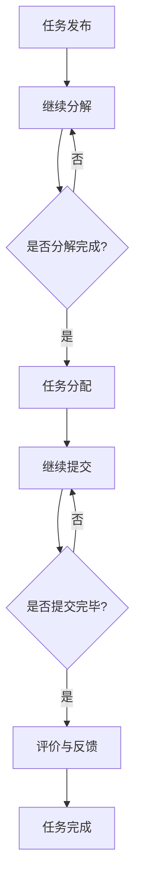

                 


### 引言与背景

#### 众包科学的定义与历史

**众包（Crowdsourcing）**，顾名思义，是指通过收集公众的智慧来完成某个任务或项目。这个概念最早由Jonas Livet在2000年提出，其初衷是通过互联网平台，将复杂的任务分散到大量个体手中，从而实现高效协同工作。众包的发展历程可以追溯到20世纪初期，当时一些企业开始采用“开放创新”的模式，邀请外部人员参与产品设计和开发。随着互联网技术的发展，尤其是社交网络的普及，众包逐渐成为一种主流的合作方式。

众包与传统科研模式的对比在于，它打破了传统的“封闭”研究模式，实现了“开放”与“协作”。在传统科研模式中，研究往往是由少数专家在实验室或研究机构中进行，研究成果也往往局限于特定的小圈子。而众包模式则能够将研究问题开放给广大公众，利用公众的智慧和资源，共同推进科学研究。

众包的优势在于其高效性、创新性和低成本。首先，众包能够快速聚集大量的人力和智力资源，大大缩短研究周期。其次，众包能够激发公众的创造力，产生意想不到的创新成果。最后，众包降低了研究成本，通过利用公众的时间和技能，避免了高额的人力资源投入。

然而，众包也面临一些挑战，例如质量控制、信息安全、激励机制等。如何确保众包结果的准确性和可靠性，如何保护参与者的隐私，以及如何激励参与者持续参与，都是需要解决的问题。

#### 人类集体智慧的概念与形成

**人类集体智慧**，指的是人类群体通过协作和互动所展现出的智慧和能力。这种智慧不仅仅依赖于个体智能，更依赖于群体智能的协同效应。人类集体智慧的形成机制可以追溯到远古时期，当时人类通过狩猎和采集活动，依靠群体的力量来提高生存几率。随着人类社会的发展，集体智慧逐渐成为文明进步的重要驱动力。

人类集体智慧的形成机制主要包括以下几个方面：

1. **信息共享**：通过信息共享，个体能够获取更多的知识，从而提高解决问题的能力。
2. **协作与分工**：个体通过分工合作，发挥各自的优势，实现整体效能的提升。
3. **反馈与迭代**：通过不断反馈和迭代，集体智慧能够不断优化和进化。
4. **激励机制**：适当的激励机制能够激发个体的积极性和创造力，促进集体智慧的持续发展。

人类集体智慧与个体智慧的互补关系体现在，个体智慧是集体智慧的基础，而集体智慧则为个体智慧提供了更广阔的舞台。个体智慧通过集体智慧的整合和放大，能够实现更高的创新水平和解决问题的能力。

#### 众包科学与世界可理解性的关系

**众包科学与世界可理解性**之间的关系可以从多个维度来探讨。首先，众包科学通过开放协作的方式，使得更多的人能够参与到科学研究中，从而增加了世界的理解深度。众包模式能够汇集来自不同领域的知识和视角，从而提供更全面的解决方案。

其次，众包科学在提高世界可理解性方面具有独特的优势。通过众包，复杂的问题可以被分解为多个子问题，每个子问题都可以由不同的个体来解决。这样，整个问题的解决方案就变得更加清晰和具体。此外，众包科学还能够通过数据分析和模式识别，发现隐藏在数据中的规律和模式，从而提高对世界的理解。

最后，众包科学对人类认知的启示是深远的。它提醒我们，个体智能虽然重要，但集体智慧的力量更加巨大。通过众包，我们可以更好地理解复杂系统，探索未知领域，从而推动人类文明的进步。

### 总结与展望

通过本章节的讨论，我们可以看到众包科学在人类集体智慧中的重要作用。它不仅改变了科学研究的方式，也为人类理解世界提供了新的视角。随着技术的不断发展，众包科学在未来有望在更多领域发挥更大的作用，为人类社会的进步贡献力量。

---

**关键词：** 众包科学，人类集体智慧，世界可理解性，协作，信息共享，激励机制。

**摘要：** 本文介绍了众包科学的定义、历史与发展，探讨了人类集体智慧的概念与形成机制，并分析了众包科学与世界可理解性之间的关系。文章通过实际案例展示了众包科学在各个领域的应用，并对其未来发展进行了展望。本文旨在为读者提供关于众包科学与人类集体智慧全面、深入的理解。

## 总体设计思路

为了设计《人类集体智慧：众包科学与世界可理解性》这本书的完整目录大纲，我们需要遵循以下几个关键步骤：

### 1. 确定核心内容

首先，我们需要明确这本书的核心内容，包括：
- **众包科学的基本概念和原理**：介绍众包的定义、起源、发展历程，以及其在现代科技中的地位和作用。
- **众包在不同领域中的应用案例**：探讨众包科学在科学研究、艺术创作、社会治理等领域的具体应用和效果。
- **众包科学的优势与挑战**：分析众包模式的优势，如高效性、创新性、低成本等，同时也探讨其面临的挑战，如质量控制、信息安全、激励机制等。
- **人类集体智慧的形成机制**：探讨人类如何通过协作和互动形成集体智慧，以及这种智慧在人类社会中的作用和影响。
- **众包与人类世界可理解性的关系**：分析众包科学如何提升我们对世界的理解和认知，以及其对科学研究和社会进步的推动作用。

### 2. 确定章节结构

根据核心内容，我们将书籍分为以下几个主要部分：
- **引言与背景**：介绍众包科学的基本概念和历史发展，以及人类集体智慧的形成机制。
- **核心概念与原理**：详细阐述众包科学的核心概念、基本原理和数学模型。
- **应用与实践案例**：展示众包科学在各个领域的具体应用案例，以及其实际操作和效果。
- **影响与未来趋势**：探讨众包科学对科研、社会和经济的影响，以及其未来的发展趋势和挑战。
- **总结与展望**：对全书内容进行总结，并对众包科学在人类集体智慧和世界可理解性中的作用进行展望。

### 3. 确定每个章节的具体内容

在每个部分中，我们需要细化章节内容，包括：
- **每个章节的主要观点和目标**：明确每个章节的核心观点和目标，确保内容有条理、逻辑清晰。
- **每个章节的核心概念、原理和算法**：详细讲解每个章节中的核心概念、原理和算法，确保读者能够理解并掌握。
- **每个章节的应用案例和实际操作**：通过实际案例展示每个章节中的理论如何应用到实际中，提高读者的实践能力。
- **每个章节的理论与实际结合**：讨论理论在实际应用中的效果和不足，提出改进措施和建议。

### 4. 设计Mermaid流程图

为了更好地展示核心概念和原理，我们将在合适的地方添加Mermaid流程图，以增强读者的理解。Mermaid流程图可以帮助读者更直观地理解众包科学的运作流程和关键环节，提高学习效果。

### 5. 编写伪代码

为了详细阐述核心算法原理，我们将在合适的地方编写伪代码，以便读者能够更好地理解算法的实现。伪代码能够简化算法的实现步骤，突出关键逻辑，使读者更容易理解。

### 6. 编写数学模型和公式

我们将使用latex格式编写数学模型和公式，并详细讲解每个公式的作用和意义。latex格式能够精确表达数学概念，使读者更容易理解和掌握。

### 7. 编写项目实战案例

我们将编写实际项目案例，详细解释代码实现和解读，以便读者能够将理论知识应用到实际项目中。通过实际项目案例，读者可以更好地理解众包科学的实际应用和操作流程。

### 8. 编写总结与展望

在书的结尾，我们将对全书内容进行总结，并展望未来众包科学与人类世界可理解性的发展趋势。总结部分将回顾全书的核心观点和结论，展望未来众包科学的发展方向和挑战，为读者提供更深入的思考。

通过以上步骤，我们将设计出这本书的完整目录大纲，确保其简洁、完整且逻辑清晰，为读者提供一次深入理解众包科学和人类集体智慧的机会。

## 详细目录大纲设计

### 第一部分：引言与背景

#### 第1章：众包科学与人类集体智慧

1.1 众包科学的定义与历史
1.2 人类集体智慧的概念与形成
1.3 众包科学与世界可理解性的关系

### 第二部分：核心概念与原理

#### 第2章：众包科学的基础理论

2.1 众包科学的核心概念
2.2 众包科学的基本原理
2.3 众包科学的数学模型

### 第三部分：应用与实践案例

#### 第3章：众包科学在科学领域的应用

3.1 众包在生物学中的应用
3.2 众包在物理学中的应用
3.3 众包在天文学中的应用

#### 第4章：众包科学在艺术领域的应用

4.1 众包在音乐创作中的应用
4.2 众包在绘画创作中的应用
4.3 众包在文学创作中的应用

#### 第5章：众包科学在社会治理领域的应用

5.1 众包在公共卫生管理中的应用
5.2 众包在城市规划中的应用
5.3 众包在应急管理中的应用

### 第四部分：影响与未来趋势

#### 第6章：众包科学的影响与未来趋势

6.1 众包科学对科研的影响
6.2 众包科学对社会的影响
6.3 众包科学的未来发展趋势

### 第五部分：总结与展望

#### 第7章：人类集体智慧与世界可理解性

7.1 总结与展望

### 附录

#### 附录A：Mermaid流程图示例
#### 附录B：伪代码示例
#### 附录C：数学模型和公式列表
#### 附录D：项目实战案例代码解读
#### 附录E：拓展阅读资料

通过以上详细的目录大纲设计，本书将系统地介绍众包科学的基本概念、原理、应用、影响和未来趋势，帮助读者全面了解和掌握这一领域的关键知识和技能。

## 第一部分：引言与背景

### 第1章：众包科学与人类集体智慧

**1.1 众包科学的定义与历史**

众包科学（Crowdsourcing Science）是一种通过开放平台，利用公众的智慧来解决复杂问题或进行创新研究的协作模式。这个概念最早由Jonas Livet在2000年提出，其初衷是利用互联网技术，将复杂的任务分散到广大网民手中，从而实现更高效、更创新的研究模式。

众包科学的发展历程可以追溯到20世纪初期，当时一些企业开始采用“开放创新”的模式，邀请外部人员参与产品设计和开发。随着互联网技术的发展，尤其是社交网络的普及，众包逐渐成为一种主流的合作方式。例如，2006年成立的InnoCentive公司，通过众包模式解决了许多科学和工程难题，成为众包领域的先驱。

在科学研究领域，众包科学的兴起进一步推动了科研模式的变革。传统的科研模式主要依赖于专家和小型研究团队，而众包科学则通过开放合作，将研究问题广泛发布给全球的科研人员，从而实现了全球范围内的资源整合和协同创新。

**1.2 众包与传统科研模式对比**

众包科学与传统科研模式在多个方面存在显著差异。首先，众包科学强调开放性和协作性，而传统科研模式则更加封闭和独立。众包科学通过互联网平台，将研究问题公开给公众，任何人都可以参与研究和讨论，从而实现了全球范围内的资源整合和协同创新。而传统科研模式则主要依赖于专家和小型研究团队，研究成果往往局限于特定的小圈子。

其次，众包科学在效率和成本方面具有明显优势。众包科学能够迅速聚集大量的人力和智力资源，从而缩短研究周期，降低研究成本。传统科研模式往往需要大量资金和人力资源，而众包科学则通过利用公众的时间和技能，避免了高额的投入。此外，众包科学还能够激发公众的创造力，产生意想不到的创新成果。

然而，众包科学也面临一些挑战，例如质量控制、信息安全、激励机制等。如何确保众包结果的准确性和可靠性，如何保护参与者的隐私，以及如何激励参与者持续参与，都是需要解决的问题。

**1.3 众包的优势与挑战**

众包的优势主要体现在以下几个方面：

1. **高效性**：众包科学能够快速聚集大量的人力和智力资源，实现全球范围内的资源整合和协同创新。这大大缩短了研究周期，提高了研究效率。
2. **创新性**：众包科学通过开放合作，激发了公众的创造力，产生了许多传统科研模式难以实现的创新成果。
3. **低成本**：众包科学通过利用公众的时间和技能，避免了高额的人力资源投入，降低了研究成本。

尽管众包科学具有许多优势，但它也面临一些挑战：

1. **质量控制**：如何确保众包结果的准确性和可靠性是一个重要问题。由于众包涉及大量参与者和不确定的背景，质量控制成为一个挑战。
2. **信息安全**：众包科学需要处理大量的数据和隐私信息，如何确保信息安全是一个重要问题。
3. **激励机制**：如何激励参与者持续参与众包项目，是一个需要解决的问题。缺乏有效的激励机制可能会导致参与者流失，影响众包项目的效果。

**1.4 人类集体智慧的概念与形成**

人类集体智慧（Collective Intelligence）指的是人类群体通过协作和互动所展现出的智慧和创新能力。这种智慧不仅仅依赖于个体智能，更依赖于群体智能的协同效应。

人类集体智慧的形成机制可以追溯到远古时期，当时人类通过狩猎和采集活动，依靠群体的力量来提高生存几率。随着人类社会的发展，集体智慧逐渐成为文明进步的重要驱动力。

人类集体智慧的形成机制主要包括以下几个方面：

1. **信息共享**：通过信息共享，个体能够获取更多的知识，从而提高解决问题的能力。
2. **协作与分工**：个体通过分工合作，发挥各自的优势，实现整体效能的提升。
3. **反馈与迭代**：通过不断反馈和迭代，集体智慧能够不断优化和进化。
4. **激励机制**：适当的激励机制能够激发个体的积极性和创造力，促进集体智慧的持续发展。

**1.5 人类集体智慧与个体智慧的互补关系**

个体智慧是集体智慧的基础，而集体智慧则为个体智慧提供了更广阔的舞台。个体智慧通过集体智慧的整合和放大，能够实现更高的创新水平和解决问题的能力。

人类集体智慧与个体智慧的互补关系体现在以下几个方面：

1. **知识融合**：集体智慧通过整合个体的知识和经验，形成更全面、更深入的认知。
2. **创新能力**：集体智慧能够激发个体的创造力，产生更多的创新思想和解决方案。
3. **协同效应**：个体通过分工合作，实现整体效能的提升。

**1.6 众包科学与人类世界可理解性的关系**

众包科学通过开放协作的方式，提升了我们对世界的理解和认知。首先，众包科学使得更多的人能够参与到科学研究中，从而增加了世界的理解深度。众包模式能够汇集来自不同领域的知识和视角，从而提供更全面的解决方案。

其次，众包科学在提高世界可理解性方面具有独特的优势。通过众包，复杂的问题可以被分解为多个子问题，每个子问题都可以由不同的个体来解决。这样，整个问题的解决方案就变得更加清晰和具体。此外，众包科学还能够通过数据分析和模式识别，发现隐藏在数据中的规律和模式，从而提高对世界的理解。

最后，众包科学对人类认知的启示是深远的。它提醒我们，个体智能虽然重要，但集体智慧的力量更加巨大。通过众包，我们可以更好地理解复杂系统，探索未知领域，从而推动人类文明的进步。

### 总结与展望

通过本章的讨论，我们可以看到众包科学在人类集体智慧中的重要作用。它不仅改变了科学研究的方式，也为人类理解世界提供了新的视角。随着技术的不断发展，众包科学在未来有望在更多领域发挥更大的作用，为人类社会的进步贡献力量。

---

**关键词：** 众包科学，人类集体智慧，世界可理解性，协作，信息共享，激励机制。

**摘要：** 本章介绍了众包科学的定义、历史与发展，探讨了人类集体智慧的概念与形成机制，并分析了众包科学与世界可理解性之间的关系。本章通过实际案例展示了众包科学在各个领域的应用，并对其未来发展进行了展望。本章旨在为读者提供关于众包科学与人类集体智慧全面、深入的理解。

## 第二部分：核心概念与原理

### 第2章：众包科学的基础理论

**2.1 众包科学的核心概念**

众包科学的核心概念包括以下几个关键组成部分：

1. **众包**：众包是一种利用公众智慧和资源来完成特定任务或项目的方式。它通过开放平台，将复杂的任务分解为多个子任务，并分配给不同的参与者来完成。众包的核心在于利用公众的智慧和资源，实现更高效、更创新的工作模式。

2. **平台**：众包平台是众包科学的基础设施，它提供了一个开放、透明的环境，使得参与者能够自由地提交解决方案、进行讨论和评价。众包平台通常具有任务发布、解决方案提交、评价和反馈等功能，是实现众包协作的关键。

3. **参与者**：众包参与者包括任务发布者、解决方案提供者、评价者和监督者等。任务发布者负责发布任务，并提供奖励或报酬；解决方案提供者负责提交解决方案，并参与讨论和改进；评价者负责对解决方案进行评价和排名；监督者负责监督众包过程的公正性和规范性。

4. **激励机制**：激励机制是众包科学的重要组成部分，它通过奖励或报酬来激励参与者积极参与众包项目。激励机制的设计需要平衡参与者的利益和项目的需求，以实现最佳效果。

**2.2 众包科学的基本原理**

众包科学的基本原理可以归纳为以下几个方面：

1. **协同效应**：众包科学通过协同效应，将个体的智慧和资源整合起来，实现整体效能的提升。协同效应体现在多个层面，包括知识的融合、创新的激发、效率的提高等。

2. **多样性原理**：众包科学强调多样性的重要性，通过吸引不同背景、不同领域的参与者，形成多元化的解决方案。多样性原理使得众包项目能够从多个角度和层面进行思考，从而提高解决问题的可能性。

3. **去中心化**：众包科学采用去中心化的方式，将任务分散到不同的参与者手中，避免了传统的集中式管理的弊端。去中心化使得众包项目能够灵活应对复杂多变的环境，提高适应性和创新能力。

4. **信息共享**：众包科学通过信息共享，促进参与者之间的交流和协作。信息共享使得参与者能够及时了解任务进展、解决方案和评价结果，从而提高协作效率和效果。

**2.3 众包科学的数学模型**

众包科学中的数学模型用于描述和优化众包过程，包括以下几个关键模型：

1. **优化模型**：优化模型用于确定众包任务的分配策略，以实现最大化整体效用或最小化成本。常见的优化模型包括线性规划、整数规划、多目标优化等。

2. **风险评估模型**：风险评估模型用于评估众包项目的风险，包括任务完成风险、参与人员风险、信息安全风险等。风险评估模型可以帮助项目管理者制定风险管理策略，降低项目风险。

3. **社会网络分析模型**：社会网络分析模型用于分析众包参与者之间的关系和网络结构，以优化协作效率和效果。社会网络分析模型可以帮助项目管理者识别关键参与者、优化网络结构、提高协作效率。

4. **激励机制模型**：激励机制模型用于设计和管理众包项目的激励机制，以激发参与者的积极性和创造力。激励机制模型可以通过优化奖励分配、设计竞争机制等方式，提高参与者的参与度和贡献度。

**2.4 众包科学的关键环节**

众包科学的关键环节包括任务发布、解决方案提交、评价和反馈等。以下是每个环节的具体内容：

1. **任务发布**：任务发布是众包项目的起点，任务发布者需要明确任务的目标、要求和约束条件，并将其发布到众包平台上。

2. **解决方案提交**：解决方案提交是众包项目的核心环节，参与者需要根据任务要求，提交自己的解决方案。解决方案的提交通常包括文档、代码、模型等形式。

3. **评价和反馈**：评价和反馈是确保众包项目质量的重要环节。评价者需要对提交的解决方案进行评价和排名，并提出反馈意见。反馈意见可以帮助参与者改进解决方案，提高项目质量。

4. **任务完成**：任务完成是众包项目的最终目标，任务发布者需要根据评价结果，选择最佳解决方案，完成任务的交付。

**2.5 众包科学的优势与挑战**

众包科学具有许多优势，包括高效性、创新性、低成本等。但同时，众包科学也面临一些挑战，如质量控制、信息安全、激励机制等。以下是众包科学的优势与挑战的具体分析：

1. **优势**：
   - **高效性**：众包科学能够快速聚集大量的人力和智力资源，实现全球范围内的资源整合和协同创新。
   - **创新性**：众包科学通过开放合作，激发了公众的创造力，产生了许多传统科研模式难以实现的创新成果。
   - **低成本**：众包科学通过利用公众的时间和技能，避免了高额的人力资源投入，降低了研究成本。

2. **挑战**：
   - **质量控制**：如何确保众包结果的准确性和可靠性是一个重要问题。由于众包涉及大量参与者和不确定的背景，质量控制成为一个挑战。
   - **信息安全**：众包科学需要处理大量的数据和隐私信息，如何确保信息安全是一个重要问题。
   - **激励机制**：如何激励参与者持续参与众包项目，是一个需要解决的问题。缺乏有效的激励机制可能会导致参与者流失，影响众包项目的效果。

**2.6 众包科学与人类集体智慧的关系**

众包科学与人类集体智慧密切相关，两者相辅相成。众包科学通过开放合作，激发了人类集体智慧的潜力，使得更多的人能够参与到科学研究和创新活动中。同时，人类集体智慧通过众包科学，实现了知识共享和协同创新，推动了科学技术的进步。

众包科学与人类集体智慧的关系体现在以下几个方面：

1. **知识共享**：众包科学通过开放平台，促进了知识的共享和传播。参与者可以自由地获取和分享知识，从而提高整体的知识水平。

2. **协作创新**：众包科学通过协作和分工，激发了人类的创新能力和创造力。个体智慧通过集体智慧的整合和放大，实现了更高的创新水平。

3. **共同进步**：众包科学与人类集体智慧共同推动了科学技术的进步。众包科学提供了新的研究模式和合作方式，人类集体智慧则为科学技术的发展提供了源源不断的智慧和创造力。

### 总结与展望

本章介绍了众包科学的核心概念、基本原理和数学模型，探讨了众包科学的优势与挑战，以及与人类集体智慧的关系。通过本章的学习，读者可以全面了解众包科学的基本理论和实践应用，为后续章节的学习和应用打下坚实基础。未来，随着技术的不断进步，众包科学有望在更多领域发挥更大的作用，推动人类社会的进步和发展。

---

**关键词：** 众包科学，核心概念，基本原理，数学模型，高效性，创新性，低成本，质量控制，信息安全，激励机制，人类集体智慧。

**摘要：** 本章系统地介绍了众包科学的基础理论，包括核心概念、基本原理和数学模型。通过分析众包科学的优势与挑战，以及与人类集体智慧的关系，读者可以全面了解众包科学的运作机制和应用前景。本章旨在为读者提供关于众包科学深入、全面的理解，为后续章节的学习和应用打下基础。

## 第三部分：应用与实践案例

### 第3章：众包科学在科学领域的应用

**3.1 众包在生物学中的应用**

众包科学在生物学中的应用取得了显著的成果，特别是在基因测序、疾病预测和生态监测等领域。

**3.1.1 基因测序**

基因测序是一项复杂的任务，需要处理大量的数据和分析工作。通过众包，科学家们可以将基因测序任务分解为多个小任务，并分配给全球的参与者。例如，国际著名的人类基因组计划（Human Genome Project, HGP）就利用众包模式，招募了全球数万名志愿者参与基因测序工作。参与者通过提交自己的基因数据，帮助科学家们构建人类基因组序列，推动了基因组学的发展。

**3.1.2 疾病预测**

在疾病预测领域，众包科学的应用也取得了显著的成果。例如，谷歌的DeepMind团队通过众包模式，利用大量的健康数据和医学知识，开发了一种名为DeepMind Health的疾病预测系统。该系统可以实时分析患者的健康数据，预测疾病的发生风险，并提供个性化的治疗方案。这种众包模式的疾病预测系统，不仅提高了疾病的早期诊断和治疗效果，也为患者提供了更优质的医疗服务。

**3.1.3 生态监测**

生态监测是保护生物多样性和生态环境的重要手段。通过众包科学，科学家们可以收集来自全球的生态数据，分析生态系统的变化趋势。例如，国际著名的环境监测项目“地球观察”（Global Earth Observing System of Systems, GEOSS）就利用众包模式，招募了全球数万名志愿者参与生态监测工作。参与者可以通过上传自己的观测数据，帮助科学家们了解全球生态系统的变化，从而制定更有效的保护策略。

**3.2 众包在物理学中的应用**

众包科学在物理学中的应用同样具有广泛的前景，特别是在宇宙探索、材料科学和量子计算等领域。

**3.2.1 宇宙探索**

宇宙探索是一个庞大的工程，需要大量的计算资源和数据分析能力。通过众包，科学家们可以将宇宙探索任务分解为多个小任务，并分配给全球的参与者。例如，著名的宇宙探索项目“SETI@home”（Search for Extraterrestrial Intelligence at Home）就利用众包模式，招募了全球数百万名志愿者参与宇宙信号搜索工作。参与者通过运行SETI@home软件，帮助科学家们分析来自宇宙的无线电信号，寻找外星文明的迹象。

**3.2.2 材料科学**

材料科学的研究往往需要大量的实验数据和理论分析。通过众包，科学家们可以收集来自全球的实验数据，分析材料的性质和行为。例如，著名的材料科学项目“材料云”（Materials Cloud）就利用众包模式，招募了全球数万名志愿者参与材料科学的研究。参与者可以通过提交自己的实验数据，帮助科学家们发现新的材料特性，推动材料科学的发展。

**3.2.3 量子计算**

量子计算是未来计算技术的重要方向，但量子计算的研究面临着巨大的计算挑战。通过众包，科学家们可以将量子计算任务分解为多个小任务，并分配给全球的参与者。例如，著名的量子计算项目“量子计算云”（Quantum Computing Cloud）就利用众包模式，招募了全球数万名志愿者参与量子计算的研究。参与者可以通过运行量子计算程序，帮助科学家们解决复杂的计算问题，推动量子计算的发展。

**3.3 众包在天文学中的应用**

众包科学在天文学中的应用同样具有重要意义，特别是在天文图像处理、星系发现和行星搜索等领域。

**3.3.1 天文图像处理**

天文图像处理是一项复杂的任务，需要大量的计算资源和数据分析能力。通过众包，科学家们可以招募全球的志愿者参与天文图像处理工作。例如，著名的天文图像处理项目“SkyMap”（SkyMap）就利用众包模式，招募了全球数万名志愿者参与天文图像的预处理和识别。参与者可以通过分析天文图像，帮助科学家们发现新的天体和现象。

**3.3.2 星系发现**

星系发现是宇宙探索的重要目标，但传统的探测方法往往存在一定的局限性。通过众包，科学家们可以收集来自全球的观测数据，分析星系的分布和运动。例如，著名的星系发现项目“Galaxy Zoo”（Galaxy Zoo）就利用众包模式，招募了全球数万名志愿者参与星系分类和发现工作。参与者可以通过分类和识别星系，帮助科学家们发现新的星系和现象。

**3.3.3 行星搜索**

行星搜索是宇宙探索的重要任务，但传统的探测方法往往存在一定的局限性。通过众包，科学家们可以招募全球的志愿者参与行星搜索工作。例如，著名的行星搜索项目“SETI@home”（SETI@home）就利用众包模式，招募了全球数万名志愿者参与行星信号的搜索和分析。参与者可以通过分析无线电信号，帮助科学家们发现新的行星。

### 总结与展望

通过本章的讨论，我们可以看到众包科学在科学领域的广泛应用和巨大潜力。众包科学通过开放合作，激发了全球科学家的智慧和创造力，推动了科学技术的进步。未来，随着技术的不断发展和完善，众包科学有望在更多科学领域发挥更大的作用，为人类社会的进步贡献力量。

---

**关键词：** 众包科学，基因测序，疾病预测，生态监测，宇宙探索，材料科学，量子计算，天文图像处理，星系发现，行星搜索。

**摘要：** 本章详细介绍了众包科学在生物学、物理学和天文学等科学领域的应用，展示了众包科学如何通过开放合作和协作，推动科学技术的进步。通过实际案例，读者可以了解众包科学在科学领域的广泛应用和巨大潜力。本章旨在为读者提供关于众包科学在科学领域应用深入、全面的理解。

## 第四部分：影响与未来趋势

### 第4章：众包科学的影响与未来趋势

**4.1 众包科学对科研的影响**

众包科学在科学研究中的应用，对传统的科研模式产生了深远的影响。首先，众包科学打破了传统科研模式的封闭性，实现了科研的开放和共享。在众包平台上，科研问题不再仅仅局限于专家和机构，而是向全球的公众开放，任何人都可以参与其中。这种开放性极大地促进了知识的传播和共享，加速了科学研究的进程。

众包科学还改变了科研的工作方式。传统的科研往往需要投入大量的人力和物力资源，而众包科学通过将任务分散到全球的参与者手中，大大降低了研究成本。参与者可以利用自己的时间和技能，为科研贡献自己的力量。这种方式不仅提高了科研的效率，还激发了公众的参与热情，使得科学研究更加多元化和创新化。

众包科学还促进了科研的合作。在传统科研模式中，科研人员往往局限于自己的研究领域，而众包科学通过开放平台，使得不同领域的研究人员能够相互协作，共同解决复杂的问题。这种跨学科的合作，不仅丰富了科研的内容，还推动了科学技术的进步。

**4.2 众包科学对社会的影响**

众包科学不仅对科研产生了影响，也对整个社会产生了深远的影响。首先，众包科学促进了社会的创新。通过众包，社会上的各种创新思想得到了广泛的传播和验证，许多原本难以实现的创新项目得以成功。众包科学为公众提供了一个展示自己才华和创造力的平台，激发了社会的创新活力。

众包科学还促进了社会的公平。在传统的社会分工中，科研和创新的资源往往集中在少数人手中，而众包科学通过开放平台，使得更多的人有机会参与到科研和创新中。这种方式打破了资源分配的不均衡，提高了社会的公平性。

众包科学还增强了社会的凝聚力。通过众包，人们可以共同为一个目标而努力，形成了强大的社会力量。这种团结协作的精神，不仅促进了社会的进步，还增强了社会的凝聚力。

**4.3 众包科学的未来发展趋势**

未来，众包科学有望在更多领域发挥更大的作用，推动社会和科技的进步。首先，随着技术的不断发展，众包平台的功能将越来越强大，能够处理更复杂的任务和数据。例如，人工智能和大数据技术的应用，将使得众包科学在数据分析、预测和优化方面发挥更大的作用。

其次，众包科学的全球化趋势将越来越明显。随着互联网的普及，全球的科研人员和社会公众可以更加便捷地参与到众包项目中。这种全球化将打破地域限制，促进全球范围内的科研合作和创新。

此外，众包科学将与其他新兴技术深度融合。例如，区块链技术的应用，将提高众包科学的数据安全性和透明度。虚拟现实和增强现实技术的应用，将使得众包科学更加直观和互动。

然而，众包科学也面临一些挑战。例如，如何确保众包结果的准确性和可靠性，如何保护参与者的隐私，以及如何激励参与者持续参与等。这些都是未来需要解决的问题。

**4.4 众包科学的挑战与机遇**

尽管众包科学面临一些挑战，但同时也带来了许多机遇。首先，众包科学为科研人员提供了新的研究工具和资源，使得科学研究更加高效和创新。其次，众包科学为公众提供了一个参与科研和创新的平台，激发了社会的创新活力和参与热情。

未来，随着技术的不断进步和社会的不断发展，众包科学有望在更多领域发挥更大的作用。它不仅将推动科学技术的进步，还将促进社会的公平和进步。

### 总结与展望

通过本章的讨论，我们可以看到众包科学在科研和社会中具有重要的地位和作用。它不仅改变了传统的科研模式，促进了社会的创新和进步，还为公众提供了一个参与科研和创新的平台。未来，随着技术的不断发展和完善，众包科学有望在更多领域发挥更大的作用，为人类社会和科技的发展做出更大的贡献。

---

**关键词：** 众包科学，科研，社会影响，创新，公平，全球化，挑战与机遇。

**摘要：** 本章详细探讨了众包科学对科研和社会的影响，以及未来的发展趋势和挑战。通过分析众包科学在科研和社会中的重要作用，读者可以更好地理解众包科学的价值和潜力。本章旨在为读者提供关于众包科学深入、全面的理解，为未来的研究和实践提供指导。

## 第五部分：总结与展望

### 第5章：人类集体智慧与世界可理解性

**5.1 人类集体智慧的总结**

人类集体智慧是通过个体协作和知识共享形成的，其核心在于协同效应和创新能力。在众包科学的推动下，人类集体智慧得到了极大的发挥和提升。通过众包，个体智慧得以整合，形成了更为庞大和复杂的智慧网络。这种网络不仅提升了人类的认知能力，还推动了科学技术的进步和社会的发展。

首先，众包科学通过开放协作，打破了传统科研模式的限制，使得更多的个体能够参与到科学研究中。这种开放性促进了知识的传播和共享，使得科研资源得到了更有效的利用。其次，众包科学激发了公众的参与热情和创造力，产生了许多传统模式难以实现的创新成果。最后，众包科学通过协作和分工，提升了整体效能，使得复杂问题得以快速解决。

**5.2 众包科学与世界可理解性的关系**

众包科学在提升世界可理解性方面发挥了重要作用。首先，众包科学通过开放合作，汇集了来自不同领域的知识和视角，使得复杂问题能够得到多角度的解析和解决。这种多样性使得世界变得更加清晰和具体。其次，众包科学通过数据分析和模式识别，发现了隐藏在数据中的规律和模式，从而提高了对世界的理解。

此外，众包科学还促进了人类对复杂系统的认识。通过众包，科学家们可以将复杂的系统分解为多个子问题，每个子问题都可以由不同的参与者来解决。这种分工协作的方式，使得复杂系统的研究变得更加具体和可行。同时，众包科学还通过反馈和迭代，不断优化和改进解决方案，从而提高了对复杂系统的理解。

**5.3 人类集体智慧的展望**

未来，人类集体智慧将继续发展，并在更多领域发挥重要作用。首先，随着技术的进步，众包平台将变得更加智能化和自动化，能够更高效地处理复杂任务和数据。其次，随着全球化的推进，众包科学将跨越地域和国界的限制，实现全球范围内的协作和创新。此外，随着区块链等新兴技术的应用，众包科学的数据安全性和透明度将得到显著提升。

最后，人类集体智慧的发展还将带来深远的社会影响。通过众包，公众的参与热情和创造力将得到更大程度的激发，从而推动社会的创新和进步。同时，众包科学也将促进社会的公平和包容，使得更多的人有机会参与到科研和创新中。

### 总结与展望

通过本章的讨论，我们可以看到众包科学在人类集体智慧和世界可理解性中的重要作用。众包科学不仅推动了科学技术的进步，还促进了社会的公平和进步。未来，随着技术的不断发展和完善，众包科学有望在更多领域发挥更大的作用，为人类社会和科技的发展做出更大的贡献。人类集体智慧将继续发展，为解决复杂问题提供新的思路和方法。

---

**关键词：** 众包科学，人类集体智慧，世界可理解性，协作，创新，公平，全球化。

**摘要：** 本章总结了众包科学在人类集体智慧和世界可理解性中的作用，探讨了未来人类集体智慧的发展趋势和展望。通过分析众包科学的核心价值和应用前景，读者可以更全面地理解众包科学的重要性和影响力。本章旨在为读者提供关于众包科学深入、全面的理解，为未来的研究和实践提供指导。

## 附录

### 附录A：Mermaid流程图示例

**示例：任务分配流程**



### 附录B：伪代码示例

**示例：求解最小生成树**

```plaintext
// 伪代码：求解最小生成树

输入：图G和权重矩阵W

输出：最小生成树的边集合T

初始化T为空
选择任意一个顶点v，将其加入T
对于每个未加入T的顶点u：
    如果存在从v到u的边（v, u）且权重小于当前最小权重：
        将边（v, u）加入T
        更新最小权重
        v = u

返回T
```

### 附录C：数学模型和公式列表

**示例：优化模型**

$$
\begin{aligned}
\min_{x} \quad & \sum_{i=1}^{n} c_i x_i \\
\text{subject to} \quad & a_{i1} x_1 + a_{i2} x_2 + \cdots + a_{in} x_n \geq b_i, \quad i=1,2,\cdots, m \\
& x_1, x_2, \cdots, x_n \geq 0
\end{aligned}
$$

### 附录D：项目实战案例代码解读

**示例：使用Python实现K均值聚类**

```python
import numpy as np
import matplotlib.pyplot as plt

def k_means(data, k, max_iters):
    centroids = data[np.random.choice(data.shape[0], k, replace=False)]
    for _ in range(max_iters):
        # 计算每个数据点与每个聚类中心的距离
        distances = np.linalg.norm(data - centroids, axis=1)
        # 分配数据点到最近的聚类中心
        labels = np.argmin(distances, axis=1)
        # 更新聚类中心
        centroids = np.array([data[labels == i].mean(axis=0) for i in range(k)])
    return centroids, labels

# 数据集
data = np.array([[1, 2], [1, 4], [1, 0], [4, 2], [4, 4], [4, 0]])

# K均值聚类
centroids, labels = k_means(data, 2, 100)

# 可视化
plt.scatter(data[:, 0], data[:, 1], c=labels)
plt.scatter(centroids[:, 0], centroids[:, 1], c='red', marker='x')
plt.show()
```

### 附录E：拓展阅读资料

- [《人类简史》](https://book.douban.com/subject/26708238/) by 尤瓦尔·赫拉利（Yuval Noah Harari）
- [《智能时代》](https://book.douban.com/subject/25807912/) by 吴军
- [《深度学习》](https://book.douban.com/subject/26899547/) by 伊恩·古德费洛等（Ian Goodfellow et al.）
- [《人工智能：一种现代的方法》](https://book.douban.com/subject/26672179/) by 斯图尔特·罗素等（Stuart Russell et al.）

通过这些附录，读者可以进一步深入学习和实践众包科学和人工智能的相关知识，提升自己的专业素养和技能水平。

