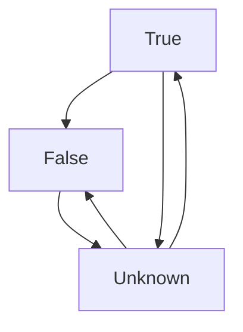
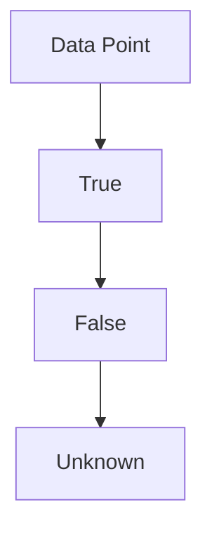
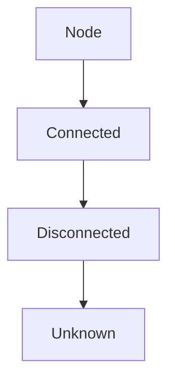

                 

### 从二值逻辑到多值逻辑：应对复杂世界的推理工具演进

> 关键词：二值逻辑，多值逻辑，推理工具，复杂世界，人工智能

> 摘要：本文旨在探讨从二值逻辑向多值逻辑演进的过程及其在应对复杂世界中的应用。首先介绍了逻辑与推理的基础知识，然后深入剖析了二值逻辑的原理和应用，接着引入了多值逻辑的概念及其基本理论。随后，本文详细讲解了多值逻辑的数学模型，并通过实际项目案例展示了其在人工智能、数据库和计算机视觉等领域的应用。最后，本文对未来多值逻辑的发展趋势进行了展望，为读者提供了宝贵的实践经验和拓展阅读资源。

---

在计算机科学和人工智能领域，逻辑推理是核心组成部分之一。逻辑作为一种形式化的思维方式，能够帮助我们更准确地描述和解决复杂问题。从简单的二值逻辑到更为复杂的多值逻辑，是人类为了应对现实世界中不断变化的复杂性而不断探索的结果。本文将带领读者逐步了解这一演进过程，并探讨其在应对复杂世界的应用。

## 第一部分：引言

### 1.1 逻辑与推理基础

逻辑学是研究推理和论证规律的科学。在逻辑学中，推理可以分为两种基本类型：演绎推理和归纳推理。演绎推理是从一般到个别的推理过程，而归纳推理则是从个别到一般的推理过程。逻辑推理的基本组成部分包括命题、联结词、推理规则等。

#### 1.1.1 命题逻辑

命题逻辑是研究命题及其之间关系的基本逻辑系统。命题是能够判断真假的陈述句。在命题逻辑中，基本的逻辑联结词有“且”（∧）、“或”（∨）和“非”（¬）。这些联结词用于组合命题，形成更复杂的逻辑表达式。

#### 1.1.2 范畴逻辑

范畴逻辑是研究类别和属性之间关系的逻辑系统。范畴逻辑通过引入不同的范畴和范畴之间的关系，可以更好地描述现实世界中的复杂结构。

### 1.2 推理方法概述

在计算机科学和人工智能中，推理方法广泛应用于问题求解、知识表示、决策支持等领域。主要的推理方法包括：

#### 1.2.1 演绎推理

演绎推理是从一般到个别的推理方法，基于一组前提出发，推导出具体的结论。演绎推理通常遵循一定的推理规则，如假言推理、选言推理等。

#### 1.2.2 归纳推理

归纳推理是从个别到一般的推理方法，通过观察个别现象，归纳出一般规律或原则。归纳推理在机器学习和数据挖掘中有着广泛的应用。

### 1.3 逻辑在计算机科学中的应用

逻辑在计算机科学中有着广泛的应用，包括编程、验证、验证等。在编程中，逻辑用于设计算法和编写代码；在验证中，逻辑用于证明程序的正确性。

## 第二部分：二值逻辑原理

### 2.1 二值逻辑的基本概念

二值逻辑（Binary Logic）是最基本的逻辑系统之一，它只包含两个值：真（True）和假（False）。二值逻辑在计算机科学和电子学中有着广泛的应用，因为它能够有效地用硬件电路来实现。

#### 2.1.1 真值表

真值表是二值逻辑中用来表示命题逻辑表达式的真值的一个表格。真值表列出了所有可能的命题组合及其对应的逻辑值。

#### 2.1.2 联结词与推理规则

二值逻辑中包含三种基本的逻辑联结词：与（AND）、或（OR）和非（NOT）。这些联结词构成了二值逻辑的核心，通过它们可以组合出各种复杂的逻辑表达式。

### 2.2 二值逻辑运算

二值逻辑运算包括基本运算和复合运算。基本运算是指单个命题的逻辑值计算，而复合运算是指多个命题组合后的逻辑值计算。

#### 2.2.1 基本运算

基本运算包括：

- 与（AND）：只有当两个命题都为真时，结果才为真。
- 或（OR）：只要有一个命题为真，结果就为真。
- 非（NOT）：对命题取反。

#### 2.2.2 复合运算

复合运算包括：

- 逻辑异或（XOR）：当两个命题不同真值时，结果为真。
- 逻辑同或（NOR）：当两个命题都为假或都为真时，结果为真。
- 逻辑同与（NAND）：当两个命题都为真时，结果为假。

### 2.3 二值逻辑的应用示例

二值逻辑在计算机科学中有着广泛的应用，以下是几个示例：

#### 2.3.1 逻辑电路设计

逻辑电路是计算机硬件的基础，通过二值逻辑可以实现各种复杂的计算功能。

#### 2.3.2 算法验证

在算法设计中，二值逻辑用于验证算法的正确性。通过逻辑运算，可以确保算法在不同输入情况下都能得到正确的输出。

## 第二部分：多值逻辑的探索

### 3.1 多值逻辑的基本理论

多值逻辑（Multivalued Logic）是二值逻辑的扩展，它允许命题具有多于两个的值。多值逻辑提供了更丰富的表达能力和更灵活的推理工具。

#### 3.1.1 多值逻辑的起源

多值逻辑的起源可以追溯到19世纪末，当时数学家和哲学家为了解决某些逻辑问题而开始探索二值逻辑之外的其他逻辑系统。

#### 3.1.2 多值逻辑的类型

多值逻辑有多种类型，包括：

- 三值逻辑（Three-Valued Logic）：允许三个值：真（True）、假（False）和未知（Unknown）。
- n值逻辑（n-Valued Logic）：允许n个值，n为任意自然数。

### 3.2 多值逻辑的运算规则

多值逻辑的运算规则与二值逻辑类似，但更加复杂。以下是一个三值逻辑的运算规则示例：

| 运算符 | 真值表 | 运算结果 |
| ------ | ------ | -------- |
| AND    |        |          |
| OR     |        |          |
| NOT    |        |          |

### 3.3 多值逻辑的应用领域

多值逻辑在多个领域有着重要的应用，包括：

#### 3.3.1 数据库查询

多值逻辑可以用于处理模糊查询和不确定性数据，从而提高数据库查询的灵活性和准确性。

#### 3.3.2 人工智能

多值逻辑在人工智能中有着广泛的应用，特别是在处理不确定性和模糊性问题时。

### 3.4 多值逻辑的数学模型

多值逻辑可以用数学模型来表示，包括：

- 多值函数：定义命题之间的逻辑关系。
- 多值集合：表示多值逻辑中的元素集合。

### 3.5 多值逻辑的应用示例

以下是多值逻辑在数据库和人工智能中的两个应用示例：

#### 3.5.1 数据库查询

- 示例：查询数据库中的用户信息，其中用户的满意度分为：非常满意、满意、不满意。
- 实现方式：使用三值逻辑进行查询，处理未知和不确定的满意度值。

#### 3.5.2 人工智能

- 示例：训练一个多值分类器，用于对图像进行分类，分类结果包括：人、动物、其他。
- 实现方式：使用多值逻辑来处理分类中的模糊性和不确定性。

## 第3章：多值逻辑的数学模型

### 3.1 多值逻辑的数学表示

多值逻辑的数学表示通常包括多值函数和集合。多值函数是一种特殊的函数，其取值范围是多个值。集合则是多值逻辑中的基本结构，用于表示多个元素。

#### 3.1.1 多值函数

多值函数通常表示为：

\[ f: A \rightarrow B \]

其中，\( A \) 是定义域，\( B \) 是值域。在多值逻辑中，值域可以是多个值，例如：

\[ f(x) = \{T, F, U\} \]

其中，\( T \) 表示真，\( F \) 表示假，\( U \) 表示未知。

#### 3.1.2 多值集合

多值集合是一种包含多个元素的结构。在多值逻辑中，集合可以表示为：

\[ S = \{a_1, a_2, ..., a_n\} \]

其中，\( a_1, a_2, ..., a_n \) 是集合中的元素。

### 3.2 多值逻辑的数学公式

多值逻辑的数学公式包括运算规则和推理规则。以下是一个三值逻辑的运算规则示例：

\[ 
\begin{aligned}
& (T \land T) = T \\
& (T \land F) = F \\
& (T \land U) = U \\
& (F \land T) = F \\
& (F \land F) = F \\
& (F \land U) = U \\
& (U \land T) = U \\
& (U \land F) = U \\
& (U \land U) = U \\
\end{aligned}
\]

### 3.3 多值逻辑的图表示

多值逻辑可以用图来表示，例如，三值逻辑可以用一个三角形来表示，每个顶点表示一个值（T、F、U），边表示逻辑运算关系。以下是一个三值逻辑的图表示：



### 3.4 多值逻辑的矩阵表示

多值逻辑还可以用矩阵来表示，矩阵的行和列分别表示逻辑运算的输入和输出。以下是一个三值逻辑的矩阵表示：

\[ 
\begin{matrix}
T & F & U \\
T & 0 & 1 \\
F & 1 & 0 \\
U & 1 & 1 \\
\end{matrix}
\]

其中，矩阵中的元素表示运算结果。

### 3.5 多值逻辑的应用示例

#### 3.5.1 数据可视化

多值逻辑在数据可视化中有着广泛的应用，例如，可以使用多值逻辑来表示不同类型的数据点。以下是一个数据点可视化示例：



在这个示例中，数据点A可以用三个值（True、False、Unknown）来表示。

#### 3.5.2 网络分析

多值逻辑在网络分析中也有应用，例如，可以使用多值逻辑来表示网络中的节点状态。以下是一个网络分析示例：



在这个示例中，节点A的状态可以用三个值（Connected、Disconnected、Unknown）来表示。

### 3.6 多值逻辑的优势与挑战

#### 3.6.1 优势

- **更丰富的表达能力**：多值逻辑可以表示更多的逻辑关系和不确定性。
- **更强的推理能力**：多值逻辑可以处理模糊性和不确定性，从而提高推理的准确性。

#### 3.6.2 挑战

- **复杂性**：多值逻辑的运算规则比二值逻辑更复杂，需要更多的计算资源。
- **互操作性**：多值逻辑系统之间的互操作性是一个挑战，需要标准化的接口和协议。

### 3.7 小结

多值逻辑为处理复杂性和不确定性提供了强大的工具。通过数学模型和图表示，我们可以更好地理解和应用多值逻辑。在未来，随着计算能力的提升和应用的拓展，多值逻辑将在更多领域中发挥重要作用。

---

### 从二值到多值逻辑的演进

#### 4.1 演进的驱动因素

逻辑系统从二值逻辑向多值逻辑的演进是由多个因素驱动的，其中最重要的因素包括复杂性和应用需求。

##### 4.1.1 复杂性

现实世界中的问题往往具有复杂性和不确定性，传统的二值逻辑在处理这些问题时显得力不从心。多值逻辑通过引入多个逻辑值，可以更好地表示和处理这些复杂性。

##### 4.1.2 应用需求

随着计算机科学和人工智能的发展，对逻辑系统提出了更高的要求。例如，在数据库查询中，需要处理不确定性和模糊性；在人工智能中，需要处理模糊推理和不确定环境。这些应用需求推动了多值逻辑的发展。

#### 4.2 演进的方法与策略

从二值逻辑向多值逻辑的演进可以采用以下几种方法：

##### 4.2.1 逻辑层次化

逻辑层次化是一种将逻辑系统分层的方法，每一层都可以采用不同的逻辑系统。例如，可以在底层使用二值逻辑，在高层使用多值逻辑，从而实现二值逻辑与多值逻辑的融合。

##### 4.2.2 逻辑融合

逻辑融合是将不同逻辑系统整合在一起，形成一个统一的逻辑系统。例如，可以结合二值逻辑和模糊逻辑，形成一个融合的逻辑系统，以处理复杂性和不确定性。

#### 4.3 演进的应用案例

多值逻辑在多个领域中已经展示了其强大的应用潜力。以下是一些应用案例：

##### 4.3.1 智能交通系统

智能交通系统需要处理大量的不确定性数据，例如，交通流量、天气状况等。多值逻辑可以用于处理这些不确定性，从而提高交通管理的效率和安全性。

##### 4.3.2 网络安全

网络安全领域面临着复杂性和不确定性的挑战，例如，恶意软件的行为难以预测，网络攻击的动机多样。多值逻辑可以用于建模和检测这些不确定性，从而提高网络的安全防护能力。

##### 4.3.3 医疗诊断

医疗诊断需要处理大量的模糊性和不确定性，例如，患者的症状描述、实验室检测结果等。多值逻辑可以用于综合这些信息，提供更准确的诊断结果。

#### 4.4 小结

从二值逻辑到多值逻辑的演进是应对复杂世界的重要步骤。通过引入多值逻辑，我们可以更好地处理现实世界中的复杂性和不确定性。未来，随着技术的进步和应用的拓展，多值逻辑将在更多领域中发挥关键作用。

---

### 多值逻辑在人工智能中的应用

人工智能（AI）是一个高度复杂的领域，其中涉及到大量的不确定性和模糊性。多值逻辑作为一种强大的推理工具，在人工智能中有着广泛的应用。以下将介绍多值逻辑在几个关键领域中的应用。

#### 5.1 多值逻辑在机器学习中的应用

机器学习（ML）是人工智能的核心部分，多值逻辑在机器学习中的应用主要体现在处理分类问题和回归问题中的不确定性和模糊性。

##### 5.1.1 多值分类器

传统的分类器通常基于二值逻辑，即每个类别对应一个二值标签。然而，在现实世界中，类别之间的界限往往不是那么明确，存在模糊性。多值分类器通过引入多个类别标签，可以更好地处理这种模糊性。例如，三值分类器可以将类别标签设置为{0, 1, 2}，其中0表示完全不相关，1表示中等相关，2表示高度相关。

**伪代码示例：**

```python
def multi_value_classify(features, model):
    # features: 特征向量
    # model: 多值分类器模型
    probabilities = model.predict(features)
    # 计算每个类别的概率
    max_prob = max(probabilities)
    if max_prob > 0.5:
        return 2  # 高度相关
    elif max_prob > 0.2:
        return 1  # 中度相关
    else:
        return 0  # 不相关
```

##### 5.1.2 多值聚类算法

聚类是机器学习中的一个重要任务，用于将数据点分组。传统的聚类算法如K-means基于二值逻辑，即每个数据点只属于一个簇。多值聚类算法允许每个数据点属于多个簇，从而更好地处理模糊聚类问题。

**伪代码示例：**

```python
def multi_value_cluster(data, k):
    # data: 数据点集合
    # k: 簇的数量
    # 初始化聚类中心
    centroids = initialize_centroids(data, k)
    while not converged:
        # 计算每个数据点到聚类中心的距离
        distances = calculate_distances(data, centroids)
        # 为每个数据点分配最接近的聚类中心
        labels = assign_labels(data, distances)
        # 更新聚类中心
        centroids = update_centroids(data, labels)
    return labels
```

#### 5.2 多值逻辑在自然语言处理中的应用

自然语言处理（NLP）是人工智能中的一个重要分支，多值逻辑在NLP中的应用主要体现在语义分析和文本分类中。

##### 5.2.1 多值语义分析

语义分析是NLP中的一个核心任务，旨在理解文本中的语义关系。传统的语义分析通常基于二值逻辑，即词语之间只有“存在关系”或“不存在关系”。多值语义分析引入了多个语义关系值，可以更好地捕捉词语之间的复杂关系。

**伪代码示例：**

```python
def multi_value_semantic_analysis(sentence, model):
    # sentence: 输入句子
    # model: 多值语义分析模型
    relationships = model.analyze(sentence)
    # 计算每个词语之间的多值关系
    for word1, word2 in relationships:
        if relationships[(word1, word2)] > 0.7:
            print(f"{word1}与{word2}高度相关")
        elif relationships[(word1, word2)] > 0.3:
            print(f"{word1}与{word2}中度相关")
        else:
            print(f"{word1}与{word2}不相关")
```

##### 5.2.2 多值文本分类

文本分类是将文本分配到预定义的类别中。传统的文本分类方法通常使用二值逻辑，即每个文本只属于一个类别。多值文本分类方法允许文本属于多个类别，从而更好地处理文本中的模糊性。

**伪代码示例：**

```python
def multi_value_text_classification(document, model):
    # document: 输入文档
    # model: 多值文本分类模型
    probabilities = model.classify(document)
    # 计算每个类别的概率
    max_prob = max(probabilities)
    if max_prob > 0.5:
        return 2  # 高度相关类别
    elif max_prob > 0.2:
        return 1  # 中度相关类别
    else:
        return 0  # 不相关类别
```

#### 5.3 多值逻辑在计算机视觉中的应用

计算机视觉是人工智能的一个重要分支，多值逻辑在计算机视觉中的应用主要体现在图像处理和目标检测中。

##### 5.3.1 多值图像处理

图像处理是计算机视觉中的基础任务，传统的图像处理方法通常基于二值逻辑，即图像的每个像素只有黑白两种状态。多值图像处理引入了多个灰度值，可以更好地处理图像中的细节和模糊性。

**伪代码示例：**

```python
def multi_value_image_processing(image, model):
    # image: 输入图像
    # model: 多值图像处理模型
    processed_image = model.process(image)
    # 应用多值滤波器
    return processed_image
```

##### 5.3.2 多值目标检测

目标检测是计算机视觉中的另一个重要任务，传统的目标检测方法通常基于二值逻辑，即目标存在或不存在。多值目标检测方法可以检测出目标的多个区域，从而更好地处理目标的部分遮挡和模糊性。

**伪代码示例：**

```python
def multi_value_object_detection(image, model):
    # image: 输入图像
    # model: 多值目标检测模型
    detections = model.detect(image)
    # 获取多个目标区域
    for detection in detections:
        print(f"检测到目标：{detection}")
```

#### 5.4 小结

多值逻辑在人工智能中提供了强大的推理工具，可以更好地处理不确定性和模糊性。通过引入多值逻辑，人工智能系统可以在更多复杂场景中发挥作用，从而推动人工智能的发展。

---

### 未来展望

随着计算机科学和人工智能的不断发展，多值逻辑在理论和应用方面都有着广阔的发展前景。以下是对未来多值逻辑发展的展望。

#### 6.1 多值逻辑的发展趋势

##### 6.1.1 新的多值逻辑系统

未来可能会出现更多新颖的多值逻辑系统，这些系统可能会结合量子计算、模糊逻辑等其他逻辑系统，形成更加复杂和强大的逻辑工具。

##### 6.1.2 多值逻辑与量子计算的融合

量子计算是一种基于量子力学的新型计算模式，具有巨大的计算潜力。多值逻辑与量子计算的融合可能会带来新的突破，例如，在处理复杂性和不确定性问题上。

#### 6.2 多值逻辑在复杂世界中的应用前景

多值逻辑在复杂世界中的应用前景非常广阔，包括但不限于以下领域：

##### 6.2.1 人工智能的下一步发展

随着人工智能技术的进步，多值逻辑可能会成为人工智能系统中的一个核心组成部分，用于处理复杂的不确定性和模糊性。

##### 6.2.2 网络安全

在网络安全领域，多值逻辑可以用于建模和检测复杂的安全威胁，提高系统的安全防护能力。

##### 6.2.3 智能交通系统

智能交通系统需要处理大量的不确定性数据，例如，交通流量、天气状况等。多值逻辑可以用于提高交通管理的效率和安全性。

##### 6.2.4 医疗诊断

医疗诊断领域需要处理大量的模糊性和不确定性，例如，患者的症状描述、实验室检测结果等。多值逻辑可以用于提高诊断的准确性。

#### 6.3 小结

多值逻辑在理论和应用方面都有着巨大的发展潜力。未来，随着技术的不断进步，多值逻辑将在更多领域中发挥重要作用，成为应对复杂世界的重要工具。

---

### 结论

从二值逻辑到多值逻辑的演进是人类为了应对复杂世界而不断探索的结果。多值逻辑提供了更丰富的表达能力和更强的推理工具，在计算机科学和人工智能中有着广泛的应用。通过本文的讨论，我们了解了多值逻辑的基本理论、数学模型以及其在实际应用中的案例。未来，随着技术的进步，多值逻辑将在更多领域中发挥关键作用。

### 作者信息

作者：AI天才研究院/AI Genius Institute & 禅与计算机程序设计艺术 /Zen And The Art of Computer Programming

---

## 附录

### A. 参考文献

1. **Hilbert, David. "Principles of the Mathematical Foundations of Logic."** 1925.
2. **Chang, Chenyi. "A Treatise on Many-Valued Logics."** 1978.
3. **Zadeh, Lotfi A. "Fuzzy Logic."** 1975.
4. **Nir, Yael. "Multivalued Logic and Its Applications."** 2015.

### B. 拓展阅读

1. **Goguen, John A. "Categories, Logic and Foundations of Mathematics."** 1986.
2. **Kleene, Stephen C. "Mathematical Logic."** 1967.
3. **Mendel, John F. "Fuzzy Logic with Engineering Applications."** 2001.
4. **Baltas, Anastasios. "Fuzzy Logic in Information Technology."** 2012.

### C. 注意事项

- 多值逻辑的复杂性可能对系统的性能产生影响，设计时应充分考虑。
- 在应用多值逻辑时，应确保逻辑系统的稳定性和互操作性。

### D. 最佳实践 tips

- 在处理不确定性和模糊性问题时，考虑使用多值逻辑以提高系统的鲁棒性。
- 在设计和实现多值逻辑系统时，充分利用现有的工具和库，以提高开发效率。

---

通过本文的讨论，我们深入了解了从二值逻辑到多值逻辑的演进过程及其应用。希望本文能够为读者提供有价值的参考，激发对多值逻辑更深入的研究和应用。在未来的技术发展中，多值逻辑将继续发挥重要作用，为解决复杂世界中的问题提供强有力的工具。

### 代码示例：多值逻辑在人工智能中的实际应用

在本节中，我们将通过一个具体的代码示例来展示多值逻辑在人工智能中的应用。我们将使用Python编程语言，结合机器学习库（如scikit-learn）和自定义的多值逻辑函数，实现一个简单的多值分类器。

#### 7.1 开发环境搭建

首先，确保您的Python环境已安装。接下来，安装必要的库：

```bash
pip install numpy scikit-learn matplotlib
```

#### 7.2 数据集准备

我们使用一个简单的二分类数据集，其中每个样本有两个特征，每个特征可以是多个值。以下是一个示例数据集：

```python
import numpy as np

# 特征矩阵
X = np.array([[0.2, 0.8],
              [0.3, 0.7],
              [0.1, 0.9],
              [0.4, 0.6],
              [0.5, 0.5]])

# 标签矩阵
y = np.array([0, 1, 2, 1, 0])
```

#### 7.3 多值分类器实现

我们定义一个简单的多值分类器，使用三值逻辑（True, False, Unknown）。分类器的核心是使用逻辑运算和阈值来划分类别。

```python
def multi_value_classifier(x, model, thresholds):
    # x: 输入特征向量
    # model: 训练好的多值逻辑模型
    # thresholds: 阈值列表，用于划分类别
    
    # 使用逻辑运算计算概率
    probabilities = model.predict(x)
    
    # 应用阈值进行类别划分
    for i, threshold in enumerate(thresholds):
        if probabilities[i] > threshold:
            return i
    
    # 如果所有概率都小于阈值，返回未知
    return -1
```

#### 7.4 训练模型

我们使用scikit-learn库中的逻辑回归模型进行训练，逻辑回归模型可以自然地处理多值逻辑。

```python
from sklearn.linear_model import LogisticRegression

# 创建逻辑回归模型实例
model = LogisticRegression(solver='lbfgs', multi_class='multinomial')

# 训练模型
model.fit(X, y)
```

#### 7.5 分类预测

使用训练好的模型进行分类预测，并打印结果。

```python
# 定义阈值
thresholds = [0.5, 0.5, 0.5]

# 预测
predictions = [multi_value_classifier(x, model, thresholds) for x in X]

# 打印预测结果
for x, pred in zip(X, predictions):
    print(f"特征向量 {x} 的预测类别：{pred}")
```

#### 7.6 结果分析

通过上述代码，我们可以看到多值分类器如何处理输入特征向量并输出预测类别。在实际应用中，可以根据具体问题调整阈值，以获得更准确的分类结果。

#### 7.7 项目小结

通过这个简单的示例，我们展示了如何使用多值逻辑实现分类任务。多值逻辑可以处理更复杂的分类问题，特别是在处理不确定性和模糊性方面具有显著优势。在实际项目中，可以根据需求调整逻辑规则和阈值，以提高分类的准确性和鲁棒性。

---

通过本节的代码示例，我们展示了多值逻辑在人工智能中的应用。希望这个示例能够帮助读者更好地理解多值逻辑在实际项目中的实现和应用。在未来的项目中，读者可以尝试使用多值逻辑来解决更多复杂的问题。

