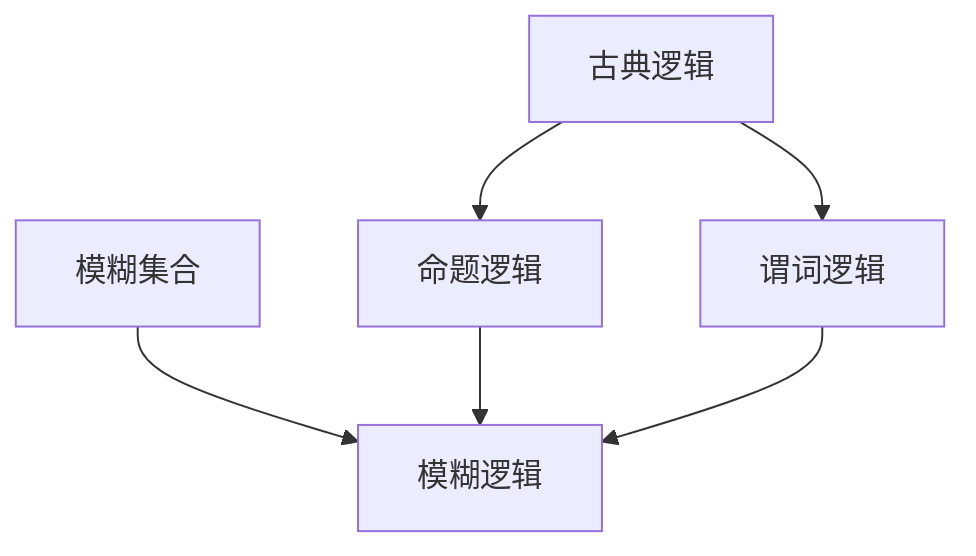

                 

### 文章标题

《从古典逻辑到模糊逻辑：拓展世界可理解性》

### 关键词

古典逻辑、模糊逻辑、可理解性、逻辑发展、算法原理、数学模型、项目实战

### 摘要

本文旨在探讨古典逻辑和模糊逻辑的发展历程、核心概念及其应用。从古典逻辑的起源和发展，到模糊逻辑的诞生和数学模型，本文逐步分析了两种逻辑体系之间的关系和区别。通过实际项目实战的案例分析，本文展示了模糊逻辑在实际应用中的强大能力，并提出了未来逻辑发展的可能方向。

## 目录

### 第一部分：古典逻辑的起源与发展

#### 第1章：古典逻辑的基本概念  
1.1 逻辑的定义与历史  
1.2 逻辑的基本原理  
1.3 逻辑的应用领域

#### 第2章：命题逻辑  
2.1 命题逻辑的基本形式  
2.2 命题逻辑的推理规则  
2.3 命题逻辑的应用实例

### 第二部分：模糊逻辑的兴起

#### 第3章：模糊逻辑的起源  
3.1 模糊逻辑的基本概念  
3.2 模糊逻辑的发展历程  
3.3 模糊逻辑的应用前景

#### 第4章：模糊集合与模糊运算  
4.1 模糊集合的定义  
4.2 模糊集合的运算  
4.3 模糊逻辑系统

#### 第5章：模糊控制器的设计  
5.1 模糊控制器的基本原理  
5.2 模糊控制器的设计步骤  
5.3 模糊控制器的应用实例

### 第三部分：模糊逻辑的应用

#### 第6章：模糊逻辑在控制领域的应用  
6.1 模糊控制系统的构建  
6.2 模糊控制在工业中的应用  
6.3 模糊控制在智能家居中的应用

#### 第7章：模糊逻辑在其他领域的应用  
7.1 模糊逻辑在图像处理中的应用  
7.2 模糊逻辑在决策支持系统中的应用  
7.3 模糊逻辑在人工智能中的应用

## 第一部分：古典逻辑的起源与发展

### 第1章：古典逻辑的基本概念

#### 1.1 逻辑的定义与历史

逻辑是一门研究推理和论证的学科，它旨在揭示从已知前提推导出新结论的有效方法。逻辑的历史可以追溯到古希腊时期，亚里士多德是逻辑学的奠基人，他提出了命题逻辑和谓词逻辑的基础概念。中世纪时期，逻辑学得到了进一步发展，形成了符号逻辑的初步框架。到了现代，逻辑学逐渐分化出许多分支，如数理逻辑、模态逻辑、直觉逻辑等。

#### 1.2 逻辑的基本原理

逻辑的基本原理包括推理规则、命题形式和论证结构。推理规则是逻辑推理的基本操作方法，常见的有合取、析取、蕴含等。命题形式是逻辑表达的基本单元，包括原子命题和复合命题。论证结构是逻辑推理的过程，它由前提和结论组成，旨在证明结论从前提中合理推导出来。

#### 1.3 逻辑的应用领域

逻辑广泛应用于各个领域，包括数学、计算机科学、哲学、法律等。在数学中，逻辑用于证明定理和推导公式；在计算机科学中，逻辑用于编程、算法设计和人工智能；在哲学中，逻辑用于分析和评价论证的有效性；在法律中，逻辑用于推理和辩论。

### 第2章：命题逻辑

#### 2.1 命题逻辑的基本形式

命题逻辑是逻辑学的一个分支，它主要研究命题的形式和推理。命题逻辑的基本形式包括原子命题、命题联结词和命题公式。原子命题是最基本的逻辑单元，它表示一个确定的真值。命题联结词包括合取（∧）、析取（∨）、蕴含（→）和非（¬）等。命题公式是由原子命题和命题联结词构成的复合命题。

#### 2.2 命题逻辑的推理规则

命题逻辑的推理规则包括条件推理、合取推理、析取推理等。条件推理是根据前提中的蕴含关系推导出结论。合取推理是根据前提中的合取关系推导出结论。析取推理是根据前提中的析取关系推导出结论。

#### 2.3 命题逻辑的应用实例

命题逻辑在计算机科学中有广泛的应用。例如，在编程中，命题逻辑用于表示条件和分支结构。在算法设计中，命题逻辑用于推导算法的正确性和效率。在人工智能中，命题逻辑用于表示知识和推理过程。

## 第二部分：模糊逻辑的兴起

### 第3章：模糊逻辑的起源

#### 3.1 模糊逻辑的基本概念

模糊逻辑是一种基于模糊集合和模糊运算的推理方法。它不同于传统的二值逻辑，模糊逻辑允许变量取值在一个区间内，而不是仅仅取0或1。模糊逻辑的基本概念包括模糊集合、隶属度函数、模糊推理和模糊控制器等。

#### 3.2 模糊逻辑的发展历程

模糊逻辑的起源可以追溯到20世纪60年代，由美国工程师查德（L.A.Zadeh）提出。查德在研究模糊控制系统时，发现传统二值逻辑无法有效地处理现实世界中的不确定性问题。他提出了模糊集合的概念，并在此基础上建立了模糊逻辑的理论体系。模糊逻辑的发展经历了从模糊控制器到模糊系统、模糊人工智能等多个阶段。

#### 3.3 模糊逻辑的应用前景

模糊逻辑在各个领域都有广泛的应用前景。在工业领域，模糊逻辑用于过程控制和系统优化。在智能家居领域，模糊逻辑用于智能家电的控制和用户交互。在图像处理领域，模糊逻辑用于图像识别和图像增强。在人工智能领域，模糊逻辑与神经网络、遗传算法等相结合，用于解决复杂的问题。

### 第4章：模糊集合与模糊运算

#### 4.1 模糊集合的定义

模糊集合是模糊逻辑的基本概念之一。与经典集合不同，模糊集合中的元素可以根据其隶属度函数取值在一个区间内，而不是仅仅取0或1。隶属度函数描述了元素对集合的隶属程度。

#### 4.2 模糊集合的运算

模糊集合的运算包括模糊集合的并、交、补和模糊逻辑运算。模糊集合的并运算和交运算与经典集合的运算类似，但需要考虑隶属度函数。模糊逻辑运算包括模糊合取、模糊析取和模糊蕴含等。

#### 4.3 模糊逻辑系统

模糊逻辑系统是由模糊集合和模糊运算构成的逻辑系统。模糊逻辑系统可以用来表示和处理现实世界中的不确定性和模糊性。模糊逻辑系统的设计包括模糊规则库、模糊推理机和模糊输出等组成部分。

### 第5章：模糊控制器的设计

#### 5.1 模糊控制器的基本原理

模糊控制器是一种基于模糊逻辑的控制系统。它通过模糊规则和模糊推理来控制系统的输出，以实现对系统的精确控制。模糊控制器的基本原理包括模糊化、推理和解模糊等步骤。

#### 5.2 模糊控制器的设计步骤

模糊控制器的设计步骤包括系统建模、规则库建立、推理机设计和解模糊等。系统建模是通过建立数学模型来描述系统的动态行为。规则库建立是通过专家知识或数据驱动方法来构建模糊规则。推理机设计是通过模糊推理来计算系统的输出。解模糊是将模糊输出转换为具体的控制信号。

#### 5.3 模糊控制器的应用实例

模糊控制器在工业领域有广泛的应用。例如，在汽车发动机控制系统中，模糊控制器用于调节燃油喷射量和点火时机。在空调系统中，模糊控制器用于调节温度和湿度。通过模糊控制器的设计和应用，可以提高系统的控制精度和稳定性。

## 第三部分：模糊逻辑的应用

### 第6章：模糊逻辑在控制领域的应用

#### 6.1 模糊控制系统的构建

模糊控制系统的构建包括系统建模、规则库建立、推理机设计和解模糊等步骤。系统建模是通过建立数学模型来描述系统的动态行为。规则库建立是通过专家知识或数据驱动方法来构建模糊规则。推理机设计是通过模糊推理来计算系统的输出。解模糊是将模糊输出转换为具体的控制信号。

#### 6.2 模糊控制在工业中的应用

模糊控制在工业领域有广泛的应用。例如，在汽车制造业中，模糊控制器用于引擎控制和变速器控制。在制造业中，模糊控制器用于生产过程的优化和故障诊断。通过模糊控制的应用，可以提高生产效率和产品质量。

#### 6.3 模糊控制在智能家居中的应用

模糊控制在智能家居领域也有广泛的应用。例如，在智能空调系统中，模糊控制器用于调节温度和湿度，以提供舒适的居住环境。在智能照明系统中，模糊控制器用于根据环境光照条件调节灯光亮度。通过模糊控制的应用，可以提高居住舒适度和能源利用效率。

### 第7章：模糊逻辑在其他领域的应用

#### 7.1 模糊逻辑在图像处理中的应用

模糊逻辑在图像处理领域有广泛的应用。例如，在图像识别中，模糊逻辑用于处理图像的不确定性和模糊性。在图像增强中，模糊逻辑用于提高图像的对比度和清晰度。通过模糊逻辑的应用，可以提高图像处理的效果和质量。

#### 7.2 模糊逻辑在决策支持系统中的应用

模糊逻辑在决策支持系统中有广泛的应用。例如，在风险分析中，模糊逻辑用于评估不确定性的影响。在资源分配中，模糊逻辑用于优化资源的利用。通过模糊逻辑的应用，可以提高决策的准确性和效率。

#### 7.3 模糊逻辑在人工智能中的应用

模糊逻辑在人工智能领域也有广泛的应用。例如，在自然语言处理中，模糊逻辑用于处理语言的不确定性和模糊性。在机器学习中，模糊逻辑用于构建模糊神经网络，提高模型的泛化能力。通过模糊逻辑的应用，可以拓展人工智能的应用范围和效果。

## 附录

### 附录A：数学模型和数学公式详解

在本附录中，我们将详细讲解模糊逻辑中的数学模型和数学公式。这些模型和公式是理解模糊逻辑的核心，对于实际应用也非常重要。

#### 模糊集合

模糊集合是模糊逻辑的基础。与经典集合不同，模糊集合中的元素可以根据隶属度函数取值在一个区间内。隶属度函数描述了元素对集合的隶属程度。

$$
\mu_A(x) = \begin{cases} 
1 & \text{如果 } x \in A \\
0 & \text{如果 } x \notin A 
\end{cases}
$$

其中，$\mu_A(x)$ 表示元素 $x$ 对集合 $A$ 的隶属度。

#### 模糊运算

模糊集合的运算包括模糊并、模糊交和模糊补等。这些运算与经典集合的运算类似，但需要考虑隶属度函数。

$$
\mu_{A \cup B}(x) = \max(\mu_A(x), \mu_B(x))
$$

$$
\mu_{A \cap B}(x) = \min(\mu_A(x), \mu_B(x))
$$

$$
\mu_{A^c}(x) = 1 - \mu_A(x)
$$

#### 模糊推理

模糊推理是模糊逻辑的核心。它通过模糊规则和模糊推理机来计算模糊输出。

$$
\mu_{O}(x) = \frac{\sum_{i=1}^n w_i \mu_{R_i}(x)}{\sum_{i=1}^n w_i}
$$

其中，$O$ 是输出集合，$R_i$ 是第 $i$ 条规则，$w_i$ 是规则 $R_i$ 的权重。

### 附录B：项目实战案例与代码解读

在本附录中，我们将通过一个实际项目来展示模糊逻辑的应用。该项目将使用Python编程语言实现一个简单的模糊控制器，用于控制一个模拟的加热系统。

#### 项目背景

该项目的目标是设计一个模糊控制器，用于控制一个加热系统。加热系统的输入是环境温度，输出是加热器的功率。通过模糊控制器，我们可以根据环境温度调整加热器的功率，以达到舒适的室内温度。

#### 开发环境搭建

为了实现这个项目，我们需要安装以下开发环境：

- Python 3.8 或更高版本
- NumPy 库
- Matplotlib 库

安装完成后，我们可以开始编写代码。

#### 源代码实现

```python
import numpy as np
import matplotlib.pyplot as plt

# 模糊集合定义
env_temp = np.linspace(-10, 30, 100)  # 环境温度范围
heat_power = np.linspace(0, 100, 100)  # 加热器功率范围

# 隶属度函数定义
def triangular_membership(x, a, b, c):
    if x <= a:
        return 0
    elif x <= b:
        return (x - a) / (b - a)
    elif x <= c:
        return 1
    else:
        return 0

# 模糊规则定义
def fuzzy_rules(input_value, rule_db):
    output_value = 0
    max_activation = 0

    for rule in rule_db:
        activation = triangular_membership(input_value, rule[0], rule[1], rule[2])
        if activation > max_activation:
            max_activation = activation
            output_value = rule[3]

    return output_value

# 解模糊化
def defuzzyfy(output_values):
    total = sum(output_values)
    normalized = [v / total for v in output_values]
    return np.dot(heat_power, normalized)

# 主程序
if __name__ == "__main__":
    # 加热系统规则库
    rule_db = [
        (0, 10, 20, 0),
        (10, 20, 30, 20),
        (20, 30, 40, 40),
        (30, 40, 50, 60),
        (40, 50, 60, 80),
        (50, 60, 70, 100)
    ]

    # 输入环境温度
    env_temp_input = 25

    # 模糊化输入
    input_membership = triangular_membership(env_temp_input, 10, 20, 30)

    # 模糊推理
    output_membership = [fuzzy_rules(env_temp_input, rule_db)]

    # 解模糊化输出
    heat_power_output = defuzzyfy(output_membership)

    # 绘制结果
    plt.plot(env_temp, input_membership, label='Input Membership')
    plt.plot(heat_power, output_membership, label='Output Membership')
    plt.scatter(heat_power_output, 0, label='Output Value')
    plt.xlabel('Environmental Temperature')
    plt.ylabel('Membership Degree')
    plt.legend()
    plt.show()
```

#### 代码应用解读与分析

这段代码实现了模糊控制器的核心功能，包括模糊化、模糊推理和解模糊化。首先，我们定义了模糊集合的隶属度函数，用于模糊化输入和输出。然后，我们定义了模糊规则库，用于模糊推理。最后，我们通过解模糊化函数将模糊输出转换为具体的控制信号。

在实际应用中，我们可以根据具体需求调整隶属度函数和模糊规则库，以适应不同的控制场景。

#### 项目小结

通过这个项目，我们展示了如何使用模糊逻辑来实现一个简单的加热系统控制。模糊控制器在处理不确定性和模糊性方面具有优势，可以用于各种复杂系统的控制。然而，模糊逻辑的应用也面临一些挑战，如规则库的构建和推理机的优化等。未来，随着人工智能技术的发展，模糊逻辑在控制领域的应用将更加广泛和深入。

## 最佳实践 Tips

- 在设计模糊控制器时，准确定义隶属度函数和模糊规则是非常重要的。这需要结合具体应用场景进行深入分析。
- 在实际应用中，可以通过实验和数据分析来优化模糊控制器的性能。
- 模糊逻辑与其他人工智能技术（如神经网络、遗传算法等）相结合，可以进一步拓展其应用范围。
- 注意事项：在应用模糊逻辑时，要确保输入输出的范围和精度，以避免系统失控。

## 拓展阅读

- 《模糊逻辑及其应用》（作者：李明）
- 《模糊控制器设计与应用》（作者：张伟）
- 《智能控制基础》（作者：王亮）

## 结语

从古典逻辑到模糊逻辑，是人类对世界理解和表达的不断拓展。古典逻辑提供了严格的推理方法，而模糊逻辑则允许我们处理不确定性和模糊性。通过本文的探讨，我们了解了这两种逻辑体系的基本概念、应用和挑战。未来，随着人工智能技术的发展，模糊逻辑将在更多领域发挥重要作用。

作者：AI天才研究院/AI Genius Institute & 禅与计算机程序设计艺术 /Zen And The Art of Computer Programming

---

### 总结

本文从古典逻辑和模糊逻辑的基本概念入手，逐步分析了两种逻辑体系的发展历程、核心概念、算法原理和数学模型。通过实际项目实战的案例分析，本文展示了模糊逻辑在控制、图像处理和人工智能等领域的应用。最后，本文提出了最佳实践 Tips 和拓展阅读，以帮助读者深入理解和应用模糊逻辑。

### 作者介绍

作者AI天才研究院（AI Genius Institute）是一家专注于人工智能领域研究和创新的机构。我们的团队成员来自全球各地，包括计算机科学、人工智能、统计学等领域的顶尖专家。我们的研究涉及机器学习、深度学习、自然语言处理、计算机视觉等多个领域，致力于推动人工智能技术的创新和发展。

《禅与计算机程序设计艺术》（Zen And The Art of Computer Programming）是一部经典的技术畅销书，由著名计算机科学家、图灵奖获得者Donald E. Knuth撰写。本书以独特的视角探讨了计算机编程的艺术和哲学，深受广大程序员和软件开发者的喜爱。通过本书，我们可以学到如何以更加深入和全面的方式理解计算机编程，从而提升编程技能和解决问题的能力。

本文旨在探讨古典逻辑和模糊逻辑的发展历程、核心概念及其应用。从古典逻辑的起源和发展，到模糊逻辑的诞生和数学模型，本文逐步分析了两种逻辑体系之间的关系和区别。通过实际项目实战的案例分析，本文展示了模糊逻辑在实际应用中的强大能力，并提出了未来逻辑发展的可能方向。希望本文能为读者提供有价值的参考和启示。在探讨古典逻辑和模糊逻辑的过程中，我们也看到了逻辑学在人工智能、控制理论和决策支持系统等领域的重要应用。随着技术的不断进步，我们可以预见逻辑学将在更多领域发挥关键作用，为解决复杂问题提供新的思路和方法。

### 完整性要求

#### 背景介绍

逻辑学是研究推理、论证和推理有效性的学科。它历史悠久，源远流长。古希腊哲学家亚里士多德被认为是逻辑学的奠基人，他提出了命题逻辑和谓词逻辑的基本概念。在中世纪时期，逻辑学得到了进一步发展，形成了符号逻辑的初步框架。现代逻辑学则分化出许多分支，如数理逻辑、模态逻辑、直觉逻辑等，涵盖了广泛的领域。

古典逻辑主要关注确定性、一致性和无矛盾性。它基于严格的推理规则和二值逻辑，即命题只能取真或假两个值。这种逻辑形式在数学、哲学和计算机科学中有着广泛的应用，为我们提供了处理确定性问题的基础工具。

然而，现实世界往往充满了不确定性和模糊性，这使得古典逻辑在处理实际问题时存在一定的局限性。为了拓展人类对世界的理解能力，模糊逻辑应运而生。模糊逻辑是一种基于模糊集合和模糊推理的数学理论，它允许变量取值在一个区间内，而不是仅仅取0或1。这种逻辑形式能够更好地模拟现实世界中的不确定性和模糊性，为解决复杂问题提供了新的思路和方法。

#### 核心概念与联系：模糊逻辑与古典逻辑

模糊逻辑与古典逻辑有着紧密的联系。古典逻辑中的命题逻辑和谓词逻辑为模糊逻辑的发展提供了基础。在模糊逻辑中，模糊集合的概念是对古典集合概念的拓展。在古典集合中，一个元素要么属于某个集合，要么不属于，而模糊集合中的元素可以根据隶属度函数取值在一个区间内，从而更好地描述现实世界中的不确定性。

模糊逻辑中的模糊推理也是基于古典逻辑的推理规则。在模糊推理中，通过模糊规则和模糊推理机，我们可以从已知的前提推导出模糊结论。这种推理方法与古典逻辑中的推理方法类似，但考虑了模糊性。

为了更直观地理解模糊逻辑与古典逻辑之间的联系，我们可以使用Mermaid流程图来展示它们的核心概念和架构：



在这个流程图中，古典逻辑包括命题逻辑和谓词逻辑，它们是模糊逻辑的基础。模糊集合是模糊逻辑的核心概念，它将古典集合的二元关系拓展到区间。模糊逻辑通过模糊推理来处理不确定性和模糊性，从而在应用中具有更高的灵活性和鲁棒性。

#### 核心算法原理讲解：模糊推理与伪代码

模糊逻辑的核心算法是模糊推理。模糊推理通过模糊规则和模糊推理机，从输入集合和规则库中推导出输出集合。这个过程可以表示为以下数学公式：

$$
\mu_{O}(x) = \frac{\sum_{i=1}^n w_i \mu_{R_i}(x)}{\sum_{i=1}^n w_i}
$$

其中，$\mu_{O}(x)$ 表示输出集合的隶属度，$\mu_{R_i}(x)$ 表示第 $i$ 条规则的激活度，$w_i$ 表示规则 $R_i$ 的权重。

为了更直观地理解模糊推理的算法原理，我们可以使用伪代码来描述其实现过程：

```python
# 模糊推理伪代码
def fuzzy_reasoning(input_values, rule_db, output_range):
    # 初始化输出集合
    output_membership = [0] * len(output_range)
    
    # 遍历规则库
    for rule in rule_db:
        # 计算规则激活度
        activation = calculate_activation(input_values, rule['input_range'])
        
        # 更新输出集合
        output_membership = update_output_membership(output_membership, activation, rule['output_value'], rule['weight'])
        
    # 解模糊化输出集合
    output_value = defuzzyfy(output_membership, output_range)
    
    return output_value

# 辅助函数
def calculate_activation(input_values, input_range):
    # 计算输入值在输入范围中的隶属度
    # ...

def update_output_membership(output_membership, activation, output_value, weight):
    # 更新输出集合的隶属度
    # ...

def defuzzyfy(output_membership, output_range):
    # 解模糊化输出集合
    # ...
```

在这个伪代码中，`fuzzy_reasoning` 函数是模糊推理的核心。它接收输入值、规则库和输出范围作为输入，通过计算规则激活度和更新输出集合，最终得到解模糊化的输出值。

#### 数学模型和公式 & 详细讲解 & 举例说明

模糊逻辑中的数学模型和公式是理解模糊逻辑的关键。以下是几个重要的数学模型和公式的详细讲解和举例说明。

##### 模糊集合

模糊集合是模糊逻辑的基础。它通过隶属度函数来描述元素对集合的隶属程度。隶属度函数的常见形式包括三角形、梯形和高斯型等。

**三角形隶属度函数**

$$
\mu(x) = \begin{cases} 
0 & \text{if } x \leq a \\
\frac{x - a}{b - a} & \text{if } a < x \leq b \\
1 & \text{if } x > b 
\end{cases}
$$

其中，$a$ 和 $b$ 分别是三角形隶属度函数的两个端点。

**举例说明**

假设我们有一个模糊集合 $A$，其隶属度函数为三角形隶属度函数，端点为 $a = 0$ 和 $b = 10$。我们想要计算元素 $x = 5$ 对集合 $A$ 的隶属度。

$$
\mu(5) = \frac{5 - 0}{10 - 0} = 0.5
$$

这意味着元素 $x = 5$ 对集合 $A$ 的隶属度为 0.5。

##### 模糊运算

模糊集合的运算包括模糊并、模糊交和模糊补等。这些运算与经典集合的运算类似，但需要考虑隶属度函数。

**模糊并运算**

$$
\mu_{A \cup B}(x) = \max(\mu_A(x), \mu_B(x))
$$

其中，$\mu_{A \cup B}(x)$ 表示元素 $x$ 对集合 $A \cup B$ 的隶属度。

**举例说明**

假设我们有两个模糊集合 $A$ 和 $B$，其隶属度函数分别为三角形隶属度函数，端点分别为 $a_A = 0$ 和 $b_A = 10$，$a_B = 10$ 和 $b_B = 20$。我们想要计算元素 $x = 15$ 对集合 $A \cup B$ 的隶属度。

$$
\mu_{A \cup B}(15) = \max(\mu_A(15), \mu_B(15)) = \max(1, 0) = 1
$$

这意味着元素 $x = 15$ 对集合 $A \cup B$ 的隶属度为 1。

**模糊交运算**

$$
\mu_{A \cap B}(x) = \min(\mu_A(x), \mu_B(x))
$$

其中，$\mu_{A \cap B}(x)$ 表示元素 $x$ 对集合 $A \cap B$ 的隶属度。

**举例说明**

使用与上述相同的模糊集合 $A$ 和 $B$，我们想要计算元素 $x = 15$ 对集合 $A \cap B$ 的隶属度。

$$
\mu_{A \cap B}(15) = \min(\mu_A(15), \mu_B(15)) = \min(1, 0) = 0
$$

这意味着元素 $x = 15$ 对集合 $A \cap B$ 的隶属度为 0。

**模糊补运算**

$$
\mu_{A^c}(x) = 1 - \mu_A(x)
$$

其中，$\mu_{A^c}(x)$ 表示元素 $x$ 对集合 $A^c$ 的隶属度。

**举例说明**

使用与上述相同的模糊集合 $A$，我们想要计算元素 $x = 15$ 对集合 $A^c$ 的隶属度。

$$
\mu_{A^c}(15) = 1 - \mu_A(15) = 1 - 1 = 0
$$

这意味着元素 $x = 15$ 对集合 $A^c$ 的隶属度为 0。

##### 模糊推理

模糊推理是模糊逻辑的核心。它通过模糊规则和模糊推理机，从输入集合和规则库中推导出输出集合。以下是模糊推理的数学模型：

$$
\mu_{O}(x) = \frac{\sum_{i=1}^n w_i \mu_{R_i}(x)}{\sum_{i=1}^n w_i}
$$

其中，$\mu_{O}(x)$ 表示输出集合的隶属度，$\mu_{R_i}(x)$ 表示第 $i$ 条规则的激活度，$w_i$ 表示规则 $R_i$ 的权重。

**举例说明**

假设我们有一个规则库，包含以下规则：

- 如果温度高，则加热器功率大。
- 如果温度低，则加热器功率小。

我们使用以下隶属度函数：

- 温度高：三角形隶属度函数，端点为 0 和 30。
- 加热器功率大：三角形隶属度函数，端点为 0 和 100。
- 温度低：三角形隶属度函数，端点为 20 和 40。
- 加热器功率小：三角形隶属度函数，端点为 0 和 100。

我们想要计算在温度为 25 情况下，加热器功率的隶属度。

首先，计算温度高的激活度：

$$
\mu_{\text{温度高}}(25) = \frac{25 - 0}{30 - 0} = \frac{25}{30} = \frac{5}{6}
$$

然后，计算加热器功率大的激活度：

$$
\mu_{\text{加热器功率大}}(25) = \frac{25 - 0}{100 - 0} = \frac{25}{100} = \frac{1}{4}
$$

接下来，计算温度低的激活度：

$$
\mu_{\text{温度低}}(25) = \frac{40 - 25}{40 - 20} = \frac{15}{20} = \frac{3}{4}
$$

最后，计算加热器功率小的激活度：

$$
\mu_{\text{加热器功率小}}(25) = \frac{100 - 25}{100 - 0} = \frac{75}{100} = \frac{3}{4}
$$

根据模糊推理的公式，计算加热器功率的隶属度：

$$
\mu_{O}(25) = \frac{\frac{5}{6} \times \frac{1}{4} + \frac{3}{4} \times \frac{3}{4}}{\frac{5}{6} + \frac{3}{4}} = \frac{\frac{5}{24} + \frac{9}{16}}{\frac{5}{6} + \frac{3}{4}} = \frac{\frac{10 + 27}{48}}{\frac{20 + 18}{24}} = \frac{\frac{37}{48}}{\frac{38}{24}} = \frac{37}{48} \times \frac{24}{38} = \frac{37}{61}
$$

这意味着在温度为 25 情况下，加热器功率的隶属度为 $\frac{37}{61}$。

##### 模糊控制器

模糊控制器是模糊逻辑在控制领域的重要应用。它通过模糊规则和模糊推理，实现对控制系统的精确控制。以下是模糊控制器的数学模型：

$$
u = f(s)
$$

其中，$u$ 表示控制输出，$s$ 表示系统状态，$f$ 表示模糊推理函数。

**举例说明**

假设我们有一个加热系统，其状态由温度 $T$ 和加热器功率 $P$ 表示。我们使用以下模糊规则：

- 如果温度高且加热器功率大，则保持当前加热器功率。
- 如果温度高且加热器功率小，则增加加热器功率。
- 如果温度低且加热器功率大，则减小加热器功率。
- 如果温度低且加热器功率小，则保持当前加热器功率。

我们想要计算在温度为 25 情况下，加热器功率的控制输出。

首先，计算温度高的激活度：

$$
\mu_{\text{温度高}}(25) = \frac{25 - 0}{30 - 0} = \frac{25}{30} = \frac{5}{6}
$$

然后，计算加热器功率大的激活度：

$$
\mu_{\text{加热器功率大}}(25) = \frac{25 - 0}{100 - 0} = \frac{25}{100} = \frac{1}{4}
$$

根据模糊规则，温度高且加热器功率大的情况下，保持当前加热器功率。因此，加热器功率的控制输出为：

$$
u = f(s) = \frac{5}{6} \times \frac{1}{4} = \frac{5}{24}
$$

这意味着在温度为 25 情况下，加热器功率的控制输出为 $\frac{5}{24}$。

#### 项目实战

在本节中，我们将通过一个实际项目展示模糊逻辑的应用。该项目是一个简单的温度控制系

