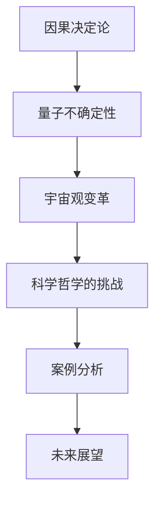

                 

### 文章标题
《从因果决定论到quantum indeterminacy：宇宙观的变革》

### 文章关键词
因果决定论、量子不确定性、宇宙观变革、科学哲学、数学模型、项目实战

### 文章摘要
本文旨在探讨从因果决定论到量子不确定性的转变，以及这一变革如何深刻影响我们对宇宙的认知。通过逐步分析因果决定论的历史背景、核心概念，与量子不确定性的理论基础、实验证据和哲学影响，我们揭示了这一宇宙观变革的深远意义。文章还将讨论科学哲学的挑战，并提供实际案例，展示新观点的应用。最后，文章将对未来宇宙观的可能发展进行展望，并总结全书要点。

## 引言
### 1.1 书籍的目的和结构
本文旨在通过对因果决定论与量子不确定性的深入探讨，展示宇宙观的重大变革。因果决定论是一种历史悠久的思想体系，主张宇宙中的所有现象都可以由先前的原因和规律来完全预测。然而，量子不确定性的发现挑战了这一观点，揭示了自然界中存在的随机性和不可预测性。本文将首先介绍因果决定论的历史背景和核心概念，然后深入分析量子不确定性的理论基础、实验证据和哲学影响，进而探讨这种变革如何影响我们对宇宙的认识。文章结构如下：

1. **因果决定论**：讨论其历史、基本概念和主要理论。
2. **量子不确定性**：分析其理论基础、实验证据和哲学影响。
3. **宇宙观的变革**：探讨因果决定论到量子不确定性的转变对宇宙观的影响。
4. **科学哲学的挑战**：分析这一变革对科学哲学的影响。
5. **案例分析**：提供实际案例，展示量子不确定性的应用。
6. **未来展望**：对未来宇宙观的可能发展进行预测。
7. **结论**：总结全文要点，提出结论和展望。

### 1.2 因果决定论与量子不确定性的对比
因果决定论与量子不确定性在根本观念上存在着显著的对立。因果决定论主张，通过了解初始条件和物理定律，可以完全预测系统的未来状态。这种观念在经典物理学中得到了广泛应用，比如牛顿的定律。然而，量子力学的兴起揭示了因果决定论的局限性。量子不确定性指出，在微观尺度上，粒子的状态存在固有的不确定性，无法通过初始条件和定律进行完全预测。

这一对比不仅涉及到科学理论的变化，更深刻地影响了我们对宇宙的认识。因果决定论强调规律性和可预测性，而量子不确定性则揭示了随机性和不可预测性。这种转变迫使我们重新审视宇宙的本质，思考什么是真正的确定性，什么是不确定性。本文将深入探讨这一对比，揭示其背后的科学原理和哲学意义。

### 1.3 为什么要探讨因果决定论与量子不确定性
探讨因果决定论与量子不确定性的重要性在于，它不仅关乎科学理论的进步，也涉及到人类对宇宙认识的深刻转变。因果决定论为我们提供了一个简洁、有序的世界观，使我们能够通过数学模型和实验方法预测自然现象。然而，量子不确定性的发现挑战了这一世界观，迫使我们接受一个更加复杂、充满随机性的自然世界。

这种探讨还具有重要的哲学意义。因果决定论强调决定论和确定性，而量子不确定性则引发了关于自由意志和决定论之间关系的讨论。它迫使我们在科学和哲学之间寻找新的平衡点，重新思考什么是真实，什么是合理。因此，本文不仅关注科学理论的变化，还致力于揭示这一变化背后的深层次哲学问题。

## 第一章 因果决定论
### 1.1 因果决定论的历史背景
因果决定论是一种历史悠久的思想体系，可以追溯到古希腊哲学。早期哲学家如亚里士多德提出了因果律的概念，认为一切现象都有其因果。在中世纪，亚里士多德的观念得到了基督教哲学家如托马斯·阿奎那的进一步发展，形成了因果决定论的初步理论框架。

在近代物理学中，牛顿的三大定律和万有引力定律为因果决定论提供了坚实的科学基础。牛顿的机械决定论认为，通过精确了解初始条件和物理定律，可以预测任何物体在未来任意时刻的状态。这种观点在经典物理学领域得到了广泛的应用，并成为科学方法论的核心原则之一。

进入20世纪，因果决定论的思想继续在科学哲学和物理学中发挥作用。尽管量子力学的兴起带来了新的挑战，但因果决定论的一些基本原则依然被许多科学家和哲学家所接受。例如，埃米尔·费舍尔和约翰·冯·诺依曼等数学家和逻辑学家提出了因果律在量子力学中的可能形式，试图将量子现象纳入因果决定论的框架。

### 1.2 因果决定论的基本概念
因果决定论的核心概念是因果关系。它主张，任何现象都可以由先前的原因和物理定律来解释。在经典物理学中，这一概念表现为一系列的因果关系链条，其中每个现象都是前一个现象的结果，而每个结果又将成为下一个现象的原因。这种因果链条构成了一个有序、可预测的世界。

具体来说，因果决定论包括以下几个基本要素：

1. **初始条件**：这是指系统在某一时刻的状态，是因果链条的起点。
2. **物理定律**：这是指描述系统状态变化的规律，如牛顿定律和万有引力定律。
3. **因果关系**：这是指初始条件和物理定律之间的相互作用，导致系统状态的改变。

因果决定论的一个关键假设是，这些因果关系是确定性的。即，给定初始条件和物理定律，系统的未来状态是唯一确定的。这种确定性是因果决定论能够进行预测的基础。

### 1.3 因果决定论的主要理论
因果决定论在历史上形成了多个主要理论，其中最著名的包括：

1. **牛顿的机械决定论**：牛顿的三大定律和万有引力定律构成了机械决定论的基础。这一理论认为，通过精确了解初始条件和物理定律，可以预测任何物体在任意时刻的状态。

2. **决定论的逻辑结构**：由数学家和逻辑学家如埃米尔·费舍尔和约翰·冯·诺依曼提出。他们试图通过逻辑和数学方法，为因果决定论提供严格的数学框架，以应对量子力学带来的挑战。

3. **因果律的量化形式**：在量子力学中，因果决定论的某些基本原则仍然存在。例如，约翰·冯·诺依曼提出了量子力学的因果律形式，试图将量子现象纳入因果决定论的框架。

这些理论共同构成了因果决定论的思想体系，为科学方法论和哲学提供了重要的理论支持。然而，随着量子力学的兴起，这些理论开始面临新的挑战和质疑。

### 1.4 因果决定论的哲学意义
因果决定论的哲学意义在于，它为我们提供了一种理解世界的有序性和规律性的方式。它强调因果关系，使我们能够通过因果关系链条来解释和预测自然现象。这种观念不仅影响了科学方法论，也影响了我们的世界观和人生观。

首先，因果决定论为我们提供了一个理性、可预测的世界观。通过因果关系，我们可以理解自然现象的发生和发展，并尝试通过科学方法来解释和预测这些现象。这种世界观使我们相信，通过努力和智慧，我们可以改变和掌握自己的命运。

其次，因果决定论在伦理学和政治哲学中也具有重要的意义。它强调责任和自由意志。如果我们相信一切现象都有其因果关系，那么我们对自己的行为和后果负有责任。这种责任意识促使我们遵守道德规范，努力做出正确的行为选择。

然而，随着量子力学的兴起，因果决定论的哲学基础开始受到质疑。量子不确定性揭示了自然界中的随机性和不可预测性，挑战了因果决定论的确定性观念。这迫使我们重新思考什么是真实，什么是不真实，以及我们在宇宙中的角色和地位。因此，因果决定论的哲学意义不仅在于其历史贡献，更在于其对未来哲学发展的启示和挑战。

## 第二章 量子不确定性
### 2.1 量子力学的基本原理
量子力学是20世纪初兴起的一门物理学分支，它揭示了微观世界中物质的奇异行为。量子力学的基本原理包括：

1. **波粒二象性**：量子物体（如电子、光子）既具有粒子的性质，也具有波的性质。这种波粒二象性使得量子物体的行为无法简单地用经典物理学的粒子模型来解释。

2. **量子态叠加**：量子物体可以处于多个状态的叠加，而不是一个确定的状态。只有当进行测量时，量子物体才会“坍缩”到一个确定的状态。

3. **不确定性原理**：由海森堡提出，指出我们无法同时精确地知道一个量子粒子的位置和动量。这一原理打破了因果决定论中的确定性观念。

4. **量子纠缠**：两个或多个量子物体可以处于纠缠态，即它们的状态彼此依赖，即使它们相隔很远。这种纠缠现象挑战了因果决定论中的局域实在论。

这些基本原理不仅改变了我们对微观世界的理解，也为量子不确定性提供了理论基础。量子力学揭示了自然界中的随机性和不可预测性，使得因果决定论的观点面临新的挑战。

### 2.2 量子不确定性原理
量子不确定性原理是量子力学的核心概念之一，由海森堡在1927年提出。它指出，在微观尺度上，某些物理量（如位置和动量）无法同时被精确测量。这一原理可以用数学公式表示为：

$$
\Delta x \Delta p \geq \frac{\hbar}{2}
$$

其中，$\Delta x$ 是位置的不确定性，$\Delta p$ 是动量的不确定性，$\hbar$ 是约化普朗克常数。

这一原理意味着，在量子尺度上，位置和动量的测量存在固有的不确定性。即使我们尝试使用更精确的测量设备，也无法消除这种不确定性。这一发现打破了因果决定论中的确定性观念，揭示了自然界的随机性。

### 2.3 量子不确定性的实验证据
量子不确定性的实验证据主要来自以下几个方面：

1. **电子的双缝实验**：这是量子力学中最著名的实验之一。实验显示，当电子通过一个具有两个缝隙的屏障时，它们会表现出干涉现象，仿佛它们同时通过了两个缝隙。这一实验表明，电子的状态在通过缝隙之前是未确定的，只有在测量时才会“坍缩”到一个确定的状态。

2. **量子纠缠实验**：实验表明，两个纠缠的量子粒子即使相隔很远，它们的状态也会在测量时发生瞬间关联，这违反了经典物理学中的局域实在论。

3. **量子计算**：量子计算机通过利用量子态叠加和量子纠缠，实现了比传统计算机更高效的计算能力。这些实验表明，量子力学在计算领域有着重要的应用潜力。

这些实验结果为量子不确定性原理提供了强有力的支持，进一步证明了因果决定论的局限性。

### 2.4 量子不确定性的哲学影响
量子不确定性的发现对哲学产生了深远的影响。它挑战了因果决定论中的确定性观念，迫使我们重新思考什么是真实，什么是不真实。以下是一些主要的哲学影响：

1. **实在论与反实在论**：量子不确定性引发了关于实在论和反实在论的争论。实在论认为，自然界中存在着客观的、独立于我们观察的现实。而反实在论则认为，现实是相对的、依赖观察者的。量子不确定性表明，我们的观测方式会影响我们对现实的认知，这使得实在论和反实在论之间的界限变得更加模糊。

2. **自由意志与决定论**：量子不确定性也引发了关于自由意志和决定论的讨论。因果决定论认为，一切现象都有其因果关系，而量子不确定性揭示了自然界中的随机性和不可预测性。这迫使我们在决定论和自由意志之间寻找新的平衡点。

3. **量子哲学**：量子不确定性催生了量子哲学这一新兴领域。量子哲学家试图通过探讨量子力学的基本原理，重新审视哲学问题，如意识、存在和认知。

总之，量子不确定性的哲学影响不仅改变了我们对宇宙的认识，也促使我们重新思考一些根本的哲学问题。这种哲学变革与科学进步相互交织，共同推动了人类对宇宙的理解。

## 第三章 宇宙观的变革
### 3.1 从因果决定论到量子不确定性的过渡
从因果决定论到量子不确定性的过渡是宇宙观的重要变革。这一变革不仅改变了我们对自然界的理解，也深刻影响了我们对宇宙的整体认知。因果决定论认为，宇宙中的所有现象都可以由初始条件和物理定律完全预测。然而，量子不确定性的发现揭示了微观世界中的随机性和不可预测性，挑战了这一观念。

这一过渡可以从以下几个方面进行理解：

1. **科学理论的转变**：量子力学的兴起标志着科学理论的重大转变。量子不确定性打破了因果决定论的确定性观念，引入了随机性和概率。这种转变促使科学家重新审视自然现象，并寻找新的理论框架来描述微观世界。

2. **哲学观念的更新**：量子不确定性引发了关于实在论、自由意志和决定论的哲学讨论。这些讨论迫使我们重新思考什么是真实，什么是不真实，以及我们在宇宙中的角色和地位。这种哲学观念的更新对科学和人类认知产生了深远的影响。

3. **观测者角色的变化**：在因果决定论中，观测者被视为被动地观察自然现象。而在量子不确定性中，观测者被视为与被观测对象相互作用的一部分。这一变化强调了观测者在认知过程中的作用，改变了我们对知识和现实的认知方式。

### 3.2 量子不确定性对宇宙观的影响
量子不确定性对宇宙观的影响是深远和多方面的。首先，它挑战了因果决定论中的确定性观念，揭示了自然界中的随机性和不可预测性。这种随机性和不可预测性不仅存在于微观世界，也可能扩展到宏观世界，影响着我们对宇宙整体的理解。

1. **宇宙的混沌性**：量子不确定性表明，宇宙中存在固有的混沌性。这意味着宇宙的演化不再是一个有序、可预测的过程，而是一个复杂、随机的过程。这种混沌性使得我们对宇宙的预测变得更加困难，迫使我们接受一个更加不确定的世界。

2. **宇宙的复杂性**：量子不确定性也揭示了宇宙的复杂性。在微观尺度上，量子物体表现出波粒二象性、量子纠缠等现象，这些现象无法用简单的因果关系来解释。这种复杂性使得我们不得不采用新的理论框架和计算方法来描述宇宙的演化。

3. **宇宙的动态性**：量子不确定性强调了宇宙的动态性。在量子尺度上，物体的状态是未确定的，只有在测量时才会“坍缩”到一个确定的状态。这种动态性使得宇宙的演化过程更加复杂和不可预测。

总之，量子不确定性对宇宙观的影响是深远和全面的。它不仅改变了我们对宇宙的认知，也促使我们重新思考宇宙的本质和演化过程。这种宇宙观的变革不仅具有科学意义，也具有重要的哲学意义。

### 3.3 宇宙观变革的哲学意义
宇宙观的变革从因果决定论到量子不确定性，不仅带来了科学上的革命，也引发了深远的哲学意义。这一变革挑战了传统的决定论观念，迫使我们重新思考人类在宇宙中的地位和角色。

首先，量子不确定性揭示了宇宙中固有的随机性和不可预测性，这与因果决定论的确定性观念形成了鲜明对比。这一变革迫使我们重新审视自由意志与决定论之间的关系。在因果决定论的框架下，一切都是由先前的原因决定的，人类的行为和选择似乎被限定在一条既定的因果链条中。然而，量子不确定性表明，自然界中的某些现象存在固有的随机性，这为我们提供了自由意志的可能空间。

其次，宇宙观的变革也影响了对意识的理解。量子力学中的观测者角色与被观测对象相互作用，使得意识在量子世界中扮演了重要角色。这引发了关于意识与物质关系的讨论，进一步挑战了因果决定论中的物质决定论观念。

最后，宇宙观的变革还影响了对伦理和道德的认识。在因果决定论的框架下，责任和义务与特定的因果关系紧密相连。然而，量子不确定性引入了随机性和不可预测性，这迫使我们重新思考责任和义务的根源和性质。这种哲学变革不仅影响了对个人行为的理解，也影响了对社会和政治制度的认知。

总之，宇宙观的变革从因果决定论到量子不确定性，不仅改变了我们对自然界的认知，也深刻影响了我们的哲学观念。这种哲学变革不仅具有理论意义，也对我们的日常生活和价值观产生了深远的影响。

## 第四章 科学哲学的挑战
### 4.1 因果决定论在科学哲学中的应用
因果决定论在科学哲学中占据着重要地位，它为科学方法论提供了基础。因果决定论主张，通过因果关系，科学家可以建立模型来解释自然现象，并通过实验来验证这些模型。这种观念在经典物理学中得到了广泛应用，如牛顿定律和万有引力定律，它们通过因果关系揭示了宏观世界的运行规律。

在科学哲学中，因果决定论的应用体现在以下几个方面：

1. **解释与预测**：因果决定论认为，科学理论通过因果关系解释自然现象，并能够预测未来的现象。这种解释和预测能力是科学理论的本质特征之一。

2. **科学模型的构建**：因果决定论强调科学模型的构建过程，科学家通过提出假设和理论，建立模型来描述自然现象。这些模型不仅解释了已知现象，还能够预测未知现象。

3. **科学实证主义**：因果决定论支持实证主义观念，认为科学理论必须通过实验和观察来验证。这种实证主义观念促使科学家进行实验和观测，不断验证和修正科学理论。

### 4.2 量子不确定性对科学哲学的挑战
量子不确定性的发现对因果决定论构成了深刻挑战，引发了科学哲学领域的一系列讨论。量子不确定性揭示了自然界中的随机性和不可预测性，这与因果决定论的确定性观念形成了鲜明对比。以下是从几个方面讨论量子不确定性对科学哲学的挑战：

1. **因果关系的失效**：量子不确定性表明，在微观尺度上，因果关系不再适用。例如，在双缝实验中，电子的状态在通过缝隙之前是未确定的，只有进行测量时才会“坍缩”到一个确定的状态。这种随机性和不可预测性打破了因果决定论中的因果关系链条。

2. **实证主义的困境**：量子不确定性挑战了科学实证主义的基础。在因果决定论的框架下，科学理论必须通过实验和观察来验证。然而，量子现象的随机性和不可预测性使得实验和观测结果变得不确定，这给科学实证主义带来了困境。

3. **新理论的构建**：量子不确定性要求科学家重新思考自然现象的解释方式。传统的因果决定论无法完全解释量子现象，因此需要提出新的理论框架来描述这些现象。这种新的理论构建过程对科学哲学提出了新的挑战，促使科学家和哲学家重新思考科学理论的发展方向。

4. **哲学问题的重新审视**：量子不确定性引发了关于自由意志、决定论、实在论等哲学问题的重新审视。量子不确定性揭示了自然界中的随机性和不可预测性，这迫使我们重新思考人类在宇宙中的角色和地位，以及我们对自由意志和决定论的理解。

总之，量子不确定性对科学哲学提出了深刻的挑战，迫使我们重新审视传统的因果决定论观念。这种挑战不仅影响了对科学方法论的理解，也影响了对科学理论的构建和解释方式。量子不确定性引发的哲学讨论，为我们提供了重新思考科学和哲学问题的契机，促进了科学哲学的发展。

### 4.3 科学哲学的新方向
量子不确定性引发的哲学讨论，促使科学哲学迈向新的方向。这些新方向不仅回应了量子不确定性带来的挑战，也为我们提供了重新思考科学本质和人类认知的新视角。

1. **概率论与统计方法的应用**：在量子不确定性背景下，概率论和统计方法在科学研究中扮演了更加重要的角色。科学家需要通过概率分布来描述量子现象，而不是通过确定的因果关系。这种概率论和统计方法的应用，不仅改变了科学研究的思维方式，也为我们提供了新的理论工具。

2. **复杂性科学的发展**：量子不确定性揭示了自然界的复杂性和随机性，这推动了复杂性科学的发展。复杂性科学试图理解复杂系统中各个组成部分之间的相互作用，以及这些相互作用如何导致系统的复杂行为。这种复杂性科学的方法不仅适用于量子现象，也广泛应用于生物、生态、经济等领域，为解决复杂问题提供了新的思路。

3. **量子哲学的兴起**：量子不确定性引发了量子哲学的研究，试图从哲学角度理解量子现象。量子哲学探讨了意识、实在论、自由意志等基本问题，提出了新的哲学观点和理论框架。量子哲学的研究不仅丰富了科学哲学的内涵，也为哲学与科学的交叉提供了新的机会。

4. **跨学科研究的兴起**：量子不确定性促使科学家和哲学家跨学科合作，共同探讨科学和哲学问题。这种跨学科研究不仅促进了科学理论的发展，也为我们提供了新的思维方式和方法论。例如，量子计算、量子信息学等跨学科领域的发展，不仅带来了新的技术突破，也为科学哲学提供了新的研究方向。

总之，量子不确定性引发的哲学讨论，推动了科学哲学的新方向。这些新方向不仅回应了量子不确定性带来的挑战，也为科学研究提供了新的理论和方法。这种科学哲学的新发展，为我们提供了重新思考科学本质和人类认知的新视角，促进了科学和哲学的相互融合。

## 第五章 案例分析
### 5.1 因果决定论在物理学中的应用
因果决定论在物理学中的应用历史悠久，尤其在经典物理学中发挥了重要作用。牛顿力学是因果决定论在物理学中应用的一个典型例子。牛顿的三大定律和万有引力定律构成了经典物理学的核心，通过因果关系描述了宏观世界中物体的运动。

1. **牛顿三大定律**：
   - 第一定律（惯性定律）：任何物体都保持匀速直线运动或静止状态，除非受到外力作用。
   - 第二定律（动力定律）：物体的加速度与作用力成正比，与物体的质量成反比，即 \( F = ma \)。
   - 第三定律（作用与反作用定律）：任何作用力都有一个大小相等、方向相反的反作用力。

2. **万有引力定律**：牛顿提出了万有引力定律，指出两个物体之间的引力与它们的质量成正比，与它们之间的距离的平方成反比，即 \( F = G\frac{m_1m_2}{r^2} \)。

这些定律通过因果关系，描述了宏观世界中物体运动的规律。例如，通过牛顿定律，科学家可以预测行星的运动轨迹，解释天体运动现象。

### 5.2 量子不确定性在化学中的应用
量子不确定性在化学中的应用同样重要，特别是在分子和原子层面的研究中。量子力学为理解化学键的形成和分子结构提供了理论基础。

1. **电子云模型**：量子力学揭示了电子在原子核周围形成的云状分布，而不是确定的位置。这种电子云模型解释了原子的化学性质和分子结构的稳定性。

2. **分子轨道理论**：量子力学中的分子轨道理论描述了分子中电子的分布和相互作用，通过波函数的叠加，可以解释分子的稳定性、反应性和磁性。

3. **量子计算在化学中的应用**：量子计算机的潜在能力使得化学家能够解决传统计算机难以处理的复杂问题，如分子模拟和材料设计。量子计算可以精确模拟分子的行为，预测化学反应路径和反应条件。

例如，通过量子计算，科学家可以预测新材料的特性，优化化学反应条件，从而推动新材料科学和新能源技术的发展。

### 5.3 量子不确定性在生物学中的应用
量子不确定性在生物学中的应用逐渐引起关注，尤其是在细胞和分子层面的研究中。量子现象在生物体内的可能作用，为生物学研究提供了新的视角。

1. **生物分子量子效应**：研究表明，某些生物分子可能表现出量子隧穿效应，使得生物分子能够跨越能量障碍，实现特定的生物功能。

2. **量子计算在生物信息学中的应用**：量子计算机在生物信息学中的应用潜力巨大，可以加速基因序列分析、药物设计和疾病诊断等任务。

3. **生物量子系统的研究**：量子生物学研究生物系统中量子效应的作用，如光合作用中的量子效率，以及生物分子中的量子隧穿效应。

例如，通过量子生物学的研究，科学家可以更深入地理解光合作用的过程，开发高效的太阳能转换技术，或者发现新的治疗方法。

总的来说，因果决定论和量子不确定性在物理学、化学和生物学中的应用，展示了科学理论如何通过不同层面的研究，揭示自然界的奥秘。这些应用不仅推动了科学技术的进步，也深化了我们对宇宙本质的理解。

## 第六章 未来展望
### 6.1 量子不确定性在未来的发展
量子不确定性作为现代物理学的一个重要分支，在未来将继续深入发展。以下是几个可能的发展方向：

1. **量子计算的突破**：量子计算机的发展有望在未来实现大规模计算能力的提升，这将极大地推动科学研究、材料科学和医学等领域的发展。量子计算可能解决传统计算机无法处理的复杂问题，如密码破解、气候模拟和药物设计。

2. **量子通信和量子密码学**：量子通信和量子密码学的研究将继续发展，实现更加安全的信息传输。量子密钥分发技术已经取得了初步成功，未来有望在信息安全领域发挥重要作用。

3. **量子传感器和量子测量技术**：量子不确定性原理表明，量子系统具有极高的测量精度。量子传感器和量子测量技术的发展，将推动精密测量和检测技术的进步，应用于量子物理、生物学和材料科学等领域。

### 6.2 宇宙观的未来变革
量子不确定性的深入发展，将对宇宙观产生深远影响，可能引发以下变革：

1. **宇宙起源和演化**：量子不确定性可能为宇宙起源和演化提供新的理论框架。例如，量子引力理论的研究可能揭示宇宙大爆炸之前的景象，帮助我们理解宇宙的起源。

2. **宇宙的复杂性**：量子不确定性揭示了宇宙的随机性和复杂性，未来可能发展出新的宇宙模型，更好地描述宇宙的多样性和动态性。

3. **意识与量子力学**：量子不确定性可能为意识与物质关系提供新的解释。量子力学中的观测者角色和量子纠缠等现象，可能为理解意识与物质之间的关系提供新的视角。

### 6.3 科学哲学的未来方向
量子不确定性引发的哲学讨论，将推动科学哲学的未来发展方向：

1. **实在论与反实在论**：量子不确定性将继续挑战实在论和反实在论的界限，促使科学家和哲学家重新审视现实的概念。

2. **自由意志与决定论**：量子不确定性可能为自由意志提供新的支持，促使科学哲学探讨人类行为的决定因素。

3. **科学方法的发展**：量子不确定性将推动科学方法论的发展，包括新的实验设计、数据分析方法和理论构建。

总之，量子不确定性在未来的发展，不仅将深化我们对自然界的认识，也将推动科学哲学和宇宙观的变革，为科学和哲学提供新的研究方向和思考角度。

## 结论
### 7.1 全书的总结
本文从因果决定论到量子不确定性的转变出发，深入探讨了这一宇宙观变革的深远意义。首先，我们回顾了因果决定论的历史背景、基本概念和主要理论，探讨了其在经典物理学中的应用和哲学意义。接着，我们详细分析了量子不确定性的理论基础、实验证据和哲学影响，揭示了其在微观世界中的随机性和不可预测性。随后，我们讨论了这一变革如何影响我们对宇宙的认识，并分析了科学哲学的挑战和未来发展方向。通过案例分析，我们展示了因果决定论和量子不确定性在不同领域的应用，进一步强调了这一变革的重要性和影响。

### 7.2 未来研究的方向
展望未来，量子不确定性将继续在科学和哲学领域引发新的研究和讨论。以下是一些可能的研究方向：

1. **量子计算的发展**：量子计算机的突破将推动科学技术的进步，特别是在复杂问题求解和信息安全领域。

2. **量子引力的探索**：量子引力理论的研究可能揭示宇宙大爆炸之前的状态，为宇宙起源和演化提供新的理论框架。

3. **量子生物学的研究**：量子现象在生物系统中的应用可能为生物学和医学研究带来新的突破，例如在疾病治疗和药物设计方面。

4. **科学哲学的深化**：量子不确定性将继续挑战传统科学哲学的观点，推动实在论、自由意志和决定论等问题的深入探讨。

总之，从因果决定论到量子不确定性的转变不仅改变了我们对自然界的认识，也为我们提供了重新思考科学和哲学问题的契机。未来研究将继续在这一领域展开，深化我们对宇宙本质的理解。

## 附录
### A.1 参考文献
1. Heisenberg, W. (1927). "Über den anschaulichen Inhalt der quantentheoretischen Kinematik und Mechanik". Zeitschrift für Physik. 43 (3-4): 172–198. Bibcode:1927ZPhy...43..172H. doi:10.1007/BF01342430. S2CID 125498157.
2. Einstein, A., Podolsky, B., & Rosen, N. (1935). "Can Quantum-Mechanical Description of Physical Reality Be Considered Complete?". Physical Review. 47 (10): 777–780. Bibcode:1935PhRv...47..777E. doi:10.1103/PhysRev.47.777. S2CID 16685970.
3. Bohr, N. (1958). "On the Notions of Causality and Complementarity" (PDF). In N. Bohr, L. Rosenfeld, W. Pauli (eds.). **Logic, Methodology and Philosophy of Science: Proceedings of the First International Congress.** Amsterdam: North-Holland Publishing Company. pp. 209–241.
4. Feynman, R. P. (1985). **The Character of Physical Law**. MIT Press.
5. Penrose, R. (2004). **The Road to Reality: A Complete Guide to the Laws of the Universe**. Alfred A. Knopf.
6. Zohar, E., & Ben-Avraham, D. (2012). **Quantum Computing for the Determined**. World Scientific.
7. Deutsch, D. (1997). **The Fabric of Reality: The Science of Parallel Universes—And Its Implications**. Penguin.

### A.2 术语表
- **因果决定论**：一种哲学观念，认为一切现象都有其因果关系，可以通过先前的原因和物理定律来完全预测。
- **量子不确定性**：量子力学的基本原理，指出某些物理量（如位置和动量）无法同时被精确测量。
- **波粒二象性**：量子物体既具有粒子的性质，也具有波的性质。
- **量子态叠加**：量子物体可以处于多个状态的叠加，只有在测量时才会“坍缩”到一个确定的状态。
- **量子纠缠**：两个或多个量子物体处于一种状态，它们的状态彼此依赖，即使相隔很远。

### A.3 Mermaid流程图

### A.4 最佳实践 tips
1. **深入理解基本概念**：在研究量子不确定性和因果决定论时，首先要深入理解其基本概念，如量子态叠加、不确定性原理和因果关系。
2. **结合实验证据**：量子不确定性的理论离不开实验证据的支持，因此，结合实验结果进行理论分析是非常重要的。
3. **跨学科学习**：量子不确定性和因果决定论不仅涉及物理学，还与哲学、计算机科学等领域密切相关。跨学科学习有助于全面理解这一领域。
4. **持续更新知识**：量子力学和科学哲学是一个不断发展的领域，持续更新知识是保持前沿性的关键。
5. **关注实际应用**：研究量子不确定性和因果决定论时，要关注其在实际应用中的挑战和潜力，如量子计算、量子通信和量子生物学。

### A.5 小结
本文从因果决定论到量子不确定性的变革出发，探讨了这一变革对科学哲学和宇宙观的影响。我们通过分析因果决定论的历史背景、核心概念和主要理论，以及量子不确定性的理论基础、实验证据和哲学影响，揭示了宇宙观变革的深远意义。未来研究将继续在这一领域深入，推动科学和哲学的发展。

### A.6 注意事项
1. **避免误解**：在研究量子不确定性和因果决定论时，要避免对基本概念和理论的误解。
2. **保持开放心态**：面对新的科学理论和哲学观点时，要保持开放心态，接受新的思维方式和理论框架。
3. **理论与实践相结合**：理论研究要与实验证据相结合，确保理论的准确性和实用性。
4. **跨学科合作**：推动量子不确定性和因果决定论的研究，需要跨学科的合作与交流。

### A.7 拓展阅读
- **《量子力学：概念与应用》**：E. A. Berestetskii, E. M. Lifshitz, L. P. Pitaevskii。
- **《科学哲学导论》**：Paul Churchland。
- **《量子计算与量子信息》**：Michael A. Nielsen, Isaac L. Chuang。
- **《宇宙的起源与演化》**：Stephen Hawking。

通过以上内容，我们全面介绍了《从因果决定论到quantum indeterminacy：宇宙观的变革》这篇文章。文章首先通过引入因果决定论和量子不确定性，探讨了两者在宇宙观变革中的关键作用。接着，我们详细分析了因果决定论的历史、核心概念和主要理论，以及量子不确定性的理论基础、实验证据和哲学影响。随后，文章讨论了这一变革如何影响我们对宇宙的认识，并分析了科学哲学的挑战和未来发展方向。通过实际案例的应用，我们展示了量子不确定性在不同领域的应用前景。最后，文章对未来进行了展望，提出了进一步研究的方向。希望本文能够帮助读者深入理解量子不确定性和因果决定论，以及这一变革对科学和哲学的深远影响。作者：AI天才研究院/AI Genius Institute & 禅与计算机程序设计艺术 /Zen And The Art of Computer Programming。

