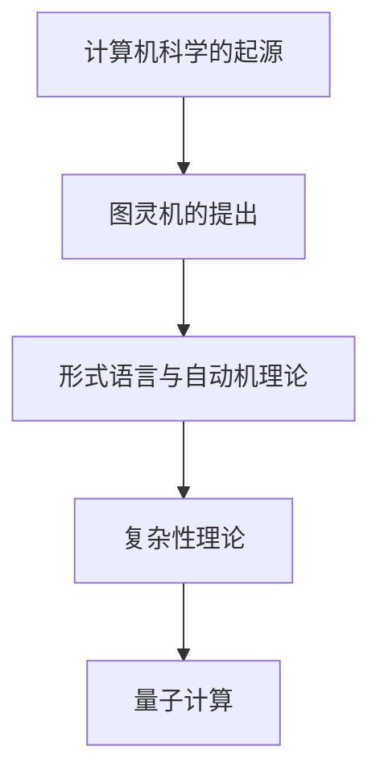

                 

### 第1章：计算理论概述

#### 1.1 计算理论的历史背景

计算理论的历史可以追溯到20世纪30年代，这一时期是现代计算机科学的萌芽时期。关键人物是艾伦·图灵（Alan Turing），他的图灵机模型为计算理论奠定了基础。图灵机是一个抽象的计算模型，由一个读写头、无限长的带子和一组状态组成。读写头可以在带子上左右移动，读取和写入符号，并根据当前的状态和读取到的符号进行状态转移。

在图灵提出图灵机之前，数学家如戴维·希尔伯特（David Hilbert）和莱奥·布尔巴基（Leó Szilárd）等人已经探讨了可计算性与不可计算性的问题。希尔伯特提出了著名的“决定性问题”，即给定一个数学命题，能否通过一个算法来确定它是真还是假。布尔巴基则提出了形式语言和自动机理论，这些理论为图灵机的出现提供了理论基础。

#### 1.2 图灵机的概念与工作原理

图灵机是一种抽象的计算模型，它由以下部分组成：

1. **图灵带**：一个无限长的带子，带子上有无限多个格子，每个格子可以存储一个符号。图灵机可以在图灵带上左右移动，读写头处于某个格子上时，可以读取或写入符号。
2. **读写头**：位于图灵带上的某个位置，可以读取格子上的符号，也可以写入新的符号。读写头的移动受到当前状态的约束。
3. **状态控制器**：根据当前的状态和读写头读取到的符号，决定下一个状态、读写头的移动方向以及是否在图灵带上写入新的符号。

图灵机的操作过程如下：

1. **初始状态**：图灵机从一个特定的状态开始，读写头位于图灵带的某个格子上，该格子上的符号表示输入的一部分。
2. **读取符号**：读写头读取当前格子上的符号。
3. **状态转移**：根据当前的状态和读取到的符号，状态控制器决定下一个状态。
4. **读写操作**：如果状态控制器决定进行读写操作，读写头可以在当前格子写入新的符号。
5. **移动**：根据状态控制器决定的方向，读写头在图灵带上左右移动。
6. **重复过程**：回到步骤2，直到图灵机达到一个停止状态。

图灵机的定义非常抽象，但它能够模拟任何算法。这意味着，任何可以用算法解决的问题，都可以用图灵机来模拟。因此，图灵机被视为一种通用计算模型。

#### 1.3 可计算性与不可计算性

可计算性与不可计算性是计算理论中的重要概念。

- **可计算性**：一个函数是可计算的，如果存在一个算法可以计算这个函数的值。在图灵机的框架下，一个函数是可计算的，如果存在一个图灵机可以模拟这个算法并最终输出结果。
- **不可计算性**：一个函数是不可计算的，如果不存在任何算法可以计算这个函数的值。例如，停机问题（即给定一个图灵机M和一个正整数n，能否确定M在运行n步后是否会停止）就是一个不可计算问题。

可计算性与不可计算性的研究揭示了计算的本质和限制。例如，通过研究可计算性，我们可以了解哪些问题是可以通过算法解决的，哪些问题是无法通过算法解决的。这不仅对理论计算机科学有重要意义，也对实际应用有深远的影响。

#### 1.4 Mermaid流程图

为了更好地理解计算理论的发展历程，我们可以使用Mermaid流程图来展示这一过程。



这个流程图展示了计算理论的主要发展阶段，从计算机科学的起源到图灵机的提出，再到形式语言与自动机理论，复杂性理论，最终发展到量子计算。每个阶段都是对计算理论的重要贡献，为现代计算机科学的发展奠定了基础。

### 第2章：图灵机与形式语言

#### 2.1 图灵机的结构

图灵机的结构由以下几个部分组成：

1. **图灵带**：图灵带是一个无限长的带子，带子上分为多个格子，每个格子可以存储一个符号。图灵带是图灵机执行计算的主要存储介质。
2. **读写头**：读写头位于图灵带的某个位置，可以读取当前格子上的符号，也可以写入新的符号。读写头的移动方向和位置由图灵机的当前状态决定。
3. **状态控制器**：状态控制器根据当前的状态和读写头读取到的符号，决定图灵机的下一个状态、读写头的移动方向以及是否写入新的符号。

图灵机的操作过程如下：

1. **初始状态**：图灵机从一个特定的状态开始，读写头位于图灵带的某个格子上，该格子上的符号表示输入的一部分。
2. **读取符号**：读写头读取当前格子上的符号。
3. **状态转移**：根据当前的状态和读取到的符号，状态控制器决定下一个状态。
4. **读写操作**：如果状态控制器决定进行读写操作，读写头可以在当前格子写入新的符号。
5. **移动**：根据状态控制器决定的方向，读写头在图灵带上左右移动。
6. **重复过程**：回到步骤2，直到图灵机达到一个停止状态。

图灵机的核心思想在于它的状态控制器，它可以根据当前的输入和状态，决定下一步的操作。这种能力使得图灵机成为一种非常灵活的计算模型，能够模拟任何算法。

#### 2.2 形式语言的基本概念

形式语言是计算理论中的一个重要概念，它用来描述计算机可以处理的符号序列。

1. **字母表**：字母表是一个有限集合，包含了所有的符号。例如，英文字母表包含了26个字母。
2. **词汇**：词汇是由字母表中的符号组成的有限序列。例如，"hello" 是一个词汇。
3. **语言**：语言是由一组词汇构成的集合。形式语言可以用来定义编程语言、自然语言等。

形式语言的研究帮助我们理解计算机能够处理的符号序列的规则。形式语言理论为计算机科学提供了基础，使得我们可以更好地理解和设计编程语言。

#### 2.3 语法与文法

语法和文法是形式语言理论中的重要概念，用于描述语言的规则。

1. **文法**：文法是一种规则的集合，定义了如何构造一个语言的句子。例如，一个简单的文法可以定义如下：
   ```
   S -> NP VP
   NP -> Det N | Det N VP
   VP -> V NP | V
   Det -> the | a
   N -> man | woman
   V -> walks | talks
   ```
   这个文法定义了一个简单的句子结构，例如 "The man walks"。

2. **产生式**：产生式是文法中的规则，它定义了如何从一个非终结符号生成一个字符串。在上面的文法中，"S -> NP VP" 是一个产生式，它定义了如何生成一个句子。

3. **非终结符号**：非终结符号是文法中的符号，它可以被其他符号替换。在上面的文法中，"S"、"NP" 和 "VP" 是非终结符号。

4. **终结符号**：终结符号是文法中的符号，它不能被替换。在上面的文法中，"Det"、"N" 和 "V" 是终结符号。

通过语法和文法，我们可以定义复杂的语言规则，使得计算机能够理解和处理这些规则。语法和文法在编译原理、自然语言处理等领域有广泛的应用。

### 第3章：复杂性理论入门

#### 3.1 时间复杂度与空间复杂度

复杂性理论是计算理论中的一个重要分支，用于研究算法的效率和资源消耗。时间复杂度和空间复杂度是复杂性理论中的两个核心概念。

1. **时间复杂度**：时间复杂度描述了一个算法在执行过程中所需的基本操作次数与输入规模的关系。通常用大O符号（O-notation）来表示。例如，如果一个算法的时间复杂度为O(n)，那么当输入规模增加时，算法所需的时间大致与输入规模成线性关系。

2. **空间复杂度**：空间复杂度描述了一个算法在执行过程中所需的最大存储空间与输入规模的关系。同样地，空间复杂度也通常用大O符号来表示。

时间复杂度和空间复杂度是评价算法性能的重要指标。通过分析算法的时间复杂度和空间复杂度，我们可以了解算法在不同输入规模下的表现，从而选择合适的算法来解决实际问题。

#### 3.2 NP完全性与P问题

NP完全性（NP-completeness）是复杂性理论中的一个重要概念，用于描述某些问题是否具有难以解决的特性。

1. **NP问题**：NP（Non-deterministic Polynomial time）问题是指那些可以通过多项式时间验证的决策问题。换句话说，如果一个问题的答案是“是”的实例，我们可以在多项式时间内验证这个答案是正确的。

2. **NP完全性**：一个问题如果既是NP问题，并且任何其他的NP问题都可以通过多项式时间转换为它，那么这个问题就是NP完全的。NP完全问题通常被认为是很难解决的问题，因为它们很难在多项式时间内求解。

3. **P问题**：P（Polynomial time）问题是指那些可以在多项式时间内求解的决策问题。与NP问题不同，P问题通常被认为是可以解决的。

P问题和NP完全性是复杂性理论中的两个核心概念。P问题表示问题可以在多项式时间内解决，而NP完全性问题表示问题在理论上很难解决。复杂性理论的很多研究都集中在寻找P=NP的证明，即证明所有的NP问题都可以在多项式时间内解决。如果P=NP，那么复杂性理论中的很多问题将得到彻底解决。

#### 3.3 几种常见算法的复杂度分析

在复杂性理论中，我们通常会分析几种常见算法的时间复杂度和空间复杂度。以下是一些常见算法的复杂度分析：

1. **排序算法**：
   - **冒泡排序**：时间复杂度O(n^2)，空间复杂度O(1)。
   - **快速排序**：平均时间复杂度O(n*log(n))，最坏时间复杂度O(n^2)，空间复杂度O(log(n))。
   - **归并排序**：时间复杂度O(n*log(n))，空间复杂度O(n)。

2. **查找算法**：
   - **二分查找**：时间复杂度O(log(n))，空间复杂度O(1)。
   - **哈希查找**：平均时间复杂度O(1)，最坏时间复杂度O(n)。

3. **图算法**：
   - **广度优先搜索**：时间复杂度O(V+E)，空间复杂度O(V)。
   - **深度优先搜索**：时间复杂度O(V+E)，空间复杂度O(V)。

通过分析这些常见算法的复杂度，我们可以更好地理解它们的性能，并在实际问题中选择合适的算法来解决。

### 第4章：量子计算基础

#### 4.1 量子位与量子态

量子计算是计算理论中的一个新兴领域，它利用量子力学原理来执行计算。量子计算的基础是量子位（qubit）和量子态。

1. **量子位（qubit）**：量子位是量子计算的基本单元，它可以用量子态来表示。与经典计算中的比特（bit）不同，量子位可以同时处于0和1的叠加状态。

2. **量子态**：量子态是量子位可能的所有状态的叠加。一个量子位可以处于以下状态的叠加：
   $$
   \psi = \alpha|0\rangle + \beta|1\rangle
   $$
   其中，$|0\rangle$ 和 $|1\rangle$ 分别表示量子位处于0和1的经典状态，$\alpha$ 和 $\beta$ 是复数，且满足 $|\alpha|^2 + |\beta|^2 = 1$。

量子态的叠加性是量子计算的核心特性之一，它使得量子计算机在处理某些问题时具有潜在的优势。

#### 4.2 量子门与量子操作

量子门是量子计算中的基本操作，类似于经典计算中的逻辑门。量子门作用于量子位，可以改变量子位的量子态。

1. **Hadamard门（H门）**：Hadamard门是一个常用的量子门，可以将一个量子位的状态从基态（$|0\rangle$）叠加到叠加态：
   $$
   H|0\rangle = \frac{1}{\sqrt{2}}(|0\rangle + |1\rangle)
   $$

2. **Pauli X门（X门）**：X门是一个将量子位的状态在0和1之间翻转的量子门：
   $$
   X|0\rangle = |1\rangle, \quad X|1\rangle = |0\rangle
   $$

3. **Pauli Z门（Z门）**：Z门是一个将量子位的状态在0和1之间反转的量子门：
   $$
   Z|0\rangle = |0\rangle, \quad Z|1\rangle = |1\rangle
   $$

量子门可以组合使用，以实现更复杂的量子操作。例如，通过组合Hadamard门和Pauli Z门，可以生成一个量子位的全翻转到叠加态的操作。

#### 4.3 量子算法示例

量子计算的一个显著优势是它能够高效地解决某些经典计算中难以解决的问题。以下是一个简单的量子算法示例——量子傅里叶变换（Quantum Fourier Transform，QFT）。

1. **量子傅里叶变换（QFT）**：QFT是量子计算中的一个基本操作，它将量子态从位置表示转换为频率表示。

   给定一个量子位序列 $|x\rangle = \sum_{i=0}^{n-1} a_i|x\rangle$，其中 $a_i$ 是量子位 $i$ 的幅值，QFT操作将其转换为：
   $$
   QFT|x\rangle = \frac{1}{\sqrt{n}} \sum_{j=0}^{n-1} e^{2\pi i j k / n}|k\rangle
   $$
   其中，$k$ 是量子位序列的傅里叶系数。

2. **量子傅里叶变换的实现**：量子傅里叶变换可以通过一系列的Hadamard门和相位旋转门来实现。

   假设我们有一个n位量子位序列，首先对其进行QFT操作，然后读取输出量子位序列。通过分析输出量子位序列的幅值，我们可以得到原始量子位序列的傅里叶系数。

量子傅里叶变换在量子计算中有着广泛的应用，如量子搜索算法、量子纠错码等。

### 第5章：量子计算与经典计算的比较

#### 5.1 量子计算的优势与局限

量子计算与经典计算在原理和性能上有显著的不同。

1. **优势**：
   - **并行性**：量子计算机可以利用量子位的叠加态，实现并行计算。这使得量子计算机在某些问题上的求解速度远超经典计算机。
   - **高效算法**：量子计算机能够高效地解决某些经典计算中难以解决的问题，如Shor算法和Grover算法。
   - **量子纠缠**：量子计算中的量子纠缠是一种特殊的量子关联，它可以用来实现高效的量子通信和量子加密。

2. **局限**：
   - **量子退相干**：量子计算机中的量子位容易受到环境的影响，导致量子态的退相干。这限制了量子计算机的稳定性和可靠性。
   - **量子计算复杂性**：量子计算机的构建和维护需要高度精确的物理系统和复杂的算法，这使得量子计算的实施成本较高。
   - **量子算法适用范围**：并非所有问题都适合用量子计算机来解决。许多问题在经典计算机上仍然更有效。

#### 5.2 量子计算与经典计算的协同

量子计算和经典计算并非互斥的，它们可以相互补充，实现更高效的计算。

1. **混合量子计算**：混合量子计算结合了量子计算和经典计算的优势。例如，在量子算法的实现中，经典计算机可以用来优化量子操作的序列，从而提高算法的性能。

2. **量子辅助计算**：在量子辅助计算中，量子计算机用于解决某个问题的子问题，而经典计算机则用于处理主问题的其他部分。这种协同方法可以在不牺牲性能的情况下提高计算效率。

#### 5.3 量子计算的应用前景

量子计算在多个领域有着广泛的应用前景。

1. **密码学**：量子计算在密码学中的应用包括量子加密和量子密码分析。量子加密可以提供绝对安全的通信，而量子密码分析则可以帮助破解传统的加密算法。

2. **优化问题**：量子计算在优化问题中的应用非常广泛，如旅行商问题、线性规划和组合优化问题。量子计算机可以提供高效的解决方案，减少计算时间和资源消耗。

3. **量子模拟**：量子计算可以用于模拟量子系统，如量子化学、量子材料和量子生物学。这为相关领域的研究提供了强大的工具。

4. **大数据处理**：量子计算在数据处理和分析方面具有巨大潜力，如大数据分析和机器学习。量子计算机可以加速数据处理和分析，提供更准确的预测和决策。

总之，量子计算与经典计算的协同有望推动计算技术的发展，带来革命性的变革。

### 第6章：量子算法与密码学

#### 6.1 Shor算法与量子密码

Shor算法是量子计算中的一个重要算法，它利用量子计算机的并行性和量子纠缠特性，能够在多项式时间内解决整数分解问题。整数分解问题是密码学中的一个核心问题，许多现代加密算法（如RSA加密）都依赖于其困难性。

1. **Shor算法的基本原理**：
   - **量子随机游走**：Shor算法的核心是量子随机游走。量子随机游走利用量子态的叠加性和量子位的纠缠，可以在量子计算机上实现快速随机游走。
   - **量子傅里叶变换（QFT）**：量子随机游走后，通过量子傅里叶变换可以将量子态从位置表示转换为频率表示，从而得到目标数的因子。

2. **量子密码**：
   - **量子密钥分发**：量子密码学利用量子纠缠和量子不可克隆定理，实现了绝对安全的密钥分发。量子密钥分发（Quantum Key Distribution，QKD）是一种基于量子力学原理的加密方法，可以确保通信双方共享的密钥是安全的，即使有敌人在监听。
   - **量子密码分析**：Shor算法还推动了量子密码分析的发展。量子密码分析利用量子计算的优势，可以破解基于大数分解的加密算法。这使得许多传统加密算法在量子计算机面前变得脆弱，需要新的加密方法来应对。

#### 6.2 Grover算法与搜索问题

Grover算法是另一个重要的量子算法，它利用量子叠加和量子纠缠，可以在O(n)的时间复杂度内解决未排序数据库中的搜索问题，这比经典搜索算法的O(n/2)时间复杂度有显著提升。

1. **Grover算法的基本原理**：
   - **量子叠加态**：Grover算法首先将搜索问题的输入编码到一个量子态中，利用量子叠加态实现同时搜索多个可能的解。
   - **Grover迭代**：Grover迭代是一个量子操作，它通过特定的相位转移，将目标状态的幅值放大，非目标状态的幅值减小，从而在每次迭代后增加找到目标解的概率。

2. **应用场景**：
   - **大数据搜索**：Grover算法在处理大量数据时具有明显优势。例如，在社交网络中查找特定的用户或信息，在基因组数据中搜索特定的序列等。
   - **图数据库**：在图数据库中，Grover算法可以用于快速查找特定的节点或路径。

#### 6.3 量子算法与数据加密

量子算法在数据加密方面也展现了巨大的潜力。传统的加密方法（如RSA加密和椭圆曲线加密）依赖于大数分解和离散对数的困难性。然而，Shor算法的量子计算能力使得这些传统加密方法在量子计算机面前变得脆弱。

1. **量子加密算法**：
   - **量子密钥分发（QKD）**：QKD是一种基于量子力学原理的加密方法，可以确保通信双方共享的密钥是安全的。QKD利用量子纠缠和量子不可克隆定理，实现了绝对安全的密钥分发。
   - **量子安全加密算法**：量子安全加密算法（如NTRU加密）利用量子计算中的量子纠缠和量子不确定性原理，提供安全的加密和解密过程。

2. **量子计算与数据加密的关系**：
   - **加密算法的安全性**：传统的加密算法在面对量子计算机时可能变得脆弱，需要新的加密算法来应对。量子加密算法和量子安全加密算法为数据加密提供了新的途径，提高了数据的安全性。
   - **量子计算在密码学中的应用**：量子计算不仅可以破解传统加密算法，还可以在密码学中发挥积极作用，如生成随机数、实现安全的密钥交换等。

总之，量子算法在密码学中具有广泛的应用前景，为数据加密提供了新的解决方案，同时也推动了密码学领域的发展。

### 第7章：量子计算与量子信息论

#### 7.1 量子信息论的基本概念

量子信息论是研究量子系统在信息处理和信息传输中的应用的学科。它与经典信息论有许多相似之处，但也有着独特的特性。

1. **量子比特（qubit）**：量子比特是量子信息的基本单位，它可以同时处于多种状态的叠加。这意味着量子比特具有比经典比特更高的信息容量。

2. **量子纠缠**：量子纠缠是量子信息论中的关键概念，它描述了两个或多个量子系统之间的特殊关联。量子纠缠使得量子系统的整体状态不能独立于其部分状态，这为量子通信和量子计算提供了强大的工具。

3. **量子信道**：量子信道是量子信息传输的通道，它可以对量子态进行操作。量子信道与经典信道不同，它可能引入量子噪声和量子失真。

4. **量子纠缠态**：量子纠缠态是量子系统中的一种特殊状态，它描述了量子系统之间的纠缠关系。量子纠缠态在量子通信和量子计算中具有重要应用。

#### 7.2 量子纠缠与量子通信

量子纠缠是量子信息论中的核心概念之一，它为量子通信提供了新的可能性。

1. **量子纠缠的定义**：量子纠缠描述了两个或多个量子系统之间的特殊关联。当两个量子系统处于纠缠态时，对其中一个系统的测量会立即影响另一个系统的状态，无论它们相隔多远。

2. **量子纠缠的应用**：
   - **量子密钥分发（QKD）**：量子密钥分发利用量子纠缠实现绝对安全的密钥交换。通过量子纠缠态的测量，通信双方可以共享一个安全的密钥，即使有敌人在监听。
   - **量子隐形传态**：量子隐形传态是一种利用量子纠缠进行信息传输的技术。它可以将一个量子态从一个位置传递到另一个位置，而无需物理介质的传输。

3. **量子纠缠的优势**：量子纠缠使得量子通信具有传统通信无法比拟的安全性和效率。量子纠缠态的测量结果具有随机性，这使得任何试图窃取信息的敌人都无法获取正确的信息。

#### 7.3 量子计算与量子网络

量子计算和量子网络是量子信息领域的两个重要研究方向。

1. **量子计算**：量子计算利用量子位的叠加和纠缠特性，实现高效的计算。量子计算在密码学、优化问题和量子模拟等领域具有广泛的应用。

2. **量子网络**：量子网络是连接多个量子计算节点和量子通信节点的网络。量子网络可以实现量子态的传输、量子计算的协同以及量子纠缠的分布。

3. **量子网络的应用**：
   - **量子互联网**：量子互联网是一种基于量子通信技术的网络，它可以实现全球范围内的高速、安全通信。
   - **量子计算协同**：量子网络可以实现量子计算节点的协同工作，提高量子计算的性能和效率。
   - **量子纠缠分布**：量子网络可以分布量子纠缠态，为量子通信和量子计算提供强大的资源。

总之，量子信息论为量子计算和量子网络提供了理论基础，同时也推动了量子技术的发展。随着量子计算和量子网络的不断进步，我们有望实现更高效、更安全的计算和通信。

### 第8章：量子计算的未来趋势

#### 8.1 量子计算的发展现状

量子计算作为一门新兴的交叉学科，正迅速发展。近年来，量子计算在实验研究和理论探索方面取得了显著进展。

1. **实验进展**：
   - **量子比特的稳定性**：研究人员在实验中成功制备和操控了多个量子比特，并实现了较高的量子比特相干时间。这为构建稳定的量子计算机奠定了基础。
   - **量子纠错码**：量子纠错码是量子计算机实现可靠计算的关键。研究人员在量子纠错码的设计和实现方面取得了重要突破，为量子计算机的实用化提供了技术保障。

2. **理论探索**：
   - **量子算法研究**：量子算法在优化问题、密码学和搜索问题等领域展示了巨大的潜力。研究人员不断提出新的量子算法，探索量子计算的优势和应用场景。
   - **量子计算模型**：量子计算模型的研究不断深入，新的量子计算模型如量子神经网络（QNN）和量子随机 walks（QRW）等得到了广泛关注。

#### 8.2 量子计算的未来挑战

尽管量子计算取得了显著进展，但实现实用化的量子计算机仍然面临诸多挑战。

1. **量子退相干**：量子退相干是量子计算中的一个主要问题，它会导致量子态的失真和崩溃。减少量子退相干和提高量子比特的相干时间是当前研究的重点。

2. **量子纠错**：量子纠错是实现可靠量子计算的关键。尽管量子纠错码已经取得了一些进展，但如何在保持高计算效率的同时实现高效的量子纠错仍是一个挑战。

3. **可扩展性**：实现大规模的量子计算机需要解决量子比特的可扩展性问题。这包括量子比特的制备、操控和读出等方面的技术难题。

#### 8.3 量子计算的未来应用方向

量子计算在未来有着广泛的应用前景，其应用领域涵盖了密码学、量子模拟、优化问题、大数据处理等。

1. **密码学**：量子计算在密码学中的应用包括量子密码学和量子密码分析。量子密码学提供了安全的通信手段，而量子密码分析则有助于破解传统加密算法。

2. **量子模拟**：量子计算在量子模拟领域具有显著优势。通过量子模拟，研究人员可以探索量子系统的性质，如量子化学和量子材料。

3. **优化问题**：量子计算在优化问题中具有巨大潜力。量子算法可以解决传统的优化问题，如旅行商问题和线性规划问题，提供更高效和优化的解决方案。

4. **大数据处理**：量子计算在大数据处理中可以加速数据处理和分析，提供更准确的预测和决策支持。

总之，量子计算的未来趋势充满希望和挑战。通过不断的研究和技术突破，我们有望实现实用化的量子计算机，推动计算技术的发展。

### 第9章：数学公式与算法伪代码

#### 9.1 数学公式举例

在计算理论中，数学公式是描述算法和模型的重要工具。以下是一些常见的数学公式：

1. **图灵机的状态转移函数**：
   $$
   \delta(q, x) = (q', x', d)
   $$
   其中，$q$ 是当前状态，$x$ 是当前输入符号，$q'$ 是下一个状态，$x'$ 是写入的符号，$d$ 是读写头的移动方向。

2. **量子态的叠加**：
   $$
   \psi = \alpha|0\rangle + \beta|1\rangle
   $$
   其中，$|0\rangle$ 和 $|1\rangle$ 是量子位的基态，$\alpha$ 和 $\beta$ 是复数系数。

3. **量子傅里叶变换（QFT）**：
   $$
   QFT|x\rangle = \frac{1}{\sqrt{n}} \sum_{j=0}^{n-1} e^{2\pi i j k / n}|k\rangle
   $$
   其中，$|x\rangle$ 是输入量子态，$k$ 是傅里叶系数。

4. **Grover算法的相位旋转**：
   $$
   R_{\phi} = \frac{1}{\sqrt{2}} (|0\rangle \langle 0| + e^{i\phi}|1\rangle \langle 1|)
   $$
   其中，$\phi$ 是相位旋转角度。

#### 9.2 算法伪代码举例

以下是一些常见算法的伪代码示例：

1. **冒泡排序**：
   ```
   procedure BubbleSort(A[1..n])
       for i = 1 to n-1 do
           for j = n to i+1 do
               if A[j] < A[j-1] then
                   swap A[j] and A[j-1]
               end if
           end for
       end for
   end procedure
   ```

2. **二分查找**：
   ```
   function BinarySearch(A[1..n], x)
       low = 1
       high = n
       while low ≤ high do
           mid = (low + high) / 2
           if A[mid] = x then
               return mid
           else if A[mid] < x then
               low = mid + 1
           else
               high = mid - 1
           end if
       end while
       return -1
   end function
   ```

3. **量子傅里叶变换（QFT）**：
   ```
   function QuantumFourierTransform(qubit)
       for k = 0 to n/2 - 1 do
           for j = 0 to n - 1 do
               if j ≡ k (mod n) then
                   phase = 2πi * k / n
                   apply Hadamard gate to qubit k
                   apply PhaseShiftGate(phi) to qubit k, where phi = phase * alpha
                   apply Hadamard gate to qubit k
               end if
           end for
       end for
   end function
   ```

这些数学公式和伪代码示例为理解计算理论中的核心概念和算法提供了直观的指导。

### 第10章：参考资源与进一步阅读

#### 10.1 相关书籍与论文推荐

对于想要深入了解量子计算和计算理论的人，以下是一些推荐的书籍和论文：

1. **书籍**：
   - **《量子计算导论》（Introduction to Quantum Computing）**：Michael A. Nielsen & Isaac L. Chuang
     - 这是一本广受欢迎的量子计算入门书籍，详细介绍了量子计算的基本概念、算法和应用。
   - **《量子计算与量子信息》（Quantum Computing and Quantum Information）**：Michael A. Nielsen & Isaac L. Chuang
     - 本书涵盖了量子计算和量子信息的各个方面，包括量子算法、量子通信和量子纠错。
   - **《计算理论导论》（Introduction to the Theory of Computation）**：Michael Sipser
     - 这是一本经典的理论计算机科学教材，详细介绍了计算理论的基础，包括图灵机、形式语言和复杂性理论。

2. **论文**：
   - **“A Quantum Computer for因子ization and Discrete Logarithms”**：Peter Shor
     - 这篇论文是Shor算法的原始论文，提出了利用量子计算解决整数分解问题的方法。
   - **“Quantum Cryptography”**：Charles H. Bennett & Gilles Brassard
     - 这篇论文介绍了量子密码学的基本概念，特别是量子密钥分发。

#### 10.2 量子计算在线资源

除了书籍和论文，还有许多在线资源可以帮助您深入了解量子计算和计算理论：

1. **在线课程**：
   - **《量子计算与量子信息》**：MIT OpenCourseWare
     - 这个在线课程提供了量子计算和量子信息的基础知识，包括量子算法和量子通信。
   - **《计算理论》**：MIT OpenCourseWare
     - 这个在线课程涵盖了计算理论的基础，包括图灵机、形式语言和复杂性理论。

2. **博客和网站**：
   - **Quantum Computing Report**
     - 这是一个关于量子计算的最新新闻和研究的博客，提供了丰富的量子计算资源。
   - **Quantum computing Stack Exchange**
     - 这是一个量子计算领域的问答社区，您可以在这里提问和解答问题。

3. **开源项目**：
   - **Qiskit**
     - Qiskit是一个开源量子计算软件平台，它提供了量子算法的实现和实验工具。
   - **Project Q**
     - Project Q是一个开源的量子模拟器，用于研究和开发量子算法。

通过这些书籍、论文、在线资源和开源项目，您可以更深入地了解量子计算和计算理论，探索这个领域的最新进展和应用。#### 结论

通过本文，我们系统地介绍了从图灵机到量子计算的发展历程、理论基础、算法原理及其应用前景。首先，我们回顾了计算理论的历史背景，阐述了图灵机的概念和工作原理，以及可计算性与不可计算性的基本概念。接着，我们探讨了形式语言和文法，为理解计算模型奠定了基础。

在复杂性理论部分，我们分析了时间复杂度和空间复杂度，并介绍了NP完全性与P问题的概念。随后，我们深入讨论了量子计算的基础，包括量子位与量子态、量子门与量子操作，以及量子算法的示例。通过量子傅里叶变换和Grover算法，我们展示了量子计算在解决经典计算难题方面的潜力。

我们还比较了量子计算与经典计算的优势和局限，探讨了量子计算与密码学的密切关系，如Shor算法和量子密码的应用。此外，我们介绍了量子信息论的基本概念，量子纠缠与量子通信，以及量子计算与量子网络的协同作用。

展望未来，量子计算的发展面临着诸多挑战，但同时也展现出了广阔的应用前景。通过深入研究量子算法、优化量子比特的稳定性和可扩展性，我们有望实现实用化的量子计算机。在密码学、量子模拟、优化问题和大数据处理等领域，量子计算将带来革命性的变革。

总之，量子计算不仅拓展了计算理论的边界，也为实际应用带来了无限可能。随着研究的深入和技术的发展，我们有理由相信，量子计算将在未来成为推动科技进步的重要力量。

### 注意事项与最佳实践

在学习和应用量子计算的过程中，以下是一些重要的注意事项和最佳实践：

1. **理论基础的重要性**：量子计算是一个高度抽象的领域，理解其理论基础（如量子位、量子态、量子门等）至关重要。建议读者在深入研究具体算法和应用之前，先系统地学习量子计算的基本概念。

2. **安全性意识**：量子计算在密码学中的应用具有重要意义，但同时也带来了新的安全挑战。在设计和实现量子加密系统时，需要确保系统具有足够的安全性，避免量子攻击。

3. **实验验证**：量子计算的理论研究需要与实验验证相结合。在实际应用中，实验数据可以为理论研究提供重要参考，同时也有助于发现和解决实际问题。

4. **跨学科合作**：量子计算涉及到多个学科，如物理学、计算机科学、数学等。跨学科合作是推动量子计算发展的关键。通过多学科专家的合作，可以更好地理解和解决量子计算中的难题。

5. **持续学习**：量子计算是一个快速发展的领域，新的理论和算法不断涌现。建议读者保持持续学习的态度，关注最新的研究成果和技术动态。

6. **实践经验**：实践是检验理论的重要手段。通过参与开源项目、实验研究和实际应用，可以更好地掌握量子计算的核心技术和应用方法。

通过遵循这些注意事项和最佳实践，我们可以更有效地学习和应用量子计算，为未来的技术发展贡献力量。

