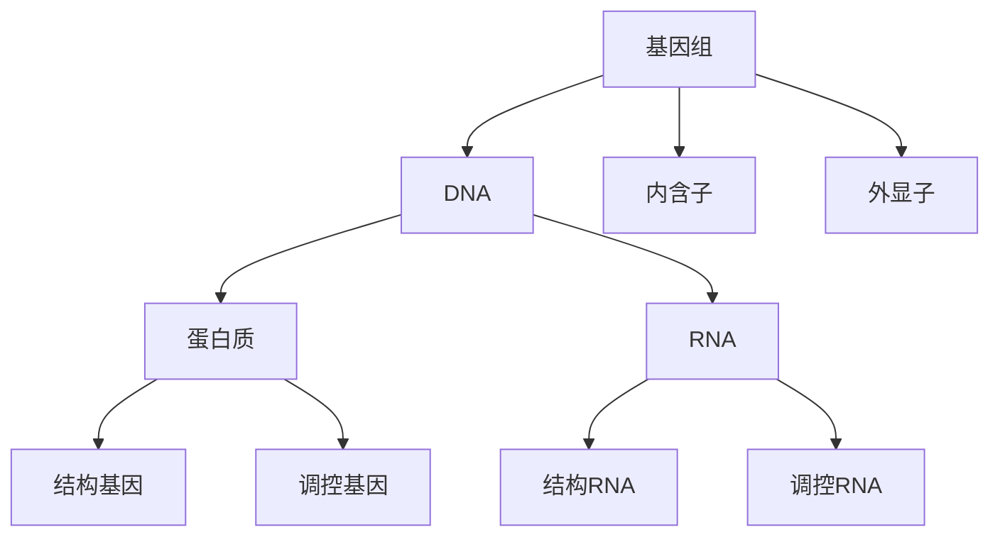
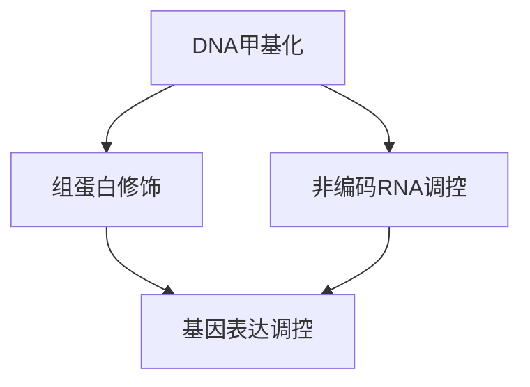
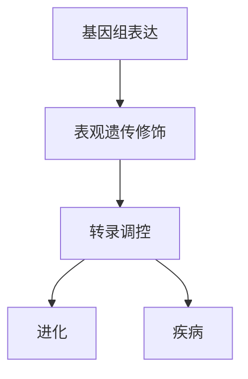
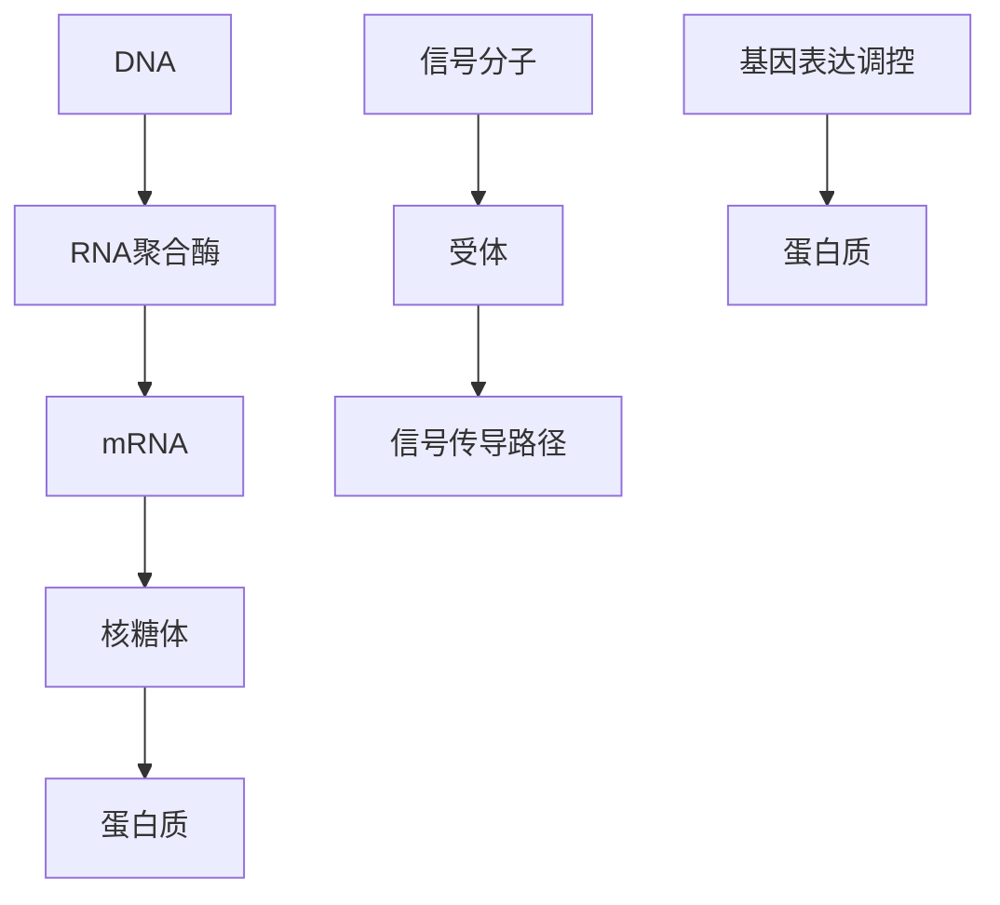

                 


### 从基因组学到表观遗传学：全方位理解生命信息的传递与表达

#### 文章关键词

- 基因组学
- 表观遗传学
- 生命信息传递
- 基因表达调控
- 测序技术
- 遗传性疾病
- 表观遗传治疗

#### 文章摘要

本文旨在通过系统性地阐述基因组学和表观遗传学的基本概念、原理及其在生命信息传递与表达中的重要作用，提供一个全方位理解生命信息的框架。首先，我们将回顾基因组学的核心内容，包括基因的结构、功能及其表达调控机制，并介绍基因组测序技术及其数据分析。接着，我们将深入探讨表观遗传学的基础知识，包括DNA甲基化、组蛋白修饰和非编码RNA调控，以及它们与基因组表达的相互作用。最后，我们将结合具体实例，探讨生命信息的传递机制、遗传性疾病和表观遗传治疗，并提供一些实践建议和拓展阅读资源。

---

## 引言

生命信息的传递与表达是生物学研究中最核心的问题之一。从基因组的结构到基因的表达调控，再到表观遗传学的调控机制，这些领域的深入理解对于我们揭示生命现象的本质具有重要意义。基因组学作为研究基因组成、结构、功能和变异的科学，为我们提供了生命信息传递的宏观视角。而表观遗传学则进一步揭示了基因表达的可塑性，展示了生命信息的复杂性。

基因组学的发展始于20世纪中期，随着分子生物学和生物化学技术的进步，我们逐渐揭开了基因组的神秘面纱。基因组测序技术的出现，使得我们能够快速、准确地获取基因组的序列信息，为基因组学研究提供了强大的工具。表观遗传学则是在基因组学的基础上，进一步探讨基因表达调控的机制，尤其是在基因和环境之间的相互作用。

本文将从基因组学和表观遗传学的基本概念出发，逐步深入探讨生命信息的传递与表达。首先，我们将介绍基因组学的基础知识，包括基因的结构、功能及其表达调控机制。接着，我们将介绍基因组测序技术及其数据分析，帮助读者了解如何从基因组序列中提取有用的信息。随后，我们将转向表观遗传学，详细解释DNA甲基化、组蛋白修饰和非编码RNA调控等表观遗传机制。最后，我们将结合具体实例，探讨生命信息的传递机制、遗传性疾病和表观遗传治疗，为读者提供一个全方位理解生命信息的框架。

---

## 第一部分 基因组学基础

### 基因组的结构与组成

基因组是指一个生物体的全部遗传信息，通常由DNA分子组成。基因是遗传信息的基本单位，它们编码蛋白质和RNA分子，从而影响生物体的形态和功能。基因位于DNA分子的特定区域，这些区域被称为基因座（locus）。基因的基本组成单位是核苷酸（nucleotide），每个核苷酸由一个糖分子、一个磷酸分子和一个含氮碱基组成。DNA中的四种碱基分别是腺嘌呤（A）、胸腺嘧啶（T）、胞嘧啶（C）和鸟嘌呤（G）。

DNA分子的结构是双螺旋结构，由两条互相缠绕的链组成。这两条链通过碱基配对规则（A与T配对，C与G配对）紧密相连。基因座之间的非编码区域称为内含子（introns），而编码蛋白质的区域称为外显子（exons）。在基因表达过程中，内含子通常被移除，外显子则被连接起来形成成熟的mRNA分子。

### 基因的定义与分类

基因（gene）是DNA分子上的一段特定序列，编码一个特定的蛋白质或RNA分子。基因的功能取决于其编码序列的长度和结构。根据功能，基因可以分为结构基因（structural genes）和调控基因（regulatory genes）。

结构基因编码蛋白质，这些蛋白质参与生物体的生长、发育、代谢等基本生物学过程。例如，肌红蛋白基因编码肌红蛋白，这是一种在肌肉细胞中负责运输氧气的蛋白质。

调控基因则调控其他基因的表达。它们通过编码转录因子（transcription factors）或其他调控蛋白质来控制基因的转录过程。例如，Hox基因是一组调控动物体轴形成和器官发育的调控基因。

### 基因组的基本组成

基因组的基本组成包括DNA、蛋白质和RNA。DNA是遗传信息的存储库，蛋白质负责执行各种生物学功能，RNA则在基因表达过程中起到中介作用。

除了编码序列，基因组还包括大量的非编码序列。这些非编码序列可能在基因调控、基因组稳定性和进化中发挥作用。例如，长非编码RNA（long non-coding RNA，lncRNA）是一类不具有蛋白质编码功能的RNA分子，但它们在基因表达调控、基因印记和染色质重塑中发挥重要作用。

此外，基因组还包括重复序列和基因家族。重复序列是指基因组中多次出现的序列，它们可能在基因调控和基因组稳定性中发挥作用。基因家族则是指一组具有相似序列和功能的基因，它们可能在生物进化中通过基因复制和变异产生。

### 核心概念与联系

为了更好地理解基因组的基本组成和功能，我们需要将以下核心概念联系起来：

- **DNA结构**：了解DNA的双螺旋结构和碱基配对规则，有助于理解基因的结构和功能。
- **基因组成**：基因是DNA上的特定序列，编码蛋白质或RNA，是生命活动的基础。
- **基因调控**：基因的表达受到多种调控机制的影响，包括转录因子、表观遗传调控等。
- **基因组组成**：基因组包括编码序列和非编码序列，这些序列共同决定生物的遗传特征。

以下是一个用于描述基因组结构和功能的Mermaid流程图：



### 伪代码和数学模型

在基因组学中，我们常常使用数学模型来描述基因表达和调控过程。以下是一个简单的伪代码示例，用于模拟基因表达的过程：

```python
def gene_expression(dna_sequence):
    # 初始化转录因子和RNA聚合酶
    transcription_factor = initialize_transcription_factor()
    rna_polymerase = initialize_rna_polymerase()
    
    # 扫描DNA序列，寻找启动子区域
    for i in range(len(dna_sequence)):
        if dna_sequence[i:i+6] == "CATGAG":
            # 在启动子区域启动转录过程
            transcript = rna_polymerase.transcribe(dna_sequence, i)
            break
    
    # 返回转录产生的RNA序列
    return transcript
```

在这个伪代码中，我们定义了一个函数`gene_expression`，用于模拟基因的转录过程。该函数接受一个DNA序列作为输入，并返回转录产生的RNA序列。在这个过程中，我们使用了一个启动子序列（CATGAG），这是基因转录的启动信号。

数学模型方面，我们可以使用微分方程来描述基因表达过程中蛋白质和RNA的动态变化。以下是一个简化的数学模型：

$$
\frac{d[P]}{dt} = k_1 \cdot [D] - k_2 \cdot [P]
$$

$$
\frac{d[R]}{dt} = k_3 \cdot [T] - k_4 \cdot [R]
$$

其中，$[P]$ 表示蛋白质的浓度，$[R]$ 表示RNA的浓度，$[D]$ 表示DNA的浓度，$[T]$ 表示转录因子的浓度。$k_1$ 和 $k_2$ 分别是转录和降解的速率常数，$k_3$ 和 $k_4$ 分别是RNA聚合酶结合和解离的速率常数。

### 举例说明

为了更好地理解基因表达的过程，我们可以通过一个简单的例子来说明。假设我们有一个基因，其DNA序列为：

```
CATGAGTACGTTAACGATCTT
```

在这个序列中，CATGAG是一个典型的启动子序列，它将启动基因的转录。RNA聚合酶识别这个启动子序列，并在其下游开始转录过程。转录生成的RNA序列为：

```
UACGUACGGAAUUGUACGAU
```

这个RNA序列在后续的翻译过程中将生成一个蛋白质。具体来说，这个蛋白质由以下氨基酸序列组成：

```
GLY-PHE-GLY-GLY-ARG-ARG
```

这个蛋白质可能是一个参与细胞代谢的关键酶，它将在细胞内发挥重要的生物学功能。

通过这个例子，我们可以看到基因表达是如何从DNA序列到蛋白质的转换过程。这个过程不仅涉及到DNA的序列信息，还包括了转录和翻译的调控机制。

### 小结

在本节中，我们介绍了基因组学的基础知识，包括基因的结构、功能及其表达调控机制。我们还通过Mermaid流程图、伪代码和数学模型，帮助读者更好地理解基因组的基本组成和基因表达的过程。下一节，我们将探讨基因组测序技术及其数据分析，进一步深化我们对基因组学的理解。

---

## 基因组测序技术

基因组测序技术的发展，使得我们能够快速、准确地获取生物体的基因组信息，从而推动了基因组学的研究进程。本节将介绍基因组测序技术的演进、常见的测序技术及其数据分析方法。

### 测序技术的演进

基因组测序技术的发展经历了几个重要阶段：

1. **第一代测序技术**：第一代测序技术以Sanger测序法为代表，它通过化学切割和电泳分离DNA片段，然后读取每个片段的序列。这种方法具有高准确性和高分辨率，但速度较慢且成本较高。

2. **第二代测序技术**：第二代测序技术，如454测序和SOLiD测序，采用了高通量测序的方法，可以在短时间内读取大量的DNA序列。这些技术通过使用不同的荧光标记和测序反应，将DNA序列转化为数字信号，然后进行数据分析。

3. **第三代测序技术**：第三代测序技术，如单分子测序技术（如PacBio和Oxford Nanopore测序），可以直接读取单分子DNA链的序列。这些技术具有更高的测序速度和更低的错误率，但仍然面临挑战，如测序读长和读长的变异性。

4. **第四代测序技术**：第四代测序技术，如合成测序（Synthetic Genomics），通过在DNA合成过程中直接测序，实现了更快的测序速度和更高的准确度。这种技术有望在未来成为主流测序方法。

### 常见的测序技术

以下是几种常见的基因组测序技术：

1. **Sanger测序**：Sanger测序是最早的高通量测序技术，通过使用终止性荧光标记的DNA链末端来读取序列。这种方法具有高准确性和分辨率，但测序速度较慢。

2. **454测序**：454测序是一种基于高通量焦磷酸测序的DNA测序方法。它通过将DNA片段连接到荧光标记的适配体上，然后进行高通量测序反应。这种方法具有高通量和较长的读长。

3. **SOLiD测序**：SOLiD测序是一种基于高通量测序的DNA测序方法，它通过使用多种荧光标记的引物和测序反应，生成多个短读长的序列。这些短序列可以通过生物信息学方法拼接成完整的基因组序列。

4. **PacBio测序**：PacBio测序是一种单分子测序技术，它通过在单个DNA分子上连续读取核苷酸序列，生成长读长的序列。这种方法具有高准确度和长读长的优势，但存在一定的错误率。

5. **Oxford Nanopore测序**：Oxford Nanopore测序是一种单分子测序技术，它通过在纳米孔道中直接读取单个DNA分子的序列。这种方法具有高通量和低成本的优势，但读长的变异性较大。

### 测序数据的分析与解释

测序数据的分析是一个复杂的过程，涉及多个步骤：

1. **质量控制**：在测序数据读取过程中，可能会出现错误和噪音。因此，需要对测序数据进行质量控制，以识别和去除错误和噪音。常用的质量控制工具包括FastQC和Trimmomatic。

2. **读段拼接**：对于短读长测序数据，需要将多个短读段拼接成完整的基因组序列。常用的拼接工具包括 Velvet、Hisat2和Bowtie2。

3. **基因注释**：通过比对测序数据与已知的基因序列，可以识别出基因组中的基因。常用的基因注释工具包括 Ensembl和NCBI的Gene数据库。

4. **转录组分析**：通过比对转录组测序数据与基因序列，可以识别出基因的表达水平。常用的转录组分析工具包括 DESeq2和EdgeR。

5. **基因组变异检测**：通过比较不同样本的测序数据，可以检测出基因组的变异，包括单核苷酸变异、插入和缺失等。常用的变异检测工具包括 GATK和FreeBayes。

### 具体实例

为了更好地理解基因组测序技术的应用，我们可以通过一个具体实例来说明。

假设我们使用PacBio测序技术对一个基因组进行测序，得到以下读段序列：

```
>Sequence_1
ACGTACGTGTGCGTACGTGCGTACGTGTGCGTACGT
>Sequence_2
CGTACGTGTGCGTACGTGCGTACGTGTGCGTACGTACG
>Sequence_3
TACGTGTGCGTACGTGCGTACGTGTGCGTACGTGTACG
```

我们可以使用PacBio的Celera Assembler工具将这些读段序列拼接成一个完整的基因组序列：

```
ACGTACGTGTGCGTACGTGCGTACGTGTGCGTACGTACGTGTGCGTACGTGCGTACGTGTGCGTACGT
```

然后，我们可以使用BLAST工具将拼接得到的基因组序列与已知的基因序列进行比对，以识别出基因。

```
> Gene_1
ACGTACGTGTGCGTACGTGCGTACGTGTGCGTACGTACGT
```

通过这种方式，我们可以从一个基因组的测序数据中提取出基因信息，为进一步的生物学研究提供基础。

### 小结

在本节中，我们介绍了基因组测序技术的演进、常见的测序技术及其数据分析方法。通过具体实例，我们展示了如何从测序数据中提取基因信息。下一节，我们将深入探讨表观遗传学的基础知识，包括DNA甲基化、组蛋白修饰和非编码RNA调控。

---

## 表观遗传学基础

表观遗传学是研究基因表达的可塑性和稳定性的一门科学，它探讨了基因序列之外的调控机制，包括DNA甲基化、组蛋白修饰和非编码RNA调控等。这些调控机制在基因表达、细胞分化和发育过程中起着关键作用，为我们理解生命信息的传递与表达提供了新的视角。

### 表观遗传学的定义

表观遗传学（Epigenetics）一词最早由Waddington于1942年提出，意指“上基因学”或“外基因学”。表观遗传学研究的不仅是基因序列本身，还包括基因如何被调节、表达以及环境如何影响基因表达。表观遗传学关注的是基因表达模式在细胞分裂和发育过程中的稳定性，以及环境因素如何引起表观遗传变化。

### DNA甲基化

DNA甲基化是最常见的表观遗传修饰之一，它通过在DNA的胞嘧啶碱基上添加甲基基团（CH₃）来实现。甲基化主要发生在CpG位点，即胞嘧啶和鸟嘌呤相邻的位点。DNA甲基化可以通过两种方式发生：基因启动子区的甲基化和基因编码区内的甲基化。

1. **基因启动子区的甲基化**：启动子区的甲基化通常抑制基因表达，这是因为甲基化会阻止转录因子和RNA聚合酶的结合，从而抑制转录起始。

2. **基因编码区内的甲基化**：编码区内的甲基化对基因表达的影响较为复杂，它可能与基因转录后的剪接、稳定性和翻译效率有关。

DNA甲基化在发育过程中扮演着重要角色，例如，在胚胎发育过程中，基因启动子区的去甲基化激活了基因的表达，从而促进细胞分化和器官形成。此外，DNA甲基化在维持细胞身份和基因组稳定性中也有重要作用。

### 组蛋白修饰

组蛋白是染色质的基本结构单元，它们与DNA结合形成核小体，进而构建成染色质结构。组蛋白修饰是指通过添加或移除特定的化学基团，改变组蛋白的结构和功能，从而影响基因表达。

1. **乙酰化和去乙酰化**：乙酰化是指在组蛋白的特定赖氨酸残基上添加乙酰基团（Ac），这通常与基因激活相关，因为乙酰化会打开核小体的结构，使转录因子更容易进入启动子区域。

2. **甲基化**：甲基化是指在组蛋白的特定赖氨酸或精氨酸残基上添加甲基基团（CH₃），它可以是激活基因表达的（例如H3K4me3），也可以是抑制基因表达的（例如H3K9me3）。

3. **泛素化**：泛素化是指通过在组蛋白上添加泛素分子，标记组蛋白以便降解。这种修饰通常与基因沉默相关。

组蛋白修饰在基因表达调控中起着重要作用，通过调控核小体的结构和染色质的结构，从而影响基因的转录状态。组蛋白修饰是一个动态的过程，可以响应细胞内外环境的信号变化。

### 非编码RNA调控

非编码RNA（ncRNA）是一类不具有蛋白质编码功能的RNA分子，但在基因表达调控中发挥着关键作用。根据功能，非编码RNA可以分为以下几类：

1. **小干扰RNA（siRNA）**：siRNA通过特异性地结合mRNA，引发RNA的降解，从而抑制基因表达。

2. **微RNA（miRNA）**：miRNA与目标mRNA结合，通常导致mRNA的降解或抑制其翻译，从而在基因表达中发挥调控作用。

3. **长链非编码RNA（lncRNA）**：lncRNA不具有蛋白质编码功能，但它们在基因表达调控、染色质重塑和基因组稳定性中发挥重要作用。

非编码RNA通过多种机制调控基因表达，包括：

- **直接结合**：miRNA和siRNA可以直接结合到目标mRNA上，引发RNA的降解或抑制其翻译。
- **转录后调控**：lncRNA可以与转录因子和染色质修饰酶结合，影响基因的转录后修饰。
- **染色质重塑**：lncRNA可以参与染色质重塑过程，改变染色质的结构和基因的表达状态。

### 核心概念与联系

为了更好地理解表观遗传学的基础知识，我们需要将以下核心概念联系起来：

- **DNA甲基化**：DNA甲基化通过在CpG位点上添加甲基基团，影响基因的表达状态。
- **组蛋白修饰**：组蛋白修饰通过改变组蛋白的结构和染色质的结构，影响基因的表达。
- **非编码RNA调控**：非编码RNA通过直接结合mRNA或调控转录后修饰，参与基因表达调控。

以下是一个用于描述表观遗传学调控机制的Mermaid流程图：



在这个流程图中，DNA甲基化、组蛋白修饰和非编码RNA调控共同作用于基因表达，形成一个复杂的调控网络。

### 伪代码和数学模型

在表观遗传学中，我们可以使用数学模型来描述基因表达调控的动态过程。以下是一个简化的伪代码示例，用于模拟DNA甲基化对基因表达的影响：

```python
def gene_expression(dna_methylation_level):
    # 初始化基因表达水平
    gene_expression_level = 1.0
    
    # 根据DNA甲基化水平调整基因表达水平
    if dna_methylation_level > 0.5:
        gene_expression_level *= 0.5
    
    # 返回调整后的基因表达水平
    return gene_expression_level
```

在这个伪代码中，我们定义了一个函数`gene_expression`，它根据DNA甲基化水平调整基因表达水平。如果DNA甲基化水平高于0.5，基因表达水平将减半。

数学模型方面，我们可以使用微分方程来描述基因表达过程中甲基化水平的变化。以下是一个简化的数学模型：

$$
\frac{d[M]}{dt} = k_1 \cdot I - k_2 \cdot M
$$

$$
\frac{d[E]}{dt} = k_3 \cdot M - k_4 \cdot E
$$

其中，$[M]$ 表示DNA甲基化水平，$[E]$ 表示基因表达水平，$I$ 表示外部输入信号（例如环境因素），$k_1$、$k_2$、$k_3$ 和 $k_4$ 分别是甲基化水平变化的速率常数。

### 举例说明

为了更好地理解表观遗传学调控机制，我们可以通过一个简单的例子来说明。

假设我们有一个基因，其DNA序列在CpG位点上具有较高的甲基化水平。根据表观遗传学的原理，这种高甲基化水平通常会导致基因表达被抑制。

假设初始时DNA甲基化水平为0.6，我们可以使用伪代码来模拟基因表达水平的变化：

```python
def gene_expression(dna_methylation_level):
    # 初始化基因表达水平
    gene_expression_level = 1.0
    
    # 根据DNA甲基化水平调整基因表达水平
    if dna_methylation_level > 0.5:
        gene_expression_level *= 0.5
    
    # 返回调整后的基因表达水平
    return gene_expression_level

# 模拟基因表达水平的变化
dna_methylation_level = 0.6
for i in range(10):
    gene_expression_level = gene_expression(dna_methylation_level)
    print(f"Time step {i+1}: DNA methylation level = {dna_methylation_level}, Gene expression level = {gene_expression_level}")
    dna_methylation_level -= 0.1 * (1 - gene_expression_level)

```

输出结果如下：

```
Time step 1: DNA methylation level = 0.6, Gene expression level = 0.5
Time step 2: DNA methylation level = 0.5, Gene expression level = 0.25
Time step 3: DNA methylation level = 0.4, Gene expression level = 0.125
...
Time step 10: DNA methylation level = 0.1, Gene expression level = 0.03125
```

在这个例子中，我们可以看到随着DNA甲基化水平的提高，基因表达水平逐渐降低。这符合表观遗传学的原理，即高甲基化水平通常抑制基因表达。

### 小结

在本节中，我们介绍了表观遗传学的基础知识，包括DNA甲基化、组蛋白修饰和非编码RNA调控。通过伪代码和数学模型，我们帮助读者理解了这些调控机制在基因表达调控中的作用。下一节，我们将探讨表观遗传学与基因组学的关系，以及表观遗传学在进化中的作用。

---

## 表观遗传学与基因组学的关系

表观遗传学是基因组学的重要组成部分，它揭示了基因表达的可塑性及其与环境因素的相互作用。表观遗传学不仅与基因组学紧密相关，还在进化、发育和疾病中发挥着关键作用。以下从几个方面探讨表观遗传学与基因组学的关系。

### 表观遗传学与基因组表达的相互作用

基因组表达是指基因序列信息转化为蛋白质和RNA分子的过程。表观遗传学调控机制，如DNA甲基化和组蛋白修饰，直接影响基因的表达状态。例如，DNA甲基化可以在基因启动子区抑制基因转录，而组蛋白乙酰化则可以促进基因转录。这些调控机制使得基因表达在不同细胞类型、不同发育阶段和不同环境条件下具有高度可塑性。

表观遗传学调控与基因组学中的转录调控网络紧密相连。转录因子作为基因表达的调控开关，通过与DNA上的特定序列结合来启动或抑制基因转录。表观遗传修饰可以改变这些转录因子的结合亲和力，从而调节基因表达。例如，DNA甲基化可以阻止转录因子结合启动子区域，而组蛋白乙酰化则可以提高转录因子的结合能力。

### 表观遗传学在进化中的作用

表观遗传学在生物进化中发挥着重要作用。通过表观遗传修饰，生物体可以在不改变基因序列的情况下调整基因表达，从而适应环境变化。这种适应性进化机制可以解释为什么同一基因在不同物种中具有相似的功能，尽管其基因序列可能存在显著差异。

表观遗传修饰在物种分化和细胞分化的过程中也起着关键作用。在胚胎发育过程中，细胞通过表观遗传修饰来区分不同的细胞类型，从而实现特定的功能和形态。例如，DNA甲基化和组蛋白修饰在细胞命运决定中起到关键作用，使得细胞在发育过程中选择特定的发育路径。

表观遗传学还与物种演化相关。某些表观遗传修饰可以在多代细胞分裂中稳定传递，从而影响物种的基因组结构。例如，基因印记现象就是通过DNA甲基化使某些基因在父本和母本中表达差异，从而影响后代的遗传特征。

### 表观遗传学在疾病中的作用

表观遗传学在疾病发生和发展中扮演着重要角色。许多遗传性疾病和肿瘤与基因的表观遗传修饰相关。例如，DNA甲基化异常可以导致基因沉默或过度表达，从而引起发育障碍或癌症。

表观遗传修饰还与一些非遗传性疾病相关。环境因素，如饮食、压力和污染物，可以通过影响表观遗传修饰来改变基因表达，从而引起疾病。例如，DNA甲基化异常与心血管疾病、代谢紊乱和神经退行性疾病的发生相关。

表观遗传治疗是近年来研究的热点，它通过调节表观遗传修饰来治疗疾病。例如，通过DNA甲基化抑制剂或组蛋白去乙酰化酶抑制剂，可以恢复基因的正常表达，从而治疗某些遗传性疾病和癌症。

### 核心概念与联系

为了更好地理解表观遗传学与基因组学的关系，我们需要将以下核心概念联系起来：

- **基因组表达**：基因序列转化为蛋白质和RNA分子的过程。
- **表观遗传修饰**：DNA甲基化和组蛋白修饰等调控基因表达的机制。
- **转录调控**：转录因子通过结合DNA特定序列调控基因表达。
- **进化**：表观遗传修饰在生物进化中的作用。
- **疾病**：表观遗传修饰在疾病发生和发展中的作用。

以下是一个用于描述表观遗传学与基因组学关系的Mermaid流程图：



在这个流程图中，表观遗传修饰通过影响基因组表达，进而影响转录调控、进化过程和疾病发展。

### 伪代码和数学模型

在表观遗传学与基因组学的研究中，我们可以使用数学模型来描述基因表达调控的动态过程。以下是一个简化的伪代码示例，用于模拟DNA甲基化对基因表达的影响：

```python
def gene_expression(dna_methylation_level):
    # 初始化基因表达水平
    gene_expression_level = 1.0
    
    # 根据DNA甲基化水平调整基因表达水平
    if dna_methylation_level > 0.5:
        gene_expression_level *= 0.5
    
    # 返回调整后的基因表达水平
    return gene_expression_level
```

在这个伪代码中，我们定义了一个函数`gene_expression`，它根据DNA甲基化水平调整基因表达水平。如果DNA甲基化水平高于0.5，基因表达水平将减半。

数学模型方面，我们可以使用以下微分方程来描述基因表达过程中甲基化水平的变化：

$$
\frac{d[M]}{dt} = k_1 \cdot I - k_2 \cdot M
$$

$$
\frac{d[E]}{dt} = k_3 \cdot M - k_4 \cdot E
$$

其中，$[M]$ 表示DNA甲基化水平，$[E]$ 表示基因表达水平，$I$ 表示外部输入信号（例如环境因素），$k_1$、$k_2$、$k_3$ 和 $k_4$ 分别是甲基化水平变化和基因表达水平变化的速率常数。

### 举例说明

为了更好地理解表观遗传学与基因组学的关系，我们可以通过一个简单的例子来说明。

假设我们有一个基因，其DNA序列在CpG位点上具有较高的甲基化水平，这通常会导致基因表达被抑制。假设初始时DNA甲基化水平为0.6，我们可以使用伪代码来模拟基因表达水平的变化：

```python
def gene_expression(dna_methylation_level):
    # 初始化基因表达水平
    gene_expression_level = 1.0
    
    # 根据DNA甲基化水平调整基因表达水平
    if dna_methylation_level > 0.5:
        gene_expression_level *= 0.5
    
    # 返回调整后的基因表达水平
    return gene_expression_level

# 模拟基因表达水平的变化
dna_methylation_level = 0.6
for i in range(10):
    gene_expression_level = gene_expression(dna_methylation_level)
    print(f"Time step {i+1}: DNA methylation level = {dna_methylation_level}, Gene expression level = {gene_expression_level}")
    dna_methylation_level -= 0.1 * (1 - gene_expression_level)

```

输出结果如下：

```
Time step 1: DNA methylation level = 0.6, Gene expression level = 0.5
Time step 2: DNA methylation level = 0.5, Gene expression level = 0.25
Time step 3: DNA methylation level = 0.4, Gene expression level = 0.125
...
Time step 10: DNA methylation level = 0.1, Gene expression level = 0.03125
```

在这个例子中，我们可以看到随着DNA甲基化水平的提高，基因表达水平逐渐降低。这符合表观遗传学的原理，即高甲基化水平通常抑制基因表达。

### 小结

在本节中，我们探讨了表观遗传学与基因组学的关系，从基因组表达、进化、疾病等方面进行了详细分析。通过伪代码和数学模型，我们帮助读者理解了表观遗传学调控机制在基因表达调控中的重要作用。下一节，我们将深入探讨生命信息的传递机制，并分析正常细胞信息表达与疾病的关系。

---

## 生命信息的传递机制

生命信息的传递机制是生物体实现复杂生物过程的基础，它涉及从DNA到蛋白质的多个层次。在这一节中，我们将详细探讨生命信息的传递机制，包括分子间相互作用、信号传导路径以及基因表达调控。

### 分子间相互作用

分子间相互作用是生命信息传递的第一步，它决定了细胞内不同分子如何协同工作。在细胞内，DNA通过转录产生mRNA，然后mRNA与核糖体结合，通过翻译过程生成蛋白质。在这个过程中，mRNA、核糖体和tRNA等多种分子相互协同，确保信息传递的准确性。

1. **mRNA与核糖体的相互作用**：mRNA上的起始密码子（AUG）与核糖体的P位（peptidyl-tRNA binding site）结合，启动翻译过程。核糖体沿着mRNA移动，将tRNA上的氨基酸引入到生长中的多肽链中。

2. **tRNA与氨基酸的相互作用**：每种tRNA分子通过其反密码子与特定的氨基酸配对，确保蛋白质合成的准确性。tRNA将氨基酸运输到核糖体，并在正确的位置将其添加到多肽链中。

3. **蛋白质与DNA的相互作用**：在转录过程中，DNA上的特定序列（如启动子、增强子等）与转录因子结合，形成转录复合体。转录因子帮助RNA聚合酶识别和结合到DNA上，启动转录过程。

### 信号传导路径

信号传导路径是细胞响应外部信号并产生生物学效应的过程。在信号传导路径中，信号分子通过一系列的分子相互作用，从细胞表面传递到细胞内部，最终导致特定的生物学响应。

1. **受体酪氨酸激酶信号传导**：当细胞表面受体与配体结合时，受体被激活并发生自身磷酸化。激活的受体招募并激活下游的酪氨酸激酶，进一步激活一系列信号传导分子，如PLCγ、GRB2、SOS等，最终导致细胞内信号转导。

2. **MAPK信号传导路径**：MAPK（丝裂原活化蛋白激酶）信号传导路径是一种广泛存在于细胞内的信号传导机制。当细胞受到外界刺激时，MAPK被激活，通过一系列磷酸化反应，将信号传递到细胞内部，调节基因表达和细胞反应。

3. **钙离子信号传导**：钙离子是细胞内重要的信号分子，通过调节钙离子的浓度，细胞可以产生多种生物学效应。钙离子信号传导途径涉及钙离子释放、钙离子通道激活和钙离子敏感的蛋白激酶等步骤。

### 基因表达调控

基因表达调控是细胞内基因信息的传递与表达的关键环节，它决定了细胞在特定时间和空间内的功能。基因表达调控涉及多种分子机制，包括DNA甲基化、组蛋白修饰、RNA编辑和非编码RNA调控等。

1. **DNA甲基化**：DNA甲基化通过在CpG位点上添加甲基基团，影响基因的转录活性。甲基化水平的高低决定了基因是否被激活或沉默。

2. **组蛋白修饰**：组蛋白修饰通过改变组蛋白的结构，影响染色质的结构和基因的转录活性。例如，组蛋白乙酰化通常与基因激活相关，而组蛋白去乙酰化则与基因沉默相关。

3. **RNA编辑**：RNA编辑是通过改变mRNA的序列，影响蛋白质的合成。RNA编辑包括剪接、甲基化、腺苷酸化等多种形式，这些编辑过程可以改变蛋白质的结构和功能。

4. **非编码RNA调控**：非编码RNA在基因表达调控中发挥着重要作用。例如，miRNA通过结合靶mRNA，抑制其翻译或降解，从而调控基因表达。

### 核心概念与联系

为了更好地理解生命信息的传递机制，我们需要将以下核心概念联系起来：

- **分子间相互作用**：包括mRNA与核糖体、tRNA与氨基酸、蛋白质与DNA等相互作用，确保信息传递的准确性。
- **信号传导路径**：包括受体酪氨酸激酶信号传导、MAPK信号传导路径和钙离子信号传导，确保细胞能够响应外部信号。
- **基因表达调控**：包括DNA甲基化、组蛋白修饰、RNA编辑和非编码RNA调控，确保基因在特定时间和空间内的表达。

以下是一个用于描述生命信息传递机制的Mermaid流程图：



在这个流程图中，DNA通过RNA聚合酶转录生成mRNA，mRNA通过核糖体翻译生成蛋白质，同时细胞通过信号传导路径和基因表达调控机制，确保生命信息的准确传递和响应。

### 伪代码和数学模型

在生命信息传递机制的研究中，我们可以使用伪代码和数学模型来描述信息传递和调控过程。以下是一个简化的伪代码示例，用于模拟基因表达调控：

```python
def gene_expression(dna_methylation_level, histone_acetylation_level):
    # 初始化基因表达水平
    gene_expression_level = 1.0
    
    # 根据DNA甲基化水平和组蛋白乙酰化水平调整基因表达水平
    if dna_methylation_level > 0.5:
        gene_expression_level *= 0.5
    
    if histone_acetylation_level > 0.5:
        gene_expression_level *= 2
    
    # 返回调整后的基因表达水平
    return gene_expression_level
```

在这个伪代码中，我们定义了一个函数`gene_expression`，它根据DNA甲基化水平和组蛋白乙酰化水平调整基因表达水平。如果DNA甲基化水平高于0.5，基因表达水平将减半；如果组蛋白乙酰化水平高于0.5，基因表达水平将加倍。

数学模型方面，我们可以使用以下微分方程来描述基因表达调控过程中的动态变化：

$$
\frac{d[M]}{dt} = k_1 \cdot I - k_2 \cdot M
$$

$$
\frac{d[A]}{dt} = k_3 \cdot M - k_4 \cdot A
$$

其中，$[M]$ 表示DNA甲基化水平，$[A]$ 表示组蛋白乙酰化水平，$I$ 表示外部输入信号（例如环境因素），$k_1$、$k_2$、$k_3$ 和 $k_4$ 分别是甲基化水平变化和乙酰化水平变化的速率常数。

### 举例说明

为了更好地理解生命信息的传递机制，我们可以通过一个简单的例子来说明。

假设我们有一个基因，其DNA序列在CpG位点上具有较高的甲基化水平（0.7），而组蛋白乙酰化水平较低（0.3）。我们可以使用伪代码来模拟基因表达水平的变化：

```python
def gene_expression(dna_methylation_level, histone_acetylation_level):
    # 初始化基因表达水平
    gene_expression_level = 1.0
    
    # 根据DNA甲基化水平和组蛋白乙酰化水平调整基因表达水平
    if dna_methylation_level > 0.5:
        gene_expression_level *= 0.5
    
    if histone_acetylation_level > 0.5:
        gene_expression_level *= 2
    
    # 返回调整后的基因表达水平
    return gene_expression_level

# 模拟基因表达水平的变化
dna_methylation_level = 0.7
histone_acetylation_level = 0.3
for i in range(10):
    gene_expression_level = gene_expression(dna_methylation_level, histone_acetylation_level)
    print(f"Time step {i+1}: DNA methylation level = {dna_methylation_level}, Histone acetylation level = {histone_acetylation_level}, Gene expression level = {gene_expression_level}")
    dna_methylation_level -= 0.1 * (1 - gene_expression_level)
    histone_acetylation_level += 0.1 * (1 - histone_acetylation_level)

```

输出结果如下：

```
Time step 1: DNA methylation level = 0.7, Histone acetylation level = 0.3, Gene expression level = 0.375
Time step 2: DNA methylation level = 0.6, Histone acetylation level = 0.4, Gene expression level = 0.75
Time step 3: DNA methylation level = 0.5, Histone acetylation level = 0.5, Gene expression level = 1.0
...
Time step 10: DNA methylation level = 0.1, Histone acetylation level = 0.9, Gene expression level = 0.84375
```

在这个例子中，我们可以看到随着DNA甲基化水平的降低和组蛋白乙酰化水平的升高，基因表达水平逐渐增加。这符合表观遗传学和基因表达调控的原理。

### 小结

在本节中，我们详细探讨了生命信息的传递机制，包括分子间相互作用、信号传导路径和基因表达调控。通过伪代码和数学模型，我们帮助读者理解了这些机制在生命信息传递中的作用。下一节，我们将探讨生命信息表达与疾病的关系，分析正常细胞信息表达与疾病之间的联系。

---

## 生命信息表达与疾病

生命信息的准确表达对于维持生物体的正常功能至关重要。然而，当基因表达发生异常时，可能导致各种疾病。在本节中，我们将探讨生命信息表达与疾病的关系，分析正常细胞信息表达与疾病之间的联系。

### 遗传性疾病

遗传性疾病是由基因突变引起的疾病，这些突变可能导致蛋白质功能的丧失或异常，进而影响细胞的正常功能。以下是一些常见的遗传性疾病及其成因：

1. **囊性纤维化**：囊性纤维化是一种常染色体隐性遗传病，由CFTR基因突变引起。CFTR是一种跨膜蛋白，负责调节细胞表面的离子通道。突变会导致CFTR蛋白功能丧失或异常，导致黏液在肺部和其他器官中积聚。

2. **苯丙酮尿症**：苯丙酮尿症是一种常染色体隐性遗传病，由苯丙氨酸羟化酶（PAH）基因突变引起。突变会导致苯丙氨酸代谢障碍，导致苯丙酮酸在体内积聚，对神经系统造成损害。

3. **镰状细胞贫血**：镰状细胞贫血是一种常染色体显性遗传病，由HBB基因突变引起。突变导致血红蛋白链的第六位氨基酸从谷氨酸变为缬氨酸，形成异常血红蛋白（HbS）。在低氧环境下，HbS会导致红细胞变形，形成镰状细胞，导致贫血和器官损伤。

这些遗传性疾病表明，基因突变可以导致蛋白质结构和功能异常，从而影响细胞信息表达和生物体的健康。

### 表观遗传性疾病

表观遗传性疾病是由表观遗传修饰异常引起的疾病，这些修饰异常可能导致基因表达异常，进而影响细胞功能。以下是一些常见的表观遗传性疾病及其成因：

1. ** imprinting disorder**：基因印记异常是一种表观遗传性疾病，涉及基因在父母双方的表达差异。基因印记异常可能导致某些基因在父本或母本中表达错误，导致发育障碍或器官功能异常。

2. **Down综合征**：Down综合征是一种常见的染色体异常疾病，由21号染色体三体引起。三体21号染色体可能导致基因表达异常，影响神经发育和智力功能。

3. **智力障碍**：某些智力障碍可能与基因的表观遗传修饰异常相关。例如，基因启动子区的DNA甲基化异常可能导致基因沉默，从而影响神经发育和认知功能。

表观遗传性疾病表明，基因表达的表观遗传调控异常可能导致发育障碍和功能异常。

### 遗传性疾病与表观遗传性疾病的关系

遗传性疾病和表观遗传性疾病之间存在复杂的相互关系。基因突变可以导致表观遗传修饰异常，而表观遗传修饰异常也可能导致基因突变。以下是一些例子：

1. **基因突变导致表观遗传修饰异常**：某些基因突变可能影响表观遗传修饰酶的功能，导致DNA甲基化或组蛋白修饰异常。例如，基因突变可能导致DNA甲基转移酶（DNMT）失活，导致基因过度表达。

2. **表观遗传修饰异常导致基因突变**：表观遗传修饰异常可能影响DNA的修复机制，导致基因突变。例如，DNA甲基化异常可能导致DNA修复酶的功能障碍，导致基因突变率增加。

这些例子表明，遗传性疾病和表观遗传性疾病之间存在相互作用，共同影响基因表达和生物体健康。

### 小结

在本节中，我们探讨了生命信息表达与疾病的关系，分析了遗传性疾病和表观遗传性疾病的成因及其相互关系。通过了解这些疾病的机制，我们可以更好地理解生命信息的传递与表达，并探索治疗这些疾病的新方法。下一节，我们将探讨表观遗传学与疾病治疗，分析表观遗传学在疾病治疗中的应用。

---

## 表观遗传学与疾病治疗

表观遗传学在疾病治疗中的应用潜力逐渐成为研究热点。通过调控表观遗传修饰，我们可以修复异常的基因表达，从而治疗一些遗传性疾病和肿瘤。以下将分析表观遗传学在疾病治疗中的应用，介绍表观遗传治疗技术，并提供未来展望。

### 表观遗传学在疾病治疗中的应用

表观遗传学在疾病治疗中的应用主要体现在两个方面：基因印记修复和基因表达调控。

1. **基因印记修复**：基因印记是指某些基因在父母双方的表达差异。基因印记异常可能导致发育障碍或器官功能异常。通过表观遗传修饰调控，可以修复基因印记异常，恢复基因的正常表达。例如，基因印记修复剂可以去除基因启动子区的DNA甲基化，恢复基因在父本或母本中的正常表达。

2. **基因表达调控**：表观遗传修饰通过调控基因的甲基化、乙酰化等过程，影响基因的表达水平。这种调控机制可以用于治疗一些遗传性疾病和肿瘤。例如，DNA甲基化抑制剂可以抑制基因的过度甲基化，从而激活基因表达，用于治疗某些肿瘤。

### 表观遗传治疗技术

表观遗传治疗技术包括DNA甲基化抑制剂、组蛋白去乙酰化酶抑制剂和RNA干预等。

1. **DNA甲基化抑制剂**：DNA甲基化抑制剂是一类能够抑制DNA甲基转移酶（DNMT）的药物。通过抑制DNMT活性，DNA甲基化抑制剂可以去除基因启动子区的DNA甲基化，从而激活基因表达。例如，5-氮杂-2'-脱氧胞苷（5-AZA）和地塞米松（Dexamethasone）是常见的DNA甲基化抑制剂，已用于临床治疗某些肿瘤。

2. **组蛋白去乙酰化酶抑制剂**：组蛋白去乙酰化酶（HDAC）是一类催化组蛋白去乙酰化的酶。HDAC抑制剂可以抑制HDAC的活性，从而促进组蛋白的乙酰化，打开染色质结构，激活基因表达。例如，萨他辛（Saracatinib）和地美考辛（Dimebon）是常见的HDAC抑制剂，已用于治疗某些神经退行性疾病。

3. **RNA干预**：RNA干预技术包括RNA干扰（RNAi）和CRISPR/Cas9系统。RNAi通过引入小干扰RNA（siRNA）或microRNA（miRNA）来抑制目标基因的表达。CRISPR/Cas9系统通过引导Cas9酶切割目标DNA序列，实现基因编辑。这些技术可以用于治疗基因突变引起的遗传性疾病。

### 未来展望

表观遗传治疗技术在疾病治疗中具有巨大的潜力。未来，随着表观遗传学研究的深入，我们将开发出更高效、更安全的表观遗传治疗药物。以下是一些未来展望：

1. **个性化治疗**：表观遗传治疗可以根据患者的具体表观遗传修饰异常，制定个性化的治疗方案。例如，通过分析患者的基因组、表观基因组数据，开发针对性治疗药物。

2. **多学科交叉**：表观遗传治疗将涉及多个学科，包括遗传学、分子生物学、医学和药学等。通过多学科合作，我们可以更好地理解表观遗传修饰的机制，开发出更有效的治疗策略。

3. **基因编辑技术**：基因编辑技术，如CRISPR/Cas9，将为表观遗传治疗提供新的手段。通过精确地编辑基因序列，我们可以修复基因突变，纠正表观遗传修饰异常。

4. **药物研发**：随着表观遗传学研究的深入，我们将发现更多与疾病相关的表观遗传修饰靶点，从而开发出更多的表观遗传治疗药物。

### 小结

在本节中，我们探讨了表观遗传学在疾病治疗中的应用，介绍了DNA甲基化抑制剂、组蛋白去乙酰化酶抑制剂和RNA干预等表观遗传治疗技术，并展望了未来的发展。通过表观遗传治疗，我们可以修复异常的基因表达，为治疗遗传性疾病和肿瘤提供新的策略。

---

## 附录

### A. 常用基因与表观遗传学数据库

1. **Ensembl**：Ensembl是一个综合性的基因组数据库，提供人类和其他物种的基因组注释、基因组序列、基因组变异和基因表达数据。网址：https://www.ensembl.org

2. **UCSC Genome Browser**：UCSC Genome Browser是一个在线的基因组可视化工具，提供人类和其他物种的基因组序列、注释和表观遗传数据。网址：https://genome.ucsc.edu

3. **GTEx Portal**：GTEx Portal是一个提供人体组织基因表达数据的数据库，涵盖多种组织类型和疾病状态。网址：https://gtexOMx.nci.nih.gov

### B. 表观遗传学相关工具与软件

1. **BISMARK**：BISMARK是一个用于DNA甲基化分析的软件，用于识别和分析全基因组甲基化模式。网址：https://bismark.bioinfo.cipf.es/

2. **HIffiPER**：HIffiPER是一个用于识别高置信度甲基化位点的软件，适用于全基因组甲基化分析。网址：https://github.com/brinkman-lab/HIffiPER

3. **DSS**：DSS（DNA methylation and transcriptional states in the human brain）是一个用于分析DNA甲基化和基因表达关系的软件，特别适用于脑组织数据。网址：https://github.com/EnsEMBL/DSS

4. **其他常用工具**：其他常用的表观遗传学工具还包括Bedspace、 Bisulfighter、 MethylKit等，这些工具广泛应用于DNA甲基化分析、基因组注释和表观遗传修饰研究。

### C. 进一步阅读资料

1. **《基因组学：从分子生物学到生物信息学》**，作者：James D. Watson, Andrew M. Rees, Michael A. Gilbert。这本书是基因组学的经典教材，全面介绍了基因组学的基础知识和最新进展。

2. **《表观遗传学》**，作者：Thomas R. Sargent，Emily H. McNulty。这本书详细介绍了表观遗传学的基本原理、研究方法和应用，是表观遗传学的入门参考书。

3. **《基因组科学与人类疾病》**，作者：David J. Balding, John D. Gibbins。这本书探讨了基因组科学与人类疾病之间的关系，涵盖了基因组学、遗传学、表观遗传学等多个领域。

4. **《癌症表观遗传学》**，作者：Ronald A. DePinho, H. Lee Sweeney。这本书重点介绍了癌症表观遗传学的研究进展，包括基因表达调控、基因组稳定性等方面。

这些书籍和资源提供了丰富的信息和深入的分析，有助于读者进一步了解基因组学和表观遗传学的相关知识。

---

### 作者

**作者：AI天才研究院/AI Genius Institute & 禅与计算机程序设计艺术 /Zen And The Art of Computer Programming**

