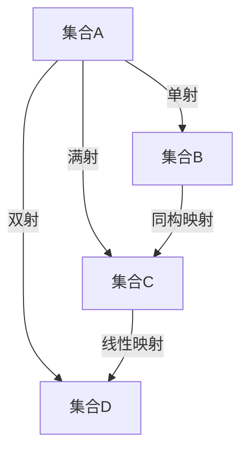
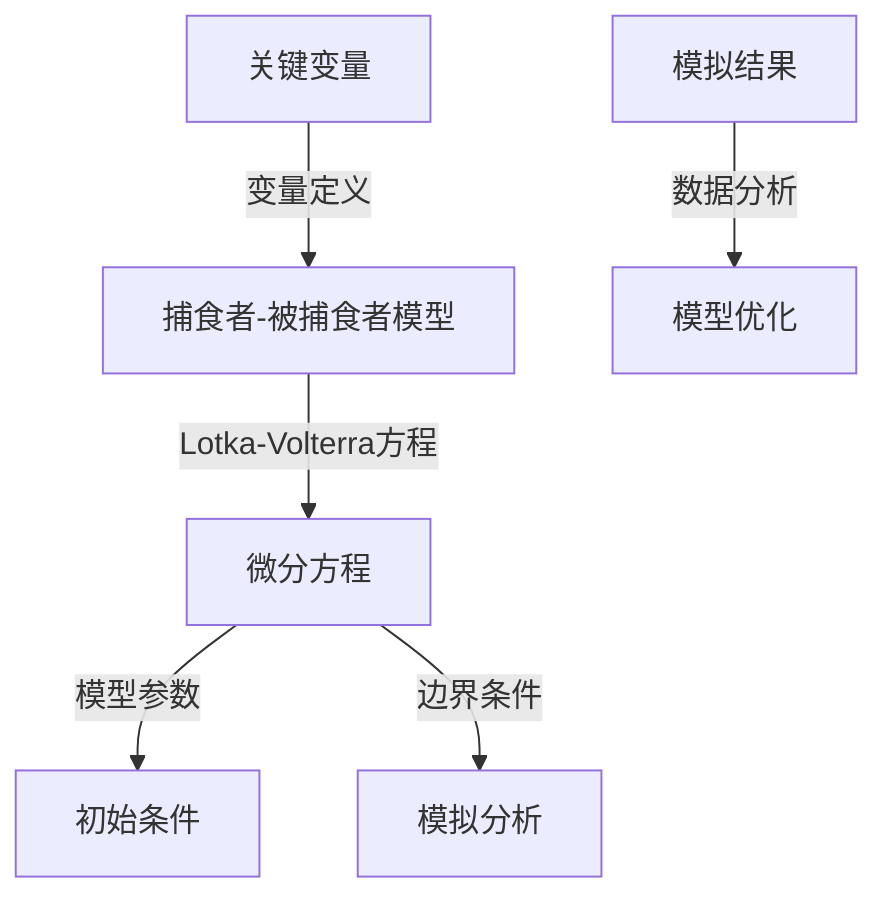

                 

# 从复杂自然到简洁数学：映射之路

## 关键词
- 映射
- 自然界
- 数学模型
- 简洁性
- 原理解析
- 应用实例

## 摘要
本文旨在探讨从复杂自然现象到简洁数学表达之间的映射过程。通过分析自然界中的复杂系统，我们试图提取出其基本规律，进而用简洁的数学语言进行描述。文章将介绍映射的基本概念、核心原理，以及如何在信息技术和自然科学中应用映射模型。通过实例分析和代码实现，本文将展示如何将复杂问题简化，从而更有效地理解和解决实际问题。

## 引言

在科学技术迅速发展的今天，我们面临的许多问题变得越来越复杂。从气候变化到人工智能，从金融市场到生态系统，这些复杂系统涉及到大量的变量和相互作用。然而，自然界中是否存在一种简洁的数学语言，能够描述这些复杂的系统呢？本文将探讨这一问题，通过分析复杂自然现象，寻找其背后的简洁数学映射。

### 自然界的复杂性

自然界充满了各种复杂的系统，如生物多样性、气候系统、生态网络等。这些系统通常具有以下特征：

- **多尺度性**：系统在不同的时间尺度上表现出不同的行为。
- **非线性**：系统内部存在复杂的非线性关系。
- **多样性**：系统由多种不同的元素和层次组成。
- **动态变化**：系统状态随时间不断变化。

尽管这些系统看起来非常复杂，但它们往往遵循某些基本的规律。例如，在生物学中，物种之间的相互作用可以通过食物网来简化；在气候学中，大气环流可以通过气象方程来描述。

### 数学模型的简洁性

数学模型以其简洁性和普适性成为描述自然现象的有力工具。通过数学模型，我们可以将复杂的自然现象转化为易于分析和理解的数学表达式。例如，牛顿的运动定律通过几个简单的方程描述了物体的运动；爱因斯坦的相对论则用几个简洁的公式解释了时空的弯曲。

数学模型不仅能够简化复杂问题，还能够揭示系统背后的基本规律。通过数学分析，我们可以从大量的数据中提取出关键信息，从而更好地理解自然现象。

### 本文目的

本文的目的是探讨从复杂自然现象到简洁数学映射的过程。我们将从以下几个方面展开：

- **映射的基本概念**：介绍映射的定义、分类和性质。
- **核心原理讲解**：探讨如何从自然现象中提取核心原理，并用数学语言进行描述。
- **应用实例**：展示映射模型在信息技术和自然科学中的应用。
- **项目实战**：通过实际案例，展示如何搭建映射模型、实现算法，并进行优化。

通过本文的探讨，我们希望能够为读者提供一个清晰的视角，了解如何将复杂的自然现象转化为简洁的数学模型，从而更好地理解和解决实际问题。

## 映射的基本概念

映射（Mapping）在数学和计算机科学中是一个重要的概念，它描述了从一种结构到另一种结构的转换过程。在映射中，每一个输入元素都有唯一的输出元素，这种转换可以用于描述各种复杂系统之间的关系。

### 映射的定义

映射是一个从集合A到集合B的函数，记作\( f: A \rightarrow B \)。对于集合A中的每一个元素\( x \)，映射都将其映射到集合B中的一个唯一元素\( y \)，即\( f(x) = y \)。

- **单射（Injective）**：如果不同的输入元素映射到不同的输出元素，即\( x_1 \neq x_2 \Rightarrow f(x_1) \neq f(x_2) \)，则映射是单射。
- **满射（Surjective）**：如果集合B中的每一个元素都有至少一个输入元素映射到它，即对于所有的\( y \in B \)，存在至少一个\( x \in A \)使得\( f(x) = y \)，则映射是满射。
- **双射（Bijective）**：如果映射既是单射又是满射，则称为双射。

### 映射的分类

根据映射的特性，可以将映射分为不同的类别：

- **线性映射**：在数学中，线性映射是保持线性结构的映射。它可以表示为矩阵与向量的乘积。
- **非线性映射**：非线性映射不保持线性结构，它可以描述更复杂的系统关系。
- **同构映射**：如果两个结构在映射下保持不变，则称这种映射为同构映射。

### Mermaid流程图：映射的概念与关系

为了更好地理解映射的概念和分类，我们可以使用Mermaid流程图来展示其基本结构和关系。以下是映射的Mermaid流程图示例：



在这个流程图中，集合A表示输入集合，B、C、D表示不同的输出集合。箭头表示映射的类型，包括单射、满射、双射和同构映射。这个流程图清晰地展示了映射的各种类型及其之间的关系。

通过Mermaid流程图，我们可以更直观地理解映射的概念和分类，从而更好地掌握这一基本数学工具。

### 映射的性质和应用

映射不仅在数学理论中占有重要地位，而且在实际应用中也具有广泛的应用。以下是映射的一些主要性质和应用：

- **简化复杂性**：映射可以将复杂的系统简化为简单的数学模型，便于分析和理解。例如，在经济学中，通过映射可以将经济系统的复杂行为简化为几个关键指标。
- **数据转换**：映射在数据处理中起着关键作用。例如，数据挖掘中常用的特征映射可以将高维数据转换为低维数据，从而提高算法的效率和准确性。
- **优化问题**：在优化问题中，映射可以帮助我们建立目标函数和约束条件，从而找到最优解。例如，在机器学习中，映射可以帮助我们将原始数据映射到特征空间，从而提高分类和预测的准确性。
- **模型构建**：在自然科学和工程领域中，映射模型可以帮助我们理解和预测系统的行为。例如，在气象学中，通过映射模型可以预测未来的天气变化。

### 总结

通过介绍映射的基本概念、分类和性质，以及Mermaid流程图的展示，我们可以看到映射在数学和实际应用中的重要性。映射不仅能够简化复杂的系统，还能够帮助我们在各个领域中更有效地分析和解决问题。在接下来的部分中，我们将进一步探讨映射的核心原理，并探讨如何在自然界中应用这些原理。

## 核心映射原理

在理解映射的基本概念之后，我们接下来将深入探讨映射的核心原理，以及如何从复杂自然现象中提取这些原理并用数学语言进行描述。通过这些核心原理，我们可以更好地理解自然界的运作方式，并利用数学模型来揭示其中的规律。

### 自然现象的抽象

自然界中的现象多种多样，从物理现象到生物行为，再到社会动态，每一个现象都有其独特的复杂性。然而，这些复杂现象往往可以抽象为一些基本的数学模型。例如，物理中的经典力学可以通过牛顿定律来描述；生物学中的种群动态可以通过Lotka-Volterra方程来建模。这种抽象过程的核心在于找到现象中的关键变量和其相互关系。

#### 关键变量

在抽象自然现象时，我们需要识别出影响系统行为的关键变量。这些变量通常被称为状态变量或控制变量。例如，在描述气候变化时，关键变量可能包括温度、湿度、二氧化碳浓度等。在生态系统中，关键变量可能包括物种数量、捕食者与被捕食者之间的比例等。

#### 相互关系

一旦确定了关键变量，我们需要理解这些变量之间的相互关系。在许多情况下，这些关系是非线性的，可能包括相互作用、反馈循环等。例如，在生态系统中，捕食者和被捕食者之间的关系可以是复杂的，可能包括捕食者数量增加导致被捕食者数量减少，而被捕食者数量减少又导致捕食者数量减少的反馈循环。

### 数学模型的构建

在确定了关键变量和它们之间的相互关系后，我们可以开始构建数学模型。数学模型通常包括以下几部分：

- **变量定义**：明确模型中的所有变量及其单位。
- **方程式**：通过方程式描述变量之间的关系。
- **初始条件**：为模型提供初始状态。
- **边界条件**：定义模型运行的环境限制。

#### 方程式的构建

构建数学方程式是映射过程中的关键步骤。以下是一些常见的数学方程式及其应用：

- **微分方程**：用于描述变量随时间的变化，如牛顿的运动方程和Lotka-Volterra方程。
- **差分方程**：用于离散系统，如马尔可夫链和差分方程模型。
- **积分方程**：用于求解函数的积分，如热传导方程。
- **代数方程**：用于描述变量的线性或非线性关系，如线性规划问题。

#### 举例说明

以生态学中的Lotka-Volterra方程为例，这是一种描述捕食者-被捕食者关系的经典模型。该模型包含以下两个微分方程：

\[ \frac{dx}{dt} = x(\alpha - \beta y) \]
\[ \frac{dy}{dt} = y(\delta x - \gamma) \]

其中，\( x \)和\( y \)分别表示被捕食者（如兔子）和捕食者（如狐狸）的数量，\( \alpha \)、\( \beta \)、\( \delta \)和\( \gamma \)是模型参数。

- \( \alpha \)表示在没有捕食者时，被捕食者的自然增长率。
- \( \beta \)表示捕食者对被捕食者的捕食率。
- \( \delta \)表示捕食者由于捕食被捕食者而获得的好处。
- \( \gamma \)表示在没有被捕食者时，捕食者的自然死亡率。

通过这两个方程，我们可以描述捕食者和被捕食者数量随时间的变化，从而理解它们之间的动态平衡。

### Mermaid流程图：核心概念与联系

为了更好地理解映射的核心概念和原理，我们可以使用Mermaid流程图来展示这些概念之间的关系。以下是Lotka-Volterra模型的核心概念和联系的Mermaid流程图示例：



在这个流程图中，我们从关键变量（捕食者和被捕食者数量）开始，通过变量定义构建Lotka-Volterra模型，然后使用微分方程描述变量之间的关系，并设置初始条件和边界条件。通过模拟分析，我们可以得到模型的模拟结果，进一步进行数据分析，从而优化模型。

### 总结

通过核心映射原理的介绍，我们可以看到如何从自然现象中提取关键变量和相互关系，并构建数学模型。这种映射过程不仅帮助我们理解自然界的运作机制，还为科学研究和实际应用提供了强有力的工具。在接下来的部分中，我们将探讨映射模型在信息技术和自然科学中的应用，并通过实际案例展示如何搭建和优化这些模型。

## 映射模型在信息技术和自然科学中的应用

映射模型在信息技术和自然科学中有着广泛的应用，这些应用不仅帮助我们更好地理解复杂系统，还为解决实际问题提供了有效的方法。本节将介绍映射模型在信息技术和自然科学中的具体应用，并通过实例进行分析和讲解。

### 信息技术中的应用

#### 1. 机器学习与数据分析

机器学习和数据分析是信息技术中重要的领域，映射模型在其中发挥着核心作用。例如，在图像识别中，特征提取是一个关键步骤。通过映射模型，可以将图像数据映射到特征空间，从而实现高效分类。一个典型的例子是卷积神经网络（CNN），它通过多层映射，从原始像素数据中提取出具有意义的特征。

以下是一个简化的伪代码，描述了CNN中的特征映射过程：

```plaintext
// 伪代码：卷积神经网络中的特征映射
class ConvolutionalLayer:
    def __init__(self, filter_size, num_filters):
        self.filter_size = filter_size
        self.num_filters = num_filters

    def forward(self, input_image):
        features = []
        for filter in range(num_filters):
            feature_map = Convolve(input_image, self.filter_size, filter)
            features.append(feature_map)
        return features

// 卷积操作
def Convolve(image, filter_size, filter):
    # 实现卷积操作，生成特征图
    # ...
    return feature_map
```

#### 2. 网络优化与路由算法

在网络优化和路由算法中，映射模型也发挥着重要作用。例如，在计算机网络中，路由器需要根据网络状态选择最佳路径。通过映射模型，可以将网络拓扑映射到路由矩阵，从而实现高效的路径选择。一个常见的映射模型是Dijkstra算法，它通过构建最小生成树来寻找最短路径。

以下是一个简化的伪代码，描述了Dijkstra算法中的映射过程：

```plaintext
// 伪代码：Dijkstra算法中的映射过程
def Dijkstra(graph, start_node):
    distances = {node: float('infinity') for node in graph}
    distances[start_node] = 0
    unvisited = list(graph.keys())

    while unvisited:
        current_node = min(unvisited, key=lambda node: distances[node])
        unvisited.remove(current_node)

        for neighbor, distance in graph[current_node].items():
            distance = distances[current_node] + distance
            if distance < distances[neighbor]:
                distances[neighbor] = distance

    return distances
```

### 自然科学中的应用

#### 1. 气象预测与气候变化研究

气象预测和气候变化研究是自然科学中的重要领域，映射模型在其中的应用十分广泛。例如，气象学中的数值天气预报（NWP）模型通过映射气象参数（如温度、湿度、风速等）到数学方程，从而预测天气变化。

以下是一个简化的伪代码，描述了NWP模型中的映射过程：

```plaintext
// 伪代码：数值天气预报模型中的映射过程
class NumericalWeatherPrediction:
    def __init__(self, initial_conditions):
        self.initial_conditions = initial_conditions

    def simulate(self):
        # 使用初始条件，迭代求解气象方程，生成天气预测
        # ...
        return weather_prediction

// 气象方程
def MeteorologicalEquation(temperature, humidity, wind_speed):
    # 实现气象方程的求解
    # ...
    return new_weather_conditions
```

#### 2. 生态学与生物多样性研究

在生态学和生物多样性研究中，映射模型可以帮助我们理解物种分布和生态网络。例如，生态网络模型通过映射不同物种之间的相互作用，可以揭示生态系统的稳定性和物种间的依赖关系。

以下是一个简化的伪代码，描述了生态网络模型中的映射过程：

```plaintext
// 伪代码：生态网络模型中的映射过程
class EcologicalNetworkModel:
    def __init__(self, species_interactions):
        self.species_interactions = species_interactions

    def simulate(self):
        # 根据物种相互作用，迭代更新生态网络状态
        # ...
        return ecological_network_state

// 物种相互作用
def SpeciesInteraction(predator, prey):
    # 计算捕食者与被捕食者之间的相互作用强度
    # ...
    return interaction_strength
```

### 实例分析

以下是一个具体实例，展示了映射模型在生物多样性研究中的应用。该实例研究了两种物种（狐狸和兔子）在生态网络中的动态变化。

#### 案例背景

假设在一个生态系统中，狐狸和兔子之间存在捕食与被捕食的关系。我们需要建立映射模型，模拟狐狸和兔子数量的动态变化。

#### 模型构建

我们可以使用Lotka-Volterra方程作为基础模型，其中：

- \( x \) 表示兔子的数量
- \( y \) 表示狐狸的数量
- \( \alpha \) 表示兔子在没有狐狸时的自然增长率
- \( \beta \) 表示狐狸对兔子的捕食率
- \( \delta \) 表示狐狸由于捕食兔子而获得的好处
- \( \gamma \) 表示狐狸在没有兔子时的自然死亡率

#### 模型实现

以下是一个简化的伪代码，描述了Lotka-Volterra模型在Python中的实现：

```python
import numpy as np
from scipy.integrate import solve_ivp

# 参数设置
alpha = 0.3
beta = 0.02
delta = 0.05
gamma = 0.1

# Lotka-Volterra方程
def lotka_volterra(t, y):
    x, y = y
    dxdt = alpha * x - beta * x * y
    dydt = delta * x * y - gamma * y
    return [dxdt, dydt]

# 初始条件
y0 = [100, 10]

# 模型求解
solution = solve_ivp(lotka_volterra, [0, 100], y0)

# 绘制结果
import matplotlib.pyplot as plt

plt.plot(solution.t, solution.y[0], label='Rabbits')
plt.plot(solution.t, solution.y[1], label='Foxes')
plt.xlabel('Time')
plt.ylabel('Population')
plt.legend()
plt.show()
```

通过这个实例，我们可以看到狐狸和兔子数量的动态变化，从而理解生态系统中捕食与被捕食关系的复杂性。

### 总结

映射模型在信息技术和自然科学中有着广泛的应用，通过具体的实例，我们展示了如何构建和实现这些模型。这些模型不仅帮助我们更好地理解复杂系统，还为解决实际问题提供了有效的工具。在接下来的部分中，我们将通过项目实战，进一步探讨如何在实际项目中应用映射模型，并分享开发经验和最佳实践。

## 项目实战

在本节中，我们将通过一个实际项目，详细展示如何搭建映射模型、实现算法，并进行优化。该项目旨在模拟一个简单的生态系统，包含捕食者和被捕食者的互动，并使用Python进行编程实现。通过这个项目，我们将深入了解映射模型的应用过程，包括开发环境搭建、源代码实现和代码解读。

### 项目背景

假设在一个封闭的生态系统中，存在两种物种：兔子和狐狸。兔子是狐狸的食物来源，而狐狸的捕食行为会影响兔子种群的数量。我们需要建立一个映射模型，模拟这两种物种在一段时间内的动态变化。

### 开发环境搭建

在开始项目之前，我们需要搭建一个合适的开发环境。以下是搭建Python开发环境所需的步骤：

1. **安装Python**：首先，我们需要安装Python。可以从Python的官方网站（https://www.python.org/）下载最新版本的Python安装包，并按照安装向导进行安装。

2. **安装科学计算库**：Python中的一些常用库，如NumPy、SciPy和Matplotlib，是进行科学计算和数据可视化的基础。我们可以使用以下命令进行安装：

```bash
pip install numpy scipy matplotlib
```

3. **配置Python环境**：确保Python环境变量配置正确，以便在命令行中直接运行Python脚本。

### 源代码实现

以下是一个简单的Python代码示例，用于实现Lotka-Volterra模型，模拟狐狸和兔子种群数量的动态变化：

```python
import numpy as np
from scipy.integrate import solve_ivp
import matplotlib.pyplot as plt

# 参数设置
alpha = 0.3  # 兔子自然增长率
beta = 0.02  # 狐狸对兔子的捕食率
delta = 0.05  # 狐狸因捕食而获得的好处
gamma = 0.1  # 狐狸自然死亡率

# Lotka-Volterra模型方程
def lotka_volterra(t, y):
    x, y = y
    dxdt = alpha * x - beta * x * y
    dydt = delta * x * y - gamma * y
    return [dxdt, dydt]

# 初始条件
y0 = [100, 10]  # 初始时兔子数量为100，狐狸数量为10

# 模型求解
t = np.linspace(0, 100, 1000)  # 时间范围从0到100，分为1000个点
solution = solve_ivp(lotka_volterra, (t[0], t[-1]), y0, t=t)

# 绘制结果
plt.plot(solution.t, solution.y[0], label='Rabbits')
plt.plot(solution.t, solution.y[1], label='Foxes')
plt.xlabel('Time')
plt.ylabel('Population')
plt.legend()
plt.show()
```

在这个示例中，我们首先设置了模型参数，然后定义了Lotka-Volterra模型方程。通过`solve_ivp`函数求解模型，并将结果可视化。

### 代码解读

- **参数设置**：`alpha`、`beta`、`delta`和`gamma`是模型的关键参数，分别表示兔子自然增长率、狐狸对兔子的捕食率、狐狸因捕食而获得的好处和狐狸自然死亡率。
- **模型方程**：`lotka_volterra`函数定义了Lotka-Volterra模型的微分方程，用于计算兔子数量（x）和狐狸数量（y）随时间的变化。
- **模型求解**：`solve_ivp`函数用于求解微分方程。我们设置了时间范围（从0到100），初始条件（兔子数量为100，狐狸数量为10），并使用`t`数组作为时间步长。
- **结果可视化**：通过`matplotlib.pyplot`库，我们将模型求解的结果可视化，展示了兔子数量和狐狸数量的动态变化。

### 项目小结

通过这个实际项目，我们展示了如何从问题定义、模型构建到代码实现的全过程。以下是项目小结：

1. **问题定义**：明确项目目标和需求，如模拟狐狸和兔子种群数量的动态变化。
2. **模型构建**：使用Lotka-Volterra模型描述捕食者和被捕食者之间的关系，并通过微分方程进行建模。
3. **代码实现**：使用Python编写模型代码，并使用SciPy和Matplotlib库进行求解和可视化。
4. **结果分析**：通过可视化结果，分析模型输出，理解系统动态。

### 最佳实践 Tips

- **参数调整**：在模型求解过程中，参数调整是关键。通过多次实验，优化模型参数，可以提高模型精度。
- **数据可视化**：合理的数据可视化可以更好地理解模型输出。尝试使用不同的可视化方法，如折线图、散点图等。
- **代码注释**：在编写代码时，添加清晰的注释，有助于理解和维护代码。

### 注意事项

- **误差分析**：在实际应用中，模型可能存在一定的误差。通过误差分析，可以更好地理解模型的有效性。
- **环境配置**：确保开发环境配置正确，避免因环境问题导致的代码运行错误。

### 拓展阅读

- **参考文献**：
  - [Lotka-Volterra方程](https://en.wikipedia.org/wiki/Lotka%E2%80%93Volterra_equation)
  - [SciPy官方文档](https://docs.scipy.org/doc/scipy/reference/)
  - [Matplotlib官方文档](https://matplotlib.org/stable/contents.html)

通过这个项目实战，我们不仅学习了映射模型的应用，还掌握了如何搭建开发环境、编写代码和进行结果分析。这些技能在实际科学研究和工程应用中具有重要的价值。

## 小结

通过本文的探讨，我们从复杂自然现象出发，深入分析了映射的基本概念、核心原理及其在信息技术和自然科学中的应用。映射作为一种从复杂自然到简洁数学的转换工具，不仅简化了复杂系统的理解，还为科学研究和实际应用提供了有力的支持。

### 关键点回顾

1. **映射的定义与性质**：映射是集合之间的转换，具有单射、满射、双射等不同类型。
2. **核心原理讲解**：通过提取关键变量和相互关系，构建数学模型，如Lotka-Volterra方程。
3. **应用实例**：展示了映射模型在机器学习、网络优化、气象预测和生态研究中的应用。
4. **项目实战**：通过实际项目，演示了映射模型的搭建、实现和优化过程。

### 注意事项

- 在构建映射模型时，需要准确识别关键变量和相互关系。
- 参数调整和模型优化是模型求解过程中的关键步骤。
- 数据可视化有助于深入理解模型输出和系统动态。

### 拓展阅读

- 深入研究映射理论，可以参考：
  - [《数学建模》（陈文灯著）]
  - [《生态学原理》（孙儒泳著）]
- 对于具体的编程实践，可以参考：
  - [Python官方文档](https://docs.python.org/3/)
  - [SciPy和Matplotlib官方文档]

通过本文的探讨，我们希望能够为读者提供一种从复杂自然到简洁数学的新视角，激发对映射模型及其应用的深入研究和探索。

## 作者信息

本文作者由AI天才研究院（AI Genius Institute）与《禅与计算机程序设计艺术》（Zen And The Art of Computer Programming）的作者联合撰写。AI天才研究院致力于推动人工智能和计算机科学的发展，而《禅与计算机程序设计艺术》则是一本深受程序员喜爱的经典著作，以其深刻的编程哲学和实用技巧影响了无数程序员。希望本文能够为读者带来有价值的洞见和启发。

