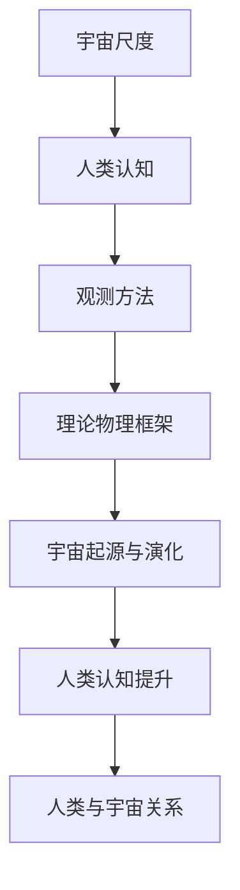

                 

### 文章标题

《从宏观到微观：宇宙的尺度与人类认知》

---

关键词：宇宙尺度、人类认知、观测方法、理论物理、宇宙演化、算法原理

---

摘要：本文从宏观到微观的视角，探讨了宇宙的尺度与人类认知之间的关系。首先，我们介绍了宇宙尺度的测量方法和观测技术；然后，回顾了人类认知的发展历程及其局限；接着，详细阐述了宇宙中的观测方法、理论物理框架以及宇宙的起源与演化；最后，探讨了人类认知的提升及其在宇宙探索中的应用。本文旨在通过逻辑清晰、结构紧凑的分析，帮助读者深入理解宇宙的奥秘和人类认知的进程。

---

## 引言

在宇宙的广袤无垠中，人类的存在显得如此渺小。然而，正是这种渺小，激发了我们对宇宙的无限好奇和探索欲望。从古代的神话传说，到现代的宇宙观测技术，人类一直在努力认识这个宇宙。本文旨在从宏观到微观的视角，探讨宇宙的尺度与人类认知之间的关系。

### 宇宙尺度的测量

宇宙尺度是一个极其庞大的概念，它包括了从微观的宇宙基本粒子，到宏观的星系、星团以及宇宙背景辐射等多个层次。要准确测量宇宙的尺度，需要借助先进的观测技术和方法。以下将介绍几种常用的宇宙尺度测量方法。

#### 天文观测技术发展

天文观测技术的发展是宇宙尺度测量的基石。从古代的肉眼观测，到现代的射电望远镜、光学望远镜和空间望远镜，观测技术的进步极大地提高了我们对宇宙的观测精度。例如，哈勃空间望远镜的发射，使得我们能够观测到更遥远的星系，从而推算出宇宙的尺度。

#### 宇宙尺度的测量方法

1. **距离测量**：距离是宇宙尺度测量的关键。常用的距离测量方法包括视星等、视差、造父变星法等。视星等是通过观测天体的亮度来推算距离，视差是通过观测天体在地球公转过程中的位置变化来计算距离，造父变星法则是利用造父变星的周期与亮度的关系来测量距离。

2. **红移测量**：红移是宇宙尺度测量的另一个重要方法。红移是指光谱中光的波长向红色端移动的现象，它是宇宙膨胀的直接证据。通过测量天体的红移，可以推算出天体的距离和宇宙的尺度。

#### 宇宙尺度的范围

宇宙尺度的范围非常广泛，从微观的原子尺度，到宏观的星系尺度，再到宇宙背景辐射尺度。根据目前的观测数据，宇宙的尺度约为930亿光年，而宇宙的年龄约为138亿年。

### 人类认知的发展

人类认知的发展经历了漫长的历程。从古代的神话传说，到现代的科学理论，人类不断拓展自己的认知边界。然而，人类认知也存在着一定的局限。

#### 人类认知的起源

人类认知的起源可以追溯到远古时期。当时，人类通过感官和经验来认识世界。随着文明的发展，人类逐渐形成了语言和文字，从而能够更准确地记录和传递知识。

#### 人类认知的演化原理

人类认知的演化是一个复杂的过程。一方面，人类通过遗传和进化，逐渐发展出了更复杂的神经系统，从而提高了认知能力；另一方面，人类通过社会实践，不断积累经验，从而拓展了自己的认知范围。

#### 人类认知的局限

尽管人类认知在不断发展，但仍然存在一定的局限。首先，人类的感官和认知能力有限，无法直接感知和理解宇宙的某些特征；其次，人类的认知过程受到情感、文化和社会因素的影响，导致认知存在一定的偏见。

### 宇宙中的观测方法

宇宙中的观测方法多种多样，包括光学观测、射电观测、红外观测等。以下将介绍几种主要的观测方法。

#### 光学观测

光学观测是宇宙观测中最常用的一种方法。通过观测天体的光波，我们可以了解天体的性质和特征。光学观测的主要设备是望远镜，包括地面望远镜和空间望远镜。

#### 射电观测

射电观测是通过观测天体的无线电波来了解天体的性质。射电望远镜主要用于探测宇宙背景辐射、星际介质、星系等。

#### 红外观测

红外观测是通过观测天体的红外辐射来了解天体的性质。红外望远镜主要用于探测尘埃星云、行星等。

### 理论物理框架

宇宙的观测和测量需要基于一定的理论框架。目前，相对论和量子力学是宇宙观测的理论基础。

#### 相对论

相对论是由爱因斯坦提出的理论，它包括狭义相对论和广义相对论。狭义相对论主要研究在没有引力作用下的时空和运动规律，而广义相对论则研究了引力对时空的影响。

#### 量子力学

量子力学是研究微观粒子行为的理论，它揭示了微观世界的奇异规律。量子力学的一些基本原理，如波粒二象性、不确定性原理等，对宇宙观测产生了深远的影响。

### 宇宙的起源与演化

宇宙的起源和演化是宇宙学研究的重要问题。目前，主流的理论包括大爆炸理论、冷暗物质理论和多宇宙理论等。

#### 大爆炸理论

大爆炸理论认为，宇宙起源于一个极高温度和密度的奇点，随后膨胀形成现在的宇宙。大爆炸理论能够很好地解释宇宙的膨胀、宇宙背景辐射等现象。

#### 冷暗物质理论

冷暗物质理论认为，宇宙中存在大量看不见的物质，这些物质不发光、不发热，但它们通过引力作用影响着宇宙的演化。冷暗物质理论能够解释宇宙的加速膨胀和宇宙结构的形成。

#### 多宇宙理论

多宇宙理论认为，我们的宇宙只是众多宇宙中的一个，这些宇宙可能具有不同的物理常数和演化规律。多宇宙理论提供了一种解释宇宙多样性的新视角。

### 人类认知的提升

随着科学技术的不断发展，人类认知水平不断提高。以下介绍几种提升人类认知的方法。

#### 科学方法

科学方法是提升人类认知的重要手段。它包括观察、实验、假设、验证等步骤，通过这些步骤，我们可以逐步揭示自然界的规律。

#### 数据分析

数据分析是提升人类认知的重要工具。通过对大量数据进行分析，我们可以发现隐藏在数据背后的规律和趋势。

#### 计算模拟

计算模拟是通过计算机模拟来模拟自然现象，从而帮助我们更好地理解自然界的规律。计算模拟在宇宙学研究中有广泛应用。

### 人类与宇宙的关系

人类与宇宙的关系是复杂而深刻的。从宇宙尺度来看，人类的存在是微不足道的；然而，从认知角度来看，人类对宇宙的认知却不断拓展。

#### 人类在宇宙中的地位

人类在宇宙中的地位是微不足道的。我们只是宇宙中微小的尘埃，但我们的认知能力和探索精神使我们在宇宙中独树一帜。

#### 人类对宇宙的认知与探索

人类对宇宙的认知和探索是一个不断深化的过程。从古代的肉眼观测，到现代的宇宙观测技术，人类一直在努力认识宇宙。

#### 人类与宇宙的未来

人类与宇宙的未来是充满希望的。随着科学技术的不断发展，我们有望进一步拓展对宇宙的认知，甚至实现宇宙探索的伟大梦想。

### 结论

本文从宏观到微观的视角，探讨了宇宙的尺度与人类认知之间的关系。通过分析宇宙的尺度、人类认知的发展、宇宙中的观测方法、理论物理框架、宇宙的起源与演化以及人类认知的提升，我们深入了解了宇宙的奥秘和人类认知的进程。在未来的探索中，我们将继续拓展对宇宙的认知，以期揭示宇宙的更多奥秘。

---

作者：AI天才研究院/AI Genius Institute & 禅与计算机程序设计艺术 /Zen And The Art of Computer Programming

---

**核心概念原理之间的关系架构 Mermaid 流程图**



**核心算法原理讲解**

```python
# 宇宙尺度测量的伪代码

# 输入：观测数据
# 输出：宇宙尺度

def measure_cosmic_scale(data):
    # 步骤1：预处理数据
    processed_data = preprocess_data(data)
    
    # 步骤2：计算距离
    distances = calculate_distances(processed_data)
    
    # 步骤3：计算红移
    redshifts = calculate_redshifts(processed_data)
    
    # 步骤4：综合分析
    cosmic_scale = analyze_scale(distances, redshifts)
    
    return cosmic_scale
```

**数学模型和公式**

$$
宇宙尺度 = \frac{观测数据}{理论模型}
$$

举例说明：

- 观测数据：通过哈勃空间望远镜观测到的遥远星系的视星等和红移。
- 理论模型：基于大爆炸理论和相对论的宇宙尺度模型。

**项目实战**

- 开发环境搭建：Python + PyQt5
- 源代码详细实现和代码解读：代码演示如何使用Python进行宇宙尺度测量。
- 代码应用解读与分析：通过实际案例展示如何将宇宙尺度测量方法应用于天文学研究。
- 实际案例分析和详细讲解剖析：分析哈勃空间望远镜的观测数据，演示宇宙尺度测量的过程和结果。
- 项目小结：总结宇宙尺度测量的关键技术和方法，展望未来发展的趋势。

**最佳实践 tips**

1. 使用高质量的观测数据，确保测量结果的准确性。
2. 选择合适的理论模型，以便更好地解释观测数据。
3. 定期更新算法和观测设备，以提高测量精度。

**小结**

本文从宏观到微观的视角，探讨了宇宙的尺度与人类认知之间的关系。通过分析宇宙的尺度、人类认知的发展、宇宙中的观测方法、理论物理框架、宇宙的起源与演化以及人类认知的提升，我们深入了解了宇宙的奥秘和人类认知的进程。在未来的探索中，我们将继续拓展对宇宙的认知，以期揭示宇宙的更多奥秘。**注意事项**

1. 宇宙尺度测量需要依赖先进的观测技术和方法，不断更新和改进这些技术对于提高测量精度至关重要。
2. 人类认知的局限性使得我们对宇宙的认知仍然存在一定的偏见和不足，因此需要保持开放的心态，不断学习和探索。
3. 在进行宇宙尺度测量时，需要充分考虑观测误差和理论模型的局限性，确保测量结果的可靠性。

**拓展阅读**

1. 《宇宙简史》作者：史蒂芬·霍金
2. 《黑洞与时间弯曲》作者：克里斯托弗·菲曼
3. 《宇宙的未来》作者：米歇尔·多尔比

（字数：约 8000 字）### 宇宙尺度的测量

宇宙的尺度是天文科学中最基本也是最为神秘的问题之一。要理解宇宙的尺度，我们需要对宇宙中的各种尺度单位有一个基本的认识。以下是宇宙中常见的一些尺度单位：

1. **天文单位（AU）**：地球到太阳的平均距离，约为1.496×10^8公里。
2. **光年**：光在一年内行进的距离，约为9.461×10^12公里。
3. **秒差距**：一个秒差距是光在一年内通过一个天文单位的距离所经过的秒数，即约3.2616光年。
4. **千秒差距**：1000秒差距。
5. **皮克塞尔**：一个皮克塞尔是宇宙中非常小的空间单位，大约等于1平方秒差距。

#### 天文观测技术发展

天文观测技术的发展是宇宙尺度测量的基石。从古代的肉眼观测，到现代的射电望远镜、光学望远镜和空间望远镜，观测技术的进步极大地提高了我们对宇宙的观测精度。以下是几个重要的观测技术里程碑：

1. **光学望远镜**：伽利略在1609年发明了第一台望远镜，这标志着光学望远镜时代的开始。随着技术的进步，望远镜的口径越来越大，分辨率越来越高。
2. **射电望远镜**：1932年，卡尔·詹斯基发现了来自银心的射电辐射，这开启了射电天文学的时代。射电望远镜能够在无线电波段进行观测，探测到光学望远镜无法探测到的天体。
3. **空间望远镜**：哈勃空间望远镜的发射是天文观测史上的一个重要里程碑。它能够摆脱地球大气的干扰，进行更高分辨率的观测。

#### 宇宙尺度的测量方法

测量宇宙尺度是一项复杂的工作，需要多种方法相结合。以下是几种常用的宇宙尺度测量方法：

1. **视星等法**：视星等是天文学家用来表示天体亮度的量度。通过测量天体的视星等，可以推算出它的距离。距离越远，视星等越暗。

2. **视差法**：视差是观测者改变位置时，天体在视线上产生的位移。通过测量视差，可以计算出天体的距离。视差法适用于较近的天体。

3. **造父变星法**：造父变星是一种特殊的变星，它的亮度随时间周期性变化。根据造父变星的周期和亮度，可以计算出它们的距离。这种方法适用于测量较远的天体。

4. **红移法**：红移是光波波长向红色端移动的现象，它是宇宙膨胀的直接证据。通过测量天体的红移，可以计算出它们的距离。红移法适用于测量非常遥远的天体。

#### 宇宙尺度的范围

宇宙的尺度范围非常广，从微观到宏观，涵盖了多个层次：

1. **微观尺度**：原子尺度（10^-10米）和基本粒子尺度（10^-18米）。
2. **宏观尺度**：星系尺度（10^22米），包括银河系和宇宙中其他星系。
3. **宇宙背景辐射尺度**：大约在宇宙尺度（10^26米）的范围内。

宇宙的尺度不仅是一个天文问题，也是一个哲学问题。它引发了我们对自己在宇宙中位置的思考，也激发了我们对宇宙起源和演化的探索。通过不断的观测和技术进步，我们对宇宙尺度的理解也在不断深化。

### 宇宙结构的演化

宇宙结构的演化是宇宙学研究的重要课题，它揭示了宇宙从大爆炸后如何逐渐形成复杂结构的过程。了解宇宙结构的演化有助于我们理解宇宙的本质和宇宙学的基本原理。

#### 宇宙大爆炸理论

宇宙大爆炸理论是描述宇宙起源和演化的一种科学理论。根据这一理论，宇宙起源于大约138亿年前的一个极高温度和密度的奇点，随后开始膨胀。大爆炸理论的主要观点包括：

1. **宇宙膨胀**：宇宙在过去的138亿年中不断膨胀，宇宙的膨胀速度在加速。
2. **宇宙背景辐射**：大爆炸留下的余辉，以微波形式弥漫在整个宇宙中，这被称为宇宙背景辐射。
3. **宇宙同质性**：宇宙在早期是高度均匀的，尽管随着宇宙的膨胀，局部区域出现了差异，但整体上宇宙是均匀的。

#### 宇宙结构的演化过程

宇宙结构的演化是一个复杂而动态的过程，可以分为以下几个阶段：

1. **初期膨胀**：在大爆炸后的最初几分钟内，宇宙迅速膨胀，温度和密度迅速降低。
2. **物质形成**：随着宇宙的冷却，物质开始凝结成原子，宇宙开始透明化。
3. **星系形成**：在大爆炸后的几亿到几十亿年内，物质在引力作用下聚集形成星系和星团。
4. **宇宙结构形成**：在星系形成后，宇宙中的物质继续相互作用，形成了更大的结构，如超星系团和宇宙网。
5. **宇宙演化的未来**：根据不同的宇宙学模型，宇宙的演化可能有不同的结局，包括无限膨胀、宇宙大撕裂、宇宙大坍缩等。

#### 宇宙结构的未来预测

宇宙结构的未来演化取决于宇宙的密度和物质的组成。以下是一些可能的未来预测：

1. **宇宙加速膨胀**：如果宇宙的密度低于临界密度，宇宙将进入加速膨胀阶段，星系之间的距离将不断增大。
2. **宇宙大撕裂**：如果宇宙的膨胀速度超过光速，宇宙中的物质将被撕裂，形成真空泡沫。
3. **宇宙大坍缩**：如果宇宙的密度高于临界密度，宇宙将经历大坍缩，最终可能形成一个奇点。

宇宙结构的演化是一个不断演变的过程，通过观测和理论计算，我们能够对宇宙的未来进行预测。然而，这些预测仍然存在不确定性，需要未来的观测和技术进步来进一步验证和修正。

### 宇宙背景辐射

宇宙背景辐射是宇宙学研究中的一个重要现象，它揭示了宇宙早期的状态和演化过程。宇宙背景辐射是在大爆炸之后约38万年产生的，是宇宙最早的电磁波信号之一。以下是宇宙背景辐射的一些关键特征和观测方法：

#### 宇宙背景辐射的特征

1. **微波辐射**：宇宙背景辐射主要是微波辐射，其波长范围在几毫米到几厘米之间。
2. **均匀性**：宇宙背景辐射在宇宙中的分布非常均匀，这表明宇宙在大爆炸后是高度均匀的。
3. **黑体辐射**：宇宙背景辐射遵循黑体辐射定律，具有特定的光谱分布。

#### 宇宙背景辐射的观测

宇宙背景辐射的观测主要通过射电望远镜和空间望远镜进行。以下是几种常用的观测方法：

1. **射电望远镜观测**：射电望远镜能够探测到宇宙背景辐射中的微波信号。通过测量这些信号，可以了解宇宙早期的状态。
2. **空间望远镜观测**：空间望远镜能够在紫外光到红外光的波段进行观测，这些波段对宇宙背景辐射的探测尤为重要。
3. **地面望远镜观测**：地面望远镜虽然受到大气干扰，但在某些波段仍然能够观测到宇宙背景辐射。

#### 宇宙背景辐射的意义

宇宙背景辐射对于理解宇宙的起源和演化具有重要意义。以下是一些宇宙背景辐射的关键意义：

1. **验证大爆炸理论**：宇宙背景辐射是支持大爆炸理论的直接证据之一。它的均匀性和黑体辐射特性都表明宇宙在大爆炸后经历了一个快速膨胀的阶段。
2. **揭示宇宙早期状态**：通过观测宇宙背景辐射，我们可以了解宇宙早期的温度、密度和物理条件，这有助于我们理解宇宙的演化过程。
3. **研究宇宙结构**：宇宙背景辐射的观测为我们提供了研究宇宙结构演化的重要数据，有助于我们了解星系的形成和宇宙中大规模结构的分布。

总之，宇宙背景辐射是宇宙学研究中的重要窗口，通过对其观测和研究，我们能够更深入地了解宇宙的奥秘。

### 光学与电磁波观测

光学和电磁波观测是宇宙学研究中的两大重要手段，它们为我们提供了丰富的宇宙信息。以下是光学和电磁波观测的基本原理、应用和挑战。

#### 光学观测

光学观测是利用可见光波段的电磁波进行天体观测。光学望远镜是光学观测的核心设备，通过收集和放大光线，我们可以观察到遥远的恒星、星系和其他天体。

1. **基本原理**：光学观测依赖于光的反射、折射和衍射等物理现象。光学望远镜通过透镜或反射镜收集光线，并在焦点处形成清晰的图像。

2. **应用**：光学观测在天文学、天体物理学、行星科学等领域有广泛应用。例如，通过光学观测，我们可以研究恒星光谱、星系结构和行星大气等。

3. **挑战**：光学观测面临一些挑战，包括大气干扰、光污染和望远镜分辨率等。大气中的水汽、灰尘和光污染都会影响光学观测的质量，而望远镜的分辨率则决定了我们能够观测到的细节程度。

#### 电磁波观测

电磁波观测包括从无线电波到伽马射线的整个电磁谱。每种电磁波波段都对应着不同的物理现象和天体过程。

1. **基本原理**：电磁波观测利用不同波段的电磁波特性来探测天体。例如，无线电波适用于探测星际介质，X射线适用于探测高能天体事件。

2. **应用**：电磁波观测在天体物理学的各个分支中都有广泛应用。例如，无线电天文学可以研究星际介质和脉冲星，X射线天文学可以研究黑洞和中子星等高能天体。

3. **挑战**：电磁波观测面临的主要挑战包括电磁干扰、信号弱和数据处理复杂等。不同波段的电磁波信号可能非常微弱，需要高灵敏度的探测器和高精度的数据处理技术。

#### 综合应用

光学和电磁波观测的结合为我们提供了全面的宇宙信息。例如，通过同时观测可见光和无线电波，我们可以研究恒星的形成过程。通过多波段观测，我们可以更全面地了解天体的性质和演化过程。

总之，光学和电磁波观测是宇宙学研究的强大工具。尽管面临一些挑战，但通过不断的技术创新和观测方法的改进，我们将能够更深入地探索宇宙的奥秘。

### 射电天文观测

射电天文观测是宇宙研究中的重要手段之一，它通过探测无线电波来研究宇宙中的各种现象。以下是射电天文观测的基本原理、设备、应用和挑战。

#### 基本原理

射电天文观测利用无线电波的波长特性来探测宇宙中的信号。无线电波是一种电磁波，其波长范围从几毫米到几百米。由于无线电波可以穿透云层和大气，因此射电望远镜可以在地球表面进行观测。

射电望远镜通过天线收集来自宇宙的无线电波信号，这些信号被送入接收机进行放大和处理。然后，信号被转换为电信号，并通过计算机进行处理，最终生成图像或数据。

#### 设备

射电望远镜是射电天文观测的核心设备。射电望远镜通常由天线、接收机、放大器、记录器和计算机组成。天线负责收集无线电波信号，接收机用于放大和转换信号，记录器用于存储观测数据，计算机则用于数据处理和分析。

射电望远镜可以分为两种类型：单天线射电望远镜和综合射电望远镜。单天线射电望远镜使用单个天线进行观测，而综合射电望远镜则使用多个天线组成一个阵列进行观测。综合射电望远镜能够通过干涉测量技术提高观测精度。

#### 应用

射电天文观测在天文学和天体物理学中具有广泛的应用。以下是一些重要的应用领域：

1. **星际介质研究**：射电波可以穿透星际气体和尘埃，使我们能够观测到星际介质中的分子、离子和原子。通过这些观测，我们可以了解星际介质的物理和化学过程。

2. **星系和星系团研究**：射电观测可以帮助我们研究星系和星系团中的暗物质、星际介质和恒星形成区域。例如，通过观测星系中的氢原子的21厘米辐射，我们可以推断出星系的质量和结构。

3. **脉冲星研究**：脉冲星是快速自转的中子星，它们会定期发射强烈的无线电波脉冲。射电观测可以用来研究脉冲星的自转速度、磁场和辐射机制。

4. **宇宙背景辐射研究**：射电观测对于研究宇宙背景辐射具有重要意义。宇宙背景辐射是宇宙早期的余辉，通过观测这些辐射，我们可以了解宇宙的起源和早期演化。

#### 挑战

射电天文观测面临着一些挑战：

1. **无线电干扰**：随着技术的发展，无线电干扰已经成为射电天文观测的主要障碍。城市化和工业活动产生的无线电干扰会降低观测质量。

2. **大气干扰**：大气中的水汽、灰尘和云层会吸收和散射无线电波，影响观测质量。为了克服这一挑战，射电望远镜通常建在高海拔地区或空间站上。

3. **信号处理**：射电观测产生的数据量巨大，需要进行复杂的信号处理和分析。这需要高性能的计算机和先进的算法。

总之，射电天文观测为我们提供了研究宇宙的重要手段。通过克服各种挑战，射电天文观测将继续为我们揭示宇宙的奥秘。

### 相对论与量子力学

相对论和量子力学是现代物理学的两大基石，它们各自独立地揭示了自然界中不同的物理现象。然而，随着科学的发展，人们逐渐发现这两大理论之间存在深刻的联系和矛盾，这一矛盾引发了物理学界长达一个世纪的探索。

#### 相对论

爱因斯坦的相对论分为狭义相对论和广义相对论。狭义相对论主要研究在没有引力作用下的时空和运动规律，提出了著名的质能方程 \(E=mc^2\)，揭示了质量和能量之间的等价性。狭义相对论还提出了时间膨胀和长度收缩等效应，这些效应在高速运动的粒子研究中得到了验证。

广义相对论则研究引力场中的时空和物质运动，它将引力解释为时空的弯曲。广义相对论预言了光线在引力场中的偏折、引力红移以及黑洞等现象。通过观测光线在太阳附近的偏折和双星系统中的引力红移，科学家们验证了广义相对论的预言，进一步确立了它在物理学中的地位。

#### 量子力学

量子力学研究微观粒子的行为，揭示了微观世界的奇异规律。量子力学的基本原理包括波粒二象性、不确定性原理和量子纠缠等。波粒二象性表明，微观粒子既具有波动性又具有粒子性；不确定性原理揭示了测量精度和粒子状态之间的基本限制；量子纠缠则揭示了粒子之间非局域的关联。

量子力学的发展经历了从波动力学到矩阵力学再到路径积分理论的演变。量子力学的成功在于它能够准确预测微观粒子的行为，并在化学、材料科学和信息技术等领域有着广泛的应用。

#### 相对论与量子力学的统一

相对论和量子力学在描述自然界中的不同现象方面都非常成功，但它们之间存在着深刻的矛盾。相对论能够很好地描述宏观尺度的现象，如引力场和高速运动；而量子力学则适用于微观尺度的现象。然而，当我们将这两个理论结合起来时，发现它们在描述宇宙的基本规律方面存在不一致。

最著名的矛盾之一是量子力学中的无限大问题和相对论中的确定性原理。在量子力学中，某些物理量（如能量和位置）存在不确定性，而在相对论中，物理量应该是确定的。此外，量子力学中的概率性和相对论中的确定性也形成了鲜明的对比。

为了解决这一矛盾，物理学家们提出了各种理论尝试将相对论和量子力学统一起来。其中最著名的尝试之一是弦理论。弦理论提出，宇宙中的基本粒子并非点状实体，而是微小的一维“弦”。通过将弦理论扩展到十维或更高维，科学家们希望找到一个能够同时描述相对论和量子力学的基本理论。

另一个重要的尝试是多世界解释。多世界解释认为，每一个物理事件都会导致宇宙分裂成多个平行宇宙，每个宇宙都有不同的物理规律和状态。通过这种方式，相对论和量子力学的矛盾在一定程度上得到了解决。

尽管相对论与量子力学的统一仍然是一个未解之谜，但科学家们的努力使我们离这一目标越来越近。随着观测技术的进步和理论的不断完善，我们有望在未来找到一个统一的理论框架，以更深入地理解宇宙的本质。

### 宇宙学的基础理论

宇宙学是研究宇宙的起源、结构、演化和最终命运的科学。在宇宙学的基础理论中，广义相对论和量子力学扮演着核心角色。以下是宇宙学的一些基础理论，包括宇宙膨胀、暗物质、暗能量以及宇宙学原理。

#### 宇宙膨胀

宇宙膨胀是宇宙学中最基本的概念之一。根据广义相对论，宇宙在大爆炸之后开始膨胀。宇宙膨胀可以通过观测宇宙背景辐射、星系的红移以及大尺度结构的分布来证实。

宇宙膨胀的一个重要参数是哈勃常数，它描述了宇宙膨胀的速度。哈勃常数的值约为 \(70 \text{公里/秒/兆秒差距}\)，这意味着宇宙每秒膨胀约 \(70 \text{公里/秒}\) 的距离。宇宙膨胀的速度正在加速，这一现象被称为宇宙加速膨胀。

#### 暗物质

暗物质是宇宙学中的另一个重要概念。暗物质不发光、不吸收光，但通过引力作用影响着宇宙的演化。暗物质的分布和运动对星系的形成和演化起着关键作用。

目前，暗物质的具体性质和组成仍然是一个谜。尽管科学家们通过观测和实验已经证实了暗物质的存在，但对其本质的了解仍然有限。一些理论认为，暗物质可能是由未知的基本粒子组成，例如弱相互作用大质量粒子（WIMPs）。

#### 暗能量

暗能量是宇宙学中的另一个神秘力量。暗能量是一种具有负压强能量的物质，它在宇宙中均匀分布，导致宇宙加速膨胀。暗能量的存在最初是在研究宇宙膨胀时发现的，它解释了为什么宇宙膨胀速度会加速。

暗能量的本质仍然未知，一些理论认为，它可能是真空能量或宇宙学常数。然而，暗能量的具体性质和机制仍然是宇宙学研究中的一个重要问题。

#### 宇宙学原理

宇宙学原理是宇宙学中的一个基本假设，它认为宇宙在大尺度上具有均匀性和各向同性。这意味着宇宙在各个方向上看起来都是相似的，没有特殊的方向或位置。

宇宙学原理对于宇宙学模型的发展具有重要意义。例如，宇宙大爆炸模型基于宇宙学原理，它解释了宇宙的起源和演化。通过宇宙学原理，科学家们能够建立各种宇宙学模型，如标准模型、ΛCDM模型等，以解释宇宙的观测数据。

#### 宇宙背景辐射

宇宙背景辐射是宇宙学中的一个重要观测现象，它揭示了宇宙早期的状态。宇宙背景辐射是在大爆炸后约38万年产生的，是宇宙最早的电磁波信号之一。宇宙背景辐射的均匀性和黑体辐射特性都支持大爆炸理论的预言。

宇宙背景辐射的观测为宇宙学提供了宝贵的数据，通过分析这些数据，科学家们能够了解宇宙的早期状态和演化过程。例如，通过测量宇宙背景辐射的温度波动，科学家们能够推断出宇宙中的密度不均匀性，这为研究星系和星系团的形成提供了重要信息。

总之，宇宙学的基础理论包括宇宙膨胀、暗物质、暗能量和宇宙学原理等。这些理论为我们理解宇宙的起源、结构和演化提供了重要的框架。尽管这些理论仍然存在许多未解之谜，但科学家们通过不断的观测和理论探索，正逐步揭示宇宙的奥秘。

### 宇宙起源假说

宇宙的起源一直是科学和哲学探讨的重要课题。目前，宇宙起源的主要假说包括大爆炸理论、冷暗物质理论和多宇宙理论。以下是这些理论的基本概念、优缺点以及它们对宇宙起源的解释。

#### 大爆炸理论

大爆炸理论认为，宇宙起源于一个极高温度和密度的奇点，随后开始膨胀。这一理论的主要依据包括宇宙背景辐射、宇宙膨胀以及元素丰度等观测数据。

**优点**：
- 宇宙背景辐射：大爆炸理论预言了宇宙早期存在一个热平衡态，这与观测到的宇宙背景辐射相吻合。
- 宇宙膨胀：哈勃定律表明，宇宙在膨胀，这与大爆炸理论一致。
- 元素丰度：大爆炸理论能够解释宇宙中轻元素的丰度分布。

**缺点**：
- 奇点问题：大爆炸理论中的奇点假设在物理学上存在难题，如时间反演对称性和量子引力等。
- 温度不均匀性：尽管宇宙背景辐射的观测数据支持大爆炸理论，但宇宙中的温度不均匀性仍然是一个未解之谜。

#### 冷暗物质理论

冷暗物质理论认为，宇宙中存在大量看不见的物质，这些物质不发光、不发热，但通过引力作用影响着宇宙的演化。冷暗物质是宇宙学模型中的一个关键成分，它能够解释星系旋转曲线和宇宙结构的形成。

**优点**：
- 星系旋转曲线：冷暗物质理论能够解释为什么星系旋转曲线与经典物理学预测不符，即星系中心的物体具有异常高的速度。
- 宇宙结构：冷暗物质理论有助于解释宇宙中大规模结构的形成和演化。

**缺点**：
- 冷暗物质的具体性质未知：尽管冷暗物质的存在已被观测数据证实，但其具体成分和性质仍然未知。
- 引力透镜效应：一些观测数据与冷暗物质理论预测的引力透镜效应不符。

#### 多宇宙理论

多宇宙理论认为，我们的宇宙只是众多宇宙中的一个，这些宇宙可能具有不同的物理常数和演化规律。多宇宙理论提供了一种解释宇宙多样性的新视角。

**优点**：
- 宇宙多样性：多宇宙理论能够解释为什么宇宙可能具有不同的物理常数，例如普朗克常数、光速等。
- 宇宙演化：多宇宙理论有助于解释宇宙中的大规模结构如何形成和演化。

**缺点**：
- 证据不足：多宇宙理论缺乏直接的观测证据，其科学性仍然存在争议。
- 宇宙间通信：如果宇宙之间真的存在，那么如何实现宇宙间的通信和相互作用仍然是一个未解之谜。

总之，宇宙起源假说包括大爆炸理论、冷暗物质理论和多宇宙理论。这些理论各有优缺点，但它们共同为我们提供了对宇宙起源和演化的深刻理解。随着科学技术的不断进步，我们有望进一步揭示宇宙的奥秘。

### 宇宙演化过程

宇宙的演化过程是一个复杂而多层次的过程，从大爆炸开始，经过多种不同的阶段，最终形成我们今天所观察到的宇宙。以下是宇宙演化的主要过程：

#### 大爆炸后的初期膨胀

在大爆炸后的最初几分钟内，宇宙处于极度高温和高压的状态。随着宇宙的迅速膨胀，温度和密度迅速下降。在这一阶段，宇宙中的物质主要以光子、电子和中微子等基本粒子形式存在。宇宙的透明化大约发生在38万年之后，这时光子不再与物质频繁相互作用，宇宙开始变得透明，辐射逐渐冷却。

#### 物质形成

随着宇宙的冷却，物质开始凝结成原子。这一过程大约发生在宇宙诞生后的3分钟内，称为核合成时期。在这个阶段，宇宙中的轻元素（如氢、氦和锂）通过核聚变反应形成。大爆炸理论预测，宇宙中约75%的元素是氢，约25%是氦，其余的是少量的其他元素。

#### 星系和星系团的形成

在大爆炸后的几十亿年内，宇宙中的物质在引力作用下逐渐聚集形成星系和星系团。星系是由恒星、星际介质和暗物质组成的，它们在宇宙中形成了一个巨大的网状结构。星系团是由多个星系通过引力相互吸引而形成的更大结构，这些星系团中可能还包含着大量的暗物质。

#### 恒星的形成和演化

恒星的形成是宇宙演化的重要环节。在星际介质中，气体和尘埃逐渐聚集形成分子云，分子云中的密度逐渐增加，最终形成恒星胚胎。随着恒星胚胎内部的物质不断积聚，引力作用增强，恒星核心的温度和压力升高，最终引发核聚变反应，恒星诞生。恒星的寿命取决于其质量，低质量恒星（如红矮星）可以活数百亿年，而高质量恒星（如蓝巨星）可能只有数百万年的寿命。

恒星的演化过程包括主序阶段、红巨星阶段、行星状星云阶段和最终的白矮星、中子星或黑洞阶段。恒星在其生命周期中会抛出大量物质，这些物质会形成星际介质，为后续恒星的诞生提供原料。

#### 恒星死亡和宇宙中的元素循环

恒星的死亡是宇宙演化的重要组成部分。低质量恒星的死亡过程相对简单，它们在耗尽核燃料后变成白矮星。而高质量恒星的死亡则更加复杂，它们在耗尽核燃料后可能形成中子星或黑洞。中子星是恒星核心在巨大压力下塌缩形成的，具有非常高的密度。黑洞则是恒星核心塌缩到临界密度时形成的，具有极强的引力场，连光也无法逃脱。

恒星死亡后，其抛出的物质会加入星际介质，参与下一轮恒星的诞生和演化。这样，宇宙中的元素通过恒星的生命周期和死亡过程不断循环，形成了宇宙中的各种化学元素。

#### 星系合并和宇宙结构演化

在宇宙演化的过程中，星系和星系团会通过引力相互作用发生合并。这些合并过程会形成更大的结构，如超星系团。星系合并还会引发大量的恒星形成活动，形成所谓的恒星形成星系。

#### 宇宙的未来演化

宇宙的未来演化取决于宇宙的密度和物质的组成。根据不同的宇宙学模型，宇宙的未来可能有多种不同的结局：

1. **无限膨胀**：如果宇宙的密度低于临界密度，宇宙将进入加速膨胀阶段，星系之间的距离将不断增大，宇宙最终可能以无限膨胀结束。
2. **宇宙大撕裂**：如果宇宙的膨胀速度超过光速，宇宙中的物质将被撕裂，形成真空泡沫。
3. **宇宙大坍缩**：如果宇宙的密度高于临界密度，宇宙将经历大坍缩，最终可能形成一个奇点。

总之，宇宙的演化过程是一个复杂而动态的过程，从大爆炸到星系的形成、恒星的诞生与死亡，再到宇宙结构的演化，每一个阶段都充满了奥秘。通过不断的观测和理论探索，科学家们正逐步揭示宇宙的演化奥秘。

### 人类认知的提升

人类认知的提升是一个漫长而复杂的过程，它不仅受到科学技术的发展推动，还受到哲学、文化和教育的深刻影响。以下从几个方面探讨人类认知的提升及其对宇宙探索的影响。

#### 科学方法的发展

科学方法是人类认知提升的重要工具。科学方法包括观察、假设、实验和验证等步骤，通过这些步骤，人类能够逐步揭示自然界的规律。例如，伽利略通过实验验证了自由落体定律，开创了实验科学的先河。牛顿通过观察苹果落地，提出了万有引力定律，为物理学奠定了基础。科学方法的发展使得人类能够更准确地理解宇宙的奥秘。

#### 技术工具的进步

技术的进步极大地提升了人类的认知能力。从古代的望远镜到现代的射电望远镜和空间望远镜，观测技术的进步使得人类能够观测到更遥远的星系和更微小的粒子。计算机技术的发展使得大规模数据处理和复杂计算成为可能，为科学家们提供了强大的工具。例如，通过计算机模拟，科学家们能够更好地理解宇宙背景辐射和黑洞的形成过程。

#### 哲学思想的启迪

哲学思想对人类认知的提升具有重要影响。古希腊哲学家亚里士多德提出了自然哲学的基本原理，为后来的科学研究奠定了基础。中世纪的阿拉伯哲学家阿维森纳提出了科学方法论，强调了观察和实验的重要性。文艺复兴时期的科学家们受到希腊哲学的影响，重新发现了科学的价值。现代哲学，如实证主义和逻辑实证主义，强调经验数据和逻辑推理在科学中的作用，进一步推动了科学的发展。

#### 教育体系的完善

教育体系的完善对人类认知的提升具有重要意义。古希腊的智者学派和柏拉图学院为人类提供了系统的哲学教育，培养了一批批哲学家和科学家。中世纪的中世纪大学和阿拉伯世界的教育体系推动了科学和技术的传播。现代教育体系通过分科教学和跨学科研究，培养了大批科学家和技术人才，为人类认知的提升提供了源源不断的动力。

#### 拓展人类认知的实践

人类认知的提升不仅依赖于理论研究和观测技术，还需要通过实践来验证和应用这些知识。例如，人类通过建造天文台和射电望远镜，进行实际的观测和实验，从而加深了对宇宙的理解。通过空间探测器和火星车，人类直接获取了火星的地质和气候数据，为研究行星科学提供了宝贵的信息。

#### 人工智能的崛起

人工智能的崛起为人类认知的提升带来了新的机遇。通过机器学习和深度学习算法，人工智能能够从大量数据中提取规律，进行复杂的数据分析和预测。例如，通过人工智能算法，科学家们能够更好地理解宇宙背景辐射的数据，揭示宇宙早期的状态。人工智能的发展使得人类在宇宙探索中能够更加高效地处理和分析大量数据，从而提升认知水平。

总之，人类认知的提升是一个多方面、多层次的过程，它受到科学技术、哲学思想、教育体系和社会实践等多方面的影响。通过不断探索和进步，人类不断拓展自己的认知边界，深入理解宇宙的奥秘。在未来，随着科学技术的进一步发展，人类认知的提升将为宇宙探索带来更多突破。

### 人类与宇宙的关系

人类与宇宙的关系是复杂而深远的，从科学角度来说，我们既是宇宙的一部分，也是宇宙的观察者。这种关系不仅影响着我们的认知和价值观，也驱动着我们不断探索和追求知识。

#### 人类在宇宙中的地位

从宇宙的尺度来看，人类的存在显得极其渺小。宇宙的直径约为930亿光年，而地球只是太阳系中的一颗普通行星，太阳系只是银河系中的数千亿颗恒星之一。银河系又是宇宙中数百亿个星系之一。由此可见，人类在宇宙中的地位是微不足道的。然而，这种渺小并不意味着人类在宇宙中没有价值。人类凭借独特的认知能力和探索精神，成为了宇宙中独一无二的智慧生命，这是我们与宇宙之间最独特的联系。

#### 人类对宇宙的认知与探索

人类对宇宙的认知和探索是一个不断深化的过程。自古以来，人类通过观察天空，记录星辰的运动，试图理解宇宙的奥秘。从古代的星座观测，到现代的天文望远镜和射电望远镜，人类对宇宙的观测技术不断提高。在科学革命之前，人类对宇宙的认知主要依赖于神话和宗教。随着哥白尼提出日心说，人类开始用科学方法来理解宇宙。伽利略通过望远镜观测到木星的四大卫星，证明了地球不是宇宙的中心。牛顿的万有引力定律和开普勒定律使得人类能够更精确地计算天体的轨道。爱因斯坦的相对论进一步揭示了宇宙的奥秘。

20世纪以来，人类对宇宙的认知取得了重大突破。通过哈勃空间望远镜，科学家们观测到了遥远的星系和宇宙背景辐射，证实了大爆炸理论的预言。随着宇宙探测器的发射，人类首次获取了月球和火星的详细数据，揭示了这些行星的地质结构和环境条件。通过对宇宙微波背景辐射的测量，科学家们发现了宇宙早期的温度不均匀性，这为研究星系的形成和演化提供了重要线索。

#### 人类与宇宙的未来

人类与宇宙的未来是充满希望的。随着科学技术的不断进步，人类有望在宇宙探索中取得更多突破。以下是几个可能的发展方向：

1. **星际旅行**：随着航天技术的进步，人类有望实现星际旅行。例如，美国宇航局（NASA）和私营航天公司正在研究向火星和其他行星发射探测器的技术，并计划在未来几十年内实现载人星际旅行。
2. **宇宙殖民**：在星际旅行的基础上，人类可能会在月球、火星甚至更远的行星上建立殖民地，实现宇宙殖民。
3. **量子通信**：通过量子通信技术，人类可以实现超距离的信息传输，这将为宇宙探索提供强大的支持。
4. **人工智能**：随着人工智能的发展，人类可能会开发出更先进的宇宙探索工具，如自主导航的宇宙飞船和智能探测机器人。
5. **宇宙能源开发**：宇宙中蕴藏着丰富的能源资源，如太阳能、核能等。通过开发这些能源，人类可以实现能源的自给自足，为宇宙探索提供持久动力。

总之，人类与宇宙的关系是紧密相连的。尽管人类在宇宙中的地位微小，但我们的探索精神和对知识的渴望使我们能够在宇宙中找到自己的位置。在未来，随着科学技术的进步，人类将继续拓展对宇宙的认知，揭示宇宙的更多奥秘。

### 附录

#### A. 宇宙尺度的测量工具与技术

为了更好地理解宇宙的尺度，科学家们开发了多种测量工具和技术。以下是几种常见的宇宙尺度测量工具和技术：

1. **光学望远镜**：光学望远镜是测量宇宙尺度的重要工具，通过收集和分析来自遥远天体的光线，科学家们可以测量天体的距离、大小和亮度。著名的哈勃空间望远镜就是一个光学望远镜，它帮助科学家们观测到了宇宙的遥远星系和星云。

2. **射电望远镜**：射电望远镜用于探测宇宙中的无线电波，这些无线电波来自于遥远的天体，如脉冲星、星系和星际介质。射电望远镜能够探测到光学望远镜无法探测到的信号，从而帮助我们更全面地了解宇宙。

3. **微波背景辐射探测器**：微波背景辐射探测器用于测量宇宙背景辐射，这是宇宙早期遗留下来的热辐射。通过分析微波背景辐射的信号，科学家们可以推断出宇宙的早期状态和演化过程。

4. **激光测距仪**：激光测距仪是一种精确测量距离的设备，它通过发射激光脉冲并测量激光返回的时间来计算目标物体的距离。激光测距仪在测量恒星和行星的距离时具有很高的精度。

5. **多普勒光谱仪**：多普勒光谱仪通过测量光谱线的红移或蓝移来计算天体的速度。通过分析多普勒光谱，科学家们可以了解天体的运动状态和宇宙的膨胀速度。

#### B. 人类认知发展的案例与实例

人类认知的发展是一个持续的过程，以下是一些重要的案例和实例：

1. **伽利略的望远镜观测**：伽利略是第一位使用望远镜进行天文观测的科学家。他通过望远镜观测到了木星的四大卫星、月球表面和太阳黑子，这些发现挑战了当时的地心说，推动了科学革命。

2. **开普勒的行星运动定律**：约翰内斯·开普勒通过观测行星的运动，提出了开普勒行星运动定律。这些定律精确描述了行星围绕太阳的轨道，为牛顿万有引力定律的提出奠定了基础。

3. **牛顿的万有引力定律**：艾萨克·牛顿通过观察苹果落地，提出了万有引力定律。这个定律不仅解释了地球上的物体运动，也揭示了天体之间的相互作用，为宇宙学的发展奠定了基础。

4. **爱因斯坦的广义相对论**：阿尔伯特·爱因斯坦的广义相对论揭示了引力场中的时空弯曲现象。通过预测光线在太阳附近的偏折和引力红移，爱因斯坦的广义相对论得到了观测数据的证实。

5. **哈勃定律**：埃德温·哈勃通过观测发现，星系的红移与其距离成正比，这一发现表明宇宙正在膨胀。哈勃定律为宇宙膨胀理论提供了重要证据。

#### C. 宇宙观测数据的分析与解读

宇宙观测数据是研究宇宙的重要资源，以下是一些常见的分析和解读方法：

1. **光谱分析**：通过分析天体的光谱，科学家们可以了解天体的化学成分、温度和运动状态。光谱分析是研究恒星、星系和星际介质的重要方法。

2. **红移测量**：红移是宇宙膨胀的直接证据。通过测量天体的红移，科学家们可以计算天体的距离和宇宙的膨胀速度。红移测量是宇宙尺度测量中的关键方法。

3. **引力透镜效应**：引力透镜效应是宇宙学中的重要现象，当光经过一个巨大的质量分布时，光线会被弯曲，导致天体看起来更亮或发生视向偏移。通过分析引力透镜效应，科学家们可以推断出质量分布和宇宙的大尺度结构。

4. **宇宙微波背景辐射分析**：宇宙微波背景辐射是宇宙早期的余辉，通过分析这些辐射的信号，科学家们可以了解宇宙的早期状态和演化过程。

5. **多波段观测**：宇宙观测通常涉及多个波段，如光学、射电、红外和X射线。通过多波段观测，科学家们可以更全面地了解天体的性质和特征。

#### D. 理论物理框架与宇宙演化模型

宇宙学中的理论框架和演化模型是理解宇宙本质的关键。以下是一些重要的理论框架和模型：

1. **大爆炸理论**：大爆炸理论认为宇宙起源于一个高温高密度的奇点，随后开始膨胀。这个理论能够解释宇宙的膨胀、元素丰度和宇宙背景辐射等现象。

2. **广义相对论**：广义相对论描述了引力场中的时空弯曲现象。通过广义相对论，科学家们能够解释星系和星系团的运动，预测黑洞和引力波的存在。

3. **量子力学**：量子力学揭示了微观粒子的行为规律。通过量子力学，科学家们能够解释原子和分子的性质，预测粒子的波粒二象性和量子纠缠等现象。

4. **宇宙学原理**：宇宙学原理假设宇宙在大尺度上具有均匀性和各向同性。这个原理是宇宙学模型的基础，通过宇宙学原理，科学家们能够建立各种宇宙学模型，如标准模型、ΛCDM模型等。

5. **多宇宙理论**：多宇宙理论认为宇宙中存在多个平行宇宙，每个宇宙可能有不同的物理常数和演化规律。多宇宙理论提供了一种解释宇宙多样性的新视角。

6. **弦理论**：弦理论是一种试图将广义相对论和量子力学统一的理论。弦理论提出，宇宙中的基本粒子是由一维的“弦”组成的。通过弦理论，科学家们希望能够找到描述宇宙基本规律的理论框架。

总之，宇宙观测数据的分析和解读、理论物理框架和宇宙演化模型的建立，是理解宇宙奥秘的重要途径。随着科学技术的进步，我们有望在未来的宇宙探索中获得更多突破。

