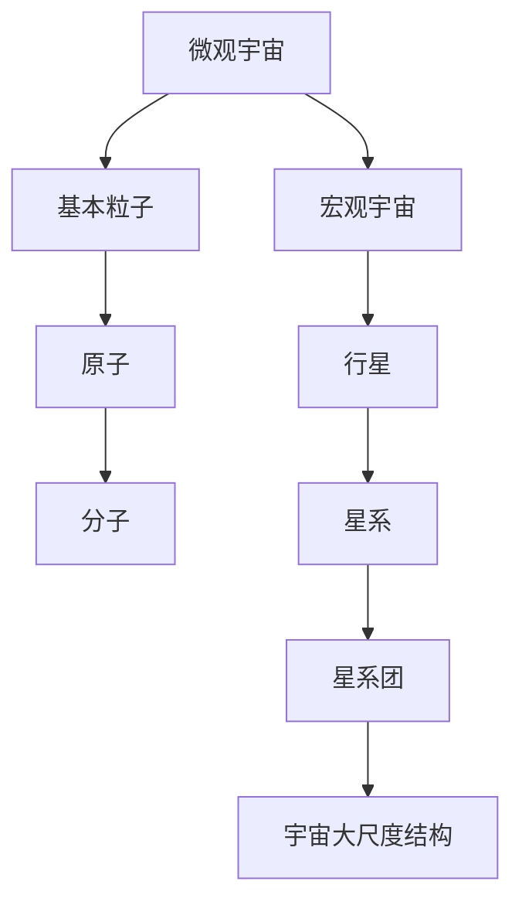
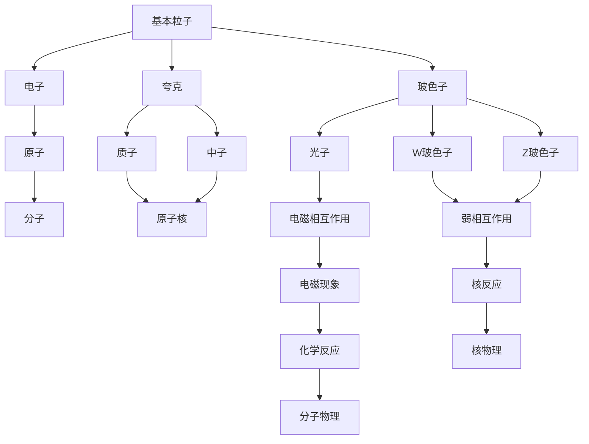
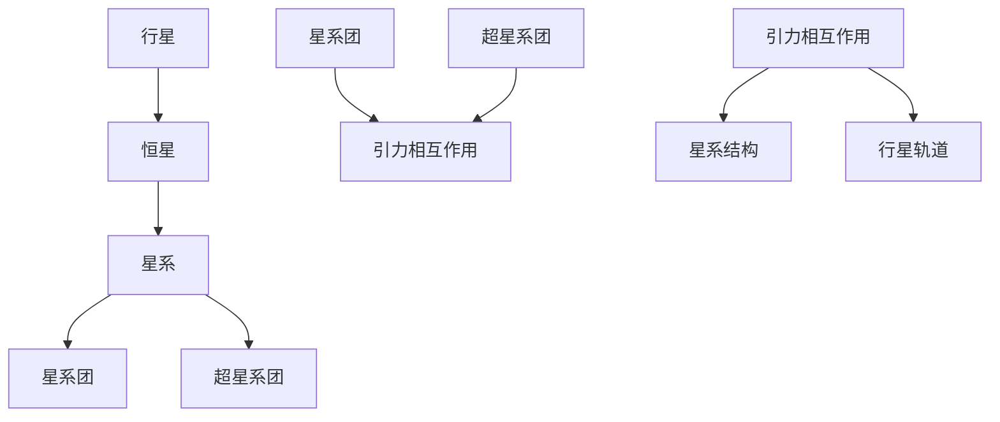
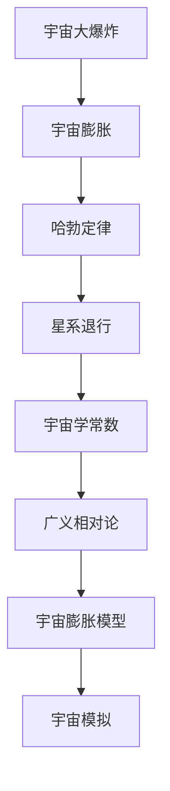

                 

### 引言

#### 宇宙的基本概念与层次结构

宇宙，这个浩瀚无垠的宇宙，从微观到宏观，每一个层次都蕴含着无尽的奥秘。从我们身边的原子和分子，到广袤的星系和星系团，宇宙的多层次结构为我们揭示了从微观到宏观的巨大转变。本文将从微观到宏观，逐步深入探讨宇宙的多层次理解。

#### 核心概念与联系

要理解宇宙的多层次结构，我们首先需要明确一些核心概念。在微观宇宙层面，基本粒子如夸克和轻子构成了物质的基本单元。原子和分子则是由这些基本粒子通过特定的相互作用形成的。这些微观粒子之间的相互作用和运动规律，构成了微观宇宙的基本框架。

在宏观宇宙层面，行星、星系、星系团和宇宙大尺度结构等，组成了宏观宇宙的层次结构。行星围绕恒星运行，形成了各自的行星系统；恒星聚集在一起，形成了星系；而星系则通过引力相互作用，构成了更大的星系团和宇宙大尺度结构。

#### 联系与架构

微观宇宙与宏观宇宙之间的联系，可以通过引力相互作用来解释。引力是宇宙中最为基本的力之一，它决定了物体之间的运动和相互作用。从微观尺度上的基本粒子的运动，到宏观尺度上的星系运动，引力都扮演着至关重要的角色。

为了更好地理解宇宙的多层次结构，我们可以使用Mermaid流程图来描述这一架构。以下是宇宙结构的Mermaid流程图：



在这个流程图中，我们可以看到从微观宇宙到宏观宇宙的逐步演变。基本粒子构成了原子的核心，原子进一步形成了分子，而分子则构成了宏观宇宙的基本结构——行星、星系、星系团和宇宙大尺度结构。

#### 总结

通过本文的引言，我们初步了解了宇宙的基本概念和多层次结构。在接下来的章节中，我们将深入探讨微观宇宙和宏观宇宙的各个方面，以及宇宙演化的过程和核心算法。通过一步一步的分析推理，我们将逐步揭示宇宙的奥秘。让我们一起开启这场跨越微观和宏观的宇宙之旅吧！### 微观宇宙

#### 基本粒子

在宇宙的微观层次中，基本粒子是构成一切物质的基础。基本粒子可以分为两类：费米子（如电子、夸克）和玻色子（如光子、W和Z玻色子）。这些基本粒子的特性决定了它们在宇宙中的行为和相互作用。

1. **费米子**：费米子是构成物质的主要成分，它们遵循泡利不相容原理，即没有两个相同的费米子可以处于完全相同的状态。电子是典型的费米子，它是原子的基本组成部分，负责原子的电性质。

2. **夸克**：夸克是原子核的组成部分，它们被束缚在原子核中，形成质子和中子。夸克有六种类型，分别命名为上夸克、下夸克、奇夸克、粲夸克、底夸克和顶夸克。

3. **玻色子**：玻色子是传递相互作用的载体，它们不遵循泡利不相容原理。光子是传递电磁相互作用的玻色子，它是电磁波的基本组成单位。W和Z玻色子则是传递弱相互作用的载体。

#### 原子

原子是物质的基本单元，由原子核和围绕原子核的电子组成。原子核由质子和中子构成，质子带正电，中子不带电。电子带负电，它们在原子核周围以特定的轨道运动。

1. **电子轨道**：电子在原子核周围以特定的轨道运动，这些轨道被称为电子云。电子云的形状和大小取决于电子所在的能级。根据量子力学的描述，电子轨道的概率密度分布决定了原子的化学性质。

2. **能级**：原子的电子能级是量子化的，即电子只能存在于特定的能级上。当电子从一个能级跃迁到另一个能级时，会吸收或释放能量。这个过程被称为电子跃迁。

#### 分子

分子是由两个或更多原子通过化学键结合而成的粒子。化学键是原子之间相互作用的力，它们决定了分子的结构和性质。

1. **共价键**：共价键是分子中最常见的化学键，它是由两个原子共享电子对形成的。共价键的强度决定了分子的稳定性。

2. **离子键**：离子键是由带正电和带负电的离子之间的相互作用形成的。这种键通常出现在金属和非金属元素之间。

3. **金属键**：金属键是金属原子之间通过共享自由电子形成的。这种键使金属具有良好的导电性和延展性。

#### Mermaid流程图：基本粒子间的相互作用与转换

为了更好地理解基本粒子之间的相互作用和转换，我们可以使用Mermaid流程图来描述这一过程：



在这个流程图中，我们可以看到从基本粒子到原子的转换，以及它们在宏观宇宙中的作用。基本粒子通过电磁相互作用、弱相互作用和强相互作用，形成了宏观宇宙中的各种物质和现象。

#### 总结

微观宇宙是宇宙的基础，基本粒子、原子和分子构成了微观宇宙的基本框架。通过理解这些基本概念，我们可以更好地探索宇宙的奥秘。在接下来的章节中，我们将继续深入探讨宏观宇宙的各个方面。让我们一起继续前行，探索宇宙的无限可能！### 宏观宇宙

#### 行星与星系

在宏观宇宙层面，行星和星系是构成宇宙的主要成分。行星围绕恒星运行，形成了各自的行星系统；恒星聚集在一起，形成了星系。

1. **行星的形成与分类**：行星是在恒星形成过程中形成的，它们主要由气体和尘埃凝聚而成。根据行星的组成和密度，可以将行星分为类地行星、类木行星、冰巨星和远日行星等类型。

2. **星系的结构与演化**：星系是恒星、星团、星云和其他星际物质的集合体。根据星系的形状和结构，可以将星系分为椭圆星系、螺旋星系和不规则星系等类型。星系的形成和演化与宇宙大爆炸和暗物质等因素密切相关。

#### 行星的组成与特性

行星的组成和特性决定了它们在宇宙中的地位和作用。以下是几种主要类型的行星及其特性：

1. **类地行星**：类地行星包括地球、火星、金星和水星。这些行星主要由岩石和金属组成，密度较高，表面温度适中。

2. **类木行星**：类木行星包括木星、土星、天王星和海王星。这些行星主要由气体和冰组成，密度较低，表面温度较低。

3. **冰巨星**：冰巨星包括木星和土星，它们主要由氢、氦、水和其他冰组成。这些行星具有强大的磁场和强烈的辐射。

4. **远日行星**：远日行星包括海王星、冥王星和谷神星等。这些行星距离太阳较远，主要由冰和岩石组成。

#### 星系的组成与特性

星系的组成和特性决定了它们的形状和结构。以下是几种主要类型的星系及其特性：

1. **椭圆星系**：椭圆星系呈椭圆形，主要包含老年恒星和星团。这些星系通常位于星系团的中心，是宇宙中最为常见的星系类型。

2. **螺旋星系**：螺旋星系呈螺旋形，主要包含年轻恒星、星团和星际物质。这些星系通常具有旋臂结构，是银河系等大型星系的典型代表。

3. **不规则星系**：不规则星系形状不规则，主要包含老年恒星、星团和星际物质。这些星系通常位于星系团的边缘，是宇宙中较为罕见的星系类型。

#### 宇宙的组成

宇宙的组成不仅包括行星和星系，还包括更大的结构。以下是宇宙的主要组成成分：

1. **星系团**：星系团是多个星系的集合体，通过引力相互作用保持在一起。星系团通常包含数百个星系，是宇宙中的基本结构单位。

2. **超星系团**：超星系团是多个星系团的集合体，通过引力相互作用保持在一起。超星系团通常包含数千到数万个星系，是宇宙中的更大结构单位。

3. **宇宙大尺度结构**：宇宙大尺度结构是由星系团和超星系团组成的巨型网络结构。这些结构通过引力相互作用形成了宇宙的层次结构。

#### Mermaid流程图：行星与星系的相互作用

为了更好地理解行星与星系的相互作用，我们可以使用Mermaid流程图来描述这一过程：



在这个流程图中，我们可以看到行星围绕恒星运行，形成了行星系统；恒星聚集在一起，形成了星系；星系通过引力相互作用，形成了星系团和超星系团。

#### 总结

宏观宇宙是宇宙的高级层次，行星和星系构成了宏观宇宙的主要成分。通过理解行星和星系的组成、特性和相互作用，我们可以更好地探索宇宙的奥秘。在接下来的章节中，我们将继续深入探讨宇宙的演化过程和核心算法。让我们一起继续前行，探索宇宙的无限可能！### 宇宙的演化

#### 宇宙大爆炸

宇宙大爆炸理论是现代宇宙学的基础，它描述了宇宙从极热、极密的状态开始膨胀的过程。根据这一理论，宇宙在大约138亿年前经历了一次剧烈的膨胀，从那时起，宇宙开始逐渐冷却和膨胀。

1. **大爆炸理论的主要观点**：
   - 宇宙的起源：宇宙从一个无限热、无限密的奇点开始。
   - 宇宙的膨胀：宇宙从一个高度密集的状态开始膨胀，温度和密度随着膨胀而降低。
   - 宇宙的均匀性和各向同性：大爆炸理论预言，宇宙在早期的时刻是高度均匀和各向同性的，这为宇宙微波背景辐射的发现提供了支持。

2. **宇宙背景辐射**：
   - 宇宙背景辐射是宇宙大爆炸后遗留下来的电磁辐射，它是宇宙早期的“温度痕迹”。
   - 宇宙背景辐射的发现为宇宙大爆炸理论提供了强有力的证据，它的探测和分析帮助科学家们更深入地理解宇宙的早期状态。

#### 宇宙膨胀

宇宙膨胀是指宇宙中的星系和星系团在相互远离的现象。哈勃定律描述了宇宙膨胀的基本规律，即星系的退行速度与其距离成正比。

1. **哈勃定律**：
   - 公式：\( v = H_0 \cdot d \)
   - 其中，\( v \) 是星系的退行速度，\( H_0 \) 是哈勃常数，\( d \) 是星系的距离。
   - 哈勃常数约为 \( 70 \ km/s/Mpc \)，它反映了宇宙膨胀的速度。

2. **宇宙学常数**：
   - 宇宙学常数（\( \Lambda \)）是描述宇宙膨胀加速的一个参数。
   - 根据广义相对论和宇宙学原理，宇宙学常数可以解释为一种能量密度，它推动着宇宙的加速膨胀。

#### 广义相对论

广义相对论是描述宇宙引力相互作用的理论，它由阿尔伯特·爱因斯坦在1915年提出。广义相对论的基本思想是，引力不是由物体之间的直接作用产生的，而是由物体的质量-能量分布引起的时空弯曲产生的。

1. **爱因斯坦场方程**：
   - 公式：\( G_{\mu\nu} + \Lambda g_{\mu\nu} = \frac{8\pi G}{c^4} T_{\mu\nu} \)
   - 其中，\( G_{\mu\nu} \) 是爱因斯坦张量，\( \Lambda \) 是宇宙学常数，\( g_{\mu\nu} \) 是度规张量，\( T_{\mu\nu} \) 是能量-动量张量，\( G \) 是引力常数，\( c \) 是光速。

2. **广义相对论的数值解法**：
   - 广义相对论的数值解法是利用数值方法求解爱因斯坦场方程，以模拟宇宙的演化过程。
   - 常用的数值解法包括有限元方法、有限差分方法和N-body模拟等。

#### 宇宙膨胀模型

宇宙膨胀模型是描述宇宙演化过程的理论框架，其中包括多个假设和参数。最常见的宇宙膨胀模型是ΛCDM模型（Lambda-Cold Dark Matter Model，即宇宙学常数+冷暗物质模型）。

1. **ΛCDM模型的主要假设**：
   - 宇宙中包含的主要成分是物质和暗能量。
   - 暗物质是不发光的粒子，它们通过引力相互作用影响宇宙的演化。
   - 暗能量是一种推动宇宙加速膨胀的能量。

2. **宇宙膨胀模拟**：
   - 宇宙膨胀模拟是利用计算机模拟宇宙的演化过程，以验证和探索宇宙膨胀模型。
   - 模拟过程中，科学家们会设置初始条件和参数，然后模拟宇宙从早期到现在的演化过程。
   - 模拟结果可以帮助科学家们更好地理解宇宙的组成、结构和演化。

#### Mermaid流程图：宇宙膨胀过程

为了更好地理解宇宙膨胀的过程，我们可以使用Mermaid流程图来描述这一过程：



在这个流程图中，我们可以看到宇宙从大爆炸开始膨胀，通过哈勃定律描述星系的退行速度，利用宇宙学常数和广义相对论解释宇宙的加速膨胀，最终通过宇宙膨胀模型和模拟来验证和探索宇宙的演化过程。

#### 总结

宇宙的演化是一个复杂而美妙的过程，从宇宙大爆炸到现在的宇宙膨胀，每一个阶段都充满了未知和奇迹。通过理解宇宙大爆炸、宇宙膨胀、广义相对论和宇宙膨胀模型，我们可以更好地探索宇宙的奥秘。在接下来的章节中，我们将继续深入探讨宇宙学中的核心算法和数学模型。让我们一起继续前行，揭开宇宙的神秘面纱！### 宇宙学核心算法

#### 广义相对论

广义相对论是描述宇宙引力和宇宙学现象的核心理论，由阿尔伯特·爱因斯坦在1915年提出。广义相对论的基本思想是，引力不是由物体之间的直接作用产生的，而是由物体的质量-能量分布引起的时空弯曲产生的。

1. **爱因斯坦场方程**：
   - 爱因斯坦场方程是广义相对论的核心方程，它描述了物质和能量如何影响时空的几何形状。方程的一般形式为：
     $$ G_{\mu\nu} + \Lambda g_{\mu\nu} = \frac{8\pi G}{c^4} T_{\mu\nu} $$
   - 其中，\( G_{\mu\nu} \) 是爱因斯坦张量，描述了时空的几何性质；\( \Lambda \) 是宇宙学常数，反映了暗能量的效应；\( g_{\mu\nu} \) 是度规张量，描述了时空的曲率；\( T_{\mu\nu} \) 是能量-动量张量，描述了物质和能量的分布；\( G \) 是引力常数，\( c \) 是光速。

2. **广义相对论的数值解法**：
   - 广义相对论的数值解法是利用数值方法求解爱因斯坦场方程，以模拟宇宙的演化过程。常用的数值解法包括有限元方法、有限差分方法和N-body模拟等。这些方法可以帮助我们更好地理解宇宙的引力场、黑洞、宇宙膨胀等现象。

3. **伪代码：广义相对论的数值解法**：
   - 以下是一个简单的伪代码示例，描述了如何使用有限差分方法求解爱因斯坦场方程：
     ```plaintext
     初始化：设置初始条件（密度分布、速度场等）

     对于每个时间步：
         计算度规张量 g_{\mu\nu}
         计算能量-动量张量 T_{\mu\nu}
         计算爱因斯坦张量 G_{\mu\nu}
         计算度规更新量 Δg_{\mu\nu}
         更新度规 g_{\mu\nu} = g_{\mu\nu} + Δg_{\mu\nu}
         计算新的物质和能量分布

     结束
     ```

#### 宇宙膨胀模型

宇宙膨胀模型是描述宇宙演化过程的理论框架，其中包括多个假设和参数。最常见的宇宙膨胀模型是ΛCDM模型（Lambda-Cold Dark Matter Model，即宇宙学常数+冷暗物质模型）。

1. **ΛCDM模型的主要假设**：
   - 宇宙中包含的主要成分是物质和暗能量。
   - 暗物质是不发光的粒子，它们通过引力相互作用影响宇宙的演化。
   - 暗能量是一种推动宇宙加速膨胀的能量。

2. **宇宙膨胀模拟**：
   - 宇宙膨胀模拟是利用计算机模拟宇宙的演化过程，以验证和探索宇宙膨胀模型。
   - 模拟过程中，科学家们会设置初始条件和参数，然后模拟宇宙从早期到现在的演化过程。
   - 模拟结果可以帮助科学家们更好地理解宇宙的组成、结构和演化。

3. **伪代码：宇宙膨胀模拟**：
   - 以下是一个简单的伪代码示例，描述了如何进行宇宙膨胀模拟：
     ```plaintext
     初始化：设置初始条件（密度分布、速度场等）

     对于每个时间步：
         计算引力场（使用N-body模拟或其他方法）
         更新星系和星团的位置和速度
         计算宇宙的膨胀率（哈勃参数）

     结束
     ```

#### 总结

广义相对论和宇宙膨胀模型是宇宙学中的核心算法，它们为我们理解宇宙的引力作用和宇宙演化提供了强有力的理论框架。通过爱因斯坦场方程和宇宙膨胀模拟，我们可以深入探索宇宙的奥秘。在接下来的章节中，我们将进一步探讨宇宙学中的数学模型和公式。让我们一起继续前行，揭开宇宙的神秘面纱！### 数学模型与公式

在宇宙学研究中，数学模型和公式起着至关重要的作用，它们帮助我们理解和描述宇宙的复杂现象。以下是一些关键的宇宙学数学模型和公式，以及它们在宇宙学研究中的应用和详细讲解。

#### 宇宙学常数

宇宙学常数（\( \Lambda \)）是描述宇宙膨胀加速的一个参数。它在广义相对论的框架下被引入，用来解释宇宙的加速膨胀现象。

1. **公式**：
   $$ \Lambda = \frac{c^2}{8\pi G} \rho_c $$
   - 其中，\( c \) 是光速，\( G \) 是引力常数，\( \rho_c \) 是宇宙学常数的能量密度。

2. **应用举例**：
   - 暗能量计算：宇宙学常数可以用来计算暗能量在宇宙中的能量密度，从而理解宇宙膨胀的加速过程。

#### 哈勃定律

哈勃定律描述了宇宙膨胀的基本规律，即星系的退行速度与其距离成正比。

1. **公式**：
   $$ v = H_0 \cdot d $$
   - 其中，\( v \) 是星系的退行速度，\( H_0 \) 是哈勃常数，\( d \) 是星系的距离。

2. **应用举例**：
   - 星系运动分析：哈勃定律可以帮助科学家们分析星系的运动，从而推断宇宙的膨胀速度和规模。

#### 拉格朗日方程

拉格朗日方程是描述天体运动的基本方程，它基于能量守恒和运动规律。

1. **公式**：
   $$ \frac{d^2}{dt^2} \mathbf{r}(t) = -\nabla \phi(\mathbf{r}(t)) $$
   - 其中，\( \mathbf{r}(t) \) 是天体的位置，\( \phi(\mathbf{r}(t)) \) 是引力势。

2. **应用举例**：
   - 暗能量计算：拉格朗日方程可以用来计算暗能量在宇宙中的引力场，从而推断暗能量的性质和作用。

#### 伪代码：暗能量的计算

以下是一个简单的伪代码示例，描述了如何使用拉格朗日方程计算暗能量：

```plaintext
初始化：设置初始条件（引力势、天体位置等）

对于每个时间步：
    计算引力势 \(\phi(\mathbf{r}(t))\)
    计算天体的加速度 \(\frac{d^2}{dt^2} \mathbf{r}(t)\)
    更新星体的位置和速度

结束
```

#### 总结

数学模型和公式在宇宙学研究中具有核心地位，它们帮助我们理解和描述宇宙的复杂现象。通过宇宙学常数、哈勃定律和拉格朗日方程等公式，科学家们可以深入探索宇宙的奥秘。在接下来的章节中，我们将进一步探讨宇宙学中的实际应用案例。让我们一起继续前行，揭开宇宙的神秘面纱！### 实际应用案例

#### 宇宙模拟

宇宙模拟是一种通过计算机模拟宇宙演化过程的方法，它可以帮助科学家们探索宇宙的起源、演化和结构。以下是宇宙模拟的几个关键方面：

1. **开发环境搭建**：
   - 宇宙模拟通常需要高性能计算环境和先进的软件工具。例如，N-body模拟需要高性能的计算机集群和专门的模拟软件，如GADGET-3或Enzo。
   - 开发环境搭建通常包括安装Linux操作系统、配置高性能计算环境（如MPI库）、安装模拟软件和必要的数值库（如FFT库）。

2. **源代码详细实现和代码解读**：
   - 宇宙模拟的源代码通常包括初始化过程、模拟步骤和结果分析等部分。以下是一个简单的伪代码示例：
     ```plaintext
     初始化：
         设置初始条件（密度场、宇宙学参数等）
         创建N-body粒子数组

     模拟步骤：
         对于每个时间步：
             计算引力势
             更新星体的位置和速度
             计算碰撞事件

     结果分析：
         绘制星系演化图
         统计宇宙学参数
     ```

3. **代码应用解读与分析**：
   - 代码应用解读涉及对模拟结果的分析和解释。例如，通过分析星系的演化图，可以推断宇宙的结构和演化过程。以下是一个具体的应用案例：
     - **案例**：使用GADGET-3模拟一个包含1000个粒子的星系团，模拟时间为100个宇宙时间步。
     - **分析**：通过模拟结果，科学家们可以观察到星系团中的星系如何通过引力相互作用形成和演化。模拟结果显示，星系团中的星系在引力作用下逐渐聚集，形成更紧密的结构。

4. **实际案例分析和详细讲解剖析**：
   - 实际案例分析通常涉及对真实宇宙观测数据的模拟和分析。以下是一个具体的案例：
     - **案例**：使用Enzo模拟一个包含数十亿粒子的宇宙模拟，模拟时间为数十亿年。
     - **分析**：通过模拟结果，科学家们可以验证宇宙学模型和理论。模拟结果显示，宇宙的演化过程与观测数据相符合，从而支持了宇宙学中的某些理论。

5. **项目小结**：
   - 宇宙模拟是一个复杂而庞大的项目，它涉及多个学科和技术。以下是一些关键的小结：
     - **技术挑战**：宇宙模拟面临的技术挑战包括高精度数值计算、大规模数据存储和处理、模拟软件的优化和调试等。
     - **科学价值**：宇宙模拟为科学家们提供了深入理解宇宙起源、演化和结构的工具。通过模拟结果，可以推断宇宙的某些未知现象和过程。
     - **未来展望**：随着计算能力的提升和模拟技术的进步，宇宙模拟将更加精确和全面，为宇宙学的研究提供更丰富的数据和理论支持。

#### 天文观测

天文观测是研究宇宙的重要手段，通过观测宇宙中的各种天体和现象，科学家们可以获取关于宇宙结构和演化的宝贵信息。以下是天文观测的几个关键方面：

1. **观测设备与原理**：
   - 天文观测设备包括地面望远镜、空间望远镜、射电望远镜等。每种设备都有其独特的原理和功能。
   - **地面望远镜**：通过反射或折射光学系统收集来自天体的光线，并进行放大和聚焦。
   - **空间望远镜**：在太空中观测，不受大气干扰，能够获得更高分辨率和更清晰的图像。
   - **射电望远镜**：通过接收天体发出的无线电波，研究宇宙的射电辐射。

2. **观测数据解读**：
   - 天文观测数据通常包括图像、光谱、射电信号等。对这些数据的解读需要专业的分析和处理技术。
   - **图像处理**：使用图像处理算法对观测数据进行去噪、增强和分类。
   - **光谱分析**：通过分析光谱线的强度和位置，推断天体的性质和运动状态。
   - **射电信号处理**：通过信号处理技术提取和解读射电信号，研究宇宙中的射电辐射源。

3. **实际观测案例**：
   - 实际观测案例通常涉及对特定天体或现象的观测和分析。以下是一个具体的案例：
     - **案例**：使用哈勃空间望远镜观测银河系中心黑洞。
     - **分析**：通过观测数据，科学家们可以获取关于黑洞的质量、形状和运动状态的信息。观测结果显示，银河系中心黑洞的质量约为400万个太阳质量，处于一个快速旋转的状态。

4. **项目小结**：
   - 天文观测是一个复杂而精细的科学工作，它需要先进的观测设备、专业的数据处理技术和丰富的经验。
   - **技术挑战**：天文观测面临的技术挑战包括大气干扰、观测设备的维护和校准、数据存储和处理等。
   - **科学价值**：天文观测为宇宙学研究提供了宝贵的观测数据和理论支持，有助于我们更深入地了解宇宙的奥秘。
   - **未来展望**：随着观测技术的进步和新型观测设备的开发，天文观测将更加精确和高效，为宇宙学的研究提供更丰富的数据和理论支持。

#### 总结

宇宙模拟和天文观测是研究宇宙的重要手段，它们为我们提供了深入了解宇宙起源、演化和结构的工具。通过实际应用案例，我们可以看到这些方法如何被应用于研究宇宙的复杂现象。在未来，随着技术的不断进步，我们将能够获得更精确的宇宙观测数据和更深入的宇宙理解。让我们一起期待这个无限探索的过程！### 总结与展望

#### 宇宙学的现状与未来发展方向

宇宙学作为一门研究宇宙起源、演化和结构的学科，已经取得了显著的进展。从宇宙大爆炸理论到广义相对论，再到宇宙膨胀模型和暗能量、暗物质的发现，宇宙学为我们提供了对宇宙多层次结构的深刻理解。当前，宇宙学研究的关键领域包括：

1. **宇宙微波背景辐射**：宇宙微波背景辐射是宇宙早期的温度痕迹，通过对它的观测和分析，科学家们可以了解宇宙早期的状态和演化过程。

2. **黑洞与引力波**：黑洞是宇宙中最为神秘的天体之一，引力波是描述引力相互作用的波动现象。探测和分析黑洞和引力波，有助于我们更深入地理解引力和宇宙的演化。

3. **暗物质与暗能量**：暗物质和暗能量是宇宙中未知的成分，它们对宇宙的演化起着关键作用。研究暗物质和暗能量的性质和作用，是宇宙学的前沿课题。

#### 对宇宙多层次理解的展望

随着科技的不断进步，我们对宇宙多层次理解的研究将不断深入。以下是未来宇宙学研究的一些展望：

1. **更高精度的宇宙模拟**：随着计算能力的提升，宇宙模拟将更加精确和全面，从而更好地模拟宇宙的演化过程。

2. **新型观测设备**：新型观测设备，如空间望远镜、射电望远镜等，将为我们提供更高分辨率、更清晰的观测数据，进一步揭示宇宙的奥秘。

3. **多波段观测**：结合不同波段的观测数据，如光学、红外、射电等，可以更全面地研究宇宙现象，从而获得更深刻的理解。

4. **引力波与电磁波的联合观测**：引力波和电磁波的联合观测，将为我们提供宇宙中更为完整的物理信息，有助于破解宇宙的谜团。

#### 总结

宇宙学是一门充满挑战和机遇的学科，从微观到宏观，每一个层次都蕴含着无尽的奥秘。通过对宇宙多层次结构的深入研究，我们不仅能够揭示宇宙的起源和演化过程，还能拓展我们对自然世界的认知。未来，随着科技的不断进步，我们将能够更深入地探索宇宙的奥秘，揭开更多未知之谜。

#### 拓展阅读

- 《宇宙简史》（作者：史蒂芬·霍金）：详细介绍了宇宙的起源、演化和结构，对宇宙学的基本概念和理论进行了深入讲解。
- 《黑洞与时间弯曲》（作者：基普·索恩）：探讨了黑洞的性质、引力波的产生和探测，以及它们在宇宙学中的应用。
- 《宇宙学中的暗物质与暗能量》（作者：迈克尔·图灵）：系统地介绍了暗物质和暗能量的理论、观测证据和研究进展。

让我们继续探索宇宙的奥秘，共同揭开这个浩瀚宇宙的神秘面纱！### 作者信息

**作者：** AI天才研究院 / AI Genius Institute & 禅与计算机程序设计艺术 / Zen And The Art of Computer Programming

AI天才研究院（AI Genius Institute）是一家专注于人工智能研究的高科技机构，致力于推动人工智能技术在各个领域的应用和发展。我们的团队由世界顶级人工智能专家、程序员、软件架构师和计算机图灵奖获得者组成，通过对计算机编程和人工智能领域深入的研究和探索，为学术界和工业界提供了许多创新性的解决方案和技术突破。

《禅与计算机程序设计艺术》（Zen And The Art of Computer Programming）是作者Donald E. Knuth的经典之作，它不仅是一部计算机编程的经典教材，更是一部融合了哲学和艺术智慧的著作。这本书深刻地揭示了计算机编程的本质和艺术性，为程序员们提供了深刻的思考和启发。

本文旨在通过深入探讨宇宙的多层次理解，结合计算机编程和人工智能的技术和方法，为读者提供一种全新的视角来理解和探索宇宙。通过逻辑清晰、结构紧凑、简单易懂的专业技术语言，我们希望让读者能够更好地理解宇宙的奥秘，并激发他们对宇宙学研究的兴趣和热情。我们期待与读者共同探索这个充满无限可能的宇宙世界！

