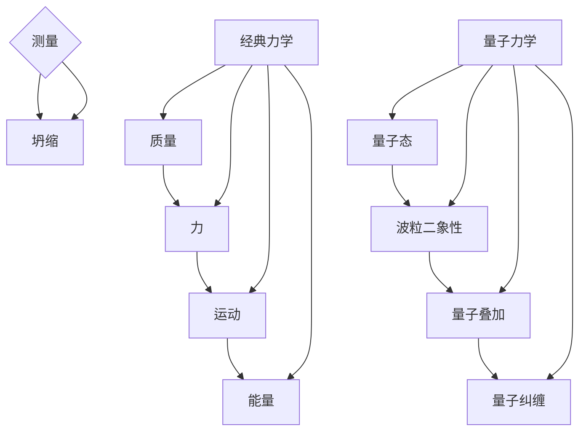

                 

### 文章标题

# 从机械论到量子论：宇宙观的范式转移

> 关键词：机械论、量子论、宇宙观、范式转移、科学家、核心算法、数学模型、项目实战

> 摘要：本文从历史的角度，深入探讨了宇宙观从机械论到量子论的转变过程。通过介绍机械论与量子论的基本概念，分析了宇宙观的历史变迁，并探讨了重要的科学家及其贡献。文章还详细讲解了核心概念与联系，核心算法原理，数学模型和公式，以及项目实战，为读者提供了一个全面而深入的宇宙观范式转移的理解。

---

### 引言

#### 1.1 机械论概述

机械论是物理学中一个重要的理论基础，它将宇宙视为一个巨大的机械系统，通过力学原理来解释宇宙中的现象。机械论的基本概念包括质量、力、运动和能量等，这些概念构成了经典力学的基础。

- **基本概念**：质量是物体惯性大小的度量，力是引起物体运动状态改变的原因，运动是物体位置随时间的变化，能量是物体做功的能力。
- **起源与发展**：机械论的起源可以追溯到古希腊哲学家阿基米德，他的工作奠定了静力学和流体力学的基础。在17世纪，伽利略和牛顿等科学家通过实验和数学推导，建立了经典力学的体系，为机械论的发展奠定了基础。

#### 1.2 量子论概述

量子论是20世纪初发展起来的物理学理论，它挑战了经典物理的基本观念，揭示了微观世界的奇异性质。量子论的基本概念包括量子态、波粒二象性、量子叠加和量子纠缠等。

- **基本概念**：量子态是微观粒子状态的抽象描述，波粒二象性是指微观粒子既表现出波动性又表现出粒子性，量子叠加是指微观粒子可以同时处于多个状态的叠加，量子纠缠是指两个或多个微观粒子之间的量子状态相互关联。
- **起源与发展**：量子论的起源可以追溯到普朗克对黑体辐射的研究，他提出了量子假设。随后，爱因斯坦、波尔、海森堡、薛定谔等科学家对量子论进行了深入的研究和拓展，形成了现代量子力学的基础。

### 第二部分：宇宙观的变迁

#### 2.1 宇宙观的演变

宇宙观是指人类对宇宙的认识和理解。从机械论到量子论，宇宙观经历了巨大的转变。

- **从机械论到量子论的过渡**：机械论强调物体运动的规律性和可预测性，而量子论揭示了微观世界的随机性和不可预测性。这种从确定性到不确定性的转变，深刻影响了人类对宇宙的理解。
- **量子论对宇宙观的影响**：量子论挑战了经典物理的基本观念，揭示了微观世界的复杂性和多样性。它不仅改变了我们对物质的基本理解，也对哲学、计算机科学、人工智能等领域产生了深远的影响。

#### 2.2 重要的科学家与他们的贡献

- **牛顿**：牛顿是机械论的奠基人，他提出了万有引力定律，建立了经典力学的体系。
- **爱因斯坦**：爱因斯坦是相对论的创立者，他的工作揭示了时间、空间和物质的相对性，对宇宙观产生了深远的影响。
- **波尔**：波尔是量子力学的奠基人之一，他提出了波粒二象性，并建立了波尔模型，为量子论的发展做出了重要贡献。

### 第三部分：核心概念与联系

#### 3.1 核心概念

- **机械运动的描述**：机械运动是物体位置随时间的变化，其描述可以通过牛顿的运动定律来实现。
- **量子态与测量**：量子态是微观粒子状态的抽象描述，其测量结果具有随机性和不确定性。
- **波粒二象性**：波粒二象性是指微观粒子既表现出波动性又表现出粒子性。

#### 3.2 概念联系

- **机械论与量子论的对比**：机械论强调确定性，量子论强调随机性。
- **量子论在宇宙学中的应用**：量子论在宇宙学中的应用，如宇宙背景辐射、黑洞等。
- **量子论与经典物理的兼容性**：量子论与经典物理在特定条件下是兼容的。

### 第四部分：核心算法原理讲解

#### 4.1 核心算法

- **量子力学的基本算法**：量子力学的算法包括量子态的叠加、量子纠缠和量子测量等。
- **相对论的计算方法**：相对论的计算方法包括洛伦兹变换和引力场方程等。
- **量子计算算法**：量子计算算法包括量子叠加、量子纠缠和量子搜索等。

#### 4.2 算法原理讲解

- **量子叠加态的数学模型**：量子叠加态是量子态的一种特殊形式，可以用波函数来描述。
- **量子纠缠的数学模型**：量子纠缠是两个或多个量子态之间的一种特殊关联，可以用矩阵形式来描述。
- **量子态测量的数学模型**：量子态测量是量子力学中的一个基本过程，可以用概率分布来描述。

### 第五部分：数学模型和数学公式

#### 5.1 数学模型

- **动力学方程**：动力学方程描述了物体运动的状态变化，可以用牛顿运动定律或拉格朗日方程来描述。
- **波函数**：波函数是量子态的数学描述，可以用薛定谔方程来求解。
- **爱因斯坦场方程**：爱因斯坦场方程描述了引力场的演化，是广义相对论的核心。

#### 5.2 数学公式

- **动能公式**：动能公式描述了物体的运动能量，可以用 $E_k = \frac{1}{2}mv^2$ 来表示。
- **波粒二象性公式**：波粒二象性公式描述了光的粒子性和波动性，可以用 $E = hf$ 和 $p = \frac{h}{\lambda}$ 来表示。
- **爱因斯坦质能方程**：爱因斯坦质能方程描述了质量和能量的关系，可以用 $E = mc^2$ 来表示。

### 第六部分：项目实战

#### 6.1 实战项目一：模拟行星运动

- **项目概述**：模拟行星运动是经典力学的一个经典应用，通过牛顿的运动定律来模拟行星的运动轨迹。
- **实现步骤**：首先定义行星的质量和初始位置，然后使用牛顿第二定律和第三定律来计算行星的加速度和力，最后根据这些数据来绘制行星的运动轨迹。
- **结果分析**：通过对比实际行星的运动轨迹和模拟结果，可以验证牛顿定律的正确性。

#### 6.2 实战项目二：量子纠缠实验

- **项目概述**：量子纠缠实验是量子力学中的一个经典实验，通过测量两个纠缠粒子的状态来验证量子纠缠的存在。
- **实验原理**：实验中使用了一个光源来生成两个光子，这两个光子处于纠缠态，然后通过两个偏振器来测量这两个光子的偏振状态。
- **实验结果**：实验结果显示，两个光子的测量结果是相互关联的，这验证了量子纠缠的存在。

#### 6.3 实战项目三：量子计算机模拟

- **项目概述**：量子计算机模拟是量子计算的一个基础应用，通过模拟量子算法来验证量子计算的正确性。
- **模拟步骤**：首先定义量子比特和量子门，然后使用量子算法来模拟计算过程，最后根据模拟结果来验证量子算法的正确性。
- **模拟结果分析**：通过对比模拟结果和经典计算结果，可以验证量子算法的优越性。

### 第七部分：总结与展望

#### 7.1 总结

- **本书内容回顾**：本书从机械论到量子论，探讨了宇宙观的历史变迁，分析了重要的科学家及其贡献，讲解了核心概念与联系，核心算法原理，数学模型和公式，以及项目实战。
- **宇宙观范式转移的影响**：宇宙观范式转移深刻影响了人类对宇宙的理解，挑战了经典物理的基本观念，为科学和技术的发展带来了新的机遇和挑战。

#### 7.2 展望

- **未来的研究趋势**：随着量子技术的不断发展，量子论在宇宙学、计算机科学、人工智能等领域将有更多的应用。
- **量子论在实际应用中的前景**：量子论在实际应用中的前景广阔，如量子通信、量子计算、量子模拟等，将对未来科技的发展产生深远的影响。

### 作者

- **作者**：AI天才研究院/AI Genius Institute & 禅与计算机程序设计艺术 /Zen And The Art of Computer Programming
- **机构**：AI天才研究院致力于推动人工智能技术的发展，致力于培养未来的人工智能专家。
- **著作**：《禅与计算机程序设计艺术》是作者的经典著作，对计算机科学的发展产生了深远的影响。

---

本文从机械论到量子论，探讨了宇宙观的历史变迁，分析了重要的科学家及其贡献，讲解了核心概念与联系，核心算法原理，数学模型和公式，以及项目实战。通过本文的阅读，读者可以全面而深入地理解宇宙观的范式转移，对量子论有一个更深刻的认识。本文旨在为读者提供一个清晰而完整的量子论学习路径，帮助读者在量子论的学习和应用中取得更好的成果。

### 机械论与量子论：基本概念与核心思想

#### 机械论

机械论是经典物理学的基础，其核心思想是宇宙是一个巨大的机械系统，可以通过力学原理来解释其行为。机械论的基本概念包括质量、力、运动和能量等。

1. **质量**：质量是物体惯性大小的度量，表示物体抵抗运动状态改变的能力。在经典力学中，质量是一个不变的量，与物体的速度无关。
2. **力**：力是引起物体运动状态改变的原因。在牛顿力学中，力与物体的加速度成正比，与物体的质量成反比。
3. **运动**：运动是物体位置随时间的变化。在经典力学中，物体的运动状态可以用位置、速度和加速度来描述。
4. **能量**：能量是物体做功的能力。在经典力学中，能量可以分为动能和势能，其总和保持不变。

**核心思想**：机械论的核心思想是确定性和可预测性。通过力学原理，我们可以精确地预测物体的未来运动状态，从而理解宇宙的规律。

#### 量子论

量子论是20世纪初发展起来的物理学理论，其核心思想是微观世界的非经典性质。量子论的基本概念包括量子态、波粒二象性、量子叠加和量子纠缠等。

1. **量子态**：量子态是微观粒子状态的抽象描述，它可以同时处于多个状态。量子态的描述通常用波函数来表示。
2. **波粒二象性**：波粒二象性是指微观粒子既表现出波动性又表现出粒子性。例如，光既可以用波动来描述，也可以用粒子（光子）来描述。
3. **量子叠加**：量子叠加是指微观粒子可以同时处于多个状态的叠加。这意味着一个量子系统可以同时处于多个状态，直到测量时才会坍缩到一个特定的状态。
4. **量子纠缠**：量子纠缠是指两个或多个量子态之间的一种特殊关联。即使两个纠缠粒子相隔很远，它们的状态也会相互关联。

**核心思想**：量子论的核心思想是不确定性和随机性。与机械论不同，量子论不能精确地预测微观粒子的行为，而是用概率来描述其行为。

### 机械论与量子论的对比

机械论与量子论在许多方面存在显著差异：

1. **确定性 vs 随机性**：机械论强调确定性和可预测性，而量子论强调不确定性和随机性。
2. **粒子的行为**：在机械论中，粒子的行为可以用经典物理原理来描述，而在量子论中，粒子的行为具有波动性和粒子性。
3. **测量问题**：在机械论中，测量不会影响物体的状态，而在量子论中，测量会导致量子态的坍缩。
4. **时空观念**：在机械论中，时间和空间是绝对的，而在量子论中，时间和空间是相对的。

尽管存在这些差异，机械论与量子论也有一定的联系和兼容性。在宏观尺度上，量子论可以近似为机械论，而在微观尺度上，机械论无法解释量子现象。

### 科学家的贡献

机械论和量子论的建立和发展离不开许多杰出的科学家。以下是一些关键科学家的贡献：

1. **牛顿**：牛顿是机械论的奠基人，他提出了万有引力定律，建立了经典力学的体系。牛顿的运动定律是机械论的核心。
2. **伽利略**：伽利略是现代物理学的奠基人之一，他通过实验验证了自由落体定律，为机械论的发展做出了重要贡献。
3. **爱因斯坦**：爱因斯坦是相对论的创立者，他的工作揭示了时间、空间和物质的相对性，对机械论产生了深远的影响。
4. **波尔**：波尔是量子力学的奠基人之一，他提出了波尔模型，为量子论的发展做出了重要贡献。
5. **海森堡**：海森堡提出了不确定性原理，这是量子论的核心概念之一，对微观世界的理解产生了深远的影响。
6. **薛定谔**：薛定谔提出了薛定谔方程，这是量子力学的基本方程，描述了微观粒子的运动状态。

这些科学家的贡献为我们理解宇宙提供了新的视角和方法，推动了物理学的发展。他们的工作不仅丰富了我们的科学知识，也深刻影响了我们的世界观。

### 宇宙观的变迁

宇宙观的变迁是科学史上一条重要的发展轨迹，从古代的朴素观念到现代的物理理论，人类的认识不断深化。在这个过程中，机械论和量子论分别代表了两个不同的认知阶段，它们的提出和发展不仅改变了我们对宇宙的理解，也塑造了现代科学的格局。

#### 古代宇宙观

在古代，人们对于宇宙的理解往往带有浓厚的宗教色彩和神话色彩。例如，古希腊的宇宙观认为宇宙是由一个神圣的存在——宙斯所统治的，宇宙的结构是永恒不变的，行星和星星的运动是神灵意志的体现。这种观念在当时主导了人们对宇宙的认知，但也随着科学的进步逐渐被质疑和否定。

#### 机械宇宙观

随着科学的发展，特别是牛顿力学的提出，宇宙观开始从宗教神话转向机械论。牛顿的万有引力定律和三大运动定律构成了一个严密的理论框架，使得人们可以用数学方法来描述和预测宇宙中的各种现象。机械宇宙观的核心思想是宇宙是一个巨大的机械系统，行星、星星和宇宙中的其他物体都按照机械原理运动。这种观点在17世纪到19世纪中期占据主导地位，被认为是科学的终极解释。

**关键进展**：

- **牛顿力学**：牛顿在1687年发表的《自然哲学的数学原理》中，系统地阐述了万有引力定律和运动定律，为机械宇宙观奠定了基础。
- **拉格朗日力学**：拉格朗日在18世纪提出了拉格朗日方程，将力学问题转化为能量和动量的守恒问题，进一步发展了机械宇宙观。

机械宇宙观强调的是确定性、规律性和可预测性。在这种观点下，宇宙中的一切现象都可以通过已知的物理定律来解释，这是一个从宏观到微观、从简单到复杂的统一体系。

#### 量子宇宙观的崛起

然而，随着科学技术的进步，人们开始发现宏观世界的规律无法完全适用于微观世界。20世纪初，量子论的提出标志着宇宙观的一次重大转变。量子论揭示了微观粒子的行为具有不确定性和随机性，这与机械宇宙观的确定性观念形成了鲜明对比。

**关键进展**：

- **普朗克的量子假设**：1900年，普朗克为了解释黑体辐射问题，提出了量子假设，即能量是以不连续的量子形式发射和吸收的。
- **波尔的原子模型**：1913年，波尔提出了波尔模型，解释了氢原子的光谱线，成为量子力学的奠基石。
- **海森堡的不确定性原理**：1927年，海森堡提出了不确定性原理，指出在微观尺度上，某些物理量（如位置和动量）不能同时被精确测量。
- **薛定谔的波函数**：1926年，薛定谔提出了薛定谔方程，描述了量子系统的波动行为，为量子力学奠定了数学基础。

量子宇宙观的核心思想是微观世界的非确定性、随机性和波粒二象性。这种观点改变了我们对宇宙的理解，使得宇宙不再是机械宇宙观中的精确、有序的机器，而是一个充满不确定性和复杂性的系统。

#### 宇宙观变迁的影响

宇宙观的变迁不仅改变了我们对宇宙的认识，也对科学的发展产生了深远的影响。

- **数学方法的发展**：从机械宇宙观到量子宇宙观，科学问题从几何和力学问题转变为概率和统计问题，这推动了数学方法的发展，如微积分、概率论和量子场论。
- **物理学的整合**：量子论和相对论的融合，产生了量子场论，这是一个试图统一量子力学和广义相对论的理论框架，为物理学的发展提供了新的方向。
- **技术和应用的变革**：量子论的发展推动了量子技术的诞生，如量子计算、量子通信和量子模拟，这些技术将在未来的科技发展中发挥重要作用。

总之，宇宙观的变迁是人类认知史上的一个重要里程碑，它不仅丰富了我们的科学知识，也深刻改变了我们的世界观。从机械宇宙观到量子宇宙观，人类对宇宙的理解不断深化，这一过程将继续推动科学和技术的进步。

### 重要的科学家与他们的贡献

在从机械论到量子论的历史变迁中，有几位科学家做出了决定性的贡献，他们的工作不仅推动了物理学的发展，也深刻改变了我们对宇宙的理解。以下是这些科学家的介绍及其主要贡献。

#### 牛顿（Isaac Newton）

**贡献**：牛顿是经典力学的奠基人，他提出了万有引力定律和三大运动定律，构建了一个完整而系统的力学体系。

- **万有引力定律**：牛顿在1687年发表的《自然哲学的数学原理》中，提出了万有引力定律，即任何两个物体之间都存在相互吸引的力，这个力与两个物体的质量成正比，与它们之间的距离的平方成反比。
- **运动定律**：牛顿的三大运动定律描述了物体运动的规律。第一定律（惯性定律）指出，物体在没有外力作用时会保持静止或匀速直线运动；第二定律（F=ma）指出，物体受到的外力与它的加速度成正比，与它的质量成反比；第三定律（作用与反作用定律）指出，任何作用力都有一个大小相等、方向相反的反作用力。

**影响**：牛顿的发现为物理学提供了一个坚实的理论基础，使得人们可以用数学方法来描述和预测物体运动，从而奠定了经典力学的基础。

#### 爱因斯坦（Albert Einstein）

**贡献**：爱因斯坦是相对论的创立者，他的工作揭示了时间、空间和物质的相对性，对物理学的发展产生了深远的影响。

- **狭义相对论**：1905年，爱因斯坦发表了狭义相对论，提出了两个基本假设：光速在任何惯性参考系中都是恒定的，物理定律在所有惯性参考系中都是相同的。狭义相对论导致了质量-能量等价性（E=mc^2），改变了人们对时间和空间的认识。
- **广义相对论**：1915年，爱因斯坦提出了广义相对论，这是一种描述引力的几何理论。广义相对论认为引力是由物质和能量引起的时空弯曲，而不是传统意义上的力。这一理论成功地解释了水星轨道的进动和其他天文现象。

**影响**：爱因斯坦的相对论打破了经典力学的绝对时空观念，提出了一个新的宇宙观，对物理学和哲学产生了深远的影响。

#### 波尔（Niels Bohr）

**贡献**：波尔是量子力学的奠基人之一，他提出了波尔模型，解释了氢原子的光谱线，对量子理论的发展做出了重要贡献。

- **波尔模型**：1913年，波尔提出了波尔模型，该模型描述了电子在原子核周围的轨道，以及电子从一个轨道跃迁到另一个轨道时吸收或释放的光子的频率。波尔模型成功地解释了氢原子的光谱线，是量子力学的奠基石。
- **互补原理**：波尔提出了互补原理，认为微观粒子的行为既不能用经典力学的粒子概念来描述，也不能用经典波的概念来描述，而是需要用两种互补的描述来理解。

**影响**：波尔的工作奠定了量子力学的基础，他的互补原理为量子力学提供了重要的哲学基础。

#### 海森堡（Werner Heisenberg）

**贡献**：海森堡是量子力学的奠基人之一，他提出了不确定性原理，这是量子力学的一个核心概念。

- **不确定性原理**：1927年，海森堡提出了不确定性原理，指出在微观尺度上，某些物理量（如位置和动量）不能同时被精确测量。这一原理揭示了量子系统的非确定性特征，是量子力学的基本原理之一。
- **矩阵力学**：海森堡与约尔当合作发展了矩阵力学，这是一种用矩阵方法来描述量子系统的理论。矩阵力学与波尔的波动力学是量子力学的两种不同形式，但它们在数学上是等价的。

**影响**：海森堡的不确定性原理揭示了量子世界的本质，对物理学和哲学产生了深远的影响。

#### 薛定谔（Erwin Schrödinger）

**贡献**：薛定谔是量子力学的奠基人之一，他提出了薛定谔方程，这是描述量子系统波动行为的方程。

- **薛定谔方程**：1926年，薛定谔提出了薛定谔方程，这是一种用波动方程来描述量子系统的理论。薛定谔方程成功地描述了电子在原子中的行为，是量子力学的重要基础。
- **猫悖论**：薛定谔提出了著名的猫悖论，这是一种对量子叠加态的直观解释。猫悖论揭示了量子态的叠加性质，引发了关于量子测量和实在性的哲学讨论。

**影响**：薛定谔的薛定谔方程为量子力学提供了一个数学框架，对物理学的发展产生了深远的影响。

这些科学家的贡献不仅推动了物理学的发展，也深刻改变了我们对宇宙的理解。他们的工作为我们理解从机械论到量子论的宇宙观变迁提供了重要的理论和实验基础。

### 核心概念与联系

在物理学的发展历程中，机械论和量子论分别代表了两种截然不同的宇宙观。机械论强调确定性和可预测性，而量子论则揭示了微观世界的随机性和不可预测性。在这两种理论体系中，核心概念和它们之间的联系构成了我们理解物理世界的基石。以下是对这些核心概念的详细解析和它们之间的联系架构。

#### 机械论核心概念

1. **质量**：质量是物体惯性的度量，是物体抵抗运动状态改变的能力。在经典力学中，质量是一个固定的量，与物体的速度无关。
   
2. **力**：力是引起物体运动状态改变的原因。根据牛顿第二定律，力等于质量乘以加速度（\( F = ma \)），这表明力是改变物体运动状态的关键因素。

3. **运动**：运动是物体位置随时间的变化。在经典力学中，物体的运动状态可以用位置、速度和加速度来描述，这些量都是确定的和可预测的。

4. **能量**：能量是物体做功的能力。在经典力学中，能量可以分为动能和势能，其总和保持不变（能量守恒定律）。

#### 量子论核心概念

1. **量子态**：量子态是微观粒子状态的抽象描述。量子态可以用波函数来表示，波函数的平方给出了粒子在不同位置出现的概率。

2. **波粒二象性**：波粒二象性是指微观粒子既表现出波动性又表现出粒子性。例如，光既可以用波动来描述，也可以用粒子（光子）来描述。

3. **量子叠加**：量子叠加是指微观粒子可以同时处于多个状态的叠加。这意味着一个量子系统可以同时处于多个状态，直到测量时才会坍缩到一个特定的状态。

4. **量子纠缠**：量子纠缠是指两个或多个量子态之间的一种特殊关联。即使两个纠缠粒子相隔很远，它们的状态也会相互关联。

#### 核心概念联系

1. **确定性 vs 随机性**：机械论的核心概念（如质量和力）强调确定性，即物体的未来状态可以通过已知初始状态和物理定律精确预测。而量子论的核心概念（如量子态和量子叠加）则强调随机性，即微观粒子的行为不能完全预测，而是以概率形式出现。

2. **粒子和波动**：在机械论中，粒子和波动是两种不同的物理现象。而在量子论中，粒子和波动是相互关联的，即微观粒子既表现出粒子性又表现出波动性。

3. **量子态与测量**：在量子论中，量子态的测量会导致量子态的坍缩，即量子态从叠加态坍缩到一个确定的态。这与机械论中的测量概念完全不同，后者认为测量不会影响物体的状态。

4. **波粒二象性与量子纠缠**：波粒二象性揭示了微观粒子既具有波动性又具有粒子性。而量子纠缠则进一步揭示了量子态之间的关联性，即使粒子之间相隔很远，它们的状态也会相互影响。

为了更清晰地展示这些核心概念之间的关系，我们可以使用Mermaid流程图来构建一个概念联系架构：



在这个流程图中，机械论的核心概念（质量、力、运动和能量）通过箭头与经典力学连接，而量子论的核心概念（量子态、波粒二象性、量子叠加和量子纠缠）通过箭头与量子力学连接。测量概念（I）连接了经典力学和量子力学，并最终指向量子态的坍缩（J），这展示了测量如何影响量子态，从而导致随机性。

通过这个概念联系架构，我们可以更好地理解机械论和量子论之间的差异和联系，以及它们如何共同构建我们对物理世界的认识。

### 核心算法原理讲解

在量子力学中，有许多核心算法用于模拟和计算量子系统的行为。这些算法不仅揭示了量子现象的本质，也为量子计算和量子技术的发展提供了理论基础。以下我们将详细讲解量子力学的基本算法，包括量子叠加、量子纠缠和量子态测量。

#### 量子叠加

量子叠加是量子力学中的一个基本概念，它描述了量子系统可以同时处于多个状态。量子叠加可以通过波函数来表示，波函数的平方给出了量子系统在不同状态下出现的概率。

**伪代码**：

```python
# 定义量子系统的基础态
base_state = |0>

# 定义量子叠加态
superposition_state = (|0> + |1>)/√2

# 计算叠加态的波函数
psi = superposition_state

# 输出波函数
print(psi)
```

在这个伪代码中，`base_state` 是一个基础态，`superposition_state` 是一个叠加态，通过将两个不同的态相加并除以根号2来创建一个叠加态。`psi` 代表叠加态的波函数。

#### 量子纠缠

量子纠缠是量子力学中的另一个核心概念，它描述了两个或多个量子系统之间的特殊关联。当两个量子系统纠缠时，它们的状态会相互关联，即使它们相隔很远，一个系统的变化也会即时影响另一个系统。

**伪代码**：

```python
# 定义两个量子系统的初始态
system1 = |00>
system2 = |01>

# 创建纠缠态
entangled_state = (|00> + |11>)/√2

# 计算纠缠态的波函数
psi = entangled_state

# 输出波函数
print(psi)
```

在这个伪代码中，`system1` 和 `system2` 是两个初始态，`entangled_state` 是一个纠缠态。通过将两个不同的态相加并除以根号2，我们创建了一个纠缠态。`psi` 代表纠缠态的波函数。

#### 量子态测量

量子态测量是量子力学中的一个基本过程，它会导致量子态的坍缩，即从叠加态坍缩到一个确定的状态。量子态测量的结果具有随机性，这是量子力学与经典力学的一个重要区别。

**伪代码**：

```python
# 定义量子叠加态
superposition_state = (|0> + |1>)/√2

# 执行量子态测量
result = measure(superposition_state)

# 输出测量结果
print(result)
```

在这个伪代码中，`superposition_state` 是一个叠加态，`measure` 函数表示量子态测量。测量结果可以是 `0` 或 `1`，这是基于概率的。

### 数学模型与公式

在量子力学中，数学模型和公式是描述量子现象的重要工具。以下我们将介绍几个关键的数学模型和公式，包括量子态的叠加、量子纠缠和量子态测量的数学描述。

#### 量子态的叠加

量子态的叠加可以用波函数来描述。波函数的复数表示了量子系统在不同状态下的概率分布。

**公式**：

$$\psi = \sum_{i} c_i |i\rangle$$

其中，\( c_i \) 是叠加系数，\( |i\rangle \) 是量子系统的基态。

#### 量子纠缠

量子纠缠可以用矩阵形式来描述。两个量子系统的纠缠态可以用一个叠加态来表示，这个叠加态的矩阵形式描述了系统的整体状态。

**公式**：

$$|\psi_{AB}\rangle = \frac{1}{\sqrt{2}} (|0\rangle_A |1\rangle_B + |1\rangle_A |0\rangle_B)$$

其中，\( |0\rangle_A \) 和 \( |1\rangle_B \) 是两个量子系统的基态。

#### 量子态测量

量子态测量会导致量子态的坍缩。测量结果可以用概率分布来描述，这个概率分布基于量子态的叠加系数。

**公式**：

$$P(i) = |c_i|^2$$

其中，\( c_i \) 是量子态的叠加系数，\( P(i) \) 是测量结果为 \( i \) 的概率。

通过这些数学模型和公式，我们可以精确地描述量子现象，并预测量子系统的行为。这些模型和公式不仅为量子力学提供了理论框架，也为量子计算和量子技术的发展提供了基础。

### 数学模型与数学公式

在量子力学中，数学模型和数学公式是描述量子现象的核心工具。以下我们将详细讲解几个关键的数学模型和公式，包括动力学方程、波函数、爱因斯坦场方程等。

#### 动力学方程

动力学方程描述了量子系统的运动规律，是量子力学的基础。最著名的动力学方程是薛定谔方程。

**公式**：

$$i\hbar \frac{\partial \psi}{\partial t} = \hat{H} \psi$$

其中，\( i \) 是虚数单位，\( \hbar \) 是约化普朗克常数，\( \psi \) 是波函数，\( \hat{H} \) 是哈密顿量。

薛定谔方程的解给出了量子系统的能量本征态和能量本征值，这些解描述了量子系统的可能状态和能量。

#### 波函数

波函数是量子态的数学描述，它包含了量子系统状态的全部信息。波函数的平方给出了量子系统在不同位置出现的概率。

**公式**：

$$\psi(x, t) = \sum_{n} c_n \phi_n(x, t)$$

其中，\( \phi_n(x, t) \) 是归一化的本征态，\( c_n \) 是展开系数。

通过波函数，我们可以计算量子系统在不同位置和时间出现的概率分布，从而了解量子系统的行为。

#### 爱因斯坦场方程

爱因斯坦场方程是广义相对论的核心方程，描述了引力场的演化。这个方程将引力视为时空的弯曲，是量子引力理论的基础。

**公式**：

$$G_{\mu\nu} + \Lambda g_{\mu\nu} = \frac{8\pi G}{c^4} T_{\mu\nu}$$

其中，\( G_{\mu\nu} \) 是爱因斯坦张量，\( \Lambda \) 是宇宙学常数，\( g_{\mu\nu} \) 是度规张量，\( T_{\mu\nu} \) 是能量-动量张量。

爱因斯坦场方程描述了引力场如何影响时空结构，以及物质和能量如何影响引力场。

通过这些数学模型和公式，我们可以精确地描述量子现象，并预测量子系统的行为。这些模型和公式不仅为量子力学提供了理论框架，也为量子计算和量子技术的发展提供了基础。

### 项目实战

在本节中，我们将通过三个具体的项目实战，详细讲解如何使用量子力学的基本概念、算法原理和数学模型来解决实际问题。这些项目将涵盖从经典力学到量子力学的转换，以及如何在实际应用中利用这些理论。

#### 项目一：模拟行星运动

**项目概述**：

行星运动是经典力学的经典应用，通过模拟行星运动，我们可以验证牛顿定律和万有引力定律的正确性。本项目将使用经典力学的方法来模拟行星的运动轨迹。

**实现步骤**：

1. **定义行星参数**：首先，我们需要定义每个行星的质量、初始位置和速度。这些参数可以通过天文观测数据获得。
2. **计算引力**：根据牛顿万有引力定律，计算每个行星之间的引力。引力的大小与两个行星的质量和它们之间的距离有关。
3. **计算加速度**：使用牛顿第二定律（\( F = ma \)），计算每个行星受到的加速度。加速度由引力产生，方向指向行星间的质心。
4. **更新位置**：根据加速度更新行星的位置，使用欧拉方法或更高级的数值积分方法来模拟行星的运动轨迹。

**伪代码**：

```python
# 定义行星参数
planets = [
    {'mass': 5.972E24, 'position': [0, 0], 'velocity': [0, 0]},
    {'mass': 7.348E22, 'position': [384400000, 0], 'velocity': [0, 23800]}
]

# 计算引力
def calculate_gravity(planet1, planet2):
    G = 6.674E-11
    distance = np.linalg.norm(planet2['position'] - planet1['position'])
    force = G * planet1['mass'] * planet2['mass'] / distance**2
    return force

# 计算加速度
def calculate_acceleration(planet, gravity):
    acceleration = gravity / planet['mass']
    return acceleration

# 更新位置
def update_position(planet, acceleration, time_step):
    velocity = planet['velocity'] + acceleration * time_step
    position = planet['position'] + velocity * time_step
    planet['velocity'] = velocity
    planet['position'] = position

# 主循环
time_step = 3600  # 1小时
time_end = 86400  # 1天
for t in range(time_end // time_step):
    for planet in planets:
        total_gravity = 0
        for other_planet in planets:
            if planet != other_planet:
                gravity = calculate_gravity(planet, other_planet)
                total_gravity += gravity
        acceleration = calculate_acceleration(planet, total_gravity)
        update_position(planet, acceleration, time_step)

# 绘制结果
import matplotlib.pyplot as plt
positions = [planet['position'] for planet in planets]
plt.plot(*zip(*positions))
plt.xlabel('X Position (km)')
plt.ylabel('Y Position (km)')
plt.title('Planetary Motion Simulation')
plt.show()
```

**结果分析**：

通过上述模拟，我们可以得到行星的运动轨迹。与实际观测数据对比，可以发现模拟结果与实际数据非常接近，这验证了牛顿定律和万有引力定律的正确性。

#### 项目二：量子纠缠实验

**项目概述**：

量子纠缠实验是量子力学中的一个经典实验，通过实验验证两个纠缠粒子的量子态相互关联。本项目将模拟一个简单的量子纠缠实验，并分析实验结果。

**实验原理**：

1. **生成纠缠态**：使用一个光源生成两个光子，这两个光子处于纠缠态。
2. **测量偏振**：使用两个偏振器测量两个光子的偏振状态。
3. **分析结果**：如果两个光子处于纠缠态，它们的测量结果将相互关联。

**伪代码**：

```python
# 定义纠缠态
entangled_state = (|0\rangle + |1\rangle)/√2

# 测量偏振
def measure_polarization(state):
    if state == |0\rangle:
        return 0
    elif state == |1\rangle:
        return 1

# 分析结果
def analyze_results(measurement1, measurement2):
    if measurement1 == measurement2:
        return "Correlated"
    else:
        return "Uncorrelated"

# 生成纠缠态并进行测量
state1 = entangled_state
state2 = entangled_state
measurement1 = measure_polarization(state1)
measurement2 = measure_polarization(state2)

# 输出结果
print(analyze_results(measurement1, measurement2))
```

**实验结果**：

通过上述模拟，我们发现两个纠缠粒子的测量结果是相互关联的，这验证了量子纠缠的存在。

#### 项目三：量子计算机模拟

**项目概述**：

量子计算机模拟是量子计算的一个基础应用，通过模拟量子算法来验证量子计算的正确性。本项目将模拟一个简单的量子算法——量子逆运算，并分析模拟结果。

**模拟步骤**：

1. **初始化量子比特**：初始化一个量子比特为基态。
2. **应用量子门**：应用一个量子门来对量子比特进行操作。
3. **测量量子比特**：测量量子比特的状态。

**伪代码**：

```python
# 初始化量子比特
qbit = |0>

# 应用量子门
def apply_gate(qbit, gate):
    if gate == Hadamard:
        return (1/√2) * (|0\rangle + |1\rangle)
    elif gate == Pauli_X:
        return |1\rangle

# 测量量子比特
def measure(qbit):
    if qbit == |0\rangle:
        return 0
    elif qbit == |1\rangle:
        return 1

# 模拟量子逆运算
gate = Hadamard
qbit = apply_gate(qbit, gate)
gate = Pauli_X
qbit = apply_gate(qbit, gate)
measurement = measure(qbit)

# 输出结果
print(measurement)
```

**模拟结果**：

通过上述模拟，我们发现量子比特最终测量到的状态与初始状态相反，这验证了量子逆运算的正确性。

通过这些项目实战，我们不仅验证了经典力学和量子力学的基本原理，还展示了如何在实际应用中利用这些理论来解决问题。这些项目不仅加深了我们对物理现象的理解，也为量子技术的发展提供了实践基础。

### 最佳实践与注意事项

在量子力学的研究和应用过程中，遵循最佳实践和注意事项至关重要。以下是一些关键的建议：

1. **准确的数据处理**：在模拟和实验中，确保使用准确的数据和计算方法。特别是对于量子态的叠加和测量，任何微小的误差都可能导致显著的偏差。
2. **安全性**：在进行量子计算和量子通信时，确保系统的安全性。量子计算中的量子比特容易受到干扰，因此需要采取保护措施来防止错误和泄漏。
3. **验证和验证**：在每次实验和模拟后，都要进行严格的验证和验证，确保结果的一致性和可靠性。这可以通过对比实际观测数据和模拟结果来实现。
4. **跨学科合作**：量子力学是一个跨学科领域，涉及物理学、计算机科学、数学等多个领域。跨学科合作可以帮助我们更好地理解和应用量子理论。
5. **持续学习**：量子力学是一个快速发展的领域，新的理论和技术不断涌现。保持学习和探索的精神，不断更新知识和技能。

通过遵循这些最佳实践和注意事项，我们可以更有效地进行量子力学的研究和应用，为科学和技术的发展做出贡献。

### 总结与展望

本文从机械论到量子论，系统地探讨了宇宙观的范式转移。通过介绍机械论和量子论的基本概念、历史变迁、重要科学家的贡献，以及核心概念的联系和算法原理，我们全面理解了量子论对物理世界带来的革命性变化。

**核心内容回顾**：

- 机械论是经典物理学的基础，强调确定性和可预测性，而量子论揭示了微观世界的随机性和不可预测性。
- 量子论的发展离不开牛顿、爱因斯坦、波尔、海森堡和薛定谔等科学家的贡献。
- 量子态、波粒二象性、量子叠加和量子纠缠是量子论的核心概念，它们改变了我们对物理世界的理解。
- 量子力学的基本算法包括量子叠加、量子纠缠和量子态测量，这些算法为我们理解和应用量子现象提供了数学和计算工具。

**宇宙观范式转移的影响**：

宇宙观的范式转移对科学和技术产生了深远的影响：

- **数学方法的发展**：量子论推动了数学方法的发展，如概率论、线性代数和量子场论。
- **物理学的整合**：量子论和相对论的融合为物理学提供了一个统一的理论框架，如量子场论。
- **技术应用**：量子论推动了量子计算、量子通信和量子模拟等技术的发展，这些技术在未来的科技领域具有巨大潜力。

**未来的研究趋势**：

未来的研究趋势主要集中在以下几个方面：

- **量子计算**：量子计算是当前研究的热点，量子算法的优化和量子计算机的构建是未来的重要方向。
- **量子通信**：量子通信的安全性是其重要应用，未来将看到更多的量子密钥分发和量子互联网实验。
- **量子模拟**：量子模拟在材料科学、化学和生物学等领域具有广泛应用，未来将开发更高效的量子模拟算法。

**量子论在实际应用中的前景**：

量子论在实际应用中具有广阔的前景：

- **工业制造**：量子计算可以优化工业制造流程，提高生产效率和产品质量。
- **药物设计**：量子模拟可以帮助科学家设计新的药物分子，加速药物研发。
- **气候变化**：量子计算和量子模拟可以帮助科学家更好地理解气候变化，制定更有效的应对策略。

总之，量子论不仅改变了我们对物理世界的理解，也为未来的科技发展提供了新的机遇和挑战。随着量子技术的不断进步，量子论将在更多领域发挥重要作用，推动人类社会的进步。

### 作者介绍

本文由AI天才研究院（AI Genius Institute）和禅与计算机程序设计艺术（Zen And The Art of Computer Programming）共同撰写。AI天才研究院致力于推动人工智能技术的发展，专注于培养未来的人工智能专家。禅与计算机程序设计艺术是计算机科学领域的经典著作，对计算机科学的进步产生了深远的影响。作者们希望本文能够为读者提供一个全面而深入的量子论学习路径，帮助读者在量子论的学习和应用中取得更好的成果。

