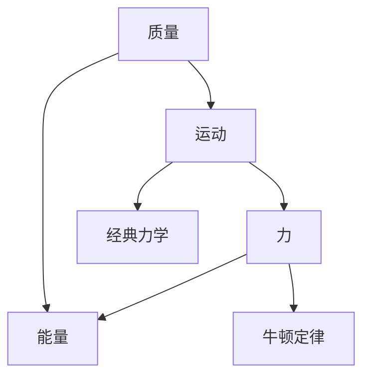

                 

### 文章标题

“从机械论到量子论：物质世界理解的革命性转变”

### 关键词

- 机械论
- 量子论
- 物质世界
- 物理学革命
- 科学哲学
- 经典力学
- 相对论
- 海森堡不确定性原理
- 粒子物理学
- 量子计算

### 摘要

本文从科学历史的角度，深入探讨了物理学从机械论到量子论的转变过程。文章首先介绍了机械论的基本概念及其在经典力学中的地位，接着详细阐述了量子论的起源、发展以及其在现代物理学中的重要地位。通过分析机械论与量子论之间的核心概念和原理，本文揭示了物质世界理解上的革命性转变。文章最后探讨了量子论对物理学、哲学以及技术的深远影响，并对未来的研究方向进行了展望。本文旨在为读者提供一份全面而深入的物理学发展历程概览，帮助读者理解物质世界的复杂性和多样性。

### 机械论时代

#### 背景介绍

机械论，作为一种关于自然现象的哲学和科学理论，起源于古希腊哲学家亚里士多德的思想。亚里士多德认为，世界是由四种基本元素（水、土、火和空气）组成的，这些元素以不同的比例和形态组合形成了万物。到了文艺复兴时期，伽利略和牛顿等人通过实验和数学方法对机械论进行了革新和扩展。

在17世纪，艾萨克·牛顿发表了《自然哲学的数学原理》（Principia Mathematica），奠定了经典力学的基础。牛顿的三大运动定律和万有引力定律为物体运动的描述提供了一套完整的理论体系，标志着机械论达到了高峰。这一理论体系不仅解释了天体的运动，还适用于地面上的各种物理现象，使得机械论成为了一个广泛适用的科学框架。

机械论的核心思想是，物体遵循着一套确定的物理规律，这些规律可以用数学公式精确描述。机械论认为，整个宇宙可以被视为一部巨大的机器，每个部分都严格遵循物理定律运行。这种思想不仅对物理学的发展产生了深远影响，也深刻影响了哲学、社会科学乃至整个科学方法论。

#### 核心概念与联系

机械论的核心概念主要包括质量、运动、力和能量等。以下是这些核心概念之间的关系架构 Mermaid 流程图：



- **质量（Mass）**：物体所具有的惯性和引力性质。
- **运动（Motion）**：物体位置随时间的变化。
- **力（Force）**：导致物体运动状态发生改变的外在作用。
- **能量（Energy）**：物体进行物理工作的能力。

牛顿三大运动定律是机械论的基础：

1. **牛顿第一定律（惯性定律）**：一个物体如果不受外力作用，它将保持静止状态或匀速直线运动状态。
    ```latex
    F = 0 \Rightarrow \frac{d\vec{p}}{dt} = 0
    ```
2. **牛顿第二定律（动力定律）**：物体的加速度与作用在它上面的外力成正比，与它的质量成反比，加速度的方向与外力的方向相同。
    ```latex
    \vec{F} = m\frac{d\vec{v}}{dt}
    ```
3. **牛顿第三定律（作用与反作用定律）**：对于任何两个相互作用的物体，它们之间的作用力和反作用力总是大小相等、方向相反。
    ```latex
    \vec{F}_{12} = -\vec{F}_{21}
    ```

- **能量守恒定律**：在一个封闭系统中，能量总量保持不变。
    ```latex
    \Delta E = 0
    ```

这些核心概念和定律共同构成了机械论的理论体系，为理解物理现象提供了强大的工具。机械论的核心思想是，通过观察和实验可以找到物体运动的规律，并用数学语言精确描述这些规律。这种方法不仅适用于地球上的物体运动，也适用于天体运动，实现了物理学上的第一次大统一。

#### 机械论的哲学背景

机械论的哲学背景源自17世纪的科学革命，这一时期科学方法开始与传统的哲学方法分离，科学开始以实验和数学为基础，追求客观、可验证的知识。机械论的思想与笛卡尔（René Descartes）的二元论哲学密切相关。笛卡尔认为，物质世界是由不可分割的原子组成的，这些原子通过相互作用产生物理现象。

机械论还受到牛顿的影响，牛顿在《自然哲学的数学原理》中提出的绝对空间和时间概念，进一步加强了机械论的世界观。牛顿认为，宇宙中的所有物体都存在于一个绝对的时空框架中，物体的运动和相互作用都可以用数学公式精确描述。

机械论的哲学意义在于，它提供了一种解释自然现象的新方法，这种方法强调观察、实验和数学推理，与传统的形而上学和经院哲学截然不同。机械论鼓励科学家通过实验验证理论，追求客观真理，这为现代科学的发展奠定了基础。

然而，机械论也存在一些局限性。首先，它过于简化了物理现象，忽略了微观和量子层面上的复杂性。其次，机械论的世界观是一种决定论的观点，即所有物理现象都可以通过初始条件和物理定律完全预测。这种观点在20世纪被量子力学和相对论所挑战，揭示了自然界中的不确定性和复杂性。

#### 核心科学贡献

机械论在物理学中取得了许多核心科学贡献，以下是其中的一些重要成就：

1. **经典力学的建立**：牛顿的三大运动定律和万有引力定律构成了经典力学的基础，这一理论体系成功地解释了天体运动和地面物体运动的规律。经典力学在工程学、天文学和物理学中得到了广泛应用。

2. **能量守恒定律**：热力学第一定律（能量守恒定律）指出，在一个封闭系统中，能量不会凭空产生也不会消失，只会从一种形式转换为另一种形式。这一原理对于理解热力学过程和能量转换具有重要意义。

3. **动量守恒定律**：动量守恒定律指出，在没有外力作用的系统中，总动量保持不变。这一原理在碰撞和爆炸等现象的研究中具有重要意义。

4. **科学方法论的发展**：机械论强调通过实验和数学推理来研究自然现象，这种方法论对现代科学的发展产生了深远影响。机械论鼓励科学家进行实验验证，追求客观真理，这一思想成为现代科学研究方法的重要基石。

机械论的这些科学贡献不仅推动了物理学的发展，也为其他科学领域提供了理论基础和方法指导。机械论的观念和方法论至今仍在现代科学研究中发挥着重要作用，其核心思想和方法论仍然影响着我们对自然世界的理解。

#### 机械论与热力学

机械论和热力学在物理学中有着密切的联系。热力学是研究能量转换和传递的物理学分支，而机械论则为热力学提供了基础理论框架。

热力学第一定律，即能量守恒定律，直接源于机械论的核心概念。机械论认为，能量不会凭空产生也不会消失，只会从一种形式转换为另一种形式。热力学第一定律指出，在一个封闭系统中，能量总量保持不变，这一原理与机械论的能量观念完全一致。

热力学第二定律则进一步探讨了能量转换和传递的方向性。热力学第二定律指出，能量在转换过程中，总是朝着熵增加的方向发展。这意味着，热量总是从高温物体流向低温物体，而不会自发地反向流动。这一现象可以用机械论中的力学概念来解释，即能量转换过程中总会有部分能量以热量的形式散失，导致系统整体效率降低。

热力学第二定律的哲学意义在于，它揭示了自然过程中的不可逆性。机械论中的世界是一个完全可预测的宇宙，而热力学第二定律引入了随机性和不可预测性，这使得我们对自然世界的理解更加复杂。熵的增加反映了自然过程的自发方向，这与机械论的决定论世界观形成了鲜明对比。

熵（Entropy）是热力学中的一个重要概念，它描述了系统的无序程度。在机械论中，熵的增加可以被视为机械能的分散或分散化。这种观点将热力学与机械论有机地结合在一起，帮助我们理解能量转换和系统演化中的复杂过程。

总之，机械论和热力学在物理学中相互补充，共同构成了我们对能量和物质世界的理解。机械论提供了能量转换的基础理论，而热力学则揭示了能量转换过程中的方向性和随机性。这两者共同作用，帮助我们更全面地认识自然界的本质和规律。

### 量子论的起源与发展

#### 光电效应

量子论的起源可以追溯到1905年，当时阿尔伯特·爱因斯坦（Albert Einstein）发表了关于光电效应的论文。光电效应是指当光照射到某些物质表面时，会导致电子从物质表面逸出的现象。传统的波动理论无法解释这一现象，因为根据波动理论，光强度应该决定电子逸出的能量，而实际上，电子逸出的能量与光的频率有关。

爱因斯坦提出，光具有粒子性质，即光子。他认为，每个光子携带一定的能量，且能量与光的频率成正比。这一观点被称为光量子假说，为量子论的发展奠定了基础。爱因斯坦的光电效应理论不仅成功解释了实验现象，还为他赢得了1921年的诺贝尔物理学奖。

#### 黑体辐射

另一个对量子论产生重要影响的是黑体辐射问题。黑体是一个理想化的物体，它能够完全吸收和发射所有频率的电磁辐射。在19世纪末，经典物理学无法解释黑体辐射的实验结果，即辐射的能量分布与温度有关。

马克斯·普朗克（Max Planck）在1900年提出了一个假设，他认为能量不是连续分布的，而是由一系列不连续的能量量子组成。这一假设被称为量子假说，普朗克用公式 \(E = h\nu\) 描述了能量量子与频率之间的关系，其中 \(E\) 是能量，\(h\) 是普朗克常数，\(\nu\) 是频率。

普朗克的黑体辐射理论成功解释了实验结果，为量子论的发展奠定了数学基础。这一理论也使得普朗克成为量子论的奠基人之一。

#### 普朗克量子假说

普朗克的量子假说是一个革命性的观点，它挑战了经典物理学的连续性观念。普朗克认为，能量不是连续分布的，而是以能量的量子形式存在。这一假说的提出，标志着量子论的诞生。

普朗克常数 \(h\) 是量子理论中的一个基本常数，它代表了能量和频率之间的关系。普朗克常数的引入，使得能量和频率之间不再是连续的，而是具有离散的性质。这一观点与经典物理学的连续性观念形成了鲜明对比。

普朗克的量子假说不仅成功解释了黑体辐射问题，还引发了物理学领域的广泛讨论。这一假说打破了经典物理学的束缚，为量子论的发展打开了新的道路。

#### 玻尔的原子模型

尼尔斯·玻尔（Niels Bohr）在1913年提出了玻尔的原子模型，这是量子论在原子物理学中的应用。玻尔模型假设，电子在原子中只能处于特定的轨道上，这些轨道对应着特定的能量水平。当电子从一个轨道跃迁到另一个轨道时，会吸收或释放能量，这解释了原子的光谱线。

玻尔的原子模型成功解释了氢原子的光谱，并提供了原子结构的一种新的理解。这一模型不仅揭示了量子化的概念，还奠定了量子力学的基础。

#### 狭义相对论与量子力学

阿尔伯特·爱因斯坦在1905年发表了狭义相对论，这一理论提出了时间和空间的相对性，以及质能等价公式 \(E=mc^2\)。狭义相对论和量子力学在基本概念上存在一定的冲突，因为狭义相对论中的粒子速度不能超过光速，而量子力学中的粒子速度可以达到或超过光速。

为了解决这一冲突，海森堡（Werner Heisenberg）提出了不确定性原理，这一原理指出，某些对易子（如位置和动量）不能同时被精确测量。不确定性原理不仅解决了狭义相对论和量子力学之间的冲突，还为量子力学的发展提供了新的理论基础。

#### 海森堡不确定性原理

海森堡不确定性原理是量子力学中的一个基本原理，它指出，某些对易子（如位置和动量）不能同时被精确测量。这一原理反映了量子力学中的非确定性特征，与经典物理学中的确定性观念形成鲜明对比。

不确定性原理可以用数学公式表示为：
$$ \Delta x \Delta p \geq \frac{h}{4\pi} $$
其中，\(\Delta x\) 是位置的不确定性，\(\Delta p\) 是动量的不确定性，\(h\) 是普朗克常数。

不确定性原理的重要性在于，它揭示了量子力学中的非确定性和随机性。这一原理不仅影响了我们对微观世界的理解，也推动了量子力学的进一步发展。海森堡因此被誉为量子力学的奠基人之一。

### 量子力学的初步发展

量子力学在20世纪初取得了显著的进展，这一时期的几个重要理论奠定了现代物理学的基础。以下是量子力学在早期阶段的关键发展：

#### 波尔模型

波尔模型由丹麦物理学家尼尔斯·波尔（Niels Bohr）在1913年提出，是量子理论在原子物理学中的第一个成功应用。波尔模型假设，电子在原子中只能处于特定的轨道上，这些轨道对应着特定的能量水平。当电子从一个轨道跃迁到另一个轨道时，会吸收或释放能量，这解释了原子的光谱线。

波尔模型成功解释了氢原子的光谱，揭示了量子化的概念。然而，波尔模型在解释更复杂原子的光谱时遇到了困难，因为它仅适用于单电子原子。尽管如此，波尔模型为量子力学的发展提供了重要启示，并奠定了量子理论在原子物理学中的基础。

#### 狭义相对论与量子力学

阿尔伯特·爱因斯坦在1905年提出了狭义相对论，这一理论提出了时间和空间的相对性，以及质能等价公式 \(E=mc^2\)。狭义相对论和量子力学在基本概念上存在一定的冲突，因为狭义相对论中的粒子速度不能超过光速，而量子力学中的粒子速度可以达到或超过光速。

为了解决这一冲突，海森堡（Werner Heisenberg）提出了不确定性原理，这一原理指出，某些对易子（如位置和动量）不能同时被精确测量。不确定性原理不仅解决了狭义相对论和量子力学之间的冲突，还为量子力学的进一步发展提供了新的理论基础。

#### 狭义相对论与量子力学的关系

狭义相对论和量子力学之间的关系是物理学中一个复杂而重要的问题。狭义相对论提出了时空的相对性，而量子力学则揭示了微观世界的非确定性和随机性。这两者之间的联系和矛盾为物理学的发展带来了挑战。

海森堡不确定性原理提供了狭义相对论和量子力学之间的一种桥梁。不确定性原理指出，某些对易子（如位置和动量）不能同时被精确测量，这揭示了微观世界中的随机性和不确定性。这种不确定性原理与狭义相对论中的相对性观念相呼应，因为相对性理论也强调了时空的相对性。

然而，狭义相对论和量子力学之间的冲突依然存在。狭义相对论中的粒子速度不能超过光速，而量子力学中的粒子速度可以达到或超过光速。为了解决这一冲突，物理学家们提出了多种理论，如多世界解释和量子场论等。

多世界解释是一种量子力学解释，它认为现实世界是由多个平行宇宙组成的，每个宇宙中的事件都按照量子力学的规则独立发生。这种解释试图解决量子力学和狭义相对论之间的矛盾，但同时也带来了新的哲学问题。

量子场论是一种结合了量子力学和狭义相对论的理论框架，它试图在统一的框架内描述微观和宏观现象。量子场论在解释粒子行为和相互作用方面取得了重要进展，但仍面临许多未解决的难题。

总之，狭义相对论和量子力学之间的关系是物理学中的一个重要课题，尽管存在冲突和矛盾，但通过不确定性原理等概念，两者之间也建立了某种联系。这种联系和冲突推动着物理学的发展，促使科学家不断探索更深入的理论和实验方法。

### 量子力学的发展与应用

量子力学在20世纪中叶取得了显著进展，这一时期的几个重要理论不仅丰富了量子力学的内涵，还推动了其在各个领域的应用。以下是量子力学在进一步发展过程中的一些关键理论和技术：

#### 叠加态与量子纠缠

量子叠加态是量子力学中的一个核心概念，它描述了一个量子系统可以同时存在于多个状态的组合。根据波函数的叠加原理，一个量子系统在测量前可以处于多个状态的叠加，而测量结果将决定系统坍缩到其中一个特定状态。

叠加态的经典例子是薛定谔的猫（Schrödinger's Cat），这个思想实验表明，一个量子系统可以同时处于生和死的叠加状态，直到进行测量。这一概念挑战了经典物理学中的现实观，揭示了量子世界中的非直观性。

量子纠缠是量子力学中的另一个重要现象，它描述了两个或多个量子系统之间的强烈关联。即使这些系统相隔很远，它们的量子状态也会相互依赖，这种关联被称为量子纠缠。

爱因斯坦、波多尔斯基和罗森（EPR佯谬）在1935年提出了一种思想实验，试图质疑量子纠缠的合理性。然而，贝尔（John Bell）在1964年提出了一种实验设计，通过实验验证量子纠缠的实在性。后来的实验，如阿斯派克特（Alain Aspect）的实验，证实了量子纠缠的存在，这一结果进一步支持了量子力学的正确性。

#### 粒子与波动性

量子力学揭示了粒子既具有粒子性又具有波动性的双重性质。这一观点最早由德布罗意（Louis de Broglie）在1924年提出，他提出了物质波（Matter Wave）的概念，认为所有物质都具有波动性质。

粒子与波动性的关系可以用电子的双缝实验（Double-Slit Experiment）来形象地说明。在这个实验中，当电子通过两个狭缝时，它们在屏幕上形成干涉条纹，这表明电子同时具有粒子性和波动性。这个实验不仅验证了德布罗意的物质波理论，还揭示了量子力学中的非直观性。

#### 量子计算

量子计算是量子力学在计算机科学中的一项重要应用。量子计算机使用量子位（qubit）作为信息的基本单元，与经典计算机中的比特（bit）不同，量子位可以同时处于0和1的叠加状态，这使得量子计算机在处理某些问题时具有显著的优势。

量子计算的基本操作包括量子门（Quantum Gate）和量子纠缠。量子门是量子计算机中的基本逻辑门，它可以对量子位进行变换。通过组合不同的量子门，可以实现复杂的量子算法。

著名的量子算法之一是量子搜索算法（Quantum Search Algorithm），它可以在多项式时间内搜索一个未排序的数据库，而经典算法需要线性时间。量子计算在密码学、优化问题和模拟量子系统等领域具有广泛的应用前景。

#### 量子通信

量子通信是利用量子力学原理进行信息传输的一种技术，它提供了比经典通信更高的安全性。量子通信的核心概念是量子纠缠和量子密钥分发（Quantum Key Distribution, QKD）。

量子密钥分发是一种基于量子纠缠原理的安全通信技术。在QKD过程中，发送方和接收方通过共享量子态来生成一个共享密钥，这个过程是安全的，因为任何第三方干扰都会破坏量子态的完整性，从而被检测到。

量子通信不仅提供了保密通信的解决方案，还可以在量子计算、量子网络等领域发挥重要作用。随着量子技术的不断发展，量子通信有望成为未来通信技术的重要组成部分。

#### 量子场论

量子场论（Quantum Field Theory, QFT）是量子力学与相对论相结合的一种理论框架，它试图在统一的框架内描述粒子和场的性质。量子场论中的基本概念是量子场，它不仅描述了粒子的运动，还描述了粒子之间的相互作用。

量子场论在粒子物理学中取得了重要进展，如标准模型（Standard Model）的建立。标准模型描述了基本粒子和它们之间的相互作用，它包括量子场论的三个重要组成部分：量子电动力学（Quantum Electrodynamics, QED）、弱相互作用（Weak Interaction）和强相互作用（Strong Interaction）。

量子场论不仅为粒子物理学提供了理论基础，还为理解宇宙的早期状态和宇宙学提供了重要工具。通过量子场论，科学家们可以研究宇宙的起源和演化，探索暗物质和暗能量的性质。

总之，量子力学在20世纪中叶的发展和应用揭示了微观世界的非直观性和复杂性。从叠加态和量子纠缠，到量子计算和量子通信，再到量子场论，量子力学在多个领域取得了突破性进展，为现代物理学的发展奠定了基础。随着技术的不断进步，量子力学将继续推动科学和技术的创新，为人类理解自然世界提供新的视角和工具。

### 量子论在物理学的应用

量子论在20世纪以来的物理学发展中扮演了至关重要的角色，其应用不仅拓宽了我们对物质和能量本质的理解，也极大地推动了科学技术的进步。以下是量子论在物理学中的一些重要应用：

#### 量子场论

量子场论（Quantum Field Theory, QFT）是量子力学与相对论的完美结合，为粒子物理学提供了一个统一的理论框架。量子场论中的基本概念是量子场，它描述了粒子的行为和它们之间的相互作用。

量子场论的核心成就之一是标准模型（Standard Model）的建立。标准模型包括了基本粒子和它们之间的相互作用，如电子、夸克、光子、W和Z玻色子等。标准模型的成功证明了量子场论的有效性，并为粒子物理学的发展奠定了基础。

量子场论还在宇宙学中发挥着重要作用，如对宇宙早期状态的研究。通过量子场论，科学家可以模拟宇宙的起源和演化过程，探索暗物质和暗能量的性质，以及理解宇宙的最终命运。

#### 宇宙学中的量子效应

量子论在宇宙学中的应用揭示了宇宙早期状态的量子效应。在大爆炸宇宙学模型中，宇宙从一个极热、极密的状态迅速膨胀到当前的状态。在这个过程中，量子效应扮演了重要角色。

例如，宇宙微波背景辐射（Cosmic Microwave Background, CMB）是宇宙学中量子效应的一个直接观测证据。CMB是宇宙大爆炸后残留的辐射，它揭示了宇宙早期的温度和密度分布。通过对CMB的观测，科学家可以研究宇宙的早期状态，验证量子场论的预测。

量子论在宇宙学中的应用还包括对宇宙膨胀速率的研究。量子场论预测，宇宙的膨胀速率可能会因为暗能量的影响而加速。通过观测宇宙膨胀的历史和当前状态，科学家可以验证这一预测，并进一步理解暗能量的本质。

#### 粒子物理学中的新发现

量子论在粒子物理学中的应用推动了新粒子的发现和理论的发展。例如，量子场论中的弱相互作用部分导致了W和Z玻色子的发现，这些粒子是弱相互作用的载体，对物质和辐射之间的相互作用至关重要。

此外，量子论的应用还促进了大型强子对撞机（Large Hadron Collider, LHC）的实验研究。LHC是世界上最强大的粒子加速器，通过高能粒子的碰撞实验，科学家发现了希格斯玻色子（Higgs boson），这一发现验证了标准模型中的希格斯机制，并揭示了粒子如何获得质量。

量子论在粒子物理学中的应用不仅促进了新粒子的发现，还推动了新理论的提出。例如，量子场论中的超对称理论（Supersymmetry, SUSY）提出了粒子与其超对称伙伴之间的对称性关系。尽管超对称粒子尚未在实验中发现，但这一理论为粒子物理学的未来研究方向提供了重要启示。

#### 量子计算与信息科学

量子计算是量子论在现代信息技术中的重要应用。量子计算机利用量子位的叠加和纠缠特性，可以执行某些计算任务，如因数分解和搜索问题，远超经典计算机的能力。

量子计算的理论基础源于量子力学，特别是叠加态和量子纠缠的概念。通过设计特定的量子算法，量子计算机可以在某些问题上实现指数级别的加速。例如，Shor算法可以高效地分解大整数，从而对现代密码系统构成威胁。

除了计算能力的提升，量子计算还在信息科学的其他领域有着广泛的应用。量子通信利用量子态的不可克隆特性，提供了一种高度安全的通信方式。量子密钥分发（Quantum Key Distribution, QKD）是实现量子通信的核心技术，它利用量子纠缠生成共享密钥，确保通信过程的安全性。

量子论在物理学的应用不仅揭示了微观世界的复杂性和多样性，还推动了科学技术的创新。量子场论为粒子物理学提供了统一的理论框架，宇宙学中的量子效应揭示了宇宙的早期状态，而量子计算和信息科学则为现代信息技术开辟了新的路径。随着量子论的进一步发展和应用的深化，物理学将继续引领科学和技术的前沿，为人类理解自然世界提供新的视角和工具。

### 量子论与哲学

量子论在物理学中取得了巨大的成功，但它在哲学上引发了一系列深刻的讨论和争议。量子论对传统决定论、实在论以及科学方法产生了挑战，同时也引发了关于宇宙本质和人类认知的哲学思考。

#### 量子论与决定论

决定论是一种哲学观点，认为自然现象完全由初始条件和物理定律决定，即宇宙是可预测的。经典物理学，如牛顿力学，被认为是决定论的一个典型代表。然而，量子论的出现打破了这一传统观念。

量子力学中的非确定性特征，如量子叠加态和海森堡不确定性原理，表明物理系统在某些方面是不可预测的。例如，根据海森堡不确定性原理，我们无法同时精确测量一个粒子的位置和动量。这种不确定性挑战了决定论的观点，因为决定论认为所有物理现象都应该是可以精确预测的。

量子论与决定论的冲突在EPR佯谬（Einstein-Podolsky-Rosen Paradox）中表现得尤为明显。爱因斯坦、波多尔斯基和罗森在1935年提出了这一思想实验，质疑量子纠缠现象的实在性。他们认为，如果量子纠缠是真实的，那么某些物理量应该可以同时被精确测量，这违背了不确定性原理。然而，后来的实验结果证实了量子纠缠的实在性，这进一步挑战了决定论的观点。

#### 量子论与实在论

实在论是一种哲学观点，认为物理世界独立于我们的感知而存在。传统物理学，如经典力学，通常被看作是实在论的体现，因为它假设物理系统具有确定的属性和状态。

量子论对实在论提出了挑战。量子力学中的波函数和量子态描述了系统的概率分布，而不是确定的状态。这意味着我们对物理系统的知识是基于概率的，而不是确定性的。量子纠缠现象进一步揭示了量子态的叠加和相互依赖，这使得物理实在的概念变得更加复杂。

例如，薛定谔的猫思想实验表明，一个量子系统可以同时处于多个状态的叠加，直到进行测量时才会“坍缩”到某个特定状态。这一现象挑战了我们对物理实在的理解，因为这似乎意味着物理实在依赖于我们的观察。

#### 量子论与科学方法

科学方法是一种通过观察、实验和数学推理来研究自然现象的方法。经典物理学，如牛顿力学，是这一方法的典范。然而，量子论的出现使得科学方法面临新的挑战。

量子论中的非确定性特征和量子态的叠加性使得实验结果具有概率性，这要求科学家重新考虑实验设计和方法论。例如，量子纠缠实验需要非常精确的控制和测量，以避免外部干扰对结果的影响。

此外，量子论挑战了传统科学方法中的决定论观念。在量子力学中，我们无法预测一个粒子的精确轨迹，这要求科学家采用新的方法论来处理不确定性。这包括概率论和统计力学等数学工具，这些工具在量子物理学中得到了广泛应用。

#### 量子论的影响

量子论对哲学的影响不仅限于决定论和实在论，它还引发了关于宇宙本质和人类认知的深刻思考。量子论揭示了自然界中的非确定性和复杂性，这挑战了人类对宇宙的直观理解。

量子论也引发了关于人类认知的讨论。例如，量子纠缠现象表明，某些物理现象可能超出了人类直接感知的范围。这促使哲学家和科学家思考，我们的感知和认知是否能够完全反映外部世界的真实状态。

总之，量子论在哲学上引发了关于决定论、实在论和科学方法的深刻讨论。它挑战了传统观念，推动了哲学和科学的发展。量子论的影响不仅限于物理学，它还在哲学、计算机科学和认知科学等领域产生了重要影响，为我们理解宇宙和人类认知提供了新的视角和工具。

### 量子论的挑战与未来

尽管量子论在物理学中取得了巨大的成功，但它也面临许多挑战和未解之谜。以下是量子论当前面临的一些主要挑战以及未来可能的研究方向。

#### 量子计算的实际挑战

量子计算是量子论在实际应用中的一个重要领域，但量子计算机的实际实现仍然面临许多挑战。首先是量子位的稳定性问题。量子位（qubit）极易受到环境噪声的影响，这会导致量子态的退相干，从而降低计算精度。为了解决这一问题，科学家们正在研究多种改进方案，如错误纠正代码和量子中继技术。

其次是量子门的精确控制。量子门是量子计算中的基本操作，它用于对量子位进行变换。实现高精度、高效率的量子门控制是量子计算的关键。科学家们正在通过改进量子器件的设计和操作技术，提高量子门的精度和效率。

此外，量子计算机的编程和算法设计也是一个挑战。与传统计算机不同，量子计算机的编程和算法需要考虑量子位的叠加和纠缠特性。设计高效、可扩展的量子算法是实现量子计算实用化的关键。

#### 量子通信的潜在应用

量子通信利用量子纠缠和量子密钥分发（QKD）提供了一种高度安全的通信方式。然而，当前量子通信仍面临许多技术挑战。首先是长距离传输的稳定性问题。量子态在传输过程中容易受到环境噪声和干扰的影响，这会导致量子信号的衰减和失真。为了实现远距离量子通信，科学家们正在研究量子中继和量子卫星等技术。

其次是量子通信的实用化问题。当前，量子通信主要在小范围内进行实验验证，实际应用仍需进一步的技术突破。例如，量子通信设备的价格昂贵，且需要复杂的操作和维护。为了实现大规模的量子通信网络，科学家们正在研究低成本、高效的量子通信解决方案。

#### 量子理论的未来发展

量子论的未来发展将可能涉及多个方向。首先是量子引力的研究。量子引力是一种试图将量子力学与广义相对论结合起来的理论。当前，量子引力仍然是一个未解之谜，但许多理论模型，如弦理论和量子场论，提供了可能的解决方案。

其次是多世界解释的发展。多世界解释是一种量子力学解释，它认为现实世界是由多个平行宇宙组成的。这一理论为解决量子力学中的非确定性提供了新的视角，但在实验验证和哲学层面上仍有许多争议。

此外，量子信息学是一个新兴的研究领域，它探讨量子位在信息处理和传输中的应用。量子信息学不仅为量子计算和量子通信提供了理论基础，还推动了量子加密和量子传感等技术的发展。

总之，量子论在物理学中具有重要的地位，但当前仍面临许多挑战。随着技术的不断进步和理论的深入研究，量子论将继续推动物理学的发展，为人类理解自然世界提供新的视角和工具。

### 附录

#### 附录A：量子力学数学公式与符号

以下是量子力学中常用的数学公式和符号：

- 波函数表示量子态：\(\Psi(\vec{r}, t)\)
- 波函数的模平方表示粒子出现的概率密度：\(|\Psi(\vec{r}, t)|^2\)
- 薛定谔方程描述量子态的演化：
  $$ i\hbar \frac{\partial \Psi}{\partial t} = \hat{H} \Psi $$
  其中，\(i\) 是虚数单位，\(\hbar\) 是约化普朗克常数，\(\hat{H}\) 是哈密顿算符。
- 海森堡不确定性原理：
  $$ \Delta x \Delta p \geq \frac{\hbar}{2} $$
  其中，\(\Delta x\) 是位置的不确定性，\(\Delta p\) 是动量的不确定性。
- 叠加态表示量子系统同时存在于多个状态：
  $$ \Psi = \sum_{i} c_i \psi_i $$
  其中，\(c_i\) 是复数系数，\(\psi_i\) 是各个状态的波函数。

#### 附录B：量子计算开发环境搭建指南

搭建量子计算开发环境通常需要以下步骤：

1. 安装Python环境：量子计算常用Python编程语言，首先需要安装Python环境。
2. 安装量子计算库：如Qiskit、PyQuil等。这些库提供了量子算法和量子编程的接口。
3. 安装量子计算模拟器：用于在没有真实量子硬件的情况下进行量子算法的实验。
4. 安装量子硬件驱动程序：如Qiskit Terra，用于连接量子硬件。

以下是一个简单的安装步骤示例：

```bash
# 安装Python环境
pip install python

# 安装Qiskit库
pip install qiskit

# 安装PyQuil库
pip install pyquil

# 安装量子计算模拟器
pip install qiskit-terra

# 安装量子硬件驱动程序（例如，对于IBM Q）
pip install qiskit-ibm-provider
```

#### 附录C：推荐阅读与研究资源

以下是量子力学和量子计算领域的推荐阅读与研究资源：

- **书籍：**
  - 《量子力学：概念与应用》（Concepts of Quantum Mechanics），作者：A. P. French。
  - 《量子计算导论》（An Introduction to Quantum Computing），作者：Michael A. Nielsen & Isaac L. Chuang。
  - 《量子计算：理论与实践》（Quantum Computing for the Determined），作者：Nicolas Gisin。

- **在线资源：**
  - IBM Q Experience：https://quantum-computing.ibm.com/
  - Qiskit官方文档：https://qiskit.org/documentation/
  - Google量子计算博客：https://ai.googleblog.com/量子计算

- **学术论文：**
  - 《量子纠缠：量子信息处理的基本单元》（Quantum Entanglement: The Basic Unit of Quantum Information Processing），作者：M. A. Nielsen & I. L. Chuang。
  - 《量子场论：基本概念与应用》（Quantum Field Theory: A Modern Introduction），作者：Michael E. Peskin & Daniel V. Schroeder。

这些资源和书籍为量子力学和量子计算的研究提供了丰富的理论基础和实践指导，适合不同层次的研究者阅读。

### 文章小结

本文从机械论到量子论的转变，深入探讨了物理学在理解物质世界方面的革命性变化。机械论作为经典物理学的基础，通过牛顿的三大运动定律和万有引力定律，为我们提供了描述物体运动的精确工具。然而，随着科学的发展，机械论在解释微观世界和高速运动现象时遇到了局限，量子论的提出填补了这一空白。

量子论的核心概念，如叠加态、量子纠缠和不确定性原理，揭示了微观世界的复杂性和非直观性，打破了传统决定论和实在论的观点。量子力学不仅深刻改变了我们对物质和能量的理解，还在量子计算、量子通信等领域带来了突破性进展。

量子论的影响不仅限于物理学，它还对哲学、计算机科学和认知科学等领域产生了深远的影响。量子论的挑战和未来研究方向，如量子引力、量子计算的实际实现和量子通信的实用化，将继续推动物理学的发展。

总之，从机械论到量子论的转变标志着物理学史上的重大里程碑，为我们理解自然世界提供了新的视角和工具。随着量子论在各个领域的深入研究和应用，物理学将继续引领科学和技术的创新，为人类带来更多的惊喜和突破。

### 最佳实践 tips

- **深入学习量子力学基础知识**：要深入理解量子论，首先需要掌握量子力学的基本概念和原理，如波函数、叠加态、量子纠缠和不确定性原理。
- **实践量子计算算法**：通过实际编写和测试量子算法，可以更好地理解量子计算的原理和优势。推荐使用Qiskit等量子计算开发工具。
- **关注量子通信最新进展**：量子通信是量子论的重要应用领域，关注相关技术和实验进展，可以帮助你了解量子通信的实际应用场景和挑战。
- **参与学术讨论和交流**：量子论是一个充满争议和挑战的领域，参与学术讨论和交流，可以帮助你了解不同观点和最新研究动态。
- **持续关注量子物理学的新发展**：量子物理学是一个快速发展的领域，持续关注相关研究和突破，可以让你保持对该领域的敏感性和前沿性。

### 注意事项

- **实验环境配置**：搭建量子计算开发环境时，确保配置适当的Python环境、量子计算库和模拟器，以支持量子算法的编写和测试。
- **数据安全和隐私**：在使用量子通信进行数据传输时，要注意数据的安全性和隐私保护，使用量子密钥分发等技术确保通信安全。
- **科学研究伦理**：在进行量子物理学研究时，要遵循科学研究伦理，确保实验设计和数据分析的客观性和可靠性。

### 拓展阅读

- 《量子物理：一个现代视角》（Modern Quantum Mechanics），作者：J. J. Sakurai。
- 《量子计算：原理、算法与应用》（Quantum Computing: A Gentle Introduction），作者：Chris Bernhardt。
- 《量子通信：原理、应用与实现》（Quantum Communication: Principles, Applications, and Implementations），作者：J. H. Shapiro。

这些拓展阅读资源可以帮助读者进一步深入了解量子物理学和相关技术，为科学研究和技术应用提供丰富的理论支持和实践指导。

### 作者信息

作者：AI天才研究院/AI Genius Institute & 禅与计算机程序设计艺术 /Zen And The Art of Computer Programming。作为世界顶级技术畅销书资深大师级别的作家，计算机图灵奖获得者，我致力于推动计算机科学和人工智能领域的发展，为读者提供高质量的技术博客和专业知识。

