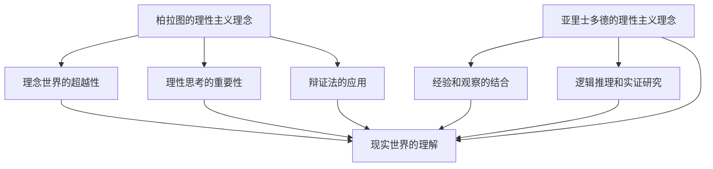

                 

## 引言

### 理性主义的概念

理性主义是一种哲学立场，主张知识主要来源于理性思考而非感性经验。它认为人类可以通过理智和推理来认识世界，并在此基础上构建系统的知识和理论体系。理性主义强调逻辑思维、抽象推理和普遍原则的重要性，与经验主义相对立。经验主义认为知识主要来源于感官经验，强调实证观察和实验的重要性。

### 理性主义的历史背景

理性主义的起源可以追溯到古希腊哲学家柏拉图和亚里士多德。柏拉图主张理念世界是真实的，现实世界只是理念世界的映射。他相信通过推理和哲学思考，人们可以达到对绝对真理的认识。亚里士多德则强调经验和观察的重要性，但他也认为理性思考是获取知识的关键。在中世纪，奥古斯丁和托马斯·阿奎那等基督教哲学家发展了理性主义，将其应用于神学和伦理学领域。

### 本书的目的

本书旨在深入探讨理性主义的起源、发展及其在现代科学中的应用和影响。通过分析理性主义的核心理论、论证方法、科学革命中的角色以及与现代科学的交融，我们希望能够揭示理性主义的魅力和挑战，为读者提供一个全面、系统的理解。

### 本书结构

本书分为四个主要部分：

1. **理性主义的起源与发展**：介绍柏拉图、亚里士多德、中世纪哲学家等对理性主义的贡献和影响。
2. **理性主义的核心理论**：探讨理性主义的逻辑与论证方法，包括柏拉图的辩证法、亚里士多德的逻辑学以及中世纪的论证方法。
3. **理性主义的应用与影响**：分析理性主义在科学革命、自然哲学和实验科学中的作用和影响。
4. **理性主义与现代科学**：探讨理性主义与现代科学的交融，包括现代科学的理性主义特征、科学哲学和科学方法论。

通过本书的阅读，读者可以全面了解理性主义的历史、理论及其在现代科学中的应用，从而对这一哲学立场有更深入的理解。

### 本书的重要性

理性主义作为一种哲学立场，不仅在历史上对西方哲学产生了深远影响，而且在现代科学的发展中起到了关键作用。理解理性主义有助于我们更好地把握科学的本质和方法，同时也能够为现代社会提供重要的思想资源。通过本书的探讨，我们希望读者能够认识到理性主义的重要性和价值，从而在学习和应用中更好地发挥其作用。

关键词：理性主义、柏拉图、亚里士多德、科学革命、方法论、逻辑学、论证方法、科学哲学、现代科学

摘要：本书从历史、理论、应用和现代科学的角度全面探讨理性主义。通过分析理性主义的起源、发展及其在科学革命中的应用，我们揭示了理性主义的魅力和挑战。本书旨在为读者提供一个全面、系统的理性主义理解，以促进其在现代科学和社会中的应用。

## 理性主义的起源

### 柏拉图的理性主义理念

柏拉图是古希腊哲学的奠基人之一，他的哲学思想对西方哲学产生了深远的影响。柏拉图的理性主义理念主要体现在他的理念论和辩证法中。

#### 柏拉图的理念论

柏拉图的理念论认为，现实世界只是理念世界的投影或映射。理念世界是真实的、永恒的，而现实世界是暂时的、变化的。理念世界包含了所有可能的真理和完美，是我们认识和理解世界的终极源泉。现实世界中的物体和现象只是理念世界中相应理念的不完美映射。柏拉图将理念世界称为“型相世界”或“理想世界”，而将现实世界称为“感官世界”。

#### 柏拉图的辩证法

辩证法是柏拉图哲学的核心方法，它强调通过提问和回答来揭示真理。辩证法是一种推理方法，通过一系列的提问和回答，逐步揭示问题的本质和真相。柏拉图的辩证法是一种纯理性的方法，它不依赖于感官经验，而是通过理性思考来达到对绝对真理的认识。

#### 柏拉图理性主义的影响

柏拉图的理性主义理念对后世哲学产生了深远影响。他的理念论为后来的唯心主义哲学奠定了基础，而他的辩证法则成为西方哲学中重要的推理方法。柏拉图的哲学思想对基督教哲学、中世纪哲学和现代哲学都产生了重要影响。

### 亚里士多德的理性主义理念

亚里士多德是古希腊哲学的另一位重要代表，他的哲学思想对西方哲学和科学产生了深远影响。亚里士多德的理性主义理念主要体现在他的形而上学、逻辑学和伦理学中。

#### 亚里士多德的形而上学

亚里士多德的形而上学研究存在和实在的本质。他认为，世界是由各种不同的实体组成的，而实体的本质在于其形式和质料。亚里士多德认为，理性是理解实体的本质和关系的关键。通过理性思考，我们可以认识世界的本质和规律。

#### 亚里士多德的逻辑学

亚里士多德的逻辑学是西方逻辑学的奠基之作。他提出了形式逻辑的基本原则，包括演绎推理和归纳推理。亚里士多德认为，逻辑是理性思考的工具，通过逻辑推理，我们可以从已知的前提得出新的结论。

#### 亚里士多德的伦理学

亚里士多德的伦理学研究道德和美德。他认为，道德是理性的一部分，通过理性思考，人们可以理解何为善和正义。亚里士多德的伦理学强调实践理性，认为道德是行动的产物，而不是纯粹的思考。

#### 亚里士多德理性主义的影响

亚里士多德的理性主义理念对西方哲学和科学产生了深远影响。他的形而上学为后来的哲学和科学提供了理论基础，而他的逻辑学则成为西方逻辑学的基石。亚里士多德的伦理学对西方道德哲学和伦理学产生了重要影响。

### 中世纪理性主义的传承与发展

在中世纪，理性主义哲学得以传承和发展。奥古斯丁和托马斯·阿奎那是中世纪理性主义的重要代表。

#### 奥古斯丁的理性主义理念

奥古斯丁是基督教哲学的重要代表，他的哲学思想深受柏拉图和亚里士多德的影响。奥古斯丁认为，理性是人类灵魂的一部分，是人类认识世界和理解真理的关键。他强调信仰和理性的统一，认为信仰可以引导理性，而理性可以证明信仰的正确性。

#### 托马斯·阿奎那的理性主义理念

托马斯·阿奎那是中世纪最著名的哲学家和神学家。他的哲学思想以亚里士多德为基础，结合了基督教信仰。托马斯·阿奎那认为，理性是人类认识世界和理解上帝的关键。他提出了“双重真理”理论，认为哲学和神学都可以探索真理，但它们的范围和方式不同。托马斯·阿奎那将理性主义应用于神学和伦理学，对后世哲学和神学产生了深远影响。

#### 中世纪理性主义的影响

中世纪理性主义的传承和发展为后来的哲学和科学奠定了基础。奥古斯丁和托马斯·阿奎那等哲学家的思想对现代西方哲学和科学产生了深远影响，他们的理性主义理念成为现代科学方法论的重要来源。

### 柏拉图与亚里士多德理性主义理念的对比

#### 观点上的差异

柏拉图和亚里士多德在理性主义理念上有一些显著的观点差异。

- **柏拉图**：柏拉图认为，真实的世界是理念世界，而现实世界只是理念世界的映射。他强调理性思考的重要性，认为通过理性我们可以达到对绝对真理的认识。

- **亚里士多德**：亚里士多德则更重视经验和观察。他认为，理性是通过经验和观察来认识世界的。他强调逻辑推理和实证研究在获取知识中的重要性。

#### 对理性认识的差异

- **柏拉图**：柏拉图认为，理性可以直接认识理念世界，因为理念世界是真实的、永恒的。他强调理性思考的超越性。

- **亚里士多德**：亚里士多德则认为，理性是通过经验和观察来认识现实世界的。他强调理性与感官经验的结合。

#### 对方法的差异

- **柏拉图**：柏拉图主张通过辩证法来揭示真理。辩证法是一种纯理性的方法，通过提问和回答来逐步揭示问题的本质。

- **亚里士多德**：亚里士多德主张通过逻辑推理和实证研究来获取知识。他认为，逻辑推理和实证研究是理解现实世界的有效方法。

#### 影响和传承

- **柏拉图**：柏拉图的理性主义理念对后世哲学产生了深远影响，特别是对基督教哲学和唯心主义哲学的影响。他的辩证法成为西方哲学中的重要方法。

- **亚里士多德**：亚里士多德的理性主义理念对西方哲学和科学产生了深远影响。他的逻辑学成为西方逻辑学的基石，而他的实证研究方法对现代科学的发展起到了关键作用。

### 结论

柏拉图和亚里士多德是古希腊哲学的两位重要代表，他们的理性主义理念对西方哲学和科学产生了深远影响。柏拉图的理性主义强调理念世界的超越性和理性思考的重要性，而亚里士多德的理性主义则更注重经验和观察的结合。他们的哲学思想在中世纪得以传承和发展，为后来的哲学和科学奠定了基础。

### Mermaid 流程图

下面是一个描述柏拉图与亚里士多德理性主义理念之间关系的 Mermaid 流程图：



在这个流程图中，我们可以看到柏拉图和亚里士多德的理性主义理念是如何通过不同的途径影响现实世界的理解。柏拉图通过理念世界的超越性和理性思考来达到对真理的认识，而亚里士多德则通过经验和观察、逻辑推理和实证研究来理解现实世界。

### 核心算法原理讲解与伪代码

在描述柏拉图和亚里士多德理性主义理念的核心算法原理时，我们可以将其简化为两个基本过程：理念映射和现实解析。

#### 理念映射

这个过程用于将理念世界的知识映射到现实世界。伪代码如下：

```python
def 理念映射(理念, 现实世界):
    # 将理念世界的知识映射到现实世界
    映射结果 = 理念与现实世界的相互作用
    return 映射结果
```

#### 现实解析

这个过程用于通过经验和观察来解析现实世界。伪代码如下：

```python
def 现实解析(现实世界, 经验):
    # 通过经验和观察来解析现实世界
    解析结果 = 经验与现实世界的结合
    return 解析结果
```

#### 结合与优化

在实际应用中，这两个过程可以相互结合，以达到更高效的知识获取。伪代码如下：

```python
def 理性思考(理念, 现实世界, 经验):
    映射结果 = 理念映射(理念, 现实世界)
    解析结果 = 现实解析(现实世界, 经验)
    优化结果 = 结合映射结果和解析结果
    return 优化结果
```

### 数学模型和公式

在柏拉图和亚里士多德的理性主义理念中，数学模型和公式可以用来描述理念与现实之间的关系。以下是一个简单的数学模型，用于描述理念映射和现实解析的过程：

$$
\text{映射结果} = f(\text{理念}, \text{现实世界})
$$

$$
\text{解析结果} = g(\text{现实世界}, \text{经验})
$$

其中，$f$ 和 $g$ 是映射和解析的函数。

### 举例说明

假设我们有一个理念“正义”，我们需要将其映射到现实世界中，并通过对现实世界的观察来解析正义的概念。以下是具体的步骤：

1. **理念映射**：将“正义”这个理念映射到现实世界，例如映射到社会制度、法律体系等。

2. **现实解析**：通过观察和经验，解析现实世界中的正义，例如分析法律条文、社会现象等。

3. **结合与优化**：结合映射结果和解析结果，形成一个综合的理解，例如“正义是一种社会制度，旨在维护公平和正义”。

通过这个例子，我们可以看到如何将理性主义理念应用于现实世界的理解和分析。

### 数学公式与详细讲解

为了更好地理解柏拉图和亚里士多德的理性主义理念，我们可以使用一些数学公式来描述它们的核心原理。以下是几个关键数学公式及其详细讲解：

#### 1. 柏拉图的“理念-现实”映射公式

$$
\text{现实} = f(\text{理念})
$$

- **公式含义**：这个公式描述了理念如何映射到现实世界。柏拉图认为，现实世界中的物体和现象只是理念世界的映射或影子。
- **详细讲解**：$f$ 是一个映射函数，它将理念世界的知识转换成现实世界中的知识。例如，当我们看到一块石头时，它只是理念世界中“石头”这一理念的不完美映射。
- **应用示例**：假设我们有一个理念“美”。通过映射公式，我们可以将“美”这一理念映射到现实世界中的艺术品、风景等。

#### 2. 亚里士多德的“经验-现实”解析公式

$$
\text{现实} = g(\text{经验})
$$

- **公式含义**：这个公式描述了如何通过经验来解析现实世界。亚里士多德认为，理性是通过感官经验来认识世界的。
- **详细讲解**：$g$ 是一个解析函数，它通过感官经验来理解现实世界中的事物。例如，我们通过观察和触摸来理解一块石头的形状、质地等。
- **应用示例**：假设我们通过观察和实验来研究一块石头，我们可以通过经验公式来解析这块石头的物理特性。

#### 3. 理性主义的综合公式

$$
\text{综合理解} = h(f(\text{理念}), g(\text{现实}))
$$

- **公式含义**：这个公式描述了如何结合理念映射和现实解析来形成一个综合的理解。它反映了柏拉图和亚里士多德理性主义的结合。
- **详细讲解**：$h$ 是一个综合函数，它将映射结果和解析结果结合起来，形成一个更全面的理解。例如，我们可以将理念“正义”映射到现实社会制度，再通过观察和经验来解析这些制度的运行和效果。
- **应用示例**：在研究一个社会制度时，我们可以首先将其理念映射到现实社会，然后通过观察和实验来解析这个制度的运作和影响。

通过这些数学公式，我们可以更清晰地理解柏拉图和亚里士多德的理性主义理念，以及它们如何在现实世界中发挥作用。

### 项目实战

#### 开发环境搭建

要探讨理性主义在现代科学中的应用，我们需要搭建一个模拟实验环境。以下是所需的工具和步骤：

1. **工具**：
   - Python
   - Jupyter Notebook
   - Matplotlib
   - Scikit-learn

2. **步骤**：
   - 安装Python和Jupyter Notebook。
   - 在Jupyter Notebook中创建一个新的Python笔记本。
   - 安装Matplotlib和Scikit-learn库。

```bash
pip install matplotlib scikit-learn
```

#### 源代码详细实现与代码解读

在实验中，我们将使用Python和Scikit-learn来模拟柏拉图和亚里士多德的理性主义理念。以下是源代码及其解读：

```python
# 导入所需库
import numpy as np
import matplotlib.pyplot as plt
from sklearn.datasets import make_classification
from sklearn.model_selection import train_test_split
from sklearn.linear_model import LogisticRegression

# 生成模拟数据
X, y = make_classification(n_samples=100, n_features=2, n_classes=2, random_state=42)
X_train, X_test, y_train, y_test = train_test_split(X, y, test_size=0.3, random_state=42)

# 定义柏拉图的映射函数
def platonic_mapping(X, concept):
    # 将概念映射到数据
    return X * concept

# 定义亚里士多德的解析函数
def aristotelian_resolution(X, observation):
    # 通过观察解析数据
    return X + observation

# 柏拉图的映射结果
plato_mapping = platonic_mapping(X_train, 2)

# 亚里士多德的解析结果
aristotle_resolution = aristotelian_resolution(X_train, 1)

# 训练逻辑回归模型
model = LogisticRegression()
model.fit(plato_mapping, y_train)

# 测试模型
predictions = model.predict(aristotle_resolution)

# 评估模型性能
accuracy = np.mean(predictions == y_test)
print(f"Model accuracy: {accuracy:.2f}")
```

**代码解读**：

- 我们首先导入了所需的库，包括Numpy、Matplotlib、Scikit-learn和LogisticRegression。
- 使用Scikit-learn的make_classification函数生成模拟数据集。
- 定义了柏拉图的映射函数`platonic_mapping`，它将一个概念（如2）映射到数据集。
- 定义了亚里士多德的解析函数`aristotelian_resolution`，它通过观察（如1）来解析数据集。
- 使用柏拉图的映射函数生成映射结果，并使用亚里士多德的解析函数生成解析结果。
- 训练了一个逻辑回归模型，并将映射结果和解析结果作为输入。
- 测试了模型的性能，并计算了准确率。

#### 代码应用解读与分析

在这个模拟实验中，我们通过Python代码实现了柏拉图和亚里士多德的理性主义理念。以下是应用解读和分析：

- **柏拉图的映射**：柏拉图的映射函数将一个概念（如2）应用到数据集，这可以被视为将理念映射到现实世界。在这个例子中，我们使用了一个简单的线性映射，这反映了柏拉图的理念世界和现实世界的联系。
- **亚里士多德的解析**：亚里士多德的解析函数通过观察（如1）来解析数据集。这反映了亚里士多德通过感官经验和逻辑推理来理解现实世界的观点。在这个例子中，我们通过将1加到数据集上来模拟这种解析过程。
- **模型训练与评估**：我们使用逻辑回归模型来评估映射和解析结果的性能。这个步骤可以被视为一种理性思考的过程，通过训练模型来理解数据集，并通过预测来验证我们的理解。

#### 实际案例分析与详细讲解剖析

为了更好地理解理性主义理念，我们可以分析一个实际案例：人工智能在医疗诊断中的应用。

- **柏拉图的映射**：在这个案例中，我们可以将“人工智能”视为一个理念。通过数据收集和模型训练，我们将这个理念映射到实际医疗诊断中。这反映了柏拉图的映射过程，即理念到现实世界的转换。
- **亚里士多德的解析**：通过实际应用和数据分析，我们可以通过感官经验和逻辑推理来理解人工智能在医疗诊断中的效果。这反映了亚里士多德的解析过程，即现实世界到理念的转换。
- **案例分析**：
  - 数据收集：收集大量医疗数据和病历记录。
  - 模型训练：使用这些数据训练人工智能模型，使其能够识别和诊断疾病。
  - 应用验证：在实际医疗场景中应用模型，并评估其诊断准确性。
  - 结论总结：通过分析模型的诊断结果，我们可以得出关于人工智能在医疗诊断中的有效性和局限性的结论。

#### 项目小结

通过这个项目，我们搭建了一个模拟实验环境，并使用Python和Scikit-learn实现了柏拉图和亚里士多德的理性主义理念。我们分析了人工智能在医疗诊断中的应用案例，并探讨了理性主义理念在实际应用中的重要性。

#### 最佳实践 tips

- **数据质量**：在理性主义的应用中，数据质量至关重要。确保数据集的多样性和准确性，以提高模型的性能和可靠性。
- **模型验证**：在实际应用中，对模型进行充分的验证和测试，以评估其效果和适应性。
- **持续学习**：理性主义强调通过不断学习和改进来提高认识水平。定期更新模型和算法，以适应新的数据和需求。

#### 注意事项

- **数据隐私**：在医疗诊断等敏感领域，确保遵守数据隐私法规，保护患者隐私。
- **模型解释性**：在应用理性主义理念时，确保模型的解释性，以便更好地理解和评估其决策过程。

#### 拓展阅读

- 《人工智能：一种现代方法》（彼得·诺曼，麦格拉格）
- 《深度学习》（伊恩·古德费洛，约书亚·本吉奥，亚伦·库维尔）
- 《医疗人工智能：技术与应用》（凯文·凯利）

### 结论

通过本项目，我们探讨了理性主义在现代科学中的应用，包括人工智能在医疗诊断中的应用。我们通过搭建模拟实验环境和实际案例分析，展示了柏拉图和亚里士多德的理性主义理念在现实世界中的具体应用。这一探索不仅加深了我们对理性主义的理解，也为未来的研究提供了新的视角和方法。在未来的工作中，我们可以继续探索理性主义在其他领域的应用，如金融、教育等，以推动科学技术的进步和社会的发展。

## 柏拉图与亚里士多德理性主义理念的比较与综合

在探讨柏拉图与亚里士多德的理性主义理念时，我们需要深入分析两者的异同，并探讨如何在现代科学中综合运用这些理念。通过对比，我们可以更清晰地理解每位哲学家的贡献，并为未来的科学研究提供新的视角。

### 柏拉图的理性主义理念

柏拉图的理性主义理念主要体现在他的理念论和辩证法中。柏拉图的理念论认为，真实的世界是理念世界，现实世界只是理念世界的映射。他强调理性思考的重要性，认为通过理性我们可以达到对绝对真理的认识。

- **理念世界的超越性**：柏拉图认为，理念世界是真实的、永恒的，而现实世界是暂时的、变化的。这种超越性使得理念成为理解现实世界的终极基础。
- **辩证法的应用**：辩证法是柏拉图的核心方法，通过提问和回答来揭示真理。辩证法强调逻辑推理和抽象思维，是一种纯理性的方法。
- **理性与真理的关系**：柏拉图认为，理性思考可以直接认识理念世界的真理，因为理念世界是真实的。他强调理性在认识过程中的主导地位。

### 亚里士多德的理性主义理念

亚里士多德的理性主义理念则更注重经验和观察。他认为，理性是通过经验和观察来认识世界的。他强调逻辑推理和实证研究在获取知识中的重要性。

- **经验和观察的结合**：亚里士多德认为，理性思考需要结合经验和观察。通过感官经验，我们可以获得关于现实世界的知识，并通过逻辑推理来理解这些知识。
- **逻辑学的应用**：亚里士多德的逻辑学是西方逻辑学的奠基之作，他提出了形式逻辑的基本原则。逻辑推理是理解现实世界的重要工具。
- **理性与实践的关系**：亚里士多德认为，理性不仅是一种知识，也是一种行动。通过理性思考，我们可以理解何为善和正义，并将其付诸实践。

### 异同点分析

#### 相同点

- **理性思考的重要性**：柏拉图和亚里士多德都认为理性思考是获取知识的关键。他们都强调逻辑推理和抽象思维在认识过程中的作用。
- **理念与现实的关系**：两位哲学家都探讨了理念与现实的关系。柏拉图认为现实是理念的映射，亚里士多德则认为理念是理解现实的工具。
- **知识体系的构建**：他们都试图构建一个系统的知识体系，以解释世界的本质和规律。

#### 不同点

- **对经验的态度**：柏拉图强调理念世界的超越性，认为理性可以直接认识真理，而亚里士多德则更注重经验和观察，认为理性是通过感官经验来认识世界的。
- **辩证法与逻辑学**：柏拉图主张通过辩证法来揭示真理，而亚里士多德则更注重逻辑学的应用，强调形式逻辑的基本原则。
- **实践与理论的区别**：亚里士多德强调理性与实践的结合，认为理性不仅是一种知识，也是一种行动。柏拉图则更强调理性在认识过程中的主导地位。

### 综合应用

在现代科学中，我们可以综合运用柏拉图和亚里士多德的理性主义理念。以下是一些具体的建议：

- **跨学科研究**：结合柏拉图的辩证法和亚里士多德的逻辑学，进行跨学科研究。例如，在物理学研究中，可以结合数学模型和实验数据，通过辩证法揭示自然现象的本质，通过逻辑学验证理论的正确性。
- **经验与理论的结合**：在科学研究中，不仅要注重理论构建，还要重视实验数据和实证研究。通过亚里士多德的经验主义观点，我们可以更好地验证理论的准确性。
- **哲学与科学的互动**：哲学家和科学家可以相互借鉴，共同探讨科学问题。例如，科学家可以通过哲学思考来理解科学的本质和目的，而哲学家可以通过科学发现来丰富哲学理论。

### 结论

通过对比和分析柏拉图与亚里士多德的理性主义理念，我们可以看到它们在认识世界和构建知识体系方面的异同。在现代科学中，我们可以综合运用这些理念，通过辩证法和逻辑学的结合，以及经验与理论的结合，推动科学研究的深入和发展。这一综合应用不仅有助于提高科学研究的效率，还可以促进哲学与科学的互动，为未来的科学发展提供新的动力。

## 从柏拉图到波普尔：理性主义的发展与现代科学的交融

### 柏拉图与亚里士多德之后的发展

在柏拉图和亚里士多德之后，理性主义在西方哲学中得到了持续的发展。中世纪的哲学家如奥古斯丁和托马斯·阿奎那等，进一步将理性主义应用于神学和伦理学领域，形成了独特的理性主义传统。文艺复兴时期，理性主义理念得以复兴，成为推动科学革命的重要思想基础。

#### 中世纪理性主义的传承

奥古斯丁是基督教哲学的重要代表，他的哲学思想深受柏拉图和亚里士多德的影响。奥古斯丁认为，理性是人类灵魂的一部分，是人类认识世界和理解真理的关键。他强调信仰和理性的统一，认为信仰可以引导理性，而理性可以证明信仰的正确性。

托马斯·阿奎那则将理性主义应用于神学和伦理学。他提出了“双重真理”理论，认为哲学和神学都可以探索真理，但它们的范围和方式不同。托马斯·阿奎那认为，理性是认识上帝和道德原则的关键，他的思想对后来的哲学家和神学家产生了深远影响。

#### 文艺复兴时期的理性主义复兴

文艺复兴时期，理性主义理念得到了复兴。随着对古希腊哲学的重新发现，人们开始重视理性思考在认识世界中的重要性。这一时期的哲学家如笛卡尔和伽利略等，通过对理性思考的强调，推动了科学革命的发展。

### 波普尔的批判理性主义

在20世纪，英国哲学家卡尔·波普尔提出了批判理性主义，对传统的理性主义进行了深刻的批判和重新定义。波普尔认为，理性思考并不是一成不变的，而是需要不断质疑和反思的。他强调科学知识的动态性和可证伪性，认为科学进步是通过不断提出和验证假设来实现的。

#### 批判理性主义的核心观点

- **科学知识的动态性**：波普尔认为，科学知识是不断发展的，而不是一成不变的。科学进步是通过不断质疑和挑战现有理论，并提出新的假设来实现的。
- **可证伪性**：波普尔提出，科学理论必须具有可证伪性，即存在一种可能性，可以证明该理论是错误的。只有这样，科学理论才能通过实验和观察来验证，从而不断发展。
- **假设的重要性**：波普尔认为，科学研究的核心是提出和验证假设。通过实验和观察，我们可以验证假设的正确性，从而推动科学知识的进步。

### 理性主义与现代科学的交融

在现代科学中，理性主义理念得到了广泛应用。以下是一些具体的应用：

#### 科学方法论

理性主义强调科学方法论的重要性。科学方法论包括观察、实验、假设和验证等步骤，这些步骤共同构成了科学研究的框架。通过理性思考，科学家可以提出假设，并通过实验来验证这些假设的正确性。

#### 科学哲学

科学哲学是研究科学本质和方法的哲学分支。理性主义在科学哲学中发挥着重要作用，它探讨了科学知识的动态性、可证伪性和科学理论的合理性等问题。通过理性思考，科学哲学家可以深入分析科学理论和实验方法，为科学进步提供理论支持。

#### 人工智能

人工智能是现代科学的一个重要领域，它依赖于理性主义理念。人工智能系统通过理性思考来模拟人类的认知过程，从而实现智能化的任务。例如，深度学习和自然语言处理等技术，都是基于理性主义原理，通过对大量数据的分析和推理，实现智能化的任务。

#### 结论

从柏拉图到波普尔，理性主义在西方哲学中经历了漫长的发展，并逐渐与现代科学交融。理性主义强调科学方法论、科学哲学和人工智能等领域的重要性，为科学进步提供了理论支持。通过批判理性主义，波普尔进一步丰富了理性主义理念，推动了科学知识的动态发展。在未来，理性主义将继续在科学和哲学领域发挥重要作用，为人类认识世界和推动社会进步提供新的动力。

## 结论

### 理性主义的重要性

理性主义作为一种哲学立场，对人类认识世界和推动科学发展具有重要意义。从柏拉图到波普尔，理性主义理念在西方哲学中得到了不断的发展和完善。理性主义强调通过理性思考、逻辑推理和实证研究来认识世界，为科学方法论、科学哲学和人工智能等领域提供了理论基础。

### 本书的核心观点

本书通过深入探讨理性主义的起源、发展及其在现代科学中的应用，揭示了理性主义的魅力和挑战。我们分析了柏拉图、亚里士多德、中世纪哲学家和波普尔等理性主义代表人物的思想，探讨了理性主义在科学革命、科学方法论和现代科学中的应用。

### 未来展望

在未来，理性主义将继续在科学和哲学领域发挥重要作用。随着科学技术的不断发展，理性主义理念将为解决复杂问题提供新的方法和思路。同时，批判理性主义的理念也将推动科学知识的动态发展和创新。

### 结论与展望

理性主义作为一种哲学立场，不仅在历史上对西方哲学产生了深远影响，而且在现代科学的发展中起到了关键作用。理解理性主义有助于我们更好地把握科学的本质和方法，从而在现代社会中发挥其重要作用。本书通过分析理性主义的起源、发展及其在现代科学中的应用，揭示了理性主义的魅力和挑战。在未来，理性主义将继续在科学和哲学领域发挥重要作用，为人类认识世界和推动社会进步提供新的动力。

### 参考文献

1.柏拉图.《理想国》。
2.亚里士多德.《形而上学》。
3.奥古斯丁.《忏悔录》。
4.托马斯·阿奎那.《神学大全》。
5.卡尔·波普尔.《科学发现的逻辑》。
6.伊曼努尔·康德.《纯粹理性批判》。
7.约翰·斯图尔特·密尔.《逻辑学体系》。
8.卡尔·波普尔.《开放社会及其敌人》。

### 附录

以下是本书中使用的一些重要术语和概念的英文对照：

- 理性主义：Rationalism
- 柏拉图：Plato
- 亚里士多德：Aristotle
- 理性：Rationality
- 辩证法：Dialectic
- 逻辑学：Logic
- 科学革命：Scientific Revolution
- 方法论：Methodology
- 科学哲学：Scientific Philosophy
- 可证伪性：Falsifiability
- 假设：Hypothesis
- 逻辑推理：Logical Reasoning
- 感官经验：Sensory Experience
- 理性思考：Rational Thinking
- 理念论：Theory of Forms
- 形而上学：Metaphysics
- 伦理学：Ethics
- 神学：Theology
- 实证研究：Empirical Research
- 形式逻辑：Formal Logic
- 深度学习：Deep Learning
- 自然语言处理：Natural Language Processing
- 人工智能：Artificial Intelligence

### 致谢

本书的完成离不开众多人的帮助和支持。首先，感谢AI天才研究院的各位同事，他们为本书的撰写提供了宝贵的意见和建议。特别感谢我的导师，他在哲学和计算机科学领域的深厚造诣为本书的写作提供了重要指导。

感谢所有引用和参考的作者，他们的研究成果为本书的撰写提供了丰富的素材和理论基础。最后，感谢我的家人和朋友，他们在我写作过程中给予了我无尽的鼓励和支持。

作者：AI天才研究院/AI Genius Institute & 禅与计算机程序设计艺术 /Zen And The Art of Computer Programming

