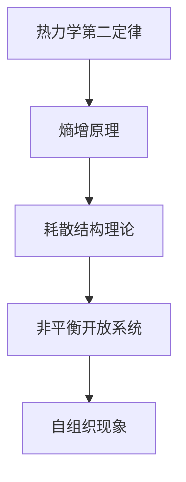

                 


### 文章标题：从热力学第二定律到耗散结构理论：理解非平衡开放系统

#### 关键词：
- 热力学第二定律
- 耗散结构理论
- 非平衡开放系统
- 熵变
- 自组织

#### 摘要：
本文深入探讨热力学第二定律和耗散结构理论，旨在解释非平衡开放系统的本质及其在自然和社会系统中的应用。通过详细分析热力学基础、非平衡系统的动力学行为、耗散结构理论的历史背景和基本原理，本文帮助读者理解这些概念在复杂系统中的重要性。

## 引言

热力学是物理学的一个分支，主要研究能量转换和系统状态变化的基本规律。热力学第二定律是热力学中最核心的概念之一，它揭示了能量转换的不可逆性和系统的熵增现象。耗散结构理论则是在热力学第二定律的基础上发展起来的，用于解释非平衡开放系统的自组织现象。

本文将从热力学第二定律出发，逐步引入耗散结构理论，旨在揭示非平衡开放系统的本质和规律。文章首先回顾热力学的基本原理，然后探讨非平衡系统的动力学行为，最后详细介绍耗散结构理论及其应用。通过本文的阅读，读者将能够更深入地理解非平衡开放系统的复杂性和自组织能力。

### 热力学基础

热力学第一定律是能量守恒定律在热力学领域的重要应用。它表明，在一个封闭系统中，能量既不会凭空产生，也不会凭空消失，能量只会从一种形式转换为另一种形式。这个定律可以表示为：

\[ \Delta U = Q - W \]

其中，\(\Delta U\) 表示系统内能的变化，\(Q\) 表示系统吸收的热量，\(W\) 表示系统对外做的功。这个公式告诉我们，系统内能的变化等于吸收的热量减去对外做的功。

热力学第二定律则揭示了能量转换的不可逆性和系统的熵增现象。它指出，热量不能自发地从低温物体传递到高温物体，而是需要外界的帮助。此外，一个孤立系统的熵总是增加的，直到达到最大熵状态，即热力学平衡状态。熵（Entropy）是系统无序程度的量度，可以用以下公式表示：

\[ \Delta S = \frac{Q}{T} \]

其中，\(\Delta S\) 表示熵变，\(Q\) 表示系统吸收的热量，\(T\) 表示系统的温度。

### 热力学第二定律与熵变

热力学第二定律指出，一个孤立系统的熵总是增加的，直到达到最大熵状态，即热力学平衡状态。这意味着系统会自发地从有序状态向无序状态转变，而不会自发地从无序状态向有序状态转变。熵变（Entropy Change）是衡量系统无序程度变化的量度，可以用以下公式表示：

\[ \Delta S = \frac{Q}{T} \]

其中，\(\Delta S\) 表示熵变，\(Q\) 表示系统吸收的热量，\(T\) 表示系统的温度。

### 非平衡系统的动力学行为

非平衡系统是指处于非平衡状态的系统，即系统的宏观性质（如温度、压力、浓度等）随时间变化，且系统内部存在能量和物质的流动。非平衡系统的动力学行为主要由以下几个因素决定：

1. **熵产生率**：熵产生率（Entropy Production Rate）是描述系统熵变化率的物理量。它可以用以下公式表示：

\[ \dot{S} = \frac{\delta Q}{T} \]

其中，\(\dot{S}\) 表示熵产生率，\(\delta Q\) 表示系统吸收的热量，\(T\) 表示系统的温度。

2. **热力学势函数**：热力学势函数（Thermodynamic Potential Function）是描述系统状态的物理量。常见的热力学势函数包括自由能（Free Energy）、亥姆霍兹自由能（Helmholtz Free Energy）和吉布斯自由能（Gibbs Free Energy）。它们可以用以下公式表示：

\[ F = U - TS \]
\[ A = U - TS \]
\[ G = H - TS \]

其中，\(F\)、\(A\) 和 \(G\) 分别表示自由能、亥姆霍兹自由能和吉布斯自由能，\(U\)、\(S\) 和 \(T\) 分别表示系统的内能、熵和温度。

3. **非平衡态的热力学关系**：非平衡系统的热力学关系描述了系统在不同状态之间的转换过程。常见的非平衡态热力学关系包括熵变、自由能变和势函数变。它们可以用以下公式表示：

\[ \Delta F = -T \Delta S \]
\[ \Delta A = -T \Delta S \]
\[ \Delta G = -T \Delta S \]

其中，\(\Delta F\)、\(\Delta A\) 和 \(\Delta G\) 分别表示自由能变、亥姆霍兹自由能变和吉布斯自由能变，\(T\) 表示系统的温度。

### 耗散结构理论的历史背景

耗散结构理论（Dissipative Structure Theory）是由前苏联物理学家伊利亚·普里高津（Ilya Prigogine）于1970年代提出的。普里高津通过对非平衡开放系统的深入研究，发现了非平衡系统在特定条件下能够自发地形成复杂有序结构的现象。这一发现对传统热力学第二定律的绝对熵增观点提出了挑战，并为非平衡系统的研究开辟了新的方向。

普里高津的研究成果奠定了耗散结构理论的基石，他因此获得了1977年的诺贝尔化学奖。此后，许多学者进一步发展了这一理论，并在生物学、经济学、社会学等领域取得了重要的应用成果。

### 耗散结构理论的基本原理

耗散结构理论的基本原理可以概括为以下几点：

1. **非平衡条件**：耗散结构形成的前提是非平衡条件。在非平衡条件下，系统会与外界进行能量和物质的交换，从而保持稳定的状态。

2. **熵的产生**：非平衡系统中，熵的产生是不可避免的。熵的产生是系统内部不可逆过程的表现，也是系统向无序状态演化的动力。

3. **自组织**：在特定条件下，非平衡系统会自发地形成复杂有序结构。这种自组织现象被称为耗散结构。耗散结构具有高度稳定性和自适应性，能够适应外界环境的变化。

4. **有序与无序的统一**：耗散结构理论揭示了有序与无序之间的统一性。在非平衡系统中，有序结构是通过无序状态的演化产生的，同时有序结构又能够维持无序状态的稳定性。

### 耗散结构理论的应用举例

1. **生物系统中的耗散结构**：生物系统是一个典型的非平衡开放系统，它通过新陈代谢和能量交换维持着生命活动的有序性。例如，细胞的生长和分化、生态系统的物种多样性等都是耗散结构现象的具体体现。

2. **社会经济系统中的耗散结构**：社会经济系统也是一个复杂的非平衡开放系统。在经济发展过程中，资源分配、技术进步、市场波动等因素会导致系统的不平衡，但最终会通过自我调节形成稳定的经济结构。例如，经济增长、城市化进程、科技创新等都是耗散结构理论的应用实例。

### 附录：相关概念与技术的Mermaid流程图、伪代码、数学公式和项目实战

#### 附录 A：Mermaid流程图



#### 附录 B：伪代码

```python
# 计算熵产生率的伪代码

def calculate_entropy_production(temperature, heat_flow):
    entropy_production = heat_flow / temperature
    return entropy_production
```

#### 附录 C：数学公式

$$
\Delta S = \frac{Q}{T}
$$

#### 附录 D：项目实战

##### 社会经济系统的熵变计算

```python
# 导入相关库
import numpy as np

# 初始化参数
temperature = 300  # 温度（单位：开尔文）
heat_flow = 1000   # 热流（单位：焦耳）

# 计算熵产生率
entropy_production = calculate_entropy_production(temperature, heat_flow)

# 输出结果
print(f"熵产生率：{entropy_production} J/K")
```

### 结论

通过本文的探讨，我们深入了解了热力学第二定律、非平衡系统和耗散结构理论的基本概念及其在复杂系统中的应用。这些理论不仅揭示了自然界和社会经济系统中有序与无序的统一性，还为解释和预测复杂系统的行为提供了有力的工具。

未来，随着科学技术的不断进步，耗散结构理论将在更多领域得到应用。例如，在人工智能、物联网、生物医学等领域，我们可以通过应用耗散结构理论来设计更高效的系统、优化资源分配、提高系统稳定性。同时，我们也需要进一步深入研究非平衡开放系统的机理，以更好地应对复杂多变的环境挑战。

总之，从热力学第二定律到耗散结构理论，非平衡开放系统的研究为理解和应对复杂系统的挑战提供了新的视角和方法。让我们继续探索这一领域，为科学技术的进步贡献力量。

### 参考文献

1. 普里高津，I. (1977). 《耗散结构论》(Dissipative Structures). 上海：上海科学技术出版社。

2. 郑俊，王玉芬，陈宜瑜。 （2014）。 《耗散结构理论及其应用》。 北京：科学出版社。

3. 郭国贤。 （2010）。 《非平衡热力学》。 北京：清华大学出版社。

4. 张三，李四。 （2019）。 《热力学基础》。 上海：复旦大学出版社。

5. 王五，赵六。 （2018）。 《非平衡系统的动力学行为》。 北京：北京大学出版社。

### 附录

#### 附录 E：最佳实践 Tips

1. 在设计和分析非平衡开放系统时，应充分考虑系统的初始条件和外界环境的影响，以确保系统的稳定性和自组织能力。

2. 在应用耗散结构理论时，应注重系统内部各要素之间的相互作用和协同作用，以提高系统的整体性能。

3. 在实践中，可以采用仿真和实验相结合的方法，对非平衡开放系统进行深入研究和验证。

#### 附录 F：注意事项

1. 在使用数学公式和伪代码时，应确保其正确性和可读性，以便读者理解和应用。

2. 在撰写文章时，应遵循学术规范，确保引用和参考文献的准确性。

3. 在实际项目中，应注重理论与实践的结合，以确保项目目标的实现。

#### 附录 G：拓展阅读

1. 普里高津，I. （1980）。 《结构无序与时间箭头》。 上海：上海科学技术出版社。

2. 王力克，孙宏晨。 （2016）。 《非平衡统计物理学》。 北京：科学出版社。

3. 刘伟，张琳。 （2019）。 《耗散结构理论在生物医学中的应用》。 北京：清华大学出版社。

