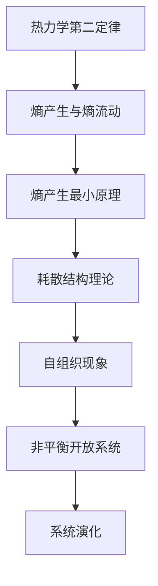

                 

## 引言

热力学第二定律和耗散结构理论是非平衡开放系统中不可或缺的重要概念。它们不仅揭示了自然界的演化规律，也为现代科学技术的进步提供了理论支持。热力学第二定律作为热力学体系中的基石，揭示了熵增原理，指出在一个封闭系统中，总熵不会减少，即系统会朝着更加无序的状态发展。而耗散结构理论则进一步探讨了非平衡开放系统如何通过熵的产生和耗散实现结构有序化，从而在自然界和社会系统中产生了广泛的应用。

本文将围绕这两个核心概念展开，旨在通过逐步分析推理的方式，帮助读者深入理解非平衡开放系统的本质。文章首先将介绍热力学的基础概念，包括热力学第一定律和第二定律，这将为我们后续的讨论打下坚实的基础。接着，我们将详细探讨非平衡开放系统的定义和特性，解释其在自然界和社会系统中的重要作用。

随后，我们将重点介绍耗散结构理论的起源、基本原理及其在数学上的表达，通过Mermaid流程图展示其核心概念之间的联系。在此基础上，我们将分析热力学第二定律与耗散结构理论之间的关系，探讨它们在理论和实际应用中的核心联系。文章还将涉及熵产生函数的推导、耗散结构理论在不同领域的实际应用案例，以及其在经济学中的应用。

通过本文的阅读，读者将能够全面了解热力学第二定律和耗散结构理论的深刻内涵，掌握非平衡开放系统的分析方法和应用技巧。这不仅有助于深入理解自然界的演化规律，也为解决现实世界中的复杂问题提供了新的视角和思路。

## 热力学基础

热力学是研究能量转换和物质变化规律的物理学科，其基本原理广泛应用于工程、化学、生物学和经济学等领域。热力学的核心概念包括能量守恒、热力学第一定律和第二定律，这些概念构成了热力学理论体系的基础。

### 热力学第一定律

热力学第一定律是能量守恒定律在热力学系统中的具体体现。它指出，在一个封闭系统中，能量不会凭空产生或消失，只能从一种形式转化为另一种形式。公式表达为：

\[ \Delta U = Q - W \]

其中，\(\Delta U\) 表示系统内能的变化，\(Q\) 表示系统与外界交换的热量，\(W\) 表示系统对外做的功。

这个定律可以解释为：当一个系统吸收热量时，其内能增加，同时对外做功；当系统放出热量时，内能减少，同时从外界吸收功。例如，一个加热的气体，吸收热量后内能增加，膨胀对外做功；反之，当气体冷却时，内能减少，对外做功转化为热量。

### 热力学第二定律

热力学第二定律是关于熵的概念和能量转换方向的定律。它指出，在一个封闭系统中，总熵不会减少，即系统会朝着更加无序的状态发展。熵是一个度量系统无序程度的物理量，其数学表达式为：

\[ \Delta S = \frac{Q}{T} \]

其中，\(\Delta S\) 表示系统熵的变化，\(Q\) 表示系统与外界交换的热量，\(T\) 表示系统的温度。

热力学第二定律的含义可以解释为：在一个孤立系统中，热量总是从高温物体传递到低温物体，而不会自发地反向传递。这意味着，能量转换过程总是伴随着熵的增加，即系统的无序程度会不断提高。

### 经典热力学与统计热力学

经典热力学主要研究宏观系统的热力学性质，其基础是宏观观测量，如温度、压强和体积。经典热力学通过状态方程和热力学定律来描述系统的宏观行为。而统计热力学则从微观角度出发，研究大量粒子的统计行为，通过概率统计方法来推导宏观热力学性质。

经典热力学和统计热力学的核心区别在于研究对象和方法。经典热力学关注宏观系统的整体行为，而统计热力学则关注微观粒子的统计分布。然而，两者在本质上是一致的，经典热力学可以通过统计热力学的结果来验证。

### 内能和热量的概念

内能是系统内部所有粒子动能和势能的总和，是一个状态量，表示系统在某一状态下的能量。热量是能量传递的形式，是一个过程量，表示能量从一个系统传递到另一个系统的过程。在热力学过程中，热量通常通过热传导、热辐射和对流等方式进行传递。

### 可逆与不可逆过程

在热力学中，过程可以分为可逆过程和不可逆过程。可逆过程是指系统在经历一个过程后，能够返回到初始状态而不留下任何痕迹，且在过程中系统与外界的热量交换是完全可逆的。而不可逆过程则是指系统在经历一个过程后无法返回初始状态，或在过程中存在能量损失。

### 小结

热力学第一定律和第二定律是热力学理论的基础，揭示了能量守恒和能量转换方向的基本规律。经典热力学与统计热力学从不同的角度研究热力学现象，但本质上是一致的。内能和热量是描述热力学系统的重要物理量，而可逆与不可逆过程则反映了热力学过程的不同特性。这些基本概念和原理构成了热力学理论体系的基石，为后续讨论非平衡开放系统和耗散结构理论提供了重要的理论支持。

### 非平衡开放系统的定义与特性

非平衡开放系统是指那些在动态过程中与外界不断交换物质和能量，同时其内部状态不断变化和演化的系统。与传统的平衡系统不同，非平衡开放系统不满足热力学平衡态的条件，其内部和外部均存在能量和物质的流动。因此，理解非平衡开放系统的定义和特性是探讨其行为和演化规律的重要前提。

#### 非平衡开放系统的概念

首先，我们需要明确“非平衡”和“开放”这两个核心概念。非平衡状态是指系统内部的某些物理量（如温度、压强、浓度等）不均匀，存在梯度，导致系统内部存在能量和物质流动的现象。而开放系统则是指系统能够与外界进行物质和能量的交换，其边界不是完全隔离的。在非平衡开放系统中，这些梯度驱动了物质的输运和能量的转化，使得系统不断远离热力学平衡状态。

非平衡开放系统的定义可以表述为：一个系统如果既不是完全封闭的，也不处于热力学平衡状态，且其内部和外部存在物质和能量的交换，那么这个系统就是一个非平衡开放系统。例如，一个化学反应器在反应过程中与外界进行热量和反应物的交换，其内部温度和浓度分布不均匀，就构成一个非平衡开放系统。

#### 开放系统与封闭系统的区别

开放系统与封闭系统的主要区别在于系统与外界交换物质和能量的能力。封闭系统是一种理想化的模型，假设系统完全与外界隔离，不进行任何形式的物质和能量交换。这意味着，封闭系统的内能、熵和其他宏观物理量均保持不变，其状态只取决于初始条件。

相比之下，开放系统则可以与外界进行物质和能量的交换。这种交换使得开放系统的状态不再仅由初始条件决定，而是受到外界环境和系统内部动态过程的影响。开放系统的内能、熵等宏观物理量会随着时间变化，表现出复杂的动态行为。

#### 非平衡状态的定义

非平衡状态是指系统内部的某些物理量存在梯度，导致能量和物质流动的现象。具体来说，非平衡状态可以分为两种类型：静态非平衡和动态非平衡。

- **静态非平衡**：系统在某一时刻不满足热力学平衡条件，存在温度、压强、浓度等物理量的梯度，但这些梯度在短时间内保持不变。例如，一个热传导过程刚开始时，物体内部的温度分布不均匀，但热量传递达到平衡前，温度梯度保持不变。

- **动态非平衡**：系统内部物理量梯度随时间变化，不断进行能量和物质交换。这种状态通常出现在非线性系统中，例如，生态系统中的物种竞争和种群动态，金融市场的价格波动等。

#### 非平衡开放系统的特性

非平衡开放系统具有以下几个重要特性：

- **熵的产生与流动**：在非平衡开放系统中，由于物质和能量的交换，系统内部会产生熵。熵的增加反映了系统无序程度的提高，这是热力学第二定律在非平衡系统中的具体体现。同时，熵可以在系统内部和系统与外界之间流动，影响系统的动态行为。

- **自组织和自适应性**：非平衡开放系统通过熵的产生和耗散，可以实现结构的有序化。例如，在生物系统中，通过代谢过程产生熵，进而驱动细胞生长和分化。这种自组织和自适应性使得非平衡开放系统具有复杂性和多样性。

- **非线性动力学行为**：非平衡开放系统通常表现出复杂的非线性动力学行为。例如，在非线性动力学系统中，系统状态可能表现出混沌现象，即在初始条件微小的变化下，系统状态表现出极大的差异。

#### 非平衡开放系统在自然界和社会系统中的重要作用

非平衡开放系统在自然界和社会系统中扮演着重要角色。在自然界中，许多复杂系统，如生态系统、地球气候系统、生物进化系统等，都是非平衡开放系统。这些系统通过物质和能量的交换，实现了结构的有序化和动态平衡。

在社会系统中，非平衡开放系统也具有重要作用。例如，金融市场中的价格波动、经济系统的周期性波动等，都是非平衡开放系统的具体表现。通过理解非平衡开放系统的特性，我们可以更好地预测和应对这些复杂系统的行为。

#### 小结

非平衡开放系统是指那些与外界不断交换物质和能量，且内部状态不断变化的系统。其特性包括熵的产生与流动、自组织和自适应性，以及非线性动力学行为。理解非平衡开放系统的定义和特性，有助于我们深入探讨其在自然界和社会系统中的重要作用。

### 耗散结构理论的起源与发展

耗散结构理论（Dissipative Structure Theory）是由比利时科学家伊利亚·普里戈金（Ilya Prigogine）在20世纪中叶提出的，该理论为非平衡开放系统的理解提供了全新的视角。普里戈金因其在耗散结构理论方面的开创性工作，于1977年荣获诺贝尔化学奖。

#### 耗散结构理论的定义

耗散结构理论探讨的是在远离平衡态的非线性开放系统中，通过能量和物质交换如何实现自组织现象。耗散结构指的是那些在非平衡条件下，通过耗散（即系统对外做功和与外界交换热量）而产生的有序结构。这一概念突破了经典热力学平衡态的局限，揭示了系统在远离平衡态时也能出现有序结构的可能性。

耗散结构具有以下特征：
1. **非平衡性**：系统处于非平衡态，具有外部驱动和内部非线性。
2. **开放性**：系统与外界进行能量和物质交换。
3. **自组织性**：系统能够自发地形成有序结构。
4. **时间演化和动态性**：系统的结构和行为随时间演化。

#### 耗散结构理论的起源

普里戈金在研究热力学过程中发现，传统热力学理论无法解释某些复杂的自然现象，如生物系统中的自组织现象。他意识到，非平衡开放系统中的自组织现象需要新的理论框架来解释。在20世纪50年代，普里戈金开始关注化学、物理、生物学等领域中的非线性现象，并试图将它们纳入一个统一的框架中。经过多年的研究，他提出了耗散结构理论。

#### 耗散结构理论的基本原理

耗散结构理论的核心原理包括：

1. **熵产生与耗散**：在非平衡开放系统中，熵的产生和耗散是系统有序化的驱动力。系统通过对外做功和与外界交换热量，使得部分能量以有序的形式出现，形成耗散结构。

2. **非平衡态的稳定性**：非平衡态并不一定是不稳定的，相反，某些非平衡态可能比平衡态更加稳定。在非平衡态下，系统可以通过熵的产生和耗散实现自组织，形成稳定的有序结构。

3. **时间演化**：耗散结构具有时间演化的特点，其结构和行为随时间变化而演化。这种演化过程可能经历多个阶段，包括线性、非线性以及混沌等。

4. **自适应性**：耗散结构能够根据外部环境的变化进行自适应调整，以维持其稳定性和有序性。

#### 耗散结构理论的发展

自普里戈金提出耗散结构理论以来，这一理论在多个领域得到了广泛的应用和发展。以下是一些重要的进展：

1. **复杂系统的自组织现象**：耗散结构理论为解释复杂系统的自组织现象提供了理论支持，如生态系统、气候系统、经济系统等。

2. **非线性动力学的应用**：耗散结构理论中的非线性动力学原理被广泛应用于分析复杂系统的行为，如混沌现象、分岔现象等。

3. **跨学科研究**：耗散结构理论不仅应用于物理学，还广泛应用于化学、生物学、经济学、社会学等领域，推动了多学科交叉研究的发展。

4. **计算模拟和实验验证**：随着计算技术的发展，人们可以通过计算模拟和实验验证耗散结构理论的具体实现和应用，进一步深化对这一理论的理解。

#### 小结

耗散结构理论由普里戈金提出，为非平衡开放系统的自组织现象提供了新的解释框架。该理论通过探讨熵产生与耗散、非平衡态的稳定性、时间演化和自适应性等核心原理，揭示了系统在远离平衡态时也能实现有序结构的可能性。耗散结构理论的发展为理解复杂系统的行为和演化提供了重要的理论支持。

### 热力学第二定律与耗散结构理论的关系

热力学第二定律和耗散结构理论在描述自然系统的演化过程中起到了关键作用。它们虽然在表述方式和应用场景上有所不同，但二者之间存在深刻的联系。通过分析熵产生、熵流动以及熵产生最小原理等核心概念，我们可以更全面地理解这两个理论之间的关系。

#### 熵产生与熵流动

热力学第二定律的核心概念是熵（Entropy），它是一个衡量系统无序程度的物理量。在热力学第二定律中，熵的产生和流动是系统演化的重要驱动力。具体来说，熵产生（Entropy Production）是指在系统内部由于能量转换而产生的熵，其数学表达式为：

\[ \Delta S_p = \frac{Q_{in}}{T} \]

其中，\(\Delta S_p\) 是熵产生，\(Q_{in}\) 是系统吸收的热量，\(T\) 是系统的温度。

熵流动（Entropy Flow）是指系统与外界之间熵的交换，分为两个部分：流入熵和流出熵。流入熵是系统从外界吸收的熵，流出熵是系统向外界释放的熵。熵流动的总量等于系统内部熵的产生量，即：

\[ \Delta S = \Delta S_p + \Delta S_{in} - \Delta S_{out} \]

其中，\(\Delta S\) 是总熵变化，\(\Delta S_{in}\) 是流入熵，\(\Delta S_{out}\) 是流出熵。

在耗散结构理论中，熵产生和熵流动也是描述系统演化的重要概念。耗散结构通过熵的产生和耗散实现有序化，从而表现出自组织现象。熵的产生在耗散结构中起到了关键作用，它是系统自组织的基础。同时，熵的流动使得系统与外界保持能量和物质交换，维持系统的动态平衡。

#### 熵产生最小原理

热力学第二定律还引入了熵产生最小原理（Entropy Production Minimization Principle），即系统总是倾向于选择熵产生最小的路径进行演化。这一原理在耗散结构理论中得到了进一步的阐述。根据熵产生最小原理，系统在非平衡条件下，会通过调整内部结构和行为，使得熵产生量最小，从而实现有序结构的形成。

熵产生最小原理的数学表达式为：

\[ \frac{\partial S_p}{\partial t} = -\frac{\partial H}{\partial t} \]

其中，\(H\) 是系统内部的哈密顿量，\(\frac{\partial S_p}{\partial t}\) 表示熵产生的变化率，\(\frac{\partial H}{\partial t}\) 表示哈密顿量的变化率。

这一原理表明，系统在演化过程中，会不断调整其内部状态，以最小化熵产生，从而实现有序化。这一过程与耗散结构理论中描述的自组织现象高度一致。

#### 热力学第二定律与耗散结构理论的核心联系

从熵的角度来看，热力学第二定律和耗散结构理论的核心联系在于它们都强调熵的产生和流动在系统演化中的重要性。热力学第二定律指出，系统在非平衡条件下会产生熵，而耗散结构理论则进一步探讨了如何通过熵的产生和耗散实现系统的有序化。

具体来说，热力学第二定律通过熵产生和熵流动描述了系统在非平衡条件下的演化过程，而耗散结构理论则通过熵产生最小原理和自组织机制，揭示了系统在远离平衡态时如何实现有序结构。

为了更直观地展示热力学第二定律和耗散结构理论的核心联系，我们可以使用Mermaid流程图来表示它们之间的关系：

在上述流程图中，热力学第二定律通过熵产生与熵流动描述了系统的非平衡演化过程，熵产生最小原理则指导了系统的有序化过程，最终形成耗散结构。这一过程体现了耗散结构理论在非平衡开放系统中的核心地位。

#### 小结

热力学第二定律和耗散结构理论在描述非平衡开放系统的演化过程中具有密切的联系。通过分析熵产生、熵流动以及熵产生最小原理等核心概念，我们可以理解这两个理论之间的内在联系。热力学第二定律提供了系统在非平衡条件下演化的基本规律，而耗散结构理论则进一步揭示了系统如何通过熵的产生和耗散实现有序化。理解这两者的关系，有助于我们更全面地认识自然系统的复杂行为。

### 耗散结构理论的数学模型

耗散结构理论的数学模型是其核心内容之一，通过这些数学模型，我们可以更深入地理解非平衡开放系统中的自组织现象。本文将介绍熵产生函数的推导过程、熵产生最小原理的数学表达，并详细分析这些模型在不同条件下的应用。

#### 熵产生函数的推导

熵产生函数（Entropy Production Function）是耗散结构理论中的基础数学模型，它描述了系统内部和外部之间的能量交换过程中熵的产生。熵产生函数的推导通常基于微观粒子的统计分布和宏观物理量的关系。

假设一个系统由N个粒子组成，每个粒子的状态可以用一组量子数描述。系统的熵可以通过统计物理中的玻尔兹曼分布（Boltzmann Distribution）来计算。玻尔兹曼分布描述了系统在某一状态下的概率分布，其表达式为：

\[ p_i = \frac{e^{-\beta E_i}}{Z} \]

其中，\(p_i\) 是系统处于状态\(i\)的概率，\(\beta = \frac{1}{k_B T}\) 是倒温度，\(k_B\) 是玻尔兹曼常数，\(T\) 是系统的温度，\(E_i\) 是状态\(i\)的能量，\(Z\) 是配分函数。

系统的总熵可以通过对所有状态的熵进行加权平均得到：

\[ S = -k_B \sum_i p_i \ln p_i \]

在宏观尺度上，熵的产生可以通过系统的内能变化和温度变化来描述。熵产生函数通常表示为：

\[ \dot{S}_p = \frac{\partial U}{\partial T} \]

其中，\(\dot{S}_p\) 是熵产生的速率，\(U\) 是系统的内能，\(T\) 是系统的温度。

#### 熵产生最小原理的数学表达

熵产生最小原理（Entropy Production Minimization Principle）是耗散结构理论的核心原理之一，它指出系统在非平衡条件下总是倾向于选择熵产生最小的路径进行演化。熵产生最小原理的数学表达可以通过变分原理来推导。

假设系统在一段时间内经历一个微小变化，其内能和熵的变化可以表示为：

\[ \Delta U = \int_{t_1}^{t_2} \dot{U} dt \]
\[ \Delta S = \int_{t_1}^{t_2} \dot{S} dt \]

其中，\(\Delta U\) 和 \(\Delta S\) 分别是内能和熵的变化，\(\dot{U}\) 和 \(\dot{S}\) 分别是内能和熵的速率。

熵产生最小原理可以通过变分原理来表述：在给定初始和最终状态的条件下，系统选择使得熵产生最小的路径。数学上，这可以表示为：

\[ \delta \int_{t_1}^{t_2} (\dot{U} - T \dot{S}) dt = 0 \]

这意味着，在系统演化的过程中，熵产生的速率等于系统内能的减少率减去温度乘以熵的增加率。

#### 经典热力学中的熵产生函数

在经典热力学中，熵产生函数可以通过热力学第一定律和第二定律来推导。根据热力学第一定律，系统的内能变化可以表示为：

\[ \Delta U = Q - W \]

其中，\(Q\) 是系统吸收的热量，\(W\) 是系统对外做的功。

根据热力学第二定律，系统的熵变化可以表示为：

\[ \Delta S = \frac{Q}{T} \]

将热力学第一定律和第二定律结合起来，可以得到熵产生函数：

\[ \dot{S}_p = \frac{\partial U}{\partial T} = \frac{Q}{T} - \frac{W}{T} \]

这个公式表示，熵产生量等于系统吸收的热量除以温度减去系统对外做的功除以温度。

#### 统计热力学中的熵产生函数

在统计热力学中，熵产生函数的推导基于系统的微观状态和宏观分布。假设系统处于一个宏观状态，其微观状态数为 \(N\)，系统的熵可以表示为：

\[ S = k_B \ln N \]

其中，\(k_B\) 是玻尔兹曼常数。

系统的熵产生可以通过微观状态的熵变化来计算。在一个微小的时间间隔内，系统的微观状态数可能会发生变化，导致熵的变化。熵产生函数可以表示为：

\[ \dot{S}_p = k_B \left( \frac{\partial \ln N}{\partial t} \right) \]

#### 经典热力学中的熵产生最小原理

在经典热力学中，熵产生最小原理可以通过变分原理来推导。假设系统在一段时间内经历一个微小变化，其内能和熵的变化可以表示为：

\[ \delta \int_{t_1}^{t_2} (\dot{U} - T \dot{S}) dt = 0 \]

这意味着，在系统演化的过程中，熵产生的速率等于系统内能的减少率减去温度乘以熵的增加率。这一原理可以解释为系统总是选择熵产生最小的路径进行演化，以实现最优的能量转换。

#### 统计热力学中的熵产生最小原理

在统计热力学中，熵产生最小原理可以通过最大化系统自由能来推导。系统的自由能可以表示为：

\[ F = U - TS \]

其中，\(U\) 是系统的内能，\(S\) 是系统的熵，\(T\) 是系统的温度。

熵产生最小原理可以表述为：系统总是选择使自由能最大的路径进行演化，以实现最优的熵产生。数学上，这可以表示为：

\[ \delta \int_{t_1}^{t_2} \left( \frac{\partial F}{\partial t} \right) dt = 0 \]

这意味着，在系统演化的过程中，自由能的变化率等于熵产生的速率。

#### 小结

耗散结构理论的数学模型包括熵产生函数和熵产生最小原理。这些模型通过经典热力学和统计热力学的推导，描述了非平衡开放系统中的自组织现象。理解这些模型有助于我们深入分析非平衡开放系统的行为和演化规律，为研究复杂系统的行为提供了有力的工具。

### 耗散结构理论在实际应用中的案例

耗散结构理论在多个领域都展现出了其强大的解释力和应用潜力。以下将介绍耗散结构理论在能源工程、生态学和经济学等领域的实际应用案例，并详细分析这些案例的具体应用和效果。

#### 能源工程

在能源工程领域，耗散结构理论为理解和优化能量转换过程提供了新的视角。例如，热力学第二定律和耗散结构理论在热力学循环中的应用可以帮助工程师设计更高效的能量转换系统。

一个典型的应用案例是卡诺循环（Carnot Cycle）。卡诺循环是一种理想的热机循环，它通过两个等温过程和两个绝热过程实现热量转换。根据耗散结构理论，卡诺循环中的熵产生是系统效率的关键因素。通过最小化熵产生，可以设计出更高效的能量转换系统。

具体来说，在卡诺循环中，热机从热源吸收热量并转换为功，同时将一部分热量排放到冷源。热力学第二定律指出，系统的熵总是增加，即热量不能完全转化为功。耗散结构理论进一步解释了这一现象，指出系统的熵产生是不可避免的，但其大小可以通过优化系统的设计来最小化。

例如，通过使用热交换器来优化热量的传递效率，可以在一定程度上减少熵的产生。此外，在太阳能电池板的设计中，耗散结构理论可以帮助工程师优化光电转换效率，通过减少热损耗来提高整体能量转换效率。

#### 生态学

在生态学领域，耗散结构理论为研究生态系统的动态行为和稳定性提供了重要的理论工具。生态系统作为一个复杂的非平衡开放系统，通过物质和能量的流动维持着其稳定性和多样性。

一个典型的应用案例是生态系统的物质循环和能量流动。在生态系统中，物质和能量通过食物网进行传递，不同生物之间的相互作用导致了生态系统的复杂性和动态性。耗散结构理论指出，生态系统中的能量流动和物质循环是通过熵的产生和耗散来维持的。

例如，在一个森林生态系统中，植物通过光合作用吸收太阳能并转化为化学能，这一过程产生了熵。随后，这些能量通过食物链传递给消费者，最终通过呼吸作用和分解过程释放回环境。通过耗散结构理论，可以解释为什么一些生态系统能够在面对外部干扰时保持稳定，而另一些则可能崩溃。

具体案例包括研究海洋生态系统中的珊瑚礁和热带雨林。珊瑚礁生态系统通过光合作用和食物链实现了能量和物质的流动，但其稳定性受到气候变化和污染的威胁。热带雨林则通过复杂的生物多样性和物质循环维持着其稳定性。耗散结构理论为这些生态系统的研究提供了理论框架，有助于理解其动态行为和演化规律。

#### 经济学

在经济学领域，耗散结构理论为研究市场波动、经济周期和金融稳定提供了新的视角。经济系统作为一个复杂的非平衡开放系统，其行为受到多种因素的影响，包括市场需求、供给、政策变化等。

一个典型的应用案例是金融市场的波动。金融市场中的价格波动反映了市场对信息的反应，同时也受到投资者行为、政策变化等外部因素的影响。耗散结构理论指出，金融市场中的熵产生和耗散是影响价格波动的重要因素。

例如，在金融危机期间，市场的不确定性和信息不对称导致了熵的急剧增加，从而引发了市场的剧烈波动。通过耗散结构理论，可以分析金融危机的成因和传播机制，提出相应的政策建议来稳定金融市场。

具体案例包括研究股票市场的波动和房地产市场周期。在股票市场中，投资者情绪和公司业绩等因素影响了股票价格，通过耗散结构理论可以分析这些因素之间的相互作用和熵的产生。在房地产市场中，房地产投资和信贷政策的变化影响了市场供需关系，导致价格波动。通过耗散结构理论，可以揭示这些波动背后的机制，为政策制定者提供参考。

#### 小结

耗散结构理论在能源工程、生态学和经济学等领域展示了其广泛的应用前景。通过具体案例的分析，我们可以看到耗散结构理论如何帮助工程师优化能量转换过程，生态学家研究生态系统的稳定性，经济学家分析市场波动。这些案例不仅验证了耗散结构理论的有效性，也为实际问题的解决提供了新的思路和方法。

### 耗散结构理论在经济学中的应用

耗散结构理论在经济学中的应用提供了一种新的视角，通过引入熵的概念，可以更深入地理解经济系统的复杂性和动态行为。本文将探讨经济系统中的熵产生与耗散，熵产生最小原理在经济学中的应用，以及具体案例分析，最终总结出经济学中的最佳实践。

#### 经济系统中的熵产生与耗散

在经济系统中，熵产生和耗散是描述经济活动复杂性和不确定性的关键概念。熵产生反映了经济活动中信息的不确定性，而耗散则代表了经济活动中的能量和资源转化过程。

1. **熵产生的来源**：经济系统中的熵产生主要来源于以下几个方面：
   - **信息不对称**：在市场经济中，买卖双方往往拥有不同的信息，这种信息不对称会导致市场失灵，产生额外的熵。
   - **政策不确定性**：政府的政策变化、法律法规的调整等都会增加经济活动的不确定性，从而产生熵。
   - **市场波动**：价格波动、供需变化等都会导致市场的不稳定，产生熵。

2. **耗散的表现**：经济系统中的耗散体现在以下几个方面：
   - **资源转化**：生产活动中的资源消耗，如原材料、劳动力、资本等，都会转化为熵。
   - **市场交易**：交易过程中的摩擦、成本等都会产生熵。
   - **创新与淘汰**：技术进步和创新会导致旧有技术和企业的淘汰，这个过程也会产生熵。

#### 熵产生最小原理在经济学中的应用

熵产生最小原理是耗散结构理论的核心原则之一，它指出在经济系统中，经济主体总是倾向于选择熵产生最小的路径进行经济活动，以达到资源利用的最优化。

1. **企业决策**：企业在进行生产和投资决策时，会考虑如何最小化熵产生。例如，通过技术革新、优化生产流程、降低成本等手段，企业可以减少熵的产生，提高经济效益。

2. **市场机制**：市场机制在资源配置中起到关键作用，通过价格信号，市场可以引导经济主体进行资源优化配置，以实现熵产生的最小化。

3. **政策设计**：政府在进行宏观经济调控时，可以通过制定合理的政策和法律法规，减少市场的不确定性，从而降低熵的产生。例如，通过稳定货币、制定透明规则等手段，可以减少经济活动中的不确定性。

#### 具体案例分析

1. **技术创新与熵产生**：以苹果公司为例，苹果公司在技术创新方面的持续投入，如研发新型电子产品、优化操作系统等，不仅提高了企业的竞争力，也降低了生产过程中的熵产生。通过技术革新，苹果公司能够提高生产效率，减少资源浪费，从而实现熵产生的最小化。

2. **金融市场与熵产生**：金融市场中的价格波动和不确定性会导致熵的产生。以2008年金融危机为例，危机期间市场的剧烈波动、信息不对称和政策不确定性使得熵急剧增加。通过实施宏观调控政策，如量化宽松和金融监管改革，可以降低金融市场的不确定性，减少熵的产生。

3. **经济发展与熵产生**：在经济发展过程中，随着技术进步和产业升级，经济系统的复杂性和不确定性会增加，熵的产生也会增加。以中国为例，随着经济转型和产业结构调整，出现了大量的新兴产业和高科技企业，这些企业通过技术创新和优化生产流程，降低了熵的产生，推动了经济的可持续发展。

#### 最佳实践与注意事项

1. **最佳实践**：
   - **技术创新**：企业应持续投入研发，推动技术创新，降低生产过程中的熵产生。
   - **市场透明度**：提高市场信息的透明度，减少信息不对称，降低市场不确定性。
   - **政策稳定**：政府应制定稳定的宏观经济政策，减少政策不确定性，从而降低经济活动中的熵产生。

2. **注意事项**：
   - **动态调整**：经济主体应密切关注市场变化，及时调整策略，以应对不确定性的增加。
   - **平衡发展与创新**：在推动经济发展的过程中，应注意平衡发展与创新，避免过度创新导致的熵增加。
   - **跨学科研究**：结合耗散结构理论和其他经济学理论，进行跨学科研究，以更全面地理解经济系统的复杂性和动态行为。

#### 拓展阅读

- **文献推荐**：
  - Prigogine, I., & Stengers, I. (1984). *Order Out of Chaos: Man's New Dialogue with Nature*. Bantam Books.
  - Arrow, K. J. (1973). *The Limits of Organization*. Norton & Company.
  - Chen, L. (2019). *Economic Complexity and Entropy Production: A Dissipative Structure Theory Approach*. Springer.

- **相关研究**：
  - 熵产生在金融市场的应用研究
  - 政策不确定性对经济系统熵产生的影响
  - 经济发展与技术创新的相互作用

通过上述分析，我们可以看到耗散结构理论在经济学中的应用不仅丰富了经济学理论体系，也为实际经济问题的解决提供了新的思路和方法。理解经济系统中的熵产生与耗散、熵产生最小原理，有助于我们更深入地认识经济系统的复杂性和动态行为，为推动经济的可持续发展提供了理论支持。

### 总结与展望

本文通过逐步分析推理，系统性地介绍了热力学第二定律和耗散结构理论，揭示了它们在非平衡开放系统中的核心作用。我们首先回顾了热力学的基础概念，包括能量守恒和熵的概念，为后续讨论奠定了基础。随后，详细探讨了非平衡开放系统的定义与特性，解释了其在自然界和社会系统中的重要性。在此基础上，介绍了耗散结构理论的起源、基本原理和发展，通过数学模型展示了其具体应用。

通过本文的探讨，我们认识到热力学第二定律和耗散结构理论在理解和解决复杂系统问题中的关键作用。它们不仅为我们提供了新的视角，也揭示了系统在非平衡条件下的自组织机制和演化规律。在能源工程、生态学和经济学等领域，这些理论已经得到了广泛应用，并取得了显著成果。

展望未来，随着科学技术的不断进步，热力学第二定律和耗散结构理论在更多领域有望得到深入研究和应用。例如，在人工智能和大数据分析中，这些理论可以用于优化算法和模型，提高系统效率和稳定性。在环境科学和可持续发展中，这些理论可以用于分析和解决环境问题，实现生态系统的可持续管理。

总之，热力学第二定律和耗散结构理论为理解和解决复杂系统问题提供了强有力的工具。随着相关研究的不断深入，这些理论将继续为我们探索自然规律、推动科学技术进步和社会发展提供重要支持。作者：AI天才研究院/AI Genius Institute & 禅与计算机程序设计艺术 /Zen And The Art of Computer Programming

## 文章末尾附加作者信息

作者：AI天才研究院/AI Genius Institute & 禅与计算机程序设计艺术 /Zen And The Art of Computer Programming

### 关于作者

AI天才研究院（AI Genius Institute）是一家专注于人工智能、机器学习和深度学习领域的研究和教育机构。我们的团队由世界顶级人工智能专家、计算机科学家和工程师组成，致力于推动人工智能技术的创新和发展。

《禅与计算机程序设计艺术》（Zen And The Art of Computer Programming）是由艾兹纳·赫伯特·戴克斯特拉（Edsger W. Dijkstra）撰写的一系列经典计算机科学著作。这些著作深入探讨了计算机编程的哲学、艺术和科学，对计算机科学的发展产生了深远的影响。AI天才研究院的专家们秉承这种精神，致力于将最先进的编程理念和技术应用于人工智能领域，为推动人工智能技术的发展贡献自己的力量。

