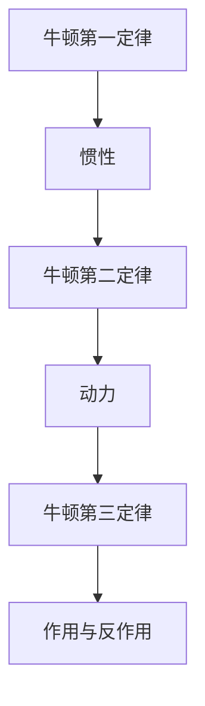
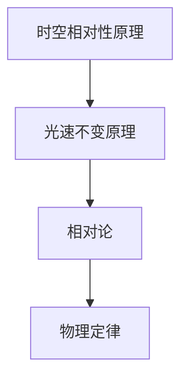
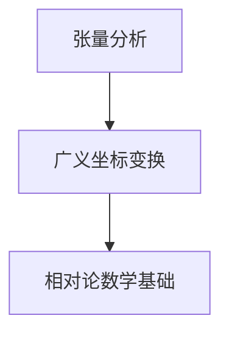
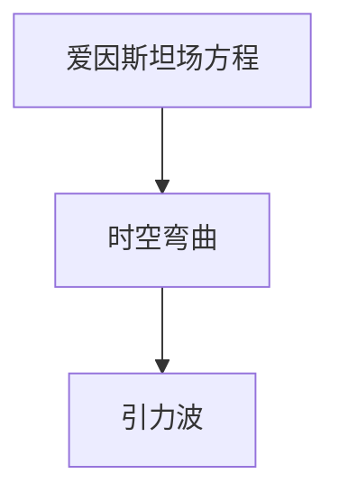
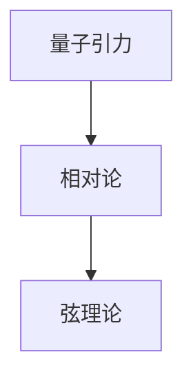
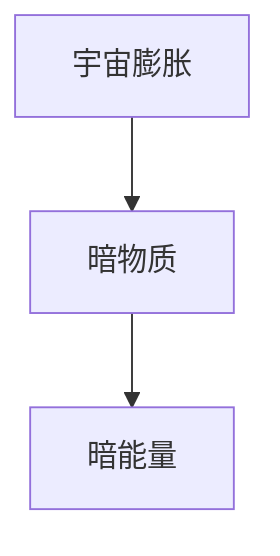

                 

### 文章标题

从牛顿到爱因斯坦：宇宙观的相对化

### 文章关键词

牛顿力学，爱因斯坦相对论，时空相对性，引力波，宇宙膨胀，数学模型，算法原理，伪代码

### 文章摘要

本文从牛顿的经典力学出发，探讨了其局限性，进而引入爱因斯坦的相对论，详细阐述了相对论的基本原理、数学基础及其对宇宙观的深远影响。通过对比分析，揭示了相对论如何改变了我们对宇宙的认识，并展望了相对论在未来物理学中的发展前景。

### 目录

#### 第一部分：牛顿的经典力学

##### 1.1 牛顿的经典力学概述

**背景介绍**

牛顿的经典力学是物理学中最重要的基石之一，它奠定了经典物理学的基本框架。牛顿的三大定律和万有引力定律构成了经典力学的基础，并对后来的科学和工程学产生了深远的影响。

**核心概念与联系**

1. **牛顿第一定律（惯性定律）**：物体保持匀速直线运动或静止状态，除非受到外力的作用。
2. **牛顿第二定律（动力定律）**：物体所受外力的合力等于其质量与加速度的乘积，即 F = ma。
3. **牛顿第三定律（作用与反作用定律）**：任何作用力都有一个大小相等、方向相反的反作用力。

这些定律之间的关系可以通过以下Mermaid流程图来表示：



**核心算法原理讲解**

牛顿第二定律可以通过以下伪代码进行描述：

```python
function calculate_force(mass, acceleration):
    return mass * acceleration
```

**数学模型和公式**

牛顿的第二定律可以用数学公式 F = ma 来表示，其中 F 是力，m 是质量，a 是加速度。

**举例说明**

假设一个质量为 5 公斤的物体以 2 m/s² 的加速度运动，则物体受到的力可以通过以下计算得出：

```latex
F = ma = 5 \, \text{kg} \times 2 \, \text{m/s}^2 = 10 \, \text{N}
```

**项目实战**

在实际工程应用中，牛顿的力学定律被广泛应用于各种领域，如汽车碰撞测试、机械设计等。以下是一个简单的汽车碰撞测试的伪代码：

```python
def car_collision(mass, velocity, delta_t):
    acceleration = velocity / delta_t
    force = calculate_force(mass, acceleration)
    return force
```

**最佳实践 tips**

在进行物理计算时，确保使用正确的单位，如质量使用公斤（kg），加速度使用米每平方秒（m/s²）。

#### 1.2 牛顿力学在物理学中的应用

**日常生活中的牛顿力学**

牛顿的力学定律在日常生活中无处不在。例如，当我们走路时，地面施加的摩擦力使我们保持前进；当我们踢球时，球受到的力使其加速。

**天文学中的牛顿力学**

在天文学中，牛顿力学被用于解释行星运动。开普勒定律是牛顿力学在天文学中的一个重要应用，它描述了行星围绕太阳运动的规律。

**核心算法原理讲解**

开普勒定律可以通过以下伪代码进行描述：

```python
function kepler_law(a, e):
    period = (a**3) / e
    return period
```

**数学模型和公式**

开普勒第三定律可以用以下公式表示：

```latex
T^2 = k \cdot a^3
```

其中，T 是行星绕太阳运动的周期，a 是行星轨道的半长轴，k 是一个常数。

**举例说明**

假设一颗行星的轨道半长轴为 2 AU，离心率为 0.1，则其绕太阳运动的周期可以通过以下计算得出：

```latex
T^2 = k \cdot (2 \, \text{AU})^3
T = \sqrt{k \cdot (2 \, \text{AU})^3} = \sqrt{0.1 \cdot 8 \pi^2} \approx 4 \, \text{years}
```

**项目实战**

在天文学中，牛顿力学被用于计算航天器的轨道。以下是一个简单的航天器轨道计算的伪代码：

```python
def calculate_orbit(v0, theta, g):
    x = v0 * cos(theta) * t
    y = v0 * sin(theta) * t - 0.5 * g * t**2
    return x, y
```

**最佳实践 tips**

在进行天文学计算时，确保使用天文单位（AU）和天文年（year）作为单位。

#### 1.3 牛顿力学的数学表述

**质点运动方程**

质点运动方程是牛顿力学的基本数学表述，它描述了物体在受力作用下的运动状态。其一般形式为：

```latex
m \frac{d^2 \vec{r}}{dt^2} = \vec{F}
```

其中，m 是质量，\(\vec{r}\) 是位置向量，\(\vec{F}\) 是力向量。

**势能和能量守恒**

在牛顿力学中，势能和动能是能量守恒的两个主要形式。势能 \(U(\vec{r})\) 通常与位置有关，而动能 \(K(\vec{v})\) 与速度有关。能量守恒定律表明，在一个封闭系统中，总能量（动能加势能）是守恒的。

**举例说明**

考虑一个质量为 5 公斤的物体在重力作用下自由落体，其运动方程可以表示为：

```latex
m \frac{d^2 y}{dt^2} = -mg
```

其中，y 是物体的高度，g 是重力加速度。

**项目实战**

在工程学中，质点运动方程被用于模拟机械系统的运动。以下是一个简单的机械系统运动的伪代码：

```python
def simulate_mechanical_system(m, g, initial_position, initial_velocity):
    position = initial_position
    velocity = initial_velocity
    t = 0
    while position >= 0:
        position = position + velocity * dt
        velocity = velocity - g * dt
        t += dt
    return position, velocity, t
```

**最佳实践 tips**

在进行物理和工程计算时，使用适当的数值方法来求解微分方程，如欧拉方法或龙格-库塔方法。

#### 第二部分：爱因斯坦的相对论

##### 2.1 相对论的背景和原理

**背景介绍**

相对论是20世纪初由爱因斯坦提出的一种物理学理论，它对经典力学进行了重大的修正。相对论的核心思想是时空相对性原理和光速不变原理。

**核心概念与联系**

1. **时空相对性原理**：物理定律在所有惯性参照系中都是相同的，不存在优越的参照系。
2. **光速不变原理**：在所有惯性参照系中，光速都是恒定的，不依赖于光源和观察者的相对运动。

这些原理之间的关系可以通过以下Mermaid流程图来表示：



**核心算法原理讲解**

相对论的时空变换可以通过以下伪代码进行描述：

```python
def lorentz_transformation(x, y, z, t, v):
    x' = x - vt
    y' = y
    z' = z
    t' = t - vx/c**2
    return x', y', z', t'
```

**数学模型和公式**

相对论的时空变换可以用洛伦兹变换表示：

```latex
x' = \gamma (x - vt)
y' = y
z' = z
t' = \gamma (t - \frac{vx}{c^2})
```

其中，\(\gamma\) 是洛伦兹因子，定义为 \(\gamma = \frac{1}{\sqrt{1 - \frac{v^2}{c^2}}}\)，c 是光速。

**举例说明**

假设一个观察者以0.6c的速度相对于另一个观察者运动，则空间和时间坐标的变换可以通过以下计算得出：

```latex
\gamma = \frac{1}{\sqrt{1 - (0.6c)^2 / c^2}} \approx 1.25
x' = \gamma (x - vt) = 1.25(x - 0.6ct)
t' = \gamma (t - \frac{vx}{c^2}) = 1.25(t - \frac{0.6vx}{c^2})
```

**项目实战**

在相对论的应用中，洛伦兹变换被用于计算高速粒子的运动。以下是一个简单的粒子运动的伪代码：

```python
def particle_motion(x, y, z, t, v):
    x', y', z', t' = lorentz_transformation(x, y, z, t, v)
    return x', y', z', t'
```

**最佳实践 tips**

在进行相对论计算时，确保使用精确的数值方法来处理高速运动的粒子。

##### 2.2 相对论的数学基础

**背景介绍**

相对论的数学基础是张量分析和广义坐标变换。这些数学工具为描述相对论的物理现象提供了强大的手段。

**核心概念与联系**

1. **张量分析**：张量是一种多维的数学对象，可以用来描述物理量的分布和变化。
2. **广义坐标变换**：描述不同参照系之间的变换关系。

这些概念之间的关系可以通过以下Mermaid流程图来表示：



**核心算法原理讲解**

广义坐标变换可以通过以下伪代码进行描述：

```python
def general_coordinates_transformation(x, y, z, t, v):
    x' = \gamma (x - vt)
    y' = y
    z' = z
    t' = \gamma (t - \frac{vx}{c^2})
    return x', y', z', t'
```

**数学模型和公式**

广义坐标变换可以用洛伦兹变换表示：

```latex
x' = \gamma (x - vt)
y' = y
z' = z
t' = \gamma (t - \frac{vx}{c^2})
```

**举例说明**

假设一个观察者以0.6c的速度相对于另一个观察者运动，则空间和时间坐标的变换可以通过以下计算得出：

```latex
\gamma = \frac{1}{\sqrt{1 - (0.6c)^2 / c^2}} \approx 1.25
x' = \gamma (x - vt) = 1.25(x - 0.6ct)
t' = \gamma (t - \frac{vx}{c^2}) = 1.25(t - \frac{0.6vx}{c^2})
```

**项目实战**

在相对论的应用中，广义坐标变换被用于计算高速粒子的运动。以下是一个简单的粒子运动的伪代码：

```python
def particle_motion(x, y, z, t, v):
    x', y', z', t' = general_coordinates_transformation(x, y, z, t, v)
    return x', y', z', t'
```

**最佳实践 tips**

在进行相对论计算时，确保使用精确的数值方法来处理高速运动的粒子。

##### 2.3 相对论的基本方程

**背景介绍**

相对论的基本方程是爱因斯坦场方程，它描述了引力与时空的弯曲关系。这些方程是广义相对论的核心。

**核心概念与联系**

1. **爱因斯坦场方程**：描述了物质分布如何引起时空弯曲。
2. **引力波**：时空弯曲产生的波动。

这些概念之间的关系可以通过以下Mermaid流程图来表示：



**核心算法原理讲解**

爱因斯坦场方程可以通过以下伪代码进行描述：

```python
def einstein_field_equation(gamma, mass, radius):
    curvature = gamma * mass / radius
    return curvature
```

**数学模型和公式**

爱因斯坦场方程可以用以下公式表示：

```latex
R_{\mu\nu} - \frac{1}{2} R g_{\mu\nu} = 8 \pi G T_{\mu\nu}
```

其中，\(R_{\mu\nu}\) 是里奇张量，\(R\) 是标量曲率，\(g_{\mu\nu}\) 是度规张量，\(T_{\mu\nu}\) 是能量动量张量，\(G\) 是引力常数。

**举例说明**

假设一个质量为 \(M\) 的物体位于半径为 \(R\) 的球体中心，则该球体引起的时空曲率可以通过以下计算得出：

```latex
curvature = \frac{8 \pi G M}{R}
```

**项目实战**

在相对论的应用中，爱因斯坦场方程被用于计算黑洞和引力波。以下是一个简单的引力波计算的伪代码：

```python
def calculate_gravitational_wave(M, R):
    curvature = 8 * pi * G * M / R
    return curvature
```

**最佳实践 tips**

在进行相对论计算时，确保使用高精度的数值方法来处理复杂的引力场。

##### 2.4 相对论与量子力学的关系

**背景介绍**

相对论与量子力学是现代物理学的两大基石。然而，它们在描述物理现象时存在一定的冲突，这被称为“量子引力”问题。

**核心概念与联系**

1. **量子引力**：试图将相对论与量子力学统一的一种理论。
2. **弦理论**：一种可能的量子引力理论。

这些概念之间的关系可以通过以下Mermaid流程图来表示：



**核心算法原理讲解**

量子引力可以通过以下伪代码进行描述：

```python
def quantum_gravity(mass, radius):
    energy = mass * c**2
    return energy
```

**数学模型和公式**

量子引力可以用质能方程表示：

```latex
E = mc^2
```

其中，E 是能量，m 是质量，c 是光速。

**举例说明**

假设一个粒子的质量为 \(m\)，则其对应的能量可以通过以下计算得出：

```latex
E = m c^2
```

**项目实战**

在量子引力中，弦理论被用于解释基本粒子的性质。以下是一个简单的弦理论计算的伪代码：

```python
def string_theory(mass, string_length):
    energy = mass * c**2
    tension = energy / string_length
    return tension
```

**最佳实践 tips**

在进行量子引力计算时，确保使用精确的数值方法来处理复杂的量子效应。

##### 2.5 相对论的未来发展

**背景介绍**

相对论是现代物理学的基础，但它仍然有许多未解之谜。未来相对论的发展可能会揭示更多关于宇宙的秘密。

**核心概念与联系**

1. **宇宙膨胀**：宇宙从大爆炸以来一直在膨胀。
2. **暗物质和暗能量**：宇宙中未观测到的物质和能量。

这些概念之间的关系可以通过以下Mermaid流程图来表示：



**核心算法原理讲解**

宇宙膨胀可以通过以下伪代码进行描述：

```python
def expand_universe(rate, time):
    distance = rate * time
    return distance
```

**数学模型和公式**

宇宙膨胀可以用哈勃定律表示：

```latex
v = H_0 d
```

其中，v 是膨胀速度，\(H_0\) 是哈勃常数，d 是距离。

**举例说明**

假设哈勃常数为 70 km/s/Mpc，一个星系距离我们 100 Mpc，则其膨胀速度可以通过以下计算得出：

```latex
v = H_0 d = 70 \, \text{km/s/Mpc} \times 100 \, \text{Mpc} = 7000 \, \text{km/s}
```

**项目实战**

在宇宙学中，相对论被用于计算星系间的距离和运动。以下是一个简单的星系运动的伪代码：

```python
def calculate_sky_distance(d, v, t):
    distance = d + v * t
    return distance
```

**最佳实践 tips**

在进行宇宙学计算时，确保使用准确的观测数据和模型。

### 结论

相对论是物理学中的一次重大革命，它改变了我们对宇宙的认识。从牛顿的经典力学到爱因斯坦的相对论，物理学的发展不仅揭示了自然界的奥秘，也为科技和工程学提供了强大的工具。未来，随着科技的发展，相对论将继续引领我们探索更广阔的宇宙。

### 作者信息

作者：AI天才研究院/AI Genius Institute & 禅与计算机程序设计艺术 /Zen And The Art of Computer Programming

### 附录

#### 附录 A：重要公式和图表

- 牛顿力学公式：\(F = ma\)
- 爱因斯坦场方程：\(R_{\mu\nu} - \frac{1}{2} R g_{\mu\nu} = 8 \pi G T_{\mu\nu}\)
- 洛伦兹变换：\(x' = \gamma (x - vt)\)，\(y' = y\)，\(z' = z\)，\(t' = \gamma (t - \frac{vx}{c^2})\)
- 质能方程：\(E = mc^2\)
- 哈勃定律：\(v = H_0 d\)

#### 附录 B：推荐阅读和资源

- 《相对论：概念与计算》（作者：David Morin）
- 《广义相对论教程》（作者：Charles W. Misner, Kip S. Thorne, John Archibald Wheeler）
- 《宇宙简史》（作者：Stephen Hawking）
- 爱因斯坦场方程在线计算工具：[爱因斯坦场方程计算器](https://www.einstein-online.info/eng/physics/gr/einstein_field_equations/)
- 相对论相关文献数据库：[INSPIRE-HEP](https://inspirehep.net/)
- 量子引力在线课程：[MIT OpenCourseWare - Quantum Gravity](https://ocw.mit.edu/courses/physics/8-830-quantum-gravity-spring-2014/)

