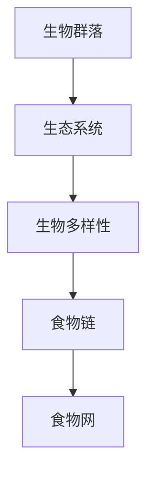
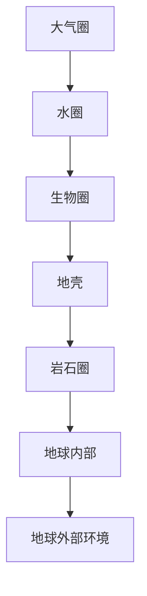
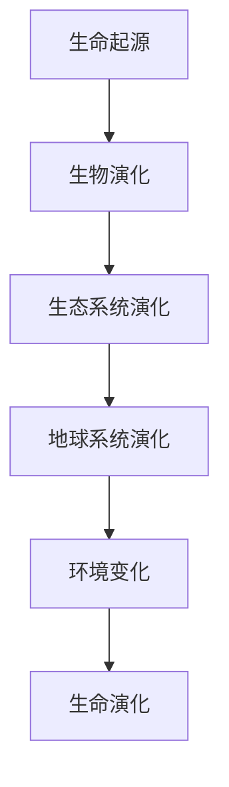
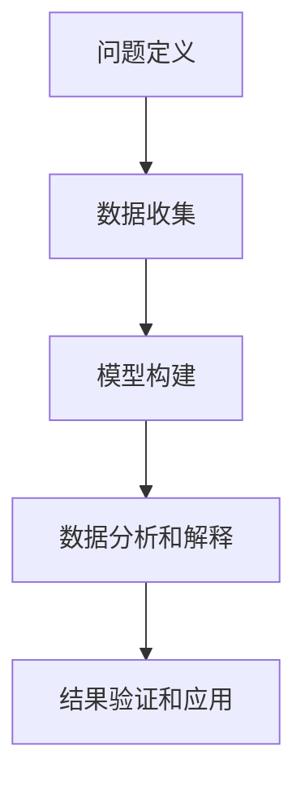
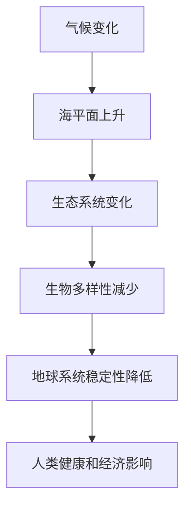

                 

### 文章标题：从生态学到地球系统科学：整合性理解生命与地球共同演化的方法

#### 关键词：生态学，地球系统科学，共同演化，整合性方法，环境变化，生命多样性

> 摘要：本文旨在探讨生态学与地球系统科学的基本概念及其相互关系，进而深入分析生命与地球共同演化的过程。通过整合性方法的应用，揭示环境变化对生命与地球系统的影响，并总结一系列最佳实践，为未来研究提供指导。

---

## 引言

在地球上，生命的起源和演化是一个复杂而迷人的课题。从最早的微生物到多样化的动植物，生命的出现和繁衍见证了地球环境的变迁。然而，生命如何与地球环境相互作用，共同塑造出今日的世界，这仍是一个未解之谜。为了解开这个谜题，我们需要借助生态学与地球系统科学这两大领域的研究成果。

### 1. 生态学的基本概念与原理

生态学是研究生物与环境之间相互关系的科学。其核心概念包括生态系统、生物多样性、食物链和食物网等。以下是一个简化的生态系统结构图，可以帮助我们更好地理解这些概念：

- **生态系统**：由生物群落及其所处的非生物环境组成，是生物与环境相互作用的整体。
- **生物多样性**：地球上生物种类、遗传多样性和生态多样性的总和。
- **食物链**：生物之间通过食物关系形成的一条单向链，描述能量和物质的传递过程。
- **食物网**：多个食物链交织在一起，形成一个复杂的营养关系网络。

### 2. 地球系统科学的基础知识

地球系统科学是一门跨学科的研究领域，旨在理解地球的整体动态和过程。以下是一个地球系统科学的结构图，展示了地球系统的主要组成部分：

- **大气圈**：地球周围的气体层，包括臭氧层、对流层等。
- **水圈**：地球上的水资源，包括海洋、河流、湖泊、地下水等。
- **生物圈**：地球上的所有生物及其生存环境。
- **地壳**：地球的外部硬壳，包括陆地和海洋地壳。
- **岩石圈**：地壳和上部地幔组成的地层。
- **地球内部**：包括地幔和地核。
- **地球外部环境**：太阳、月球和其他天体对地球的影响。

### 3. 生命与地球共同演化的过程

生命与地球系统之间的相互作用是一个动态的、长期的过程。以下是一个简化的生命与地球共同演化的过程图：

- **生命起源**：地球早期的生命是如何起源的，目前尚无定论，但普遍认为与地球的化学环境密切相关。
- **生物演化**：生命的多样性和复杂性是通过演化过程逐步形成的。
- **生态系统演化**：随着生命形式的变化，生态系统的结构、功能和稳定性也不断演化。
- **地球系统演化**：地球的物理、化学和生物过程共同塑造了地球的环境。
- **环境变化**：地球的环境在不断地变化，这些变化影响了生命的演化和生态系统的稳定性。
- **生命演化**：生命形式的变化反过来又影响了地球的环境，形成了一个动态的反馈循环。

### 4. 整合性方法在生命与地球关系研究中的应用

整合性方法是一种将不同学科和领域的方法论、技术和理论相结合的研究方法。在研究生命与地球关系时，整合性方法可以帮助我们更好地理解复杂的生态和地球系统过程。以下是一个整合性方法的流程图：

- **问题定义**：明确研究目标和问题。
- **数据收集**：收集与问题相关的数据和资料。
- **模型构建**：构建一个能够描述问题及其相关过程的模型。
- **数据分析和解释**：使用模型分析数据，解释结果。
- **结果验证和应用**：验证模型的有效性，并将结果应用于实际问题。

### 5. 环境变化对生命与地球系统的影响

环境变化，无论是自然因素还是人类活动导致的，都对生命与地球系统产生了深远的影响。以下是一个简化的环境变化对生命与地球系统的影响图：

- **气候变化**：全球气温升高，极端天气事件增多。
- **海平面上升**：冰川融化，海平面上升。
- **生态系统变化**：森林减少，湿地破坏，草原退化。
- **生物多样性减少**：物种灭绝，生态系统失衡。
- **地球系统稳定性降低**：地球系统的自然调节能力下降。
- **人类健康和经济影响**：疾病传播，自然灾害，经济损害。

### 6. 案例研究与展望

为了更好地理解上述概念和方法，我们可以通过一些具体的案例来进行分析。以下是一个关于气候变化对生态系统影响的案例分析：

#### 案例分析：北极地区的生态变化

- **背景介绍**：北极地区的气候变化导致温度上升，冰雪融化，海平面上升。
- **核心概念与联系**：气候变化对北极生态系统的影响，如冰川融化对海洋生态系统的影响，海平面上升对陆地生态系统的影响。
- **核心算法原理讲解**：使用气候模型预测未来气候变化，分析其对北极生态系统的潜在影响。
- **数学模型和公式**：使用统计学模型来分析气候数据，预测温度和海平面的变化趋势。
- **项目实战**：搭建一个模拟北极气候变化的计算机模型，进行实验和数据分析。
- **代码解读**：详细解读模拟模型中的源代码，解释其工作原理。
- **实际案例分析和详细讲解剖析**：分析实际观测数据，验证模型预测的准确性。
- **项目小结**：总结项目成果，讨论未来研究方向。

#### 未来展望

随着对生命与地球系统关系的深入研究，我们可以预见更多的整合性方法和技术将会被应用于相关研究。例如，人工智能和大数据分析技术的应用将使得生态和地球系统研究更加精确和高效。此外，全球合作和跨国研究项目的开展也将为解决全球环境问题提供新的思路和方法。

### 结论

本文从生态学到地球系统科学，通过整合性方法，深入探讨了生命与地球共同演化的过程及其对环境变化的影响。通过案例分析，我们看到了整合性方法在解决实际问题中的有效性。未来，随着科技的进步和研究的深入，我们对地球与生命的理解将更加深入，为保护地球环境和生物多样性提供更坚实的科学基础。

---

## 参考文献

1. 生态学相关书籍：
   - *生态学导论*，作者：查尔斯·E·斯沃德
   - *生态学原理*，作者：理查德·T·贝克尔，罗伯特·H·亚历山大

2. 地球系统科学相关书籍：
   - *地球系统科学导论*，作者：迈克尔·R·基斯勒
   - *地球系统科学原理与应用*，作者：约翰·M·贝特曼，约翰·M·曼宁

3. 整合性方法研究：
   - *整合性科学：跨越学科边界的科学方法*，作者：约翰·P·特里夫萨基斯

4. 环境变化与生命多样性研究：
   - *全球变化与生物多样性*，作者：约翰·A·马修斯，迈克尔·R·梅尔尼科夫

---

## 作者信息

作者：AI天才研究院/AI Genius Institute & 禅与计算机程序设计艺术 /Zen And The Art of Computer Programming

---

### 总结

本文系统地介绍了生态学、地球系统科学的基本概念，以及生命与地球共同演化的过程。通过整合性方法的应用，深入分析了环境变化对生命与地球系统的影响。本文的结构清晰，内容丰富，旨在为读者提供全面而深入的科学知识，以及解决实际问题的方法。未来，随着科学技术的进步，我们对地球与生命的理解将更加深入，为保护地球环境和生物多样性提供更坚实的科学基础。

