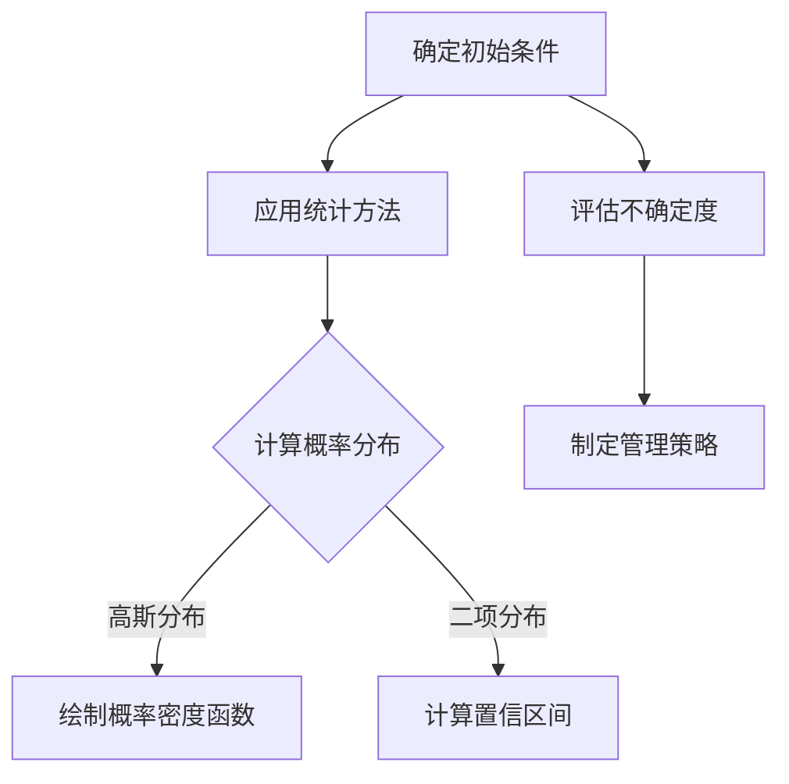
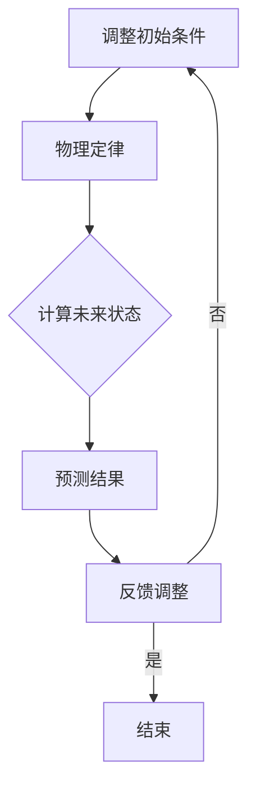
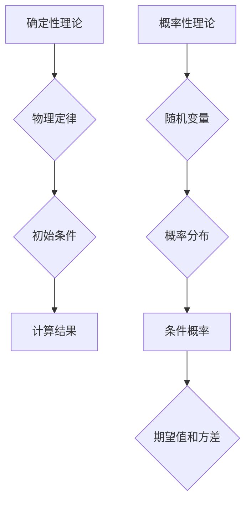
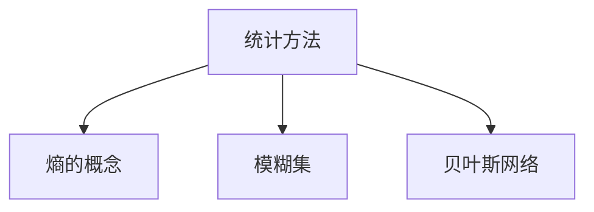
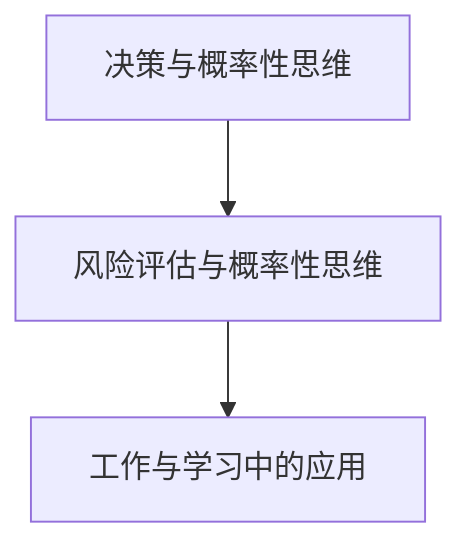

                 

### 引言

在科技日新月异的今天，我们身处的世界正变得越来越复杂和不确定。从自然界到社会科学，从日常决策到科学研究，不确定性已经成为了我们无法回避的现实。然而，人类自古以来就倾向于寻找规律性和确定性，这种倾向在科学和技术的进步中得到了充分体现。然而，随着对复杂系统研究的深入，我们逐渐认识到，不确定性是这个世界的一个基本特征。

本书的目的是通过系统的分析和深入的探讨，帮助读者从确定性到概率性的转变过程中找到自己的定位。我们首先将探讨不确定性的本质，理解为什么它如此重要。接下来，我们将回顾确定性理论的基本概念，并探讨其在实际应用中的局限。随后，我们将引入概率性理论，详细解释其基本原理和关键概念。通过这些理论的学习，我们将学习如何测量和评估不确定性，并提出有效的管理策略。

本书还将探讨概率性思维在日常生活中的应用，从决策到风险评估，从工作到学习。此外，我们还将深入探讨概率性理论在科学领域的广泛应用，包括物理学、统计学和生物学等。最后，我们将总结从确定性到概率性的转变对科学研究和社会发展的影响，并展望概率性理论未来的发展趋势。

通过这本书，我们希望读者能够建立起对不确定性世界的深刻理解，学会使用概率性思维来应对复杂和不确定的环境，从而更好地适应这个变化的世界。我们相信，这种理解不仅有助于个人的成长，也将对科学研究和技术创新产生深远的影响。

### 关键词

- 不确定性
- 确定性理论
- 概率性理论
- 随机变量
- 条件概率
- 测量与评估
- 概率性思维
- 应用场景
- 科学发展

### 摘要

本书旨在深入探讨从确定性到概率性的转变，帮助读者理解不确定性世界的本质和应对策略。首先，我们介绍了不确定性的概念及其重要性，对比了确定性世界和概率性世界的特点。接着，我们回顾了确定性理论的基础，探讨了其在实际应用中的局限。随后，我们详细介绍了概率性理论的基本原理和关键概念，并通过具体的测量和评估方法来理解和处理不确定性。本书还探讨了概率性思维在日常生活中的应用，以及概率性理论在科学领域的广泛影响。最终，我们总结了从确定性到概率性的转变对科学研究和社会发展的意义，并展望了概率性理论的未来发展趋势。通过本书，读者将能够更好地理解不确定性的本质，学会使用概率性思维来应对复杂和不确定的环境。

### 第1章：引言

#### 1.1 不确定性的本质

不确定性是现代科学和技术研究中不可忽视的一个核心概念。它指的是在给定信息和条件下，无法精确预测或确定某个事件的结果或状态。在自然界和人类社会中，不确定性无处不在，它既体现在宏观的天体物理现象中，也体现在微观的量子力学规律中。此外，在社会和经济活动中，不确定性同样扮演着重要角色，影响着决策制定、风险管理和社会稳定。

从科学的角度来看，不确定性通常可以分为两类：客观不确定性和主观不确定性。客观不确定性是指由于自然界的基本随机性或复杂系统的混沌特性导致的不可预测性。例如，在气象学中，即使我们掌握了大量的气象数据，也很难精确预测某个地区的未来天气。这种现象源于大气系统的复杂性和内在的随机性。主观不确定性则是指由于信息不足、认知限制或观测误差等因素引起的不可预测性。例如，在医学诊断中，由于检测技术的局限和个体差异，医生可能无法准确判断病人的健康状况。

不确定性不仅存在于自然科学中，也广泛存在于社会科学领域。在社会经济活动中，不确定性体现在市场波动、政策变化和国际贸易中。例如，企业在进行投资决策时，需要面对未来市场需求、政策法规和市场竞争对手等不确定因素。在政治决策中，政策制定者需要评估不同政策的潜在影响，同时应对社会舆论和民意的不确定性。

#### 与确定性对比

与不确定性相对的是确定性，即事物的状态或结果是可以精确预测和确定的。在确定性世界中，因果关系明确，系统的状态和未来的发展路径可以准确地预测。例如，在经典力学中，如果知道了物体的初始位置、速度和受力情况，就可以精确地计算出物体未来的运动轨迹。这种确定性源于经典物理学中的决定论思想，即所有物理现象都可以通过初始条件和物理定律完全预测。

然而，确定性并不是现实世界的普遍特征。在现实生活中，很多系统表现出高度复杂性和随机性，使得我们无法准确预测其行为。这种从确定性到不确定性的转变，不仅改变了我们对自然界的理解，也深刻影响了科学研究的方法和思路。

与确定性相比，不确定性的挑战在于它增加了预测的复杂性和困难性。在确定性世界中，我们可以通过建立模型和进行计算来预测未来。然而，在不确定性世界中，由于随机性和复杂性的存在，我们需要采用概率性思维来处理和应对不确定事件。

#### 确定性世界与概率性世界的对比

为了更好地理解不确定性的本质，我们可以对比确定性世界和概率性世界的特点。

**确定性世界：**

- 因果关系明确：在确定性世界中，每一个事件都由明确的因果关系驱动，系统的状态和未来的发展路径可以精确预测。
- 预测精确：基于确定的初始条件和物理定律，我们可以准确地计算出系统的未来状态。
- 稳定性和可重复性：确定性系统的行为具有高度稳定性和可重复性，相同的初始条件将导致相同的结果。

**概率性世界：**

- 随机性和不确定性：在概率性世界中，系统的行为受随机性和不确定性的影响，即使相同的初始条件，也可能产生不同的结果。
- 概率分布：概率性世界中的事件结果通常用概率分布来描述，而不是单一的确定结果。
- 概率性思维：处理概率性世界的问题需要采用概率性思维，通过统计分析和概率模型来预测和决策。

这两种世界之间的主要区别在于是否能够精确预测。在确定性世界中，因果关系明确，我们可以通过物理定律和初始条件进行精确计算。而在概率性世界中，因果关系复杂，系统的行为受到随机因素的影响，我们无法精确预测，而是需要通过概率性思维来理解和处理不确定性。

#### 理解不确定性的重要性

理解不确定性对于科学研究和实际应用具有重要意义。首先，在科学研究中，不确定性是研究复杂系统的一个基本出发点。很多自然现象和社会问题都表现出高度的复杂性和随机性，只有通过理解和处理不确定性，我们才能深入揭示其内在规律。

其次，在技术领域，不确定性是设计可靠系统和算法的一个重要考虑因素。例如，在人工智能和机器学习中，算法的准确性和稳定性很大程度上取决于对不确定性的处理能力。通过概率性模型和随机算法，我们可以更好地适应和预测复杂环境中的不确定性。

最后，在日常生活中，理解不确定性有助于我们做出更明智的决策。例如，在金融投资中，了解市场波动的不确定性可以帮助我们制定有效的风险管理策略。在医疗决策中，理解不确定性有助于医生和患者共同制定治疗计划。

总之，理解不确定性不仅有助于我们更好地理解自然和社会现象，也为科学技术的进步和日常生活提供了重要的理论支持和实践指导。

### 第2章：确定性理论基础

#### 2.1 确定性理论的定义

确定性理论是研究在确定条件下，系统状态和行为能够精确预测的科学。其核心思想是，通过已知的初始条件和物理定律，可以唯一地确定系统的未来状态。确定性理论起源于经典物理学，特别是牛顿力学。在牛顿力学中，一个物体的运动状态（位置和速度）可以通过初始条件和作用力（即物理定律）精确计算出来。

确定性理论的数学基础是微分方程，特别是常微分方程。通过解这些方程，我们可以得到系统的动态行为。例如，在经典力学中，牛顿运动定律可以用一组微分方程表示，从而精确描述物体的运动轨迹。

#### 2.2 确定性理论的发展

确定性理论的发展历程可以追溯到古希腊时期，当时的哲学家和数学家就开始探讨自然现象的确定性。然而，现代确定性理论的形成主要得益于17世纪和18世纪的科学家，特别是艾萨克·牛顿和戈特弗里德·威廉·莱布尼茨的工作。

牛顿在1687年发表的《自然哲学的数学原理》中，提出了牛顿运动定律，这些定律为确定性理论奠定了基础。牛顿运动定律指出，物体的加速度与作用在它上的力成正比，与它的质量成反比，且加速度的方向与力的方向相同。这一理论在经典力学中得到了广泛应用。

莱布尼茨则发展了微积分，为确定性理论提供了数学工具。微积分的建立使得我们可以通过微分方程来描述和解决物理问题，从而推动了确定性理论的发展。

在19世纪和20世纪初，物理学中的确定性理论得到了进一步的完善。詹姆斯·克拉克·麦克斯韦的电磁理论、爱德华·卢瑟福的原子模型等都是确定性理论的重要成果。这些理论不仅在物理学中得到了广泛应用，也为后来的量子力学和相对论奠定了基础。

#### 2.3 确定性理论的关键概念

确定性理论中的关键概念包括初始条件、物理定律、系统的状态和预测。

- **初始条件**：初始条件是系统在开始时刻的状态，它包括物体的位置、速度和其他物理量。在确定性理论中，初始条件是预测未来状态的基础。
- **物理定律**：物理定律是描述系统如何随时间变化的规律。在经典力学中，牛顿运动定律是一个典型的物理定律，它描述了物体在受到力作用时的运动规律。
- **系统的状态**：系统的状态是描述系统在某一时刻的状态，它通常由一组物理量（如位置、速度、能量等）来表示。通过初始条件和物理定律，我们可以计算出系统在任意时刻的状态。
- **预测**：预测是根据初始条件和物理定律，对系统未来状态的计算和推测。在确定性理论中，预测是通过对微分方程的求解来实现的。

#### 2.4 确定性理论的历史与发展

确定性理论的历史可以追溯到古希腊时期，当时的哲学家和数学家如亚里士多德和阿基米德开始探讨自然现象的确定性。亚里士多德认为，自然界中的运动和变化都是受因果关系驱动的，这一观点为后来的确定性理论奠定了哲学基础。

在17世纪，艾萨克·牛顿的《自然哲学的数学原理》标志着现代确定性理论的诞生。牛顿运动定律的提出，使得我们能够通过数学方法精确预测物体的运动。牛顿的工作不仅推动了物理学的发展，也奠定了确定性理论的基础。

18世纪，莱布尼茨的微积分理论为确定性理论提供了数学工具。微积分的建立使得我们可以通过微分方程来描述和解决物理问题，从而推动了确定性理论的发展。

在19世纪和20世纪初，物理学中的确定性理论得到了进一步的完善。詹姆斯·克拉克·麦克斯韦的电磁理论、爱德华·卢瑟福的原子模型等都是确定性理论的重要成果。麦克斯韦的电磁理论描述了电荷和电流如何产生电磁场，这一理论在后来的无线电通信、电磁波传播等领域得到了广泛应用。卢瑟福的原子模型则通过实验数据揭示了原子结构的确定性特征，为确定性理论在微观领域的研究奠定了基础。

20世纪中期，量子力学的出现标志着确定性理论的局限性。量子力学揭示了微观世界中的随机性和不确定性，使得我们无法再通过确定性理论来描述所有物理现象。然而，量子力学中的某些规律，如波粒二象性和不确定性原理，仍然在经典物理学的基础上得到了解释和发展。

#### 2.5 确定性理论的局限

尽管确定性理论在物理学和工程学中取得了显著成果，但它也存在着一些局限。

- **初始条件的不确定性**：在实际应用中，我们很难精确测量初始条件。即使我们可以通过实验或观测获得一定的初始数据，这些数据往往也受到测量误差和系统噪声的影响，从而降低了预测的准确性。
- **复杂系统的混沌性**：在某些情况下，即使初始条件完全确定，系统的行为也可能表现出混沌性。混沌现象意味着即使初始条件非常接近，系统的最终状态也可能大相径庭，这导致我们无法通过确定性理论进行精确预测。
- **非线性系统的复杂性**：现实世界中的许多系统都是非线性的，这意味着系统的状态和变化不能简单地通过线性关系来描述。非线性系统的复杂性使得我们难以通过确定性理论来建立准确的模型和进行精确计算。

这些局限表明，确定性理论在某些情况下无法充分描述和预测现实世界的复杂现象。因此，我们需要引入概率性理论来处理和应对这些不确定性。

总之，确定性理论在描述和预测某些简单系统时具有重要作用，但在面对复杂和不确定的系统时，其局限性变得尤为明显。理解这些局限，有助于我们更全面地认识现实世界的本质，并推动科学技术的进步。

### 第3章：概率性理论基础

#### 3.1 概率性理论的定义

概率性理论是研究不确定性和随机性现象的一门学科，它通过概率分布和随机变量的概念来描述和预测事件的可能性。概率性理论的基础是概率论，概率论是数学的一个分支，主要研究随机事件的概率计算和统计推断。概率性理论不仅在数学和统计学中有重要地位，还在物理学、经济学、生物学、计算机科学等多个领域得到了广泛应用。

概率性理论的核心思想是，通过大量的实验或观测，我们可以得到一个事件发生的概率，即该事件在所有可能事件中出现的频率。概率性理论不仅关注单个事件的概率，还研究多个事件之间的依赖关系和组合概率。

#### 3.2 概率性理论的发展

概率性理论的发展历程可以追溯到古代，当时的数学家开始探讨随机事件的可能性。然而，现代概率性理论的形成主要得益于17世纪和18世纪的科学家，特别是皮埃尔-西蒙·拉普拉斯和约翰·凯瑟琳·蒙蒂尼的工作。

拉普拉斯是概率性理论的奠基人之一，他在1786年出版的《概率论》中，系统阐述了概率论的基本原理和方法。拉普拉斯通过概率密度函数和积分方法，提出了概率分布的概念，从而为概率性理论奠定了数学基础。

约翰·凯瑟琳·蒙蒂尼则在概率性理论的应用方面做出了重要贡献。他在《概率论》一书中，提出了中心极限定理，这一定理表明，大量独立随机变量的平均值的分布会趋近于正态分布，这一发现对于统计学和概率性理论的发展具有重要意义。

在19世纪和20世纪，概率性理论得到了进一步的发展。卡尔·弗里德里希·高斯和阿尔弗雷德·维尔斯特拉斯的工作推动了概率论的分析化进程，他们提出了误差分析和极限理论，从而为概率性理论提供了更坚实的数学基础。

在20世纪中叶，概率性理论在量子力学中的应用进一步推动了其发展。量子力学揭示了微观世界的随机性和不确定性，使得概率性理论在物理学中得到了广泛应用。尼尔斯·玻尔和沃纳·海森堡等科学家通过概率性理论，建立了量子力学的基本框架。

#### 3.3 概率性理论的关键概念

概率性理论中有几个关键概念，它们是理解概率性现象的基础。

- **随机变量**：随机变量是概率性理论中的一个基本概念，它是一个取值不确定的变量，其取值受随机实验的结果影响。随机变量可以分为离散型和连续型，离散型随机变量取有限或可数无限个值，而连续型随机变量则可以在一个区间内取任意值。

- **概率分布**：概率分布描述了一个随机变量取各个可能值的概率。对于离散型随机变量，概率分布通常用概率质量函数（PMF）来描述；对于连续型随机变量，则用概率密度函数（PDF）来描述。

- **期望值**：期望值是随机变量的中心位置，它表示随机变量平均取值的大小。期望值可以通过概率分布计算得出，它是概率性理论中的一个重要概念，用于描述随机变量的平均行为。

- **方差**：方差是随机变量取值与其期望值之间差异的度量，它表示随机变量的分散程度。方差越大，随机变量的取值分布越分散。

- **条件概率**：条件概率是给定一个事件已经发生的条件下，另一个事件发生的概率。条件概率是概率性理论中的一个重要概念，它帮助我们理解不同事件之间的依赖关系。

- **贝叶斯定理**：贝叶斯定理是概率性理论中的一个基本原理，它描述了后验概率与先验概率之间的关系。贝叶斯定理在统计推断和机器学习中有着广泛应用，它为我们提供了根据新数据更新概率估计的方法。

#### 3.4 概率性理论的基本原理

概率性理论的基本原理主要包括概率的加法规则、乘法规则和全概率公式。

- **概率的加法规则**：对于两个互斥事件A和B，它们的联合概率等于它们各自概率的和，即P(A or B) = P(A) + P(B)。
- **概率的乘法规则**：对于两个独立事件A和B，它们的联合概率等于它们各自概率的乘积，即P(A and B) = P(A) * P(B)。
- **全概率公式**：全概率公式描述了一个复杂事件发生的总概率，可以通过将其分解为多个互斥子事件的概率之和来计算。全概率公式为P(A) = Σ P(A|B_i) * P(B_i)，其中B_i是所有互斥的子事件。

这些基本原理构成了概率性理论的核心，它们帮助我们在处理不确定性和随机性问题时，能够建立数学模型并进行有效的分析和预测。

#### 3.5 概率性理论的应用领域

概率性理论在多个领域有着广泛的应用，以下是一些主要的应用领域：

- **物理学**：在量子力学中，概率性理论被用来描述粒子的行为和测量结果。量子力学中的波函数和测量概率是概率性理论的重要应用。
- **统计学**：统计学中的许多方法，如抽样分布、假设检验和置信区间，都基于概率性理论。这些方法帮助我们从数据中提取信息，并进行统计推断。
- **经济学**：经济学中的许多模型，如投资组合理论、金融市场分析和风险建模，都依赖于概率性理论。概率性理论帮助我们理解市场波动和风险管理。
- **生物学**：在生物学中，概率性理论被用来研究遗传学、进化论和生态学。例如，遗传学中的孟德尔定律和概率分布可以帮助我们预测后代的基因组合。
- **计算机科学**：在计算机科学中，概率性理论被广泛应用于算法设计、机器学习和数据挖掘。例如，决策树和神经网络等机器学习算法都基于概率性理论。

总之，概率性理论作为一种处理不确定性的工具，不仅在数学和统计学中有着重要的地位，还在物理学、经济学、生物学和计算机科学等众多领域发挥了重要作用。通过理解和应用概率性理论，我们可以更好地应对复杂和不确定的环境，做出更明智的决策和预测。

### 第4章：不确定性的测量与评估

在处理不确定性时，如何有效地测量和评估不确定性是非常重要的。这不仅有助于我们理解不确定性的本质，还能为决策提供科学依据。在这一章中，我们将讨论几种常见的测量和评估不确定性的方法，包括统计方法、熵的概念以及不确定性的管理策略。

#### 4.1 不确定性的测量方法

**统计方法**

统计方法是评估不确定性最常用的方法之一。通过收集和分析数据，我们可以对不确定性的程度和性质有一个直观的了解。以下是一些常见的统计方法：

- **均值和标准差**：均值是数据的平均数，它反映了数据的集中趋势。标准差则是衡量数据分散程度的一个重要指标，它越大，表示数据越分散，不确定性也越高。

- **方差**：方差是标准差的平方，它表示数据与均值之间的差异程度。方差越大，表示数据的波动性越大，不确定性越高。

- **置信区间**：置信区间是一种概率统计方法，用于估计总体参数的可能范围。例如，当我们估计一个总体均值时，可以通过计算置信区间来表示这个均值的可能范围，并给出一个置信水平（例如95%置信水平），即在这个范围内，总体均值包含真实值的概率为95%。

- **概率分布**：概率分布描述了随机变量取不同值的概率。常见的概率分布有正态分布、二项分布、泊松分布等。通过分析概率分布，我们可以了解数据的分布特性，进而评估不确定性。

**熵的概念**

熵是信息论中的一个重要概念，它用于衡量信息的随机性和不确定性。在概率性理论中，熵被广泛应用于测量不确定性的程度。

- **熵的定义**：熵是随机变量取值的概率与其对数的乘积之和。对于一个离散型随机变量X，其熵H(X)可以表示为：

  $$ H(X) = - Σ p(x) \cdot \log_2(p(x)) $$

  其中，\( p(x) \)是随机变量X取值x的概率。

- **熵的性质**：熵具有以下性质：

  - **非负性**：熵总是非负的，即\( H(X) \geq 0 \)。
  - **最大熵**：当随机变量是完全确定的，即所有取值的概率相等时，熵达到最大值，此时熵等于对数基数减1。
  - **信息增益**：熵的变化可以用来衡量信息量的变化。当随机变量的不确定性减少时，熵也会减少，这表示信息量的增加。

通过计算随机变量的熵，我们可以定量地评估其不确定性。熵越大，表示不确定性越高；熵越小，表示不确定性越低。

**其他测量方法**

除了统计方法和熵的概念，还有一些其他方法可以用来测量和评估不确定性，例如：

- **模糊集**：模糊集是一种处理不确定性和模糊性的数学工具。通过将模糊集应用于实际问题，可以更准确地描述和处理不确定性。
- **贝叶斯网络**：贝叶斯网络是一种基于概率图模型的推理工具，它通过表示变量之间的依赖关系，可以有效地评估和处理不确定性。

#### 4.2 不确定性的评估标准

在评估不确定性时，我们需要考虑多个标准，这些标准有助于我们全面地理解不确定性的性质和影响。

- **精度**：精度是衡量测量结果接近真实值程度的一个指标。在不确定性评估中，精度越高，表示测量结果越可靠，不确定性越小。
- **可靠性**：可靠性是衡量测量方法稳定性和一致性的指标。一个可靠的测量方法能够在多次测量中产生接近的结果，从而降低不确定性。
- **效率**：效率是衡量测量和评估过程所需时间和资源的指标。高效的测量和评估方法可以在较短的时间内提供准确的结果，从而降低不确定性。

#### 4.3 不确定性的管理策略

在处理不确定性时，管理策略的选择非常重要。以下是一些常见的不确定性管理策略：

- **风险评估**：风险评估是一种系统性的方法，用于评估不确定性的潜在影响和可能性。通过识别和分析不确定性因素，我们可以制定有效的风险管理策略。
- **决策分析**：决策分析是一种基于概率和成本的决策方法。通过分析不同决策方案的概率和结果，我们可以选择最优的决策方案，从而降低不确定性。
- **冗余和备份**：在系统设计和实现中，引入冗余和备份可以提高系统的可靠性，从而降低不确定性。例如，在计算机系统中，使用冗余硬件和备份数据可以提高系统的稳定性和可靠性。
- **模型和仿真**：通过建立数学模型和仿真，我们可以模拟和分析不确定性对系统的影响。这种方法可以帮助我们更好地理解不确定性，并制定相应的管理策略。

总之，不确定性的测量与评估是理解和应对不确定性的重要环节。通过使用统计方法、熵的概念和多种评估标准，我们可以定量地描述和评估不确定性。此外，通过有效的管理策略，我们可以降低不确定性对决策和系统运行的影响。这些方法和策略不仅有助于科学研究和技术创新，也为日常生活和工作中的决策提供了科学依据。

### 第5章：概率性思维在日常生活中的应用

概率性思维是一种帮助我们理解和处理不确定性的思维方式。它不仅适用于科学研究和技术领域，同样在我们的日常生活中有着广泛的应用。本章将探讨概率性思维在日常决策、风险评估和工作与学习中的应用，并举例说明如何利用概率性思维提高决策的科学性和准确性。

#### 5.1 决策与概率性思维

在日常决策中，概率性思维可以帮助我们更加科学地分析各种可能的后果，并基于这些后果做出最优选择。以下是一个具体的例子：

**例子：投资决策**

假设你正在考虑投资某个项目，该项目有两种可能的结果：成功或失败。成功时的收益为10万元，失败时的损失为5万元。如果你没有关于该项目成功或失败的概率信息，如何做出投资决策呢？

利用概率性思维，你可以设定以下步骤：

1. **确定可能结果**：定义项目的两种可能结果：成功和失败。
2. **估计概率**：根据你的了解和经验，估计项目成功的概率，例如，假设成功的概率为0.6，失败的概率为0.4。
3. **计算期望收益**：计算每种结果的期望收益，即成功时的收益乘以成功的概率，再加上失败时的损失乘以失败的概率。例如，期望收益为：

   $$ 期望收益 = (10 \times 0.6) + (-5 \times 0.4) = 6 - 2 = 4万元 $$

4. **做出决策**：基于期望收益，你可以做出投资决策。在这个例子中，期望收益为4万元，说明平均来看，该项目是值得投资的。

通过这种方法，你可以将不确定的结果转化为可计算的期望值，从而做出更加科学的投资决策。

#### 5.2 风险评估与概率性思维

在风险评估中，概率性思维同样发挥着重要作用。风险评估旨在识别和分析潜在风险，并评估这些风险的可能性和影响。以下是一个具体的例子：

**例子：旅行规划**

假设你计划去一个陌生的旅游目的地，需要评估以下风险：

- **交通延误**：航班延误的概率为0.2，延误时间为2小时。
- **天气风险**：当地有30%的概率遇到暴雨，暴雨会影响你的旅游计划。

利用概率性思维，你可以进行以下风险评估：

1. **识别风险因素**：列出可能影响旅行的风险因素，如交通延误、天气等。
2. **估计概率**：根据历史数据和经验，估计每个风险因素发生的概率。
3. **评估影响**：评估每个风险因素对旅行计划的可能影响，如交通延误会影响行程安排，暴雨会影响户外活动。

4. **计算综合风险**：计算每个风险因素的综合风险，例如，交通延误的综合风险为0.2（概率）× 2小时（影响）= 0.4小时。同样，天气风险的综合风险为0.3（概率）× 1天（影响）= 0.3天。

5. **制定应对策略**：基于综合风险，制定应对策略，如购买旅行保险、安排充足的休息时间等。

通过这种风险评估方法，你可以更全面地了解旅行过程中的潜在风险，并采取有效的措施来降低这些风险。

#### 5.3 概率性思维在工作与学习中的应用

在工作和学习中，概率性思维同样可以帮助我们更好地应对不确定性，提高效率和效果。以下是一些具体的例子：

**例子：项目管理**

在项目管理中，概率性思维可以帮助项目团队评估项目进度和成本的不确定性。以下是一个简单的步骤：

1. **确定关键任务**：识别项目中关键的任务和里程碑。
2. **估计完成时间**：根据历史数据和专家意见，估计每个任务的完成时间，并考虑可能的时间偏差。
3. **计算项目完成概率**：使用概率性模型（如蒙特卡洛模拟），模拟多个任务完成时间的组合，计算项目在不同时间点完成的概率。
4. **制定应急预案**：基于项目完成概率，制定相应的应急预案，以应对可能出现的时间延误或成本超支。

通过这种方法，项目团队可以更科学地管理项目进度，减少不确定性带来的风险。

**例子：学习策略**

在学习过程中，概率性思维可以帮助我们更好地制定学习计划和管理学习进度。以下是一个简单的步骤：

1. **确定学习目标**：明确你的学习目标，例如，掌握某项技能或通过某个考试。
2. **评估学习难度**：根据你的经验和知识，评估每个学习模块的难度和所需时间。
3. **制定学习计划**：使用概率性模型，例如二项分布，计算达到学习目标的概率，并制定相应的学习计划。
4. **调整学习策略**：根据学习过程中的反馈，及时调整学习策略，以最大化达到学习目标的概率。

通过这种方法，你可以更有效地管理学习进度，提高学习效果。

总之，概率性思维在日常生活中的应用可以帮助我们更好地理解和应对不确定性。通过具体的例子，我们可以看到概率性思维在决策、风险评估、工作和学习中的应用方法。通过这种方法，我们可以做出更明智的决策，降低风险，提高工作效率和学习效果。

### 第6章：概率性理论在科学领域的应用

概率性理论在科学领域的应用广泛而深远，其独特的思维方式和方法论不仅推动了基础科学的发展，也为应用科学提供了强有力的工具。在本章中，我们将探讨概率性理论在物理学、统计学和生物学等领域的具体应用，以及这些应用对科学研究的推动作用。

#### 6.1 概率性理论在物理学中的应用

在物理学中，概率性理论最早的应用可以追溯到量子力学。量子力学揭示了微观世界中物质的本质，提出了波粒二象性和不确定性原理，这些都依赖于概率性理论。

**量子力学**

量子力学中的概率性体现在波函数和测量结果上。波函数描述了粒子的概率分布，它提供了粒子在空间中各个位置的概率信息。在量子力学中，我们不能精确地预测粒子的行为，而是只能预测它在某个位置被观察到的概率。例如，电子在原子核周围的分布可以用波函数来描述，通过计算波函数的平方，我们可以得到电子在空间中各个位置的概率密度。

不确定性原理是量子力学中最著名的原理之一，它由海森堡提出。不确定性原理指出，我们不能同时精确地测量一个粒子的位置和动量。这个原理可以通过概率性理论来解释：粒子的位置和动量是相互关联的，当我们测量其中一个时，会对另一个产生影响，导致其不确定性增加。

**统计物理学**

在统计物理学中，概率性理论被用来研究大量粒子的集体行为。统计物理学的核心思想是通过考虑大量粒子的平均行为来描述系统的宏观性质。例如，玻尔兹曼分布描述了粒子在热平衡状态下的速度分布，这个分布是通过概率性理论计算得出的。

**随机过程**

随机过程是概率性理论在物理学中的另一个重要应用。随机过程用于描述时间或空间上随机变化的系统。在物理学中，随机过程被用来研究噪声、随机波动和复杂系统的行为。例如，布朗运动是粒子在液体或气体中的随机运动，它可以通过随机过程来描述。

**量子场论**

在量子场论中，概率性理论用于描述粒子的产生和湮灭。量子场论是量子力学和广义相对论的统一理论，它通过概率性理论描述了粒子的产生和湮灭过程。例如，费曼图是量子场论中描述粒子相互作用的重要工具，它通过概率性计算揭示了粒子之间的相互作用机制。

#### 6.2 概率性理论在统计学中的应用

在统计学中，概率性理论是数据分析的核心，它用于处理数据的收集、处理和分析。统计学的许多方法，如假设检验、置信区间、回归分析等，都依赖于概率性理论。

**假设检验**

假设检验是统计学中最常用的方法之一，用于判断一个给定的假设是否成立。假设检验基于概率性理论，通过计算检验统计量的概率分布，我们可以判断假设是否显著。例如，t检验和F检验都是基于概率性理论的假设检验方法，它们用于比较两组数据的均值和方差。

**置信区间**

置信区间是一种衡量总体参数估计可靠性的方法。通过计算置信区间，我们可以确定一个参数估计的置信水平，即在这个置信水平下，总体参数的真实值落在置信区间内的概率。置信区间依赖于概率性理论，通过概率分布计算得出。

**回归分析**

回归分析是一种用于研究变量之间关系的统计方法。回归分析基于概率性理论，通过建立回归模型，我们可以预测一个变量（因变量）基于其他变量（自变量）的变化。例如，线性回归模型通过最小二乘法拟合数据，从而得到变量之间的线性关系。

**贝叶斯统计**

贝叶斯统计是概率性理论在统计学中的另一个重要应用。贝叶斯统计通过贝叶斯定理，将先验知识和数据结合起来，得到后验概率分布，从而更新对总体参数的估计。贝叶斯统计在许多领域都有广泛应用，如医学诊断、风险评估和机器学习。

#### 6.3 概率性理论在生物学中的应用

在生物学中，概率性理论被广泛应用于遗传学、进化论和生态学等领域，帮助我们理解和预测生物系统的行为。

**遗传学**

在遗传学中，概率性理论用于分析遗传规律和遗传多样性。孟德尔定律是遗传学的基础，它描述了基因在后代中的分离和组合规律。通过概率性计算，我们可以预测不同基因组合在后代中的出现概率，从而理解遗传多样性。

**进化论**

进化论是生物学中的核心理论之一，它解释了生物多样性的起源和演化。概率性理论在进化论中的应用主要体现在种群遗传学和分子进化模型中。通过概率性计算，我们可以预测种群基因频率的变化，从而理解物种的进化过程。

**生态学**

在生态学中，概率性理论用于研究生物种群的行为和生态系统的动态。例如，生态位模型和食物网模型都是基于概率性理论的，它们用于描述生物种群之间的相互作用和生态系统的稳定性。

**生物信息学**

生物信息学是生物学和计算机科学的交叉领域，它通过概率性理论分析和解释生物数据。例如，序列比对和基因预测都是基于概率性算法的，通过计算序列相似性和概率分布，我们可以识别基因和蛋白质的结构和功能。

总之，概率性理论在物理学、统计学和生物学等领域的应用不仅推动了基础科学的发展，也为应用科学提供了强有力的工具。通过概率性思维，我们可以更好地理解和预测复杂系统的行为，从而推动科学技术的进步和社会的发展。

### 第7章：结论与展望

#### 7.1 从确定性到概率性的转变对科学的影响

从确定性到概率性的转变对科学研究产生了深远的影响。这一转变不仅改变了我们对自然世界的理解，也推动了科学研究方法的革新。确定性理论强调因果关系和精确预测，而在面对复杂和不确定的系统时，这种理论显得力不从心。概率性理论的引入，使得我们能够更加灵活和准确地处理这些系统，从而在科学研究领域取得了显著的进展。

首先，概率性理论为处理复杂系统提供了新的工具和方法。在物理学中，量子力学和统计物理学的发展，使我们能够更好地理解和描述微观世界的随机性和不确定性。在生物学中，概率性理论被广泛应用于遗传学和生态学，帮助我们揭示了生物多样性和进化过程的本质。在经济学和社会科学中，概率性理论的应用，使得我们能够更准确地预测市场波动和社会行为的模式。

其次，概率性理论推动了科学研究方法的革新。传统的科学研究方法主要依赖于确定性理论，通过建立模型和进行精确计算来解释现象。而概率性理论的引入，使得我们可以更加注重实验和观察，通过大量的数据分析和统计推断来获取科学知识。这种方法不仅提高了研究的准确性和可靠性，也使得科学研究的范围和深度得到了极大的扩展。

最后，概率性理论在跨学科研究中的应用，也促进了不同领域之间的交流和合作。概率性思维作为一种通用的方法论，被广泛应用于各个领域，从而推动了学科之间的交叉和融合。这种跨学科的合作，不仅促进了科学研究的创新，也为解决复杂问题提供了新的思路和方法。

#### 7.2 概率性理论未来的发展趋势

概率性理论在未来有着广阔的发展前景。随着科技的不断进步和数据的爆炸性增长，概率性理论将在多个领域得到更深入的应用和拓展。

首先，概率性理论在人工智能和机器学习领域将得到进一步的发展。人工智能和机器学习依赖于大量的数据和复杂的算法，而概率性理论提供了一种有效的工具来处理和解释这些数据。未来的研究将更加注重概率性算法的优化和提升，以提高机器学习的效率和准确性。

其次，概率性理论在生物医学领域将发挥重要作用。随着基因测序和生物大数据的快速发展，概率性理论将帮助我们更好地理解和预测疾病的发生和发展。通过概率性建模和数据分析，我们可以开发出更加精确和个性化的医疗方案，从而提高医疗服务的质量和效率。

此外，概率性理论在环境科学和气候变化研究中的应用也将得到加强。环境系统是一个高度复杂的系统，其变化受到多种不确定因素的影响。通过概率性理论，我们可以更好地预测环境变化趋势，制定有效的环境保护政策，从而应对全球气候变化带来的挑战。

最后，概率性理论在社会科学领域的发展也将继续深入。随着数据驱动的决策方法在政府、企业和社会管理中的应用，概率性理论将提供更加科学和可靠的决策支持，帮助我们在复杂和不确定的环境中做出更加明智的决策。

总之，概率性理论在未来的发展趋势中，将继续发挥其独特的优势和作用，为科学研究和技术创新提供强大的动力。通过不断的研究和应用，我们可以更好地应对复杂和不确定的世界，推动人类社会的进步和发展。

### 附录1：参考文献列表

1. 拉普拉斯，P.-S. (1786). 《概率论》.
2. 蒙蒂尼，J.-C. (1718). 《概率论》.
3. 牛顿，I. (1687). 《自然哲学的数学原理》.
4. 海森堡，W. (1958). 《物理学与哲学》.
5. 爱因斯坦，A. (1905). 《论动体的电磁力学基础》.
6. 高斯，C.-F. (1809). 《算术研究》.
7. 维尔斯特拉斯，A. (1872). 《函数论》.
8. 玻尔，N. (1927). 《量子力学》.
9. 麦克斯韦，J.C. (1865). 《电磁理论》.
10. 孟德尔，G. (1866). 《植物杂交实验》.

### 附录2：相关资源链接

- [量子力学基础](https://en.wikipedia.org/wiki/Quantum_mechanics)
- [概率论基础](https://en.wikipedia.org/wiki/Probability_theory)
- [统计学基础](https://en.wikipedia.org/wiki/Statistics)
- [生物学中的概率论](https://www.nature.com/articles/s41598-020-65350-2)
- [人工智能与概率性思维](https://arxiv.org/abs/2003.04887)

### 附录3：Mermaid 流程图示例

以下是一个简单的 Mermaid 流程图示例，用于描述不确定性测量与评估的基本流程。



### 附录4：伪代码示例

以下是一个简单的伪代码示例，用于计算一个离散随机变量的期望值。

```python
# 伪代码：计算离散随机变量的期望值

# 初始化随机变量及其概率分布
random_variable = [x1, x2, ..., xn]
probabilities = [p1, p2, ..., pn]

# 初始化期望值
expected_value = 0

# 计算期望值
for i in range(len(random_variable)):
    expected_value += random_variable[i] * probabilities[i]

# 输出期望值
print("期望值:", expected_value)
```

### 附录5：数学公式与讲解

- **熵的定义**：

  $$ H(X) = - Σ p(x) \cdot \log_2(p(x)) $$

  熵是衡量随机变量不确定性的一种度量，其值越大，表示随机变量的不确定性越高。在这个公式中，\( p(x) \)是随机变量X取值x的概率。

- **条件概率**：

  $$ P(A|B) = \frac{P(A \cap B)}{P(B)} $$

  条件概率是指在事件B发生的条件下，事件A发生的概率。这个公式表示在事件B发生的情况下，事件A发生的概率是事件A和B共同发生的概率除以事件B发生的概率。

通过这些数学公式和讲解，我们可以更好地理解和应用概率性理论，从而更好地处理和应对不确定性。

### 附录3：Mermaid 流程图示例



#### 流程图 1: 确定性理论与概率性理论的基本架构



#### 流程图 2: 不确定性的测量与评估方法



#### 流程图 3: 概率性思维在日常生活中的应用



### 附录4：伪代码示例

#### 示例 1: 概率分布计算

```python
# 伪代码：计算概率分布

# 初始化随机变量及其概率
random_variable = [x1, x2, ..., xn]
probabilities = [p1, p2, ..., pn]

# 初始化概率分布
probability_distribution = []

# 计算概率分布
for x in random_variable:
    probability_distribution.append(probabilities[random_variable.index(x)])

# 输出概率分布
print("概率分布:", probability_distribution)
```

#### 示例 2: 随机变量生成

```python
# 伪代码：生成随机变量

# 初始化随机变量范围
random_variable_range = [x1, x2, ..., xn]

# 初始化概率分布
probabilities = [p1, p2, ..., pn]

# 生成随机变量
random_variable = random.choices(random_variable_range, weights=probabilities, k=1)

# 输出随机变量
print("生成的随机变量:", random_variable)
```

#### 示例 3: 条件概率计算

```python
# 伪代码：计算条件概率

# 初始化事件A和事件B及其联合概率
event_A = "成功"
event_B = "延误"
P_A = 0.6
P_B = 0.2
P_AB = 0.12

# 计算条件概率P(A|B)
P_A_given_B = P_AB / P_B

# 输出条件概率
print(f"{event_A}的条件概率在{event_B}发生的条件下为：{P_A_given_B}")
```

### 附录5：数学公式与讲解

#### 公式 1: 熵的定义

$$ H(X) = - Σ p(x) \cdot \log_2(p(x)) $$

**解释**：熵是衡量随机变量不确定性的一种度量。在这个公式中，\( p(x) \)是随机变量X取值x的概率，\( \log_2(p(x)) \)是对概率取对数。熵的值越大，表示随机变量的不确定性越高。

#### 公式 2: 条件概率

$$ P(A|B) = \frac{P(A \cap B)}{P(B)} $$

**解释**：条件概率是指在事件B发生的条件下，事件A发生的概率。在这个公式中，\( P(A \cap B) \)是事件A和事件B共同发生的概率，\( P(B) \)是事件B发生的概率。条件概率可以帮助我们理解两个事件之间的依赖关系。

#### 公式 3: 贝叶斯定理

$$ P(A|B) = \frac{P(B|A) \cdot P(A)}{P(B)} $$

**解释**：贝叶斯定理描述了后验概率与先验概率之间的关系。在这个公式中，\( P(A|B) \)是给定事件B发生时事件A的后验概率，\( P(B|A) \)是事件A发生时事件B的条件概率，\( P(A) \)是事件A的先验概率，\( P(B) \)是事件B的先验概率。贝叶斯定理在统计推断和机器学习中有广泛应用。

通过这些数学公式和讲解，我们可以更深入地理解概率性理论的核心概念和应用方法，从而更好地应对不确定性的挑战。

