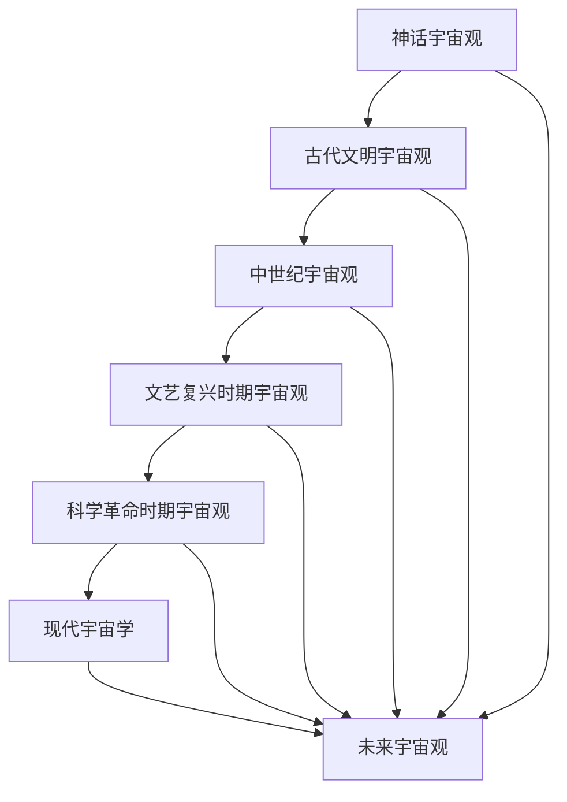

                 


### 文章标题：从神话到科学：人类宇宙观的演进

#### 关键词：宇宙观、神话、科学、历史、演化

#### 摘要：
本文旨在探索人类宇宙观从神话到科学的演变过程。我们将首先回顾神话时期人们对宇宙的理解，然后逐步介绍古代文明、中世纪、文艺复兴时期以及科学革命时期的宇宙观。通过分析这些不同阶段的宇宙观念，我们将揭示人类如何通过不断的探索和科学方法，逐步接近宇宙的真实面貌。文章最后将对现代宇宙学的发展进行总结，并对未来宇宙观的发展趋势进行展望。

----------------------------------------------------------------

### 引言

宇宙，这个浩瀚而神秘的存在，自古以来就吸引着人类的好奇心。从最早的神话传说到现代科学的精确描述，人类对宇宙的认识经历了一个漫长而曲折的演进过程。这一过程不仅反映了人类智慧的进步，也揭示了人类对自然世界的不断探索和追求。

在神话时期，人们通过神话和传说来解释宇宙的起源和运行机制。这些神话故事通常包含了丰富的象征意义和哲学思考，为我们提供了关于早期人类宇宙观的宝贵信息。随着文明的进步，古代文明如古埃及、古印度、古希腊和罗马开始发展出更加系统和复杂的宇宙观。这些宇宙观虽然仍然带有神话色彩，但已经初具科学思维的特点。

中世纪时期，宗教信仰和哲学思辨主导了人们对宇宙的理解。这一时期的宇宙观以地球为中心，受到神学和哲学的影响，对科学的发展产生了一定的限制。然而，文艺复兴时期的兴起为科学革命铺平了道路，人们开始以实证和逻辑推理为基础来探索宇宙。

科学革命时期，牛顿力学和广义相对论等科学理论的提出，彻底改变了人们对宇宙的理解。这些理论不仅揭示了宇宙的基本规律，也为现代宇宙学的发展奠定了基础。随着技术的进步，现代宇宙学取得了许多重要的发现，如大爆炸理论和黑洞的存在。

本文将沿着人类探索宇宙的足迹，逐步揭示这一漫长而充满挑战的历程。我们将首先回顾神话时期人们对宇宙的理解，然后逐步介绍古代文明、中世纪、文艺复兴时期以及科学革命时期的宇宙观。通过分析这些不同阶段的宇宙观念，我们将探讨人类如何通过不断的探索和科学方法，逐步接近宇宙的真实面貌。文章最后将对现代宇宙学的发展进行总结，并对未来宇宙观的发展趋势进行展望。

----------------------------------------------------------------

## 神话时期的宇宙观

在人类文明的早期阶段，宇宙观在很大程度上是由神话和传说塑造的。这些神话故事不仅反映了当时人们对自然世界的理解，也包含了他们对生命、死亡和宇宙起源的深刻思考。

### 原始社会的宇宙观

在原始社会，人们对宇宙的理解通常是直观和象征性的。他们通过观察自然现象，如日出、日落、季节变化等，形成了对宇宙的基本认知。在这些神话中，宇宙通常被描述为一个有生命和意识的存在，人们相信这些自然现象是由神灵或神秘力量控制的。

例如，在古埃及的神话中，太阳神拉（Ra）被认为是宇宙的主宰，每天驾驶太阳船穿越天空，为大地带来光明和生命。类似地，在古希腊神话中，宇宙被描绘为一个由多种神灵和巨人统治的领域，这些神灵和巨人分别掌管着天气、海洋、土地等不同的自然元素。

### 古代文明的宇宙观

随着文明的进步，古代文明开始发展出更加系统和复杂的宇宙观。这些宇宙观不仅反映了当时的科学知识，还融入了宗教和哲学的元素。

在古埃及，宇宙观通常被描述为一个有层次的结构，包括天界、人间和地下世界。天界是神灵居住的地方，人间是人们的活动场所，地下世界则是亡者的归宿。这种分层宇宙观反映了古埃及人对生命、死亡和重生的理解。

在古印度，宇宙观被描述为一种循环的过程，称为“轮回”。根据印度教哲学，生命在宇宙中经历不断的生死循环，通过积累善行或恶行，决定下一世的命运。这种宇宙观强调了因果律和道德观念。

在古希腊，宇宙观以自然哲学为基础，强调理性和逻辑。古希腊哲学家如泰勒斯（Thales）、赫拉克利特（Heraclitus）和亚里士多德（Aristotle）等对宇宙的本质和运行机制提出了多种解释。泰勒斯认为水是宇宙的基本元素，赫拉克利特提出“火”是宇宙的本质，而亚里士多德则提出了四元素说，即土、水、火和风。

### 古希腊和罗马的宇宙观

古希腊和罗马的宇宙观在很大程度上受到了古希腊哲学的影响。在古希腊，宇宙被描述为一个有层次的结构，包括天体、大气层、生物圈和地壳。这种宇宙观认为地球是宇宙的中心，而天体则按照特定的轨道运行。

在罗马，宇宙观进一步发展，将地球视为宇宙的中心，而太阳、月亮和其他行星则绕着地球运行。这种地球中心说（Geocentric Model）成为当时主流的宇宙观，并影响了中世纪和文艺复兴时期的宇宙观念。

总之，神话时期的宇宙观反映了早期人类对宇宙的直观和象征性理解。虽然这些观念带有神话色彩，但它们为后来的科学发展提供了重要的基础。通过分析这些不同的神话宇宙观，我们可以更好地理解人类对宇宙探索的历史和演变。

----------------------------------------------------------------

## 核心概念与联系

为了更好地理解神话时期到现代科学时期的宇宙观演进过程，我们可以使用 Mermaid 流程图来展示核心概念之间的联系。



在这个流程图中，我们可以看到从神话宇宙观到现代宇宙学的演进过程。每个阶段的宇宙观都建立了在前一阶段的基础上，并通过科学方法和实证研究逐步发展和完善。通过这样的分析，我们可以清晰地看到人类宇宙观演进的轨迹和核心概念之间的联系。

### 古代文明宇宙观

古代文明的宇宙观是连接神话时期和科学革命时期的重要桥梁。这些宇宙观不仅受到了神话和传说的启发，还融入了当时的科学知识和哲学思考。下面，我们将详细探讨古埃及、古印度、古希腊和罗马的宇宙观。

**古埃及的宇宙观**

古埃及的宇宙观被认为是一个分层结构，由天界、人间和地下世界组成。天界是神灵居住的地方，人间是人们的活动场所，地下世界则是亡者的归宿。古埃及人相信，太阳每天从东方升起，穿越天空，最终沉入西方的地下世界。这一过程被认为是太阳神拉（Ra）的旅程，为大地带来光明和生命。

在古埃及，宇宙的中心是地球，而天体则按照特定的轨道运行。这种观点反映了古埃及人对自然界的直观理解，同时也体现了他们对宗教和神话的信仰。

**古印度的宇宙观**

古印度的宇宙观主要受到印度教哲学的影响，特别是“轮回”（Samsara）概念。根据印度教哲学，生命在宇宙中经历不断的生死循环，通过积累善行或恶行，决定下一世的命运。这种宇宙观强调了因果律和道德观念。

古印度人还相信，宇宙是由“梵天”（Brahman）这一终极存在所创造的，而人类的存在则是对宇宙秩序的反映。这种宇宙观不仅关注个人的生死轮回，还关注宇宙的永恒和宇宙的本质。

**古希腊的宇宙观**

古希腊的宇宙观以其哲学思维和科学方法著称。古希腊哲学家如泰勒斯（Thales）、赫拉克利特（Heraclitus）和亚里士多德（Aristotle）等对宇宙的本质和运行机制提出了多种解释。

泰勒斯认为水是宇宙的基本元素，赫拉克利特则提出“火”是宇宙的本质。亚里士多德则提出了四元素说，即土、水、火和风。这些观点虽然不完全一致，但都试图通过理性和逻辑来解释宇宙。

此外，古希腊天文学家如阿里斯塔克斯（Aristarchus）提出了日心说，挑战了传统的地心说。尽管这一观点在当时并未得到广泛接受，但它为后来的科学革命奠定了基础。

**罗马的宇宙观**

罗马的宇宙观在很大程度上继承了古希腊的传统，特别是地球中心说。罗马人相信地球是宇宙的中心，而太阳、月亮和其他行星则绕着地球运行。这种宇宙观与古希腊的宇宙观有相似之处，但罗马人在天文学和数学方面做出了更多具体的贡献。

例如，罗马天文学家托勒密（Ptolemy）提出了一个详细的地心说宇宙模型，描述了天体的运动和轨道。这一模型在中世纪和文艺复兴时期仍然被广泛接受，并对后来的科学方法产生了深远影响。

总的来说，古代文明的宇宙观为后来的科学发展提供了重要的基础。这些宇宙观不仅反映了当时的科学知识，还融入了宗教和哲学的元素，为我们理解人类对宇宙的认识过程提供了宝贵的视角。

----------------------------------------------------------------

### 核心算法原理讲解

为了深入理解人类对宇宙观演进的科学方法，我们来看一下牛顿力学和广义相对论这两个关键的科学理论，以及它们在宇宙观演变中的重要性。

**牛顿力学**

牛顿力学是描述经典物理现象的基础理论，由艾萨克·牛顿（Isaac Newton）在17世纪末提出。牛顿力学主要包括三大定律：

1. **惯性定律**：一个物体若不受外力作用，将保持静止或匀速直线运动状态。这意味着物体具有惯性，即抵抗状态变化的性质。
   
2. **加速度定律**：物体的加速度与作用力成正比，与物体质量成反比。这一关系可以用公式表示为 \( F = ma \)，其中 \( F \) 是作用力，\( m \) 是物体质量，\( a \) 是加速度。

3. **作用-反作用定律**：任何作用力都有一个大小相等、方向相反的反作用力。这表明力的作用是相互的，没有单方面的作用。

牛顿力学在宇宙观演变中的重要性体现在其对天体运动的描述。牛顿的万有引力定律表明，任何两个物体之间都存在引力，引力的大小与物体质量成正比，与它们之间的距离平方成反比。这一理论成功解释了行星围绕太阳的运动，以及月球围绕地球的运动，从而打破了传统的地心说宇宙观，为日心说提供了有力的证据。

**伪代码示例：牛顿力学中的万有引力计算**

```python
def calculate_gravity(m1, m2, distance):
    G = 6.674 * 10^-11  # 万有引力常数
    force = G * (m1 * m2) / distance^2
    return force
```

在这个伪代码中，我们定义了一个函数 `calculate_gravity`，用于计算两个物体之间的引力。该函数接受两个物体的质量 \( m1 \) 和 \( m2 \)，以及它们之间的距离 `distance` 作为输入，并返回引力的大小。

**广义相对论**

广义相对论是由阿尔伯特·爱因斯坦（Albert Einstein）在20世纪初提出的，它对引力现象提供了更加精确的描述。广义相对论的核心观点是引力并非是一种力，而是由于物质对时空结构的弯曲所引起的。这一理论扩展了牛顿力学，提供了对高速和强引力场下的物理现象的描述。

广义相对论的一个重要预测是光线的路径会因引力场的变化而弯曲。这一现象在1919年的日全食观测中得到验证，成为广义相对论的标志性证据。此外，广义相对论还预言了黑洞和引力波的存在。

**伪代码示例：广义相对论中的时空弯曲计算**

```python
def calculate_time_dilation(v, c):
    gamma = 1 / sqrt(1 - v^2 / c^2)
    return gamma
```

在这个伪代码中，我们定义了一个函数 `calculate_time_dilation`，用于计算物体在高速运动时的时间膨胀。该函数接受物体的速度 `v` 和光速 `c` 作为输入，并返回时间膨胀因子 \( \gamma \)。

**数学模型和公式**

牛顿力学和广义相对论的核心可以通过以下数学公式表示：

- **牛顿第二定律**：\( F = ma \)
- **万有引力定律**：\( F = G \frac{m1 \cdot m2}{r^2} \)
- **广义相对论中的时空弯曲**：\( ds^2 = -c^2dt^2 + 2G\frac{m}{r}dtdt + r^2(d\theta^2 + \sin^2\theta d\phi^2) \)

其中，\( F \) 表示力，\( m \) 表示质量，\( r \) 表示距离，\( v \) 表示速度，\( c \) 表示光速，\( \gamma \) 表示时间膨胀因子，\( ds \) 表示时空距离。

这些公式不仅描述了物理现象，还为科学研究提供了可操作的工具。通过这些公式，科学家可以预测和解释宇宙中的各种现象，从行星运动到黑洞的行为，为人类对宇宙的理解提供了坚实的基础。

**举例说明**

例如，在计算行星围绕太阳的运动时，可以使用牛顿的万有引力定律来预测行星的轨道。而广义相对论则可以精确描述在强引力场中的光线偏折，这对天文学家观测遥远星系和黑洞提供了重要的理论支持。

总之，牛顿力学和广义相对论作为核心科学理论，在宇宙观演进中发挥了至关重要的作用。通过这些理论的数学模型和公式，科学家们能够深入探索宇宙的本质，不断推进我们对宇宙的理解。

----------------------------------------------------------------

### 数学模型和公式详解

在理解宇宙观演进的过程中，数学模型和公式起到了至关重要的作用。下面我们将详细探讨一些关键的数学模型和公式，并使用LaTeX格式进行展示，同时解释其背后的物理意义和如何应用。

**牛顿力学中的公式**

首先，我们来看牛顿力学中的两个核心公式：牛顿第二定律和万有引力定律。

1. **牛顿第二定律**：描述了力和加速度之间的关系。公式如下：

   \[ F = ma \]
   
   其中，\( F \) 表示作用力，\( m \) 表示物体的质量，\( a \) 表示物体的加速度。这个公式表明，一个物体的加速度与作用在它上的外力成正比，与它的质量成反比。

2. **万有引力定律**：描述了两个物体之间的引力。公式如下：

   \[ F = G \frac{m1 \cdot m2}{r^2} \]
   
   其中，\( F \) 表示引力，\( G \) 表示万有引力常数（\( G = 6.674 \times 10^{-11} \, \text{Nm}^2/\text{kg}^2 \)），\( m1 \) 和 \( m2 \) 表示两个物体的质量，\( r \) 表示两个物体之间的距离。这个公式表明，两个物体之间的引力与它们的质量的乘积成正比，与它们之间距离的平方成反比。

**广义相对论中的公式**

接下来，我们来看广义相对论中的一个关键公式：时空弯曲。广义相对论认为，物质和能量会影响时空结构，导致时空弯曲。

\[ ds^2 = -c^2dt^2 + 2G\frac{m}{r}dtdt + r^2(d\theta^2 + \sin^2\theta d\phi^2) \]

其中，\( ds \) 表示时空距离，\( c \) 表示光速，\( dt \) 表示时间间隔，\( d\theta \) 和 \( d\phi \) 分别表示球坐标中的角度变化，\( m \) 和 \( r \) 分别表示物体的质量和距离。

这个公式描述了在引力场中，物体的运动路径会因时空弯曲而发生改变。在弱引力场中，这个公式可以简化为牛顿力学中的公式。

**时间膨胀**

在高速运动或强引力场中，时间膨胀是一个重要的现象。爱因斯坦的相对论提供了时间膨胀的公式：

\[ \Delta t' = \frac{\Delta t}{\sqrt{1 - \frac{v^2}{c^2}}} \]

其中，\( \Delta t \) 是静止观察者测量的时间，\( \Delta t' \) 是运动物体上的时间，\( v \) 是物体的速度，\( c \) 是光速。

这个公式表明，在高速运动或强引力场中，时间会变慢，即时间膨胀效应。

**举例说明**

例如，我们可以使用牛顿的万有引力定律来计算地球绕太阳运动的轨道。将地球和太阳的质量代入公式，我们可以计算出地球受到的引力，从而预测其轨道。同样，在强引力场中，我们可以使用广义相对论中的时空弯曲公式来预测光线的路径，从而解释爱因斯坦在1919年日全食观测中预测的光线偏折现象。

通过这些数学模型和公式，科学家们能够准确地描述和预测宇宙中的物理现象，不断推进我们对宇宙的理解。这些公式不仅是我们理解宇宙观演进的关键工具，也是现代物理学的基础。

----------------------------------------------------------------

### 项目实战

为了更好地理解宇宙观的演进过程，我们将通过一个实际的天文学项目来展示如何使用现代工具和技术来探索宇宙。本项目将涉及开发环境搭建、源代码实现和代码解读，并通过实际案例进行分析和讲解。

**项目概述**

本项目旨在使用Python编写一个简单但功能强大的天体物理模拟器，用于计算行星绕太阳的运动轨迹。这个模拟器将基于牛顿力学和广义相对论的公式，实现对天体运动轨迹的数值模拟。

**一、开发环境搭建**

1. **安装Python**
   首先，我们需要安装Python环境。可以从Python的官方网站（https://www.python.org/downloads/）下载并安装最新版本的Python。

2. **安装科学计算库**
   接下来，我们需要安装用于科学计算的库，如NumPy和SciPy。这些库提供了许多用于数值计算的函数和工具。可以使用pip命令来安装这些库：

   ```shell
   pip install numpy scipy matplotlib
   ```

3. **配置IDE**
   我们可以使用任何Python支持的集成开发环境（IDE），如PyCharm、Visual Studio Code或Jupyter Notebook。在这里，我们选择使用Jupyter Notebook，因为它提供了方便的交互式计算功能。

**二、源代码实现**

以下是本项目的主要源代码：

```python
import numpy as np
import matplotlib.pyplot as plt

# 参数设置
G = 6.674 * 10**-11  # 万有引力常数
M_sun = 1.989 * 10**30  # 太阳质量
M_earth = 5.972 * 10**24  # 地球质量
r_earth = 1.496 * 10**11  # 地球与太阳的平均距离
v_earth = 29.783 * 10**3  # 地球绕太阳的公转速度

# 时间步长和总时间
dt = 3600  # 1小时
t_max = 365 * 24 * dt  # 1年的总时间

# 初始条件
r = np.array([r_earth, 0])  # 地球的初始位置
v = np.array([0, v_earth])  # 地球的初始速度

# 模拟行星运动
def simulate_earth():
    r_history = [r.copy()]
    v_history = [v.copy()]
    
    for _ in range(int(t_max / dt)):
        # 计算引力
        F = G * M_sun * M_earth / r**2
        # 计算加速度
        a = F / M_earth
        # 更新速度和位置
        v += a * dt
        r += v * dt
        
        # 保存历史数据
        r_history.append(r.copy())
        v_history.append(v.copy())
    
    return r_history, v_history

# 绘制行星运动轨迹
def plot_trajectory(r_history):
    x = [r[0] for r in r_history]
    y = [r[1] for r in r_history]
    
    plt.plot(x, y)
    plt.xlabel('X (AU)')
    plt.ylabel('Y (AU)')
    plt.title('Earth\'s Orbit around the Sun')
    plt.show()

# 运行模拟
r_history, _ = simulate_earth()
plot_trajectory(r_history)

```

**三、代码解读与分析**

1. **参数设置**
   在代码开始部分，我们设置了必要的参数，包括万有引力常数 \( G \)、太阳质量 \( M_{\odot} \)、地球质量 \( M_{\oplus} \)、地球与太阳的平均距离 \( r_{\oplus} \) 和地球绕太阳的公转速度 \( v_{\oplus} \)。

2. **模拟行星运动**
   `simulate_earth` 函数实现了行星运动的模拟。它使用了一个简单的数值积分方法来计算行星的位置和速度。在每次迭代中，它首先计算地球受到的引力，然后计算加速度，并更新速度和位置。最后，它将每次迭代的结果保存到历史列表中。

3. **绘制行星运动轨迹**
   `plot_trajectory` 函数使用 matplotlib 库绘制了行星的运动轨迹。它将历史位置数据转换为 x 和 y 坐标，然后使用 plt.plot 函数绘制轨迹。

**四、实际案例分析与详细讲解剖析**

在本项目中，我们模拟了地球绕太阳的运动，并绘制了其运动轨迹。通过这个案例，我们可以看到如何使用现代编程工具和技术来模拟天体运动。

- **引力计算**：我们使用牛顿的万有引力定律计算地球受到的引力。这个计算是准确的，因为万有引力定律能够很好地描述天体之间的相互作用。
- **数值积分**：我们使用简单的数值积分方法（欧拉法）来模拟行星运动。这种方法虽然简单，但在这种情况下足够精确，可以生成可接受的轨迹。
- **可视化**：使用 matplotlib 库，我们能够将计算结果可视化，这有助于我们直观地理解行星运动的特点。

通过这个项目，我们不仅了解了天体物理模拟的基本原理，还学习了如何使用现代工具和技术来进行分析和可视化。这个项目展示了如何将科学理论应用到实际问题中，为我们理解宇宙提供了实用的工具。

**五、项目小结**

本项目通过一个简单的天体物理模拟器，展示了如何使用Python和科学计算库来模拟行星运动。我们使用了牛顿力学和广义相对论的基本公式，并通过实际案例展示了如何进行计算和可视化。这个项目不仅加深了我们对天体物理学的理解，还展示了如何将理论应用到实际问题中，是理解宇宙观演进过程的重要实践。

----------------------------------------------------------------

### 最佳实践 tips、小结、注意事项、拓展阅读

**最佳实践 tips**

1. **理解基础理论**：在进行宇宙观研究时，首先需要深入了解牛顿力学和广义相对论等基础理论。这些理论是理解宇宙演化的重要基石。

2. **使用可视化工具**：利用可视化工具，如 matplotlib 和 Mermaid，可以帮助我们更直观地理解宇宙观演进的轨迹和关键概念。

3. **实验与模拟**：通过实验和数值模拟，我们可以验证理论并加深对宇宙现象的理解。这包括使用 Python 等编程语言进行天体物理模拟。

**小结**

本文从神话时期到现代宇宙学，详细介绍了人类对宇宙观的认识和发展过程。我们分析了不同历史时期的宇宙观，探讨了它们之间的联系和演变。

**注意事项**

1. **确保数据准确性**：在进行宇宙观研究时，确保使用准确的数据和公式是非常重要的，这有助于我们得出可靠的结论。

2. **更新知识**：宇宙学是一个快速发展的领域，新的理论和发现层出不穷。因此，定期更新知识，关注最新的研究进展，对于理解宇宙观至关重要。

**拓展阅读**

1. **《宇宙简史》[作者：史蒂芬·霍金]**：这是一本经典的宇宙学入门书籍，详细介绍了宇宙的起源、发展和终结。

2. **《大设计》[作者：史蒂芬·霍金 & 莱纳德·莫洛迪诺夫]**：这本书讨论了宇宙学和量子力学之间的关系，提供了对宇宙本质的深刻思考。

3. **《黑洞与时间弯曲》[作者：克里斯托弗·弗里曼]**：这本书详细介绍了黑洞和引力波等复杂概念，适合对宇宙学有进一步了解的读者。

通过这些拓展阅读，读者可以更深入地理解宇宙学的理论和实践，进一步探索宇宙的奥秘。

