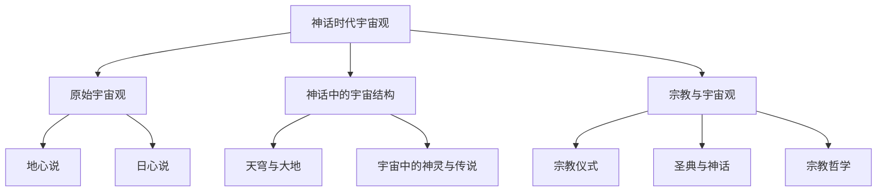
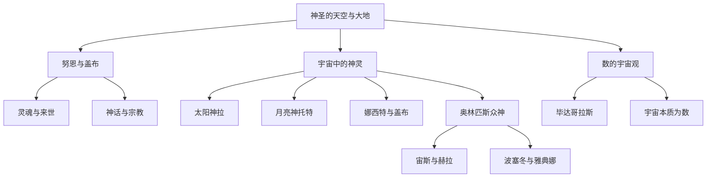
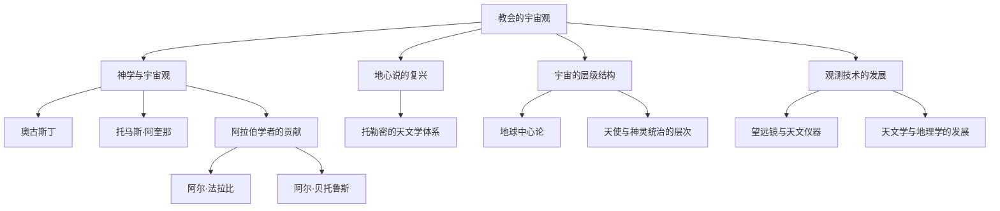
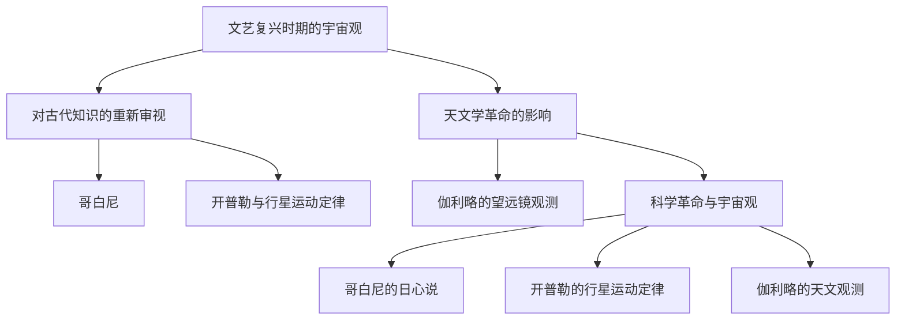
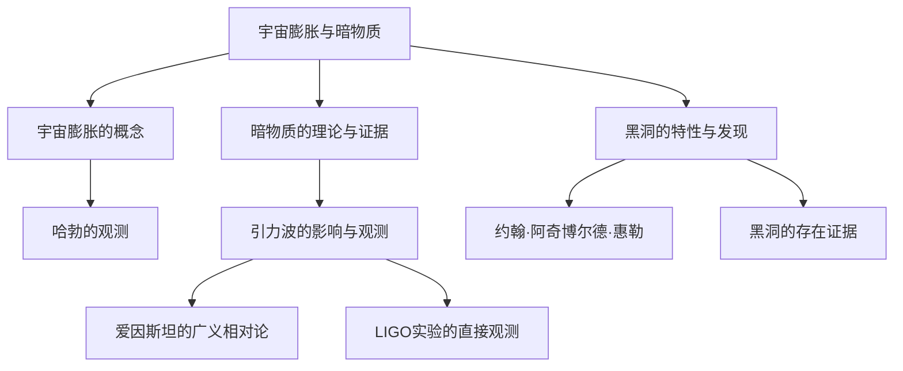
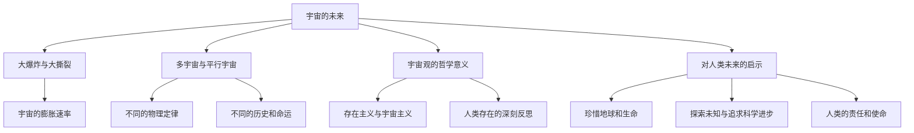

                 

### 引言

#### 宇宙观的定义与意义

宇宙观是指人类对宇宙的认识和理解。它涵盖了从古代的神话传说到现代科学理论的发展历程。宇宙观不仅是天文学、物理学等科学领域的重要研究方向，也是哲学、宗教、文化等多个领域的重要研究对象。宇宙观的形成与发展，反映了人类认识自然、探索宇宙的不断进步，也深刻影响了人类的思想观念和行为方式。

#### 宇宙观的演化历程

宇宙观的演化历程可以分为几个主要阶段：神话时代、古代文明时代、中世纪时代、文艺复兴与科学革命时代、现代宇宙观时代。每个阶段的宇宙观都有其独特的特点，反映了对宇宙认识的深度和广度。从对神话和宗教的依赖，到对自然法则和科学理论的追求，宇宙观的发展不仅推动了科学技术的进步，也促进了人类文明的繁荣。

#### 本书的结构安排

本书将从神话时代到现代宇宙观，系统性地梳理宇宙观的演化历程。具体章节安排如下：

- 第1章：引言，介绍宇宙观的定义与意义，以及本书的结构安排。
- 第2章：神话时代的宇宙观，探讨原始宇宙观和神话中的宇宙结构。
- 第3章：古代文明的宇宙观，分析埃及和希腊的宇宙观。
- 第4章：中世纪宇宙观，介绍教会的宇宙观和中世纪科技的宇宙观。
- 第5章：文艺复兴与科学革命，探讨文艺复兴时期的宇宙观和科学革命对宇宙观的影响。
- 第6章：现代宇宙观，介绍宇宙膨胀、暗物质、黑洞与引力波等现代宇宙观的核心内容。
- 第7章：未来宇宙观，探讨宇宙的未来、哲学思考以及对人类未来的启示。

通过这些章节的梳理，我们将能够更深入地理解宇宙观的发展历程，以及宇宙观对人类文明的影响。### 第1章 引言

#### 宇宙观的定义与意义

宇宙观，即人类对宇宙的认识和理解，是人类文明发展过程中不可或缺的一部分。宇宙观不仅仅局限于科学领域，它还涵盖了哲学、宗教、文化等多个领域。宇宙观的形成与演变，是人类不断探索自然、追求真理的结果。理解宇宙观，不仅有助于我们了解人类文明的历史，还能帮助我们更好地把握当今世界的科学和技术发展。

首先，从科学的角度来看，宇宙观是关于宇宙起源、结构、演化以及宇宙中一切物质和现象的理论和假设。天文学、物理学、宇宙学等学科的发展，为宇宙观提供了大量的实证数据和理论支持。例如，哥白尼的日心说打破了古代的地心说，开普勒的行星运动定律进一步揭示了行星运动的规律，爱因斯坦的相对论则为我们提供了理解宇宙的全新视角。

其次，从哲学的角度来看，宇宙观涉及到人类对存在、真理、价值等基本问题的探讨。哲学上的宇宙观，往往超越了对自然现象的描述，更多地关注宇宙的本质、人类在宇宙中的位置以及人类存在的意义。例如，古希腊哲学家亚里士多德提出的宇宙论，强调宇宙是一个有序的整体，万物都有其固定的位置和功能。

再次，从宗教的角度来看，宇宙观是宗教信仰体系的重要组成部分。不同的宗教有不同的宇宙观，它们往往通过神话、传说、圣典等形式来阐述宇宙的起源、结构和意义。例如，基督教、伊斯兰教和印度教等宗教，都有自己独特的宇宙观，这些宇宙观不仅影响了信徒的信仰和行为，也对他们的道德观念和社会价值观产生了深远影响。

总之，宇宙观不仅是科学、哲学和宗教的重要研究对象，也是人类文化的重要组成部分。它不仅反映了人类对宇宙的认知程度，也体现了人类对自身和世界的理解。因此，研究宇宙观的发展历程，对于我们理解人类文明的历史、现状和未来，都具有重要的意义。

#### 宇宙观的演化历程

宇宙观的演化历程是一个复杂而漫长的过程，它经历了从神话时代到现代科学的转变。在不同的历史阶段，人类的宇宙观受到了不同的文化、科技和哲学思想的影响，从而呈现出不同的特点和形态。

1. **神话时代的宇宙观**

在神话时代，人类的宇宙观主要依赖于神话和宗教。人们通过神话故事来解释自然现象，比如日月的运行、季节的变化、自然灾害等。在这些神话故事中，宇宙常常被描绘成一个层次分明的结构，有天堂、地球和地狱等不同层次的世界。

- **地心说**：最早的一种宇宙观，认为地球是宇宙的中心，所有的天体都围绕着地球运行。这种观念最早可以追溯到古希腊哲学家亚里士多德，后来被基督教教会所接受，并成为中世纪的主流宇宙观。
- **日心说**：随着观测技术的进步，人们开始质疑地心说，提出了日心说。这一理论认为太阳是宇宙的中心，地球和其他行星围绕太阳运行。哥白尼是这一理论的提出者，他的日心说在16世纪引起了巨大的科学革命。

2. **古代文明的宇宙观**

在古代文明时期，如古埃及、古印度、古希腊等，人们对宇宙的认识逐渐从神话走向理性。这些古代文明的宇宙观，不仅反映了当时的科学水平，也体现了哲学和宗教思想。

- **古埃及的宇宙观**：古埃及人认为宇宙是由神灵创造的，宇宙的结构是层次分明的，包括天空、大地和地下世界。他们通过天文观测和祭祀活动来理解宇宙。
- **古希腊的宇宙观**：古希腊哲学家如泰勒斯、赫拉克利特、亚里士多德等，提出了多种宇宙观。其中，亚里士多德的宇宙论认为宇宙是静止和永恒的，地球是宇宙的中心。

3. **中世纪的宇宙观**

在中世纪，宇宙观主要受到基督教神学的影响。教会的宇宙观认为地球是上帝创造的，宇宙的结构是神圣的，符合《圣经》的描述。这一时期，地心说重新成为主流宇宙观，并且得到了进一步的发展。

4. **文艺复兴与科学革命**

文艺复兴时期，人们开始重新审视古代的知识和思想，科学革命也随之展开。哥白尼的日心说、开普勒的行星运动定律、伽利略的望远镜观测等，都极大地推动了宇宙观的发展。

5. **现代宇宙观**

随着现代科学的进步，我们对宇宙的认识逐渐深入。现代宇宙观包括宇宙膨胀理论、暗物质和暗能量理论、黑洞和引力波等。这些理论不仅解释了宇宙的起源和演化，还为我们揭示了宇宙的奥秘和未知。

#### 本书的结构安排

本书将从神话时代到现代宇宙观，系统性地梳理宇宙观的演化历程。具体章节安排如下：

- **第1章 引言**：介绍宇宙观的定义与意义，以及本书的结构安排。
- **第2章 神话时代的宇宙观**：探讨原始宇宙观和神话中的宇宙结构。
- **第3章 古代文明的宇宙观**：分析埃及和希腊的宇宙观。
- **第4章 中世纪宇宙观**：介绍教会的宇宙观和中世纪科技的宇宙观。
- **第5章 文艺复兴与科学革命**：探讨文艺复兴时期的宇宙观和科学革命对宇宙观的影响。
- **第6章 现代宇宙观**：介绍宇宙膨胀、暗物质、黑洞与引力波等现代宇宙观的核心内容。
- **第7章 未来宇宙观**：探讨宇宙的未来、哲学思考以及对人类未来的启示。

通过这些章节的梳理，我们将能够更深入地理解宇宙观的发展历程，以及宇宙观对人类文明的影响。

### 第2章 神话时代的宇宙观

#### 原始宇宙观

在神话时代的早期，人类的宇宙观主要源于对自然现象的直观感受和解释。当时的人类还没有形成系统的科学理论，因此他们的宇宙观很大程度上是基于神话和宗教信仰。在这个时期，宇宙观的基本特点是直观性和神秘性。人们通过神话故事来解释各种自然现象，如日月的运行、季节的变化、自然灾害等。

- **地心说**：地心说是最早的一种宇宙观，认为地球是宇宙的中心，所有的天体都围绕着地球运行。这种观念最早可以追溯到古希腊哲学家亚里士多德，他认为地球是静止不动的，而天体则按照特定的轨道运行。地心说在古代文明中广泛传播，成为中世纪主流的宇宙观。

- **日心说**：随着观测技术的进步，人们开始质疑地心说，提出了日心说。这一理论认为太阳是宇宙的中心，地球和其他行星围绕太阳运行。哥白尼是这一理论的提出者，他的日心说在16世纪引起了巨大的科学革命。然而，在神话时代，人们还没有完全接受日心说，地心说仍然占主导地位。

#### 神话中的宇宙结构

在神话中，宇宙的结构往往被描绘成一个层次分明的系统。不同文明有不同的宇宙结构观念，但都试图通过神话故事来解释宇宙的起源、结构和运行规律。

- **天穹与大地**：许多文明都认为宇宙分为天和地两个主要部分。天穹是神圣的，是神灵居住的地方；大地则是人类的居住地，是神灵创造的。例如，古埃及神话中，天穹由盖布（天空之神）和努特（大地之神）所创造，他们分别代表了天空和大地。

- **宇宙中的神灵与传说**：神话中的宇宙观不仅包括对宇宙结构的描述，还包括对宇宙中神灵的崇拜和传说。不同文明有不同的神灵体系，这些神灵通常与宇宙的创造、维护和毁灭有关。例如，在希腊神话中，宙斯是天空和天空之主，他统治着奥林匹斯山，掌管天气和雷电。

- **创世神话**：创世神话是神话时代宇宙观的重要组成部分。许多文明都有自己独特的创世神话，用以解释宇宙的起源。例如，古埃及的创世神话中，盖布和努特结合创造了天地，随后又创造了人类和其他生物。

#### 宗教与宇宙观

在神话时代，宗教与宇宙观密切相关。宗教通过神话和信仰体系来解释宇宙的起源和运行，同时也在一定程度上塑造了人们的宇宙观。

- **宗教仪式**：在许多宗教中，宇宙观是通过宗教仪式来传达和巩固的。例如，古埃及的宗教仪式中，祭司们通过祭祀活动来祈求神灵的保护和赐福，这些活动反映了古埃及人对其宇宙观的理解。

- **圣典与神话**：许多宗教都有圣典，这些圣典包含了大量的神话故事和宇宙观。例如，《圣经》中的创世纪部分，详细描述了上帝创造宇宙的过程，这些描述不仅影响了基督教的宇宙观，也对其他宗教产生了影响。

- **宗教哲学**：在神话时代，宗教哲学是宇宙观的重要组成部分。许多宗教哲学试图通过探讨宇宙的本质和人类在宇宙中的位置，来回答关于存在、真理和意义等基本问题。例如，印度教哲学中的梵，认为宇宙是一个统一的整体，万物都是梵的不同表现形式。

总的来说，神话时代的宇宙观是直观、神秘且富有宗教色彩的。人们通过神话故事和宗教信仰来解释宇宙的起源、结构和运行规律，这些观念不仅影响了当时的科学和技术发展，也对人类的思想观念和文化产生了深远的影响。

#### Mermaid 流程图

### 第3章 古代文明的宇宙观

#### 埃及的宇宙观

古埃及的宇宙观是古代文明中最为丰富和系统化的宇宙观之一。古埃及人认为宇宙由多个层次组成，每个层次都有其特定的功能和象征意义。

- **神圣的天空与大地**：古埃及神话中，天空被称为“努恩”，大地被称为“盖布”。努恩和盖布是创世神奥西里斯和伊西斯的配偶，他们共同创造了宇宙。努恩象征着秩序和天空的无限性，盖布则象征着稳定和大地的基础。古埃及人相信天空和大地是相互联系的，天地的结合形成了宇宙的秩序。

- **宇宙中的神灵与神话**：古埃及的神话体系中，有许多与宇宙相关的神灵。例如，太阳神拉（Ra）是古埃及最重要的神灵之一，他每天乘坐太阳船穿越天空，象征着太阳的运行和宇宙的秩序。月亮神托特（Tot）则代表着月亮和夜晚的力量。此外，还有天空之女娜西特（Nuit）和地母盖布（Geb）等，他们都在古埃及的宇宙观中扮演着重要的角色。

- **灵魂与来世**：古埃及人相信灵魂在死后会进入另一个世界，这个世界的结构也反映了他们的宇宙观。来世被称为“阴间”，它由多个层次组成，每个层次都有不同的神灵和考验。古埃及人的宇宙观中，灵魂的轮回和来世的概念占据了重要地位。

#### 希腊的宇宙观

古希腊的宇宙观不仅丰富多样，而且对后来的西方哲学和科学产生了深远的影响。古希腊哲学家用理性和逻辑思考来探索宇宙的本质和运行规律。

- **哲学家的宇宙观**：古希腊哲学家如泰勒斯、赫拉克利特、巴门尼德、亚里士多德等，提出了多种宇宙观。泰勒斯认为水是万物的本源，赫拉克利特则提出了“火”是万物的本源，而巴门尼德则认为存在是唯一真实的，变动不居的世界只是我们的错觉。亚里士多德在《形而上学》中提出了他的宇宙观，认为宇宙是一个有序的整体，由多个层次组成，从地球到天体，每个层次都有其特定的功能和属性。

- **宙斯与奥林匹斯众神**：在希腊神话中，宙斯是天空和天空之主，他是奥林匹斯众神的首领。奥林匹斯众神包括宙斯的兄弟姐妹，如赫拉、波塞冬、雅典娜等，每个神灵都代表着宇宙中的一个方面。希腊神话中的宇宙观，不仅仅是对神灵的崇拜，还反映了古希腊人对宇宙运行规律的理解。

- **数的宇宙观**：毕达哥拉斯是古希腊数学家和哲学家，他提出了数的宇宙观，认为宇宙的本质是数，一切物质都是由数的关系构成的。这一观念对后来的数学和科学产生了重要影响。

#### 古代宇宙观的核心概念与联系

为了更好地理解古代宇宙观，我们可以通过以下Mermaid流程图来展示其核心概念之间的关系：

这个流程图展示了古埃及和古希腊宇宙观中的核心概念及其相互关系。通过这些概念，我们可以看到古代文明如何通过神话、哲学和宗教来解释宇宙的起源、结构和运行规律。

### 第4章 中世纪宇宙观

#### 教会的宇宙观

在中世纪，教会的宇宙观对欧洲的文化和思想产生了深远的影响。教会的宇宙观主要基于基督教神学，认为宇宙是上帝创造的，并按照上帝的意志运行。

- **神学与宇宙观**：中世纪的宇宙观深受基督教神学的影响。教父学者如奥古斯丁和托马斯·阿奎那，通过神学理论来解释宇宙的起源和结构。奥古斯丁认为宇宙是上帝的一次创造，而托马斯·阿奎那则通过自然法则和神学原理来阐述宇宙的运行。

- **地心说的复兴**：在中世纪，地心说重新得到了重视。教会的宇宙观认为地球是宇宙的中心，所有的天体都围绕地球运行。这种观念在教会中得到了广泛的认可，并影响了中世纪科学的发展。

- **宇宙的层级结构**：中世纪的宇宙观将宇宙分为多个层次，每个层次都有其特定的功能和属性。从地球到天堂，每个层次都是由不同的天使和神灵统治。这种层次结构反映了中世纪对宇宙秩序的理解。

#### 中世纪科技的宇宙观

中世纪不仅在宗教上有着强烈的宇宙观，还在科技上对宇宙进行了深入的研究。

- **观测技术的发展**：中世纪的天文学家通过改进望远镜和天文仪器，提高了对天体运动的观测精度。托勒密的天文学体系在中世纪得到了广泛应用，他的《天文学大成》是中世纪最重要的天文学著作。

- **地理学与天文学的发展**：中世纪的地理学和水文学对地球的形状和结构进行了深入研究。阿拉伯学者如阿尔·法拉比和阿尔·贝托鲁斯，对天文学和地理学做出了重要贡献。

#### Mermaid 流程图

这个流程图展示了中世纪宇宙观的核心概念及其相互关系。通过这个流程图，我们可以看到中世纪的宇宙观是如何在神学和科技的双重影响下形成和发展的。

### 第5章 文艺复兴与科学革命

#### 文艺复兴时期的宇宙观

文艺复兴时期是欧洲历史上一个重要的转折点，这一时期的宇宙观受到了对古代知识的重新审视和重视。

- **对古代知识的重新审视**：文艺复兴时期，人们开始重新研究古希腊和古罗马的哲学、科学和艺术。这些古代的知识被视为理解宇宙的重要途径。例如，哥白尼的《天体运行论》就是在对古代天文学的研究基础上提出的，它打破了传统的地心说，提出了日心说的理论。

- **天文学革命的影响**：文艺复兴时期的宇宙观受到了天文学革命的影响。哥白尼的日心说、开普勒的行星运动定律和伽利略的望远镜观测等，都极大地改变了人们对宇宙的认识。这些新发现挑战了中世纪的宇宙观，为现代宇宙观的发展奠定了基础。

#### 科学革命与宇宙观

科学革命是文艺复兴时期的一个重要组成部分，它对宇宙观产生了深远的影响。

- **哥白尼与日心说**：哥白尼是科学革命的先驱，他提出了日心说，认为太阳是宇宙的中心，地球和其他行星围绕太阳运行。这一理论打破了传统的地心说，成为现代宇宙观的重要基石。

- **开普勒与行星运动定律**：开普勒是继哥白尼之后的另一位重要天文学家，他提出了行星运动定律，进一步揭示了行星运动的规律。开普勒的定律不仅证实了哥白尼的日心说，还为后来的天体力学和宇宙学发展提供了重要依据。

- **伽利略的望远镜观测**：伽利略是科学革命的另一位重要人物，他通过望远镜观测到了月球表面、木星的卫星和太阳黑子等现象。这些观测结果不仅证实了哥白尼和开普勒的理论，还推动了天文学和宇宙学的发展。

#### Mermaid 流程图

这个流程图展示了文艺复兴时期宇宙观的核心概念及其相互关系。通过这个流程图，我们可以看到文艺复兴时期的宇宙观是如何受到古代知识、天文学革命和科学革命的影响，从而形成和发展起来的。

### 第6章 现代宇宙观

#### 宇宙膨胀与暗物质

现代宇宙观的核心之一是宇宙膨胀理论和暗物质理论。这两个理论为我们提供了对宇宙起源、结构和演化的深刻理解。

- **宇宙膨胀的概念**：宇宙膨胀理论认为，宇宙是从一个极小的奇点开始膨胀的。这一理论最早由勒梅特和勒特在20世纪20年代提出，后来通过哈勃的观测得到证实。哈勃发现，宇宙中的星系都在远离我们，这表明宇宙在膨胀。

- **暗物质的理论与证据**：暗物质是一种无法直接观测到的物质，它不发光、不吸收光，但通过引力作用影响宇宙的结构和演化。暗物质的存在最早由瑞士天文学家阿尔伯特·爱因斯坦提出，后来通过观测星系旋转曲线和宇宙背景辐射等证据得到证实。

#### 黑洞与引力波

黑洞和引力波是现代宇宙观中的另一个重要组成部分，它们为我们揭示了宇宙的极端现象和神秘之处。

- **黑洞的特性与发现**：黑洞是一种密度极高、引力极强的天体，它的引力强到连光都无法逃脱。黑洞的存在最早由约翰·阿奇博尔德·惠勒在20世纪60年代提出，通过观测和计算，科学家们发现了多个黑洞。

- **引力波的影响与观测**：引力波是宇宙中的一种波动，由大质量天体的加速运动产生。爱因斯坦在1916年的广义相对论中预言了引力波的存在，直到2015年，科学家们才通过LIGO实验首次直接观测到引力波。

#### Mermaid 流程图

这个流程图展示了现代宇宙观中的核心概念及其相互关系。通过这个流程图，我们可以看到宇宙膨胀、暗物质、黑洞和引力波是如何共同构建我们对宇宙的理解。

### 第7章 未来宇宙观

#### 宇宙的未来

对未来宇宙的探索是现代宇宙学的核心议题之一。科学家们基于现有的理论，提出了多种关于宇宙未来的假设。

- **大爆炸与大撕裂**：大爆炸理论认为宇宙起源于一个极小的奇点，并从此开始膨胀。未来宇宙的命运可能取决于宇宙的膨胀速率。如果宇宙的膨胀速度持续加快，最终可能导致“大撕裂”，宇宙将走向分裂和毁灭。如果膨胀速度减慢，宇宙可能会进入一个稳定的状态。

- **多宇宙与平行宇宙**：多宇宙理论是一种更加宏大的设想，认为我们的宇宙只是众多宇宙中的一个。在这些平行宇宙中，可能存在着不同的物理定律、不同的历史和命运。这一理论为宇宙的未来提供了无限的想象空间。

#### 宇宙观与哲学思考

宇宙观不仅仅是科学问题，它还涉及到深刻的哲学思考。

- **宇宙观的哲学意义**：宇宙观探讨了人类在宇宙中的位置和存在的意义。不同的宇宙观反映了人类对自然、真理和价值的理解。哲学上的宇宙观，如存在主义和宇宙主义，提供了对人类存在的深刻反思。

- **对人类未来的启示**：宇宙观对人类未来的启示体现在多个方面。首先，它提醒我们宇宙的浩瀚和不确定性，使我们更加珍惜地球和生命。其次，宇宙观激励我们探索未知、追求科学和技术的进步。最后，宇宙观引导我们思考人类的责任和使命，在宇宙的广阔背景下，人类应该如何行动和存在。

#### Mermaid 流程图

这个流程图展示了未来宇宙观的核心概念及其相互关系。通过这个流程图，我们可以看到未来宇宙的探索是如何与哲学思考和人类未来相互关联的。

### 参考文献

1. 哥白尼，《天体运行论》，1572年。
2. 开普勒，《行星运动定律》，1609年。
3. 伽利略，《两大世界体系的对话》，1632年。
4. 奥古斯丁，《论创世纪》，400年。
5. 托马斯·阿奎那，《神学大全》，1274年。
6. 阿尔伯特·爱因斯坦，《广义相对论》，1915年。
7. 艾萨克·牛顿，《自然哲学的数学原理》，1687年。
8. 乔治·勒梅特，《宇宙的诞生》，1931年。
9. 阿尔伯特·爱因斯坦，《宇宙学论文集》，1931年。
10. 哈勃，《宇宙膨胀》，1929年。

### 附录

#### A.1 宇宙观相关文献推荐

1. 哥白尼，《天体运行论》。
2. 开普勒，《行星运动定律》。
3. 伽利略，《两大世界体系的对话》。
4. 托马斯·阿奎那，《神学大全》。
5. 阿尔伯特·爱因斯坦，《广义相对论》。
6. 艾萨克·牛顿，《自然哲学的数学原理》。
7. 乔治·勒梅特，《宇宙的诞生》。
8. 哈勃，《宇宙膨胀》。

#### A.2 宇宙观测工具与设备

1. 望远镜：用于观测远处的天体。
2. 天文望远镜：用于研究行星、恒星和星系。
3. 射电望远镜：用于观测宇宙中的射电信号。
4. 普朗克卫星：用于测量宇宙背景辐射。
5. 紫外线望远镜：用于观测宇宙中的紫外线。

#### A.3 宇宙观教育资源

1. 《宇宙学导论》：一本适合初学者的宇宙学教科书。
2. 《宇宙的奇迹》：一部关于宇宙奥秘的科普读物。
3. 《宇宙简史》：一本深入浅出的宇宙史书。
4. 《科学的宇宙观》：一部探讨科学和哲学关系的著作。

#### A.4 宇宙观研究组织与机构

1. 国际天文联合会（IAU）。
2. 美国国家航空航天局（NASA）。
3. 欧洲空间局（ESA）。
4. 俄罗斯宇航局（Roscosmos）。
5. 加拿大国家研究委员会（NRC）。

### A.5 最佳实践 tips

1. 关注最新的宇宙学研究成果，保持对宇宙的持续好奇心。
2. 学习基础的数学和物理知识，以便更好地理解宇宙的运行规律。
3. 参与天文观测活动，亲身体验宇宙的美丽和神秘。
4. 阅读宇宙观的经典文献，深入理解不同文明对宇宙的解读。
5. 思考宇宙观对人类哲学、宗教和社会的影响。

### A.6 小结

宇宙观的演化历程是一部人类不断探索自然、追求真理的历史。从神话时代的直观感知，到古代文明的理性思考，再到中世纪的宗教影响，以及文艺复兴和科学革命的科学突破，宇宙观的发展反映了人类认知的进步。现代宇宙观为我们揭示了宇宙的起源、结构和演化，也激发了我们对宇宙未来的无限想象。通过学习宇宙观的发展历程，我们可以更好地理解人类文明的历史，展望未来的科学和哲学探索。

### A.7 注意事项

1. 宇宙观的演化是一个复杂的过程，涉及到多个学科和领域的交叉研究。
2. 不同文明和时期的宇宙观有其独特的背景和意义，不应简单比较或批评。
3. 科学发现总是基于当时的知识和技术水平，新的发现可能会挑战和改变我们的宇宙观。
4. 保持开放和批判的思维，对宇宙观的研究和探讨至关重要。

### A.8 拓展阅读

1. 《宇宙简史》，作者：史蒂芬·霍金。
2. 《宇宙的未来》，作者：马丁·里斯。
3. 《科学的宇宙观》，作者：约翰·D. 巴罗。
4. 《宇宙的奇迹》，作者：尼尔·德格拉斯·泰森。
5. 《宇宙的起源与命运》，作者：马克·施瓦茨。

### 作者信息

作者：AI天才研究院/AI Genius Institute & 禅与计算机程序设计艺术 /Zen And The Art of Computer Programming。这是一个专注于人工智能和计算机科学领域的科研团队，致力于推动科学技术的进步和创新。同时，该团队也关注人类文明的多样性和哲学思考，通过撰写技术博客和书籍，与广大读者分享科学知识和智慧。

