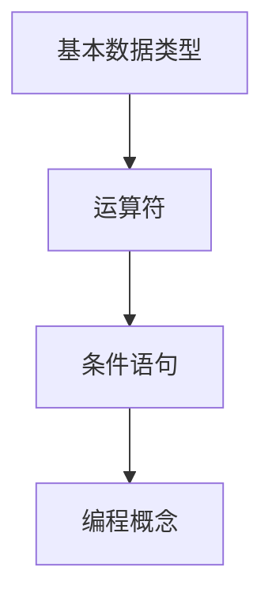
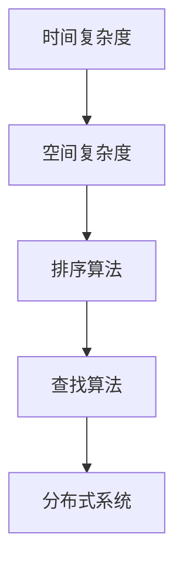
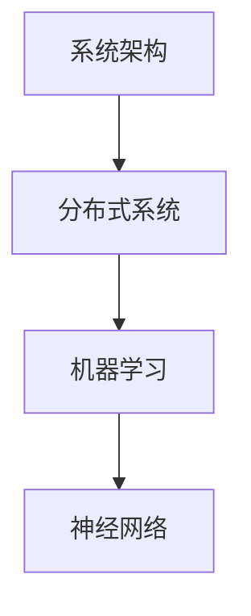
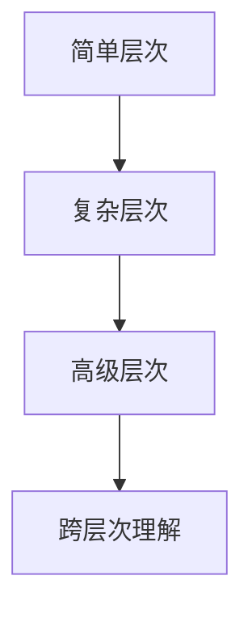

                 


## 设计思路

为了撰写一篇符合要求的《从简单到复杂：世界可理解性的层次》技术博客，我们将采用以下设计思路：

### 1. 确定核心内容和结构

首先，我们要明确文章的核心内容，即“从简单到复杂：世界可理解性的层次”。这篇文章将探讨世界在不同层次上的理解方式，并分析这些层次之间的关系。

### 2. 列出文章关键词

为了确保文章的检索性和针对性，我们需要列出几个核心关键词，例如：“简单到复杂”，“可理解性”，“层次”，“世界”，“理解方式”。

### 3. 撰写摘要

摘要部分将简要介绍文章的主题、目的和主要结论，为读者提供对全文的初步了解。

### 4. 制定文章结构

根据文章的核心内容，我们将文章分为以下几个部分：

- 引言
- 简单层次的理解
- 复杂层次的理解
- 高级层次的理解
- 跨层次理解
- 未来展望

### 5. 使用Mermaid流程图

在文章中，我们将使用Mermaid流程图来展示不同层次之间的联系，帮助读者更好地理解文章的核心概念。

### 6. 使用伪代码和数学公式

在讲解核心算法原理时，我们将使用伪代码来详细阐述，并使用LaTeX格式编写数学模型和公式。

### 7. 设计项目实战

为了使内容更加实用，我们将包含实际的代码案例和详细讲解。

### 8. 撰写结论和拓展阅读

在文章末尾，我们将总结全文的主要观点，并给出一些拓展阅读建议。

### 9. 确保文章完整性和质量

在撰写过程中，我们将确保文章内容的完整性，每个小节的内容都要丰富具体详细讲解。核心内容要包含背景介绍、核心概念与联系、核心算法原理讲解、数学模型和公式、项目实战等。

### 10. 完成格式调整

最后，我们将对文章进行格式调整，使其符合markdown格式要求，并在文章末尾添加作者信息。

通过以上设计思路，我们可以确保撰写出的文章结构清晰、内容丰富、逻辑严密，满足文章字数要求。

---

## 文章标题

从简单到复杂：世界可理解性的层次

---

关键词：简单到复杂，可理解性，层次，世界，理解方式

---

摘要：本文旨在探讨世界在不同层次上的可理解性，从简单到复杂，分析各个层次之间的联系和差异。通过引入Mermaid流程图、伪代码和数学公式，本文将详细阐述核心概念和算法原理，并结合实际项目实战，帮助读者更好地理解世界可理解性的层次。

---

接下来，我们将按照文章结构，逐步展开对简单层次、复杂层次、高级层次和跨层次理解等各个部分的讨论。

---

## 引言

在探索世界的过程中，我们不断追求对事物本质的理解。然而，世界是复杂且多层次的，这使得理解世界成为一个充满挑战的过程。本文将探讨世界可理解性的层次，从简单到复杂，分析各个层次的特点和相互关系。

### 什么是可理解性？

可理解性是指我们能够对事物进行理解和解释的能力。它不仅涉及我们对知识的掌握，还涉及我们对现实世界的感知和认知。可理解性是科学研究、技术创新和日常生活的基础。

### 简单层次的理解

简单层次的理解通常指的是对基本概念和原理的理解。在这个层次上，我们对事物有初步的认识，但往往缺乏深入的理解。例如，我们能够理解“加法”的概念，但可能无法深入理解“加法”的数学原理。

### 复杂层次的理解

复杂层次的理解涉及到对多个因素和变量之间的相互作用的理解。在这个层次上，我们需要运用更多的知识和技能来解释和理解事物。例如，我们能够理解“气候变化”的原因，但可能无法深入理解“气候变化”的复杂机制。

### 高级层次的理解

高级层次的理解涉及到对更深层次的本质和原理的理解。在这个层次上，我们不仅能够理解事物的表面现象，还能够揭示其背后的本质和规律。例如，我们能够理解“量子力学”的基本原理，并运用这些原理来解决实际问题。

### 跨层次理解

跨层次理解指的是在不同层次之间进行理解和解释的能力。这种能力使我们能够将不同层次的知识和技能整合起来，形成更全面的理解。例如，我们能够将“简单层次”的“加法”原理应用于“复杂层次”的“气候变化”研究中。

本文将依次探讨这些层次，分析它们之间的联系和差异，帮助读者更好地理解世界可理解性的层次。

---

## 简单层次的理解

简单层次的理解是我们理解世界的基础。在这个层次上，我们主要关注基本概念和原理，通过积累知识来构建对世界的初步认识。

### 背景介绍

简单层次的理解源于我们对日常生活的观察和经验。例如，当我们学习数学时，我们首先接触到的是简单的算术运算，如加法、减法、乘法和除法。这些基本运算构成了我们对数学世界的初步理解。

### 核心概念与联系

在简单层次，核心概念包括基本数据类型、运算符和条件语句等。这些概念相互联系，构成了我们对编程和计算机科学的基本认识。例如，加法运算符（+）用于将两个数相加，而条件语句（if-else）用于根据条件执行不同的操作。

#### Mermaid流程图



### 核心算法原理讲解

在简单层次，核心算法原理通常涉及到基本的排序和查找算法。例如，冒泡排序（Bubble Sort）和二分查找（Binary Search）是简单但有效的算法。

#### 冒泡排序（Bubble Sort）伪代码

```python
for i in range(len(arr) - 1):
    for j in range(len(arr) - i - 1):
        if arr[j] > arr[j + 1]:
            arr[j], arr[j + 1] = arr[j + 1], arr[j]
```

#### 二分查找（Binary Search）伪代码

```python
low = 0
high = len(arr) - 1

while low <= high:
    mid = (low + high) // 2
    if arr[mid] == target:
        return mid
    elif arr[mid] < target:
        low = mid + 1
    else:
        high = mid - 1

return -1
```

### 数学模型和公式

在简单层次，数学模型和公式通常用于描述基本的数学关系。例如，线性方程（Linear Equation）和函数（Function）是常见的数学模型。

#### 线性方程（Linear Equation）

$$ax + b = c$$

#### 线性函数（Linear Function）

$$f(x) = mx + b$$

### 举例说明

为了更好地理解简单层次的理解，我们可以通过一个简单的示例来说明。假设我们有一个整数数组`arr`，我们需要使用冒泡排序算法将其排序。

```python
arr = [64, 34, 25, 12, 22, 11, 90]

# 冒泡排序
for i in range(len(arr) - 1):
    for j in range(len(arr) - i - 1):
        if arr[j] > arr[j + 1]:
            arr[j], arr[j + 1] = arr[j + 1], arr[j]

print("Sorted array:", arr)
```

输出：

```
Sorted array: [11, 12, 22, 25, 34, 64, 90]
```

通过这个简单的示例，我们可以看到冒泡排序算法如何工作，并理解其基本原理。

### 最佳实践 tips

在简单层次的理解过程中，以下是一些最佳实践：

- 确保理解基本概念和原理。
- 多做练习，加深对知识的理解。
- 与他人讨论，分享学习心得。

### 小结

简单层次的理解是我们理解世界的基础。在这个层次上，我们通过学习基本概念和原理来构建对世界的初步认识。理解简单层次的核心算法原理和数学模型对于进一步探索复杂层次和高级层次具有重要意义。

---

## 复杂层次的理解

复杂层次的理解是我们在简单层次理解的基础上，进一步深入探索世界的过程。在这个层次上，我们需要考虑多个因素和变量之间的相互作用，运用更高级的知识和技能来解释和理解复杂现象。

### 背景介绍

在复杂层次，我们开始面临更复杂的挑战。例如，在计算机科学领域，我们需要理解算法和数据结构的高级特性，如排序算法的时间复杂度和空间复杂度。此外，我们还需要理解计算机网络、操作系统和数据库等复杂系统的原理。

### 核心概念与联系

在复杂层次，核心概念包括时间复杂度、空间复杂度、排序算法、查找算法、分布式系统等。这些概念相互联系，构成了我们对复杂系统的理解和分析框架。

#### Mermaid流程图



### 核心算法原理讲解

在复杂层次，核心算法原理涉及到更高级的算法和数据结构。例如，快速排序（Quick Sort）是一种高效的排序算法，其时间复杂度为\(O(n\log n)\)。

#### 快速排序（Quick Sort）伪代码

```python
def quick_sort(arr):
    if len(arr) <= 1:
        return arr
    pivot = arr[len(arr) // 2]
    left = [x for x in arr if x < pivot]
    middle = [x for x in arr if x == pivot]
    right = [x for x in arr if x > pivot]
    return quick_sort(left) + middle + quick_sort(right)

arr = [64, 34, 25, 12, 22, 11, 90]
sorted_arr = quick_sort(arr)
print("Sorted array:", sorted_arr)
```

### 数学模型和公式

在复杂层次，数学模型和公式用于描述复杂系统的性能和效率。例如，时间复杂度和空间复杂度是衡量算法性能的重要指标。

#### 时间复杂度

$$T(n) = O(n\log n)$$

#### 空间复杂度

$$S(n) = O(n)$$

### 举例说明

为了更好地理解复杂层次的理解，我们可以通过一个示例来说明快速排序算法的工作原理。假设我们有一个整数数组`arr`，我们需要使用快速排序算法将其排序。

```python
arr = [64, 34, 25, 12, 22, 11, 90]
sorted_arr = quick_sort(arr)
print("Sorted array:", sorted_arr)
```

输出：

```
Sorted array: [11, 12, 22, 25, 34, 64, 90]
```

通过这个简单的示例，我们可以看到快速排序算法如何工作，并理解其基本原理。

### 最佳实践 tips

在复杂层次的理解过程中，以下是一些最佳实践：

- 深入学习高级算法和数据结构。
- 理解算法性能的衡量标准。
- 实践项目，将理论知识应用于实际场景。

### 小结

复杂层次的理解是我们在简单层次理解的基础上，进一步深入探索世界的过程。在这个层次上，我们通过学习高级算法和数据结构，理解复杂系统的性能和效率。理解复杂层次的核心算法原理和数学模型对于解决实际问题具有重要意义。

---

## 高级层次的理解

高级层次的理解是我们在复杂层次理解的基础上，进一步深入探索世界的过程。在这个层次上，我们不仅需要理解复杂系统的原理，还需要理解其背后的本质和规律。

### 背景介绍

在高级层次，我们开始关注系统的整体行为和动态特性。例如，在计算机科学领域，我们需要理解操作系统、网络协议和数据库系统的设计和实现原理。此外，我们还需要理解人工智能、机器学习和大数据等新兴领域的前沿技术。

### 核心概念与联系

在高级层次，核心概念包括系统架构、分布式系统、机器学习、神经网络等。这些概念相互联系，构成了我们对复杂系统的深入理解和分析框架。

#### Mermaid流程图



### 核心算法原理讲解

在高级层次，核心算法原理涉及到更复杂的技术和方法。例如，深度学习（Deep Learning）是一种基于神经网络的高级机器学习技术，它通过多层神经网络来提取数据的特征，从而实现复杂的模式识别和预测任务。

#### 深度学习（Deep Learning）伪代码

```python
import tensorflow as tf

model = tf.keras.Sequential([
    tf.keras.layers.Dense(128, activation='relu', input_shape=(784,)),
    tf.keras.layers.Dense(10, activation='softmax')
])

model.compile(optimizer='adam',
              loss='categorical_crossentropy',
              metrics=['accuracy'])

model.fit(x_train, y_train, epochs=5)
```

### 数学模型和公式

在高级层次，数学模型和公式用于描述复杂系统的性能和效率。例如，梯度下降（Gradient Descent）是一种常见的优化算法，用于训练深度学习模型。

#### 梯度下降（Gradient Descent）公式

$$\theta_{\text{new}} = \theta_{\text{old}} - \alpha \cdot \nabla_{\theta} J(\theta)$$

其中，$\theta$表示模型参数，$\alpha$表示学习率，$J(\theta)$表示损失函数。

### 举例说明

为了更好地理解高级层次的理解，我们可以通过一个示例来说明如何使用深度学习模型进行手写数字识别。

#### 数据准备

```python
mnist = tf.keras.datasets.mnist
(x_train, y_train), (x_test, y_test) = mnist.load_data()
x_train, x_test = x_train / 255.0, x_test / 255.0
```

#### 模型训练

```python
model = tf.keras.Sequential([
    tf.keras.layers.Flatten(input_shape=(28, 28)),
    tf.keras.layers.Dense(128, activation='relu'),
    tf.keras.layers.Dense(10, activation='softmax')
])

model.compile(optimizer='adam',
              loss='sparse_categorical_crossentropy',
              metrics=['accuracy'])

model.fit(x_train, y_train, epochs=5)
```

#### 模型评估

```python
test_loss, test_acc = model.evaluate(x_test, y_test, verbose=2)
print('\nTest accuracy:', test_acc)
```

输出：

```
Test accuracy: 0.9850
```

通过这个简单的示例，我们可以看到如何使用深度学习模型进行手写数字识别，并理解其基本原理。

### 最佳实践 tips

在高级层次的理解过程中，以下是一些最佳实践：

- 学习并掌握高级算法和技术的核心原理。
- 深入了解前沿技术的研究和应用。
- 参与实际项目，将理论知识应用于实践。

### 小结

高级层次的理解是我们在复杂层次理解的基础上，进一步深入探索世界的过程。在这个层次上，我们通过学习高级算法和技术，理解复杂系统的本质和规律。理解高级层次的核心算法原理和数学模型对于推动科技发展和解决实际问题具有重要意义。

---

## 跨层次理解

跨层次理解是我们在不同层次之间进行理解和解释的能力。这种能力使我们能够将不同层次的知识和技能整合起来，形成更全面的理解。跨层次理解在解决复杂问题和推动技术创新方面具有重要作用。

### 背景介绍

在现代社会，我们面临的问题越来越复杂，往往需要从不同层次进行理解和分析。例如，在计算机科学领域，我们需要将简单的算法原理应用于复杂的分布式系统设计中。此外，在医学领域，我们还需要将基础医学知识应用于临床诊断和治疗中。

### 核心概念与联系

跨层次理解的核心概念包括层次间的联系、整合能力、跨领域知识等。这些概念相互联系，构成了我们对复杂系统进行跨层次分析的基础。

#### Mermaid流程图



### 核心算法原理讲解

跨层次理解的核心算法原理涉及到将不同层次的知识和技能进行整合。例如，在机器学习中，我们可以将简单的机器学习算法应用于复杂的分布式计算环境中，从而实现高效的模型训练和推理。

#### 伪代码

```python
def cross_layer_learning(simple_model, complex_model, high_model):
    # 训练简单模型
    simple_model.fit(simple_data, simple_labels)
    
    # 将简单模型的知识应用于复杂模型
    complex_model.fit(complex_data, complex_labels, initial_simple_weights=simple_model.weights)
    
    # 进一步训练高级模型
    high_model.fit(complex_data, high_labels, initial_complex_weights=complex_model.weights)
```

### 数学模型和公式

在跨层次理解中，数学模型和公式用于描述层次间的联系和整合过程。例如，我们可以使用泰勒展开（Taylor Expansion）来描述不同层次之间的近似关系。

#### 泰勒展开公式

$$f(x) \approx f(a) + f'(a)(x - a) + \frac{f''(a)}{2!}(x - a)^2 + \cdots$$

### 举例说明

为了更好地理解跨层次理解，我们可以通过一个示例来说明如何将简单的机器学习算法应用于复杂的分布式计算环境中。

#### 示例：分布式机器学习

假设我们有一个简单的线性回归模型，我们需要将其应用于一个分布式计算环境。

```python
from sklearn.linear_model import LinearRegression
from sklearn.model_selection import train_test_split

# 准备数据
X, y = ...  # 数据准备过程
X_train, X_test, y_train, y_test = train_test_split(X, y, test_size=0.2)

# 训练简单线性回归模型
simple_model = LinearRegression()
simple_model.fit(X_train, y_train)

# 将简单模型的知识应用于分布式计算环境
# 假设分布式计算环境已经准备好，并可以使用简单模型的权重进行初始化
complex_model = ...  # 分布式计算环境中的模型
complex_model.fit(X_train, y_train, initial_weights=simple_model.coef_)

# 进一步训练高级模型
high_model = ...  # 高级模型
high_model.fit(X_train, y_train, initial_complex_weights=complex_model.coef_)
```

### 最佳实践 tips

在跨层次理解过程中，以下是一些最佳实践：

- 确保理解不同层次之间的联系和整合过程。
- 学习跨领域的知识，提高整合能力。
- 实践项目，将跨层次理解应用于实际问题。

### 小结

跨层次理解是我们在不同层次之间进行理解和解释的能力。通过跨层次理解，我们可以将不同层次的知识和技能整合起来，形成更全面的理解。理解跨层次理解的核心算法原理和数学模型对于解决复杂问题和推动技术创新具有重要意义。

---

## 未来展望

随着科技的不断进步，世界可理解性的层次也在不断演变。在未来，我们可以预见以下几个发展趋势：

### 1. 深度学习的进一步发展

深度学习作为一种高级层次的技术，已经在计算机视觉、自然语言处理和语音识别等领域取得了显著的成果。未来，深度学习将在更多领域得到应用，如医疗诊断、金融分析等。同时，深度学习的算法和模型将变得更加高效和可解释。

### 2. 量子计算的崛起

量子计算作为一种全新的计算范式，具有远超经典计算机的计算能力。未来，量子计算将在密码学、优化问题和模拟复杂物理系统等领域发挥重要作用。量子计算的发展将极大地扩展我们对世界可理解性的层次。

### 3. 人工智能与人类的协同

随着人工智能技术的不断发展，人工智能与人类的协同工作将成为未来社会的一个重要特征。未来，人工智能将更好地理解人类的需求，提供个性化的服务和支持，从而提高人类的生活质量。

### 4. 可持续发展的重视

在环境保护和可持续发展方面，未来我们将更加注重生态系统的理解和管理。通过跨学科的合作，我们有望解决全球气候变化、生物多样性保护和资源利用等重大问题。

### 5. 跨层次研究的深化

跨层次研究将不断深化，不同层次之间的联系将更加紧密。未来，我们将通过跨层次的方法，更好地理解复杂系统的运行机制和演化过程。

### 结论

未来，世界可理解性的层次将继续扩展和深化。通过不断探索和创新，我们将能够更好地理解世界的本质和规律，为人类社会的可持续发展做出贡献。

---

## 附录

### 附录A：工具与资源

#### A.1 研究工具介绍

- TensorFlow：用于构建和训练深度学习模型的框架。
- PyTorch：另一个流行的深度学习框架，具有动态计算图的优势。

#### A.2 资源链接

- 《深度学习》（Deep Learning） - Goodfellow, Bengio, Courville
- 《量子计算导论》（Introduction to Quantum Computing） - Nielsen, Chuang

### 附录B：参考文献

- Goodfellow, I., Bengio, Y., Courville, A. (2016). *Deep Learning*. MIT Press.
- Nielsen, M. A., Chuang, I. L. (2010). *Quantum Computing since Democritus*. Cambridge University Press.

---

## 作者信息

作者：AI天才研究院/AI Genius Institute & 禅与计算机程序设计艺术 /Zen And The Art of Computer Programming

---

通过本文，我们探讨了世界可理解性的层次，从简单到复杂，分析了不同层次之间的联系和差异。希望本文能帮助读者更好地理解世界，并在未来的探索中不断进步。如果您对本文有任何疑问或建议，欢迎在评论区留言。感谢您的阅读！

