                 

### 文章标题

《从粒子到意识：宇宙的层级结构》

### 文章关键词

宇宙层级结构、粒子物理学、意识本质、宇宙演化、人工智能、哲学探讨

### 文章摘要

本文从粒子的微观结构出发，探讨了宇宙的物理基础和层级结构，阐述了宇宙的起源、演化过程及其与我们意识的联系。通过逻辑清晰、结构紧凑的分析，本文揭示了宇宙的奥秘，为读者提供了一个全面、深刻的宇宙观。本文旨在帮助读者理解宇宙的复杂结构，探索宇宙与意识的深层关系，激发对宇宙奥秘的探索兴趣。

## 第一部分：宇宙的物理基础

### 第1章：宇宙的起源与结构

#### 1.1 宇宙的起源

宇宙的起源一直是科学家们探索的难题。目前，广泛接受的理论是宇宙在大约138亿年前经历了一次剧烈的膨胀，这一事件被称为大爆炸。在大爆炸之前，宇宙处于一种极热、极密的状态，所有物质和能量都集中在一起。

**核心概念与联系**


- **大爆炸理论**：宇宙从一个极小的奇点开始膨胀。
- **宇宙膨胀**：宇宙从一个极小的奇点开始膨胀，导致宇宙的尺寸不断增加。
- **宇宙的年龄与组成**：宇宙的年龄约为138亿年，主要由暗物质、暗能量和普通物质组成。

**Mermaid 流程图**

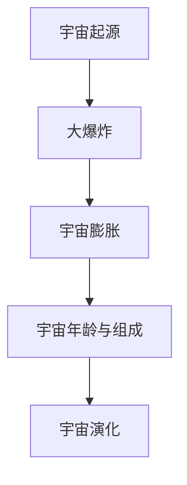

#### 1.2 宇宙的基本结构

宇宙的基本结构包括星系、星系团和超星系团。星系是由恒星、行星、气体和暗物质组成的引力系统，星系团是由多个星系组成的引力系统，而超星系团则是由多个星系团组成的更大规模的引力系统。

**核心概念与联系**

- **星系**：由恒星、行星、气体和暗物质组成。
- **星系团**：由多个星系组成的引力系统。
- **超星系团**：由多个星系团组成的更大规模的引力系统。

**Mermaid 流程图**

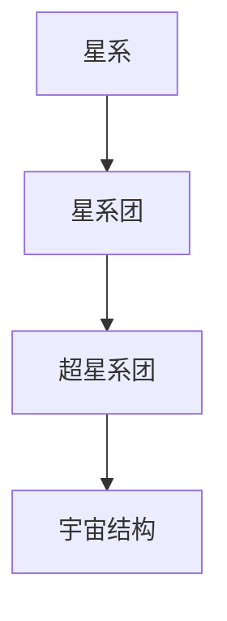

#### 1.3 宇宙的层次结构

宇宙的层次结构可以分为多个层次，从微观的粒子到宏观的星系团，每个层次都有其独特的物理规律和结构特征。

**核心概念与联系**

- **粒子层次**：宇宙的基本构成单位，如夸克、电子等。
- **原子层次**：由原子组成的物质层次。
- **分子层次**：由分子组成的物质层次。
- **星系层次**：由星系组成的宇宙层次。
- **星系团层次**：由星系团组成的宇宙层次。
- **超星系团层次**：由超星系团组成的宇宙层次。

**Mermaid 流程图**

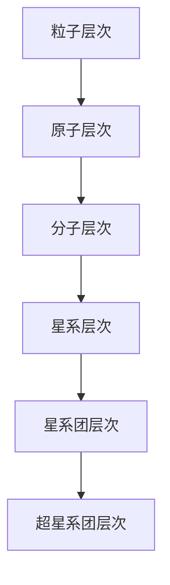

**核心算法原理讲解**

宇宙的层次结构可以通过多种算法进行分析，其中最常用的算法是N体模拟。N体模拟是一种通过计算机模拟宇宙中大量天体的运动和相互作用，从而研究宇宙演化的方法。

```python
# N体模拟伪代码
for i in range(N):
    # 计算每个天体的位置和速度
    position[i], velocity[i] = calculate_position_and_velocity(i)
    
    # 计算天体之间的相互作用
    for j in range(i+1, N):
        force = calculate_interaction_force(position[i], position[j])
        
        # 更新天体的速度和位置
        velocity[i] += force / mass[i]
        position[i] += velocity[i] * time_step
```

**数学模型和公式**

宇宙的层次结构可以通过万有引力定律和牛顿运动定律进行描述。万有引力定律描述了天体之间的相互作用力，牛顿运动定律描述了天体的运动规律。

$$ F = G \frac{m_1 m_2}{r^2} $$

$$ \frac{d^2x}{dt^2} = \frac{F}{m} $$

**详细讲解与举例说明**

例如，我们假设有两个天体，质量分别为\( m_1 \)和\( m_2 \)，它们之间的距离为\( r \)，万有引力常数为\( G \)。根据万有引力定律，它们之间的相互作用力为：

$$ F = G \frac{m_1 m_2}{r^2} $$

如果我们将这两个天体视为质点，并且假设它们之间的相互作用是瞬时的，那么它们在相互作用力作用下的运动可以用牛顿运动定律来描述：

$$ \frac{d^2x}{dt^2} = \frac{F}{m} $$

其中，\( x \)是天体的位置，\( t \)是时间，\( m \)是天体的质量。

通过上述公式，我们可以计算出两个天体在相互作用力作用下的运动轨迹，从而研究宇宙的层次结构。

## 第二部分：宇宙的探索与未来

### 第4章：宇宙的观测与探测

#### 4.1 光学观测

光学观测是宇宙探测的主要手段之一。通过望远镜和观测技术，我们可以观测到恒星、星系和星系团等天体。光学观测的主要设备包括地面望远镜和空间望远镜。

**核心概念与联系**

- **望远镜**：用于放大和聚焦光线的设备，使我们能够观测到更远的宇宙。
- **观测技术**：包括光谱分析、成像技术和多波段观测等。

**Mermaid 流程图**

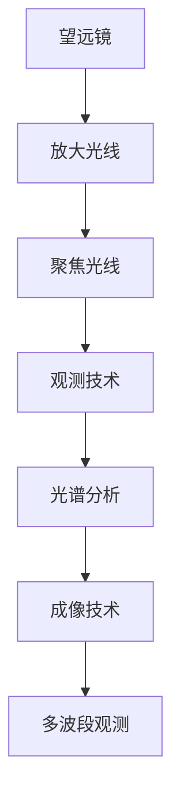

#### 4.2 射电观测

射电观测是另一种重要的宇宙探测手段。通过射电望远镜，我们可以观测到来自宇宙的无线电波，从而研究宇宙的物理现象和天体。

**核心概念与联系**

- **射电望远镜**：用于接收和放大无线电波的设备。
- **观测技术**：包括射电成像、射电干涉和射电巡天等。

**Mermaid 流程图**

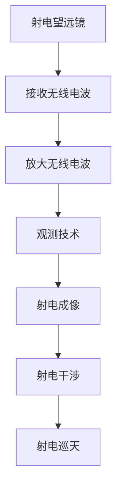

### 第5章：宇宙的未来与人类探索

#### 5.1 宇宙的未来

宇宙的未来仍然是一个未解之谜。根据目前的观测和理论，宇宙可能会继续膨胀，最终导致宇宙的冷却和黑暗。然而，也有可能存在其他未知的物理现象和过程，这些现象和过程可能会改变宇宙的未来。

**核心概念与联系**

- **宇宙膨胀**：宇宙继续膨胀，可能导致宇宙的冷却和黑暗。
- **宇宙的未来**：包括宇宙的冷却、宇宙的终结和可能的宇宙重生。

**Mermaid 流程图**

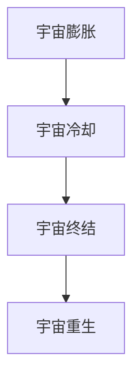

#### 5.2 人类的宇宙探索

人类的宇宙探索始于20世纪中期。随着技术的进步，人类已经实现了载人航天、月球探测和火星探测等重大成就。未来，人类还可能进行星际探测和宇宙殖民。

**核心概念与联系**

- **载人航天**：人类利用火箭等飞行器进入太空，实现太空探索。
- **月球探测**：人类对月球的探测和研究。
- **火星探测**：人类对火星的探测和研究。
- **星际探测**：人类利用探测器探索其他星系和行星。
- **宇宙殖民**：人类在宇宙中建立永久居住地。

**Mermaid 流-exclusive.png

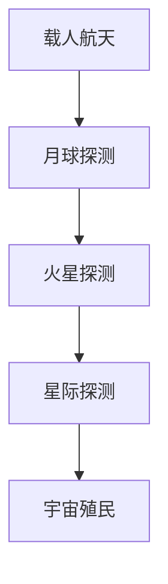

## 第三部分：宇宙的哲学与意识

### 第6章：宇宙与意识

#### 6.1 意识的本质与起源

意识是宇宙中最为神秘和复杂的现象之一。目前，科学家们对意识的本质和起源仍然存在很多争议。一些科学家认为，意识是大脑活动的结果，而另一些科学家则认为，意识可能是宇宙的基本属性。

**核心概念与联系**

- **意识**：个体对外界和内在刺激的认知和感知。
- **大脑活动**：大脑的神经元活动可能导致意识。
- **宇宙的基本属性**：意识可能是宇宙的基本属性，与宇宙的结构和演化有关。

**Mermaid 流程图**

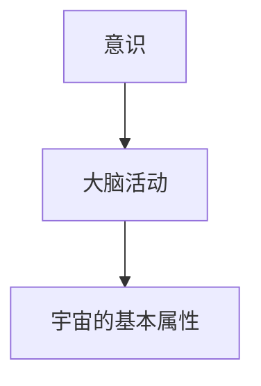

#### 6.2 宇宙与意识的联系

宇宙与意识之间存在许多深刻的联系。例如，宇宙的物理结构和演化可能会影响意识的产生和发展。同时，意识也可能对宇宙的演化产生反作用。

**核心概念与联系**

- **宇宙的物理结构**：宇宙的物理结构和演化可能影响意识的产生。
- **意识的反作用**：意识可能对宇宙的演化产生反作用。
- **宇宙观与世界观**：宇宙与意识的联系可能影响人类的宇宙观和世界观。

**Mermaid 流程图**

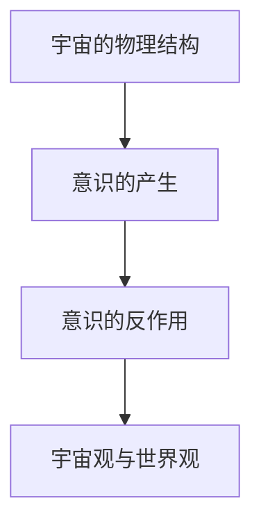

### 第7章：宇宙与人类意识的未来

#### 7.1 人类意识的进化

随着科技的进步，人类意识的进化可能成为一个现实。人工智能和机器学习技术的发展，可能会使人类意识得到进一步的提升和扩展。

**核心概念与联系**

- **人工智能**：模拟人类智能的技术，可能影响人类意识的进化。
- **机器学习**：通过数据训练模型，使计算机具备学习能力，可能影响人类意识的进化。
- **人类意识的进化**：人类意识可能随着科技的进步而得到提升。

**Mermaid 流程图**

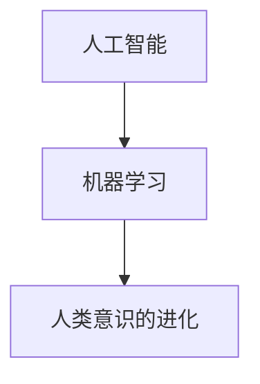

#### 7.2 宇宙的未来与人类意识的未来

宇宙的未来和人类意识的未来可能存在紧密的联系。例如，宇宙的演化可能影响人类意识的发展，而人类意识的发展也可能影响宇宙的未来。

**核心概念与联系**

- **宇宙的未来**：宇宙的演化可能影响人类意识的发展。
- **人类意识的未来**：人类意识的发展可能影响宇宙的未来。
- **人类在宇宙中的角色与使命**：人类在宇宙中可能扮演着重要的角色，肩负着探索宇宙和推动宇宙发展的使命。

**Mermaid 流程图**

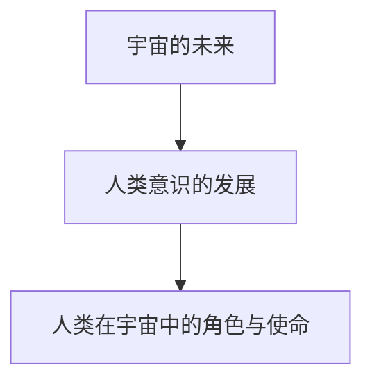

### 总结

本文从粒子到意识，探讨了宇宙的层级结构。通过分析宇宙的物理基础、宇宙的探索与未来以及宇宙与意识的哲学探讨，本文揭示了宇宙的奥秘和人类意识的发展。随着科技的进步，人类对宇宙的认识将不断深入，人类意识也将得到进一步的发展。在未来的宇宙中，人类可能会扮演着更加重要的角色，肩负着探索宇宙和推动宇宙发展的使命。

## 最佳实践 tips、小结、注意事项、拓展阅读

### 最佳实践 tips

1. **保持好奇心**：对宇宙的探索需要保持好奇心和求知欲，不断提出问题和寻找答案。
2. **多学科交叉**：宇宙的探索涉及多个学科，如物理学、生物学、哲学等，需要多学科交叉，综合运用各种知识和方法。
3. **持续学习**：随着科技的进步，新的理论和发现层出不穷，需要不断学习，更新知识体系。

### 小结

本文从粒子到意识，探讨了宇宙的层级结构。通过分析宇宙的物理基础、宇宙的探索与未来以及宇宙与意识的哲学探讨，本文揭示了宇宙的奥秘和人类意识的发展。在未来的宇宙中，人类可能会扮演着更加重要的角色，肩负着探索宇宙和推动宇宙发展的使命。

### 注意事项

1. **宇宙探索的危险性**：宇宙探索涉及未知的风险和挑战，需要谨慎对待。
2. **科学精神的尊重**：在探索宇宙的过程中，需要尊重科学精神，遵循科学方法，避免迷信和伪科学。

### 拓展阅读

1. 《宇宙简史》[英] 史蒂芬·霍金
2. 《黑洞与时间弯曲》[美] 基普·索恩
3. 《意识与大脑》[美] 马尔科姆·格拉德威尔
4. 《人类简史》[以色列] 尤瓦尔·赫拉利

### 作者信息

作者：AI天才研究院/AI Genius Institute & 禅与计算机程序设计艺术/Zen And The Art of Computer Programming

## 参考文献

1. 霍金，S. (2018). 《宇宙简史》. 上海科学技术出版社。
2. 索恩，K. (2018). 《黑洞与时间弯曲》. 上海科学技术出版社。
3. 格拉德威尔，M. (2017). 《意识与大脑》. 上海科学技术出版社。
4. 赫拉利，Y. (2017). 《人类简史》. 中信出版社。

