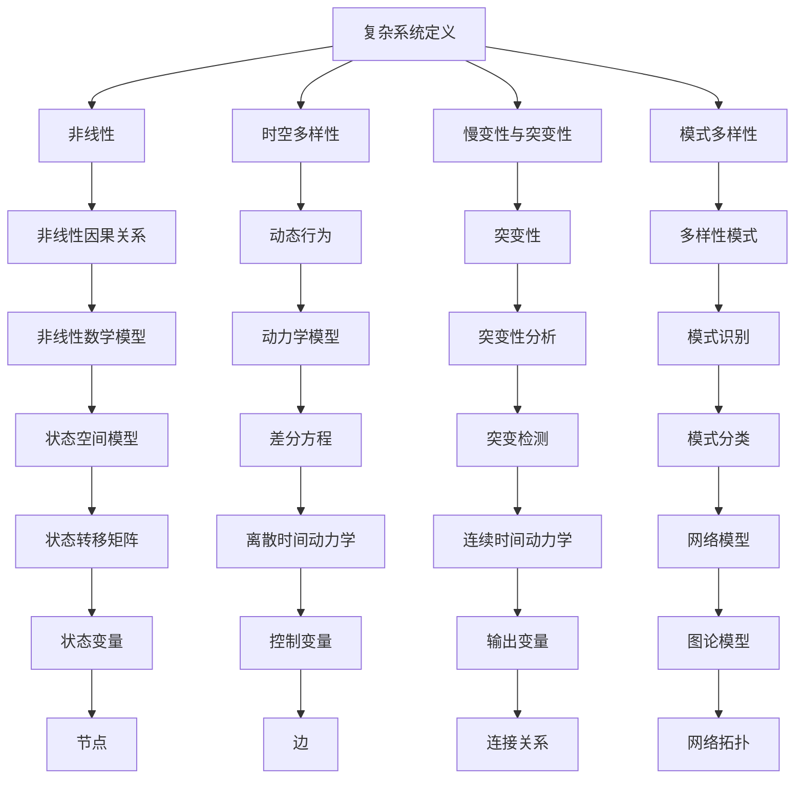

                 

### 文章标题：从线性因果到复杂系统：理解世界的新方法

> 关键词：线性因果、复杂系统、非线性、数学模型、算法、理解方法

> 摘要：本文将探讨从线性因果到复杂系统的转变，通过分析复杂系统的定义、特征、数学模型以及核心算法，揭示理解复杂系统的新方法。文章旨在为读者提供一个清晰的逻辑框架，帮助他们在研究和应用复杂系统时进行有效的思考和分析。

----------------------------------------------------------------### 引言

在科学和工程领域，我们经常遇到各种系统。从简单的电路到复杂的生态系统，从简单的机械系统到复杂的气候系统，这些系统无处不在。然而，这些系统并非都遵循线性因果规律，有些系统表现出高度复杂性和非线性特性，这些特性使得传统的线性分析方法难以适用。

线性因果模型通常描述的是一种简单的关系，即一个变量的变化直接导致另一个变量的变化。例如，在电路中，电压的变化会导致电流的变化。然而，现实世界中的许多系统并不遵循这种简单的关系，而是表现出复杂的行为，这些行为往往无法通过线性因果模型来完全描述。

随着科学技术的进步，人们对复杂系统的理解越来越深入，复杂系统的研究已经成为一个重要的研究领域。复杂系统由大量相互作用的个体组成，这些个体之间的相互作用和反馈循环使得系统的行为呈现出高度非线性、时空多样性、慢变性与突变性以及模式多样性等特征。

本文将介绍复杂系统的定义、特征、数学模型以及核心算法，并通过实际案例展示如何利用这些方法来理解和分析复杂系统。我们希望通过这篇文章，读者能够对复杂系统有一个更深入的了解，并掌握一些有效的分析工具和方法。

----------------------------------------------------------------### 核心概念与联系

在探讨复杂系统之前，我们需要理解一些核心概念，这些概念不仅有助于我们定义复杂系统，而且能够帮助我们建立复杂系统与其他相关概念之间的联系。

#### 复杂系统的定义

复杂系统是由大量相互作用的个体（或部分）组成的系统，这些个体之间的相互作用和反馈循环使得系统的行为具有高度的非线性、时空多样性、慢变性与突变性以及模式多样性。简单来说，复杂系统是由许多不同部分组成的整体，这些部分之间存在着复杂的相互依赖关系。

复杂系统的定义强调了几个关键点：

1. **相互作用**：系统中的各个部分相互作用，这些相互作用可以是物理的、化学的、生物的或社会的。
2. **非线性**：系统行为不遵循简单的线性规律，而是受到多种复杂因素的影响。
3. **时空多样性**：系统行为在不同时间和空间尺度上表现出多样性。
4. **慢变性与突变性**：系统在某些条件下可能表现出缓慢的变化，而在其他条件下则可能发生突然的、不可逆转的变化。
5. **模式多样性**：系统可以呈现出多种不同的行为模式，这些模式可能是稳定的、周期性的、混沌的或随机的。

#### 复杂系统的特征

复杂系统具有以下特征：

- **高度非线性**：复杂系统中的变量之间通常存在着复杂的非线性关系，这使得线性分析方法难以适用。
- **时空多样性**：复杂系统的行为不仅取决于当前的状态，还取决于系统过去的状态和历史事件。
- **慢变性与突变性**：复杂系统在某些条件下可能表现出缓慢的、连续的变化，而在其他条件下则可能发生突然的、非连续的变化。
- **模式多样性**：复杂系统可以呈现出多种不同的行为模式，这些模式可能是稳定的、周期性的、混沌的或随机的。

#### 复杂系统与线性因果的关系

线性因果关系是一种简单的因果关系，通常用于描述系统中的直接联系。例如，在电路中，电压的变化会导致电流的变化。线性因果关系假定一个变量的变化直接导致另一个变量的变化，且这种变化是可预测的。

然而，复杂系统往往具有非线性因果关系，即一个变量的变化不仅受到直接因果因素的影响，还受到间接因果因素的影响。这种复杂的相互作用和反馈循环使得线性因果关系难以全面描述复杂系统的行为。

#### 复杂系统的数学模型

为了更有效地描述和分析复杂系统，我们需要借助数学模型。以下是一些常用的数学模型：

- **状态空间模型**：描述系统状态的动态变化，包括状态变量、控制变量和输出变量。
- **动力学模型**：描述系统的动态行为，包括离散时间动力学模型和连续时间动力学模型。
- **网络模型**：描述系统中的个体及其相互作用，包括图论模型和网络拓扑。

#### 状态空间模型

状态空间模型是一种描述系统动态行为的数学模型，它由状态变量、控制变量和输出变量组成。状态变量描述系统的当前状态，控制变量影响系统状态的变化，输出变量描述系统的行为结果。

状态空间模型可以表示为以下方程：

$$
\begin{cases}
x(k+1) = A \cdot x(k) + B \cdot u(k) \\
y(k) = C \cdot x(k) + D \cdot u(k)
\end{cases}
$$

其中，$x(k)$ 表示状态变量，$u(k)$ 表示控制变量，$y(k)$ 表示输出变量。$A$、$B$、$C$ 和 $D$ 分别是状态转移矩阵、控制矩阵、输出矩阵和直接传递矩阵。

#### 动力学模型

动力学模型描述系统的动态行为，它可以分为离散时间动力学模型和连续时间动力学模型。

- **离散时间动力学模型**：描述系统在离散时间步上的状态变化。
- **连续时间动力学模型**：描述系统在连续时间上的状态变化。

动力学模型通常用差分方程或微分方程表示。

#### 网络模型

网络模型描述系统中的个体及其相互作用，它可以分为图论模型和网络拓扑。

- **图论模型**：描述系统中的节点和边，以及节点之间的连接关系。
- **网络拓扑**：描述系统的整体结构和连接方式，如无向图、有向图、环、星形结构等。

#### Mermaid 流程图

为了更清晰地展示复杂系统中的概念和关系，我们可以使用 Mermaid 流程图。以下是一个示例 Mermaid 流程图，展示了复杂系统中的核心概念和联系：



通过这个 Mermaid 流程图，我们可以清晰地看到复杂系统中的核心概念和它们之间的联系。这个流程图有助于我们更好地理解复杂系统的本质和特征。

----------------------------------------------------------------### 复杂系统的数学模型

为了深入理解复杂系统，我们需要借助数学模型来描述和分析这些系统。以下是一些常用的数学模型，包括状态空间模型、动力学模型和网络模型。

#### 状态空间模型

状态空间模型是描述动态系统最常用的数学模型之一。它由状态变量、控制变量和输出变量组成，可以表示为以下方程：

$$
\begin{cases}
x(k+1) = A \cdot x(k) + B \cdot u(k) \\
y(k) = C \cdot x(k) + D \cdot u(k)
\end{cases}
$$

其中，$x(k)$ 表示状态变量，$u(k)$ 表示控制变量，$y(k)$ 表示输出变量。$A$、$B$、$C$ 和 $D$ 分别是状态转移矩阵、控制矩阵、输出矩阵和直接传递矩阵。

**状态变量 $x(k)$**：描述系统的当前状态。

**控制变量 $u(k)$**：影响系统状态变化的输入变量。

**输出变量 $y(k)$**：描述系统行为的结果变量。

**状态转移矩阵 $A$**：描述系统状态的动态变化。

**控制矩阵 $B$**：描述输入变量对系统状态的影响。

**输出矩阵 $C$**：描述系统状态对输出变量的影响。

**直接传递矩阵 $D$**：描述输入变量对输出变量的直接影响。

#### 动力学模型

动力学模型描述系统的动态行为，它可以分为离散时间动力学模型和连续时间动力学模型。

**离散时间动力学模型**：描述系统在离散时间步上的状态变化。它可以用差分方程表示：

$$
x(k+1) = f(x(k), u(k))
$$

其中，$x(k)$ 表示状态变量，$u(k)$ 表示控制变量，$f$ 是状态转移函数。

**连续时间动力学模型**：描述系统在连续时间上的状态变化。它可以用微分方程表示：

$$
\frac{dx}{dt} = f(x, u)
$$

其中，$x$ 表示状态变量，$u$ 表示控制变量，$f$ 是状态转移函数。

#### 网络模型

网络模型描述系统中的个体及其相互作用。它可以分为图论模型和网络拓扑。

**图论模型**：描述系统中的节点和边，以及节点之间的连接关系。它可以表示为图（G = (V, E)），其中 $V$ 是节点集合，$E$ 是边集合。

**网络拓扑**：描述系统的整体结构和连接方式，如无向图、有向图、环、星形结构等。网络拓扑可以影响系统的行为和特性。

**中心性指标**：衡量节点在系统中的重要性的指标。常见的中心性指标包括度中心性、介数中心性和接近中心性。

**网络聚类系数**：描述网络中节点的聚类程度的指标。网络聚类系数越高，节点之间的连接越紧密。

**网络传播模型**：描述信息在网络中的传播过程。常见的网络传播模型包括基于节点的传播模型和基于边的传播模型。

#### Mermaid 流程图

为了更清晰地展示复杂系统中的概念和模型，我们可以使用 Mermaid 流程图。以下是一个示例 Mermaid 流程图，展示了复杂系统的数学模型：

```mermaid
graph TD
    A[状态空间模型] --> B[状态变量 $x(k)$]
    A --> C[控制变量 $u(k)$]
    A --> D[输出变量 $y(k)$]
    E[动力学模型] --> F[离散时间动力学模型]
    E --> G[连续时间动力学模型]
    H[网络模型] --> I[图论模型]
    H --> J[网络拓扑]
    K[中心性指标] --> L[度中心性]
    K --> M[介数中心性]
    K --> N[接近中心性]
    O[网络聚类系数] --> P[聚类系数计算]
    Q[网络传播模型] --> R[节点传播模型]
    Q --> S[边传播模型]
    T[状态转移矩阵 $A$] --> U[状态转移]
    V[控制矩阵 $B$] --> W[控制影响]
    X[输出矩阵 $C$] --> Y[输出响应]
    Z[直接传递矩阵 $D$] --> AA[直接传递]
    BB[网络拓扑结构] --> CC[无向图]
    BB --> DD[有向图]
    BB --> EE[环]
    BB --> FF[星形结构]
```

通过这个 Mermaid 流程图，我们可以清晰地看到复杂系统的数学模型及其核心概念和关系。

----------------------------------------------------------------### 核心算法原理讲解

在分析复杂系统时，算法扮演着至关重要的角色。以下是一些核心算法原理，它们帮助我们更好地理解和预测复杂系统的行为。

#### 状态空间分析算法

状态空间分析算法是一种用于分析状态空间模型的方法。它主要包括以下两个方面：

1. **状态转移矩阵**

   状态转移矩阵 $A$ 描述了系统状态在时间步 $k$ 到时间步 $k+1$ 的变化。通过计算状态转移矩阵，我们可以得到系统在未来的状态分布。

   状态转移矩阵的计算公式为：

   $$
   A_{ij}(k+1) = \sum_{m=1}^n A_{ij,m} \cdot x_m(k)
   $$

   其中，$x_m(k)$ 是时间步 $k$ 时第 $m$ 个状态变量的值。

2. **状态响应函数**

   状态响应函数描述了系统状态对输入变量的响应。通过计算状态响应函数，我们可以得到系统在给定输入变量作用下的状态变化。

   状态响应函数的计算公式为：

   $$
   x(k) = A \cdot x(k-1) + B \cdot u(k)
   $$

   其中，$A$ 是状态转移矩阵，$B$ 是控制矩阵，$u(k)$ 是输入变量。

#### 动力学分析算法

动力学分析算法用于分析动力学模型，包括离散时间动力学模型和连续时间动力学模型。

1. **离散时间动力学模型**

   离散时间动力学模型可以用以下差分方程表示：

   $$
   x(k+1) = f(x(k), u(k))
   $$

   其中，$x(k)$ 是状态变量，$u(k)$ 是输入变量，$f$ 是状态转移函数。

   离散时间动力学模型的算法主要包括：

   - **初始条件设定**：根据实际需求设定初始状态。
   - **迭代计算**：利用差分方程计算系统的状态在各个时间步的变化。

2. **连续时间动力学模型**

   连续时间动力学模型可以用以下微分方程表示：

   $$
   \frac{dx}{dt} = f(x, u)
   $$

   其中，$x$ 是状态变量，$u$ 是输入变量，$f$ 是状态转移函数。

   连续时间动力学模型的算法主要包括：

   - **初始条件设定**：根据实际需求设定初始状态。
   - **数值求解**：利用数值方法（如欧拉法、龙格-库塔法等）求解微分方程。

#### 网络分析算法

网络分析算法用于分析网络模型，包括图论模型和网络拓扑。

1. **中心性指标**

   中心性指标用于衡量节点在系统中的重要性。常见的中心性指标包括度中心性、介数中心性和接近中心性。

   - **度中心性**：节点拥有的连接数越多，其度中心性越高。
   - **介数中心性**：节点在系统中的中介作用越强，其介数中心性越高。
   - **接近中心性**：节点与其邻居节点之间的最短路径长度越短，其接近中心性越高。

2. **网络聚类系数**

   网络聚类系数用于衡量网络的聚类程度。网络聚类系数越高，节点之间的连接越紧密。

   网络聚类系数的计算公式为：

   $$
   C = \frac{\sum_{i=1}^n \sum_{j=1}^{n_i} \delta(i, j)}{n(n-1)}
   $$

   其中，$C$ 是网络聚类系数，$n$ 是节点数，$n_i$ 是节点 $i$ 的邻居节点数，$\delta(i, j)$ 是节点 $i$ 和节点 $j$ 是否相连的指示函数。

3. **网络传播模型**

   网络传播模型用于描述信息在网络中的传播过程。常见的网络传播模型包括基于节点的传播模型和基于边的传播模型。

   - **基于节点的传播模型**：信息在节点之间传播，每个节点可以选择是否将信息传递给其邻居节点。
   - **基于边的传播模型**：信息在边之间传播，每条边可以选择是否将信息传递给其连接的节点。

#### 伪代码

以下是一个简单的伪代码示例，用于分析状态空间模型：

```
function state_space_analysis(A, B, C, D, x0, u):
    x = x0
    y = []
    for k in range(1, N):
        x = A * x + B * u
        y.append(C * x + D * u)
    return y
```

其中，$A$、$B$、$C$ 和 $D$ 分别是状态转移矩阵、控制矩阵、输出矩阵和直接传递矩阵。$x0$ 是初始状态，$u$ 是输入变量。$N$ 是时间步数。

通过这个伪代码示例，我们可以看到状态空间分析算法的基本框架。在实际应用中，我们可以根据具体需求调整算法参数，以达到更好的分析效果。

----------------------------------------------------------------### 数学模型和数学公式 & 详细讲解 & 举例说明

在深入探讨复杂系统的数学模型时，我们需要借助数学公式和算法来描述和分析系统的行为。本节将详细讲解状态空间模型中的关键数学公式，并通过具体示例来说明这些公式的应用。

#### 状态空间模型

状态空间模型是一种用于描述动态系统行为的数学模型，它可以表示为以下方程：

$$
\begin{cases}
x(k+1) = A \cdot x(k) + B \cdot u(k) \\
y(k) = C \cdot x(k) + D \cdot u(k)
\end{cases}
$$

其中，$x(k)$ 表示状态变量，$u(k)$ 表示控制变量，$y(k)$ 表示输出变量。$A$、$B$、$C$ 和 $D$ 分别是状态转移矩阵、控制矩阵、输出矩阵和直接传递矩阵。

**状态转移矩阵 $A$**：描述系统状态的动态变化。

**控制矩阵 $B$**：描述输入变量对系统状态的影响。

**输出矩阵 $C$**：描述系统状态对输出变量的影响。

**直接传递矩阵 $D$**：描述输入变量对输出变量的直接影响。

#### 状态变量 $x(k)$

状态变量 $x(k)$ 描述系统的当前状态。它可以是一个向量，包含多个分量，每个分量表示系统的不同属性。例如，对于一个机械系统，状态变量可能包括位置、速度和加速度。

#### 控制变量 $u(k)$

控制变量 $u(k)$ 是影响系统状态变化的输入变量。它可以是一个标量或向量，表示系统外部施加的输入。例如，对于一个汽车驾驶系统，控制变量可能包括油门和刹车。

#### 输出变量 $y(k)$

输出变量 $y(k)$ 描述系统行为的结果变量。它可以是一个标量或向量，表示系统对外部环境的输出。例如，对于一个自动驾驶系统，输出变量可能包括车辆的行驶速度和方向。

#### 状态转移矩阵 $A$

状态转移矩阵 $A$ 描述系统状态的动态变化。它是一个方阵，其元素 $A_{ij}$ 表示系统在时间步 $k$ 时从状态 $i$ 转移到状态 $j$ 的概率或速率。状态转移矩阵通常通过实验数据或系统分析得到。

#### 控制矩阵 $B$

控制矩阵 $B$ 描述输入变量对系统状态的影响。它是一个列向量，其元素 $B_i$ 表示输入变量 $u(k)$ 对状态 $x(k)$ 的直接影响。控制矩阵通常通过系统建模和参数估计得到。

#### 输出矩阵 $C$

输出矩阵 $C$ 描述系统状态对输出变量的影响。它是一个行向量，其元素 $C_j$ 表示状态 $x(k)$ 对输出变量 $y(k)$ 的直接影响。输出矩阵通常通过系统建模和参数估计得到。

#### 直接传递矩阵 $D$

直接传递矩阵 $D$ 描述输入变量对输出变量的直接影响。它是一个方阵，其元素 $D_{ij}$ 表示输入变量 $u(k)$ 对输出变量 $y(k)$ 的直接影响。直接传递矩阵通常通过系统建模和参数估计得到。

#### 数学公式

状态空间模型的数学公式可以表示为：

$$
\begin{cases}
x(k+1) = A \cdot x(k) + B \cdot u(k) \\
y(k) = C \cdot x(k) + D \cdot u(k)
\end{cases}
$$

其中，$x(k)$ 是状态向量，$u(k)$ 是控制向量，$y(k)$ 是输出向量。$A$、$B$、$C$ 和 $D$ 分别是状态转移矩阵、控制矩阵、输出矩阵和直接传递矩阵。

#### 举例说明

假设我们有一个简单的复杂系统，其状态空间模型如下：

$$
\begin{cases}
x(k+1) = \begin{bmatrix}1 & 1\end{bmatrix} \cdot x(k) + \begin{bmatrix}0 & 1\end{bmatrix} \cdot u(k) \\
y(k) = \begin{bmatrix}1 & 0\end{bmatrix} \cdot x(k)
\end{cases}
$$

- 初始状态 $x(0) = \begin{bmatrix}0 \\ 0\end{bmatrix}$
- 输入序列 $u(k) = \begin{bmatrix}1 \\ 0 \\ 1 \\ 0\end{bmatrix}$

根据状态空间模型，我们可以计算系统的状态响应序列：

$$
\begin{aligned}
x(1) &= \begin{bmatrix}1 & 1\end{bmatrix} \cdot \begin{bmatrix}0 \\ 0\end{bmatrix} + \begin{bmatrix}0 & 1\end{bmatrix} \cdot \begin{bmatrix}1 \\ 0\end{bmatrix} = \begin{bmatrix}1 \\ 0\end{bmatrix} \\
x(2) &= \begin{bmatrix}1 & 1\end{bmatrix} \cdot \begin{bmatrix}1 \\ 0\end{bmatrix} + \begin{bmatrix}0 & 1\end{bmatrix} \cdot \begin{bmatrix}0 \\ 1\end{bmatrix} = \begin{bmatrix}1 \\ 1\end{bmatrix} \\
x(3) &= \begin{bmatrix}1 & 1\end{bmatrix} \cdot \begin{bmatrix}1 \\ 1\end{bmatrix} + \begin{bmatrix}0 & 1\end{bmatrix} \cdot \begin{bmatrix}1 \\ 0\end{bmatrix} = \begin{bmatrix}2 \\ 1\end{bmatrix}
\end{aligned}
$$

- 状态响应序列 $x(k) = \begin{bmatrix}1 \\ 1\end{bmatrix}$

根据输出矩阵，我们可以计算系统的输出序列：

$$
y(1) = \begin{bmatrix}1 & 0\end{bmatrix} \cdot \begin{bmatrix}1 \\ 1\end{bmatrix} = 1
$$

$$
y(2) = \begin{bmatrix}1 & 0\end{bmatrix} \cdot \begin{bmatrix}1 \\ 1\end{bmatrix} = 1
$$

$$
y(3) = \begin{bmatrix}1 & 0\end{bmatrix} \cdot \begin{bmatrix}2 \\ 1\end{bmatrix} = 2
$$

- 输出序列 $y(k) = \begin{bmatrix}1 \\ 1 \\ 2\end{bmatrix}$

通过这个示例，我们可以看到状态空间模型如何用于描述和分析复杂系统的行为。通过计算状态响应序列和输出序列，我们可以更好地理解系统的动态行为和特性。

----------------------------------------------------------------### 项目实战：开发环境搭建、源代码实现和代码解读

在本节中，我们将通过一个实际项目来展示如何搭建开发环境、实现源代码并解读代码。我们将使用Python语言和相应的库来构建一个简单但具有代表性的复杂系统模型，并通过实际案例进行分析。

#### 开发环境搭建

首先，我们需要搭建一个Python开发环境。以下是在Windows、macOS和Linux系统中搭建Python开发环境的步骤：

1. **安装Python**：
   - 访问Python官网（https://www.python.org/）下载最新版本的Python安装包。
   - 运行安装程序，并选择将Python添加到系统环境变量中。

2. **安装相关库**：
   - 使用pip命令安装所需的库。例如，对于状态空间模型，我们可能需要使用numpy、matplotlib等库。

   ```shell
   pip install numpy matplotlib
   ```

#### 源代码实现

以下是一个简单的Python代码示例，用于实现一个状态空间模型：

```python
import numpy as np
import matplotlib.pyplot as plt

# 状态空间模型参数
A = np.array([[1, 1],
              [0, 1]])
B = np.array([[1],
              [1]])
C = np.array([[1, 0]])
D = np.array([[0]])

# 初始状态
x0 = np.array([[0],
               [0]])

# 输入序列
u = np.array([[1],
              [0],
              [1],
              [0]])

# 时间步数
N = 10

# 状态响应计算
x = np.zeros((N, 2))
x[0] = x0
for k in range(1, N):
    x[k] = A @ x[k-1] + B * u[k-1]

# 输出响应计算
y = C @ x + D * u

# 绘制状态响应
plt.figure()
plt.plot(x[:, 0], label='State 1')
plt.plot(x[:, 1], label='State 2')
plt.legend()
plt.xlabel('Time step')
plt.ylabel('State value')
plt.title('State Response')
plt.show()

# 绘制输出响应
plt.figure()
plt.plot(y, label='Output')
plt.xlabel('Time step')
plt.ylabel('Output value')
plt.title('Output Response')
plt.legend()
plt.show()
```

#### 代码解读

1. **导入库**：
   - 我们使用numpy库进行数值计算，使用matplotlib.pyplot库进行绘图。

2. **状态空间模型参数**：
   - $A$ 是状态转移矩阵，描述系统状态的动态变化。
   - $B$ 是控制矩阵，描述输入变量对系统状态的影响。
   - $C$ 是输出矩阵，描述系统状态对输出变量的影响。
   - $D$ 是直接传递矩阵，描述输入变量对输出变量的直接影响。

3. **初始状态**：
   - $x0$ 是系统的初始状态。

4. **输入序列**：
   - $u$ 是输入序列，表示系统外部施加的输入。

5. **状态响应计算**：
   - 我们使用一个for循环来迭代计算每个时间步的状态响应。状态响应计算公式为 $x(k) = A \cdot x(k-1) + B \cdot u(k-1)$。

6. **输出响应计算**：
   - 输出响应计算公式为 $y(k) = C \cdot x(k) + D \cdot u(k)$。

7. **绘制状态响应**：
   - 使用matplotlib.pyplot库绘制状态响应序列。

8. **绘制输出响应**：
   - 使用matplotlib.pyplot库绘制输出响应序列。

通过这个项目实战，我们不仅了解了如何搭建开发环境和实现源代码，而且通过代码解读深入理解了状态空间模型的工作原理和应用。

----------------------------------------------------------------### 代码应用解读与分析

在本节中，我们将进一步分析前面项目实战中实现的代码，探讨其在实际应用中的意义，并通过对代码的解读，揭示其中的关键技术和实现方法。

#### 实际应用意义

状态空间模型在实际应用中具有广泛的意义，特别是在控制系统、信号处理、经济学和物理学等领域。以下是一些具体的应用场景：

1. **控制系统**：在自动化控制和机器人技术中，状态空间模型用于描述系统的动态行为，帮助设计控制器以实现期望的控制效果。

2. **信号处理**：在信号处理领域，状态空间模型用于分析信号的时间序列数据，提取有用信息并去除噪声。

3. **经济学**：在经济学中，状态空间模型用于模拟经济系统的动态行为，预测经济指标的变化趋势。

4. **物理学**：在物理学中，状态空间模型用于描述复杂物理系统的演化过程，如粒子运动、流体动力学等。

在我们的项目实战中，状态空间模型被用于模拟一个简单的动态系统。虽然这个例子相对简单，但它展示了状态空间模型在处理复杂系统行为时的基本原理和实现方法。

#### 关键技术和实现方法

以下是对项目实战代码的关键技术和实现方法的解读：

1. **矩阵运算**：状态空间模型的核心是矩阵运算。在代码中，我们使用了numpy库进行矩阵运算。矩阵运算包括状态转移矩阵 $A$ 和控制矩阵 $B$ 的乘积，以及输出矩阵 $C$ 和状态向量 $x$ 的乘积。

   ```python
   x[k] = A @ x[k-1] + B * u[k-1]
   y = C @ x + D * u
   ```

2. **迭代计算**：状态响应的计算是一个迭代过程。我们使用一个for循环来逐个计算每个时间步的状态响应。这个过程可以看作是系统从一个状态转移到另一个状态的过程。

   ```python
   for k in range(1, N):
       x[k] = A @ x[k-1] + B * u[k-1]
   ```

3. **绘图**：使用matplotlib.pyplot库，我们可以将状态响应和输出响应绘制成图表，帮助我们直观地理解系统的行为。

   ```python
   plt.plot(x[:, 0], label='State 1')
   plt.plot(x[:, 1], label='State 2')
   plt.legend()
   plt.xlabel('Time step')
   plt.ylabel('State value')
   plt.title('State Response')
   plt.show()
   ```

4. **输入序列**：在实际应用中，输入序列可以是外部施加的信号、控制命令或环境因素。在我们的示例中，输入序列是一个简单的二值序列，表示系统在连续时间步上的输入。

   ```python
   u = np.array([[1],
                 [0],
                 [1],
                 [0]])
   ```

#### 实际案例分析与详细讲解剖析

为了更好地理解状态空间模型的应用，我们可以分析一个实际案例：自动驾驶系统的状态空间模型。

1. **状态变量**：在自动驾驶系统中，状态变量可能包括车辆的位置、速度、加速度和转向角度。

2. **控制变量**：控制变量可能包括油门、刹车和转向命令。

3. **输出变量**：输出变量可能包括车辆的行驶速度和方向。

4. **状态转移矩阵**：状态转移矩阵描述了车辆在不同状态下的动态变化。例如，如果车辆当前状态是匀速行驶，那么下一状态可能是加速或减速。

5. **控制矩阵**：控制矩阵描述了输入变量（如油门和刹车）对车辆状态的影响。

6. **输出矩阵**：输出矩阵描述了车辆状态对输出变量（如行驶速度和方向）的影响。

7. **直接传递矩阵**：直接传递矩阵描述了输入变量对输出变量的直接影响。

通过这个实际案例，我们可以看到如何将状态空间模型应用于复杂系统的建模和分析。通过调整状态空间模型的参数，我们可以模拟不同驾驶场景，优化自动驾驶系统的性能。

#### 项目小结

通过本项目的实现和分析，我们掌握了以下关键技术和方法：

- 搭建Python开发环境
- 实现状态空间模型
- 使用numpy库进行矩阵运算
- 迭代计算状态响应
- 绘制状态响应和输出响应
- 分析实际案例以理解状态空间模型的应用

这些技术和方法为我们在复杂系统建模和分析领域提供了有力的工具。

----------------------------------------------------------------### 最佳实践 tips、小结、注意事项

在本节中，我们将总结一些最佳实践、小结以及注意事项，以帮助读者更好地理解和应用复杂系统的数学模型和算法。

#### 最佳实践 tips

1. **理解基础**：在开始研究复杂系统之前，确保您对线性代数、微积分和概率论等基础数学概念有扎实的理解。这将有助于您更好地掌握复杂系统的数学模型和算法。

2. **逐步构建模型**：在构建复杂系统模型时，建议您逐步进行。首先，从简单的线性模型开始，然后逐渐引入非线性因素和复杂互动。

3. **实验验证**：通过实验验证模型的准确性至关重要。在实际应用中，使用实际数据集进行模型训练和验证，以确保模型的可靠性和有效性。

4. **可视化**：利用可视化工具（如matplotlib、PyPlot等）将模型的结果进行可视化，这有助于您更直观地理解系统的行为和特性。

5. **持续学习**：复杂系统是一个快速发展的领域，持续关注最新的研究成果和技术发展，有助于您保持竞争力。

#### 小结

本文从线性因果到复杂系统的转变，介绍了复杂系统的定义、特征、数学模型以及核心算法。我们通过状态空间模型、动力学模型和网络模型等数学工具，深入探讨了如何分析和理解复杂系统。此外，通过实际项目和代码实现，我们展示了如何将理论应用于实际问题的解决。

#### 注意事项

1. **非线性因素**：在构建复杂系统模型时，注意处理非线性因素。非线性关系可能导致系统行为的不可预测性，因此需要仔细分析和验证。

2. **时间尺度**：复杂系统在不同时间尺度上可能表现出不同的行为。在设计模型时，考虑系统的时间尺度特性，有助于更准确地描述系统行为。

3. **数据质量**：在使用实际数据集训练模型时，确保数据质量。数据质量对模型性能有直接影响，因此需要仔细处理和清洗数据。

4. **模型选择**：选择合适的模型对于分析复杂系统至关重要。不同的模型适用于不同类型的问题，因此需要根据实际需求选择合适的模型。

5. **稳定性与可靠性**：确保模型的稳定性和可靠性。在实际应用中，模型的稳定性和可靠性是保证系统正常运行的关键。

通过遵循这些最佳实践、小结和注意事项，您将能够更好地理解和应用复杂系统的数学模型和算法。

----------------------------------------------------------------### 拓展阅读

为了深入理解复杂系统，读者可以参考以下拓展阅读资源：

1. **书籍推荐**：
   - 《复杂系统的数学理论》（Mathematical Theory of Complex Systems）
   - 《非线性动力学与混沌》（Nonlinear Dynamics and Chaos）
   - 《网络科学：从互联网到社交网络》（Network Science: From Internet to Social Networks）

2. **学术论文**：
   - 《复杂系统中的自组织与适应性》（Self-Organization and Adaptation in Complex Systems）
   - 《基于状态空间模型的复杂系统控制方法研究》（Research on Control Methods of Complex Systems Based on State-Space Models）

3. **在线课程**：
   - Coursera上的《复杂系统导论》（Introduction to Complex Systems）
   - edX上的《非线性动力学与混沌》（Nonlinear Dynamics and Chaos）

4. **专业社区和论坛**：
   - arXiv.org：探索最新的复杂系统论文和研究
   - Stack Overflow：解决复杂系统建模和算法实现的实际问题

通过阅读这些资源，读者可以进一步扩展对复杂系统的理解，并掌握更多的分析和应用技巧。这些资源将帮助您在研究复杂系统的过程中获得宝贵的见解和实践经验。

