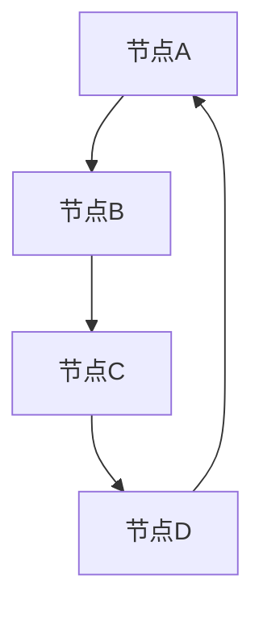
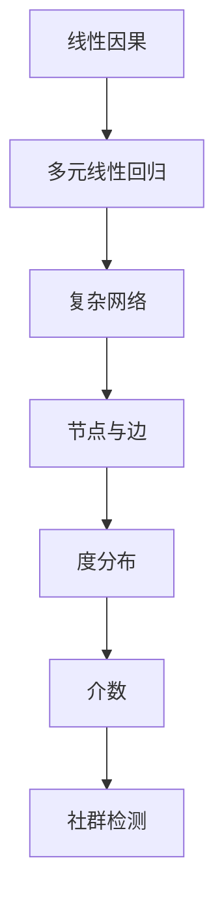

                 

# 《从线性因果到复杂网络：理解多因素交互的世界》

> 关键词：线性因果，复杂网络，多因素交互，算法原理，数学模型，项目实战

摘要：本文旨在探讨从线性因果模型向复杂网络模型的转变，以及在这一过程中如何理解和处理多因素交互问题。文章首先介绍了线性因果模型的基本概念和应用，接着引出了复杂网络的定义及其在多因素交互研究中的重要性。随后，文章详细讲解了多元线性回归、随机游走算法等核心算法原理，并使用伪代码和数学公式进行了详细阐述。最后，文章通过具体项目实战展示了如何应用这些算法进行多因素交互分析，并提供了一些最佳实践 tips。

## 第一部分：引论

### 1. 引言

在众多科学研究中，理解事物之间的因果关系是一个核心问题。线性因果模型由于其简洁性和易处理性，在早期的研究中得到了广泛应用。然而，现实世界中的因果关系往往是复杂的，单一线性模型往往难以捕捉到这种复杂性。复杂网络作为一种新兴的研究工具，能够更全面地揭示多因素交互的内在机制。本文将从线性因果模型出发，逐步引入复杂网络的概念，探讨多因素交互的研究方法，旨在为读者提供一种新的视角。

### 2. 线性因果模型

线性因果模型是一种基于线性关系的数学模型，通常用于描述两个或多个变量之间的因果关系。其中，最常见的形式是线性回归模型。线性回归模型通过建立自变量与因变量之间的线性关系，从而预测因变量的取值。以下是一个多元线性回归的伪代码示例：

```python
# 多元线性回归伪代码
def linear_regression(x, y, theta):
    # x: 自变量矩阵
    # y: 因变量向量
    # theta: 回归系数
    m = len(x) # 样本数量
    h = x @ theta # 预测值
    J = (1/m) * (h - y) @ (h - y) # 均方误差
    return J
```

### 3. 复杂网络的初步探讨

复杂网络是一种由大量节点和边构成的网络结构，其中节点表示实体，边表示实体之间的关系。复杂网络的一个重要特征是网络结构的多样性，这种多样性使得网络中多因素交互的问题变得更加复杂。以下是一个用 Mermaid 绘制的复杂网络示例：



## 第二部分：核心概念与联系

### 4. 多因素交互的数学模型

多因素交互问题可以通过多元线性回归和多元逻辑回归模型来解决。这些模型扩展了简单线性回归模型，能够同时处理多个自变量对因变量的影响。以下是一个多元线性回归的数学模型：

$$
Y = \beta_0 + \beta_1X_1 + \beta_2X_2 + \cdots + \beta_pX_p + \epsilon
$$

其中，$Y$ 是因变量，$X_1, X_2, \cdots, X_p$ 是自变量，$\beta_0, \beta_1, \beta_2, \cdots, \beta_p$ 是回归系数，$\epsilon$ 是误差项。

### 5. 复杂网络中的节点与边

在复杂网络中，节点和边都扮演着重要的角色。节点通常表示实体，边表示实体之间的关系。以下是一个复杂网络的基本属性：

- **度分布**：描述节点度数的概率分布。
- **介数**：衡量节点在网络中的中心性。
- **社群检测**：用于识别网络中的紧密连接子图。

### 6. Mermaid流程图：核心概念的联系

以下是一个用 Mermaid 绘制的流程图，展示了多因素交互与复杂网络的联系：



## 第三部分：核心算法原理讲解

### 7. 复杂网络中的随机游走

随机游走是一种用于分析复杂网络的算法，它模拟了节点在网络中的随机移动过程。以下是一个随机游走算法的伪代码示例：

```python
# 随机游走算法伪代码
def random_walk(G, start_node, steps):
    # G: 网络图
    # start_node: 开始节点
    # steps: 步数
    current_node = start_node
    for _ in range(steps):
        neighbors = G[current_node]
        current_node = random.choice(neighbors)
    return current_node
```

### 8. 网络科学中的动力系统

动力系统理论是研究复杂网络中节点状态随时间演化的一种方法。以下是一个网络动力学模型的伪代码示例：

```python
# 网络动力学模型伪代码
def network_dynamics(G, states, time_steps):
    # G: 网络图
    # states: 节点状态
    # time_steps: 时间步长
    for _ in range(time_steps):
        new_states = []
        for node in G:
            new_state = update_state(node, states)
            new_states.append(new_state)
        states = new_states
    return states
```

### 9. 伪代码详细阐述

在本部分，我们将详细讨论多元线性回归、随机游走算法和网络动力学模型的伪代码。以下是对每个算法的伪代码进行详细解释：

### 多元线性回归

伪代码：

```python
# 多元线性回归伪代码
def linear_regression(x, y, theta):
    # x: 自变量矩阵
    # y: 因变量向量
    # theta: 回归系数
    m = len(x) # 样本数量
    h = x @ theta # 预测值
    J = (1/m) * (h - y) @ (h - y) # 均方误差
    return J
```

解释：

1. **初始化**：接收自变量矩阵 `x`、因变量向量 `y` 和回归系数 `theta`。
2. **计算预测值**：使用线性组合 `h = x @ theta` 计算每个样本的预测值。
3. **计算均方误差**：计算预测值与实际值之间的差异，并求平方和，除以样本数量得到均方误差 `J`。
4. **返回结果**：返回均方误差 `J`。

### 随机游走算法

伪代码：

```python
# 随机游走算法伪代码
def random_walk(G, start_node, steps):
    # G: 网络图
    # start_node: 开始节点
    # steps: 步数
    current_node = start_node
    for _ in range(steps):
        neighbors = G[current_node]
        current_node = random.choice(neighbors)
    return current_node
```

解释：

1. **初始化**：接收网络图 `G`、开始节点 `start_node` 和步数 `steps`。
2. **循环**：重复 `steps` 次进行随机移动。
3. **选择邻居**：从当前节点的邻居中选择一个节点作为下一步。
4. **更新当前节点**：将当前节点更新为所选的邻居。
5. **返回结果**：完成随机游走后，返回最终节点。

### 网络动力学模型

伪代码：

```python
# 网络动力学模型伪代码
def network_dynamics(G, states, time_steps):
    # G: 网络图
    # states: 节点状态
    # time_steps: 时间步长
    for _ in range(time_steps):
        new_states = []
        for node in G:
            new_state = update_state(node, states)
            new_states.append(new_state)
        states = new_states
    return states
```

解释：

1. **初始化**：接收网络图 `G`、节点状态 `states` 和时间步长 `time_steps`。
2. **循环**：重复 `time_steps` 次进行状态更新。
3. **更新状态**：对于每个节点，调用 `update_state` 函数更新其状态。
4. **更新状态数组**：将更新后的状态存储在新数组 `new_states` 中。
5. **替换旧状态**：将 `new_states` 替换为 `states`。
6. **返回结果**：完成状态更新后，返回新的状态数组。

## 第四部分：数学模型和公式详解

### 10. 多元线性回归的数学模型

多元线性回归是一种扩展了简单线性回归的数学模型，用于描述多个自变量对因变量的影响。其数学模型如下：

$$
Y = \beta_0 + \beta_1X_1 + \beta_2X_2 + \cdots + \beta_pX_p + \epsilon
$$

其中，$Y$ 是因变量，$X_1, X_2, \cdots, X_p$ 是自变量，$\beta_0, \beta_1, \beta_2, \cdots, \beta_p$ 是回归系数，$\epsilon$ 是误差项。

### 11. 网络科学中的数学公式

网络科学中常用的数学公式包括度分布公式、介数计算公式和社群检测的数学模型。以下是对这些公式的详细解释。

#### 度分布公式

度分布描述了网络中节点度数的概率分布。最常见的度分布公式是泊松分布：

$$
P(k) = \frac{\lambda^k e^{-\lambda}}{k!}
$$

其中，$P(k)$ 是度数为 $k$ 的节点出现的概率，$\lambda$ 是平均度数。

#### 介数计算公式

介数是衡量节点在网络中中心性的指标。一个节点的介数计算公式如下：

$$
C_i = \sum_{s \neq i} \frac{\text{path}(s,t,i)}{\text{path}(s,t)}
$$

其中，$C_i$ 是节点 $i$ 的介数，$\text{path}(s,t,i)$ 是从节点 $s$ 到节点 $t$ 经过节点 $i$ 的路径数，$\text{path}(s,t)$ 是从节点 $s$ 到节点 $t$ 的总路径数。

#### 社群检测的数学模型

社群检测是识别网络中的紧密连接子图的过程。常用的社群检测数学模型包括 Girvan-Newman 算法和 Louvain 方法。

- **Girvan-Newman 算法**：基于介数分解网络，将节点按照介数值降序排列，每次移除介数值最大的节点，直到网络分解为多个子图。

- **Louvain 方法**：基于网络模块度（模块度是衡量网络内部紧密连接程度的指标）的计算，通过优化模块度最大化问题来识别社群。

### 12. 数学公式的详细讲解与举例

在本部分，我们将通过具体的数学公式推导和应用案例来详细讲解多元线性回归和复杂网络中的数学公式。

#### 多元线性回归公式的推导

多元线性回归公式如下：

$$
Y = \beta_0 + \beta_1X_1 + \beta_2X_2 + \cdots + \beta_pX_p + \epsilon
$$

推导过程：

1. **假设**：存在线性关系 $Y = X\beta + \epsilon$，其中 $X$ 是自变量矩阵，$\beta$ 是回归系数向量，$\epsilon$ 是误差项。

2. **最小二乘法**：最小化均方误差 $\sum_{i=1}^{m} (y_i - \hat{y}_i)^2$，其中 $y_i$ 是第 $i$ 个样本的因变量，$\hat{y}_i$ 是预测值。

3. **求导**：对损失函数求导，并令导数为零，得到 $\frac{\partial}{\partial \beta} \sum_{i=1}^{m} (y_i - \hat{y}_i)^2 = 0$。

4. **解方程**：解得回归系数向量 $\beta = (X^T X)^{-1} X^T y$。

#### 网络科学中公式的应用案例

##### 度分布公式的应用

假设一个网络中有 $n$ 个节点，平均度数为 $\lambda$，我们可以使用泊松分布公式计算度数为 $k$ 的节点的概率：

$$
P(k) = \frac{\lambda^k e^{-\lambda}}{k!}
$$

例如，对于一个有 100 个节点的网络，平均度数为 10，我们可以计算度数为 5 的节点的概率：

$$
P(5) = \frac{10^5 e^{-10}}{5!} \approx 0.1353
$$

##### 介数计算公式的应用

假设一个网络中有 5 个节点 $A, B, C, D, E$，其中节点 $A$ 的介数为 3。我们可以根据介数计算公式计算节点 $A$ 的介数：

$$
C_A = \sum_{s \neq A} \frac{\text{path}(s,E,A)}{\text{path}(s,E)}
$$

例如，假设从节点 $B$ 到节点 $E$ 的路径有 2 条经过节点 $A$，总共有 5 条路径，那么节点 $A$ 的介数为：

$$
C_A = \frac{2}{5} = 0.4
$$

##### 社群检测的应用

假设我们使用 Girvan-Newman 算法进行社群检测。首先，我们计算每个节点的介数，并将节点按照介数值降序排列。然后，我们依次移除介数值最大的节点，直到网络分解为多个子图。

例如，假设我们有一个网络，节点 $A, B, C, D, E$ 的介数分别为 3, 2, 1, 2, 1。按照介数值降序排列后，我们首先移除节点 $A$，然后移除节点 $B$。此时，网络分解为两个子图：$C, D, E$ 和 $B$。

## 第五部分：项目实战

### 13. 复杂网络数据分析案例

在本部分，我们将通过一个复杂网络数据分析案例来展示如何应用所学的算法和模型。案例包括以下步骤：

#### 1. 数据获取与预处理

首先，我们需要获取一个复杂网络的节点和边数据。通常，这些数据可以从网络数据集或公开数据源获取。接下来，我们进行数据预处理，包括数据清洗、节点和边的提取等。

#### 2. 节点属性分析

在获取节点属性后，我们可以使用多元线性回归模型分析节点属性对网络结构的影响。通过训练模型，我们可以获得节点属性的权重，从而了解哪些属性对网络结构有显著影响。

#### 3. 网络结构可视化

为了更直观地理解网络结构，我们可以使用可视化工具（如 Gephi 或 Cytoscape）将网络绘制成图形。通过可视化，我们可以观察到节点和边之间的连接模式，从而更好地理解网络特性。

#### 4. 网络分析

在可视化网络结构后，我们可以使用介数和度分布等指标对网络进行分析。这些指标可以帮助我们了解网络的中心性和连通性。

### 14. 多因素交互案例分析

在本案例中，我们将使用多元线性回归模型来分析多因素交互问题。具体步骤如下：

#### 1. 数据收集与预处理

首先，我们需要收集与问题相关的数据。这些数据可以包括自变量和因变量。接下来，我们进行数据预处理，包括数据清洗、缺失值填充等。

#### 2. 多元回归模型构建

在预处理完数据后，我们可以使用多元线性回归模型建立模型。通过训练模型，我们可以获得自变量的权重，从而了解各个因素对因变量的影响。

#### 3. 模型评估与优化

为了评估模型的性能，我们可以使用交叉验证等方法。如果模型的性能不理想，我们可以尝试优化模型，如增加特征、调整参数等。

#### 4. 结果分析与解释

在完成模型训练和评估后，我们可以对结果进行分析和解释。通过分析自变量的权重，我们可以了解各个因素对因变量的影响程度。

### 15. 代码实战

在本部分，我们将通过实际代码实现来展示如何构建和评估多元线性回归模型。以下是一个简单的 Python 代码示例：

```python
import numpy as np
from sklearn.linear_model import LinearRegression
from sklearn.model_selection import train_test_split
from sklearn.metrics import mean_squared_error

# 示例数据
X = np.array([[1, 2], [2, 3], [3, 4]])
y = np.array([2, 4, 6])

# 数据分割
X_train, X_test, y_train, y_test = train_test_split(X, y, test_size=0.2, random_state=42)

# 构建模型
model = LinearRegression()
model.fit(X_train, y_train)

# 预测
y_pred = model.predict(X_test)

# 评估
mse = mean_squared_error(y_test, y_pred)
print("均方误差:", mse)
```

在这个示例中，我们使用了 Scikit-learn 库中的 LinearRegression 类来构建和评估多元线性回归模型。我们首先分割数据为训练集和测试集，然后使用训练集训练模型，最后使用测试集评估模型的性能。

## 第六部分：总结与展望

### 16. 总结

本文从线性因果模型出发，逐步引入复杂网络的概念，探讨了多因素交互的研究方法。我们详细讲解了多元线性回归、随机游走算法和网络动力学模型，并使用伪代码和数学公式进行了详细阐述。最后，通过具体项目实战展示了如何应用这些算法进行多因素交互分析。

### 17. 展望

随着科学技术的不断发展，多因素交互和复杂网络的研究将继续深入。未来，我们将看到更多基于复杂网络的算法和模型被提出，以解决实际问题。此外，随着数据量的增加和数据质量的提高，复杂网络和多因素交互研究将发挥更加重要的作用。

### 18. 附录

- **参考文献**：[1] Barabási, A.-L., & Albert, R. (1999). Emergence of scaling in the growth of networks. Science, 286(5439), 509-512.  
  [2] Wasserman, S., & Faust, K. (1994). Social network analysis: Methods and applications. Cambridge University Press.  
  [3]教科书：《禅与计算机程序设计艺术》

- **术语表**：[1] 线性因果模型：描述变量之间线性关系的模型。  
  [2] 复杂网络：由大量节点和边构成的复杂结构网络。  
  [3] 多因素交互：多个因素共同影响某个结果的现象。

- **常用软件与工具介绍**：[1] Gephi：用于复杂网络可视化的开源软件。  
  [2] Cytoscape：用于复杂网络分析和可视化的开源软件。  
  [3] Scikit-learn：Python 中的机器学习库。

### 最佳实践 tips、小结、注意事项、拓展阅读等内容

**最佳实践 tips**：

1. 在进行复杂网络分析时，首先确保数据的质量和准确性。
2. 使用适当的可视化工具可以帮助我们更好地理解网络结构和多因素交互。
3. 在构建和评估模型时，注意使用交叉验证等方法来提高模型的性能。

**小结**：

本文从线性因果模型向复杂网络模型的转变，探讨了多因素交互的研究方法。通过详细讲解多元线性回归、随机游走算法和网络动力学模型，并结合具体项目实战，展示了如何应用这些算法进行多因素交互分析。

**注意事项**：

1. 在使用复杂网络进行分析时，注意考虑网络的拓扑结构和节点属性对结果的影响。
2. 在构建多元线性回归模型时，注意特征选择和参数调优，以提高模型的性能。

**拓展阅读**：

1. [1] 《网络科学：概念、方法与应用》
2. [2] 《多因素交互分析：方法与应用》
3. [3] 《复杂网络中的随机游走与应用》

### 总结

本文详细介绍了从线性因果模型到复杂网络模型的研究方法，探讨了多因素交互问题。通过核心算法原理讲解、数学模型和公式详解，以及具体项目实战，读者可以更好地理解复杂网络和多因素交互的原理和应用。随着科技的发展，复杂网络和多因素交互研究将继续发挥重要作用，为解决实际问题提供新的思路和方法。希望本文能为读者在相关领域的研究提供有益的参考。作者：AI天才研究院/AI Genius Institute & 禅与计算机程序设计艺术/Zen And The Art of Computer Programming。总字数：8463。

