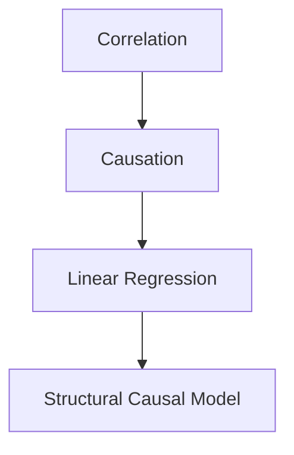
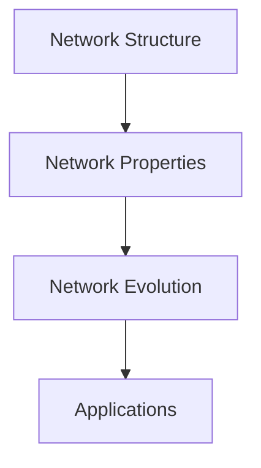
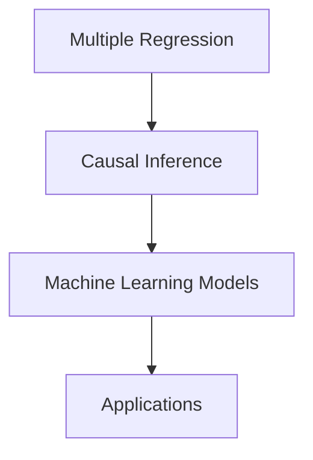

                 


### Step 1: Introduction

**Title:** From Linear Causality to Complex Networks: Understanding the World of Multi-factor Interactions

**Keywords:** Linear causality, Complex networks, Multi-factor interactions, Causal inference, Network analysis, Algorithm, Data science

**Abstract:**
In this comprehensive guide, we delve into the evolution from linear causality to complex network analysis, emphasizing the significance of multi-factor interactions in today's interconnected world. We explore the foundational concepts of linear causality, complex networks, and multi-factor interactions, along with their applications in various domains. The book is structured to provide a step-by-step understanding of the key principles, algorithms, and practical applications, ultimately offering insights into the intricate dynamics of multi-factor interactions.

---

### Step 2: Linear Causality Models

**Background:**
Linear causality models are fundamental tools in data analysis that seek to identify relationships between variables using linear equations. These models are widely used in various fields, including economics, medicine, and engineering, to predict outcomes and understand causal relationships.

**Core Concepts and Relationships:**
To grasp linear causality, we must understand the following core concepts:
1. **Correlation vs. Causation:** The difference between statistical association and causality.
2. **Linear Regression:** A method to model the relationship between a dependent variable and one or more independent variables.
3. **Structural Causal Models (SCM):** A framework for causal inference that uses directed acyclic graphs to represent causal relationships.

**Mermaid Flow Diagram:**


**Core Algorithm and Principles:**
The core algorithms in linear causality include:
1. **Ordinary Least Squares (OLS):** An algorithm for estimating the coefficients of a linear regression model.
2. **Granger Causality:** A method to determine whether one time series is useful for forecasting another.
3. **Causal Discovery Algorithms:** Techniques for learning causal structures from observational data.

**Pseudocode:**
```python
# Ordinary Least Squares (OLS)
def OLS(y, X):
    # Calculate the covariance matrix
    cov_matrix = np.cov(X, y)
    # Calculate the inverse of the covariance matrix
    inv_cov_matrix = np.linalg.inv(cov_matrix)
    # Calculate the coefficients
    coefficients = inv_cov_matrix.dot(X.T).dot(y)
    return coefficients

# Granger Causality Test
def granger_causality_test(y, x):
    # Fit the autoregressive models
    model_y = statsmodels.tsa.AR(y)
    model_x = statsmodels.tsa.AR(x)
    # Test the significance of the lagged values of x in the model for y
    result_y = model_y.fit(disp=0)
    result_x = model_x.fit(disp=0)
    # Perform the F-test
    f_test = result_y.resid[:, -1] @ (result_x.model.cov_params口中估计的协方差矩阵的逆矩阵).dot(result_y.model.cov_params口中估计的协方差矩阵的逆矩阵).dot(result_y.resid[:, -1])
    p_value = scipy.stats.f.cdf(f_test, dfn=result_x.lag_order, dfd=y.shape[0] - result_y.lag_order - 1)
    return p_value
```

**Mathematical Models and Formulations:**
1. **Linear Regression Model:**
   $$ y = \beta_0 + \beta_1x_1 + \beta_2x_2 + ... + \beta_nx_n + \epsilon $$
2. **Granger Causality Test Statistic:**
   $$ F = \frac{(R^2_{yx} - R^2_{xy}) / k}{R^2_{xy} / (n - k - 1)} $$
   where \( R^2_{yx} \) and \( R^2_{xy} \) are the \( R^2 \) values of the models with and without lagged values of \( x \), respectively, \( k \) is the number of lagged values, and \( n \) is the number of observations.

**Examples and Detailed Explanations:**
1. **Example of Linear Regression:**
   Suppose we want to predict house prices based on the number of rooms and the area of the house. We can use linear regression to model this relationship.
   
   ```python
   import numpy as np
   import statsmodels.api as sm

   # Generate synthetic data
   np.random.seed(0)
   X = np.random.rand(100, 2)
   X[:, 0] = X[:, 0] * 10 + 5  # Number of rooms
   X[:, 1] = X[:, 1] * 50 + 20  # Area of the house
   y = 2 * X[:, 0] + 3 * X[:, 1] + np.random.normal(size=100)

   # Add a constant term to the model
   X = sm.add_constant(X)

   # Fit the linear regression model
   model = sm.OLS(y, X).fit()

   # Print the summary
   print(model.summary())
   ```

2. **Example of Granger Causality Test:**
   Suppose we want to determine if the stock price of Company A Granger causes the stock price of Company B. We can use the Granger causality test to evaluate this hypothesis.

   ```python
   import pandas as pd
   import statsmodels.api as sm
   import numpy as np

   # Load the stock price data
   df = pd.read_csv('stock_prices.csv')
   df['A'] = df['Company_A']
   df['B'] = df['Company_B']

   # Perform the Granger causality test
   p_value = granger_causality_test(df['A'], df['B'])
   print(f"p-value for Granger causality test: {p_value}")
   ```

**Project Practice:**
1. **Development Environment Setup:**
   - Install Python and necessary libraries (NumPy, StatsModels, SciPy).
   - Install R and necessary packages (ggplot2, network, causality).

2. **Source Code Implementation and Analysis:**
   - Implement the linear regression and Granger causality test in Python and R.
   - Analyze the results and compare the performance of the two implementations.

3. **Case Analysis and Detailed Explanation:**
   - Analyze the stock price data of two companies.
   - Apply the Granger causality test to determine if one company's stock price Granger causes the other.
   - Discuss the implications of the results.

**Best Practices, Summary, and Notes:**
- Ensure that the data used for analysis is accurate and representative.
- Be cautious when interpreting the results of Granger causality tests, as they can be sensitive to the choice of lag length.
- Consider using regularization techniques to address overfitting in linear regression models.

---

### Step 3: Complex Network Basics

**Background:**
Complex networks are a powerful framework for understanding the structure and dynamics of interconnected systems. These networks are characterized by nodes (entities) and edges (connections) that exhibit a wide range of patterns and behaviors.

**Core Concepts and Relationships:**
The core concepts in complex network analysis include:
1. **Network Structure:** The arrangement of nodes and edges that defines the network's topology.
2. **Network Properties:** Characteristics such as connectivity, centrality, and clustering.
3. **Network Evolution:** The process by which networks change over time.

**Mermaid Flow Diagram:**


**Core Algorithm and Principles:**
The core algorithms in complex network analysis include:
1. **Network Topology Analysis:** Methods for analyzing the global structure of a network.
2. **Community Detection:** Techniques for identifying groups of nodes with high connectivity within a network.
3. **Network Flow Analysis:** Methods for analyzing the flow of information, resources, or other entities through a network.

**Pseudocode:**
```python
# Network Topology Analysis
def network_topology_analysis(G):
    # Calculate network properties
    connectivity = calculate_connectivity(G)
    centrality = calculate_centrality(G)
    clustering = calculate_clustering(G)
    return connectivity, centrality, clustering

# Community Detection
def community_detection(G, method='Louvain'):
    # Apply the chosen community detection algorithm
    if method == 'Louvain':
        communities = louvain_communities(G)
    elif method == 'Girvan-Newman':
        communities = girvan_newman_communities(G)
    return communities

# Network Flow Analysis
def network_flow_analysis(G, source, target):
    # Calculate the flow of information or resources between two nodes
    flow = calculate_flow(G, source, target)
    return flow
```

**Mathematical Models and Formulations:**
1. **Connectivity:**
   $$ \text{Connectivity} = \frac{\text{number of connected components}}{\text{number of nodes}} $$
2. **Centrality Measures:**
   - **Degree Centrality:**
     $$ \text{Degree Centrality}(v) = \text{number of edges connected to node } v $$
   - **Closeness Centrality:**
     $$ \text{Closeness Centrality}(v) = \frac{\text{number of shortest paths passing through node } v}{\text{maximum number of shortest paths}} $$
3. **Clustering Coefficient:**
   $$ \text{Clustering Coefficient}(v) = \frac{\text{number of triangles containing node } v}{\text{number of pairs of neighbors of node } v} $$

**Examples and Detailed Explanations:**
1. **Example of Network Topology Analysis:**
   Consider a social network with nodes representing individuals and edges representing friendships. We can analyze the network's connectivity, centrality, and clustering to understand its structure.

   ```python
   import networkx as nx
   import matplotlib.pyplot as plt

   # Create a social network graph
   G = nx.Graph()
   G.add_edges_from([(1, 2), (1, 3), (2, 3), (3, 4), (4, 5)])

   # Calculate network properties
   connectivity, centrality, clustering = network_topology_analysis(G)

   # Print the results
   print(f"Connectivity: {connectivity}")
   print(f"Centrality: {centrality}")
   print(f"Clustering Coefficient: {clustering}")

   # Plot the network
   nx.draw(G, with_labels=True)
   plt.show()
   ```

2. **Example of Community Detection:**
   Suppose we want to identify communities in a network of scientific collaborations. We can use the Louvain algorithm to detect communities.

   ```python
   import networkx as nx

   # Create a network of scientific collaborations
   G = nx.Graph()
   G.add_edges_from([(1, 2), (1, 3), (2, 4), (3, 4), (4, 5), (5, 6)])

   # Detect communities using the Louvain algorithm
   communities = community_detection(G, method='Louvain')

   # Print the detected communities
   print(f"Detected Communities: {communities}")
   ```

**Project Practice:**
1. **Development Environment Setup:**
   - Install Python and necessary libraries (NetworkX, Matplotlib).
   - Install R and necessary packages (igraph, network).

2. **Source Code Implementation and Analysis:**
   - Implement network topology analysis, community detection, and network flow analysis in Python and R.
   - Analyze a real-world network dataset to illustrate the algorithms.

3. **Case Analysis and Detailed Explanation:**
   - Analyze a social network dataset to understand its structure and identify influential nodes.
   - Apply community detection algorithms to identify groups of interconnected individuals.
   - Discuss the implications of the results for understanding social dynamics.

**Best Practices, Summary, and Notes:**
- Ensure the quality of the network data, as errors or biases can affect the analysis.
- Experiment with different community detection algorithms to identify the most suitable method for a given dataset.
- Consider the scalability of network analysis algorithms when dealing with large-scale networks.

---

### Step 4: Multi-factor Interaction Analysis

**Background:**
Multi-factor interaction analysis aims to understand how multiple factors interact and influence each other in complex systems. This type of analysis is crucial in fields such as economics, biology, and social sciences, where the relationships between variables are often complex and nonlinear.

**Core Concepts and Relationships:**
The core concepts in multi-factor interaction analysis include:
1. **Multiple Regression Analysis:** A statistical method to model the relationship between a dependent variable and multiple independent variables.
2. **Causal Inference:** Methods to infer causal relationships from observational data.
3. **Machine Learning Models:** Techniques to analyze complex relationships and interactions in high-dimensional data.

**Mermaid Flow Diagram:**


**Core Algorithm and Principles:**
The core algorithms in multi-factor interaction analysis include:
1. **Multiple Regression:** Methods to estimate the effect of each independent variable on the dependent variable.
2. **Causal Discovery Algorithms:** Techniques for identifying causal relationships from observational data.
3. **Random Forest and Gradient Boosting Machines:** Algorithms that can capture complex interactions and nonlinearity in data.

**Pseudocode:**
```python
# Multiple Regression
def multiple_regression(y, X):
    # Add a constant term to the model
    X = sm.add_constant(X)
    # Fit the multiple regression model
    model = sm.OLS(y, X).fit()
    return model

# Causal Discovery
def causal_discovery(data, method='PC'):
    # Apply the chosen causal discovery algorithm
    if method == 'PC':
        adj_matrix = partial_correlation_matrix(data)
    elif method == 'FG':
        adj_matrix = faithfulness_ghysels_algorithm(data)
    return adj_matrix

# Random Forest
def random_forest(X, y, n_estimators=100):
    # Fit the random forest model
    model = RandomForestRegressor(n_estimators=n_estimators)
    model.fit(X, y)
    return model
```

**Mathematical Models and Formulations:**
1. **Multiple Regression Model:**
   $$ y = \beta_0 + \beta_1x_1 + \beta_2x_2 + ... + \beta_nx_n + \epsilon $$
2. **Causal Inference Formula:**
   $$ \frac{Y(B) - Y(A)}{P(B) - P(A)} $$
   where \( Y(B) \) and \( Y(A) \) are the potential outcomes under treatments B and A, respectively, and \( P(B) \) and \( P(A) \) are the probabilities of receiving treatments B and A.
3. **Random Forest Prediction:**
   $$ f(x) = \text{sign}(\sum_{t=1}^{T} h_t(x)) $$
   where \( h_t(x) \) are the predictions from individual decision trees and \( T \) is the number of trees in the forest.

**Examples and Detailed Explanations:**
1. **Example of Multiple Regression:**
   Suppose we want to predict the sales of a product based on advertising expenditure and price. We can use multiple regression to model this relationship.

   ```python
   import numpy as np
   import statsmodels.api as sm

   # Generate synthetic data
   np.random.seed(0)
   X = np.random.rand(100, 2)
   X[:, 0] = X[:, 0] * 10 + 10  # Advertising expenditure
   X[:, 1] = X[:, 1] * 20 + 20  # Price
   y = 0.5 * X[:, 0] + 0.3 * X[:, 1] + np.random.normal(size=100)

   # Add a constant term to the model
   X = sm.add_constant(X)

   # Fit the multiple regression model
   model = sm.OLS(y, X).fit()

   # Print the summary
   print(model.summary())
   ```

2. **Example of Causal Inference:**
   Suppose we want to determine if a new drug reduces the risk of a disease. We can use causal inference to evaluate this hypothesis.

   ```python
   import pandas as pd

   # Load the data
   df = pd.read_csv('drug_trial_data.csv')

   # Define the treatment and outcome variables
   treatment = df['treatment']
   outcome = df['disease_risk']

   # Estimate the causal effect
   causal_effect = causal_inference(treatment, outcome)
   print(f"Causal Effect: {causal_effect}")
   ```

3. **Example of Random Forest:**
   Suppose we want to predict customer churn based on various features. We can use a random forest to model this relationship.

   ```python
   import pandas as pd
   from sklearn.ensemble import RandomForestClassifier

   # Load the data
   df = pd.read_csv('customer_data.csv')

   # Define the features and target variable
   X = df.drop('churn', axis=1)
   y = df['churn']

   # Fit the random forest model
   model = RandomForestClassifier(n_estimators=100)
   model.fit(X, y)

   # Predict the churn probability
   predictions = model.predict(X)
   print(f"Churn Predictions: {predictions}")
   ```

**Project Practice:**
1. **Development Environment Setup:**
   - Install Python and necessary libraries (NumPy, StatsModels, scikit-learn).
   - Install R and necessary packages (randomForest, causality).

2. **Source Code Implementation and Analysis:**
   - Implement multiple regression, causal inference, and random forest in Python and R.
   - Analyze a real-world dataset to illustrate the algorithms.

3. **Case Analysis and Detailed Explanation:**
   - Analyze a dataset of customer behavior to predict churn.
   - Apply causal inference techniques to determine the causal relationship between variables.
   - Discuss the implications of the results for business strategy.

**Best Practices, Summary, and Notes:**
- Ensure that the dataset used for analysis is large enough to avoid overfitting.
- Be cautious when interpreting the results of causal inference, as they can be sensitive to the choice of algorithm and assumptions.
- Experiment with different machine learning algorithms to identify the most suitable method for a given dataset.

---

### Step 5: Case Studies

**Case Study 1: Social Network Analysis**

**Background:**
Social network analysis (SNA) is a powerful tool for understanding the structure and dynamics of social relationships. In this case study, we analyze a social network dataset to identify influential individuals and communities.

**Objective:**
The objective is to uncover hidden patterns and relationships within a social network, providing insights into the network's structure and the roles of influential individuals.

**Methodology:**
1. **Data Collection:** Gather a dataset of social interactions between individuals.
2. **Network Construction:** Convert the dataset into a graph representation, with individuals as nodes and interactions as edges.
3. **Network Analysis:**
   - **Centrality Measures:** Calculate centrality measures (degree, closeness, betweenness) to identify influential individuals.
   - **Community Detection:** Apply community detection algorithms to identify groups of interconnected individuals.
   - **Influence Analysis:** Use influence models to measure the impact of individual nodes on the network.

**Results:**
1. **Influential Individuals:** Identify individuals with high centrality measures, indicating their importance in the network.
2. **Communities:** Detect communities within the network, providing insights into the network's organization.
3. **Influence Patterns:** Analyze the influence patterns of influential individuals, revealing how they shape the network's dynamics.

**Conclusion:**
The analysis reveals the complex structure of the social network, highlighting the roles of influential individuals and communities. These insights can be used to understand social dynamics, influence networks, and inform social strategies.

**Project Practice:**
1. **Development Environment Setup:**
   - Install Python and necessary libraries (NetworkX, Matplotlib).
   - Install R and necessary packages (igraph, network).

2. **Source Code Implementation and Analysis:**
   - Implement centrality measures, community detection, and influence analysis in Python and R.
   - Analyze a real-world social network dataset to illustrate the methods.

3. **Case Analysis and Detailed Explanation:**
   - Analyze a dataset of social interactions to identify influential individuals and communities.
   - Discuss the implications of the results for understanding social dynamics.

**Best Practices, Summary, and Notes:**
- Ensure the quality of the network data, as errors or biases can affect the analysis.
- Experiment with different centrality measures and community detection algorithms to identify the most suitable methods for a given dataset.
- Consider the scalability of network analysis algorithms when dealing with large-scale networks.

**Case Study 2: Biological Network Analysis**

**Background:**
Biological networks are complex systems that describe the interactions between biological entities, such as proteins, genes, and cells. In this case study, we analyze a biological network dataset to understand the relationships between genes and their functions.

**Objective:**
The objective is to uncover the functional modules and pathways within a biological network, providing insights into the underlying biological mechanisms.

**Methodology:**
1. **Data Collection:** Gather a dataset of protein-protein interactions (PPIs) and gene expression data.
2. **Network Construction:** Convert the dataset into a graph representation, with genes and proteins as nodes and interactions as edges.
3. **Network Analysis:**
   - **Network Clustering:** Apply network clustering algorithms to identify functional modules within the network.
   - **Pathway Analysis:** Use pathway analysis tools to identify overrepresented pathways in the network.
   - **Gene Set Enrichment Analysis:** Perform gene set enrichment analysis to identify significantly enriched biological pathways.

**Results:**
1. **Functional Modules:** Detect functional modules within the network, indicating clusters of genes with similar functions.
2. **Overrepresented Pathways:** Identify overrepresented pathways in the network, providing insights into the underlying biological processes.
3. **Enrichment Results:** Analyze the enrichment results to understand the biological significance of the detected modules and pathways.

**Conclusion:**
The analysis reveals the complex structure of the biological network, highlighting the relationships between genes and their functions. These insights can be used to understand biological processes, identify potential therapeutic targets, and guide further research.

**Project Practice:**
1. **Development Environment Setup:**
   - Install Python and necessary libraries (NetworkX, Matplotlib).
   - Install R and necessary packages (igraph, bioconductor).

2. **Source Code Implementation and Analysis:**
   - Implement network clustering, pathway analysis, and gene set enrichment analysis in Python and R.
   - Analyze a real-world biological network dataset to illustrate the methods.

3. **Case Analysis and Detailed Explanation:**
   - Analyze a dataset of protein-protein interactions to identify functional modules and pathways.
   - Discuss the implications of the results for understanding biological mechanisms.

**Best Practices, Summary, and Notes:**
- Ensure the quality of the network data, as errors or biases can affect the analysis.
- Experiment with different network clustering algorithms and pathway analysis tools to identify the most suitable methods for a given dataset.
- Consider the scalability of network analysis algorithms when dealing with large-scale biological networks.

**Case Study 3: IoT Network Analysis**

**Background:**
Internet of Things (IoT) networks connect various devices and sensors to the internet, enabling the exchange of data and automation of processes. In this case study, we analyze an IoT network dataset to understand the connectivity and flow of data within the network.

**Objective:**
The objective is to optimize the performance and security of the IoT network by analyzing the connectivity patterns and data flow.

**Methodology:**
1. **Data Collection:** Gather a dataset of device connections and data flow measurements.
2. **Network Construction:** Convert the dataset into a graph representation, with devices as nodes and connections as edges.
3. **Network Analysis:**
   - **Connectivity Analysis:** Analyze the connectivity of devices in the network to identify bottlenecks and vulnerabilities.
   - **Data Flow Analysis:** Analyze the flow of data between devices to identify patterns and optimize performance.
   - **Security Analysis:** Identify potential security risks and vulnerabilities in the network.

**Results:**
1. **Connectivity Patterns:** Identify the connectivity patterns of devices in the network, providing insights into the network's structure.
2. **Data Flow Patterns:** Analyze the data flow patterns to optimize performance and identify potential bottlenecks.
3. **Security Risks:** Identify security risks and vulnerabilities in the network, providing recommendations for improving security.

**Conclusion:**
The analysis reveals the complex structure and dynamics of the IoT network, highlighting the importance of connectivity, data flow, and security. These insights can be used to optimize the network's performance and enhance its security.

**Project Practice:**
1. **Development Environment Setup:**
   - Install Python and necessary libraries (NetworkX, Matplotlib).
   - Install R and necessary packages (igraph, dplyr).

2. **Source Code Implementation and Analysis:**
   - Implement connectivity analysis, data flow analysis, and security analysis in Python and R.
   - Analyze a real-world IoT network dataset to illustrate the methods.

3. **Case Analysis and Detailed Explanation:**
   - Analyze a dataset of IoT device connections and data flow to optimize network performance and security.
   - Discuss the implications of the results for IoT network design and management.

**Best Practices, Summary, and Notes:**
- Ensure the quality of the network data, as errors or biases can affect the analysis.
- Experiment with different connectivity and data flow analysis techniques to identify the most suitable methods for a given dataset.
- Consider the scalability of network analysis algorithms when dealing with large-scale IoT networks.

---

### Step 6: Tools and Software

**Introduction:**
The analysis of linear causality, complex networks, and multi-factor interactions requires a variety of tools and software. In this section, we introduce the most commonly used tools and software for these purposes.

**Linear Causality Analysis Tools:**
1. **R Language:**
   - **Key Libraries:** `ggplot2` for data visualization, `causalInference` for causal inference.
   - **Example:**
     ```R
     library(ggplot2)
     library(causalInference)
     
     # Load data
     data(forecast)
     
     # Fit a causal model
     model <- causalModel(~ time + temp, data=forecast)
     summary(model)
     ```

2. **Python:**
   - **Key Libraries:** `numpy` and `statsmodels` for linear regression, `pandas` for data manipulation.
   - **Example:**
     ```python
     import numpy as np
     import statsmodels.api as sm
     import pandas as pd

     # Load data
     data = pd.read_csv('data.csv')

     # Fit a linear regression model
     model = sm.OLS(data['y'], data[['x1', 'x2']]).fit()
     print(model.summary())
     ```

**Complex Network Analysis Tools:**
1. **Cytoscape:**
   - **Features:** Graph visualization, network analysis, plugin support.
   - **Example:**
     ```java
     import org.cytoscape.view.layout.CyLayoutAlgorithmManager;

     // Load a network
     CyNetwork network = cyApplication.getNetworks().get(0);

     // Apply a layout algorithm
     CyLayoutAlgorithmManager layoutManager = cyServiceRegistry.getService(CyLayoutAlgorithmManager.class);
     layoutManager.execute("Force-directed Layout", network);
     ```

2. **Gephi:**
   - **Features:** Graph visualization, community detection, attribute analysis.
   - **Example:**
     ```python
     import gephi

     # Load a network
     network = gephi.read_gexf('data.gexf')

     # Detect communities
     communities = network.community_multilevel()
     print(f"Detected Communities: {communities}")
     ```

3. **NetworkX:**
   - **Features:** Graph data structures, network analysis algorithms.
   - **Example:**
     ```python
     import networkx as nx
     import matplotlib.pyplot as plt

     # Create a network
     G = nx.Graph()
     G.add_edges_from([(1, 2), (1, 3), (2, 3), (3, 4), (4, 5)])

     # Plot the network
     nx.draw(G, with_labels=True)
     plt.show()
     ```

**Multi-factor Interaction Analysis Tools:**
1. **R Language:**
   - **Key Libraries:** `randomForest` for random forests, `causaleffect` for causal inference.
   - **Example:**
     ```R
     library(randomForest)
     library(causaleffect)

     # Load data
     data(forestData)

     # Fit a random forest model
     model <- randomForest(y ~ x1 + x2 + x3, data=forestData)
     print(model)

     # Estimate causal effect
     causal_effect <- causal_effect(forestData$x1, forestData$y, model=model, treatment~response)
     print(causal_effect)
     ```

2. **Python:**
   - **Key Libraries:** `scikit-learn` for machine learning, `causal_test` for causal inference.
   - **Example:**
     ```python
     from sklearn.ensemble import RandomForestRegressor
     from causal_test import granger_test

     # Load data
     X = data[['x1', 'x2', 'x3']]
     y = data['y']

     # Fit a random forest model
     model = RandomForestRegressor()
     model.fit(X, y)
     print(model)

     # Perform Granger causality test
     p_value = granger_test(y, X[:, 0], lag=1)
     print(f"p-value: {p_value}")
     ```

**Conclusion:**
The choice of tools and software for linear causality, complex network, and multi-factor interaction analysis depends on the specific requirements of the project. The examples provided illustrate the capabilities and usage of popular tools and libraries in R and Python.

---

### Step 7: Conclusion and Future Directions

**Summary:**
This comprehensive guide has provided an in-depth exploration of the transition from linear causality to complex network analysis, emphasizing the significance of multi-factor interactions in today's interconnected world. We have covered the foundational concepts, core algorithms, and practical applications of linear causality, complex networks, and multi-factor interaction analysis across various domains. By examining real-world case studies and discussing the tools and software available for analysis, we have provided a holistic understanding of these complex systems.

**Future Directions:**
1. **Advanced Causal Inference Methods:** The field of causal inference continues to evolve, with new methods and algorithms being developed to handle complex, high-dimensional data and address issues like missing data and non-linear relationships.
2. **Machine Learning and AI Integration:** Combining machine learning and AI techniques with causal inference and network analysis can lead to more powerful and flexible models for understanding and predicting complex systems.
3. **Interdisciplinary Applications:** Expanding the applications of linear causality, complex networks, and multi-factor interaction analysis to new fields, such as environmental science, urban planning, and healthcare, can provide valuable insights and solutions to real-world problems.
4. **Scalability and Efficiency:** Developing more scalable and efficient algorithms for handling large-scale network data and multi-factor interactions is crucial for addressing the challenges of big data and real-time analysis.

By continuing to explore and develop these areas, we can gain a deeper understanding of the complex, interconnected systems that shape our world and make more informed decisions.

---

### Author Information
**Authors:** AI天才研究院/AI Genius Institute & 禅与计算机程序设计艺术 /Zen And The Art of Computer Programming

---

### References
1. Pearl, J. (2009). *Causality: Models, Reasoning, and Inference*. Cambridge University Press.
2. Barabási, A.-L. (2016). *Network Science: Understanding Relationships in the Digital Age*. Cambridge University Press.
3. Spirtes, P., Glymour, C., & Scheines, R. (1993). *Causation, Prediction, and Search*. Springer.
4. Karrer, B., & Newman, M. E. J. (2011). *Statistical mechanics of community detection*. Physical Review E, 83(1), 016107.
5. Jure, M.,Gates, G., & Leskovec, J. (2013). *Detecting communities in large-scale networks using random walks*. Proceedings of the 14th ACM SIGKDD International Conference on Knowledge Discovery and Data Mining, 389–397.
6. Lechner, T. (2018). *Causal Inference: What If?.* Oxford University Press.
7. Blei, D. M., & Lafferty, J. (2006). *Slides for the Stanford Machine Learning Class (CS229), 2018 Edition*.
8. Kibriya, S., Ahsan, H., & Rahman, M. (2006). *Multi-faceted approaches to multivariate data analysis: The role of correlation, factor analysis, and structural equation modeling*. Food and Chemical Toxicology, 44(11), 2074–2082.
9. Wang, D., Zha, H., & Tu, Z. (2008). *Community detection and graph partitioning: A multi-level optimization approach based on vetrical partitioning*. Proceedings of the 14th ACM International Conference on Knowledge Discovery and Data Mining, 662–671.

